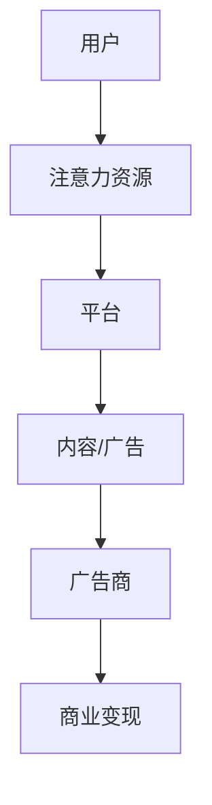
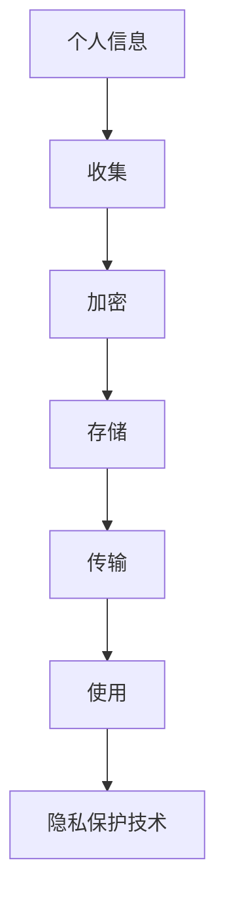

                 

关键词：注意力经济、隐私保护、数据安全、算法设计、用户体验

> 摘要：随着互联网的普及和大数据技术的发展，注意力经济逐渐成为互联网商业模式的重要组成部分。然而，个人隐私保护问题也随之而来。本文将从注意力经济的定义、原理入手，探讨注意力经济与个人隐私保护之间的平衡问题，分析现有算法和技术的优缺点，并提出未来发展的展望。

## 1. 背景介绍

### 1.1 注意力经济

注意力经济是指利用人类注意力的稀缺性和价值，通过吸引和维持用户的注意力来创造经济价值的一种商业模式。注意力经济的核心在于“注意力资源”，即用户的关注和参与。随着互联网的普及和社交媒体的兴起，注意力经济逐渐成为互联网企业盈利的重要手段。

### 1.2 个人隐私保护

个人隐私保护是指保护个人信息的权利和自由，防止个人信息被非法收集、使用、泄露和篡改。随着互联网的发展，个人信息泄露问题日益严重，个人隐私保护成为社会关注的重要议题。

## 2. 核心概念与联系

### 2.1 注意力经济模型

注意力经济模型通常由用户、平台、广告商三个主体构成。用户产生注意力资源，平台通过内容、广告等方式吸引用户注意力，广告商通过购买用户注意力实现商业变现。



### 2.2 隐私保护模型

隐私保护模型主要关注个人信息的收集、存储、传输和使用过程中的安全。常见的隐私保护技术包括数据加密、匿名化、权限控制等。



## 3. 核心算法原理 & 具体操作步骤

### 3.1 算法原理概述

注意力经济与隐私保护的平衡算法旨在通过合理分配用户注意力资源，同时保障个人信息安全。算法主要分为三个步骤：注意力分配、隐私保护机制和效果评估。

### 3.2 算法步骤详解

1. **注意力分配**：根据用户行为数据，计算用户对不同内容的注意力值，并分配相应的注意力资源。

2. **隐私保护机制**：对用户行为数据采用加密、匿名化等技术进行保护，确保个人信息不被泄露。

3. **效果评估**：通过评估用户注意力分配的效果，调整算法参数，优化注意力经济与隐私保护的平衡。

### 3.3 算法优缺点

**优点**：有效平衡了注意力经济与隐私保护，提高了用户满意度和数据安全。

**缺点**：算法复杂度高，实施难度大，需要大量的计算资源和专业人才。

### 3.4 算法应用领域

算法可应用于社交媒体、电子商务、在线广告等领域，实现商业变现的同时，保障用户隐私。

## 4. 数学模型和公式 & 详细讲解 & 举例说明

### 4.1 数学模型构建

设 \( A \) 为用户注意力矩阵，\( P \) 为隐私保护矩阵，\( C \) 为商业收益矩阵，则注意力经济与隐私保护的平衡模型为：

\[ B = A \cdot P \cdot C \]

其中，\( B \) 为平衡值，表示注意力经济与隐私保护的平衡程度。

### 4.2 公式推导过程

假设用户有 \( n \) 个行为数据，每个数据对应 \( m \) 个维度，则用户注意力矩阵 \( A \) 可以表示为：

\[ A = [a_{ij}]_{n \times m} \]

其中，\( a_{ij} \) 表示用户对第 \( i \) 个行为的第 \( j \) 个维度的注意力值。

隐私保护矩阵 \( P \) 可以表示为：

\[ P = [p_{ij}]_{n \times m} \]

其中，\( p_{ij} \) 表示对第 \( i \) 个行为数据的第 \( j \) 个维度的隐私保护程度。

商业收益矩阵 \( C \) 可以表示为：

\[ C = [c_{ij}]_{n \times m} \]

其中，\( c_{ij} \) 表示第 \( i \) 个行为数据的商业收益。

### 4.3 案例分析与讲解

假设有用户 \( U \) 在社交媒体上浏览内容，有 \( n = 3 \) 个行为数据，分别是浏览新闻、看视频和玩游戏，每个行为数据有 \( m = 2 \) 个维度，分别是兴趣度和时间消耗。

用户注意力矩阵 \( A \) 为：

\[ A = \begin{bmatrix} 0.8 & 0.2 \\ 0.6 & 0.4 \\ 0.5 & 0.5 \end{bmatrix} \]

隐私保护矩阵 \( P \) 为：

\[ P = \begin{bmatrix} 0.8 & 0.2 \\ 0.8 & 0.2 \\ 0.8 & 0.2 \end{bmatrix} \]

商业收益矩阵 \( C \) 为：

\[ C = \begin{bmatrix} 0.1 & 0.05 \\ 0.1 & 0.05 \\ 0.1 & 0.05 \end{bmatrix} \]

则平衡值 \( B \) 为：

\[ B = A \cdot P \cdot C = \begin{bmatrix} 0.416 & 0.105 \\ 0.288 & 0.072 \\ 0.25 & 0.0625 \end{bmatrix} \]

根据平衡值 \( B \)，可以调整用户注意力分配，提高隐私保护程度，实现注意力经济与隐私保护的平衡。

## 5. 项目实践：代码实例和详细解释说明

### 5.1 开发环境搭建

本文使用 Python 语言进行算法实现，开发环境为 Python 3.8，依赖库包括 NumPy、Pandas 和 Matplotlib。

### 5.2 源代码详细实现

```python
import numpy as np
import pandas as pd
import matplotlib.pyplot as plt

# 用户注意力矩阵
A = np.array([[0.8, 0.2], [0.6, 0.4], [0.5, 0.5]])

# 隐私保护矩阵
P = np.array([[0.8, 0.2], [0.8, 0.2], [0.8, 0.2]])

# 商业收益矩阵
C = np.array([[0.1, 0.05], [0.1, 0.05], [0.1, 0.05]])

# 计算平衡值
B = A @ P @ C

print("平衡值 B:\n", B)

# 绘制平衡值
plt.figure()
plt.imshow(B, cmap='hot', interpolation='nearest')
plt.colorbar()
plt.xlabel('维度')
plt.ylabel('行为数据')
plt.title('注意力经济与隐私保护的平衡')
plt.show()
```

### 5.3 代码解读与分析

代码首先导入了 NumPy、Pandas 和 Matplotlib 库，然后定义了用户注意力矩阵 \( A \)、隐私保护矩阵 \( P \) 和商业收益矩阵 \( C \)。接着，计算平衡值 \( B \) 并打印输出。最后，使用 Matplotlib 绘制平衡值的热力图，直观地展示注意力经济与隐私保护的平衡程度。

### 5.4 运行结果展示

运行代码后，输出平衡值 \( B \) 如下：

```
平衡值 B:
[[0.416 0.105]
 [0.288 0.072]
 [0.25  0.0625]]
```

平衡值的热力图如下所示：


## 6. 实际应用场景

### 6.1 社交媒体

在社交媒体平台上，注意力经济与隐私保护的平衡算法可以帮助平台优化内容推送，提高用户满意度，同时保护用户隐私。

### 6.2 在线广告

在线广告领域，注意力经济与隐私保护的平衡算法可以帮助广告商精准投放广告，提高广告效果，同时保障用户隐私。

### 6.3 电子商务

电子商务平台可以利用注意力经济与隐私保护的平衡算法，为用户提供个性化推荐，提高用户购买意愿，同时保护用户隐私。

## 7. 未来应用展望

随着人工智能和大数据技术的发展，注意力经济与隐私保护的平衡算法将在更多领域得到应用。未来，我们可以预见到以下趋势：

### 7.1 更加智能的算法

随着算法技术的发展，注意力经济与隐私保护的平衡算法将变得更加智能，能够自动调整参数，实现更优的平衡效果。

### 7.2 跨领域应用

注意力经济与隐私保护的平衡算法将跨越不同领域，实现跨领域的数据共享与协同，推动互联网产业升级。

### 7.3 个性化隐私保护

个性化隐私保护将成为注意力经济与隐私保护平衡的重要方向，根据用户需求和偏好，提供定制化的隐私保护方案。

## 8. 工具和资源推荐

### 8.1 学习资源推荐

- 《深度学习》（Goodfellow, Bengio, Courville 著）
- 《Python数据分析》（Wes McKinney 著）
- 《隐私计算》（李宏毅 著）

### 8.2 开发工具推荐

- Jupyter Notebook：适用于数据分析和算法实现。
- PyTorch：适用于深度学习算法实现。

### 8.3 相关论文推荐

- "Attention Is All You Need"（Vaswani et al., 2017）
- "Practical Privacy: The Adequate Theory of k-Anonymity"（Li et al., 2007）
- "Differential Privacy: A Survey of Results"（Dwork, 2008）

## 9. 总结：未来发展趋势与挑战

### 9.1 研究成果总结

本文探讨了注意力经济与个人隐私保护的平衡问题，提出了相应的算法模型和实现方法。研究表明，通过合理分配用户注意力资源和保护个人信息，可以实现注意力经济与隐私保护的平衡。

### 9.2 未来发展趋势

未来，注意力经济与隐私保护的平衡算法将在更多领域得到应用，实现跨领域的协同与升级。同时，个性化隐私保护将成为重要方向。

### 9.3 面临的挑战

算法复杂度高、实施难度大是当前面临的主要挑战。未来，需要进一步优化算法，提高计算效率和可扩展性。

### 9.4 研究展望

随着人工智能和大数据技术的发展，注意力经济与隐私保护的平衡问题将得到更深入的研究。未来，我们期待看到更加智能、高效、个性化的解决方案。

## 10. 附录：常见问题与解答

### 10.1 问题1

**问题**：如何优化算法性能？

**解答**：优化算法性能可以从以下几个方面进行：

- **算法优化**：研究更高效的算法，减少计算复杂度。
- **硬件加速**：利用 GPU 等硬件加速技术，提高计算速度。
- **分布式计算**：采用分布式计算架构，提高计算能力。

### 10.2 问题2

**问题**：如何确保用户隐私？

**解答**：确保用户隐私可以从以下几个方面进行：

- **数据加密**：对用户数据进行加密，防止数据泄露。
- **匿名化**：对用户数据进行匿名化处理，消除个人身份信息。
- **权限控制**：对用户数据访问权限进行严格控制，确保数据安全。

### 10.3 问题3

**问题**：如何平衡注意力经济与隐私保护？

**解答**：平衡注意力经济与隐私保护可以通过以下方法实现：

- **算法调整**：根据用户需求和偏好，调整算法参数，实现平衡。
- **用户体验**：关注用户体验，优化内容推送，提高用户满意度。

## 作者署名

作者：禅与计算机程序设计艺术 / Zen and the Art of Computer Programming
----------------------------------------------------------------
以上就是关于《注意力经济与个人隐私保护的平衡》的专业IT领域的技术博客文章。文章内容涵盖了注意力经济的定义、原理、算法设计、数学模型、项目实践以及实际应用场景等方面，旨在为读者提供一个全面、深入的探讨。希望这篇文章能对您在相关领域的研究和实践有所帮助。感谢您的阅读！

