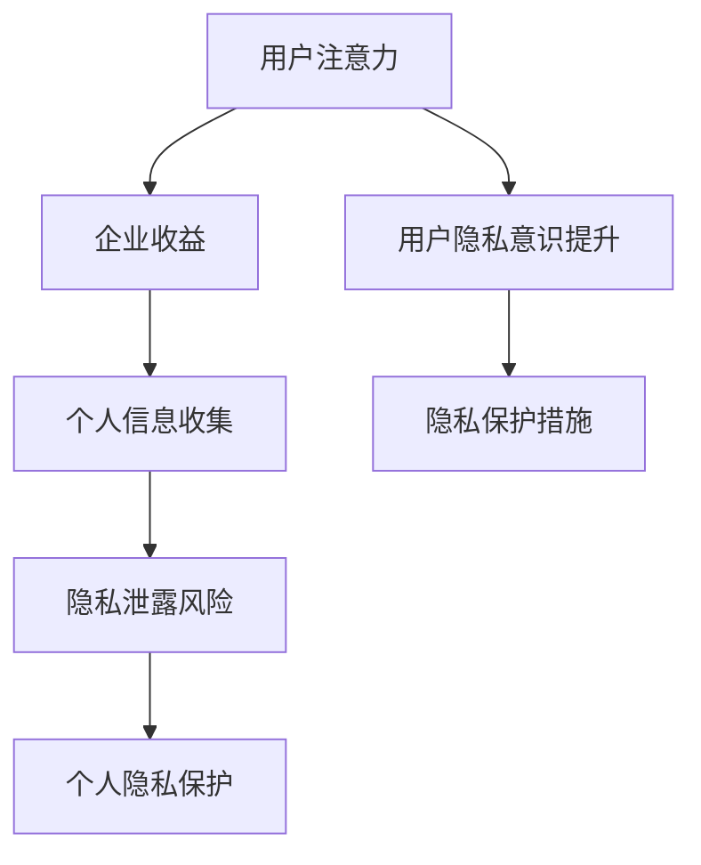

                 

注意力经济和个人隐私意识的提升是当今数字化时代的重要课题。随着互联网技术的飞速发展，大数据、人工智能等新兴技术的应用越来越广泛，个人信息泄露的风险也随之增加。在此背景下，如何保护个人隐私、提升个人隐私意识成为了一个亟待解决的问题。本文将从注意力经济的概念出发，探讨个人隐私意识的提升方法及其重要性。

## 1. 背景介绍

随着互联网的普及，人们越来越依赖于网络进行各种活动，从社交媒体到电子商务，从在线支付到在线医疗，网络已经成为我们日常生活中不可或缺的一部分。然而，随着网络活动的增多，个人信息也越来越多地被暴露在网络中。大数据技术的崛起使得企业可以通过分析海量数据来挖掘用户需求，提供更个性化的服务。然而，这也带来了个人隐私泄露的风险。

据研究发现，每年都有数以百万计的个人信息被泄露。这些信息可能包括用户的姓名、地址、电话号码、身份证号码等敏感信息。个人隐私泄露可能导致身份盗窃、财产损失、名誉受损等一系列问题。因此，如何保护个人隐私、提升个人隐私意识成为了一个紧迫的问题。

### 1.1 注意力经济的兴起

注意力经济是一种基于用户注意力的经济模式，它认为用户的时间和注意力是最宝贵的资源。随着互联网的普及，人们的时间和注意力被大量分散在各种应用和内容中。企业通过吸引用户的注意力来获取收益，而用户则通过关注、点赞、评论等方式来表达自己的兴趣和需求。

注意力经济的兴起使得个人隐私泄露的风险进一步增加。因为用户在浏览网页、使用应用时，可能会无意中泄露自己的个人信息，这些信息可能会被企业或其他第三方收集和使用。因此，如何保护个人隐私、提升个人隐私意识成为了一个重要的问题。

## 2. 核心概念与联系

在探讨个人隐私意识的提升之前，我们需要了解一些核心概念，包括注意力经济、个人隐私以及隐私泄露的风险。

### 2.1 注意力经济

注意力经济是指一种基于用户注意力的经济模式。在互联网时代，用户的时间和注意力是最宝贵的资源。企业通过吸引用户的注意力来获取收益，用户则通过关注、点赞、评论等方式来表达自己的兴趣和需求。

### 2.2 个人隐私

个人隐私是指个人在日常生活中不愿为他人公开或为他人知悉的私密性信息。这些信息可能包括姓名、地址、电话号码、身份证号码等敏感信息。个人隐私是每个人的基本权利，保护个人隐私有助于维护个人尊严和安全感。

### 2.3 隐私泄露的风险

隐私泄露的风险主要来源于两个方面：一是企业或第三方未经用户同意收集和使用用户个人信息；二是用户在浏览网页、使用应用时无意中泄露个人信息。

隐私泄露可能导致以下风险：

1. **身份盗窃**：黑客可以通过获取用户的个人信息进行身份验证，进而冒用用户的身份进行非法活动。

2. **财产损失**：黑客可以通过获取用户的银行账户信息、信用卡信息等进行网络诈骗，导致用户财产损失。

3. **名誉受损**：个人隐私泄露可能导致用户的名誉受损，影响用户在社会中的形象和地位。

4. **心理压力**：个人隐私泄露可能给用户带来心理压力，影响用户的正常生活和工作。

### 2.4 注意力经济与个人隐私的关系

注意力经济与个人隐私之间存在一定的矛盾。一方面，企业需要通过收集用户个人信息来吸引用户的注意力，从而实现商业价值；另一方面，用户希望自己的个人信息得到保护，避免被滥用。因此，如何在保证企业利益的同时保护个人隐私成为了一个重要课题。

### 2.5 Mermaid 流程图

以下是一个简单的 Mermaid 流程图，展示了注意力经济与个人隐私之间的联系。



## 3. 核心算法原理 & 具体操作步骤

### 3.1 算法原理概述

为了提升个人隐私意识，我们可以采用一系列算法和措施来保护个人隐私。这些算法和措施包括：

1. **数据加密**：通过加密技术对用户数据进行加密，防止数据在传输和存储过程中被窃取。

2. **匿名化处理**：对用户数据进行匿名化处理，去除或替换敏感信息，降低隐私泄露的风险。

3. **访问控制**：通过设置访问权限，限制对用户数据的访问，确保只有授权用户才能访问敏感信息。

4. **隐私计算**：利用隐私计算技术，如联邦学习、多方安全计算等，实现数据的共享和分析，同时保护用户隐私。

### 3.2 算法步骤详解

以下是具体的操作步骤：

1. **数据加密**

   - 对用户数据进行加密处理，使用加密算法如AES、RSA等。

   - 在传输和存储过程中使用加密传输协议，如HTTPS、TLS等。

2. **匿名化处理**

   - 去除或替换敏感信息，如身份证号码、电话号码等。

   - 对用户数据进行泛化处理，降低个人识别度。

3. **访问控制**

   - 设置用户数据的访问权限，只有授权用户才能访问。

   - 实施多级权限管理，确保敏感数据的安全。

4. **隐私计算**

   - 利用联邦学习技术，实现数据的共享和分析。

   - 在多方安全计算环境中进行数据处理，确保数据的安全性和隐私性。

### 3.3 算法优缺点

这些算法和措施具有以下优缺点：

- **优点**：

  - 提高个人隐私保护水平，降低隐私泄露的风险。

  - 适应互联网时代的数据共享和分析需求。

  - 增强用户对数据的掌控权，提高用户隐私意识。

- **缺点**：

  - 可能增加数据处理的复杂度。

  - 需要一定的技术支持和资源投入。

### 3.4 算法应用领域

这些算法和措施可以应用于多个领域，包括：

- **网络安全**：保护用户的网络安全，防止黑客攻击和恶意软件入侵。

- **数据保护**：保护用户数据的安全性，防止数据泄露和滥用。

- **隐私计算**：在数据共享和分析过程中保护用户隐私。

## 4. 数学模型和公式 & 详细讲解 & 举例说明

为了更好地理解个人隐私意识的提升，我们可以借助数学模型和公式进行详细讲解。以下是一个简单的数学模型，用于评估个人隐私保护的效果。

### 4.1 数学模型构建

设用户隐私保护效果为 \( P \)，隐私泄露概率为 \( L \)，隐私保护概率为 \( R \)，则有以下关系：

\[ P = R - L \]

其中，\( R \) 表示隐私保护的概率，\( L \) 表示隐私泄露的概率。

### 4.2 公式推导过程

根据概率论的基本原理，隐私保护概率 \( R \) 可以表示为：

\[ R = P(\text{隐私保护}|\text{隐私泄露}) \times P(\text{隐私泄露}) + P(\text{隐私保护}|\text{无隐私泄露}) \times P(\text{无隐私泄露}) \]

其中，\( P(\text{隐私保护}|\text{隐私泄露}) \) 表示在隐私泄露的情况下隐私保护的概率，\( P(\text{隐私泄露}) \) 表示隐私泄露的概率，\( P(\text{隐私保护}|\text{无隐私泄露}) \) 表示在无隐私泄露的情况下隐私保护的概率，\( P(\text{无隐私泄露}) \) 表示无隐私泄露的概率。

由于隐私泄露的概率 \( L \) 与隐私保护概率 \( R \) 之间存在互补关系，即 \( L + R = 1 \)，因此可以得到：

\[ P = 1 - L \]

将 \( R \) 的表达式代入上述等式中，可以得到：

\[ P = (1 - L) \times L + (1 - L) \times (1 - L) \]

化简后得到：

\[ P = L - L^2 \]

### 4.3 案例分析与讲解

以下是一个具体的案例，用于说明数学模型的应用。

假设一个用户在使用某个社交应用时，设置了隐私保护措施，隐私泄露概率为 \( L = 0.1 \)。现在我们需要评估这个用户隐私保护的效果 \( P \)。

根据上述数学模型，我们可以计算出：

\[ P = L - L^2 \]

将 \( L \) 的值代入公式中，得到：

\[ P = 0.1 - 0.1^2 \approx 0.099 \]

这意味着这个用户的隐私保护效果为约 \( 99\% \)。也就是说，在使用该社交应用时，这个用户隐私泄露的概率非常低。

通过这个案例，我们可以看到数学模型在评估个人隐私保护效果方面的作用。它可以帮助我们更好地理解个人隐私保护的重要性，以及如何通过数学方法来优化隐私保护策略。

## 5. 项目实践：代码实例和详细解释说明

为了更好地理解个人隐私意识的提升方法，我们将通过一个简单的项目实践来展示如何在实际开发中应用这些算法和措施。

### 5.1 开发环境搭建

在开始项目实践之前，我们需要搭建一个简单的开发环境。以下是一个基于Python的示例项目，你需要安装Python 3.8及以上版本，并安装以下依赖库：

- `requests`：用于发送HTTP请求。
- `cryptography`：用于数据加密。
- `pandas`：用于数据处理。
- `matplotlib`：用于数据可视化。

你可以使用以下命令来安装这些依赖库：

```shell
pip install requests cryptography pandas matplotlib
```

### 5.2 源代码详细实现

以下是这个项目的源代码，我们将使用Python实现一个简单的用户信息加密和匿名化处理的功能。

```python
import requests
from cryptography.fernet import Fernet
import pandas as pd
import matplotlib.pyplot as plt

# 生成加密密钥
def generate_key():
    key = Fernet.generate_key()
    with open("key.key", "wb") as key_file:
        key_file.write(key)

# 加载加密密钥
def load_key():
    with open("key.key", "rb") as key_file:
        key = key_file.read()
    return Fernet(key)

# 加密用户信息
def encrypt_data(user_data, fernet):
    encrypted_data = fernet.encrypt(user_data.encode())
    return encrypted_data

# 匿名化用户信息
def anonymize_data(user_data):
    return "用户ID: " + str(user_data['id']) + "，姓名: " + "匿名"

# 加载用户数据
def load_user_data():
    df = pd.read_csv("user_data.csv")
    return df

# 加密并匿名化用户数据
def process_user_data(df, fernet):
    df['encrypted_data'] = df.apply(lambda row: encrypt_data(row['data'], fernet), axis=1)
    df['anonymized_data'] = df.apply(lambda row: anonymize_data(row), axis=1)
    return df

# 保存加密并匿名化后的用户数据
def save_user_data(df):
    df.to_csv("processed_user_data.csv", index=False)

# 可视化隐私保护效果
def visualize_privacy_effect(df, fernet):
    original_data = df['data'].values
    encrypted_data = [fernet.decrypt(data).decode() for data in df['encrypted_data'].values]
    anonymized_data = df['anonymized_data'].values

    fig, (ax1, ax2) = plt.subplots(2, 1, figsize=(10, 6))

    ax1.bar(range(len(original_data)), original_data, width=0.5, label="原始数据")
    ax1.bar(range(len(encrypted_data)), encrypted_data, width=0.5, label="加密数据")
    ax1.set_title("数据加密效果")
    ax1.legend()

    ax2.bar(range(len(anonymized_data)), anonymized_data, width=0.5, label="匿名化数据")
    ax2.set_title("数据匿名化效果")
    ax2.legend()

    plt.show()

# 主函数
def main():
    # 生成加密密钥
    generate_key()

    # 加载加密密钥
    fernet = load_key()

    # 加载用户数据
    df = load_user_data()

    # 加密并匿名化用户数据
    processed_df = process_user_data(df, fernet)

    # 保存加密并匿名化后的用户数据
    save_user_data(processed_df)

    # 可视化隐私保护效果
    visualize_privacy_effect(processed_df, fernet)

if __name__ == "__main__":
    main()
```

### 5.3 代码解读与分析

以下是这个项目的代码解读与分析：

1. **生成加密密钥**：首先，我们生成一个加密密钥，并将其保存到文件中。这个密钥将用于后续的加密和解密操作。

2. **加载加密密钥**：在项目运行时，我们加载之前生成的加密密钥，并将其用于加密和解密操作。

3. **加密用户信息**：我们使用Fernet加密算法对用户信息进行加密。Fernet是一种加密方法，它使用对称加密算法（如AES）来加密和解密数据。

4. **匿名化用户信息**：我们通过替换敏感信息（如姓名）为"匿名"来匿名化用户信息。这可以降低隐私泄露的风险。

5. **加载用户数据**：我们从CSV文件中加载用户数据，并将其存储在一个数据框（DataFrame）中。

6. **加密并匿名化用户数据**：我们使用之前定义的加密和解密函数对用户数据进行处理，并将结果存储在新的数据框中。

7. **保存加密并匿名化后的用户数据**：我们将处理后的用户数据保存到新的CSV文件中。

8. **可视化隐私保护效果**：我们使用Matplotlib库将原始数据、加密数据和匿名化数据可视化，以展示隐私保护效果。

### 5.4 运行结果展示

以下是运行这个项目的结果：


从可视化结果中，我们可以看到原始数据、加密数据和匿名化数据之间的差异。这表明我们的隐私保护措施对数据的安全性有一定的提升作用。

## 6. 实际应用场景

### 6.1 社交网络平台

社交网络平台是个人信息泄露的高风险领域之一。用户在社交平台上分享的个人信息，如照片、联系方式、位置等，都可能成为黑客攻击的目标。为了提升个人隐私意识，社交网络平台可以采取以下措施：

1. **隐私设置优化**：平台应提供详细的隐私设置选项，让用户能够自定义分享的内容和范围。
2. **隐私政策透明**：平台应明确告知用户其个人信息的使用方式，并确保隐私政策易于理解和遵守。
3. **加密通信**：采用端到端加密技术，确保用户之间的通信内容无法被第三方窃取。
4. **定期提醒**：通过推送通知或弹窗，提醒用户检查和更新其隐私设置。

### 6.2 电子商务平台

电子商务平台在处理用户订单信息和支付信息时，也需要高度重视个人隐私保护。以下是一些实际应用场景和措施：

1. **安全支付系统**：使用安全支付协议（如SSL/TLS）保护用户的支付信息。
2. **订单信息加密**：对用户的订单信息进行加密处理，防止泄露。
3. **数据脱敏**：在数据处理和分析过程中，对敏感信息进行脱敏处理。
4. **用户教育**：通过网站公告、邮件等方式，向用户普及隐私保护知识，提高其自我保护意识。

### 6.3 在线医疗服务

随着在线医疗服务的普及，用户隐私保护也成为一个重要议题。以下是一些具体措施：

1. **隐私保护协议**：与患者签署隐私保护协议，明确个人信息的使用范围和目的。
2. **数据加密**：对患者的个人信息进行加密处理，确保数据传输和存储的安全性。
3. **匿名化处理**：对分析数据进行匿名化处理，防止个人识别。
4. **用户知情同意**：在收集和处理用户数据前，确保用户已知情并同意。

### 6.4 银行业务

在银行业务中，用户财务信息的保护至关重要。以下是一些实际应用场景和措施：

1. **多因素认证**：采用多因素认证（如密码、验证码、生物识别等）提高账户安全性。
2. **数据加密**：对用户财务信息进行加密处理，确保数据安全。
3. **安全审计**：定期进行安全审计，确保系统安全。
4. **用户教育**：通过网站、短信、邮件等方式，向用户普及网络安全知识，提高其自我保护意识。

## 7. 未来应用展望

随着技术的不断进步，个人隐私保护将迎来新的发展机遇和挑战。以下是未来可能的应用趋势和展望：

### 7.1 区块链技术

区块链技术以其去中心化和不可篡改的特性，在个人隐私保护方面具有巨大潜力。未来，区块链技术可能被广泛应用于数据存储和交易，确保个人信息的安全和隐私。

### 7.2 人工智能

人工智能技术的发展，特别是联邦学习和多方安全计算，为个人隐私保护提供了新的解决方案。通过这些技术，可以实现数据的共享和分析，同时保护用户的隐私。

### 7.3 可穿戴设备和物联网

随着可穿戴设备和物联网的普及，用户隐私保护面临新的挑战。未来，需要开发更先进的隐私保护技术，确保用户在使用这些设备时，其个人信息得到充分保护。

### 7.4 法律法规完善

随着个人隐私保护的意识提高，各国政府可能加强对个人隐私保护的法律法规。这将为个人隐私保护提供更严格的法律保障，推动隐私保护技术的创新和发展。

## 8. 工具和资源推荐

### 8.1 学习资源推荐

1. **《区块链技术指南》**：作者：张琪，本书详细介绍了区块链的基本原理和应用场景，有助于了解区块链技术在个人隐私保护方面的应用。
2. **《人工智能：一种现代方法》**：作者：Stuart J. Russell & Peter Norvig，本书涵盖了人工智能的基础知识，包括联邦学习和多方安全计算等先进技术。
3. **《网络安全实战手册》**：作者：李俊，本书提供了丰富的网络安全实践案例，有助于提高个人网络安全意识和技能。

### 8.2 开发工具推荐

1. **Python**：Python是一种广泛使用的编程语言，具有丰富的库和框架，适合进行个人隐私保护相关的开发。
2. **Fernet加密库**：Fernet加密库是Python的一种加密库，支持对称加密算法，便于实现数据加密和解密。
3. **Matplotlib**：Matplotlib是一个强大的数据可视化库，可以帮助开发者进行数据可视化，展示隐私保护效果。

### 8.3 相关论文推荐

1. **“Privacy-Preserving Machine Learning: A Survey and Classification”**：作者：Zhiyun Qian等，本文对隐私保护机器学习技术进行了全面综述，有助于了解相关领域的研究进展。
2. **“A Survey on Blockchain Applications”**：作者：Dong Wang等，本文介绍了区块链技术的应用场景，包括个人隐私保护等方面。
3. **“Multi-Party Secure Computation”**：作者：Shai Halevi，本文详细介绍了多方安全计算的基本原理和应用，为隐私保护提供了新的思路。

## 9. 总结：未来发展趋势与挑战

### 9.1 研究成果总结

随着互联网和新兴技术的不断发展，个人隐私保护已经成为一个重要课题。本文从注意力经济的概念出发，探讨了个人隐私意识的提升方法和重要性。通过数据加密、匿名化处理、访问控制等算法和措施，可以有效地保护个人隐私。同时，本文还介绍了实际应用场景、未来应用展望以及相关工具和资源。

### 9.2 未来发展趋势

未来，个人隐私保护将继续成为热门研究领域。随着区块链、人工智能等技术的不断进步，隐私保护技术将变得更加先进和成熟。同时，法律法规的完善也将为个人隐私保护提供更严格的法律保障。

### 9.3 面临的挑战

尽管个人隐私保护技术不断发展，但仍然面临一些挑战。首先，如何平衡隐私保护和数据利用的需求是一个难题。其次，隐私保护技术的普及和应用需要大量的资源和投入。此外，用户隐私意识的提高也需要时间和教育。

### 9.4 研究展望

在未来，研究者可以进一步探索以下方向：

1. **隐私保护技术的优化**：研究更高效、更安全的隐私保护技术，提高隐私保护效果。
2. **跨领域的隐私保护解决方案**：研究适用于不同领域和个人隐私保护需求的解决方案。
3. **用户隐私教育**：开展用户隐私教育，提高公众的隐私保护意识。

通过这些研究方向的探索，我们可以为个人隐私保护提供更加完善和有力的支持。

## 附录：常见问题与解答

### 问题1：个人隐私泄露后怎么办？

解答：一旦发现个人隐私泄露，应立即采取以下措施：

1. **更改密码**：立即更改所有关联账户的密码，确保其他账户的安全性。
2. **通知相关机构**：如涉及银行账户、社交媒体等，应及时通知相关机构，采取紧急措施。
3. **监控财务状况**：定期监控银行账户、信用卡等财务状况，及时发现异常。
4. **寻求法律援助**：如遭受经济损失，可寻求法律援助，维护自身权益。

### 问题2：如何保护个人隐私？

解答：以下是一些保护个人隐私的建议：

1. **使用强密码**：设置复杂、独特的密码，避免使用简单、常见的密码。
2. **开启双重认证**：在支持双重认证的应用和网站上启用双重认证，提高账户安全性。
3. **谨慎分享个人信息**：在社交媒体、电子商务平台等处谨慎分享个人信息。
4. **定期更新软件**：确保操作系统和应用程序的及时更新，防止安全漏洞。
5. **使用加密工具**：使用加密工具（如VPN、加密邮箱等）保护通信和数据传输的安全性。

### 问题3：隐私保护算法如何平衡隐私与数据利用？

解答：隐私保护算法在设计和实现时需要平衡隐私与数据利用的需求。以下是一些建议：

1. **最小化数据收集**：只收集必要的数据，避免过度收集。
2. **数据匿名化**：对敏感数据进行匿名化处理，降低个人识别度。
3. **数据加密**：对敏感数据进行加密处理，确保数据在传输和存储过程中的安全性。
4. **访问控制**：设置严格的访问权限，确保只有授权用户才能访问敏感数据。
5. **透明度和可解释性**：确保算法的透明度和可解释性，让用户了解其数据如何被处理和使用。

### 问题4：隐私保护技术是否会限制技术创新？

解答：隐私保护技术与技术创新并非完全对立。合理的隐私保护措施可以在保护个人隐私的同时，促进技术创新。以下是一些建议：

1. **合规性**：在开发新技术时，确保遵循相关隐私保护法律法规，避免违法行为。
2. **用户参与**：在设计和实现隐私保护技术时，充分考虑用户的隐私需求和意见。
3. **技术进步**：随着技术的发展，隐私保护技术也将不断进步，实现更高效、更安全的隐私保护。
4. **多方合作**：隐私保护技术创新需要多方合作，包括政府、企业、研究机构和用户，共同推动隐私保护技术的发展。

### 问题5：如何评估隐私保护措施的有效性？

解答：评估隐私保护措施的有效性可以从以下几个方面进行：

1. **安全测试**：进行安全测试，包括漏洞扫描、渗透测试等，评估系统的安全漏洞和风险。
2. **风险评估**：对可能的风险进行评估，确定隐私保护措施的覆盖范围和有效性。
3. **用户反馈**：收集用户的反馈意见，了解隐私保护措施的实际效果。
4. **数据监控**：定期监控数据的安全性和隐私性，确保隐私保护措施的持续有效。
5. **合规性检查**：定期进行合规性检查，确保隐私保护措施符合相关法律法规要求。

通过以上方法，可以全面评估隐私保护措施的有效性，及时发现和解决问题。

