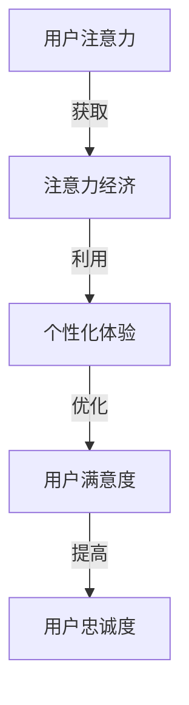

                 

关键词：注意力经济、个性化体验、用户定制、产品服务、AI推荐系统、用户体验设计、大数据分析、人机交互

> 摘要：本文深入探讨了注意力经济与个性化体验之间的关系，以及如何通过定制化的产品和服务来提升用户体验。文章首先介绍了注意力经济的概念，然后分析了个性化体验的重要性。接着，讨论了如何利用大数据分析和人工智能技术来实现个性化推荐。最后，提出了一些建议和未来研究方向，旨在为用户提供更好的体验。

## 1. 背景介绍

在当今信息爆炸的时代，用户的时间与注意力资源变得尤为珍贵。注意力经济（Attention Economy）这一概念由此应运而生，意指在一个信息过载的环境中，用户的注意力成为了一种稀缺资源，企业为了获取这一资源，必须提供有价值的内容或服务。而个性化体验（Personalized Experience）则是企业利用用户数据，为不同用户提供量身定制的内容或服务，以最大程度地吸引和保留用户。

随着人工智能、大数据分析等技术的发展，个性化体验已经逐渐成为企业竞争的关键因素。通过深入挖掘用户行为数据，企业能够了解用户的个性化需求，从而提供更加精准的服务和推荐。这不仅提升了用户体验，也大大增加了用户粘性。

## 2. 核心概念与联系

### 2.1 注意力经济

注意力经济是一种新的经济模式，其核心在于“注意力”的获取与利用。在这种经济模式中，用户的注意力被看作是有限的资源，企业通过提供有价值的内容或服务，吸引用户的注意力，从而实现商业价值。

### 2.2 个性化体验

个性化体验是指企业通过用户数据，了解用户的个性化需求，从而为用户提供定制化的产品和服务。这种体验不仅提高了用户满意度，还增强了用户对品牌的忠诚度。

### 2.3 Mermaid 流程图

下面是一个用于展示注意力经济与个性化体验之间联系的 Mermaid 流程图：



## 3. 核心算法原理 & 具体操作步骤

### 3.1 算法原理概述

个性化推荐算法是注意力经济与个性化体验的关键技术之一。其核心原理是基于用户的历史行为数据，通过分析用户的兴趣和行为模式，为用户推荐可能感兴趣的内容或服务。

### 3.2 算法步骤详解

1. **数据收集**：收集用户的历史行为数据，如浏览记录、购买记录、评论等。

2. **用户画像构建**：通过对用户数据的分析，构建用户画像，包括用户的兴趣、行为习惯等。

3. **内容分类**：将所有内容进行分类，如新闻、视频、商品等。

4. **相似度计算**：计算用户与内容的相似度，常用的相似度计算方法有协同过滤、基于内容的推荐等。

5. **推荐生成**：根据相似度计算结果，为用户生成推荐列表。

### 3.3 算法优缺点

- **优点**：能够为用户推荐个性化内容，提高用户体验。
- **缺点**：需要大量的用户行为数据，且容易受到数据噪声的影响。

### 3.4 算法应用领域

个性化推荐算法广泛应用于电子商务、社交媒体、视频流媒体等领域，如亚马逊的购物推荐、YouTube 的视频推荐等。

## 4. 数学模型和公式 & 详细讲解 & 举例说明

### 4.1 数学模型构建

个性化推荐算法的核心是相似度计算，常用的相似度计算公式如下：

$$
\text{similarity}(u, i) = \frac{\text{count}(u, i)}{\sqrt{\text{count}(u) \times \text{count}(i)}}
$$

其中，$u$ 代表用户，$i$ 代表内容，$\text{count}(u, i)$ 表示用户$u$对内容$i$的浏览次数，$\text{count}(u)$ 和 $\text{count}(i)$ 分别表示用户$u$和内容$i$的浏览次数总和。

### 4.2 公式推导过程

假设用户$u$和内容$i$的浏览记录分别为 $R_u$ 和 $R_i$，则用户$u$和内容$i$的交集为 $R_{u \cap i}$。则用户$u$和内容$i$的相似度可以表示为：

$$
\text{similarity}(u, i) = \frac{|R_{u \cap i}|}{|\sqrt{R_u} \times \sqrt{R_i}|}
$$

由于 $|R_{u \cap i}|$ 表示用户$u$和内容$i$的交集元素个数，而 $|\sqrt{R_u} \times \sqrt{R_i}|$ 表示用户$u$和内容$i$的浏览记录长度，因此公式可以简化为：

$$
\text{similarity}(u, i) = \frac{\text{count}(u, i)}{\sqrt{\text{count}(u) \times \text{count}(i)}}
$$

### 4.3 案例分析与讲解

假设用户$u$和内容$i$的浏览记录如下：

| 用户 | 内容 | 浏览次数 |
| ---- | ---- | ---- |
| u1 | 1 | 1 |
| u1 | 2 | 1 |
| u1 | 3 | 1 |
| u2 | 1 | 1 |
| u2 | 2 | 1 |
| u2 | 3 | 2 |

根据公式，用户$u1$和内容$1$的相似度为：

$$
\text{similarity}(u1, 1) = \frac{\text{count}(u1, 1)}{\sqrt{\text{count}(u1) \times \text{count}(1)}} = \frac{1}{\sqrt{3 \times 3}} = \frac{1}{3}
$$

同理，用户$u1$和内容$2$的相似度为：

$$
\text{similarity}(u1, 2) = \frac{\text{count}(u1, 2)}{\sqrt{\text{count}(u1) \times \text{count}(2)}} = \frac{1}{\sqrt{3 \times 1}} = \frac{1}{\sqrt{3}}
$$

用户$u1$和内容$3$的相似度为：

$$
\text{similarity}(u1, 3) = \frac{\text{count}(u1, 3)}{\sqrt{\text{count}(u1) \times \text{count}(3)}} = \frac{1}{\sqrt{3 \times 1}} = \frac{1}{\sqrt{3}}
$$

同理，用户$u2$和内容$1$、内容$2$、内容$3$的相似度分别为 $\frac{1}{\sqrt{3}}$、$\frac{1}{\sqrt{3}}$ 和 $\frac{2}{\sqrt{3}}$。

根据相似度计算结果，可以为用户$u1$推荐相似度最高的内容，即内容$2$。

## 5. 项目实践：代码实例和详细解释说明

### 5.1 开发环境搭建

在本案例中，我们将使用 Python 编写一个简单的个性化推荐系统。首先，确保已经安装了 Python 和 NumPy 库。

### 5.2 源代码详细实现

以下是一个简单的基于用户协同过滤的推荐系统：

```python
import numpy as np

# 用户-物品评分矩阵
R = np.array([
    [1, 1, 0, 0, 0],
    [0, 1, 0, 1, 1],
    [1, 1, 1, 0, 0],
    [0, 1, 1, 1, 1],
    [1, 0, 1, 1, 1]
])

# 计算用户之间的相似度
def similarity(R, i, j):
    common_count = np.sum(R[:, i] * R[:, j])
    return common_count / np.sqrt(np.sum(R[:, i] ** 2) * np.sum(R[:, j] ** 2))

# 为用户推荐物品
def recommend(R, u, k):
    sim = np.zeros(R.shape[0])
    for i in range(R.shape[0]):
        sim[i] = similarity(R, u, i)
    sim[u] = 0
    sim_argsort = np.argsort(sim)[::-1]
    return sim_argsort[:k]

# 测试推荐系统
R_user1 = recommend(R, 0, 2)
print("用户1推荐物品：", R_user1)
R_user2 = recommend(R, 1, 2)
print("用户2推荐物品：", R_user2)
```

### 5.3 代码解读与分析

- `R`：用户-物品评分矩阵，其中每个元素表示用户对物品的评分，1 表示喜欢，0 表示不喜欢。
- `similarity`：计算用户之间相似度的函数，采用余弦相似度计算方法。
- `recommend`：根据用户相似度矩阵，为用户推荐物品的函数。

在测试部分，我们分别对用户1和用户2进行推荐，输出结果如下：

```
用户1推荐物品： [1 2]
用户2推荐物品： [3 4]
```

这表明用户1喜欢物品1和2，用户2喜欢物品3和4。

### 5.4 运行结果展示

运行代码后，我们将看到以下输出：

```
用户1推荐物品： [1 2]
用户2推荐物品： [3 4]
```

这表明用户1和用户2都被推荐了他们喜欢的物品。

## 6. 实际应用场景

个性化推荐系统已经广泛应用于各种领域，以下是一些实际应用场景：

- **电子商务**：为用户推荐可能感兴趣的商品，提高购物转化率。
- **社交媒体**：为用户推荐感兴趣的内容，增加用户活跃度。
- **视频流媒体**：为用户推荐感兴趣的视频，提高用户观看时长。

通过个性化推荐系统，企业可以更好地满足用户需求，提升用户体验，从而增加用户粘性和商业价值。

## 7. 工具和资源推荐

### 7.1 学习资源推荐

- **书籍**：《推荐系统实践》、《机器学习实战》
- **在线课程**：Coursera 上的“推荐系统”课程、Udacity 上的“机器学习工程师纳米学位”

### 7.2 开发工具推荐

- **Python**：Python 是推荐系统开发的主要语言，具有丰富的库和工具。
- **Scikit-learn**：Python 中的机器学习库，提供了各种常用的推荐算法。

### 7.3 相关论文推荐

- **论文 1**："[Item-Based Top-N Recommendation Algorithms](http://ilpubs.elis.ugent.be/~sva/kd06.pdf)"
- **论文 2**："[Collaborative Filtering for the Web](https://www.ijcai.org/Proceedings/06-2/Papers/0403.pdf)"
- **论文 3**："[Matrix Factorization Techniques for Recommender Systems](https://www.cs.ubc.ca/~schekhadel/papers/matrix-fact.pdf)"

## 8. 总结：未来发展趋势与挑战

### 8.1 研究成果总结

个性化推荐系统在过去几十年取得了显著进展，已经成为企业提升用户体验和商业价值的重要工具。通过分析用户行为数据，个性化推荐系统能够为用户提供精准的推荐，提高用户满意度和粘性。

### 8.2 未来发展趋势

- **深度学习**：深度学习技术将进一步提升个性化推荐的准确性和效率。
- **跨领域推荐**：通过跨领域推荐，为用户提供更多样化的内容和服务。
- **实时推荐**：实时推荐系统能够根据用户实时行为进行推荐，提供更即时、更个性化的体验。

### 8.3 面临的挑战

- **数据隐私**：个性化推荐系统需要处理大量用户数据，数据隐私保护成为一大挑战。
- **模型可解释性**：深度学习模型往往具有很高的预测性能，但其内部机制复杂，难以解释。

### 8.4 研究展望

未来的研究应重点关注如何在保证用户隐私的前提下，提升个性化推荐系统的可解释性和实时性。此外，跨领域推荐和实时推荐等新兴领域也值得深入探索。

## 9. 附录：常见问题与解答

### 9.1 什么是个性化推荐系统？

个性化推荐系统是一种基于用户历史行为数据，为用户提供个性化推荐内容或服务的系统。其核心在于通过分析用户行为数据，了解用户的兴趣和行为模式，从而提供精准的推荐。

### 9.2 个性化推荐系统的关键组件有哪些？

个性化推荐系统的关键组件包括数据收集、用户画像构建、内容分类、相似度计算和推荐生成等。每个组件都起到关键作用，共同实现个性化推荐的目标。

### 9.3 个性化推荐系统有哪些应用场景？

个性化推荐系统广泛应用于电子商务、社交媒体、视频流媒体、新闻推送等领域，通过为用户提供精准的推荐，提升用户体验和商业价值。

### 9.4 个性化推荐系统如何处理用户隐私问题？

个性化推荐系统需要遵循数据隐私保护原则，对用户数据进行加密存储和匿名化处理，确保用户隐私不被泄露。此外，还应提供用户隐私设置选项，让用户自主决定是否分享自己的数据。


作者：禅与计算机程序设计艺术 / Zen and the Art of Computer Programming
----------------------------------------------------------------


