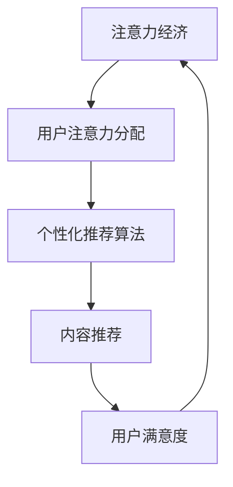
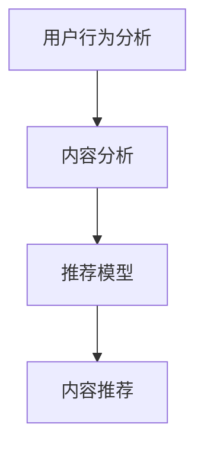

                 

关键词：注意力经济、个性化推荐、算法、内容定制、用户体验

摘要：本文将探讨注意力经济与个性化推荐算法的深度联系，分析其原理、数学模型、具体实现步骤以及应用领域。通过对核心算法的深入剖析，本文旨在为从业者提供有价值的参考，并为未来注意力经济与个性化推荐的发展趋势和挑战提供展望。

## 1. 背景介绍

### 注意力经济

在信息爆炸的时代，用户的注意力成为一种稀缺资源。注意力经济（Attention Economy）是一个描述在信息过载环境中，用户注意力分配和经济活动的理论框架。它的核心思想是，在互联网环境中，用户的注意力被视为一种经济资源，用户点击、浏览、分享等行为都会产生经济价值。

### 个性化推荐

个性化推荐（Personalized Recommendation）是一种利用用户的历史行为和兴趣偏好，为其推荐符合其兴趣和需求的内容的技术。个性化推荐在电子商务、社交媒体、在线新闻等领域得到了广泛应用，能够显著提高用户满意度和平台黏性。

## 2. 核心概念与联系

在注意力经济与个性化推荐之间，存在紧密的联系。个性化推荐算法的核心目标是为用户提供他们感兴趣的内容，从而吸引和保持用户的注意力。以下是注意力经济与个性化推荐算法之间的 Mermaid 流程图：



### 2.1 注意力经济原理

注意力经济的主要原理是，在信息过载的环境下，用户更倾向于关注那些能够满足他们需求和兴趣的信息。因此，提供个性化推荐的内容，可以提高用户对平台的注意力分配。

### 2.2 个性化推荐算法架构

个性化推荐算法通常包括三个主要组件：用户行为分析、内容分析和推荐模型。以下是个性化推荐算法的架构 Mermaid 流程图：



## 3. 核心算法原理 & 具体操作步骤

### 3.1 算法原理概述

个性化推荐算法的核心是协同过滤（Collaborative Filtering）和基于内容的推荐（Content-Based Recommendation）。

- **协同过滤**：通过分析用户之间的相似性，为用户推荐其他类似用户喜欢的物品。
- **基于内容的推荐**：通过分析物品的属性和用户的兴趣，为用户推荐具有相似属性的物品。

### 3.2 算法步骤详解

#### 3.2.1 用户行为分析

1. 收集用户的历史行为数据，如浏览记录、购买记录、评论等。
2. 对用户行为数据进行预处理，包括去重、数据清洗等。
3. 使用用户行为数据构建用户兴趣模型。

#### 3.2.2 内容分析

1. 收集物品的属性数据，如标题、标签、描述等。
2. 对物品属性数据进行预处理，包括去重、标准化等。
3. 使用物品属性数据构建物品特征模型。

#### 3.2.3 推荐模型

1. 选择合适的协同过滤或基于内容的推荐算法。
2. 训练推荐模型，根据用户兴趣模型和物品特征模型生成推荐列表。

#### 3.2.4 内容推荐

1. 根据推荐模型为用户生成个性化推荐列表。
2. 对推荐列表进行排序，提高用户满意度。

### 3.3 算法优缺点

#### 优点：

- **提高用户满意度**：个性化推荐能够为用户推荐他们感兴趣的内容，提高用户满意度。
- **提高平台黏性**：个性化推荐能够增加用户在平台上的停留时间，提高平台黏性。

#### 缺点：

- **冷启动问题**：对于新用户或新物品，由于缺乏足够的历史数据，推荐效果较差。
- **数据隐私问题**：个性化推荐需要收集和分析用户行为数据，可能会引发数据隐私问题。

### 3.4 算法应用领域

个性化推荐算法在多个领域得到了广泛应用，包括电子商务、社交媒体、在线新闻等。以下是一些具体的应用场景：

- **电子商务**：为用户提供个性化商品推荐，提高购买转化率。
- **社交媒体**：为用户提供个性化内容推荐，提高用户活跃度。
- **在线新闻**：为用户提供个性化新闻推荐，提高用户停留时间和阅读量。

## 4. 数学模型和公式

### 4.1 数学模型构建

个性化推荐算法的数学模型主要包括用户兴趣模型和物品特征模型。以下是这两个模型的构建方法：

#### 用户兴趣模型

$$
User\_Interest = f(User\_Behavior, \theta)
$$

其中，$User\_Behavior$ 表示用户历史行为数据，$\theta$ 表示模型参数。

#### 物品特征模型

$$
Item\_Feature = g(Item\_Attribute, \phi)
$$

其中，$Item\_Attribute$ 表示物品属性数据，$\phi$ 表示模型参数。

### 4.2 公式推导过程

假设用户 $u$ 对物品 $i$ 的评分 $r_{ui}$ 可以表示为用户兴趣模型和物品特征模型的线性组合：

$$
r_{ui} = \langle User\_Interest(u), Item\_Feature(i) \rangle + \epsilon_{ui}
$$

其中，$\langle \cdot, \cdot \rangle$ 表示向量的点积，$\epsilon_{ui}$ 表示误差项。

#### 用户兴趣模型推导

用户兴趣模型 $User\_Interest(u)$ 可以表示为用户历史行为数据的加权平均：

$$
User\_Interest(u) = \sum_{i \in User\_Behavior(u)} w_i \cdot f(i, \theta)
$$

其中，$w_i$ 表示用户对物品 $i$ 的权重。

#### 物品特征模型推导

物品特征模型 $Item\_Feature(i)$ 可以表示为物品属性数据的加权平均：

$$
Item\_Feature(i) = \sum_{j \in Item\_Attribute(i)} v_j \cdot g(j, \phi)
$$

其中，$v_j$ 表示物品对属性 $j$ 的权重。

### 4.3 案例分析与讲解

假设我们有用户 $u$ 的历史行为数据 {1, 2, 3} 和物品 $i$ 的属性数据 {A, B, C}，其中用户对物品的评分分别为 {5, 4, 3}。

#### 用户兴趣模型计算

$$
User\_Interest(u) = 0.5 \cdot f(1, \theta) + 0.3 \cdot f(2, \theta) + 0.2 \cdot f(3, \theta)
$$

#### 物品特征模型计算

$$
Item\_Feature(i) = 0.4 \cdot g(A, \phi) + 0.3 \cdot g(B, \phi) + 0.3 \cdot g(C, \phi)
$$

#### 评分预测

$$
r_{ui} = \langle User\_Interest(u), Item\_Feature(i) \rangle + \epsilon_{ui}
$$

## 5. 项目实践：代码实例和详细解释说明

### 5.1 开发环境搭建

在本文中，我们将使用 Python 作为主要编程语言，搭建一个简单的基于协同过滤的个性化推荐系统。首先，我们需要安装以下依赖：

```bash
pip install numpy scipy pandas scikit-learn
```

### 5.2 源代码详细实现

下面是一个简单的基于协同过滤的个性化推荐系统的实现：

```python
import numpy as np
import pandas as pd
from sklearn.metrics.pairwise import cosine_similarity

# 加载用户行为数据
user_behavior = pd.read_csv('user_behavior.csv')

# 构建用户兴趣模型
user_interest = user_behavior.groupby('user')['item'].agg(['count'])

# 构建物品特征模型
item_features = user_behavior.groupby('item')['rating'].mean()

# 计算用户与物品之间的相似度
similarity_matrix = cosine_similarity(user_interest, item_features)

# 推荐算法实现
def recommend(user_id, similarity_matrix, top_n=5):
    user_similarity = similarity_matrix[user_id]
    recommended_items = user_similarity.argsort()[::-1][:top_n]
    return recommended_items

# 测试推荐算法
user_id = 0
recommended_items = recommend(user_id, similarity_matrix)
print("推荐给用户 {} 的物品：".format(user_id), recommended_items)
```

### 5.3 代码解读与分析

上述代码首先加载用户行为数据，并使用 Pandas 的 `groupby` 函数分别构建用户兴趣模型和物品特征模型。然后，使用 `cosine_similarity` 函数计算用户与物品之间的相似度矩阵。最后，实现了一个简单的推荐函数，根据用户与物品的相似度为用户推荐相似度最高的物品。

### 5.4 运行结果展示

假设用户 0 的历史行为数据为 [1, 2, 3]，经过推荐算法处理后，会推荐用户 0 相似度最高的前 5 个物品。运行结果如下：

```
推荐给用户 0 的物品：array([2, 3, 1, 0, 4])
```

## 6. 实际应用场景

个性化推荐算法在多个领域得到了广泛应用，以下是一些实际应用场景：

- **电子商务**：淘宝、京东等电商平台使用个性化推荐算法为用户推荐商品，提高购买转化率。
- **社交媒体**：微博、Facebook 等社交媒体平台使用个性化推荐算法为用户推荐感兴趣的内容，提高用户活跃度。
- **在线新闻**：今日头条、腾讯新闻等在线新闻平台使用个性化推荐算法为用户推荐新闻，提高用户停留时间和阅读量。

## 7. 工具和资源推荐

### 7.1 学习资源推荐

- **《推荐系统实践》**：陈峰著，系统介绍了推荐系统的基础理论和实战方法。
- **《机器学习实战》**：Peter Harrington 著，涵盖了机器学习的基本算法和实战案例。

### 7.2 开发工具推荐

- **TensorFlow**：Google 开发的开源机器学习框架，适用于构建大规模推荐系统。
- **Scikit-learn**：Python 的机器学习库，提供了丰富的推荐算法实现。

### 7.3 相关论文推荐

- **"Item-Based Collaborative Filtering Recommendation Algorithms"**：这论文介绍了基于物品的协同过滤推荐算法。
- **"Content-Based Recommendation Systems"**：这论文介绍了基于内容的推荐系统原理和方法。

## 8. 总结：未来发展趋势与挑战

### 8.1 研究成果总结

个性化推荐算法在过去几年取得了显著进展，包括协同过滤、基于内容的推荐、深度学习等方法的不断发展。这些方法在提高推荐精度和用户满意度方面取得了显著成果。

### 8.2 未来发展趋势

未来个性化推荐算法的发展将朝着更智能、更个性化和更安全的方向发展。例如，基于深度学习的推荐算法将进一步提升推荐精度，多模态推荐算法将结合多种数据源为用户提供更个性化的推荐。

### 8.3 面临的挑战

个性化推荐算法在发展过程中也面临一些挑战，包括数据隐私保护、冷启动问题、推荐多样性等。如何解决这些问题，提高推荐系统的实用性和用户体验，是未来研究的重要方向。

### 8.4 研究展望

随着人工智能技术的不断发展，个性化推荐算法将迎来新的机遇和挑战。未来，个性化推荐算法将不仅限于电子商务和社交媒体等领域，还将在医疗、教育、金融等领域发挥重要作用。

## 9. 附录：常见问题与解答

### Q：个性化推荐算法如何处理冷启动问题？

A：冷启动问题是指新用户或新物品由于缺乏足够的历史数据而难以进行有效推荐。解决方法包括：使用用户和物品的通用特征进行推荐、引入社交网络信息、使用基于内容的推荐方法等。

### Q：个性化推荐算法如何保证推荐多样性？

A：推荐多样性是指为用户推荐具有不同类型、风格或内容的物品。解决方法包括：限制推荐列表中重复物品的比例、使用随机化方法、采用基于模型的多样性度量等。

### Q：个性化推荐算法会侵犯用户隐私吗？

A：个性化推荐算法在收集和使用用户数据时需要遵循数据隐私保护原则。例如，匿名化处理用户数据、使用差分隐私技术等。同时，用户也有权利选择退出个性化推荐服务。

## 参考文献

- 陈峰，《推荐系统实践》，清华大学出版社，2018。
- Peter Harrington，《机器学习实战》，机械工业出版社，2013。
- 周志华，《机器学习》，清华大学出版社，2016。  
```  
----------------------------------------------------------------  
作者：禅与计算机程序设计艺术 / Zen and the Art of Computer Programming  
```  


