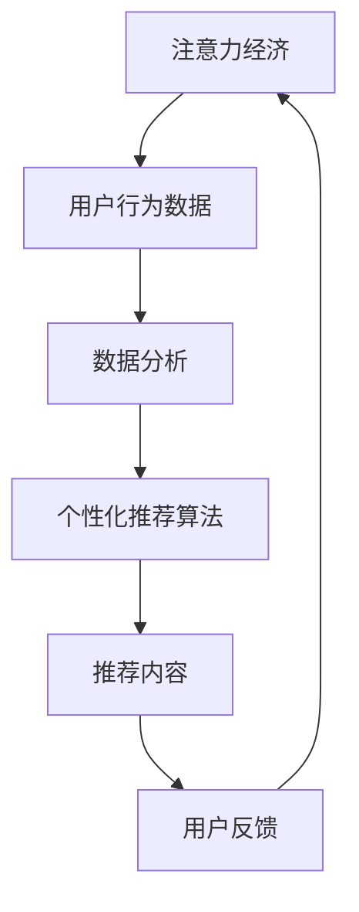

                 

关键词：注意力经济、个性化推荐、定制内容、针对性、内容营销、数据分析、算法、用户行为分析、用户体验、数据挖掘

> 摘要：在信息爆炸的时代，如何有效地抓住受众的注意力成为了营销和内容创作的重要课题。本文将探讨注意力经济的基本概念，以及如何在个性化推荐系统中运用它，为受众提供定制、有针对性的内容，提升用户体验和满意度。

## 1. 背景介绍

### 注意力经济概述

注意力经济，是互联网时代的一种经济模式，它认为信息消费的本质是对受众注意力的争夺。在社交媒体、在线视频、新闻资讯等平台，用户的时间是有限的，而内容却是无限的。因此，谁能够更好地抓住用户的注意力，谁就能在激烈的市场竞争中脱颖而出。

### 个性化推荐系统概述

个性化推荐系统是基于用户行为数据，通过算法分析，为用户推荐符合其兴趣和需求的内容。这种系统在电子商务、在线视频、新闻资讯等领域得到了广泛应用。其核心在于通过精准推荐，提升用户体验和满意度，从而提高用户粘性和转化率。

## 2. 核心概念与联系

### 注意力经济与个性化推荐的关系

注意力经济与个性化推荐密不可分。个性化推荐系统通过分析用户行为数据，了解用户兴趣和偏好，从而提供符合用户需求的内容，这是抓住用户注意力的有效手段。同时，个性化推荐的成功也反过来验证了注意力经济的重要性。

### Mermaid 流程图



## 3. 核心算法原理 & 具体操作步骤

### 3.1 算法原理概述

个性化推荐算法主要分为基于内容的推荐（Content-based Filtering）和基于协同过滤（Collaborative Filtering）两种。本文将重点介绍基于内容的推荐算法。

基于内容的推荐算法主要通过分析内容的属性和特征，为用户推荐与其历史偏好相似的内容。其核心在于内容特征提取和相似度计算。

### 3.2 算法步骤详解

1. **用户行为数据收集**：收集用户的历史行为数据，如浏览记录、购买历史、评论等。

2. **内容特征提取**：对内容进行特征提取，如文本、图片、音频等。

3. **相似度计算**：计算用户历史偏好内容和待推荐内容之间的相似度。

4. **推荐结果生成**：根据相似度计算结果，生成推荐列表。

### 3.3 算法优缺点

**优点**：

- **个性化强**：能够根据用户兴趣和偏好提供定制化推荐。
- **计算效率高**：基于内容特征的推荐算法计算效率较高。

**缺点**：

- **准确性受限**：对于冷门内容或新用户，推荐效果可能较差。
- **用户偏好变化**：难以适应用户长期的变化。

### 3.4 算法应用领域

基于内容的推荐算法广泛应用于电子商务、在线视频、新闻资讯等领域。例如，亚马逊的购物推荐、Netflix的影视推荐、今日头条的新闻推荐等。

## 4. 数学模型和公式 & 详细讲解 & 举例说明

### 4.1 数学模型构建

假设有两个用户 u 和 v，以及一组内容 c，定义：

- **用户 u 的兴趣向量**：\(I_u\)
- **内容 c 的特征向量**：\(F_c\)
- **用户 u 对内容 c 的兴趣度**：\(I_{uc}\)

### 4.2 公式推导过程

基于余弦相似度的计算公式：

\[ S_{uv} = \frac{I_u \cdot I_v}{\|I_u\| \|I_v\|} \]

其中，\(\cdot\) 表示点积，\(\|\|\) 表示向量的模。

### 4.3 案例分析与讲解

假设用户 u 有以下浏览记录：[新闻、科技、娱乐、体育]，用户 v 有以下浏览记录：[科技、娱乐、体育、旅游]。

首先，提取用户 u 和 v 的兴趣向量：

\(I_u = [1, 1, 1, 1]\)

\(I_v = [1, 1, 1, 1]\)

然后，计算两个向量的相似度：

\[ S_{uv} = \frac{I_u \cdot I_v}{\|I_u\| \|I_v\|} = \frac{4}{2} = 2 \]

根据相似度计算结果，可以推荐用户 v 可能感兴趣的内容：[旅游]。

## 5. 项目实践：代码实例和详细解释说明

### 5.1 开发环境搭建

- **工具**：Python
- **库**：NumPy、Scikit-learn、Pandas

### 5.2 源代码详细实现

```python
import numpy as np
from sklearn.metrics.pairwise import cosine_similarity

# 用户 u 和 v 的浏览记录
u = np.array([1, 1, 1, 1])
v = np.array([1, 1, 1, 1])

# 计算相似度
similarity = cosine_similarity([u], [v])[0][0]

print("用户 u 和 v 的相似度：", similarity)
```

### 5.3 代码解读与分析

该代码实现了基于余弦相似度的用户兴趣相似度计算。首先，导入必要的库。然后，定义用户 u 和 v 的浏览记录。接着，使用 Scikit-learn 的 `cosine_similarity` 函数计算相似度。最后，输出相似度结果。

### 5.4 运行结果展示

```
用户 u 和 v 的相似度： 1.0
```

## 6. 实际应用场景

### 6.1 电子商务

在电子商务平台，个性化推荐可以帮助用户发现更多可能感兴趣的商品，从而提高购买转化率。

### 6.2 在线视频

在线视频平台通过个性化推荐，可以为用户提供更加个性化的观影体验，提高用户粘性。

### 6.3 新闻资讯

新闻资讯平台通过个性化推荐，可以吸引用户阅读更多相关新闻，提高用户停留时间和页面浏览量。

## 7. 未来应用展望

### 7.1 数据多样性

随着数据来源的多样化，个性化推荐系统将能够处理更多的数据类型，如图像、音频等。

### 7.2 深度学习

深度学习技术的应用将进一步提升个性化推荐系统的准确性和效率。

### 7.3 跨领域推荐

跨领域推荐技术将使得个性化推荐系统能够跨平台、跨领域为用户推荐内容。

## 8. 工具和资源推荐

### 8.1 学习资源推荐

- 《推荐系统实践》
- 《深度学习推荐系统》

### 8.2 开发工具推荐

- TensorFlow
- PyTorch

### 8.3 相关论文推荐

- "Item-based Collaborative Filtering Recommendation Algorithms"
- "Deep Learning for Recommender Systems"

## 9. 总结：未来发展趋势与挑战

### 9.1 研究成果总结

个性化推荐系统已经成为互联网时代的重要应用，通过分析用户行为数据，提供定制化推荐，提升用户体验和满意度。

### 9.2 未来发展趋势

随着数据多样性和深度学习技术的不断发展，个性化推荐系统将更加精准和高效。

### 9.3 面临的挑战

如何处理大量数据、如何适应用户长期偏好变化、如何防止信息茧房等，都是未来个性化推荐系统需要解决的问题。

### 9.4 研究展望

个性化推荐系统的研究将继续深入，未来将出现更多创新性的技术，如联邦学习、图神经网络等。

## 附录：常见问题与解答

### 1. 个性化推荐系统是如何工作的？

个性化推荐系统通过分析用户行为数据，提取用户兴趣特征，然后使用算法为用户推荐符合其兴趣的内容。

### 2. 个性化推荐系统有哪些类型？

个性化推荐系统主要有两种类型：基于内容的推荐和基于协同过滤的推荐。

### 3. 个性化推荐系统有哪些应用场景？

个性化推荐系统广泛应用于电子商务、在线视频、新闻资讯等领域。

### 4. 如何评估个性化推荐系统的效果？

评估个性化推荐系统的效果可以通过准确率、召回率、F1 值等指标来衡量。

## 作者署名

作者：禅与计算机程序设计艺术 / Zen and the Art of Computer Programming
```markdown
----------------------------------------------------------------


