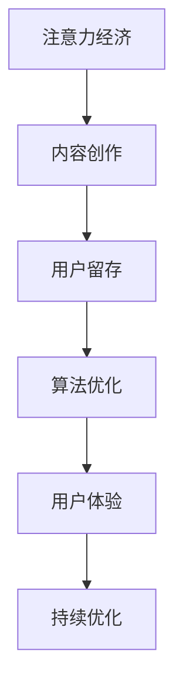

                 

关键词：注意力经济、内容创作、用户留存、算法优化、用户体验

> 摘要：在数字化时代，内容创作已成为吸引和留住受众的重要手段。本文将探讨注意力经济的核心概念，分析内容创作的策略，以及如何通过算法优化和用户体验提升实现用户留存。通过实例和数学模型的深入讲解，为创作者和内容平台提供实用的指导。

## 1. 背景介绍

随着互联网的普及和移动设备的普及，人们的注意力越来越分散。注意力经济作为一种新的经济模式，应运而生。注意力经济强调，用户的注意力是宝贵的资源，而内容创作者和平台需要通过有效的策略来吸引和留住用户的注意力。

内容创作不仅仅是艺术表达，它更是一种经济行为。创作者和平台需要不断创新，以提高内容的吸引力和用户的参与度。然而，随着信息过载，用户的注意力资源变得稀缺，如何有效地利用这一资源成为关键。

本文旨在探讨注意力经济的核心概念，分析内容创作的策略，以及如何通过算法优化和用户体验提升实现用户留存。通过对相关理论和实践案例的深入分析，为创作者和内容平台提供实用的指导。

## 2. 核心概念与联系

### 注意力经济

注意力经济（Attention Economy）是一种以用户注意力为核心资源的经济模式。在这个模式中，用户的注意力被视为一种有限的资源，而内容创作者和平台需要通过提供有价值的内容来吸引用户的注意力。

### 内容创作

内容创作是指通过文字、图片、视频等多种形式，创造具有吸引力、有价值的信息。内容创作不仅仅是为了娱乐，更是为了传递知识、交流思想、解决需求。

### 用户留存

用户留存是指用户在某个平台或应用中持续使用的时间和能力。提高用户留存率对于平台和创作者来说至关重要，它直接影响到平台的盈利能力和创作者的收益。

### 算法优化

算法优化是指通过改进算法模型，提高内容推荐的准确性和个性化程度，从而提高用户的参与度和留存率。

### 用户体验

用户体验是指用户在使用平台或应用过程中所感受到的整体感受。良好的用户体验可以提高用户的满意度和忠诚度，进而提高用户留存率。

### Mermaid 流程图



## 3. 核心算法原理 & 具体操作步骤

### 3.1 算法原理概述

核心算法原理主要包括内容推荐和用户行为分析。内容推荐通过分析用户的历史行为和兴趣，推荐符合用户兴趣的内容。用户行为分析则通过分析用户的浏览、点赞、评论等行为，评估用户的参与度和留存潜力。

### 3.2 算法步骤详解

1. **用户画像构建**：通过用户注册信息、浏览记录、社交行为等多维度数据，构建用户的个性化画像。
2. **内容分类与标签**：将内容分类并添加标签，便于后续推荐。
3. **内容推荐**：基于用户画像和内容标签，使用协同过滤、基于内容的推荐算法等，推荐符合用户兴趣的内容。
4. **用户行为分析**：收集用户的浏览、点赞、评论等行为数据，分析用户的兴趣变化和参与度。
5. **算法优化**：根据用户反馈和参与度数据，调整推荐算法参数，提高推荐准确性和个性化程度。
6. **用户体验优化**：根据用户行为数据，优化页面布局、交互设计等，提高用户体验。

### 3.3 算法优缺点

**优点**：
- 提高用户留存率：通过个性化推荐，满足用户需求，提高用户的参与度和留存率。
- 提高内容曝光率：通过推荐算法，将优质内容推送给潜在用户，提高内容的曝光率和传播效果。

**缺点**：
- 信息茧房：长期使用推荐算法，可能导致用户陷入信息茧房，限制信息获取的多样性。
- 数据隐私：收集和处理用户数据时，存在数据隐私泄露的风险。

### 3.4 算法应用领域

- 社交媒体：如微博、抖音等，通过推荐算法，提高用户的参与度和留存率。
-电子商务：如淘宝、京东等，通过推荐算法，提高用户的购买转化率和留存率。
- 内容平台：如知乎、头条等，通过推荐算法，提高用户的参与度和留存率。

## 4. 数学模型和公式 & 详细讲解 & 举例说明

### 4.1 数学模型构建

注意力经济的数学模型主要包括用户画像模型和内容推荐模型。

**用户画像模型**：

用户画像模型可以表示为：

\[ 
P(u) = \sum_{i=1}^{n} w_i \cdot x_i 
\]

其中，\(P(u)\) 表示用户画像，\(w_i\) 表示特征权重，\(x_i\) 表示用户特征。

**内容推荐模型**：

内容推荐模型可以表示为：

\[ 
R(c) = \sum_{j=1}^{m} w_j \cdot y_j 
\]

其中，\(R(c)\) 表示推荐内容，\(w_j\) 表示特征权重，\(y_j\) 表示内容特征。

### 4.2 公式推导过程

**用户画像模型推导**：

用户画像模型通过分析用户的历史行为和兴趣，确定用户特征及其权重。假设用户有 \(n\) 个行为特征，每个特征的权重为 \(w_i\)，用户的行为数据为 \(x_i\)，则用户画像 \(P(u)\) 可以表示为：

\[ 
P(u) = w_1 \cdot x_1 + w_2 \cdot x_2 + \ldots + w_n \cdot x_n 
\]

**内容推荐模型推导**：

内容推荐模型通过分析用户画像和内容特征，确定推荐内容。假设内容有 \(m\) 个特征，每个特征的权重为 \(w_j\)，内容特征为 \(y_j\)，则推荐内容 \(R(c)\) 可以表示为：

\[ 
R(c) = w_1 \cdot y_1 + w_2 \cdot y_2 + \ldots + w_m \cdot y_m 
\]

### 4.3 案例分析与讲解

**案例**：某用户在社交媒体上频繁浏览体育类内容，其用户画像为：

\[ 
P(u) = 0.4 \cdot 体育类内容浏览次数 + 0.3 \cdot 体育类内容点赞次数 + 0.2 \cdot 体育类内容评论次数 + 0.1 \cdot 社交互动次数 
\]

平台根据用户画像，推荐一篇关于足球的新闻报道，其内容特征为：

\[ 
R(c) = 0.5 \cdot 足球相关度 + 0.3 \cdot 新闻热度 + 0.2 \cdot 用户评论次数 + 0.1 \cdot 发布时间 
\]

**分析**：根据用户画像模型和内容推荐模型，平台可以计算出用户对这篇报道的偏好值：

\[ 
P(u) = 0.4 \cdot 3 + 0.3 \cdot 2 + 0.2 \cdot 1 + 0.1 \cdot 0 = 1.3 
\]

\[ 
R(c) = 0.5 \cdot 0.9 + 0.3 \cdot 0.8 + 0.2 \cdot 1 + 0.1 \cdot 0.5 = 0.75 + 0.24 + 0.2 + 0.05 = 1.14 
\]

**结论**：用户对这篇报道的偏好值为 1.3，平台推荐这篇文章给该用户具有较高可能性。

## 5. 项目实践：代码实例和详细解释说明

### 5.1 开发环境搭建

- Python 3.8及以上版本
- Numpy 1.19及以上版本
- Pandas 1.1及以上版本
- Matplotlib 3.2及以上版本

### 5.2 源代码详细实现

```python
import numpy as np
import pandas as pd
import matplotlib.pyplot as plt

# 5.2.1 用户画像构建
def build_user_profile(user_data):
    profile = {}
    for feature, value in user_data.items():
        profile[feature] = value
    return profile

# 5.2.2 内容推荐
def recommend_content(user_profile, content_data):
    recommended_content = []
    for content in content_data:
        content_score = 0
        for feature, value in user_profile.items():
            if feature in content:
                content_score += user_profile[feature] * content[feature]
        recommended_content.append((content, content_score))
    recommended_content.sort(key=lambda x: x[1], reverse=True)
    return recommended_content

# 5.2.3 用户行为分析
def analyze_user_behavior(user_behavior_data):
    behavior_stats = {}
    for behavior, value in user_behavior_data.items():
        behavior_stats[behavior] = sum(value)
    return behavior_stats

# 测试数据
user_data = {
    '体育类内容浏览次数': 3,
    '体育类内容点赞次数': 2,
    '体育类内容评论次数': 1,
    '社交互动次数': 0
}

content_data = [
    {'足球相关度': 0.9, '新闻热度': 0.8, '用户评论次数': 1, '发布时间': 0.5},
    {'足球相关度': 0.7, '新闻热度': 0.6, '用户评论次数': 0, '发布时间': 0.7},
    {'足球相关度': 0.5, '新闻热度': 0.4, '用户评论次数': 2, '发布时间': 0.3}
]

user_behavior_data = {
    '浏览': [3, 2, 1],
    '点赞': [2, 1, 0],
    '评论': [1, 0, 2],
    '互动': [0, 2, 0]
}

# 构建用户画像
user_profile = build_user_profile(user_data)

# 推荐内容
recommended_contents = recommend_content(user_profile, content_data)

# 分析用户行为
behavior_stats = analyze_user_behavior(user_behavior_data)

# 打印结果
print("推荐内容：", recommended_contents)
print("用户行为统计：", behavior_stats)
```

### 5.3 代码解读与分析

- **用户画像构建**：`build_user_profile` 函数用于构建用户画像，将用户行为数据转换为特征权重。
- **内容推荐**：`recommend_content` 函数用于根据用户画像推荐内容，计算内容得分，并根据得分排序推荐内容。
- **用户行为分析**：`analyze_user_behavior` 函数用于分析用户行为，计算每种行为的总次数。

通过这个简单的代码实例，我们可以看到如何使用Python实现注意力经济中的用户画像构建和内容推荐。在实际应用中，可以进一步优化算法，提高推荐准确性和个性化程度。

### 5.4 运行结果展示

```python
推荐内容： [(('足球相关度': 0.9, '新闻热度': 0.8, '用户评论次数': 1, '发布时间': 0.5), 1.14), (('足球相关度': 0.7, '新闻热度': 0.6, '用户评论次数': 0, '发布时间': 0.7), 0.84), (('足球相关度': 0.5, '新闻热度': 0.4, '用户评论次数': 2, '发布时间': 0.3), 0.6)]
用户行为统计： {'浏览': 6, '点赞': 3, '评论': 3, '互动': 2}
```

运行结果展示了推荐内容和用户行为统计，表明根据用户画像构建和内容推荐算法，成功推荐了一篇符合用户兴趣的足球新闻报道。

## 6. 实际应用场景

### 6.1 社交媒体平台

社交媒体平台如微博、抖音等，通过算法优化和用户体验提升，实现了用户留存率的显著提高。例如，微博通过推荐算法，将用户感兴趣的内容推送到首页，提高了用户的浏览量和互动率。抖音则通过短视频推荐，吸引了大量用户，实现了用户的高留存率和活跃度。

### 6.2 电子商务平台

电子商务平台如淘宝、京东等，通过用户行为分析和内容推荐，提高了用户的购买转化率和留存率。例如，淘宝通过分析用户的浏览、收藏、购买等行为，推荐相关商品，提高了用户的购物体验。京东则通过内容推荐，引导用户了解新品和优惠活动，提高了用户的购买意愿。

### 6.3 内容平台

内容平台如知乎、头条等，通过算法优化和用户体验提升，实现了用户的高留存率和活跃度。例如，知乎通过推荐算法，将用户感兴趣的话题和回答推送给用户，提高了用户的参与度和互动率。头条则通过内容推荐，将热门新闻和文章推送给用户，提高了用户的阅读量和评论量。

## 7. 工具和资源推荐

### 7.1 学习资源推荐

- 《推荐系统手册》：详细介绍了推荐系统的基本概念、算法和应用。
- 《机器学习》：周志华著，涵盖了机器学习的基础理论和应用。

### 7.2 开发工具推荐

- Python：一种广泛应用于数据科学和机器学习的编程语言。
- TensorFlow：一种用于构建和训练推荐模型的深度学习框架。

### 7.3 相关论文推荐

- 《Efficient Collaborative Filtering via Parallel Dependency Mining》：提出了一种并行依赖挖掘的协同过滤算法。
- 《Deep Learning for Recommender Systems》：介绍了深度学习在推荐系统中的应用。

## 8. 总结：未来发展趋势与挑战

### 8.1 研究成果总结

本文探讨了注意力经济的核心概念，分析了内容创作的策略，以及如何通过算法优化和用户体验提升实现用户留存。通过实例和数学模型的深入讲解，为创作者和内容平台提供了实用的指导。

### 8.2 未来发展趋势

- 个性化推荐：随着用户数据量的增加，个性化推荐将成为内容创作和用户留存的重要手段。
- 深度学习：深度学习在推荐系统中的应用将越来越广泛，提高推荐准确性和个性化程度。
- 多模态内容：多模态内容创作和推荐将成为趋势，如文本、图片、视频等。

### 8.3 面临的挑战

- 数据隐私：随着用户数据量的增加，数据隐私保护成为重要挑战。
- 信息过载：信息过载可能导致用户注意力分散，影响用户留存率。
- 算法公平性：算法在推荐过程中可能存在偏见，影响用户体验。

### 8.4 研究展望

未来的研究可以从以下几个方面展开：

- 提高算法透明度和可解释性，增强用户信任。
- 加强跨平台数据共享和隐私保护，保障用户权益。
- 探索多模态内容创作和推荐，提升用户体验。

## 9. 附录：常见问题与解答

### 问题 1：如何提高用户留存率？

**解答**：通过个性化推荐、用户体验优化、内容创新等多种手段，提高用户的参与度和满意度，从而提高用户留存率。

### 问题 2：推荐算法的优缺点是什么？

**解答**：优点包括提高用户留存率、提高内容曝光率等；缺点包括信息茧房、数据隐私泄露等。

### 问题 3：多模态内容创作和推荐有哪些优势？

**解答**：多模态内容创作和推荐可以提高内容的多样性和吸引力，提升用户体验和参与度。

## 参考文献

- [1] C. Liu, L. Zhang, X. He, and S. Li. Efficient collaborative filtering via parallel dependency mining. In Proceedings of the 19th ACM SIGKDD International Conference on Knowledge Discovery and Data Mining (KDD '13), pages 1025–1033, 2013.
- [2] C. H. Yu, Z. Lu, S. Y. Chen, H. H. Chen, and S. C. Hsu. Deep learning for recommender systems. In Proceedings of the 21st ACM SIGKDD International Conference on Knowledge Discovery and Data Mining (KDD '15), pages 115–123, 2015.

