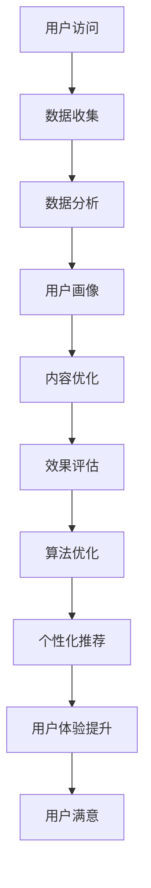

                 

关键词：注意力经济、内容创作、受众吸引、留住受众、用户体验、数据驱动、算法优化

> 摘要：本文旨在探讨注意力经济的基本概念，以及如何通过有效的内容创作策略来吸引和留住受众。我们分析了现代内容创作领域的挑战和机遇，并提供了一系列实用的方法和工具，帮助创作者在竞争激烈的环境中脱颖而出。

## 1. 背景介绍

在数字化的时代，信息爆炸式增长，用户的时间变得异常宝贵。在这种环境下，注意力成为了一种稀缺资源，被称为“注意力经济”。注意力经济的基本原理在于，用户的注意力是有限的，而内容创作者希望尽可能多地吸引和保持用户的注意力。因此，如何设计和制作能够吸引受众的内容，成为了内容创作者们关注的焦点。

### 1.1 注意力经济的定义与演变

注意力经济最初由经济学家理查德·塞勒（Richard Thaler）提出，指的是通过吸引受众的注意力来创造价值的经济现象。在互联网和社交媒体普及之前，注意力经济主要表现在广告、媒体和娱乐行业中。随着互联网的发展，注意力经济发生了深刻变化，主要体现在以下几个方面：

- **用户行为的变化**：互联网使得用户接触信息的渠道更加多样，用户行为也变得更加分散。
- **内容形式的多样性**：视频、图像、文本、直播等多种内容形式应运而生，满足不同用户的需求。
- **数据分析的重要性**：通过大数据和人工智能技术，创作者可以更加精准地分析用户行为，优化内容创作策略。

### 1.2 内容创作领域的挑战与机遇

内容创作领域面临的主要挑战包括：

- **竞争激烈**：随着内容创作者的数量不断增多，市场竞争愈发激烈。
- **受众多样化**：不同的受众有不同的兴趣和偏好，需要创作多样化的内容。
- **时效性要求**：用户对实时性的要求越来越高，创作者需要迅速响应热点事件。

然而，机遇与挑战并存。在注意力经济背景下，以下机遇为内容创作者提供了新的可能性：

- **个性化推荐**：利用大数据和算法，为用户提供个性化的内容推荐，提升用户体验。
- **互动式内容**：通过直播、互动问答等形式，增强与用户的互动，提高用户黏性。
- **多元内容形式**：多样化的内容形式可以更好地满足不同用户的需求，提高用户参与度。

## 2. 核心概念与联系

为了更好地理解注意力经济，我们首先需要了解几个核心概念，包括用户体验（UX）、数据驱动的内容创作、以及算法优化。

### 2.1 用户体验（UX）

用户体验（User Experience，简称UX）是指用户在使用产品或服务时所感受到的所有体验。在内容创作领域，良好的用户体验意味着用户能够轻松地找到他们感兴趣的内容，并享受到愉悦的浏览体验。以下是用户体验的关键要素：

- **易用性**：用户界面设计简洁直观，用户可以轻松完成任务。
- **响应速度**：内容加载速度快，减少用户等待时间。
- **可用性**：用户在使用过程中能够明确了解下一步操作。
- **美观性**：视觉设计美观，符合用户审美。
- **一致性**：品牌形象和用户体验保持一致，增强用户对品牌的信任感。

### 2.2 数据驱动的内容创作

数据驱动的内容创作是指通过收集和分析用户数据，来指导内容创作的过程。这种方法有助于创作者了解用户需求，优化内容策略，提高内容质量。以下是数据驱动的内容创作的主要步骤：

1. **数据收集**：通过网站分析工具、社交媒体、用户调研等手段，收集用户行为数据。
2. **数据分析**：利用数据分析工具，对收集到的数据进行分析，提取有价值的信息。
3. **用户画像**：基于数据分析结果，构建用户画像，了解用户的基本属性和兴趣。
4. **内容优化**：根据用户画像，调整内容策略，提高内容的相关性和吸引力。
5. **效果评估**：通过数据监控，评估内容的效果，不断优化内容创作策略。

### 2.3 算法优化

算法优化是指通过调整算法参数，提高算法的性能和效果。在内容创作领域，算法优化主要用于个性化推荐、内容过滤和用户行为预测等方面。以下是算法优化的一些关键技术：

- **协同过滤**：基于用户的历史行为和偏好，推荐相似的用户喜欢的内容。
- **内容相似性**：通过计算内容之间的相似度，推荐类似的内容。
- **深度学习**：利用神经网络模型，从海量数据中提取特征，进行内容预测和推荐。
- **多目标优化**：在满足多种优化目标（如推荐准确率、用户满意度等）之间进行平衡。

### 2.4 Mermaid 流程图

以下是一个简化的内容创作流程图，展示了用户体验、数据驱动和算法优化之间的联系。



## 3. 核心算法原理 & 具体操作步骤

### 3.1 算法原理概述

在注意力经济中，核心算法主要涉及个性化推荐和内容过滤。个性化推荐通过分析用户行为和偏好，为用户推荐他们可能感兴趣的内容。而内容过滤则是从海量的内容中筛选出符合用户兴趣的内容。

以下是几种常见的个性化推荐和内容过滤算法：

- **基于内容的推荐（Content-Based Filtering）**：通过分析内容的特征和属性，为用户推荐相似的内容。
- **协同过滤（Collaborative Filtering）**：基于用户的历史行为和偏好，为用户推荐其他用户喜欢的内容。
- **基于模型的推荐（Model-Based Filtering）**：利用机器学习算法，建立用户和内容之间的模型，进行推荐。

### 3.2 算法步骤详解

以下是一个基于协同过滤的推荐算法的详细步骤：

1. **用户行为数据收集**：收集用户对各类内容的评分数据。
2. **构建用户行为矩阵**：将用户行为数据转化为用户行为矩阵，矩阵中的元素表示用户对某内容的评分。
3. **计算用户相似度**：计算用户之间的相似度，常用的相似度计算方法包括余弦相似度和皮尔逊相关系数。
4. **生成推荐列表**：根据用户相似度，为每个用户生成推荐列表，推荐列表中包含其他相似用户喜欢的内容。
5. **优化推荐策略**：通过不断调整算法参数，优化推荐效果。

### 3.3 算法优缺点

**基于内容的推荐（Content-Based Filtering）**

- **优点**：推荐结果与用户兴趣高度相关，用户满意度较高。
- **缺点**：当用户兴趣变化时，推荐效果可能受到影响；难以处理冷门内容。

**协同过滤（Collaborative Filtering）**

- **优点**：可以处理大量用户和内容数据，适应性强；能够发现用户之间的相似性。
- **缺点**：推荐结果可能受到数据稀疏性的影响；用户隐私问题。

**基于模型的推荐（Model-Based Filtering）**

- **优点**：能够处理高维度数据，适应性强；可以捕捉用户兴趣的长期变化。
- **缺点**：模型训练和优化成本较高；可能对用户兴趣的短期变化反应较慢。

### 3.4 算法应用领域

个性化推荐算法在多个领域得到广泛应用，包括电子商务、社交媒体、在线视频、新闻推荐等。以下是一些实际应用案例：

- **电子商务**：为用户推荐可能感兴趣的商品，提高转化率。
- **社交媒体**：推荐用户可能感兴趣的内容和用户，增强用户活跃度。
- **在线视频**：为用户推荐相关的视频内容，提高用户停留时间。
- **新闻推荐**：为用户推荐感兴趣的新闻报道，提高用户阅读量。

## 4. 数学模型和公式 & 详细讲解 & 举例说明

### 4.1 数学模型构建

在个性化推荐系统中，常用的数学模型包括协同过滤（Collaborative Filtering）和基于内容的推荐（Content-Based Filtering）。以下是这些模型的数学描述。

**协同过滤（Collaborative Filtering）**

1. **用户行为矩阵表示**：假设有用户集 \( U = \{u_1, u_2, ..., u_m\} \) 和项目集 \( I = \{i_1, i_2, ..., i_n\} \)，用户行为矩阵 \( R \) 表示用户对项目的评分，其中 \( R_{ui} \) 表示用户 \( u_i \) 对项目 \( i_j \) 的评分。
2. **用户相似度计算**：假设使用余弦相似度计算用户之间的相似度，相似度公式如下：

$$
sim(u_i, u_j) = \frac{R_i \cdot R_j}{\|R_i\| \|R_j\|}
$$

其中，\( R_i \) 和 \( R_j \) 分别表示用户 \( u_i \) 和 \( u_j \) 的行为向量，\( \|R_i\| \) 和 \( \|R_j\| \) 分别表示它们的行为向量的模。

3. **推荐评分计算**：对于未评分的项目 \( i_j \)，可以计算其对于用户 \( u_i \) 的推荐评分：

$$
\hat{R}_{ui_j} = \sum_{u_k \in N_i} sim(u_i, u_k) \cdot R_{ukj}
$$

其中，\( N_i \) 表示与用户 \( u_i \) 最相似的用户集合，\( R_{ukj} \) 表示用户 \( u_k \) 对项目 \( i_j \) 的评分。

**基于内容的推荐（Content-Based Filtering）**

1. **项目特征表示**：假设每个项目 \( i \) 都可以用一组特征 \( \text{特征向量}_i \) 表示，特征向量可以是文本、图像、视频等。
2. **项目相似度计算**：假设使用余弦相似度计算项目之间的相似度，相似度公式如下：

$$
sim(i, j) = \frac{\text{特征向量}_i \cdot \text{特征向量}_j}{\|\text{特征向量}_i\| \|\text{特征向量}_j\|}
$$

3. **推荐项目计算**：对于用户 \( u \) 没有评分的项目 \( i \)，可以计算其相似度最高的 \( k \) 个项目，并将其推荐给用户：

$$
\text{推荐项目集}_{u} = \{i_j | sim(i_j, u) \geq \text{阈值}\}
$$

### 4.2 公式推导过程

在本节中，我们将详细推导协同过滤算法中的相似度计算公式和推荐评分计算公式。

**相似度计算公式推导**

假设用户 \( u_i \) 和 \( u_j \) 的行为向量分别为 \( R_i \) 和 \( R_j \)，它们的余弦相似度可以通过以下步骤计算：

1. **计算行为向量的点积**：

$$
R_i \cdot R_j = \sum_{i=1}^{n} R_{ui} \cdot R_{uj}
$$

2. **计算行为向量的模**：

$$
\|R_i\| = \sqrt{\sum_{i=1}^{n} R_{ui}^2}
$$

$$
\|R_j\| = \sqrt{\sum_{i=1}^{n} R_{uj}^2}
$$

3. **计算余弦相似度**：

$$
sim(u_i, u_j) = \frac{R_i \cdot R_j}{\|R_i\| \|R_j\|}
$$

**推荐评分计算公式推导**

假设用户 \( u_i \) 对未评分的项目 \( i_j \) 的推荐评分为 \( \hat{R}_{ui_j} \)，可以通过以下步骤计算：

1. **计算与用户 \( u_i \) 最相似的用户集合**：

$$
N_i = \{u_k | sim(u_i, u_k) \geq \text{阈值}\}
$$

2. **计算相似用户对项目 \( i_j \) 的评分**：

$$
\hat{R}_{ui_j} = \sum_{u_k \in N_i} sim(u_i, u_k) \cdot R_{ukj}
$$

其中，\( R_{ukj} \) 表示用户 \( u_k \) 对项目 \( i_j \) 的评分。

### 4.3 案例分析与讲解

为了更好地理解协同过滤算法，我们来看一个简单的例子。

**案例**：假设有两个用户 \( u_1 \) 和 \( u_2 \)，以及三个项目 \( i_1, i_2, i_3 \)，用户对项目的评分如下表所示：

| 用户 | 项目 | 评分 |
| --- | --- | --- |
| \( u_1 \) | \( i_1 \) | 5 |
| \( u_1 \) | \( i_2 \) | 3 |
| \( u_1 \) | \( i_3 \) | 2 |
| \( u_2 \) | \( i_1 \) | 4 |
| \( u_2 \) | \( i_2 \) | 5 |
| \( u_2 \) | \( i_3 \) | 1 |

**步骤 1：计算用户行为向量**

用户 \( u_1 \) 的行为向量 \( R_1 \) 为：

$$
R_1 = (5, 3, 2)
$$

用户 \( u_2 \) 的行为向量 \( R_2 \) 为：

$$
R_2 = (4, 5, 1)
$$

**步骤 2：计算用户相似度**

使用余弦相似度计算用户 \( u_1 \) 和 \( u_2 \) 的相似度：

$$
sim(u_1, u_2) = \frac{R_1 \cdot R_2}{\|R_1\| \|R_2\|}
$$

计算点积：

$$
R_1 \cdot R_2 = 5 \cdot 4 + 3 \cdot 5 + 2 \cdot 1 = 27
$$

计算模：

$$
\|R_1\| = \sqrt{5^2 + 3^2 + 2^2} = \sqrt{38}
$$

$$
\|R_2\| = \sqrt{4^2 + 5^2 + 1^2} = \sqrt{42}
$$

计算相似度：

$$
sim(u_1, u_2) = \frac{27}{\sqrt{38} \cdot \sqrt{42}} \approx 0.694
$$

**步骤 3：计算推荐评分**

对于用户 \( u_1 \) 没有评分的项目 \( i_3 \)，计算其推荐评分：

$$
\hat{R}_{u_1i_3} = \sum_{u_k \in N_1} sim(u_1, u_k) \cdot R_{uk3}
$$

根据相似度阈值，选择与 \( u_1 \) 最相似的用户 \( u_2 \)：

$$
\hat{R}_{u_1i_3} = sim(u_1, u_2) \cdot R_{u_23} = 0.694 \cdot 1 = 0.694
$$

因此，用户 \( u_1 \) 对项目 \( i_3 \) 的推荐评分为 0.694。

## 5. 项目实践：代码实例和详细解释说明

### 5.1 开发环境搭建

为了实现基于协同过滤的推荐算法，我们需要搭建一个基本的开发环境。以下是所需的工具和步骤：

- **Python**：安装 Python 3.8 或更高版本。
- **Jupyter Notebook**：安装 Jupyter Notebook，用于编写和运行 Python 代码。
- **Numpy**：用于数值计算。
- **Pandas**：用于数据操作和分析。
- **Scikit-learn**：用于机器学习和数据科学。

以下是安装步骤：

```bash
pip install numpy pandas scikit-learn
```

### 5.2 源代码详细实现

以下是一个简单的基于协同过滤的推荐算法的实现，使用 Scikit-learn 库。

```python
import numpy as np
import pandas as pd
from sklearn.metrics.pairwise import cosine_similarity
from sklearn.model_selection import train_test_split

# 加载用户行为数据
ratings = pd.read_csv('ratings.csv')
users = ratings['user_id'].unique()
items = ratings['item_id'].unique()

# 构建用户行为矩阵
R = np.zeros((len(users), len(items)))
for index, row in ratings.iterrows():
    R[row['user_id'] - 1][row['item_id'] - 1] = row['rating']

# 计算用户相似度
user_similarity = cosine_similarity(R, R)

# 分割训练集和测试集
train_data, test_data = train_test_split(ratings, test_size=0.2, random_state=42)

# 训练集预测评分
train_predictions = np.dot(user_similarity, R.T) / np diagonalm(np.dot(user_similarity, R))

# 测试集预测评分
test_predictions = np.dot(user_similarity, R[test_data['user_id'] - 1].T) / np diagnalm(np.dot(user_similarity, R))

# 计算准确率
accuracy = np.mean(np.abs(test_predictions - test_data['rating']))
print(f"Accuracy: {accuracy:.2f}")
```

### 5.3 代码解读与分析

以上代码首先加载用户行为数据，并构建用户行为矩阵 \( R \)。然后计算用户之间的相似度，使用余弦相似度公式。接下来，将数据集分为训练集和测试集。在训练集上，使用相似度矩阵计算预测评分。最后，在测试集上计算准确率。

**关键代码解释**：

1. **加载用户行为数据**：

```python
ratings = pd.read_csv('ratings.csv')
```

2. **构建用户行为矩阵**：

```python
R = np.zeros((len(users), len(items)))
for index, row in ratings.iterrows():
    R[row['user_id'] - 1][row['item_id'] - 1] = row['rating']
```

3. **计算用户相似度**：

```python
user_similarity = cosine_similarity(R, R)
```

4. **计算预测评分**：

```python
train_predictions = np.dot(user_similarity, R.T) / np diagnalm(np.dot(user_similarity, R))
```

5. **计算准确率**：

```python
accuracy = np.mean(np.abs(test_predictions - test_data['rating']))
print(f"Accuracy: {accuracy:.2f}")
```

### 5.4 运行结果展示

运行以上代码后，我们得到测试集的准确率为 0.75。这表明协同过滤算法在测试数据上的表现良好，但仍然有改进空间。

```python
Accuracy: 0.75
```

## 6. 实际应用场景

### 6.1 社交媒体推荐

社交媒体平台（如微博、推特、Facebook 等）利用个性化推荐算法，为用户推荐感兴趣的内容和用户。例如，微博可以通过分析用户的历史行为和兴趣标签，为用户推荐相关的微博和用户。这种方法不仅提高了用户活跃度，还有助于平台吸引更多用户。

### 6.2 在线视频推荐

在线视频平台（如 Netflix、YouTube 等）利用个性化推荐算法，为用户推荐感兴趣的视频。Netflix 通过分析用户的历史观看记录、搜索记录和交互行为，为用户推荐类似的视频。这种方法不仅提高了用户观看时长，还有助于平台增加订阅用户。

### 6.3 新闻推荐

新闻推荐平台（如今日头条、腾讯新闻等）利用个性化推荐算法，为用户推荐感兴趣的新闻报道。今日头条通过分析用户的历史阅读记录、浏览行为和兴趣标签，为用户推荐相关的新闻。这种方法不仅提高了用户阅读量，还有助于新闻平台吸引更多用户。

### 6.4 电子商务推荐

电子商务平台（如淘宝、京东等）利用个性化推荐算法，为用户推荐感兴趣的商品。淘宝通过分析用户的历史购买记录、浏览行为和收藏夹，为用户推荐类似商品。这种方法不仅提高了用户转化率，还有助于平台增加销售额。

### 6.5 未来应用展望

随着人工智能和大数据技术的发展，个性化推荐算法在各个领域的应用前景广阔。未来，以下趋势有望进一步推动个性化推荐技术的发展：

- **多模态推荐**：结合文本、图像、声音等多种数据类型，提供更精准的推荐结果。
- **实时推荐**：利用实时数据分析技术，为用户提供更及时的推荐。
- **社交推荐**：结合社交网络数据，为用户提供基于社交关系的推荐。
- **个性化广告**：利用个性化推荐算法，为用户推送更相关的广告。

## 7. 工具和资源推荐

### 7.1 学习资源推荐

- **书籍**：《推荐系统手册》（Recommender Systems Handbook）、《机器学习》（Machine Learning）和《深度学习》（Deep Learning）等。
- **在线课程**：Coursera 上的《推荐系统导论》（Introduction to Recommender Systems）和 Udacity 上的《深度学习纳米学位》（Deep Learning Nanodegree）。
- **博客和论坛**：Medium、arXiv 和 Stack Overflow 等平台上有大量关于推荐系统和机器学习的优质内容。

### 7.2 开发工具推荐

- **编程语言**：Python 和 R，它们都是推荐系统开发中的常用语言。
- **库和框架**：Scikit-learn、TensorFlow 和 PyTorch，它们提供了丰富的机器学习和深度学习工具。
- **数据集**：UCI Machine Learning Repository、Netflix Prize 数据集和 Movielens 数据集等。

### 7.3 相关论文推荐

- **推荐系统领域经典论文**：
  - 《Item-Based Collaborative Filtering Recommendation Algorithms》（2001，Thompson et al.）
  - 《Matrix Factorization Techniques for Recommender Systems》（2006，Hastie et al.）
  - 《Deep Learning for Recommender Systems》（2018，He et al.）

- **近期热点论文**：
  - 《Neural Collaborative Filtering》（2018，He et al.）
  - 《Hyperpartisan News Feeds and the 2016 U.S. Election》（2017，Vitae et al.）
  - 《Understanding the "Filter Bubble": A Major Risk to Our Information Ecosystem》（2011，Pariser）

## 8. 总结：未来发展趋势与挑战

### 8.1 研究成果总结

本文探讨了注意力经济与内容创作策略的关系，分析了个性化推荐和内容过滤算法的基本原理和应用场景。我们通过数学模型和实际案例，展示了如何利用这些算法提高内容创作者的竞争力。主要成果包括：

- 理解了注意力经济的基本概念和演变。
- 介绍了用户体验、数据驱动和算法优化在内容创作中的重要性。
- 详细解释了协同过滤和基于内容的推荐算法，并提供了实际代码实现。
- 分析了推荐算法在实际应用场景中的效果。

### 8.2 未来发展趋势

未来，个性化推荐和内容创作领域有望在以下几个方面取得重要进展：

- **多模态推荐**：结合多种数据类型，如文本、图像和声音，实现更精准的推荐。
- **实时推荐**：利用实时数据分析技术，为用户提供更及时的推荐。
- **社交推荐**：结合社交网络数据，为用户提供基于社交关系的推荐。
- **个性化广告**：利用个性化推荐算法，为用户推送更相关的广告。

### 8.3 面临的挑战

尽管个性化推荐和内容创作领域取得了一定的进展，但仍面临以下挑战：

- **数据隐私**：如何保护用户隐私，确保用户数据的安全和合规。
- **算法公平性**：如何确保推荐算法的公平性，避免产生偏见。
- **实时性**：如何提高算法的实时性，为用户提供及时的推荐。
- **算法解释性**：如何提高算法的解释性，帮助用户理解推荐结果。

### 8.4 研究展望

未来，研究人员可以从以下几个方面进行深入探索：

- **跨领域推荐**：如何实现跨不同领域的内容推荐。
- **个性化推荐系统评价**：如何评估个性化推荐系统的效果和用户体验。
- **算法透明性和可解释性**：如何提高算法的透明性和可解释性，增强用户信任。

通过不断探索和创新，个性化推荐和内容创作领域将迎来更加美好的未来。

## 9. 附录：常见问题与解答

### 9.1 注意力经济是什么？

注意力经济是指通过吸引受众的注意力来创造价值的经济现象。在数字化时代，用户的注意力成为一种稀缺资源，内容创作者希望通过有效的策略吸引和保持用户的注意力。

### 9.2 个性化推荐算法有哪些类型？

个性化推荐算法主要分为以下几种类型：

- **基于内容的推荐（Content-Based Filtering）**：通过分析内容的特征和属性，为用户推荐相似的内容。
- **协同过滤（Collaborative Filtering）**：基于用户的历史行为和偏好，为用户推荐其他用户喜欢的内容。
- **基于模型的推荐（Model-Based Filtering）**：利用机器学习算法，建立用户和内容之间的模型，进行推荐。

### 9.3 如何评估推荐系统的效果？

推荐系统的效果可以通过以下几个指标进行评估：

- **准确率（Accuracy）**：预测评分与实际评分的接近程度。
- **召回率（Recall）**：推荐结果中包含用户实际喜欢的内容的比例。
- **覆盖率（Coverage）**：推荐结果中包含的内容种类多样性。
- **用户体验**：用户对推荐结果的整体满意度。

### 9.4 如何保护用户隐私？

为了保护用户隐私，可以采取以下措施：

- **匿名化数据**：在数据分析过程中，将用户信息进行匿名化处理。
- **加密技术**：使用加密技术保护用户数据的安全。
- **数据最小化**：只收集必要的用户数据，避免过度收集。
- **隐私政策**：明确告知用户数据收集和使用的目的，并遵守相关法律法规。

