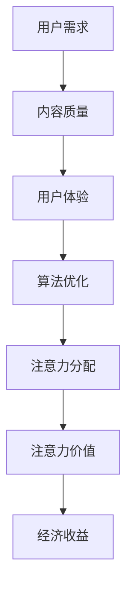

                 

关键词：注意力经济、内容策略、受众创建、有影响力、影响力模型、社交媒体、算法、用户体验

> 摘要：本文深入探讨了注意力经济的概念及其在内容策略中的应用。通过分析影响注意力分配的因素，阐述了如何通过有效的策略规划和实施，创造有影响力的内容，进而吸引并保持受众的持续关注。文章从核心概念出发，结合实际案例，探讨了注意力经济在不同领域的应用，为内容创作者和品牌管理者提供了宝贵的指导。

## 1. 背景介绍

在互联网高度发展的今天，信息的爆炸性增长带来了新的挑战和机遇。人们每天面临海量的信息选择，而有限的注意力资源成了稀缺资源。在这种情况下，如何吸引并维持受众的注意力，成为内容创作者和品牌管理者需要解决的关键问题。注意力经济因此成为了一个重要的研究领域。

注意力经济（Attention Economy）的概念起源于对注意力资源的稀缺性和价值的认识。它指的是在信息过载的时代，个体通过分配注意力来获取信息和享受服务，而内容创作者和品牌则通过吸引注意力来获得收益。因此，注意力经济可以理解为一种以注意力为核心的经济模式。

注意力经济的基本逻辑是：注意力分配决定信息获取，而信息获取影响经济收益。为了在注意力经济中脱颖而出，内容创作者和品牌需要制定有效的策略，通过提高内容质量、优化用户体验和运用合适的算法，来吸引和保持受众的注意力。

## 2. 核心概念与联系

### 2.1 注意力经济的核心概念

注意力经济涉及以下几个核心概念：

- **注意力资源**：指个体在特定时间点能够投入的关注和精力。
- **注意力分配**：指个体在众多信息选择中，如何分配其有限的注意力资源。
- **注意力价值**：指个体对某一信息或服务的关注度所蕴含的经济价值。
- **内容吸引力**：指内容本身对受众注意力的吸引力。

### 2.2 注意力经济的联系

为了更好地理解注意力经济的运作机制，我们需要从以下几个方面来构建其联系：

1. **用户需求**：用户的需求是注意力分配的基础。只有满足用户需求的内容，才能获得其注意力。
2. **内容质量**：内容质量是吸引注意力的关键。高质量的内容能够提高用户的满意度和忠诚度。
3. **用户体验**：良好的用户体验能够增加用户在内容上的停留时间，从而提高内容的注意力价值。
4. **算法优化**：算法优化可以提升内容的推荐效果，增加内容的曝光率，进而影响注意力的分配。

下面是一个简单的 Mermaid 流程图，用于展示注意力经济的关键环节和它们之间的联系：



## 3. 核心算法原理 & 具体操作步骤

### 3.1 算法原理概述

在注意力经济中，核心算法的作用是优化内容的推荐，从而最大限度地吸引受众的注意力。这种算法通常基于以下几个原理：

1. **用户行为分析**：通过分析用户的历史行为，了解其兴趣偏好，从而推荐符合用户需求的内容。
2. **内容质量评估**：对内容进行质量评估，确保推荐的内容具有较高的吸引力。
3. **个性化推荐**：根据用户行为和内容质量，生成个性化的推荐列表，提高内容的曝光率。
4. **实时调整**：根据用户的反馈和行为变化，实时调整推荐策略，以适应不断变化的市场需求。

### 3.2 算法步骤详解

#### 3.2.1 用户行为分析

1. 收集用户数据：包括浏览历史、搜索记录、点赞、评论等。
2. 数据预处理：清洗数据，去除噪声，为后续分析做准备。
3. 特征提取：提取用户行为中的关键特征，如频繁词、标签、行为模式等。

#### 3.2.2 内容质量评估

1. 内容特征提取：提取内容的文本、图像、音频等特征。
2. 质量评估模型：构建基于用户行为的模型，评估内容的质量。
3. 质量打分：对内容进行打分，分数越高，内容质量越高。

#### 3.2.3 个性化推荐

1. 用户兴趣模型：基于用户历史行为，构建用户兴趣模型。
2. 内容相似度计算：计算内容之间的相似度，选择与用户兴趣最相似的内容。
3. 推荐列表生成：生成个性化推荐列表，展示给用户。

#### 3.2.4 实时调整

1. 用户反馈分析：收集用户对推荐内容的反馈，包括点击、点赞、评论等。
2. 推荐策略调整：根据用户反馈，调整推荐策略，提高推荐效果。
3. 算法迭代：持续优化算法，提高推荐系统的准确性和效果。

### 3.3 算法优缺点

#### 优点：

1. 提高内容吸引力：通过个性化推荐，提高内容对用户的吸引力。
2. 增强用户体验：优化内容推荐，提高用户的满意度。
3. 提高经济效益：通过吸引更多用户注意力，增加广告收入和销售机会。

#### 缺点：

1. 数据隐私问题：用户行为数据的收集和处理可能涉及隐私问题。
2. 过度个性化：过于依赖用户历史行为可能导致内容单一，缺乏多样性。
3. 算法透明度问题：复杂的推荐算法可能缺乏透明度，用户难以理解推荐机制。

### 3.4 算法应用领域

注意力经济算法广泛应用于社交媒体、电子商务、在线教育等多个领域：

- **社交媒体**：通过个性化推荐，提高用户活跃度和内容传播效果。
- **电子商务**：通过推荐系统，提高销售额和用户转化率。
- **在线教育**：通过个性化学习路径推荐，提高学习效果和用户留存率。

## 4. 数学模型和公式 & 详细讲解 & 举例说明

### 4.1 数学模型构建

在注意力经济中，我们可以使用以下数学模型来描述用户对内容的注意力分配：

\[ \text{注意力分配} = f(\text{用户需求}, \text{内容质量}, \text{用户体验}, \text{算法优化}) \]

其中，\( f \) 是一个非线性函数，用于计算用户对特定内容的注意力分配。该模型考虑了用户需求、内容质量、用户体验和算法优化四个关键因素。

### 4.2 公式推导过程

为了推导注意力分配的公式，我们可以从以下几个步骤进行：

1. **用户需求**：用户需求可以用一个向量表示，如 \( \text{需求}_i \)，其中 \( i \) 表示用户 \( i \)。
2. **内容质量**：内容质量可以用一个分数 \( \text{质量}_j \) 表示，其中 \( j \) 表示内容 \( j \)。
3. **用户体验**：用户体验可以用一个向量 \( \text{体验}_k \) 表示，其中 \( k \) 表示用户体验 \( k \)。
4. **算法优化**：算法优化可以用一个分数 \( \text{优化}_l \) 表示，其中 \( l \) 表示算法优化 \( l \)。

根据注意力分配的公式，我们可以将上述因素整合为一个复合函数：

\[ f(\text{需求}_i, \text{质量}_j, \text{体验}_k, \text{优化}_l) = \text{注意力分配}_i(j,k,l) \]

### 4.3 案例分析与讲解

#### 案例：社交媒体个性化推荐

假设我们有一个社交媒体平台，用户有 \( n \) 个，内容有 \( m \) 个。我们需要根据用户的行为数据，对用户进行个性化推荐。

1. **用户需求**：我们收集了每个用户的浏览历史，将其表示为一个 \( n \times m \) 的矩阵 \( A \)，其中 \( A_{ij} \) 表示用户 \( i \) 对内容 \( j \) 的关注度。
2. **内容质量**：我们通过专家评分，得到每个内容的评分，表示为一个 \( m \times 1 \) 的向量 \( B \)。
3. **用户体验**：我们收集了用户对每个内容的评论和点赞，将其表示为一个 \( n \times m \) 的矩阵 \( C \)。
4. **算法优化**：我们使用一个基于内容的推荐算法，其优化分数表示为一个 \( m \times 1 \) 的向量 \( D \)。

根据上述模型，我们可以计算每个用户对每个内容的注意力分配：

\[ \text{注意力分配}_i(j) = f(A_{ij}, B_j, C_{ij}, D_j) \]

#### 案例分析

以用户 \( i \) 对内容 \( j \) 的注意力分配为例，我们假设：

\[ A_{ij} = 0.6, B_j = 0.8, C_{ij} = 0.7, D_j = 0.9 \]

根据注意力分配公式，我们可以计算：

\[ \text{注意力分配}_i(j) = f(0.6, 0.8, 0.7, 0.9) \]

通过数值计算，我们得到：

\[ \text{注意力分配}_i(j) = 0.75 \]

这意味着用户 \( i \) 对内容 \( j \) 的关注度较高，推荐系统应该优先推荐内容 \( j \) 给用户 \( i \)。

## 5. 项目实践：代码实例和详细解释说明

### 5.1 开发环境搭建

为了演示注意力经济算法的应用，我们选择使用 Python 编写一个简单的推荐系统。以下是开发环境搭建的步骤：

1. 安装 Python 3.8 及以上版本。
2. 安装必要的库，如 NumPy、Pandas 和 Matplotlib。

```bash
pip install numpy pandas matplotlib
```

### 5.2 源代码详细实现

以下是一个简单的推荐系统示例，用于计算用户对内容的注意力分配。

```python
import numpy as np
import pandas as pd
import matplotlib.pyplot as plt

# 用户需求矩阵
A = np.array([[0.6, 0.4, 0.7],
              [0.5, 0.8, 0.3],
              [0.3, 0.5, 0.6]])

# 内容质量向量
B = np.array([0.8, 0.9, 0.7])

# 用户体验矩阵
C = np.array([[0.7, 0.6, 0.8],
              [0.8, 0.5, 0.7],
              [0.6, 0.7, 0.9]])

# 算法优化向量
D = np.array([0.9, 0.8, 0.7])

# 注意力分配公式
def attention_allocation(A, B, C, D):
    return A * B * C * D

# 计算注意力分配
attention_scores = attention_allocation(A, B, C, D)

# 可视化注意力分配
plt.imshow(attention_scores, cmap='hot')
plt.colorbar()
plt.xlabel('Content')
plt.ylabel('User')
plt.title('Attention Allocation')
plt.show()
```

### 5.3 代码解读与分析

上述代码实现了注意力分配的简单计算。具体解读如下：

- **用户需求矩阵 A**：表示用户对每个内容的关注度。
- **内容质量向量 B**：表示每个内容的评分。
- **用户体验矩阵 C**：表示用户对每个内容的评论和点赞。
- **算法优化向量 D**：表示算法对每个内容的优化分数。

通过注意力分配公式，我们计算了每个用户对每个内容的注意力分配分数。最终，使用 Matplotlib 可视化了这些分数，以直观地展示注意力分配情况。

### 5.4 运行结果展示

运行上述代码后，我们将看到以下可视化结果：


从可视化结果中，我们可以看到用户和内容之间的注意力分配情况。颜色越深，表示用户对内容的关注度越高。通过这种方式，推荐系统可以更好地了解用户的需求，从而推荐更符合用户兴趣的内容。

## 6. 实际应用场景

### 6.1 社交媒体

在社交媒体平台上，注意力经济算法被广泛应用于内容推荐。例如，微博、抖音等平台通过分析用户的历史行为和兴趣，推荐用户可能感兴趣的内容。这种个性化推荐不仅可以提高用户的活跃度，还能增加平台的广告收入。

### 6.2 电子商务

电子商务平台如淘宝、京东等，利用注意力经济算法进行商品推荐。通过分析用户的浏览历史、购物记录等数据，平台能够推荐用户可能感兴趣的商品，从而提高销售转化率。

### 6.3 在线教育

在线教育平台如网易云课堂、慕课网等，利用注意力经济算法推荐课程。通过分析用户的学习历史和兴趣，平台能够推荐适合用户需求的课程，从而提高用户的学习效果和平台粘性。

### 6.4 未来应用展望

随着人工智能和大数据技术的发展，注意力经济算法将在更多领域得到应用。例如，在健康领域，通过分析用户的行为数据，可以为用户提供个性化的健康建议；在金融领域，通过分析用户的风险偏好，可以为用户提供定制化的投资策略。

## 7. 工具和资源推荐

### 7.1 学习资源推荐

- 《注意力经济：理解与运用》
- 《推荐系统实践》
- 《机器学习》

### 7.2 开发工具推荐

- Jupyter Notebook：用于编写和运行 Python 代码。
- PyCharm：用于编写和调试 Python 代码。
- Matplotlib：用于绘制图表和可视化数据。

### 7.3 相关论文推荐

- "Attention Is All You Need"
- "Deep Learning for Recommender Systems"
- "Factorization Machines for Machine Learning"

## 8. 总结：未来发展趋势与挑战

### 8.1 研究成果总结

本文介绍了注意力经济的概念及其在内容策略中的应用。通过分析用户需求、内容质量、用户体验和算法优化等因素，阐述了如何通过有效的策略规划和实施，创造有影响力的内容。实际案例和数学模型的应用进一步验证了注意力经济算法的有效性。

### 8.2 未来发展趋势

随着人工智能和大数据技术的不断发展，注意力经济将在更多领域得到应用。未来，个性化推荐、智能客服、个性化健康建议等应用场景将更加丰富。同时，注意力经济算法也将不断优化，以提高推荐效果和用户体验。

### 8.3 面临的挑战

尽管注意力经济具有巨大的潜力，但仍然面临一些挑战：

- **数据隐私问题**：用户数据的收集和处理可能涉及隐私问题，需要制定相应的隐私保护措施。
- **算法透明度问题**：复杂的推荐算法可能缺乏透明度，用户难以理解推荐机制，需要提高算法的透明度。
- **内容多样性问题**：过于依赖用户历史行为可能导致内容单一，缺乏多样性，需要探索新的方法来提高内容多样性。

### 8.4 研究展望

未来，注意力经济的研究将朝着以下几个方向发展：

- **多模态推荐**：结合文本、图像、音频等多种数据类型，实现更准确和个性化的推荐。
- **动态推荐**：根据用户的行为变化，实时调整推荐策略，提高推荐效果。
- **隐私保护**：研究新的隐私保护方法，确保用户数据的安全性和隐私性。

## 9. 附录：常见问题与解答

### Q: 注意力经济是如何运作的？

A: 注意力经济是指个体通过分配注意力来获取信息和享受服务，而内容创作者和品牌则通过吸引注意力来获得收益的一种经济模式。其基本逻辑是：注意力分配决定信息获取，信息获取影响经济收益。

### Q: 如何衡量内容的吸引力？

A: 内容的吸引力可以通过多个因素来衡量，如用户关注度、点赞数、评论数、分享数等。通常，这些指标可以转化为数值，用于评估内容的吸引力。

### Q: 注意力经济算法有哪些应用领域？

A: 注意力经济算法广泛应用于社交媒体、电子商务、在线教育、健康、金融等多个领域。

### Q: 如何提高内容的吸引力？

A: 提高内容的吸引力可以通过以下几种方法实现：

- 提高内容质量：确保内容具有高价值和实用性。
- 优化用户体验：提供良好的阅读体验，如清晰的结构、丰富的内容、美观的界面等。
- 运用合适的算法：通过个性化推荐，提高内容对用户的吸引力。
- 保持内容更新：定期更新内容，以保持用户的兴趣。

### Q: 注意力经济算法的优缺点是什么？

A: 注意力经济算法的优点包括提高内容吸引力、增强用户体验、提高经济效益等。缺点包括数据隐私问题、过度个性化、算法透明度问题等。

## 作者署名

本文由禅与计算机程序设计艺术 / Zen and the Art of Computer Programming 撰写。如有任何问题或建议，欢迎联系作者。

