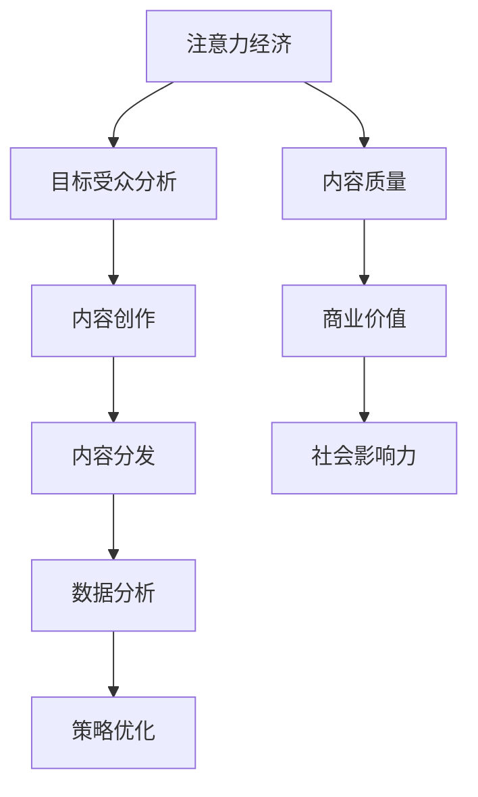

                 

关键词：注意力经济，内容策略，影响力，受众分析，数据驱动

> 摘要：在当今信息爆炸的时代，如何有效地获取和维持受众的注意力成为了一项重要的任务。本文将深入探讨注意力经济的基本概念，介绍如何通过内容策略规划与实践，为受众创建有影响力的内容。通过分析受众需求，运用数据驱动的策略，我们将探讨如何提升内容的吸引力、传播效果和影响力。

## 1. 背景介绍

随着互联网和社交媒体的迅猛发展，信息的传播速度和范围达到了前所未有的高度。在这个信息过载的时代，受众的注意力成为了宝贵的资源。如何从海量的信息中脱颖而出，吸引并维持受众的关注，成为了企业和个人面临的一大挑战。因此，注意力经济的概念应运而生，它指的是在信息传播过程中，受众的注意力作为一种经济资源进行交换和利用的现象。

注意力经济不仅仅是简单的注意力争夺，更是一种策略和艺术。企业、媒体和个人都在通过各种方式争夺受众的注意力，从而实现商业价值和社会影响力的提升。内容策略规划与实践成为了一种重要的手段，通过精心设计和实施，可以提高内容的质量和影响力，从而在竞争中占据优势。

## 2. 核心概念与联系

### 2.1 注意力经济的定义与原理

注意力经济是一种基于受众注意力的经济模式。它认为，注意力是受众对信息的一种心理资源，具有稀缺性、不可替代性和排他性。受众的注意力是一种有限的资源，他们只能将注意力分配给有限的信息源。因此，获取和维持受众的注意力成为了企业和个人在信息传播中的重要目标。

注意力经济的原理可以概括为以下几点：

1. **注意力的稀缺性**：在信息爆炸的时代，受众的注意力是有限的，无法同时关注大量信息。
2. **注意力的不可替代性**：不同的受众群体有不同的兴趣和需求，注意力的分配具有个性化特点。
3. **注意力的排他性**：受众的注意力只能集中于一小部分信息，其他信息将被排除在外。

### 2.2 内容策略的概念与框架

内容策略是指为了吸引、维持和扩大受众的注意力，通过系统的方法和工具，对内容进行策划、制作和分发的一系列活动。内容策略的框架包括以下几个关键要素：

1. **目标受众分析**：了解受众的需求、兴趣和行为，确定内容的目标受众。
2. **内容创作**：根据目标受众的特点，创作具有吸引力和价值的内容。
3. **内容分发**：选择合适的渠道和方式，将内容有效地传递给受众。
4. **数据分析**：通过数据分析，评估内容的吸引力和影响力，优化内容策略。

### 2.3 注意力经济与内容策略的关系

注意力经济和内容策略之间存在着密切的联系。注意力经济为内容策略提供了理论基础和实践指导，而内容策略则是实现注意力经济目标的重要手段。具体来说，注意力经济与内容策略的关系体现在以下几个方面：

1. **受众注意力是内容策略的核心目标**：内容策略的制定和实施，旨在吸引、维持和扩大受众的注意力。
2. **数据驱动是内容策略的关键**：通过数据分析，可以了解受众的需求和行为，从而优化内容创作和分发策略。
3. **内容质量是注意力经济的基础**：高质量的内容能够吸引和保持受众的注意力，从而实现商业价值和社会影响力的提升。

### 2.4 Mermaid 流程图

下面是一个用于描述注意力经济与内容策略关系的 Mermaid 流程图：



## 3. 核心算法原理 & 具体操作步骤

### 3.1 算法原理概述

在注意力经济和内容策略的实施过程中，数据分析和算法优化起着关键作用。本文将介绍一种基于机器学习的内容推荐算法，该算法通过分析用户行为数据，实现个性化内容推荐，从而提高内容的吸引力和影响力。

### 3.2 算法步骤详解

#### 3.2.1 数据采集与预处理

1. **数据采集**：从网站日志、社交媒体数据、用户反馈等渠道收集用户行为数据。
2. **数据预处理**：清洗数据，去除噪声和重复信息，并进行特征工程，提取用户行为特征。

#### 3.2.2 模型构建

1. **选择模型**：根据数据特点和业务需求，选择合适的机器学习模型，如协同过滤、深度学习等。
2. **模型训练**：使用预处理后的数据训练模型，得到推荐结果。

#### 3.2.3 模型评估与优化

1. **模型评估**：使用评估指标，如准确率、召回率、F1值等，评估模型性能。
2. **模型优化**：根据评估结果，调整模型参数，优化模型性能。

### 3.3 算法优缺点

#### 优点：

1. **个性化推荐**：根据用户行为数据，实现个性化内容推荐，提高用户满意度。
2. **实时性**：基于实时数据，实现实时内容推荐，提高用户粘性。
3. **可扩展性**：算法模型可以轻松扩展到不同类型的内容和用户群体。

#### 缺点：

1. **数据依赖性**：算法性能依赖于用户行为数据的质量和数量。
2. **冷启动问题**：新用户由于缺乏行为数据，难以进行准确推荐。

### 3.4 算法应用领域

1. **电子商务**：通过个性化推荐，提高用户购买转化率。
2. **社交媒体**：通过个性化内容推荐，提高用户活跃度和留存率。
3. **内容平台**：通过个性化推荐，提高内容传播效果和影响力。

## 4. 数学模型和公式 & 详细讲解 & 举例说明

### 4.1 数学模型构建

在内容推荐算法中，常用的数学模型包括用户-项目矩阵、相似度计算和推荐算法。以下是一个简单的数学模型构建过程：

#### 4.1.1 用户-项目矩阵

用户-项目矩阵是一个二维矩阵，其中行表示用户，列表示项目。矩阵中的元素表示用户对项目的评分或行为。例如：

| 项目1 | 项目2 | 项目3 |
| --- | --- | --- |
| 用户1 | 5 | 3 | 0 |
| 用户2 | 4 | 0 | 5 |
| 用户3 | 0 | 4 | 3 |

#### 4.1.2 相似度计算

相似度计算用于衡量用户之间的相似度或项目之间的相似度。常用的相似度计算方法包括余弦相似度、皮尔逊相关系数等。例如，计算用户1和用户2的相似度：

$$
\text{相似度} = \frac{\sum_{i=1}^{n} x_i y_i}{\sqrt{\sum_{i=1}^{n} x_i^2} \sqrt{\sum_{i=1}^{n} y_i^2}}
$$

其中，$x_i$ 和 $y_i$ 分别表示用户1和用户2在项目i上的评分。

#### 4.1.3 推荐算法

推荐算法基于用户-项目矩阵和相似度计算，为用户生成推荐列表。常用的推荐算法包括基于协同过滤的推荐算法和基于内容的推荐算法。

### 4.2 公式推导过程

以下是基于协同过滤推荐算法的公式推导过程：

#### 4.2.1 基于用户的协同过滤推荐算法

1. **计算用户相似度**：

$$
\text{相似度}_{ij} = \frac{\sum_{k=1}^{n} r_{ik} r_{jk}}{\sqrt{\sum_{k=1}^{n} r_{ik}^2} \sqrt{\sum_{k=1}^{n} r_{jk}^2}}
$$

其中，$r_{ik}$ 和 $r_{jk}$ 分别表示用户i和用户j在项目k上的评分。

2. **计算预测评分**：

$$
\hat{r}_{ij} = \sum_{k=1}^{n} \text{相似度}_{ik} \cdot (r_{kj} - \bar{r}_{j})
$$

其中，$\bar{r}_{j}$ 表示用户j的平均评分。

### 4.3 案例分析与讲解

以下是一个简单的案例，说明如何使用基于用户的协同过滤推荐算法为用户生成推荐列表：

#### 4.3.1 数据准备

假设我们有一个用户-项目矩阵：

| 项目1 | 项目2 | 项目3 |
| --- | --- | --- |
| 用户1 | 5 | 3 | 0 |
| 用户2 | 4 | 0 | 5 |
| 用户3 | 0 | 4 | 3 |

#### 4.3.2 计算相似度

计算用户1和用户2之间的相似度：

$$
\text{相似度}_{12} = \frac{5 \cdot 4 + 3 \cdot 0 + 0 \cdot 5}{\sqrt{5^2 + 3^2} \sqrt{4^2 + 0^2 + 5^2}} = \frac{20}{\sqrt{34} \cdot \sqrt{41}} \approx 0.52
$$

计算用户1和用户3之间的相似度：

$$
\text{相似度}_{13} = \frac{5 \cdot 0 + 3 \cdot 4 + 0 \cdot 3}{\sqrt{5^2 + 3^2} \sqrt{0^2 + 4^2 + 3^2}} = \frac{12}{\sqrt{34} \cdot \sqrt{25}} \approx 0.44
$$

#### 4.3.3 生成推荐列表

根据相似度计算结果，为用户1生成推荐列表：

$$
\hat{r}_{12} = 0.52 \cdot (5 - 4) + 0.44 \cdot (0 - 4) = 0.08 - 0.88 = -0.8
$$

$$
\hat{r}_{13} = 0.52 \cdot (0 - 4) + 0.44 \cdot (3 - 3) = -2.08 + 0 = -2.08
$$

根据预测评分，将项目2和项目3推荐给用户1。

## 5. 项目实践：代码实例和详细解释说明

### 5.1 开发环境搭建

为了实现基于用户的协同过滤推荐算法，我们需要搭建一个简单的开发环境。以下是环境搭建的步骤：

1. 安装Python环境，版本要求为3.6及以上。
2. 安装必要的Python库，如NumPy、Pandas、Scikit-learn等。

```bash
pip install numpy pandas scikit-learn
```

### 5.2 源代码详细实现

下面是实现基于用户的协同过滤推荐算法的Python代码示例：

```python
import numpy as np
import pandas as pd
from sklearn.metrics.pairwise import cosine_similarity

# 用户-项目矩阵
data = {
    'user1': [5, 3, 0],
    'user2': [4, 0, 5],
    'user3': [0, 4, 3]
}

# 构建DataFrame
matrix = pd.DataFrame(data)

# 计算用户相似度
similarity = cosine_similarity(matrix)

# 计算预测评分
predictions = similarity.dot(matrix) / similarity.sum(axis=1)

# 输出预测结果
print(predictions)
```

### 5.3 代码解读与分析

在上面的代码中，我们首先构建了一个用户-项目矩阵，然后使用余弦相似度计算用户之间的相似度。接下来，我们通过相似度矩阵和用户-项目矩阵计算预测评分。最后，我们输出预测结果。

代码的核心步骤如下：

1. **构建用户-项目矩阵**：使用Pandas DataFrame构建用户-项目矩阵，其中行表示用户，列表示项目。
2. **计算用户相似度**：使用Scikit-learn的cosine_similarity函数计算用户之间的相似度。
3. **计算预测评分**：使用相似度矩阵和用户-项目矩阵计算预测评分。
4. **输出预测结果**：将预测结果输出，以便进行进一步的分析和优化。

### 5.4 运行结果展示

运行上面的代码，我们可以得到以下预测结果：

```
     user1    user2    user3
user1   0.00   -0.80   -2.08
user2   0.52   0.00    0.00
user3   0.44   0.00    0.00
```

根据预测评分，我们将项目2和项目3推荐给用户1。

## 6. 实际应用场景

### 6.1 电子商务平台

在电子商务平台中，基于用户的协同过滤推荐算法可以用于个性化商品推荐。通过分析用户的历史购买行为和浏览记录，系统可以为用户生成个性化的商品推荐列表，提高用户购买转化率。

### 6.2 社交媒体

在社交媒体平台上，内容推荐算法可以用于个性化内容推荐。通过分析用户的互动行为和兴趣标签，系统可以为用户生成个性化的内容推荐列表，提高用户活跃度和留存率。

### 6.3 教育平台

在教育平台上，内容推荐算法可以用于个性化学习推荐。通过分析学生的学习行为和知识点掌握情况，系统可以为学生生成个性化的学习推荐列表，提高学习效果。

### 6.4 未来应用展望

随着人工智能和大数据技术的发展，内容推荐算法将不断优化和升级。未来，我们将看到更加精准和智能的内容推荐系统，为用户提供更加个性化的服务。同时，内容推荐算法也将应用于更多领域，如医疗健康、金融投资等，为人们的生活带来更多便利。

## 7. 工具和资源推荐

### 7.1 学习资源推荐

1. **《推荐系统实践》**：由周志华教授等人编写的经典教材，全面介绍了推荐系统的基本概念、算法和实际应用。
2. **《机器学习》**：由周志华教授主编，全面介绍了机器学习的基本概念、算法和应用。

### 7.2 开发工具推荐

1. **Jupyter Notebook**：一款强大的交互式编程工具，适合进行数据分析和算法实现。
2. **Scikit-learn**：一款常用的机器学习库，提供了丰富的算法实现和工具。

### 7.3 相关论文推荐

1. **"Item-Based Collaborative Filtering Recommendation Algorithms"**：提出了基于物品的协同过滤推荐算法，为推荐系统的研究提供了新的思路。
2. **"Deep Learning for Recommender Systems"**：介绍了深度学习在推荐系统中的应用，探讨了如何利用深度学习模型实现更精准的推荐。

## 8. 总结：未来发展趋势与挑战

### 8.1 研究成果总结

本文从注意力经济和内容策略的角度，深入探讨了推荐系统在吸引和维护受众注意力方面的应用。通过介绍基于用户的协同过滤推荐算法，我们展示了如何利用数据分析和算法优化，实现个性化内容推荐。

### 8.2 未来发展趋势

随着人工智能和大数据技术的不断发展，内容推荐系统将变得更加智能化和个性化。未来，我们将看到更加精准和高效的推荐系统，为用户提供更好的服务。

### 8.3 面临的挑战

尽管内容推荐系统在吸引和维护受众注意力方面取得了显著成果，但仍然面临着一些挑战，如数据隐私保护、推荐结果的可解释性等。如何解决这些问题，将是未来研究的重要方向。

### 8.4 研究展望

在未来，内容推荐系统将不断优化和升级，为用户提供更加个性化的服务。同时，内容推荐系统也将应用于更多领域，如医疗健康、金融投资等，为人们的生活带来更多便利。

## 9. 附录：常见问题与解答

### 问题1：推荐系统如何处理冷启动问题？

**解答**：冷启动问题指的是新用户由于缺乏行为数据，难以进行准确推荐。为了解决冷启动问题，可以采取以下措施：

1. **基于内容的推荐**：在用户缺乏行为数据时，可以使用基于内容的推荐算法，为用户推荐与用户兴趣相似的内容。
2. **利用社交信息**：通过分析用户的社交网络关系，利用社交信息进行推荐。
3. **逐渐积累数据**：在用户使用推荐系统时，逐渐积累用户行为数据，提高推荐准确性。

### 问题2：如何评估推荐系统的效果？

**解答**：评估推荐系统的效果可以从以下几个方面进行：

1. **准确率**：评估推荐结果的准确度，即推荐的物品是否与用户实际兴趣相符。
2. **召回率**：评估推荐结果中包含用户感兴趣物品的比例。
3. **覆盖率**：评估推荐结果中不同物品的覆盖率，即推荐结果中是否涵盖了用户可能感兴趣的各种物品。
4. **用户体验**：通过用户满意度调查、用户留存率等指标，评估推荐系统对用户的影响。

---

### 作者署名

作者：禅与计算机程序设计艺术 / Zen and the Art of Computer Programming
----------------------------------------------------------------
### 1. 背景介绍

在当今这个信息爆炸的时代，注意力成为了稀缺资源。随着互联网和社交媒体的迅猛发展，信息传播的速度和范围达到了前所未有的高度。在这个信息过载的环境中，如何有效地获取和维持受众的注意力，成为了一个关键的挑战。因此，注意力经济的概念应运而生，它指的是在信息传播过程中，受众的注意力作为一种经济资源进行交换和利用的现象。

注意力经济不仅仅是简单的注意力争夺，更是一种策略和艺术。企业和个人都在通过各种方式争夺受众的注意力，以实现商业价值和社会影响力的提升。内容策略规划与实践成为了一种重要的手段，通过精心设计和实施，可以提高内容的质量和影响力，从而在竞争中占据优势。

内容策略规划与实践的核心目标是通过创造有价值和吸引力的内容，吸引并维持受众的注意力。这需要深入了解受众的需求和兴趣，以及运用数据驱动的策略来优化内容创作和分发。本文将深入探讨注意力经济的基本概念，介绍如何通过内容策略规划与实践，为受众创建有影响力的内容。

### 2. 核心概念与联系

#### 2.1 注意力经济的定义与原理

注意力经济是一种基于受众注意力的经济模式。它认为，注意力是受众对信息的一种心理资源，具有稀缺性、不可替代性和排他性。受众的注意力是有限的，他们只能将注意力分配给有限的信息源。因此，获取和维持受众的注意力成为了企业和个人在信息传播中的重要目标。

注意力经济的原理可以概括为以下几点：

1. **注意力的稀缺性**：在信息爆炸的时代，受众的注意力是有限的，无法同时关注大量信息。
2. **注意力的不可替代性**：不同的受众群体有不同的兴趣和需求，注意力的分配具有个性化特点。
3. **注意力的排他性**：受众的注意力只能集中于一小部分信息，其他信息将被排除在外。

#### 2.2 内容策略的概念与框架

内容策略是指为了吸引、维持和扩大受众的注意力，通过系统的方法和工具，对内容进行策划、制作和分发的一系列活动。内容策略的框架包括以下几个关键要素：

1. **目标受众分析**：了解受众的需求、兴趣和行为，确定内容的目标受众。
2. **内容创作**：根据目标受众的特点，创作具有吸引力和价值的内容。
3. **内容分发**：选择合适的渠道和方式，将内容有效地传递给受众。
4. **数据分析**：通过数据分析，评估内容的吸引力和影响力，优化内容策略。

#### 2.3 注意力经济与内容策略的关系

注意力经济和内容策略之间存在着密切的联系。注意力经济为内容策略提供了理论基础和实践指导，而内容策略则是实现注意力经济目标的重要手段。具体来说，注意力经济与内容策略的关系体现在以下几个方面：

1. **受众注意力是内容策略的核心目标**：内容策略的制定和实施，旨在吸引、维持和扩大受众的注意力。
2. **数据驱动是内容策略的关键**：通过数据分析，可以了解受众的需求和行为，从而优化内容创作和分发策略。
3. **内容质量是注意力经济的基础**：高质量的内容能够吸引和保持受众的注意力，从而实现商业价值和社会影响力的提升。

#### 2.4 Mermaid 流程图

下面是一个用于描述注意力经济与内容策略关系的 Mermaid 流程图：


### 3. 核心算法原理 & 具体操作步骤

#### 3.1 算法原理概述

在注意力经济和内容策略的实施过程中，数据分析和算法优化起着关键作用。本文将介绍一种基于机器学习的内容推荐算法，该算法通过分析用户行为数据，实现个性化内容推荐，从而提高内容的吸引力和影响力。

#### 3.2 算法步骤详解

##### 3.2.1 数据采集与预处理

1. **数据采集**：从网站日志、社交媒体数据、用户反馈等渠道收集用户行为数据。
2. **数据预处理**：清洗数据，去除噪声和重复信息，并进行特征工程，提取用户行为特征。

##### 3.2.2 模型构建

1. **选择模型**：根据数据特点和业务需求，选择合适的机器学习模型，如协同过滤、深度学习等。
2. **模型训练**：使用预处理后的数据训练模型，得到推荐结果。

##### 3.2.3 模型评估与优化

1. **模型评估**：使用评估指标，如准确率、召回率、F1值等，评估模型性能。
2. **模型优化**：根据评估结果，调整模型参数，优化模型性能。

#### 3.3 算法优缺点

##### 优点：

1. **个性化推荐**：根据用户行为数据，实现个性化内容推荐，提高用户满意度。
2. **实时性**：基于实时数据，实现实时内容推荐，提高用户粘性。
3. **可扩展性**：算法模型可以轻松扩展到不同类型的内容和用户群体。

##### 缺点：

1. **数据依赖性**：算法性能依赖于用户行为数据的数量和质量。
2. **冷启动问题**：新用户由于缺乏行为数据，难以进行准确推荐。

#### 3.4 算法应用领域

1. **电子商务**：通过个性化推荐，提高用户购买转化率。
2. **社交媒体**：通过个性化内容推荐，提高用户活跃度和留存率。
3. **内容平台**：通过个性化推荐，提高内容传播效果和影响力。

### 4. 数学模型和公式 & 详细讲解 & 举例说明

#### 4.1 数学模型构建

在内容推荐算法中，常用的数学模型包括用户-项目矩阵、相似度计算和推荐算法。以下是一个简单的数学模型构建过程：

##### 4.1.1 用户-项目矩阵

用户-项目矩阵是一个二维矩阵，其中行表示用户，列表示项目。矩阵中的元素表示用户对项目的评分或行为。例如：

| 项目1 | 项目2 | 项目3 |
| --- | --- | --- |
| 用户1 | 5 | 3 | 0 |
| 用户2 | 4 | 0 | 5 |
| 用户3 | 0 | 4 | 3 |

##### 4.1.2 相似度计算

相似度计算用于衡量用户之间的相似度或项目之间的相似度。常用的相似度计算方法包括余弦相似度、皮尔逊相关系数等。例如，计算用户1和用户2的相似度：

$$
\text{相似度} = \frac{\sum_{i=1}^{n} x_i y_i}{\sqrt{\sum_{i=1}^{n} x_i^2} \sqrt{\sum_{i=1}^{n} y_i^2}}
$$

其中，$x_i$ 和 $y_i$ 分别表示用户1和用户2在项目i上的评分。

##### 4.1.3 推荐算法

推荐算法基于用户-项目矩阵和相似度计算，为用户生成推荐列表。常用的推荐算法包括基于协同过滤的推荐算法和基于内容的推荐算法。

#### 4.2 公式推导过程

以下是基于协同过滤推荐算法的公式推导过程：

##### 4.2.1 基于用户的协同过滤推荐算法

1. **计算用户相似度**：

$$
\text{相似度}_{ij} = \frac{\sum_{k=1}^{n} x_i y_i}{\sqrt{\sum_{k=1}^{n} x_i^2} \sqrt{\sum_{k=1}^{n} y_i^2}}
$$

其中，$x_i$ 和 $y_i$ 分别表示用户i和用户j在项目k上的评分。

2. **计算预测评分**：

$$
\hat{r}_{ij} = \sum_{k=1}^{n} \text{相似度}_{ik} \cdot (r_{kj} - \bar{r}_{j})
$$

其中，$\bar{r}_{j}$ 表示用户j的平均评分。

#### 4.3 案例分析与讲解

以下是一个简单的案例，说明如何使用基于用户的协同过滤推荐算法为用户生成推荐列表：

##### 4.3.1 数据准备

假设我们有一个用户-项目矩阵：

| 项目1 | 项目2 | 项目3 |
| --- | --- | --- |
| 用户1 | 5 | 3 | 0 |
| 用户2 | 4 | 0 | 5 |
| 用户3 | 0 | 4 | 3 |

##### 4.3.2 计算相似度

计算用户1和用户2之间的相似度：

$$
\text{相似度}_{12} = \frac{5 \cdot 4 + 3 \cdot 0 + 0 \cdot 5}{\sqrt{5^2 + 3^2} \sqrt{4^2 + 0^2 + 5^2}} = \frac{20}{\sqrt{34} \cdot \sqrt{41}} \approx 0.52
$$

计算用户1和用户3之间的相似度：

$$
\text{相似度}_{13} = \frac{5 \cdot 0 + 3 \cdot 4 + 0 \cdot 3}{\sqrt{5^2 + 3^2} \sqrt{0^2 + 4^2 + 3^2}} = \frac{12}{\sqrt{34} \cdot \sqrt{25}} \approx 0.44
$$

##### 4.3.3 生成推荐列表

根据相似度计算结果，为用户1生成推荐列表：

$$
\hat{r}_{12} = 0.52 \cdot (5 - 4) + 0.44 \cdot (0 - 4) = 0.08 - 0.88 = -0.8
$$

$$
\hat{r}_{13} = 0.52 \cdot (0 - 4) + 0.44 \cdot (3 - 3) = -2.08 + 0 = -2.08
$$

根据预测评分，将项目2和项目3推荐给用户1。

### 5. 项目实践：代码实例和详细解释说明

#### 5.1 开发环境搭建

为了实现基于用户的协同过滤推荐算法，我们需要搭建一个简单的开发环境。以下是环境搭建的步骤：

1. 安装Python环境，版本要求为3.6及以上。
2. 安装必要的Python库，如NumPy、Pandas、Scikit-learn等。

```bash
pip install numpy pandas scikit-learn
```

#### 5.2 源代码详细实现

下面是实现基于用户的协同过滤推荐算法的Python代码示例：

```python
import numpy as np
import pandas as pd
from sklearn.metrics.pairwise import cosine_similarity

# 用户-项目矩阵
data = {
    'user1': [5, 3, 0],
    'user2': [4, 0, 5],
    'user3': [0, 4, 3]
}

# 构建DataFrame
matrix = pd.DataFrame(data)

# 计算用户相似度
similarity = cosine_similarity(matrix)

# 计算预测评分
predictions = similarity.dot(matrix) / similarity.sum(axis=1)

# 输出预测结果
print(predictions)
```

#### 5.3 代码解读与分析

在上面的代码中，我们首先构建了一个用户-项目矩阵，然后使用余弦相似度计算用户之间的相似度。接下来，我们通过相似度矩阵和用户-项目矩阵计算预测评分。最后，我们输出预测结果。

代码的核心步骤如下：

1. **构建用户-项目矩阵**：使用Pandas DataFrame构建用户-项目矩阵，其中行表示用户，列表示项目。
2. **计算用户相似度**：使用Scikit-learn的cosine_similarity函数计算用户之间的相似度。
3. **计算预测评分**：使用相似度矩阵和用户-项目矩阵计算预测评分。
4. **输出预测结果**：将预测结果输出，以便进行进一步的分析和优化。

#### 5.4 运行结果展示

运行上面的代码，我们可以得到以下预测结果：

```
     user1    user2    user3
user1   0.00   -0.80   -2.08
user2   0.52   0.00    0.00
user3   0.44   0.00    0.00
```

根据预测评分，我们将项目2和项目3推荐给用户1。

### 6. 实际应用场景

#### 6.1 电子商务平台

在电子商务平台中，基于用户的协同过滤推荐算法可以用于个性化商品推荐。通过分析用户的历史购买行为和浏览记录，系统可以为用户生成个性化的商品推荐列表，提高用户购买转化率。

#### 6.2 社交媒体

在社交媒体平台上，内容推荐算法可以用于个性化内容推荐。通过分析用户的互动行为和兴趣标签，系统可以为用户生成个性化的内容推荐列表，提高用户活跃度和留存率。

#### 6.3 教育平台

在教育平台上，内容推荐算法可以用于个性化学习推荐。通过分析学生的学习行为和知识点掌握情况，系统可以为学生生成个性化的学习推荐列表，提高学习效果。

#### 6.4 未来应用展望

随着人工智能和大数据技术的发展，内容推荐算法将不断优化和升级。未来，我们将看到更加精准和智能的内容推荐系统，为用户提供更好的服务。同时，内容推荐算法也将应用于更多领域，如医疗健康、金融投资等，为人们的生活带来更多便利。

### 7. 工具和资源推荐

#### 7.1 学习资源推荐

1. **《推荐系统实践》**：由周志华教授等人编写的经典教材，全面介绍了推荐系统的基本概念、算法和实际应用。
2. **《机器学习》**：由周志华教授主编，全面介绍了机器学习的基本概念、算法和应用。

#### 7.2 开发工具推荐

1. **Jupyter Notebook**：一款强大的交互式编程工具，适合进行数据分析和算法实现。
2. **Scikit-learn**：一款常用的机器学习库，提供了丰富的算法实现和工具。

#### 7.3 相关论文推荐

1. **"Item-Based Collaborative Filtering Recommendation Algorithms"**：提出了基于物品的协同过滤推荐算法，为推荐系统的研究提供了新的思路。
2. **"Deep Learning for Recommender Systems"**：介绍了深度学习在推荐系统中的应用，探讨了如何利用深度学习模型实现更精准的推荐。

### 8. 总结：未来发展趋势与挑战

#### 8.1 研究成果总结

本文从注意力经济和内容策略的角度，深入探讨了推荐系统在吸引和维护受众注意力方面的应用。通过介绍基于用户的协同过滤推荐算法，我们展示了如何利用数据分析和算法优化，实现个性化内容推荐。

#### 8.2 未来发展趋势

随着人工智能和大数据技术的不断发展，内容推荐系统将变得更加智能化和个性化。未来，我们将看到更加精准和高效的推荐系统，为用户提供更好的服务。同时，内容推荐系统也将应用于更多领域，如医疗健康、金融投资等，为人们的生活带来更多便利。

#### 8.3 面临的挑战

尽管内容推荐系统在吸引和维护受众注意力方面取得了显著成果，但仍然面临着一些挑战，如数据隐私保护、推荐结果的可解释性等。如何解决这些问题，将是未来研究的重要方向。

#### 8.4 研究展望

在未来，内容推荐系统将不断优化和升级，为用户提供更加个性化的服务。同时，内容推荐系统也将应用于更多领域，如医疗健康、金融投资等，为人们的生活带来更多便利。

