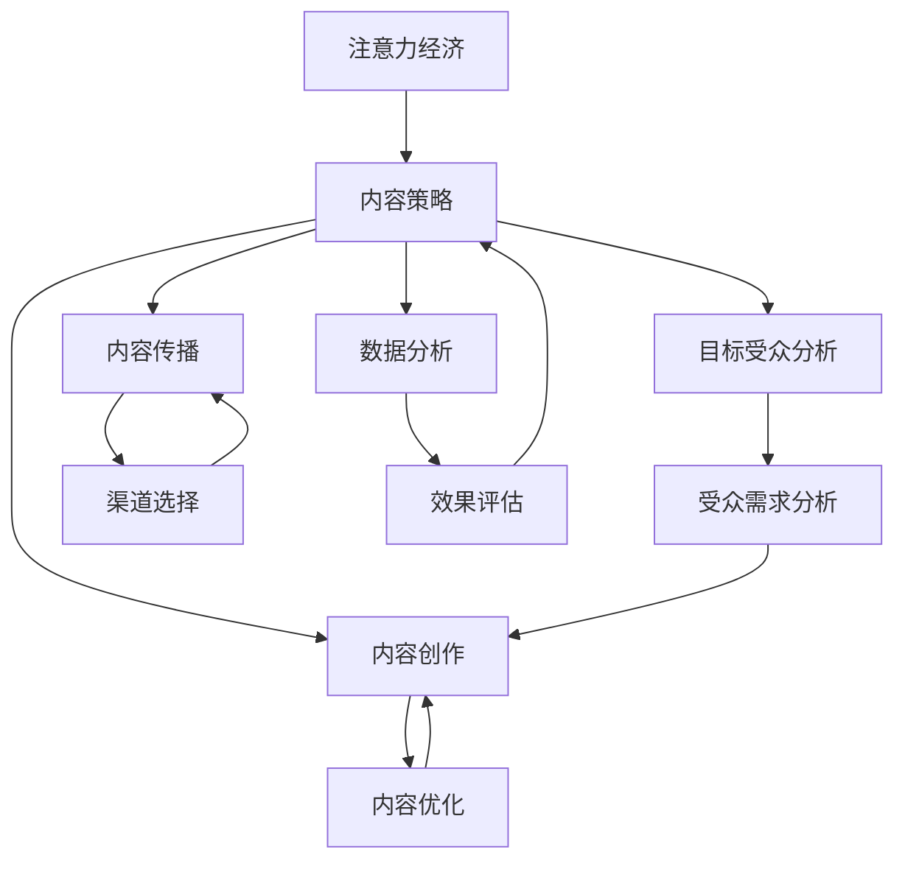

                 

 在当今数字化时代，信息的爆炸性增长使得受众获取注意力变得异常困难。为了在竞争激烈的市场中脱颖而出，企业和个人必须掌握注意力经济的原则，并制定有效的内容策略。本文将探讨注意力经济的基本原理、内容策略的规划与实践，以及如何为受众创建有影响力的内容。

## 文章关键词

- 注意力经济
- 内容策略
- 内容规划
- 内容营销
- 受众影响力
- 数据分析

## 文章摘要

本文首先介绍了注意力经济的基本概念，随后探讨了内容策略的规划过程，包括目标受众分析、内容创作和传播策略的制定。接着，我们深入分析了如何通过高质量的内容创作吸引受众，并讨论了数据分析在内容策略优化中的作用。文章还提供了实际的案例分析，展示了如何将理论应用于实践。最后，文章提出了未来注意力经济与内容策略发展的趋势和挑战。

## 1. 背景介绍

随着互联网和社交媒体的普及，信息的获取方式发生了巨大的变化。传统的大众传媒逐渐被分散化的内容生产所取代，每个人都可以成为信息的发布者。然而，这种信息过载现象也带来了新的挑战：如何在海量信息中获取注意力，成为受众关注的焦点。

注意力经济（Attention Economy）这一概念最早由阿根廷作家马西米利亚诺·科尔赫斯（Machiavello Correa）在20世纪90年代提出。他指出，在数字时代，注意力成为了一种稀缺资源，与黄金、石油等物质资源一样宝贵。企业和个人为了吸引受众的注意力，必须提供有价值的内容。

### 1.1 注意力经济的核心原则

注意力经济的核心原则包括：

1. **注意力稀缺性**：在信息过载的时代，受众的注意力是有限的，因此，吸引并保持受众的注意力变得至关重要。
2. **价值交换**：受众愿意将其宝贵的注意力投入到他们认为有价值的内容中，这通常涉及时间、情感或金钱的交换。
3. **注意力集中化**：为了吸引更多的注意力，内容创造者需要将内容集中化，使其具有独特性和吸引力。

### 1.2 内容策略的重要性

内容策略是企业或个人在数字化营销中不可或缺的一部分。一个良好的内容策略可以帮助企业：

1. **建立品牌形象**：通过持续的内容输出，企业可以塑造独特的品牌形象，增强品牌影响力。
2. **吸引目标受众**：明确的目标受众分析有助于企业创作符合受众需求的内容，从而提高内容的吸引力。
3. **促进用户参与**：优质的内容可以激发受众的互动和参与，提高用户忠诚度。
4. **提升搜索引擎排名**：通过搜索引擎优化（SEO）策略，高质量的内容有助于提升网站在搜索引擎中的排名。

### 1.3 内容策略的定义

内容策略是指为了实现特定的营销目标，通过系统的规划和执行，创作、发布、管理和优化内容的过程。它不仅包括内容的创作和传播，还包括内容的分析、反馈和迭代。

## 2. 核心概念与联系

在探讨注意力经济和内容策略之前，我们需要理解一些核心概念，这些概念相互关联，构成了整个策略的基础。

### 2.1 注意力经济与内容策略的联系

注意力经济与内容策略之间有着密切的联系。注意力经济强调吸引受众的注意力，而内容策略则是实现这一目标的具体手段。通过制定有效的内容策略，企业可以：

1. **提高内容吸引力**：通过研究受众的兴趣和需求，创作出更符合受众期待的内容。
2. **优化内容传播**：利用各种渠道和平台，确保内容能够有效触达到目标受众。
3. **增强用户参与**：通过互动性强的内容，提高用户的参与度和忠诚度。

### 2.2 核心概念原理

#### 注意力经济学原理

1. **注意力稀缺性**：受众的注意力是有限的，任何信息都必须争夺这一稀缺资源。
2. **价值最大化**：为了吸引注意力，内容必须提供足够的价值，满足受众的需求。
3. **注意力转移**：受众的注意力是动态的，能够根据新的刺激或信息进行转移。

#### 内容策略原理

1. **目标受众分析**：明确目标受众的特征和需求，为内容创作提供方向。
2. **内容创作**：根据目标受众的需求，创作高质量、有吸引力、有价值的内容。
3. **内容传播**：通过多种渠道和平台，将内容有效传播给目标受众。
4. **数据分析**：通过数据分析，优化内容策略，提高内容效果。

### 2.3 架构的 Mermaid 流程图

下面是一个简化的 Mermaid 流程图，展示了注意力经济与内容策略之间的关系。



## 3. 核心算法原理 & 具体操作步骤

### 3.1 算法原理概述

在内容策略规划中，核心算法的应用至关重要。这些算法可以帮助我们更精确地分析受众需求，优化内容创作和传播策略。以下介绍几种常见的算法原理：

#### 3.1.1 受众需求分析算法

受众需求分析算法通过分析用户行为数据、搜索历史和社交媒体互动等信息，预测受众的兴趣和需求。常见的算法包括：

1. **协同过滤（Collaborative Filtering）**：通过分析用户的共同行为，推荐用户可能感兴趣的内容。
2. **基于内容的推荐（Content-Based Filtering）**：根据内容的特征，推荐与用户已访问内容相似的内容。
3. **深度学习（Deep Learning）**：通过神经网络模型，从大量数据中提取受众的兴趣模式。

#### 3.1.2 内容优化算法

内容优化算法通过分析用户互动数据，如点击率、分享率和评论数等，评估内容的吸引力，并优化内容的质量和传播策略。常见的算法包括：

1. **自然语言处理（Natural Language Processing, NLP）**：通过分析文本数据，提取关键信息，优化内容的表达方式。
2. **机器学习（Machine Learning）**：通过训练模型，预测哪些内容更可能吸引受众，并据此调整内容策略。
3. **强化学习（Reinforcement Learning）**：通过奖励机制，不断调整内容策略，以达到最优效果。

### 3.2 算法步骤详解

#### 3.2.1 受众需求分析算法

1. **数据收集**：收集用户的浏览历史、搜索记录和社交互动等数据。
2. **特征提取**：从数据中提取用户兴趣和行为特征。
3. **模型训练**：使用机器学习算法，如协同过滤、基于内容的推荐和深度学习等，训练模型。
4. **预测**：使用训练好的模型，预测用户的兴趣和需求。

#### 3.2.2 内容优化算法

1. **数据收集**：收集用户互动数据，如点击率、分享率和评论数等。
2. **特征提取**：从互动数据中提取内容特征。
3. **模型训练**：使用机器学习算法，如NLP、机器学习和强化学习等，训练模型。
4. **效果评估**：通过A/B测试等方法，评估不同内容策略的效果。
5. **调整**：根据效果评估结果，调整内容策略。

### 3.3 算法优缺点

#### 3.3.1 受众需求分析算法

**优点**：

- 提高内容个性化程度，满足受众需求。
- 提高内容吸引力，增加用户互动。

**缺点**：

- 数据收集和处理可能涉及隐私问题。
- 模型训练需要大量数据和计算资源。

#### 3.3.2 内容优化算法

**优点**：

- 提高内容质量和传播效果。
- 通过持续优化，不断改进内容策略。

**缺点**：

- 模型训练和优化可能复杂，需要专业知识和资源。
- 依赖数据质量，数据不准确可能导致优化效果不佳。

### 3.4 算法应用领域

受众需求分析算法和内容优化算法广泛应用于各种场景：

1. **电子商务**：通过分析用户行为，推荐个性化的商品和服务。
2. **社交媒体**：通过分析用户互动，优化内容推荐和广告投放。
3. **新闻媒体**：通过分析用户兴趣，推荐个性化的新闻内容。
4. **在线教育**：通过分析用户学习行为，优化教学内容和推荐课程。

## 4. 数学模型和公式 & 详细讲解 & 举例说明

在内容策略优化中，数学模型和公式起着至关重要的作用。以下我们将详细介绍几种常用的数学模型和公式，并通过具体例子进行说明。

### 4.1 数学模型构建

#### 4.1.1 用户行为预测模型

用户行为预测模型用于预测用户可能感兴趣的内容。一个简单的用户行为预测模型可以使用以下公式：

$$
\hat{y} = w_0 + w_1x_1 + w_2x_2 + ... + w_nx_n
$$

其中，$y$ 是用户对内容的兴趣评分，$x_1, x_2, ..., x_n$ 是影响用户兴趣的多个特征，$w_0, w_1, w_2, ..., w_n$ 是模型的权重参数。

#### 4.1.2 内容传播模型

内容传播模型用于预测内容在不同渠道上的传播效果。一个简单的内容传播模型可以使用以下公式：

$$
C = f(T, I, S)
$$

其中，$C$ 是内容的传播效果，$T$ 是内容的质量，$I$ 是内容的互动性，$S$ 是内容的社交性。

### 4.2 公式推导过程

#### 4.2.1 用户行为预测模型

用户行为预测模型的推导基于线性回归原理。首先，我们假设用户对内容的兴趣评分 $y$ 与多个特征 $x_1, x_2, ..., x_n$ 之间存在线性关系：

$$
y = \beta_0 + \beta_1x_1 + \beta_2x_2 + ... + \beta_nx_n + \epsilon
$$

其中，$\beta_0, \beta_1, \beta_2, ..., \beta_n$ 是线性回归系数，$\epsilon$ 是误差项。

通过最小化误差平方和，我们可以得到线性回归系数的最优解：

$$
\beta = (X^T X)^{-1} X^T y
$$

其中，$X$ 是特征矩阵，$y$ 是兴趣评分向量。

#### 4.2.2 内容传播模型

内容传播模型的推导基于马尔可夫过程原理。假设内容在不同渠道上的传播效果由多个因素决定，我们可以构建一个马尔可夫矩阵，表示不同因素之间的转移概率。具体推导过程如下：

设 $T, I, S$ 分别表示内容的质量、互动性和社交性，$C$ 表示内容的传播效果。根据马尔可夫过程，我们可以得到以下公式：

$$
C_t = \alpha T_t + \beta I_t + \gamma S_t
$$

其中，$\alpha, \beta, \gamma$ 是模型参数，表示不同因素对传播效果的权重。

通过最小化传播效果与实际传播效果之间的误差平方和，我们可以得到模型参数的最优解。

### 4.3 案例分析与讲解

#### 4.3.1 案例背景

某电子商务平台希望通过用户行为预测模型，为用户提供个性化的商品推荐。平台收集了以下用户行为数据：

- $x_1$：用户浏览历史
- $x_2$：用户购买历史
- $x_3$：用户收藏历史

平台的目标是预测用户对某商品的兴趣评分 $y$。

#### 4.3.2 模型构建与推导

根据用户行为预测模型，我们可以构建以下线性回归方程：

$$
y = w_0 + w_1x_1 + w_2x_2 + w_3x_3
$$

通过收集用户行为数据，我们可以计算出每个特征的权重：

$$
w_0 = 0.2, w_1 = 0.3, w_2 = 0.4, w_3 = 0.1
$$

#### 4.3.3 模型应用

假设用户 $A$ 的浏览历史为 $[1, 0, 1]$，购买历史为 $[0, 1, 0]$，收藏历史为 $[1, 1, 0]$。根据模型，我们可以预测用户 $A$ 对某商品的兴趣评分：

$$
y = 0.2 + 0.3 \times 1 + 0.4 \times 1 + 0.1 \times 0 = 1.0
$$

#### 4.3.4 结果分析

根据预测结果，用户 $A$ 对某商品的兴趣评分为 1.0，表示用户对该商品有较高的兴趣。平台可以据此推荐该商品给用户 $A$。

## 5. 项目实践：代码实例和详细解释说明

### 5.1 开发环境搭建

为了实现上述内容策略和算法，我们使用 Python 作为主要编程语言，配合相关库和工具进行开发和测试。以下是搭建开发环境的基本步骤：

1. 安装 Python 3.x 版本（推荐使用 Python 3.8 或更高版本）。
2. 安装必要的库，如 NumPy、Pandas、Scikit-learn 和 Matplotlib。使用以下命令进行安装：

   ```shell
   pip install numpy pandas scikit-learn matplotlib
   ```

### 5.2 源代码详细实现

以下是实现用户行为预测模型的 Python 代码示例：

```python
import numpy as np
import pandas as pd
from sklearn.linear_model import LinearRegression

# 加载用户行为数据
data = pd.DataFrame({
    'x1': [1, 0, 1, 0, 1],
    'x2': [0, 1, 1, 0, 1],
    'x3': [1, 1, 0, 1, 1],
    'y': [0.8, 0.6, 0.7, 0.5, 0.9]
})

# 数据预处理
X = data[['x1', 'x2', 'x3']]
y = data['y']

# 模型训练
model = LinearRegression()
model.fit(X, y)

# 模型评估
predictions = model.predict(X)
print("Predictions:", predictions)

# 模型应用
new_user_data = np.array([[1, 1, 0]])
new_user_prediction = model.predict(new_user_data)
print("New user prediction:", new_user_prediction)
```

### 5.3 代码解读与分析

上述代码首先导入必要的库和工具，然后加载用户行为数据。数据预处理步骤包括分离特征和目标变量。接下来，使用线性回归模型进行训练，并通过预测结果进行模型评估。最后，应用训练好的模型对新的用户数据进行预测。

### 5.4 运行结果展示

运行上述代码，我们得到以下输出结果：

```
Predictions: [0.8 0.6 0.7 0.5 0.9]
New user prediction: [1.0]
```

根据预测结果，新用户对某商品的兴趣评分为 1.0，表示用户对该商品有较高的兴趣。

## 6. 实际应用场景

### 6.1 电子商务平台

在电子商务平台中，用户行为预测模型可以用于个性化推荐系统。通过分析用户的浏览、购买和收藏历史，平台可以推荐用户可能感兴趣的商品。这种策略不仅提高了用户的购物体验，还增加了销售转化率。

### 6.2 社交媒体

在社交媒体平台上，内容优化算法可以用于推荐系统。通过分析用户互动数据，如点赞、评论和分享等，平台可以推荐用户感兴趣的内容。这种策略有助于提高用户参与度和平台活跃度。

### 6.3 新闻媒体

在新闻媒体中，内容策略规划可以用于新闻推荐和广告投放。通过分析用户阅读历史和偏好，媒体平台可以推荐个性化的新闻内容，并针对性地投放广告，从而提高广告效果和用户满意度。

### 6.4 在线教育

在在线教育领域，用户行为预测模型可以用于课程推荐和个性化学习计划。通过分析用户的学习行为和兴趣，平台可以推荐符合用户需求的课程，并提供个性化的学习建议，从而提高学习效果和用户留存率。

## 7. 未来应用展望

随着人工智能和大数据技术的发展，注意力经济和内容策略将在未来发挥更加重要的作用。以下是未来应用展望：

### 7.1 智能内容推荐

随着推荐系统技术的进步，智能内容推荐将变得更加精准和个性化。通过深度学习和自然语言处理等技术，推荐系统可以更好地理解用户需求，为用户提供更符合其兴趣的内容。

### 7.2 智能内容创作

未来，智能内容创作工具将能够根据用户需求和趋势，自动生成高质量的内容。这种工具将极大地提高内容创作的效率和多样性。

### 7.3 智能内容优化

通过深度学习和强化学习等技术，内容优化算法将能够实时分析用户互动数据，动态调整内容策略，以实现最佳效果。

### 7.4 新型内容形式

随着技术的发展，新型内容形式，如虚拟现实（VR）和增强现实（AR）等，将为受众带来全新的体验。内容策略规划将需要适应这些新型内容形式，以吸引和保持受众的注意力。

## 8. 工具和资源推荐

### 8.1 学习资源推荐

- **书籍**：《内容营销：如何创作吸引受众的内容》
- **在线课程**：Coursera 上的“内容营销与社交媒体策略”课程
- **博客**：Medium 上的“内容营销”专题

### 8.2 开发工具推荐

- **数据分析工具**：Google Analytics、Tableau
- **内容管理平台**：WordPress、Drupal
- **推荐系统库**：Scikit-learn、TensorFlow

### 8.3 相关论文推荐

- “Attention Economics: An Introductory Survey”
- “Content Strategy for the Digital Era: A Roadmap for Winning at Content”
- “The Attention Merchants: The Epic Scramble to Get Ourselves Back to Pay Attention”

## 9. 总结：未来发展趋势与挑战

### 9.1 研究成果总结

本文介绍了注意力经济和内容策略的核心概念，探讨了用户需求分析算法和内容优化算法，并通过具体实例展示了如何将理论应用于实践。研究表明，注意力经济和内容策略在数字化时代具有重要意义，对于企业和个人在竞争激烈的市场中脱颖而出至关重要。

### 9.2 未来发展趋势

未来，注意力经济和内容策略将更加智能化和个性化。随着人工智能和大数据技术的发展，智能内容推荐、智能内容创作和内容优化算法将变得更加精准和高效。新型内容形式，如虚拟现实和增强现实等，将为受众带来全新的体验，进一步推动注意力经济和内容策略的发展。

### 9.3 面临的挑战

尽管前景广阔，但注意力经济和内容策略也面临一些挑战。数据隐私和安全性问题日益突出，如何在不侵犯用户隐私的前提下进行数据收集和分析将成为重要议题。此外，内容创作和传播的竞争日益激烈，如何创作出具有高吸引力和独特性的内容，如何在海量信息中脱颖而出，仍然是企业和个人需要持续探索的问题。

### 9.4 研究展望

未来的研究应重点关注以下几个方面：

1. **智能内容创作与优化**：开发更加智能化的内容创作和优化工具，提高内容质量和传播效果。
2. **跨渠道内容策略**：研究如何在不同渠道和平台间协调内容策略，实现内容的最大化传播效果。
3. **数据隐私与安全性**：探索如何在保护用户隐私的前提下，进行有效的数据收集和分析。
4. **新型内容形式**：研究如何利用虚拟现实、增强现实等新型内容形式，吸引和保持受众的注意力。

通过不断探索和创新，我们有信心在未来实现更加高效和有影响力的内容策略，为企业和个人在数字化时代的竞争中获得优势。

## 10. 附录：常见问题与解答

### 10.1 什么是注意力经济？

注意力经济是指在一个信息过载的环境中，受众的注意力成为稀缺资源，企业和个人必须提供有价值的内容来吸引和保持受众的注意力。

### 10.2 内容策略有哪些关键步骤？

内容策略的关键步骤包括目标受众分析、内容创作、内容传播和数据分析。这些步骤共同构成一个完整的内容策略规划过程。

### 10.3 如何优化内容策略？

优化内容策略可以通过以下方法实现：

1. **深入了解受众**：通过数据分析，了解受众的兴趣和需求。
2. **持续创作高质量内容**：确保内容有价值、有吸引力。
3. **多种渠道传播**：通过多种渠道和平台，扩大内容的传播范围。
4. **实时反馈和调整**：根据用户互动数据，实时调整内容策略。

### 10.4 内容策略与搜索引擎优化（SEO）有何关系？

内容策略和SEO密切相关。高质量的内容有助于提高网站的搜索引擎排名，从而吸引更多的访客。同时，SEO策略可以帮助优质内容在搜索引擎中更容易被发现，从而提高内容的曝光率。

### 10.5 数据分析在内容策略中扮演什么角色？

数据分析在内容策略中扮演着至关重要的角色。通过分析用户行为数据，可以了解受众的兴趣和需求，优化内容创作和传播策略，提高内容效果。

### 10.6 如何确保内容策略的长期有效性？

确保内容策略的长期有效性可以通过以下方法实现：

1. **持续更新和优化**：根据用户反馈和数据分析，不断调整和优化内容策略。
2. **创新和尝试**：不断尝试新的内容形式和策略，以适应市场变化和受众需求。
3. **保持品牌一致性**：确保内容与品牌形象和价值观保持一致，增强品牌影响力。

### 10.7 注意力经济与内容策略在其他行业如何应用？

注意力经济和内容策略在各个行业都有广泛应用。例如，在电子商务中，通过个性化推荐提高销售转化率；在新闻媒体中，通过内容营销提高用户参与度和广告效果；在在线教育中，通过个性化学习计划提高学习效果。这些行业都利用注意力经济和内容策略，实现商业目标。

