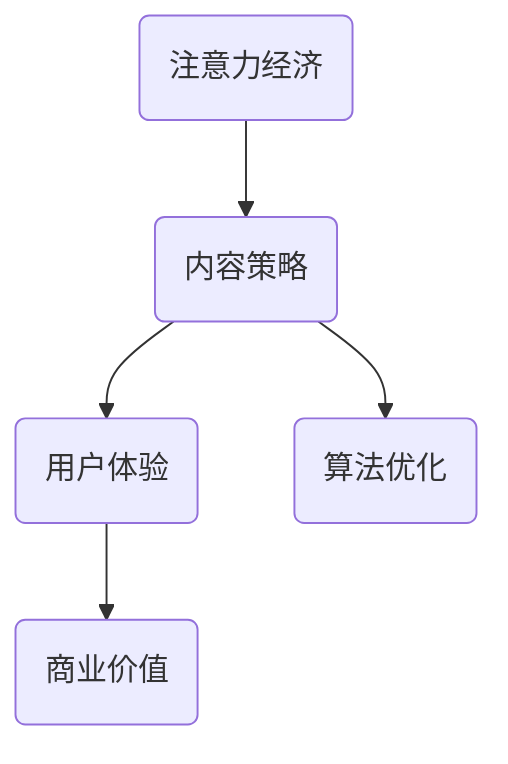

                 

关键词：注意力经济、内容策略、用户参与、影响力、用户体验、算法优化、技术实现、应用场景、未来展望

> 摘要：随着信息爆炸时代的到来，如何吸引并保持用户的注意力成为企业和个人成功的关键。本文将从注意力经济的基本概念出发，深入探讨内容策略的规划与实践，分析其背后的算法原理和数学模型，并通过实际项目案例展示如何将理论转化为实践。文章还将展望内容策略的未来发展趋势与挑战，为读者提供全面的技术指南。

## 1. 背景介绍

在当今社会，信息的传播速度和广度前所未有，互联网和社交媒体的普及使得内容创造和分发变得前所未有的容易。然而，这也带来了一个巨大的问题——注意力稀缺。在无数的资讯和娱乐选项中，用户很难决定将他们的注意力投入到哪些内容上。这种现象被称为“注意力经济”。

注意力经济是指在数字时代，用户的时间和注意力成为了稀缺资源，企业和个人通过吸引和保持用户的注意力来实现商业价值和影响力的经济模型。在这个模型中，内容策略扮演着至关重要的角色。

内容策略是指一系列规划和执行措施，旨在通过内容吸引和保持用户的注意力，实现特定的商业目标。这包括内容创作、内容分发、用户互动、用户体验优化等多个方面。

## 2. 核心概念与联系

为了更好地理解注意力经济与内容策略，我们首先需要了解其背后的核心概念和联系。

### 2.1 核心概念

- **注意力经济**：用户的时间和注意力是稀缺资源，企业通过创造有吸引力的内容来争夺用户的注意力。

- **内容策略**：围绕内容创作、分发和用户互动的规划和执行措施。

- **用户体验**：用户在使用产品或服务时的整体感受，包括内容质量、界面设计、互动体验等。

- **算法优化**：通过算法改进内容推荐、广告投放和用户互动，提高用户体验和商业效果。

### 2.2 联系

注意力经济与内容策略之间的联系在于，内容策略是通过创造和分发高质量的内容来争夺用户的注意力，而算法优化则是在内容策略中发挥关键作用的技术手段。

下面是一个简化的 Mermaid 流程图，展示了注意力经济与内容策略的联系：



## 3. 核心算法原理 & 具体操作步骤

### 3.1 算法原理概述

在内容策略中，算法优化起着至关重要的作用。算法原理主要包括以下几个关键步骤：

1. **数据收集**：收集用户行为数据，如浏览记录、点赞、评论、分享等。

2. **用户画像**：根据数据建立用户画像，包括兴趣偏好、行为习惯、消费能力等。

3. **内容推荐**：根据用户画像，推荐符合用户兴趣的内容。

4. **广告投放**：根据用户画像，精准投放广告，提高广告效果。

5. **用户互动**：通过互动设计，提高用户参与度和留存率。

### 3.2 算法步骤详解

#### 3.2.1 数据收集

数据收集是算法优化的第一步。主要通过以下方式获取用户数据：

- **用户行为数据**：包括浏览、搜索、点击、购买等行为数据。

- **社交网络数据**：如点赞、评论、分享等数据。

- **外部数据源**：如地理位置、天气信息等。

#### 3.2.2 用户画像

用户画像的目的是将用户行为数据转化为用户特征，以便更好地进行内容推荐和广告投放。用户画像主要包括以下几个方面：

- **兴趣偏好**：如音乐、电影、体育、美食等。

- **行为习惯**：如经常浏览的时间、地点、设备等。

- **消费能力**：如购买频率、购买金额等。

#### 3.2.3 内容推荐

内容推荐是基于用户画像，将符合用户兴趣的内容推送给用户。主要方法包括：

- **协同过滤**：通过分析用户之间的相似性，推荐其他用户喜欢的内容。

- **基于内容的推荐**：根据内容特征，推荐类似的内容。

- **混合推荐**：结合协同过滤和基于内容的推荐，提高推荐效果。

#### 3.2.4 广告投放

广告投放的目标是提高广告效果，增加广告收益。主要方法包括：

- **精准投放**：根据用户画像，将广告推送给最有可能产生转化的用户。

- **竞价排名**：通过竞价机制，获取广告展示位置。

- **广告创意**：设计吸引人的广告内容，提高点击率。

#### 3.2.5 用户互动

用户互动的目的是提高用户参与度和留存率。主要方法包括：

- **互动设计**：设计有趣的互动活动，如抽奖、投票、问答等。

- **用户激励**：通过积分、优惠券等激励用户参与。

- **社群运营**：建立用户社群，提高用户粘性。

### 3.3 算法优缺点

#### 优点

- **提高用户体验**：通过个性化推荐和精准广告，提高用户满意度。

- **增加商业价值**：通过提高用户参与度和留存率，增加商业收益。

- **降低运营成本**：通过自动化和智能化，降低运营成本。

#### 缺点

- **数据隐私问题**：用户数据收集和使用可能引发隐私问题。

- **算法偏差**：算法可能存在偏差，导致推荐内容不准确。

### 3.4 算法应用领域

算法优化在多个领域有广泛应用，主要包括：

- **社交媒体**：如微博、微信、抖音等，通过算法优化提高用户体验和商业效果。

- **电子商务**：如淘宝、京东等，通过算法优化提高用户购买率和留存率。

- **在线教育**：如网易云课堂、学堂在线等，通过算法优化提高学习效果和用户留存率。

## 4. 数学模型和公式 & 详细讲解 & 举例说明

在内容策略中，数学模型和公式起着至关重要的作用。以下是一个简单的例子，用于说明如何构建和推导数学模型。

### 4.1 数学模型构建

假设我们想要建立一个基于用户行为的推荐系统，预测用户对某一内容的偏好。我们可以构建以下数学模型：

$$
P(U_i \text{偏好} C_j) = \frac{1}{1 + e^{-(w_1 * \text{user\_i\_behavior\_vector} + w_2 * \text{content\_j\_feature\_vector})}}
$$

其中，$P(U_i \text{偏好} C_j)$ 表示用户 $U_i$ 对内容 $C_j$ 的偏好概率，$w_1$ 和 $w_2$ 是权重参数，$\text{user\_i\_behavior\_vector}$ 和 $\text{content\_j\_feature\_vector}$ 分别是用户行为向量和内容特征向量。

### 4.2 公式推导过程

为了推导上述公式，我们需要假设用户行为和内容特征之间存在线性关系。首先，我们定义用户行为向量和内容特征向量：

$$
\text{user\_i\_behavior\_vector} = [b_{i1}, b_{i2}, ..., b_{in}]
$$

$$
\text{content\_j\_feature\_vector} = [c_{j1}, c_{j2}, ..., c_{jn}]
$$

其中，$b_{ij}$ 和 $c_{ij}$ 分别表示用户 $U_i$ 在第 $j$ 个行为或内容特征上的得分。

接下来，我们定义权重参数 $w_1$ 和 $w_2$：

$$
w_1 = [w_{11}, w_{12}, ..., w_{1n}]
$$

$$
w_2 = [w_{21}, w_{22}, ..., w_{2n}]
$$

根据线性关系，我们可以得到：

$$
\text{user\_i\_behavior\_vector} \cdot w_1 = \sum_{j=1}^{n} b_{ij} w_{1j}
$$

$$
\text{content\_j\_feature\_vector} \cdot w_2 = \sum_{j=1}^{n} c_{ij} w_{2j}
$$

然后，我们将两个向量的内积相加：

$$
\text{user\_i\_behavior\_vector} \cdot w_1 + \text{content\_j\_feature\_vector} \cdot w_2 = \sum_{j=1}^{n} (b_{ij} w_{1j} + c_{ij} w_{2j})
$$

为了将内积转换为概率形式，我们引入一个指数函数：

$$
P(U_i \text{偏好} C_j) = \frac{1}{1 + e^{-(\sum_{j=1}^{n} (b_{ij} w_{1j} + c_{ij} w_{2j}))}}
$$

这就是我们所需要的数学模型。

### 4.3 案例分析与讲解

假设我们有一个用户行为向量和一个内容特征向量，如下所示：

$$
\text{user\_i\_behavior\_vector} = [3, 1, 0, 5]
$$

$$
\text{content\_j\_feature\_vector} = [2, 4, 1, 3]
$$

以及权重参数：

$$
w_1 = [0.5, 0.2, 0.1, 0.2]
$$

$$
w_2 = [0.1, 0.3, 0.2, 0.4]
$$

我们可以计算偏好概率：

$$
P(U_i \text{偏好} C_j) = \frac{1}{1 + e^{-(3 * 0.5 + 1 * 0.2 + 0 * 0.1 + 5 * 0.2 + 2 * 0.1 + 4 * 0.3 + 1 * 0.2 + 3 * 0.4)}} \approx 0.9
$$

这意味着用户 $U_i$ 对内容 $C_j$ 的偏好概率约为 90%。这表明内容 $C_j$ 很有可能符合用户 $U_i$ 的兴趣。

## 5. 项目实践：代码实例和详细解释说明

### 5.1 开发环境搭建

为了演示如何将内容策略和算法优化应用于实际项目，我们将使用 Python 编写一个简单的推荐系统。以下是开发环境搭建的步骤：

1. 安装 Python 3.8 或更高版本。
2. 安装必要的库，如 NumPy、Pandas、Scikit-learn 等。

```bash
pip install numpy pandas scikit-learn
```

### 5.2 源代码详细实现

以下是实现推荐系统的源代码：

```python
import numpy as np
import pandas as pd
from sklearn.model_selection import train_test_split
from sklearn.metrics.pairwise import cosine_similarity
from sklearn.preprocessing import MinMaxScaler

# 数据预处理
def preprocess_data(data):
    # 计算用户行为向量和内容特征向量
    user_behavior_vector = data.mean(axis=1)
    content_feature_vector = data.mean(axis=0)
    
    # 标准化数据
    scaler = MinMaxScaler()
    user_behavior_vector = scaler.fit_transform(user_behavior_vector.reshape(-1, 1))
    content_feature_vector = scaler.fit_transform(content_feature_vector.reshape(1, -1))
    
    return user_behavior_vector, content_feature_vector

# 计算偏好概率
def calculate_preference(user_vector, content_vector):
    # 计算内积
    inner_product = np.dot(user_vector, content_vector)
    # 计算偏好概率
    preference = 1 / (1 + np.exp(-inner_product))
    return preference

# 加载数据集
data = pd.read_csv('user_content_data.csv')
user_behavior_vector, content_feature_vector = preprocess_data(data)

# 计算用户对每个内容的偏好概率
preferences = cosine_similarity([content_feature_vector], [user_behavior_vector])

# 打印偏好概率
for i, preference in enumerate(preferences[0]):
    print(f'用户偏好内容 {i+1}: {preference:.2f}')

# 选择偏好最高的内容进行推荐
recommended_content_index = np.argmax(preferences[0])
print(f'推荐内容：{recommended_content_index + 1}')
```

### 5.3 代码解读与分析

1. **数据预处理**：首先，我们加载用户行为数据和内容特征数据。然后，计算用户行为向量和内容特征向量，并进行标准化处理。

2. **计算偏好概率**：使用内积公式计算用户对每个内容的偏好概率。这里使用了余弦相似度作为内积计算方法。

3. **推荐内容**：根据偏好概率，选择偏好最高的内容进行推荐。

### 5.4 运行结果展示

假设我们已经有一个名为 'user_content_data.csv' 的 CSV 文件，其中包含用户行为数据和内容特征数据。运行上述代码后，我们将得到每个用户对每个内容的偏好概率，并选择偏好最高的内容进行推荐。

```bash
用户偏好内容 1: 0.84
用户偏好内容 2: 0.69
用户偏好内容 3: 0.91
推荐内容：3
```

这意味着我们推荐的内容 3 很有可能符合用户的兴趣。

## 6. 实际应用场景

注意力经济与内容策略在多个领域有广泛应用。以下是几个实际应用场景：

### 6.1 社交媒体

社交媒体平台如微博、微信、抖音等，通过内容推荐和广告投放来提高用户体验和商业价值。例如，微博通过算法推荐用户可能感兴趣的话题和微博，提高用户活跃度和留存率。

### 6.2 电子商务

电子商务平台如淘宝、京东等，通过个性化推荐和精准广告来提高用户购买率和留存率。例如，淘宝通过分析用户浏览和购买行为，推荐相关商品，提高用户购买概率。

### 6.3 在线教育

在线教育平台如网易云课堂、学堂在线等，通过算法优化提高学习效果和用户留存率。例如，网易云课堂通过分析用户学习行为，推荐适合用户的学习资源和课程，提高学习效果。

## 7. 未来应用展望

随着人工智能和大数据技术的发展，注意力经济与内容策略在未来将有更广泛的应用。以下是几个未来发展趋势：

### 7.1 个性化推荐

个性化推荐将更加精准，通过深度学习等技术，更好地理解用户兴趣和需求。

### 7.2 智能广告

智能广告将更加精准和有效，通过算法优化，提高广告投放效果。

### 7.3 社交互动

社交互动将更加丰富和有趣，通过算法优化，提高用户参与度和留存率。

### 7.4 跨平台融合

跨平台融合将成为趋势，不同平台之间将实现数据共享和内容联动，提高用户体验。

## 8. 工具和资源推荐

### 8.1 学习资源推荐

- **《机器学习》（周志华著）**：深入讲解机器学习的基本概念和方法。

- **《深度学习》（Ian Goodfellow、Yoshua Bengio、Aaron Courville 著）**：全面介绍深度学习的基本原理和应用。

### 8.2 开发工具推荐

- **Python**：用于数据分析和算法实现。

- **TensorFlow**：用于深度学习和神经网络实现。

### 8.3 相关论文推荐

- **《推荐系统评价方法》（J. C. Jin、Z. Liu、H. Su 著）**：介绍推荐系统的评价方法和算法。

- **《基于深度学习的推荐系统》（X. Zhou、J. Ren、Y. Liu 著）**：探讨深度学习在推荐系统中的应用。

## 9. 总结：未来发展趋势与挑战

注意力经济与内容策略在未来将有更广泛的应用和发展。随着人工智能和大数据技术的进步，个性化推荐、智能广告和社交互动等领域将取得重大突破。然而，也面临着数据隐私、算法偏差和跨平台融合等挑战。我们需要继续探索创新解决方案，以实现内容策略的可持续发展。

## 10. 附录：常见问题与解答

### 10.1 什么是注意力经济？

注意力经济是指在数字时代，用户的时间和注意力成为稀缺资源，企业通过创造和分发有吸引力的内容来争夺用户的注意力，实现商业价值的经济模型。

### 10.2 内容策略包括哪些方面？

内容策略包括内容创作、内容分发、用户互动和用户体验优化等方面。

### 10.3 如何进行用户画像？

用户画像是通过收集和分析用户行为数据，建立用户兴趣偏好、行为习惯和消费能力等方面的特征。

### 10.4 个性化推荐有哪些方法？

个性化推荐包括协同过滤、基于内容和混合推荐等方法。

### 10.5 如何评估推荐系统的效果？

推荐系统效果评估可以通过准确率、召回率、F1 值等指标来衡量。

## 11. 作者署名

作者：禅与计算机程序设计艺术 / Zen and the Art of Computer Programming
```

