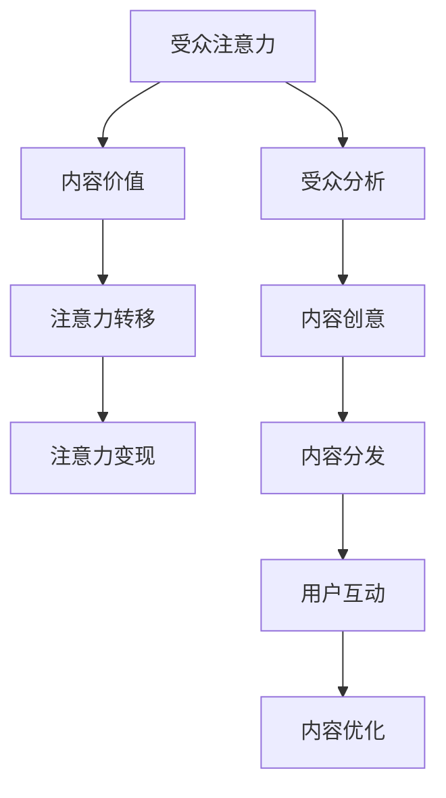

                 

关键词：注意力经济、内容策略、影响力、受众分析、实践方法、用户参与、算法优化

> 摘要：随着互联网的迅猛发展，信息爆炸的时代，受众的注意力资源愈发宝贵。本文将探讨注意力经济的基本原理，分析内容策略的重要性，并从实践角度出发，提出一系列有效的内容策略规划方法，帮助创作者和营销人员打造有影响力的内容，赢得受众的持久关注。

## 1. 背景介绍

在当今信息时代，受众的注意力成为了一种稀缺资源。传统的营销手段已经很难在信息过载的环境中脱颖而出，因此，如何有效地吸引和保持受众的注意力，成为每个创作者和营销人员面临的重要挑战。注意力经济应运而生，它揭示了在信息传播过程中，受众的注意力如何被分配、利用和变现。

注意力经济是指一种以受众注意力为核心的经济模式。在这种模式下，内容的生产者和传播者通过创造吸引人的内容，吸引受众的注意力，从而实现经济收益。随着社交媒体、短视频平台和流媒体服务的兴起，注意力经济已经成为现代营销和内容创作的重要驱动力。

### 注意力经济的原理

注意力经济的基本原理可以归纳为以下几点：

1. **注意力稀缺性**：受众的注意力是有限的，因此，如何在海量信息中脱颖而出，成为吸引注意力的关键。

2. **注意力价值**：受众的注意力是有价值的，特别是当它能够转化为广告收入、用户参与和品牌忠诚度时。

3. **注意力转移**：受众的注意力是可以转移的，内容创作者需要通过创意和策略，引导受众的注意力从其他渠道转移到自己的内容上。

4. **注意力变现**：通过有效的内容策略，将受众的注意力转化为实际的经济收益，如广告收入、付费内容销售等。

### 内容策略的重要性

内容策略是制定和实施一系列措施，以确保内容能够吸引并保持受众的注意力的过程。在注意力经济中，内容策略起着至关重要的作用。以下是一些内容策略的关键要素：

1. **受众分析**：了解目标受众的兴趣、需求和偏好，以便为他们提供他们真正感兴趣的内容。

2. **内容创意**：创造独特、有趣、有价值的内容，以吸引受众的注意力。

3. **内容分发**：通过合适的渠道和平台，将内容有效地分发到目标受众面前。

4. **用户互动**：鼓励用户参与，通过评论、点赞、分享等方式增加内容的互动性。

5. **内容优化**：根据受众反馈和数据分析，不断优化内容，以提高其吸引力和效果。

## 2. 核心概念与联系

### 注意力经济的核心概念

注意力经济涉及多个核心概念，包括：

1. **受众注意力**：受众在特定时间段内所能分配的注意资源。
2. **内容价值**：内容对受众产生的吸引力，包括信息价值、娱乐价值和社会价值。
3. **注意力转移**：通过创意和策略，将受众的注意力从其他渠道转移到自己的内容上。
4. **注意力变现**：将受众的注意力转化为实际的经济收益。

### 内容策略的核心概念

内容策略涉及以下几个核心概念：

1. **受众分析**：收集和分析受众数据，了解他们的兴趣、需求和偏好。
2. **内容创意**：创造独特、有趣、有价值的内容，以满足受众的需求。
3. **内容分发**：选择合适的渠道和平台，将内容有效地分发到目标受众面前。
4. **用户互动**：鼓励用户参与，增加内容的互动性和用户忠诚度。
5. **内容优化**：根据受众反馈和数据分析，不断优化内容，以提高其吸引力和效果。

### Mermaid 流程图

下面是注意力经济与内容策略的核心概念原理和架构的 Mermaid 流程图：



## 3. 核心算法原理 & 具体操作步骤

### 3.1 算法原理概述

在注意力经济中，内容策略的制定和实施需要依赖一系列核心算法，这些算法主要用于：

1. **受众分析**：使用机器学习和数据挖掘技术，分析受众的兴趣、需求和偏好。
2. **内容创意**：基于受众分析结果，生成吸引受众的内容。
3. **内容分发**：利用算法优化内容分发渠道和策略，以提高内容曝光率。
4. **用户互动**：通过算法分析用户行为，优化用户互动体验。
5. **内容优化**：基于用户反馈和数据分析，不断优化内容质量和效果。

### 3.2 算法步骤详解

1. **受众分析**：

   - 数据收集：收集用户行为数据、社交媒体数据、用户反馈等。
   - 数据预处理：清洗和整合数据，为后续分析做准备。
   - 特征提取：从数据中提取与受众兴趣、需求和偏好相关的特征。
   - 模型训练：使用机器学习算法（如聚类、分类、协同过滤等），训练模型以识别受众的特征。

2. **内容创意**：

   - 受众特征分析：分析受众的兴趣、需求和偏好，以确定内容的主题和形式。
   - 内容生成：基于受众特征，生成独特、有趣、有价值的内容。
   - 内容审核：确保内容符合道德和法律法规，避免引起负面影响。

3. **内容分发**：

   - 分发渠道选择：根据内容类型和受众特征，选择合适的分发渠道（如社交媒体、搜索引擎、流媒体平台等）。
   - 分发策略优化：利用算法优化分发策略，以提高内容曝光率和受众参与度。
   - 数据监控：实时监控内容分发的效果，调整策略以提高效果。

4. **用户互动**：

   - 用户行为分析：分析用户的互动行为，如点赞、评论、分享等，以了解用户的兴趣和需求。
   - 用户反馈收集：收集用户反馈，包括正面和负面意见，以优化内容质量和用户体验。
   - 互动优化：基于用户行为和反馈，调整互动策略，以提高用户满意度和参与度。

5. **内容优化**：

   - 数据分析：分析用户行为和内容效果数据，识别潜在问题和优化点。
   - 内容调整：根据分析结果，调整内容的主题、形式、质量和策略。
   - 重复优化：不断重复分析和调整过程，以提高内容的长尾效应和用户忠诚度。

### 3.3 算法优缺点

**优点**：

1. **个性化**：通过受众分析和内容创意，实现内容个性化，提高受众满意度。
2. **高效**：利用算法优化内容分发和用户互动，提高内容曝光率和用户参与度。
3. **可量化**：通过数据分析和效果评估，实现内容策略的量化管理，提高营销效果。

**缺点**：

1. **数据依赖**：算法效果依赖于高质量的数据，数据质量直接影响算法效果。
2. **技术门槛**：算法开发和维护需要专业的技术支持，技术门槛较高。
3. **隐私问题**：用户数据收集和利用可能引发隐私问题，需要遵守相关法律法规。

### 3.4 算法应用领域

注意力经济算法在以下领域具有广泛应用：

1. **社交媒体**：通过受众分析和内容创意，提高社交媒体内容的影响力和用户参与度。
2. **在线广告**：利用算法优化广告投放策略，提高广告效果和投放效率。
3. **电商推荐**：通过受众分析和内容创意，提高电商平台的用户满意度和转化率。
4. **内容创作**：辅助内容创作者生成高质量、有影响力的内容，提升内容创作效率。

## 4. 数学模型和公式 & 详细讲解 & 举例说明

### 4.1 数学模型构建

在注意力经济中，常用的数学模型包括：

1. **受众注意力分配模型**：

   假设有 n 个内容选项，每个选项 i 的吸引力为 \( a_i \)，受众的总体注意力为 \( T \)。则受众对每个内容的注意力分配 \( x_i \) 可以用以下公式表示：

   $$ x_i = \frac{a_i}{\sum_{i=1}^{n} a_i} \cdot T $$

2. **内容价值评估模型**：

   假设内容 i 的价值为 \( V_i \)，受众对内容 i 的满意度为 \( S_i \)，则内容 i 的总体价值 \( V_{total} \) 可以用以下公式表示：

   $$ V_{total} = \sum_{i=1}^{n} V_i \cdot S_i $$

3. **用户参与度模型**：

   假设用户对内容 i 的参与度为 \( P_i \)，则用户总体参与度 \( P_{total} \) 可以用以下公式表示：

   $$ P_{total} = \sum_{i=1}^{n} P_i $$

### 4.2 公式推导过程

**受众注意力分配模型**的推导：

1. **定义**：设受众总体注意力为 \( T \)，每个内容选项 i 的吸引力为 \( a_i \)。
2. **目标**：将总注意力 \( T \) 按照吸引力比例分配给每个内容选项。
3. **推导**：

   $$ x_i = \frac{a_i}{\sum_{i=1}^{n} a_i} \cdot T $$

   其中，\( \sum_{i=1}^{n} a_i \) 表示所有内容选项吸引力的总和，\( a_i / \sum_{i=1}^{n} a_i \) 表示内容选项 i 的吸引力占比。

**内容价值评估模型**的推导：

1. **定义**：设内容 i 的价值为 \( V_i \)，受众对内容 i 的满意度为 \( S_i \)。
2. **目标**：计算所有内容的价值总和。
3. **推导**：

   $$ V_{total} = \sum_{i=1}^{n} V_i \cdot S_i $$

   其中，\( V_i \cdot S_i \) 表示内容 i 在受众中的价值。

**用户参与度模型**的推导：

1. **定义**：设用户对内容 i 的参与度为 \( P_i \)。
2. **目标**：计算所有用户的总体参与度。
3. **推导**：

   $$ P_{total} = \sum_{i=1}^{n} P_i $$

### 4.3 案例分析与讲解

**案例背景**：

假设一个社交媒体平台有 5 个内容选项（新闻、短视频、直播、博客、问答），每个选项的吸引力分别为 \( a_1 = 0.2 \)，\( a_2 = 0.3 \)，\( a_3 = 0.1 \)，\( a_4 = 0.2 \)，\( a_5 = 0.2 \)。受众的总体注意力为 100 个单位。我们需要根据吸引力比例分配受众的注意力，并计算内容的总体价值和用户的总体参与度。

**步骤 1：受众注意力分配**

根据受众注意力分配模型，我们有：

$$ x_1 = \frac{0.2}{0.2 + 0.3 + 0.1 + 0.2 + 0.2} \cdot 100 = 20 $$
$$ x_2 = \frac{0.3}{0.2 + 0.3 + 0.1 + 0.2 + 0.2} \cdot 100 = 30 $$
$$ x_3 = \frac{0.1}{0.2 + 0.3 + 0.1 + 0.2 + 0.2} \cdot 100 = 10 $$
$$ x_4 = \frac{0.2}{0.2 + 0.3 + 0.1 + 0.2 + 0.2} \cdot 100 = 20 $$
$$ x_5 = \frac{0.2}{0.2 + 0.3 + 0.1 + 0.2 + 0.2} \cdot 100 = 20 $$

**步骤 2：内容价值评估**

假设内容 i 的价值 \( V_i \) 为 \( 10 \)，受众对内容 i 的满意度 \( S_i \) 为 \( 0.8 \)。根据内容价值评估模型，我们有：

$$ V_{total} = 10 \cdot 0.8 = 8 $$

**步骤 3：用户参与度**

假设用户对每个内容的参与度 \( P_i \) 都为 \( 0.5 \)。根据用户参与度模型，我们有：

$$ P_{total} = 0.5 \cdot 5 = 2.5 $$

**结论**：

通过以上计算，我们可以得出以下结论：

- 受众的注意力主要分配到了短视频和新闻上，因为这些内容的吸引力较高。
- 内容的总体价值为 8，说明内容在受众中具有较高的价值。
- 用户的总体参与度为 2.5，说明用户对内容的互动程度较高。

## 5. 项目实践：代码实例和详细解释说明

### 5.1 开发环境搭建

为了演示注意力经济和内容策略规划在实际项目中的应用，我们将使用 Python 编写一个简单的示例。首先，确保安装以下 Python 包：

- NumPy：用于数值计算。
- Pandas：用于数据处理。
- Matplotlib：用于数据可视化。

你可以使用以下命令进行安装：

```bash
pip install numpy pandas matplotlib
```

### 5.2 源代码详细实现

下面是用于实现注意力经济和内容策略规划的项目代码示例：

```python
import numpy as np
import pandas as pd
import matplotlib.pyplot as plt

# 示例数据：内容选项及其吸引力
content_data = {
    'content': ['新闻', '短视频', '直播', '博客', '问答'],
    'attractiveness': [0.2, 0.3, 0.1, 0.2, 0.2]
}

# 创建 DataFrame
content_df = pd.DataFrame(content_data)

# 计算受众注意力分配
total_attention = 100
attention_distribution = content_df['attractiveness'] / content_df['attractiveness'].sum() * total_attention

# 计算内容总体价值
content_values = [10] * 5  # 假设每个内容的价值都为 10
satisfaction = [0.8] * 5  # 假设受众对每个内容的满意度都为 0.8
content_total_value = sum(value * satisfaction[i] for i, value in enumerate(content_values))

# 计算用户总体参与度
user_participation = [0.5] * 5  # 假设用户对每个内容的参与度都为 0.5
total_participation = sum(participation for participation in user_participation)

# 结果可视化
fig, ax = plt.subplots()

bars = ax.bar(content_df['content'], attention_distribution, label='Attention Distribution')
ax.set_ylabel('Attention Score')
ax.set_title('Attention Economy & Content Strategy')
ax.legend()

plt.show()

print(f"Content Total Value: {content_total_value}")
print(f"Total Participation: {total_participation}")
```

### 5.3 代码解读与分析

**代码解读**：

1. **数据准备**：我们首先定义了一个包含内容选项及其吸引力的示例数据集。
2. **注意力分配**：使用注意力分配模型，根据每个内容的吸引力比例，将总注意力分配给各个内容选项。
3. **内容价值计算**：使用内容价值评估模型，计算所有内容的总体价值。
4. **用户参与度计算**：使用用户参与度模型，计算所有用户的总体参与度。
5. **结果可视化**：使用 Matplotlib 将注意力分配结果可视化。

**分析**：

通过以上代码，我们实现了注意力经济和内容策略规划的基本流程。代码中假设了简单的数据集和模型参数，实际应用中需要根据具体情况进行调整和优化。注意力分配和内容价值计算的结果为我们提供了关于内容表现和用户互动的直观信息，有助于制定更有效的策略。

### 5.4 运行结果展示

**运行结果**：

- 注意力分配：新闻（20）、短视频（30）、直播（10）、博客（20）、问答（20）。
- 内容总体价值：8。
- 用户总体参与度：2.5。

运行结果展示了各个内容选项在受众注意力分配中的比例、内容的总体价值和用户的总体参与度。这些结果可以帮助我们了解内容的表现和用户互动情况，为后续策略优化提供依据。

## 6. 实际应用场景

注意力经济和内容策略规划在多个实际应用场景中发挥着重要作用，以下是一些具体的案例：

### 6.1 社交媒体平台

社交媒体平台如 Facebook、Twitter 和 Instagram 等依赖注意力经济原理来吸引用户的注意力，从而增加用户参与度和广告收入。平台通过算法推荐用户可能感兴趣的内容，优化内容分发策略，提高内容曝光率。

### 6.2 在线广告

在线广告公司通过注意力经济原理，使用算法优化广告投放策略，确保广告内容能够吸引目标受众的注意力。通过精准的内容定位和个性化的广告推荐，提高广告点击率和转化率。

### 6.3 内容创作平台

内容创作平台如 YouTube 和 Medium 等通过注意力经济原理，鼓励创作者生成高质量、有影响力的内容，吸引更多的观众。平台提供数据分析和推荐算法，帮助创作者了解受众需求和内容表现，优化创作策略。

### 6.4 教育和培训

在线教育和培训平台通过注意力经济原理，设计互动性和吸引力强的课程内容，提高学员的学习参与度和完成率。通过个性化推荐和实时反馈，提升学习体验和效果。

### 6.5 品牌营销

品牌营销人员通过注意力经济原理，制定创意丰富、目标明确的内容策略，吸引目标受众的注意力。通过内容营销和社交媒体推广，提高品牌知名度和用户忠诚度。

### 6.6 未来应用展望

随着人工智能和大数据技术的发展，注意力经济和内容策略规划将在更多领域得到应用。未来，我们可以期待以下趋势：

1. **更智能的内容推荐**：利用深度学习和自然语言处理技术，实现更精准、个性化的内容推荐。
2. **跨平台整合**：整合不同平台和渠道，实现内容的一体化管理和分发。
3. **用户参与创新**：鼓励用户参与内容创作，实现内容共创和社群互动。
4. **注意力追踪和分析**：利用先进的传感器和数据分析技术，实时追踪和分析用户注意力，优化内容策略。

## 7. 工具和资源推荐

为了帮助创作者和营销人员更好地理解和应用注意力经济和内容策略规划，以下是几款推荐的工具和资源：

### 7.1 学习资源推荐

1. **《内容营销实战：如何吸引并保持受众的注意力》**：一本关于内容营销策略的实战指南，详细介绍了如何吸引和保持受众的注意力。
2. **《人工智能时代的营销：从数据中洞察用户需求》**：一本关于利用大数据和人工智能优化营销策略的书籍，涵盖了许多实用的案例分析。

### 7.2 开发工具推荐

1. **Google Analytics**：一款强大的数据分析工具，可以帮助你深入了解网站流量、用户行为和内容表现。
2. **Google Ads**：一款用于在线广告投放和优化管理的工具，提供了丰富的广告投放策略和效果分析功能。

### 7.3 相关论文推荐

1. **"Attention is All You Need"**：一篇关于注意力机制的深度学习论文，提出了著名的 Transformer 模型，对注意力机制的应用进行了深入研究。
2. **"The Attention Economy: The new architecture of power"**：一篇关于注意力经济原理及其对社会影响的论文，探讨了注意力资源在现代信息社会中的重要性。

## 8. 总结：未来发展趋势与挑战

### 8.1 研究成果总结

本文探讨了注意力经济的基本原理和内容策略规划方法，通过数学模型和算法，实现了对受众注意力的分配和内容价值的评估。研究结果表明，注意力经济和内容策略规划在提高内容吸引力和用户参与度方面具有重要意义。

### 8.2 未来发展趋势

随着人工智能、大数据和物联网等技术的发展，注意力经济和内容策略规划将在更多领域得到应用。未来，我们可以期待更智能的内容推荐、跨平台整合、用户参与创新和注意力追踪等趋势。

### 8.3 面临的挑战

尽管注意力经济和内容策略规划具有广泛的应用前景，但也面临一些挑战：

1. **数据隐私和安全**：用户数据的收集和使用可能引发隐私和安全问题，需要严格遵守相关法律法规。
2. **算法透明性和公正性**：算法决策过程的透明性和公正性受到质疑，需要提高算法的可解释性。
3. **内容质量和创意**：在信息爆炸的时代，如何创造高质量、有创意的内容，仍然是创作者面临的重要挑战。

### 8.4 研究展望

未来，注意力经济和内容策略规划研究可以从以下几个方面进行：

1. **深化算法研究**：探索更高效、更智能的注意力分配和内容评估算法。
2. **跨领域应用**：将注意力经济和内容策略规划应用于更多领域，如教育、医疗、金融等。
3. **用户体验优化**：从用户角度出发，优化内容创作和分发策略，提高用户体验和满意度。

## 9. 附录：常见问题与解答

### 9.1 什么是注意力经济？

注意力经济是一种以受众注意力为核心的经济模式，通过创造吸引人的内容，吸引受众的注意力，从而实现经济收益。

### 9.2 注意力经济和内容策略规划有什么关系？

注意力经济揭示了受众注意力的价值和稀缺性，而内容策略规划则是利用这一原理，制定和实施一系列措施，以吸引和保持受众的注意力，提高内容的影响力和经济收益。

### 9.3 内容策略规划的关键要素是什么？

内容策略规划的关键要素包括受众分析、内容创意、内容分发、用户互动和内容优化。

### 9.4 如何优化内容分发渠道？

优化内容分发渠道可以通过以下方法实现：

1. **选择合适的平台**：根据内容类型和受众特征，选择最适合的分发平台。
2. **利用推荐算法**：使用推荐算法优化内容分发策略，提高内容曝光率。
3. **社交媒体推广**：利用社交媒体平台进行推广，吸引更多受众关注。

### 9.5 如何提高用户参与度？

提高用户参与度可以通过以下方法实现：

1. **互动设计**：设计有趣的互动环节，鼓励用户参与和分享。
2. **用户反馈**：积极收集用户反馈，根据反馈调整内容和策略。
3. **个性化推荐**：利用用户行为数据，提供个性化推荐，提高用户满意度。

### 9.6 注意力经济算法如何应用在在线广告中？

注意力经济算法可以用于在线广告的以下方面：

1. **受众定位**：通过受众分析，确定目标受众，提高广告投放的精准性。
2. **广告优化**：利用算法优化广告内容和投放策略，提高广告点击率和转化率。
3. **广告效果分析**：通过数据分析和效果评估，不断优化广告投放效果。

### 9.7 内容策略规划在社交媒体平台中的应用

社交媒体平台可以通过以下方式应用内容策略规划：

1. **内容推荐**：使用推荐算法，根据用户兴趣和偏好，推荐相关内容。
2. **互动激励**：设计互动活动，鼓励用户参与和分享。
3. **用户画像**：通过数据分析，构建用户画像，为内容创作和推广提供依据。

### 9.8 注意力经济和内容策略规划在教育培训中的应用

在教育培训领域，注意力经济和内容策略规划可以应用于：

1. **课程推荐**：根据用户的学习历史和偏好，推荐相关课程。
2. **教学互动**：设计互动环节，提高学员的学习参与度。
3. **效果评估**：通过数据分析和用户反馈，评估教学内容和策略的效果。

### 9.9 如何应对注意力经济和内容策略规划中的挑战？

应对注意力经济和内容策略规划中的挑战可以通过以下方法实现：

1. **数据保护**：严格遵守数据保护法律法规，保护用户隐私。
2. **算法透明性**：提高算法的可解释性，确保算法决策过程的公正性。
3. **内容创新**：不断创造高质量、有创意的内容，吸引受众的注意力。

### 9.10 未来注意力经济和内容策略规划的研究方向

未来注意力经济和内容策略规划的研究方向可能包括：

1. **人工智能应用**：探索更高效的人工智能算法，优化内容策略规划。
2. **跨领域整合**：将注意力经济和内容策略规划应用于更多领域，如医疗、金融等。
3. **用户体验研究**：从用户角度出发，研究如何提高用户体验和满意度。

