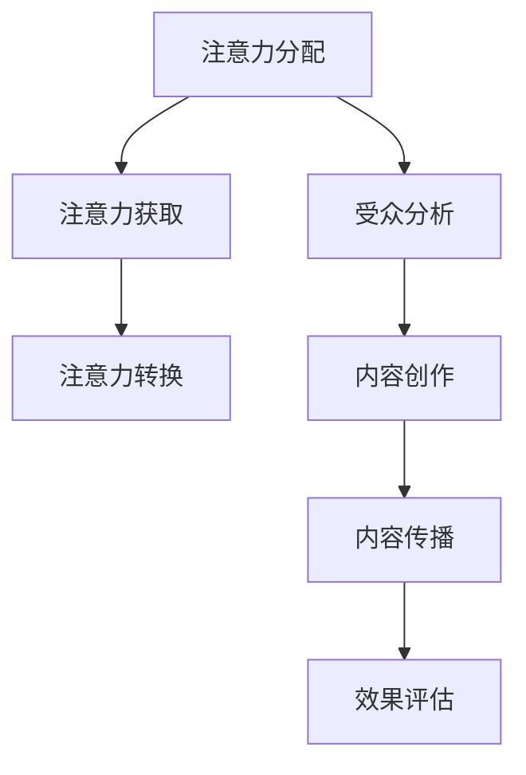

                 

关键词：注意力经济、内容策略、受众参与、影响力、数据驱动

> 摘要：本文将探讨注意力经济的基本概念，以及如何在内容策略规划中运用注意力经济原理，为受众创建参与性和有影响力的内容。通过深入分析注意力资源的分配和获取，结合具体的算法原理、数学模型及项目实践案例，本文将提供一套系统的内容策略规划方法，帮助企业和个人在信息爆炸的时代抓住受众的注意力，实现内容传播的最大化。

## 1. 背景介绍

随着互联网的迅速发展，信息的获取变得前所未有的便捷。然而，这也带来了一个问题：如何在海量信息中脱颖而出，吸引受众的注意力？注意力经济应运而生，成为了解决这一问题的关键。注意力经济是指人们将注意力作为一种资源进行交换和分配的经济活动。在这个背景下，内容策略规划变得尤为重要，它关乎如何有效地管理和利用注意力资源，为受众提供有价值的、参与性的内容。

### 1.1 注意力经济的概念

注意力经济最早由美国经济学家迈克尔·波特的徒弟、著名经济学家乔治·米勒提出。米勒认为，注意力是稀缺资源，与时间、金钱等传统资源类似，具有经济价值。在信息爆炸的时代，注意力资源变得愈发珍贵，成为企业和个人竞争的焦点。

### 1.2 内容策略规划的重要性

内容策略规划是指制定和执行一系列计划，以创建、发布和推广有吸引力的内容，从而满足受众的需求，提升品牌影响力。一个成功的策略规划可以帮助企业或个人在竞争激烈的市场中占据有利位置，赢得更多的关注和忠诚度。

## 2. 核心概念与联系

### 2.1 注意力经济的核心概念

注意力经济主要涉及以下几个核心概念：

- **注意力分配**：个体如何在各种信息和活动中分配其有限的注意力资源。
- **注意力获取**：如何通过内容、广告或其他手段吸引受众的注意力。
- **注意力转换**：将注意力转化为实际的行为或消费。

### 2.2 内容策略规划的核心概念

- **受众分析**：了解目标受众的需求、兴趣和行为习惯。
- **内容创作**：创作与受众需求高度匹配的内容。
- **内容传播**：通过各种渠道和手段推广内容，提高可见度和参与度。
- **效果评估**：通过数据分析和用户反馈，评估内容策略的效果，并进行优化。

### 2.3 注意力经济与内容策略规划的联系

注意力经济为内容策略规划提供了理论基础和实践指导。通过深入理解注意力资源的分配和获取，企业或个人可以更有效地进行内容创作和传播，从而在竞争激烈的市场中赢得更多的关注和影响力。

### 2.4 Mermaid 流程图

## 3. 核心算法原理 & 具体操作步骤

### 3.1 算法原理概述

在内容策略规划中，核心算法主要涉及以下几个方面：

- **受众分析算法**：利用大数据和机器学习技术，分析目标受众的行为和需求，以便创作更精准的内容。
- **内容推荐算法**：根据受众的兴趣和行为，推荐相关内容，提高参与度和留存率。
- **效果评估算法**：通过数据分析和用户反馈，评估内容策略的效果，并进行优化。

### 3.2 算法步骤详解

#### 3.2.1 受众分析算法

1. **数据收集**：从各种渠道收集目标受众的行为数据，如浏览历史、搜索记录、社交互动等。
2. **数据预处理**：清洗和整合数据，消除噪声，提取有用的特征。
3. **特征提取**：利用机器学习算法，从数据中提取有助于受众分析的特征。
4. **模型训练**：使用训练数据集，训练受众分析模型，以预测受众的兴趣和行为。

#### 3.2.2 内容推荐算法

1. **用户画像**：根据受众分析算法的结果，为每个用户创建一个画像。
2. **内容标签**：为每条内容分配标签，以便进行推荐。
3. **推荐算法**：使用协同过滤、矩阵分解等推荐算法，根据用户画像和内容标签，为用户推荐相关内容。
4. **推荐结果评估**：评估推荐算法的效果，如准确率、召回率等，并进行优化。

#### 3.2.3 效果评估算法

1. **数据收集**：收集内容发布后的用户行为数据，如点击率、转发率、评论数等。
2. **效果分析**：分析用户行为数据，评估内容策略的效果。
3. **反馈机制**：根据效果分析的结果，调整内容策略，以提高效果。

### 3.3 算法优缺点

#### 3.3.1 受众分析算法

- **优点**：能够深入了解目标受众的需求和行为，提高内容精准度。
- **缺点**：数据收集和预处理过程复杂，对技术要求较高。

#### 3.3.2 内容推荐算法

- **优点**：能够为用户提供个性化的内容推荐，提高用户留存率和参与度。
- **缺点**：推荐结果可能受到数据偏差和算法偏见的影响。

#### 3.3.3 效果评估算法

- **优点**：能够实时评估内容策略的效果，及时调整策略。
- **缺点**：效果评估可能受到用户行为和反馈的滞后性影响。

### 3.4 算法应用领域

- **电子商务**：通过受众分析算法，为用户提供个性化的商品推荐，提高销售转化率。
- **社交媒体**：通过内容推荐算法，为用户提供感兴趣的内容，提高用户活跃度。
- **新闻媒体**：通过效果评估算法，实时调整内容策略，提高用户满意度和忠诚度。

## 4. 数学模型和公式 & 详细讲解 & 举例说明

### 4.1 数学模型构建

在内容策略规划中，常用的数学模型包括马尔可夫链、贝叶斯网络和神经网络等。

#### 4.1.1 马尔可夫链

马尔可夫链是一种用于描述序列依赖关系的数学模型，适用于受众分析。其基本公式为：

\[ P(X_t = x_t | X_{t-1} = x_{t-1}, ..., X_0 = x_0) = P(X_t = x_t | X_{t-1} = x_{t-1}) \]

其中，\( X_t \)表示第\( t \)个时刻的变量，\( x_t \)表示该变量取值。

#### 4.1.2 贝叶斯网络

贝叶斯网络是一种用于表示变量之间条件依赖关系的概率图模型，适用于内容推荐。其基本公式为：

\[ P(X_1, X_2, ..., X_n) = \prod_{i=1}^{n} P(X_i | X_{i-1}, ..., X_1) \]

其中，\( P(X_i | X_{i-1}, ..., X_1) \)表示在给定前一个变量的条件下，当前变量的概率。

#### 4.1.3 神经网络

神经网络是一种用于模拟人脑神经元之间连接的数学模型，适用于效果评估。其基本公式为：

\[ Y = \sigma(W \cdot X + b) \]

其中，\( \sigma \)表示激活函数，\( W \)表示权重矩阵，\( X \)表示输入向量，\( b \)表示偏置。

### 4.2 公式推导过程

以马尔可夫链为例，推导其基本公式：

假设有一个随机过程\( X_t \)，表示第\( t \)个时刻的变量。根据马尔可夫性质，当前状态仅与前一状态有关，与其他历史状态无关。因此，可以推导出：

\[ P(X_t = x_t | X_{t-1} = x_{t-1}, ..., X_0 = x_0) = P(X_t = x_t | X_{t-1} = x_{t-1}) \]

### 4.3 案例分析与讲解

#### 4.3.1 马尔可夫链在受众分析中的应用

假设某个社交媒体平台，用户的行为可以分为“阅读”、“点赞”、“评论”和“分享”四种类型。根据用户历史行为数据，可以构建一个马尔可夫链模型，用于预测用户下一步的行为。

1. **数据收集**：收集用户最近5次行为的统计数据，如下表所示。

| 用户 | 行为1 | 行为2 | 行为3 | 行为4 | 行为5 |
| ---- | ---- | ---- | ---- | ---- | ---- |
| A    | 阅读 | 点赞 | 评论 | 阅读 | 点赞 |
| B    | 点赞 | 评论 | 阅读 | 评论 | 分享 |
| C    | 阅读 | 阅读 | 点赞 | 点赞 | 评论 |

2. **状态转移矩阵**：根据数据，构建状态转移矩阵\( P \)：

\[ P = \begin{bmatrix} P_{11} & P_{12} & P_{13} & P_{14} \\ P_{21} & P_{22} & P_{23} & P_{24} \\ P_{31} & P_{32} & P_{33} & P_{34} \\ P_{41} & P_{42} & P_{43} & P_{44} \end{bmatrix} \]

其中，\( P_{ij} \)表示从状态\( i \)转移到状态\( j \)的概率。

3. **预测用户下一步行为**：给定当前状态，使用状态转移矩阵\( P \)计算下一步行为的概率分布。

例如，用户A当前处于“点赞”状态，预测其下一步行为的概率分布如下：

\[ P(X_5 | X_4 = 点赞) = P \cdot \begin{bmatrix} 1 \\ 0 \\ 0 \\ 0 \end{bmatrix} = \begin{bmatrix} P_{11} & P_{12} & P_{13} & P_{14} \\ P_{21} & P_{22} & P_{23} & P_{24} \\ P_{31} & P_{32} & P_{33} & P_{34} \\ P_{41} & P_{42} & P_{43} & P_{44} \end{bmatrix} \cdot \begin{bmatrix} 1 \\ 0 \\ 0 \\ 0 \end{bmatrix} \]

4. **结果分析**：根据概率分布，用户A下一步最有可能的行为是“阅读”，概率为\( P_{11} \)。

#### 4.3.2 贝叶斯网络在内容推荐中的应用

假设某个视频平台，用户的行为可以分为“观看”、“点赞”、“评论”和“分享”四种类型。根据用户历史行为数据，可以构建一个贝叶斯网络模型，用于推荐用户感兴趣的视频。

1. **数据收集**：收集用户最近5次观看视频的类型和用户行为数据，如下表所示。

| 用户 | 观看1 | 观看2 | 观看3 | 观看4 | 观看5 | 行为1 | 行为2 | 行为3 | 行为4 |
| ---- | ---- | ---- | ---- | ---- | ---- | ---- | ---- | ---- | ---- |
| A    | 综艺 | 电影 | 电影 | 综艺 | 电影 | 阅读 | 点赞 | 评论 | 无 |
| B    | 电影 | 电影 | 综艺 | 电影 | 综艺 | 阅读 | 点赞 | 无 | 无 |
| C    | 综艺 | 电影 | 综艺 | 电影 | 电影 | 阅读 | 无 | 无 | 无 |

2. **构建贝叶斯网络**：根据数据，构建包含视频类型和用户行为的贝叶斯网络。

3. **推荐算法**：根据用户当前行为，使用贝叶斯网络计算推荐视频的概率分布。

例如，用户A当前处于“点赞”状态，推荐视频的概率分布如下：

\[ P(视频_1 | 行为_4 = 点赞) = \frac{P(行为_4 = 点赞 | 视频

