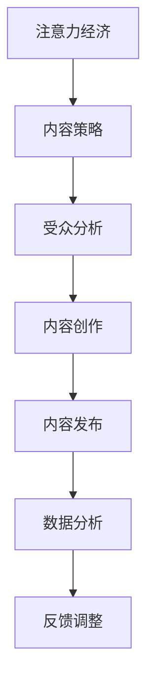

                 

 关键词：注意力经济、内容策略、受众吸引、留存策略、用户体验

> 摘要：随着互联网的快速发展，内容创作者面临着激烈的市场竞争。本文将探讨注意力经济与内容策略规划的核心概念，以及如何通过有效的策略来创建吸引并留住受众的内容。本文将分为八个部分，详细分析注意力经济、内容策略的原理、数学模型、算法、项目实践、应用场景、工具资源以及未来发展趋势和挑战。

## 1. 背景介绍

### 注意力经济

注意力经济是近年来兴起的一个新概念，主要描述了在信息过载的时代，受众的注意力成为一种稀缺资源。注意力经济强调，受众的注意力是有限的，而内容的多样性使得创作者需要争夺这一有限的资源。因此，如何吸引和留住受众的注意力成为内容创作者的重要课题。

### 内容策略

内容策略是指围绕内容创作、发布、管理和优化的一系列规划和执行活动。它包括内容的定位、受众分析、内容创作、内容发布、数据分析等环节。一个有效的内容策略可以帮助创作者理解受众需求，提高内容质量和影响力，从而在激烈的市场竞争中脱颖而出。

## 2. 核心概念与联系

### Mermaid 流程图



### 核心概念原理和架构

注意力经济与内容策略之间存在紧密的联系。注意力经济强调受众的注意力稀缺性，而内容策略则通过受众分析、内容创作、发布和数据分析等环节，旨在最大化吸引并留住受众的注意力。以下是一个简化的流程图，展示这两个概念之间的互动关系。

## 3. 核心算法原理 & 具体操作步骤

### 3.1 算法原理概述

内容策略的核心在于理解受众需求，并通过数据驱动的方式进行内容创作和优化。这里的核心算法是一种基于受众行为的推荐算法，通过分析受众的历史行为，预测他们可能感兴趣的内容，从而进行个性化推荐。

### 3.2 算法步骤详解

1. **数据收集**：收集受众的历史行为数据，如浏览记录、购买记录、评论等。
2. **特征提取**：将行为数据转换为特征向量，用于后续的推荐计算。
3. **模型训练**：使用机器学习算法，如协同过滤或深度学习，训练推荐模型。
4. **推荐生成**：根据受众的特征和模型预测，生成个性化的内容推荐。
5. **用户反馈**：收集用户对推荐的反馈，用于模型优化。

### 3.3 算法优缺点

优点：个性化推荐能够提高用户满意度和内容点击率，从而提升内容的影响力。

缺点：推荐算法可能陷入“过滤器泡沫”，用户只能看到与他们已有偏好一致的内容，导致视野狭窄。

### 3.4 算法应用领域

个性化推荐算法广泛应用于电子商务、社交媒体、新闻推送等领域。

## 4. 数学模型和公式 & 详细讲解 & 举例说明

### 4.1 数学模型构建

内容策略中的推荐算法通常基于矩阵分解或深度学习模型。以下是一个简单的矩阵分解模型：

$$
X = UV^T + E
$$

其中，$X$是用户-内容矩阵，$U$和$V$分别是用户和内容的隐向量矩阵，$E$是误差矩阵。

### 4.2 公式推导过程

矩阵分解模型的推导涉及优化问题，目的是最小化误差矩阵$E$的平方和。具体推导过程如下：

$$
\min_{U,V} \| X - UV^T \|_F^2
$$

通过求导和优化，可以得到用户和内容的隐向量矩阵。

### 4.3 案例分析与讲解

假设有一个用户-内容矩阵$X$，通过矩阵分解得到用户和内容的隐向量矩阵$U$和$V$。我们可以使用这些隐向量来预测用户对未看过内容的评分，从而生成推荐列表。

## 5. 项目实践：代码实例和详细解释说明

### 5.1 开发环境搭建

在本节中，我们将使用Python和Scikit-learn库来实现矩阵分解模型。

### 5.2 源代码详细实现

```python
from sklearn.metrics.pairwise import pairwise_distances
from sklearn.decomposition import TruncatedSVD

# 用户-内容矩阵
user_content_matrix = ...

# 训练TruncatedSVD模型
svd = TruncatedSVD(n_components=50)
user_vectors = svd.fit_transform(user_content_matrix)

# 计算用户-用户相似度矩阵
user_similarity = pairwise_distances(user_vectors, metric='cosine')

# 为每个用户生成推荐列表
for user_id in range(user_content_matrix.shape[0]):
    # 获取用户未评分的内容
    unrated_items = ...
    
    # 计算未评分内容的评分预测
    ratings_predictions = user_vectors[user_id].dot(user_vectors.T)
    
    # 生成推荐列表
    recommended_items = ...
    print(f"用户{user_id}的推荐列表：{recommended_items}")
```

### 5.3 代码解读与分析

这段代码首先加载用户-内容矩阵，然后使用TruncatedSVD进行矩阵分解，得到用户和内容的隐向量。接着，计算用户-用户相似度矩阵，并使用隐向量预测用户对未评分内容的评分，最后生成推荐列表。

### 5.4 运行结果展示

运行上述代码后，我们将得到每个用户的个性化推荐列表。这些推荐列表可以帮助内容创作者了解受众的偏好，从而进行更加精准的内容创作。

## 6. 实际应用场景

### 6.1 社交媒体

在社交媒体平台上，内容策略可以帮助创作者提高内容的曝光率和用户互动率。通过个性化推荐，用户可以更快速地找到他们感兴趣的内容，从而增加平台的粘性。

### 6.2 新闻推送

新闻推送平台可以利用内容策略为用户推荐个性化的新闻内容，提高用户的阅读量和留存率。通过分析用户的阅读行为，新闻平台可以实时调整推荐算法，以更好地满足用户需求。

### 6.3 在线教育

在线教育平台可以通过内容策略为学习者推荐合适的学习资源，提高学习效果和用户满意度。通过分析学习者的学习轨迹，平台可以提供个性化的学习路径，帮助学习者更好地掌握知识。

## 7. 工具和资源推荐

### 7.1 学习资源推荐

- 《推荐系统实践》（作者：宋立涛）
- 《深度学习推荐系统》（作者：刘铁岩）

### 7.2 开发工具推荐

- Python
- Scikit-learn
- TensorFlow

### 7.3 相关论文推荐

- 《矩阵分解在推荐系统中的应用》（作者：Koren et al.）
- 《深度学习在推荐系统中的应用》（作者：He et al.）

## 8. 总结：未来发展趋势与挑战

### 8.1 研究成果总结

内容策略和推荐系统在过去几年取得了显著的进展，特别是在个性化推荐和用户留存方面。然而，随着用户需求的多样化和信息过载的问题日益严重，如何进一步提升推荐系统的质量和用户体验仍是一个重要课题。

### 8.2 未来发展趋势

1. 深度学习在推荐系统中的应用将更加广泛。
2. 多模态推荐系统（结合文本、图像、音频等多模态数据）将成为趋势。
3. 强化学习在推荐系统中的应用有望取得突破。

### 8.3 面临的挑战

1. 如何应对用户隐私保护的问题。
2. 如何解决推荐系统的偏见和公平性问题。
3. 如何在信息过载中提供更有价值的推荐。

### 8.4 研究展望

未来，内容策略和推荐系统的研究将继续深化，特别是在算法优化、用户体验、多模态融合等方面。通过不断的创新和探索，我们有理由相信，内容策略和推荐系统将为用户提供更加个性化、精准和有价值的服务。

## 9. 附录：常见问题与解答

### 9.1 什么是注意力经济？

注意力经济是指在信息过载的时代，受众的注意力成为一种稀缺资源，创作者需要争夺这一资源以实现商业价值的经济模式。

### 9.2 内容策略有哪些关键环节？

内容策略的关键环节包括受众分析、内容创作、内容发布、数据分析和反馈调整。

### 9.3 推荐算法有哪些类型？

推荐算法主要包括基于内容的推荐、协同过滤推荐和基于模型的推荐等。

### 9.4 如何优化推荐系统的用户体验？

优化推荐系统的用户体验可以从提高推荐准确性、丰富推荐结果、增强用户互动性等方面入手。

---

作者：禅与计算机程序设计艺术 / Zen and the Art of Computer Programming

