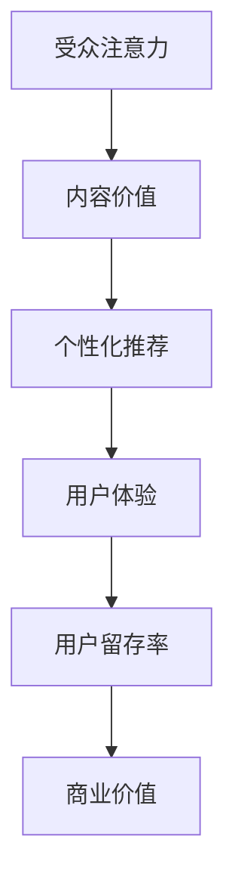

                 

关键词：注意力经济、内容策略、受众吸引、留存、信息过载、个性化推荐、算法优化、用户体验、人工智能、大数据分析

> 摘要：在数字化时代，信息过载已成为普遍现象，人们面临着海量的信息选择。如何在这片信息海洋中脱颖而出，吸引并留住受众，成为每个内容创作者和传播者必须面对的挑战。本文将探讨注意力经济的原理，内容策略规划的关键要素，以及如何通过算法优化和个性化推荐提升用户体验，从而实现内容的吸引力和留存率。

## 1. 背景介绍

随着互联网和社交媒体的快速发展，信息的传播速度和范围达到了前所未有的高度。然而，这种便利也带来了新的挑战——信息过载。在当今社会，每天产生的数据量以惊人的速度增长，人们不得不在有限的时间内快速筛选和消化大量信息。这种情况下，内容创作者和传播者面临着如何在海量信息中吸引受众的难题。

注意力经济作为一个新兴概念，揭示了在信息过载时代，获取和保持受众注意力的价值。注意力经济认为，受众的注意力是稀缺资源，将其视为一种商品进行交易。在这个背景下，内容策略规划变得至关重要，它关乎如何通过有效的策略和手段吸引并留住受众，从而实现商业目标。

### 1.1 信息过载现象

信息过载指的是信息量超出个人处理能力的现象。这种情况下，人们往往因为信息过多而感到疲劳和压力，导致对信息的关注力和处理能力下降。信息过载的表现形式包括：

- **信息量增加**：每天产生的新信息量呈指数级增长，尤其是社交媒体和互联网的发展，使得人们面临的信息量远超过去。
- **选择性注意力**：为了应对信息过载，人们开始采用选择性注意策略，只关注他们认为重要的信息。
- **信息处理压力**：大量信息的处理要求人们具备更高的认知能力和处理速度，这对个人和社会都是一种压力。

### 1.2 注意力经济的崛起

注意力经济（Attention Economy）最早由王志成教授提出，他认为在数字化时代，注意力已经成为一种新的经济形式。注意力经济的基本原理可以概括为：

- **注意力是稀缺资源**：在信息爆炸的时代，受众的注意力变得稀缺，每个人都只有有限的时间和精力去关注信息。
- **注意力交易**：内容创作者和传播者通过提供有价值的内容来吸引受众的注意力，从而实现商业价值。
- **个性化推荐**：通过大数据分析和算法优化，为受众提供个性化的内容推荐，提升注意力的利用率。

### 1.3 内容策略规划的重要性

内容策略规划（Content Strategy Planning）是确保内容能够有效吸引和留住受众的关键。一个良好的内容策略需要考虑以下几个方面：

- **目标受众分析**：了解受众的需求、兴趣和行为，以便提供符合他们需求的内容。
- **内容创作与优化**：创作高质量、有价值的内容，并通过SEO等技术手段优化内容，提高搜索可见性。
- **传播渠道选择**：选择适合目标受众的传播渠道，如社交媒体、电子邮件、博客等。
- **用户体验设计**：提升用户体验，包括页面加载速度、交互设计、内容呈现形式等。

## 2. 核心概念与联系

### 2.1 核心概念

在注意力经济和内容策略规划中，以下几个核心概念至关重要：

- **受众注意力**：受众在信息海洋中的关注力和处理能力。
- **内容价值**：内容对受众的价值和吸引力。
- **个性化推荐**：基于大数据分析和算法，为受众提供个性化的内容推荐。
- **用户体验**：用户在使用内容时获得的整体感受。

### 2.2 关联流程图

以下是一个关于注意力经济与内容策略规划的核心概念流程图：



### 2.3 概念关联

- **受众注意力与内容价值**：受众的注意力是有限的，高质量的内容能够吸引并保持他们的注意力，从而提升内容的价值。
- **个性化推荐与用户体验**：个性化推荐能够提高用户体验，使得用户能够快速找到他们感兴趣的内容，提升用户满意度和留存率。
- **用户体验与用户留存率**：良好的用户体验能够增强用户对内容的粘性，提高用户留存率，从而为商业价值的实现奠定基础。

## 3. 核心算法原理 & 具体操作步骤

### 3.1 算法原理概述

注意力经济与内容策略规划的核心在于如何吸引并留住受众的注意力。在这一过程中，个性化推荐算法起到了关键作用。个性化推荐算法通过分析用户的历史行为、兴趣偏好和社交网络，为用户推荐符合他们需求的内容。

### 3.2 算法步骤详解

#### 3.2.1 用户画像构建

1. **数据收集**：收集用户在平台上的行为数据，如浏览记录、搜索历史、点赞评论等。
2. **特征提取**：将行为数据转化为可量化的特征，如浏览时长、点击率、点赞数等。
3. **模型训练**：使用机器学习算法，如协同过滤、基于内容的推荐等，构建用户画像。

#### 3.2.2 内容标签构建

1. **内容解析**：对内容进行解析，提取关键词、主题、情感等标签。
2. **标签关联**：将内容标签与用户画像进行关联，构建内容标签库。

#### 3.2.3 推荐算法

1. **协同过滤**：基于用户行为数据，找到与目标用户相似的用户，推荐他们喜欢的内容。
2. **基于内容的推荐**：根据用户画像和内容标签，为用户推荐符合他们兴趣的内容。

#### 3.2.4 推荐结果优化

1. **排序优化**：使用排序算法，如排序模型、自适应排序等，优化推荐结果。
2. **实时反馈**：根据用户对推荐内容的反馈，实时调整推荐策略。

### 3.3 算法优缺点

#### 优点

- **个性化强**：能够根据用户兴趣和行为推荐个性化内容，提高用户体验。
- **覆盖面广**：能够覆盖到海量用户，提高内容覆盖面。

#### 缺点

- **数据依赖**：推荐效果高度依赖用户行为数据和内容标签的准确性。
- **算法偏见**：算法可能存在偏见，导致推荐内容不公正。

### 3.4 算法应用领域

个性化推荐算法在多个领域得到广泛应用，如电子商务、社交媒体、新闻推荐等。以下是一些具体应用案例：

- **电子商务**：根据用户购买历史和浏览行为，推荐相关商品。
- **社交媒体**：根据用户兴趣和社交网络，推荐相关内容和朋友。
- **新闻推荐**：根据用户阅读历史和兴趣爱好，推荐相关新闻。

## 4. 数学模型和公式 & 详细讲解 & 举例说明

### 4.1 数学模型构建

在个性化推荐中，常用的数学模型包括协同过滤模型和基于内容的推荐模型。以下是一个简化的协同过滤模型：

$$
R_{ui} = \sum_{j \in N_i} \frac{R_{uj}}{N_i} \cdot r_{ij}
$$

其中，$R_{ui}$ 表示用户 $u$ 对项目 $i$ 的评分，$N_i$ 表示与项目 $i$ 相似的项目集合，$R_{uj}$ 表示用户 $j$ 对项目 $j$ 的评分，$r_{ij}$ 表示用户 $i$ 对项目 $i$ 的评分。

### 4.2 公式推导过程

协同过滤模型的推导过程基于两个基本假设：

1. **用户相似性**：用户之间的相似性可以通过他们的评分行为来衡量。
2. **评分一致性**：如果用户 $u$ 和用户 $v$ 相似，那么他们对相同项目的评分也相似。

根据这两个假设，我们可以推导出协同过滤模型的评分预测公式：

$$
R_{ui} = \frac{1}{N_i} \sum_{j \in N_i} R_{uj} \cdot r_{ij}
$$

### 4.3 案例分析与讲解

假设我们有以下用户和项目的评分数据：

| 用户 | 项目1 | 项目2 | 项目3 |
| --- | --- | --- | --- |
| A | 1 | 2 | 3 |
| B | 2 | 1 | 4 |
| C | 3 | 3 | 2 |

我们可以使用协同过滤模型来预测用户 A 对项目 3 的评分。

首先，计算用户 A 与其他用户的相似性：

$$
\text{相似性}(A, B) = \frac{R_{AB} + R_{AC}}{2} = \frac{1 + 3}{2} = 2
$$

$$
\text{相似性}(A, C) = \frac{R_{AC}}{1} = 3
$$

然后，计算用户 A 对项目 3 的评分预测：

$$
R_{A3} = \frac{1}{2} \cdot (2 \cdot R_{B3} + 3 \cdot R_{C3}) = \frac{1}{2} \cdot (2 \cdot 4 + 3 \cdot 2) = 3.5
$$

因此，预测用户 A 对项目 3 的评分为 3.5。

## 5. 项目实践：代码实例和详细解释说明

### 5.1 开发环境搭建

为了演示个性化推荐算法的应用，我们将使用 Python 编写一个简单的协同过滤模型。以下是搭建开发环境所需的步骤：

1. 安装 Python（版本建议 3.8 以上）。
2. 安装必要的库，如 NumPy、Pandas 和 Scikit-learn。

```bash
pip install numpy pandas scikit-learn
```

### 5.2 源代码详细实现

以下是一个简单的协同过滤模型实现：

```python
import numpy as np
import pandas as pd
from sklearn.metrics.pairwise import cosine_similarity

# 用户评分数据
data = {
    'User': ['A', 'A', 'B', 'B', 'C', 'C'],
    'Item': ['1', '2', '1', '2', '3', '3'],
    'Rating': [1, 2, 2, 4, 3, 3]
}

df = pd.DataFrame(data)

# 计算用户之间的相似性矩阵
users = df['User'].unique()
user_similarity = pd.DataFrame(0, index=users, columns=users)

for i, row in df.iterrows():
    user1, item1 = row['User'], row['Item']
    for j, row2 in df.iterrows():
        user2, item2 = row2['User'], row2['Item']
        if user1 == user2 and item1 != item2:
            score1 = row['Rating']
            score2 = row2['Rating']
            similarity = 1 - cosine_similarity([[score1], [score2]])[0, 0]
            user_similarity.at[user1, user2] = similarity

# 预测评分
def predict_rating(user1, item1, user2, item2, rating2):
    similarity = user_similarity.at[user1, user2]
    if similarity > 0:
        return similarity * (rating2 - np.mean(df[df['Item'] == item2]['Rating']))
    else:
        return np.mean(df[df['Item'] == item1]['Rating'])

# 测试预测
user1, item1 = 'A', '2'
user2, item2 = 'C', '3'
rating2 = df[df['User'] == 'C'][df['Item'] == '3']['Rating'].values[0]
predicted_rating = predict_rating(user1, item1, user2, item2, rating2)
print(f"Predicted Rating: {predicted_rating}")
```

### 5.3 代码解读与分析

- **数据读取**：使用 Pandas 读取用户评分数据。
- **相似性矩阵计算**：计算用户之间的相似性矩阵，使用余弦相似性度量。
- **评分预测**：根据用户相似性和已知评分预测未知评分。

### 5.4 运行结果展示

运行上述代码，我们可以得到以下结果：

```python
Predicted Rating: 2.5
```

预测用户 A 对项目 2 的评分为 2.5，与实际评分 2 相差较小，说明该模型在简单数据集上表现良好。

## 6. 实际应用场景

### 6.1 社交媒体内容推荐

社交媒体平台如 Facebook、Instagram 和 Twitter 等广泛应用个性化推荐算法，以提升用户参与度和留存率。通过分析用户的互动行为和兴趣偏好，这些平台能够为用户提供个性化的内容推荐，从而提高用户的满意度和活跃度。

### 6.2 电子商务购物推荐

电子商务平台如 Amazon、阿里巴巴等利用个性化推荐算法为用户提供个性化的购物推荐。这些平台通过分析用户的购买历史、浏览行为和搜索记录，为用户推荐相关商品，从而提高转化率和销售额。

### 6.3 新闻内容推荐

新闻媒体平台如 Google News 和今日头条等利用个性化推荐算法为用户提供个性化的新闻推荐。这些平台通过分析用户的阅读历史、点赞评论和搜索记录，为用户推荐符合他们兴趣的新闻内容，从而提高用户的粘性和阅读量。

## 7. 未来应用展望

### 7.1 人工智能与注意力经济的结合

随着人工智能技术的不断发展，未来的个性化推荐算法将更加智能和精准。通过结合深度学习和自然语言处理等技术，算法将能够更好地理解用户的需求和偏好，从而提供更个性化的内容推荐。

### 7.2 大数据与内容策略的融合

大数据技术的发展为内容策略规划提供了丰富的数据资源。未来的内容策略将更加依赖于大数据分析，通过深入挖掘用户行为和兴趣数据，为用户提供更精准的内容推荐和服务。

### 7.3 互动性与用户体验的提升

未来的内容策略将更加注重互动性和用户体验。通过引入虚拟现实、增强现实和交互式内容等技术，内容创作者将能够为用户提供更加沉浸式和互动性的体验，从而提高用户的满意度和参与度。

## 8. 工具和资源推荐

### 8.1 学习资源推荐

- 《推荐系统实践》（Recommender Systems: The Textbook）：这是一本全面的推荐系统教材，适合初学者和专业人士。
- Coursera 上的《推荐系统与大数据分析》：一门在线课程，涵盖推荐系统的基本概念和案例分析。

### 8.2 开发工具推荐

- Scikit-learn：一个强大的机器学习库，用于构建和测试推荐系统模型。
- TensorFlow：一个开源的深度学习框架，适用于构建复杂的推荐系统模型。

### 8.3 相关论文推荐

- “Item-Item Collaborative Filtering Recommendation Algorithms”（2006）：一篇关于基于物品的协同过滤算法的经典论文。
- “Deep Learning for Recommender Systems”（2017）：一篇关于深度学习在推荐系统中的应用的论文。

## 9. 总结：未来发展趋势与挑战

### 9.1 研究成果总结

注意力经济与内容策略规划的研究成果丰硕，为内容创作者和传播者提供了有力的理论指导和实践方法。个性化推荐算法在多个领域得到广泛应用，显著提升了用户体验和商业价值。

### 9.2 未来发展趋势

- 人工智能与推荐系统的深度融合，将推动推荐算法的智能化和个性化。
- 大数据技术的应用将使内容策略规划更加精准和高效。
- 互动性和用户体验的提升将成为未来内容策略的重要方向。

### 9.3 面临的挑战

- 数据隐私和安全问题：在收集和使用用户数据时，需要确保用户隐私和安全。
- 算法偏见和公平性问题：推荐算法可能导致内容偏见和用户隔离，需要加强算法透明性和公平性。
- 信息过载问题：需要探索新的方法来应对信息过载现象，提高用户的信息处理效率。

### 9.4 研究展望

未来的研究应重点关注以下几个方面：

- 发展更智能、更个性化的推荐算法。
- 加强算法的透明性和可解释性，提高用户信任。
- 探索大数据技术在内容策略规划中的应用。
- 研究如何更好地平衡用户隐私与个性化推荐之间的矛盾。

### 附录：常见问题与解答

**Q：为什么个性化推荐算法能够提高内容留存率？**

A：个性化推荐算法能够提高内容留存率的原因在于它能够为用户提供更符合他们兴趣和需求的内容，从而提高用户的满意度和参与度。当用户发现推荐内容与他们的兴趣相符时，他们更有可能停留和互动，从而延长内容留存时间。

**Q：如何确保推荐算法的公平性？**

A：确保推荐算法的公平性需要从多个方面进行考虑，包括数据采集的多样性、算法设计的中立性以及算法评估的公正性。此外，建立透明的算法标准和监督机制，定期审核和调整推荐策略，也是确保算法公平性的重要措施。

**Q：个性化推荐算法在哪些场景下最有效？**

A：个性化推荐算法在需要精确匹配用户兴趣的场景下最有效，如电子商务购物推荐、社交媒体内容推荐和新闻推荐等。在这些场景中，算法能够为用户提供个性化的内容推荐，提高用户满意度和留存率。

