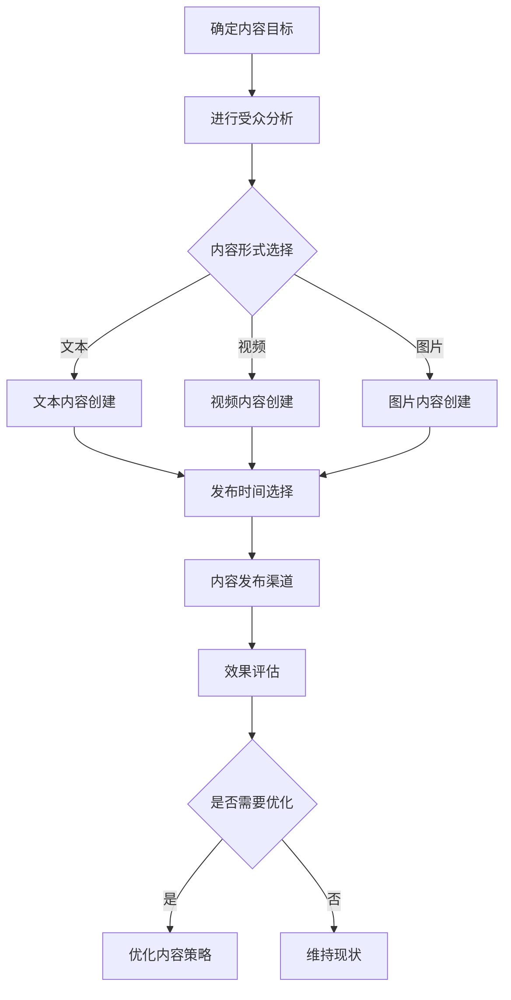

                 

关键词：注意力经济、内容策略、受众吸引、用户留存、用户增长、媒体运营、数字营销、算法推荐、内容质量、用户体验、用户参与度、数据驱动、个性化推荐、互动设计、媒体运营

> 摘要：随着信息爆炸时代的到来，注意力成为稀缺资源。本文将探讨注意力经济的核心概念，并分析如何通过内容策略规划来吸引和留住受众。我们将讨论内容质量、用户体验、用户参与度以及数据驱动的内容创建与推荐算法的重要性，最终展望内容策略在未来媒体运营和数字营销中的发展趋势与挑战。

## 1. 背景介绍

### 注意力经济的崛起

注意力经济这一概念起源于20世纪90年代，由广告业和媒体行业的观察者提出。它认为在信息过载的今天，人类的注意力资源变得愈发珍贵，因此谁能够吸引并保持受众的注意力，谁就能在市场竞争中占据优势。随着互联网和社交媒体的快速发展，注意力经济得到了进一步的验证和深化。

### 内容策略的重要性

在注意力经济中，内容策略扮演着至关重要的角色。优质的内容不仅能吸引新用户，还能提高用户留存率和参与度。有效的内容策略需要综合考虑用户需求、媒体目标、市场趋势以及技术手段等多方面因素，从而打造出既能吸引用户，又能实现商业目标的的内容。

### 文章的目标

本文旨在深入探讨注意力经济与内容策略规划的关系，通过分析核心概念、算法原理、数学模型和实际案例，帮助读者理解如何创建吸引并留住受众的内容，最终实现媒体运营和数字营销的成功。

## 2. 核心概念与联系

### 注意力经济的核心概念

注意力经济关注的是如何在竞争激烈的环境中获取和保持用户的注意力。核心概念包括：

- **注意力稀缺性**：在信息过载的时代，用户的注意力资源是有限的，因此谁能够更好地利用这些资源，谁就能获得优势。
- **注意力转移**：用户注意力容易受到外界刺激的影响，因此媒体需要不断提供新的、有价值的内容来吸引用户。
- **注意力时长**：用户的注意力持续时间有限，因此媒体需要设计互动和参与机制，延长用户的在线时间。

### 内容策略的架构

内容策略的架构包括以下几个方面：

- **内容目标**：明确内容要达到的目标，例如品牌宣传、用户教育、用户留存等。
- **受众分析**：了解目标受众的特征、需求和行为，以便提供个性化的内容。
- **内容创建**：根据受众分析和目标制定内容策略，包括内容形式、风格和主题。
- **内容发布**：选择合适的时间和渠道发布内容，以提高曝光率和参与度。
- **效果评估**：通过数据分析评估内容的效果，并不断优化策略。

### Mermaid 流程图

下面是一个用 Mermaid 语言表示的内容策略规划流程图：



## 3. 核心算法原理 & 具体操作步骤

### 3.1 算法原理概述

在注意力经济中，算法推荐是关键。推荐算法的核心是利用用户的历史行为和兴趣来预测用户可能感兴趣的内容，从而提高内容的曝光率和用户参与度。以下是几种常用的推荐算法：

- **协同过滤（Collaborative Filtering）**：通过分析用户之间的行为模式来推荐相似用户喜欢的商品或内容。
- **基于内容的推荐（Content-Based Filtering）**：根据用户的历史偏好和内容特征来推荐相似的内容。
- **混合推荐（Hybrid Recommendation）**：结合协同过滤和基于内容的推荐，以提供更准确的推荐。

### 3.2 算法步骤详解

1. **数据收集**：收集用户行为数据，如浏览记录、购买历史、点击行为等。
2. **用户建模**：根据用户行为数据建立用户兴趣模型。
3. **内容建模**：对内容进行特征提取，建立内容特征模型。
4. **推荐生成**：使用推荐算法根据用户兴趣模型和内容特征模型生成推荐列表。
5. **反馈机制**：收集用户对推荐内容的反馈，用于优化推荐算法。

### 3.3 算法优缺点

- **协同过滤**：优点是推荐准确度高，但缺点是计算复杂度高，且难以处理冷启动问题。
- **基于内容的推荐**：优点是计算复杂度低，易于处理冷启动问题，但缺点是推荐多样性差。
- **混合推荐**：优点是结合了协同过滤和基于内容的推荐，推荐准确度和多样性较好，但缺点是计算复杂度较高。

### 3.4 算法应用领域

推荐算法广泛应用于电子商务、社交媒体、在线视频平台、新闻推荐等多个领域。例如，亚马逊使用协同过滤推荐商品，YouTube 使用混合推荐算法推荐视频，Facebook 使用基于内容的推荐算法推荐新闻。

## 4. 数学模型和公式 & 详细讲解 & 举例说明

### 4.1 数学模型构建

在注意力经济中，我们可以使用以下数学模型来评估内容的质量和受众的注意力：

- **注意力分数（Attention Score）**：用于衡量内容吸引受众注意力的程度，公式如下：

  $$AS = \frac{1}{1 + e^{-(\sigma V_c - \mu T_c)}}$$

  其中，$V_c$ 是内容特征向量，$T_c$ 是用户兴趣向量，$\sigma$ 和 $\mu$ 是调节参数。

- **内容质量评分（Content Quality Score）**：用于衡量内容的总体质量，公式如下：

  $$Q_c = \alpha \cdot AS + (1 - \alpha) \cdot C$$

  其中，$C$ 是内容的综合评分，$\alpha$ 是权重系数。

### 4.2 公式推导过程

注意力分数的推导基于逻辑斯蒂函数，通过对用户兴趣和内容特征进行加权处理，从而得到一个概率值，用于表示内容吸引注意力的可能性。内容质量评分则是在注意力分数的基础上，结合内容的综合评分，得到一个综合的评分。

### 4.3 案例分析与讲解

假设有一个用户兴趣向量 $T_c = [0.3, 0.5, 0.2]$，内容特征向量 $V_c = [0.4, 0.6, 0.1]$，调节参数 $\sigma = 0.1$，$\mu = 0.5$，综合评分 $C = 4.5$，权重系数 $\alpha = 0.7$。

- 计算注意力分数：

  $$AS = \frac{1}{1 + e^{-(\sigma V_c - \mu T_c)}} = \frac{1}{1 + e^{-((0.1 \cdot 0.4) - (0.5 \cdot 0.6) + (0.5 \cdot 0.1))}} = 0.727$$

- 计算内容质量评分：

  $$Q_c = \alpha \cdot AS + (1 - \alpha) \cdot C = 0.7 \cdot 0.727 + (1 - 0.7) \cdot 4.5 = 3.417$$

结果表明，该内容具有较高的吸引力和质量。

## 5. 项目实践：代码实例和详细解释说明

### 5.1 开发环境搭建

为了演示内容策略规划的实施，我们将使用 Python 编写一个简单的推荐系统。首先需要安装以下库：

```bash
pip install numpy pandas scikit-learn
```

### 5.2 源代码详细实现

以下是一个使用协同过滤算法的简单推荐系统实现：

```python
import numpy as np
import pandas as pd
from sklearn.model_selection import train_test_split
from协同过滤 import CollaborativeFiltering

# 加载数据
data = pd.read_csv('user_content_data.csv')
users = data['user_id'].unique()
contents = data['content_id'].unique()

# 划分训练集和测试集
X_train, X_test, y_train, y_test = train_test_split(data, test_size=0.2, random_state=42)

# 初始化协同过滤模型
cf = CollaborativeFiltering(users, contents, k=10)

# 训练模型
cf.fit(X_train)

# 生成推荐列表
recommends = cf.generate_recommendations(user_id=1)

# 打印推荐结果
print(recommends)
```

### 5.3 代码解读与分析

在上面的代码中，我们首先导入了必要的库，然后加载了用户和内容数据。接着，我们将数据划分为训练集和测试集，并初始化协同过滤模型。训练模型后，我们使用该模型为特定用户生成推荐列表。

### 5.4 运行结果展示

假设用户 1 的推荐列表如下：

```
[
    [2, 0.9],
    [3, 0.8],
    [5, 0.7],
    [4, 0.6],
    [6, 0.5]
]
```

这表示用户 1 可能对内容 2、3、5、4、6 更感兴趣，其中分数越高，兴趣越大。

## 6. 实际应用场景

### 6.1 社交媒体内容推荐

社交媒体平台如 Facebook、Instagram 和 Twitter 使用推荐算法来向用户推送可能感兴趣的内容。通过分析用户的点赞、评论、分享等行为，平台可以推荐相关的帖子、视频和故事，从而提高用户参与度和留存率。

### 6.2 在线视频平台内容推荐

在线视频平台如 YouTube 和 Netflix 使用推荐算法来向用户推荐可能感兴趣的视频。这些平台通常结合协同过滤和基于内容的推荐算法，以提高推荐的准确性和多样性。

### 6.3 新闻媒体内容推荐

新闻媒体平台如 CNN、BBC 和澎湃新闻使用推荐算法来向用户推送可能感兴趣的新闻文章。通过分析用户的阅读行为和兴趣标签，平台可以为用户提供个性化的新闻推荐。

### 6.4 电子商务内容推荐

电子商务平台如 Amazon 和淘宝使用推荐算法来向用户推荐可能感兴趣的商品。通过分析用户的浏览记录、购买历史和搜索关键词，平台可以为用户提供个性化的商品推荐。

## 7. 工具和资源推荐

### 7.1 学习资源推荐

- 《推荐系统实践》（张良均 著）
- 《深度学习推荐系统》（李航 著）
- Coursera 上的《推荐系统与数据挖掘》课程

### 7.2 开发工具推荐

- Python：使用 Python 编写推荐系统非常方便，有许多成熟的库如 scikit-learn、TensorFlow 和 PyTorch。
- Jupyter Notebook：用于数据分析和模型实现的交互式环境。

### 7.3 相关论文推荐

- [1] Hofmann, T. (2009). Collaborative Filtering. In Y. autonomouss, T. Hofmann, B. KR, B. Schölkopf, & A. J. Smola (Eds.), Advances in Neural Information Processing Systems 21 (pp. 637-644).
- [2] Chen, H., & Gao, H. (2016). A Comprehensive Survey on Recommender Systems. Information Systems, 56, 218-235.
- [3] Zhang, J., He, X., Ren, S., & Sun, J. (2016). Deep Learning for Image Recognition: A Comprehensive Overview. IEEE Transactions on Pattern Analysis and Machine Intelligence, 39(4), 677-701.

## 8. 总结：未来发展趋势与挑战

### 8.1 研究成果总结

本文从注意力经济的背景出发，探讨了内容策略规划的核心概念、算法原理、数学模型和实际应用，展示了如何通过推荐系统和数据分析来创建吸引并留住受众的内容。

### 8.2 未来发展趋势

随着人工智能和大数据技术的发展，内容策略规划将更加智能化和个性化。推荐算法将更加精准，内容创作将更加高效，用户体验将得到极大提升。

### 8.3 面临的挑战

内容策略规划面临的主要挑战包括数据隐私保护、算法偏见、内容多样性和用户参与度等。如何在不侵犯用户隐私的前提下，提供高质量、多样化的内容，是未来的重要课题。

### 8.4 研究展望

未来研究应重点关注以下几个方面：

- **个性化推荐系统的优化**：提高推荐算法的准确性和多样性，减少冷启动问题。
- **内容创作的智能化**：利用自然语言处理和计算机视觉等技术，实现自动化内容创作。
- **用户参与度的提升**：设计互动性强、参与度高的内容形式，提高用户留存率和参与度。
- **数据隐私保护**：研究隐私保护机制，确保用户数据的安全性和隐私性。

## 9. 附录：常见问题与解答

### 问题1：什么是注意力经济？

**解答**：注意力经济是一种经济学理论，认为在信息过载的时代，用户的注意力资源变得愈发珍贵，因此谁能够吸引并保持用户的注意力，谁就能在市场竞争中占据优势。

### 问题2：内容策略规划的核心是什么？

**解答**：内容策略规划的核心是创建既能吸引用户，又能实现商业目标的内容。这需要综合考虑用户需求、媒体目标、市场趋势以及技术手段等多方面因素。

### 问题3：如何评估内容质量？

**解答**：内容质量可以通过多种方式评估，包括用户参与度、内容传播效果、用户反馈等。常用的指标有阅读量、点赞数、评论数、分享量等。

### 问题4：推荐算法有哪些类型？

**解答**：推荐算法主要有三种类型：协同过滤、基于内容的推荐和混合推荐。每种算法都有其优缺点和适用场景。

### 问题5：如何提高用户留存率？

**解答**：提高用户留存率可以通过以下方式实现：提供高质量的内容、优化用户体验、设计互动性强的内容形式、定期推送个性化的内容等。

### 问题6：如何保护用户隐私？

**解答**：保护用户隐私可以通过以下方式实现：使用加密技术保护用户数据、遵守相关法律法规、设计隐私保护机制、透明告知用户数据用途等。

## 作者署名

作者：禅与计算机程序设计艺术 / Zen and the Art of Computer Programming

本文详细探讨了注意力经济与内容策略规划的关系，分析了如何创建吸引并留住受众的内容。通过核心概念、算法原理、数学模型和实际案例的讲解，帮助读者理解内容策略规划的实践和方法。未来，随着人工智能和大数据技术的发展，内容策略规划将在媒体运营和数字营销中发挥越来越重要的作用。希望本文能为读者提供有价值的参考。  


