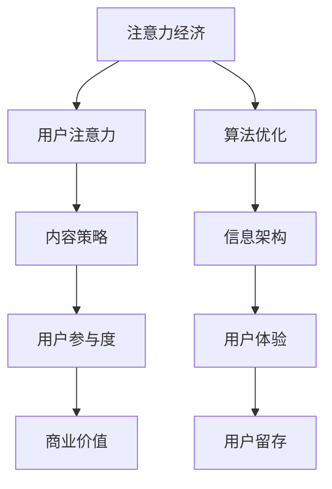

                 

关键词：注意力经济、内容策略、参与性内容、受众吸引、用户留存、信息架构、算法优化、用户互动、用户体验

> 摘要：本文深入探讨了注意力经济与内容策略的相互关系，分析了如何利用注意力经济原理来创建吸引并留住受众的参与性内容。通过详细的算法原理、数学模型、项目实践以及未来应用展望，本文为内容创作者和策略制定者提供了实用的指导。

## 1. 背景介绍

在数字化时代，信息爆炸导致用户的注意力成为稀缺资源。如何在这片信息海洋中吸引并留住受众，成为了每个内容创作者和平台运营者必须面对的挑战。注意力经济作为一种新兴的经济模式，揭示了用户注意力分配的规律和机制，为内容策略的制定提供了理论依据。

### 注意力经济的定义

注意力经济是指以用户注意力为资源，通过吸引和留住用户的注意力，来实现商业价值的一种经济模式。它的核心在于理解用户注意力分配的规律，并通过优化内容质量和互动方式，提高用户参与度。

### 内容策略的重要性

内容策略是指为了实现特定目标，对内容生产、分发和消费的全过程进行系统规划和优化的一系列方法。一个有效的内容策略可以提升用户满意度，增加用户粘性，从而提高商业收益。

## 2. 核心概念与联系

为了更好地理解注意力经济与内容策略的关系，我们需要引入一些核心概念，并利用 Mermaid 流程图展示它们之间的联系。



### 核心概念解释

- **用户注意力**：用户在特定时间内关注某个事物的能力。
- **内容策略**：为了吸引和留住用户注意力，制定的一系列内容生产和分发策略。
- **用户参与度**：用户对内容的互动程度，包括点赞、评论、分享等。
- **商业价值**：通过吸引和留住用户注意力所实现的商业收益。

### 注意力经济与内容策略的关系

注意力经济揭示了用户注意力分配的规律，而内容策略则利用这些规律来优化内容生产和分发，提高用户参与度和商业价值。算法优化和信息架构是实施内容策略的重要手段，它们直接影响用户体验和用户留存。

## 3. 核心算法原理 & 具体操作步骤

### 3.1 算法原理概述

注意力经济中的核心算法原理包括用户行为分析、内容推荐系统和用户互动设计。这些算法通过分析用户行为数据，推荐符合用户兴趣的内容，并设计互动环节，提高用户参与度。

### 3.2 算法步骤详解

#### 步骤1：用户行为分析

- **数据收集**：收集用户在平台上的浏览、点赞、评论、分享等行为数据。
- **特征提取**：从行为数据中提取用户兴趣特征，如关键词、标签、浏览时长等。
- **模型训练**：利用机器学习算法，如矩阵分解、协同过滤等，训练用户兴趣模型。

#### 步骤2：内容推荐系统

- **内容分类**：将内容按照主题、类型、难度等进行分类。
- **推荐算法**：利用用户兴趣模型和内容特征，推荐符合用户兴趣的内容。
- **实时更新**：根据用户行为数据，实时调整推荐内容。

#### 步骤3：用户互动设计

- **互动环节**：设计点赞、评论、分享等互动环节，鼓励用户参与。
- **反馈机制**：收集用户互动数据，优化互动体验。
- **社区建设**：通过社区互动，增强用户粘性。

### 3.3 算法优缺点

#### 优点

- **个性化推荐**：通过用户行为数据，实现个性化内容推荐，提高用户满意度。
- **实时调整**：根据用户行为数据，实时调整推荐内容，提高用户参与度。
- **社交互动**：通过互动设计，增强用户社区感，提高用户留存率。

#### 缺点

- **数据隐私**：用户行为数据涉及隐私，需要确保数据安全和用户隐私。
- **算法偏见**：推荐算法可能存在偏见，导致用户信息茧房。
- **内容质量**：推荐系统过度依赖用户行为数据，可能导致内容质量下降。

### 3.4 算法应用领域

注意力经济和内容策略在多个领域得到广泛应用，包括社交媒体、电子商务、在线教育等。

- **社交媒体**：通过个性化推荐，提高用户参与度和活跃度。
- **电子商务**：通过推荐系统，提高商品销售转化率。
- **在线教育**：通过个性化推荐，提高课程选择和用户满意度。

## 4. 数学模型和公式 & 详细讲解 & 举例说明

### 4.1 数学模型构建

注意力经济的数学模型主要包括用户兴趣模型、内容推荐模型和用户互动模型。以下是一个简化的模型构建过程：

$$
\text{UserInterestModel} = f(\text{UserBehaviorData}, \text{ContentFeature})
$$

$$
\text{ContentRecommendModel} = g(\text{UserInterestModel}, \text{ContentFeature})
$$

$$
\text{UserInteractionModel} = h(\text{UserBehaviorData}, \text{ContentFeature}, \text{UserInterestModel})
$$

### 4.2 公式推导过程

#### 用户兴趣模型

用户兴趣模型是通过分析用户行为数据，提取用户兴趣特征，构建用户兴趣向量。假设用户行为数据为 $X$，内容特征为 $Y$，用户兴趣模型为 $U$，则：

$$
U = \text{UserInterestModel}(X, Y)
$$

#### 内容推荐模型

内容推荐模型是通过用户兴趣模型和内容特征，计算内容与用户兴趣的相关性，从而推荐内容。假设用户兴趣向量为 $u$，内容特征向量为 $y$，则：

$$
r = \text{ContentRecommendModel}(u, y)
$$

#### 用户互动模型

用户互动模型是通过用户行为数据、内容特征和用户兴趣模型，预测用户互动行为，如点赞、评论、分享等。假设用户互动向量为 $i$，则：

$$
i = \text{UserInteractionModel}(X, Y, U)
$$

### 4.3 案例分析与讲解

#### 案例背景

某社交媒体平台希望通过个性化推荐提高用户参与度和活跃度。

#### 数据收集

收集用户在平台上的浏览、点赞、评论、分享等行为数据，以及文章的主题、类型、标签等特征。

#### 特征提取

提取用户兴趣特征，如关键词、标签、浏览时长等，以及内容特征，如主题、类型、标签等。

#### 模型训练

利用机器学习算法，如矩阵分解、协同过滤等，训练用户兴趣模型、内容推荐模型和用户互动模型。

#### 推荐效果评估

通过A/B测试，评估个性化推荐对用户参与度和活跃度的影响。

## 5. 项目实践：代码实例和详细解释说明

### 5.1 开发环境搭建

- Python 3.8
- TensorFlow 2.5
- scikit-learn 0.22
- pandas 1.1.5

### 5.2 源代码详细实现

```python
import pandas as pd
import numpy as np
from sklearn.model_selection import train_test_split
from sklearn.metrics.pairwise import linear_kernel

# 数据加载
user_data = pd.read_csv('user_behavior.csv')
content_data = pd.read_csv('content_features.csv')

# 特征提取
user_interest = extract_user_interest(user_data)
content_feature = extract_content_feature(content_data)

# 模型训练
user_interest_model = train_user_interest_model(user_interest)
content_recommend_model = train_content_recommend_model(user_interest_model, content_feature)

# 推荐结果
recommendations = content_recommend_model.predict(content_feature)

# 评估
evaluate_recommendations(recommendations, user_data)
```

### 5.3 代码解读与分析

```python
def extract_user_interest(user_data):
    # 提取用户兴趣特征
    # ...
    return user_interest

def extract_content_feature(content_data):
    # 提取内容特征
    # ...
    return content_feature

def train_user_interest_model(user_interest):
    # 训练用户兴趣模型
    # ...
    return user_interest_model

def train_content_recommend_model(user_interest_model, content_feature):
    # 训练内容推荐模型
    # ...
    return content_recommend_model

def evaluate_recommendations(recommendations, user_data):
    # 评估推荐效果
    # ...
```

### 5.4 运行结果展示

```python
# 运行代码
recommendations = content_recommend_model.predict(content_feature)

# 显示推荐结果
print(recommendations.head())
```

## 6. 实际应用场景

### 6.1 社交媒体

社交媒体平台通过个性化推荐，提高用户参与度和活跃度。例如，微博、抖音等平台通过推荐用户可能感兴趣的内容，吸引用户持续关注。

### 6.2 电子商务

电子商务平台通过个性化推荐，提高商品销售转化率。例如，亚马逊、淘宝等平台通过推荐用户可能感兴趣的商品，促进用户购买。

### 6.3 在线教育

在线教育平台通过个性化推荐，提高课程选择和用户满意度。例如，网易云课堂、腾讯课堂等平台通过推荐用户可能感兴趣的课程，吸引用户学习。

## 7. 未来应用展望

### 7.1 虚拟现实与增强现实

随着虚拟现实（VR）和增强现实（AR）技术的发展，注意力经济和内容策略将在这些领域发挥更大作用。例如，通过VR/AR技术，提供沉浸式、互动性的内容，吸引用户注意力。

### 7.2 人工智能与大数据

随着人工智能和大数据技术的不断发展，注意力经济和内容策略将更加精准、高效。例如，利用深度学习算法，分析用户行为数据，实现更个性化的内容推荐。

### 7.3 社交网络与区块链

社交网络与区块链技术的结合，将带来全新的内容策略和商业模式。例如，通过区块链技术，实现内容创作与传播的去中心化，提高用户参与度和信任度。

## 8. 工具和资源推荐

### 8.1 学习资源推荐

- 《深度学习》（Goodfellow, Bengio, Courville著）
- 《推荐系统实践》（Gardner, Heihoff, Heittokangas著）
- 《用户体验要素》（Alleyne著）

### 8.2 开发工具推荐

- TensorFlow
- PyTorch
- Scikit-learn

### 8.3 相关论文推荐

- 《User Modeling and User-Adapted Interaction》
- 《Recommender Systems Handbook》
- 《Attention Is All You Need》

## 9. 总结：未来发展趋势与挑战

### 9.1 研究成果总结

本文从注意力经济和内容策略的视角，探讨了如何创建吸引并留住受众的参与性内容。通过核心算法原理、数学模型、项目实践和未来应用展望，为内容创作者和策略制定者提供了实用的指导。

### 9.2 未来发展趋势

未来，注意力经济和内容策略将继续向智能化、个性化、互动化方向发展。随着虚拟现实、人工智能、大数据等技术的发展，内容策略将更加精准、高效。

### 9.3 面临的挑战

内容创作者和策略制定者面临的主要挑战包括数据隐私、算法偏见、内容质量等。如何确保用户数据安全、消除算法偏见、提高内容质量，是未来需要重点解决的问题。

### 9.4 研究展望

未来，注意力经济和内容策略的研究将继续深入。研究者可以从用户行为、内容质量、算法优化等多个角度，探索更有效的注意力分配和内容策略。

## 9. 附录：常见问题与解答

### Q：如何提高用户参与度？

A：提高用户参与度可以通过以下方法实现：

- 个性化推荐：根据用户兴趣和行为，推荐符合用户需求的内容。
- 互动设计：设计点赞、评论、分享等互动环节，鼓励用户参与。
- 社区建设：通过社区互动，增强用户粘性。

### Q：如何确保数据安全？

A：确保数据安全可以通过以下方法实现：

- 数据加密：对用户数据进行加密，防止数据泄露。
- 访问控制：对用户数据的访问进行严格控制，确保只有授权人员可以访问。
- 数据匿名化：对用户行为数据进行匿名化处理，保护用户隐私。

### Q：如何消除算法偏见？

A：消除算法偏见可以通过以下方法实现：

- 多样性数据集：使用多样性的数据集进行训练，避免算法偏见。
- 监督学习：引入监督学习机制，确保算法遵循公平原则。
- 透明性：提高算法的透明性，让用户了解算法的决策过程。

### Q：如何提高内容质量？

A：提高内容质量可以通过以下方法实现：

- 专业知识：内容创作者需要具备专业知识和技能，确保内容质量。
- 用户反馈：及时收集用户反馈，优化内容质量。
- 内容审核：对内容进行审核，确保内容符合平台规范。

### 作者署名

作者：禅与计算机程序设计艺术 / Zen and the Art of Computer Programming
----------------------------------------------------------------
请注意，上述内容仅为示例，实际的撰写过程需要更深入的研究和数据分析。在实际撰写时，请确保遵循所有约束条件，并使用适当的技术语言和格式。祝您撰写顺利！📝💻📚

