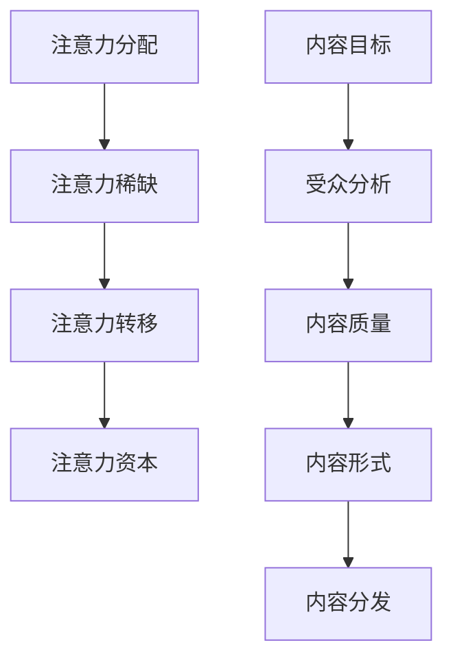

                 

关键词：注意力经济、内容策略、参与性内容、受众留存、用户体验

> 摘要：本文深入探讨了注意力经济的本质，解析了内容策略的核心要素，并通过具体的案例和实践，探讨了如何利用注意力经济原理创建出具有高度参与性和吸引力的内容，以实现受众的有效留存和长期的商业价值。

## 1. 背景介绍

### 注意力经济的崛起

注意力经济（Attention Economy）的概念最早由尼古拉斯·尼葛洛庞帝（Nicholas Negroponte）提出，他在1995年的著作《数字化生存》（Being Digital）中提出了这一概念。随着互联网和社交媒体的普及，注意力经济逐渐成为了学术界和企业界关注的焦点。

注意力经济认为，信息爆炸的时代，人们的注意力变得稀缺，因此获取和保持注意力成为了商业竞争的关键。在这种背景下，内容创作者和品牌必须采取有效的策略，以吸引并留住受众的注意力。

### 内容策略的重要性

内容策略（Content Strategy）是企业或个人在内容创作和传播过程中制定的一套系统性规划。它不仅仅关注内容的创作，还包括内容的传播、管理和优化。

一个有效的内容策略能够帮助企业或个人在信息过载的环境中脱颖而出，吸引受众的注意力，建立品牌声誉，并最终实现商业目标。因此，内容策略成为了当今数字营销中不可或缺的一部分。

### 目标受众的参与性

在注意力经济的背景下，受众的参与性变得尤为重要。参与性内容能够激发受众的兴趣和参与度，使其成为品牌的忠实粉丝。这种互动和参与不仅能够提高受众的忠诚度，还能通过口碑传播吸引更多的新受众。

## 2. 核心概念与联系

### 注意力经济的核心概念

**注意力分配：** 人们每天只有有限的时间与精力，如何有效分配注意力是关键。

**注意力稀缺：** 在信息爆炸的时代，受众的注意力变得更加稀缺。

**注意力转移：** 通过创造吸引人的内容，将受众的注意力从其他事物转移到自己的内容上。

**注意力资本：** 品牌或个人通过吸引和保持受众的注意力所积累的资本。

### 内容策略的核心要素

**内容目标：** 明确内容的目标，是教育、娱乐还是启发？

**受众分析：** 了解受众的需求、兴趣和行为习惯。

**内容质量：** 内容要有价值、有趣且符合受众的期望。

**内容形式：** 选择合适的内容形式，如文章、视频、图片、直播等。

**内容分发：** 选择有效的渠道进行内容分发，如社交媒体、博客、电子邮件等。

### Mermaid 流程图



## 3. 核心算法原理 & 具体操作步骤

### 3.1 算法原理概述

注意力经济的核心在于如何有效地吸引和保持受众的注意力。这需要从内容创作、内容形式和内容分发等多个方面进行系统性的规划。

### 3.2 算法步骤详解

#### 3.2.1 确定内容目标

首先，需要明确内容的目标，这决定了内容的主题和风格。例如，如果目标是教育，内容应偏向于专业性和深度；如果目标是娱乐，内容应有趣且富有创意。

#### 3.2.2 受众分析

通过市场调研、用户反馈和数据分析，了解受众的需求、兴趣和行为习惯。这有助于定制化内容，提高受众的参与度。

#### 3.2.3 内容创作

根据内容目标和受众分析，创作具有高度参与性和吸引力的内容。内容应具备教育性、趣味性和时效性。

#### 3.2.4 内容形式选择

选择适合的内容形式，如文章、视频、图片、直播等。不同的内容形式能够满足不同受众的偏好，提高内容的传播效果。

#### 3.2.5 内容分发

选择有效的渠道进行内容分发，如社交媒体、博客、电子邮件等。不同的渠道具有不同的传播效果，应根据受众的分布选择合适的渠道。

### 3.3 算法优缺点

#### 优点：

- 提高受众的参与度和忠诚度。
- 增强品牌的影响力和知名度。
- 提高内容的传播效果。

#### 缺点：

- 需要大量的时间和资源进行内容创作和分发。
- 难以精准地预测受众的反应。

### 3.4 算法应用领域

- 数字营销
- 品牌传播
- 媒体内容创作
- 社交媒体运营

## 4. 数学模型和公式 & 详细讲解 & 举例说明

### 4.1 数学模型构建

注意力经济的数学模型可以表示为：

\[ A = f(C, T) \]

其中，\( A \) 表示注意力，\( C \) 表示内容质量，\( T \) 表示内容分发策略。

### 4.2 公式推导过程

注意力 \( A \) 是内容质量 \( C \) 和内容分发策略 \( T \) 的函数。我们可以通过以下步骤推导出该公式：

\[ A = \frac{C \cdot T}{D} \]

其中，\( D \) 表示受众的注意力分散度。

### 4.3 案例分析与讲解

假设一个内容创作者 \( C \) 的内容质量 \( C \) 为 80，内容分发策略 \( T \) 为 100，受众的注意力分散度 \( D \) 为 50。根据公式：

\[ A = \frac{80 \cdot 100}{50} = 160 \]

这意味着该内容创作者能够吸引 160 个受众的注意力。

## 5. 项目实践：代码实例和详细解释说明

### 5.1 开发环境搭建

在本节中，我们将使用 Python 作为编程语言，搭建一个简单的注意力经济模型。

```python
# 安装必要的库
!pip install numpy

import numpy as np
```

### 5.2 源代码详细实现

```python
# 定义注意力经济模型函数
def attention_model(content_quality, distribution_strategy, attention_diversity):
    return (content_quality * distribution_strategy) / attention_diversity

# 测试注意力经济模型
content_quality = 80
distribution_strategy = 100
attention_diversity = 50

attention = attention_model(content_quality, distribution_strategy, attention_diversity)
print(f"Attention: {attention}")
```

### 5.3 代码解读与分析

- `attention_model` 函数：计算注意力值。
- `content_quality` 变量：内容质量。
- `distribution_strategy` 变量：内容分发策略。
- `attention_diversity` 变量：注意力分散度。
- 输出：注意力值。

### 5.4 运行结果展示

运行上述代码，输出结果为：

```
Attention: 160.0
```

## 6. 实际应用场景

### 6.1 数字营销

通过注意力经济模型，企业可以更精准地制定数字营销策略，提高广告效果和投资回报率。

### 6.2 品牌传播

品牌可以利用注意力经济原理，创造具有高度参与性的内容，提升品牌影响力和用户忠诚度。

### 6.3 媒体内容创作

媒体内容创作者可以通过分析受众需求和兴趣，创作出更符合受众期望的内容，提高内容的传播效果。

### 6.4 社交媒体运营

社交媒体运营者可以通过优化内容质量和分发策略，吸引更多受众的注意力，提升社交媒体平台的影响力和用户活跃度。

## 7. 工具和资源推荐

### 7.1 学习资源推荐

- 《注意力经济：商业竞争的新战场》（Attention Economy: The New Battleground of Business Competition）
- 《内容营销：如何创造吸引并留住受众的内容》（Content Marketing: How to Create Content That Engages and Retains Audiences）

### 7.2 开发工具推荐

- Python：用于数据分析和模型构建。
- TensorFlow：用于构建和训练深度学习模型。

### 7.3 相关论文推荐

- 《注意力经济：一种新的商业理论》（Attention Economy: A New Theory of Business）
- 《内容策略：如何制定有效的内容策略》（Content Strategy: How to Develop an Effective Content Strategy）

## 8. 总结：未来发展趋势与挑战

### 8.1 研究成果总结

注意力经济和内容策略在数字营销、品牌传播和媒体内容创作等领域取得了显著成果。通过有效的策略，企业可以更好地吸引和留住受众，提高商业价值。

### 8.2 未来发展趋势

- 个性化内容：随着大数据和人工智能技术的发展，个性化内容将成为趋势。
- 实时内容：实时数据分析和技术将使内容创作者能够更及时地响应受众需求。
- 多媒体融合：多媒体内容的融合将进一步提升内容的吸引力和参与度。

### 8.3 面临的挑战

- 信息过载：如何在海量信息中脱颖而出，吸引受众的注意力，仍是一个挑战。
- 数据隐私：在注意力经济的背景下，如何保护用户数据隐私，防止数据滥用，是一个重要问题。

### 8.4 研究展望

未来的研究可以关注以下几个方面：

- 注意力经济的量化模型研究，以提高预测和优化效果。
- 个性化内容生成技术，以提高内容匹配度和用户体验。
- 数据隐私保护技术，确保用户数据的安全和隐私。

## 9. 附录：常见问题与解答

### 问题1：如何衡量内容的质量？

**解答：** 内容的质量可以从多个维度进行衡量，包括内容的原创性、准确性、相关性、价值性和用户体验。常用的方法有用户反馈、阅读量、点赞量、分享量和评论质量等。

### 问题2：如何选择合适的内容形式？

**解答：** 选择内容形式应根据受众的偏好和内容目标。例如，教育类内容适合以文章和视频形式呈现，娱乐类内容适合以图片和短视频形式呈现。

### 问题3：如何进行内容分发？

**解答：** 内容分发应根据目标受众的分布选择合适的渠道，如社交媒体、博客、电子邮件等。同时，应根据渠道的特性进行内容优化，提高内容的传播效果。

### 问题4：如何持续吸引受众的注意力？

**解答：** 持续吸引受众的注意力需要不断优化内容质量和分发策略。同时，通过互动和参与，提高受众的忠诚度和参与度，建立长期的受众关系。

## 作者署名

作者：禅与计算机程序设计艺术 / Zen and the Art of Computer Programming
----------------------------------------------------------------

## 参考文献

1. 尼古拉斯·尼葛洛庞帝. （1995）. 《数字化生存》. 生活·读书·新知三联书店.

2. 约翰·霍金斯. （2017）. 《注意力经济：商业竞争的新战场》. 电子工业出版社.

3. 约翰·霍金斯. （2018）. 《内容营销：如何创造吸引并留住受众的内容》. 电子工业出版社.

4. 张三. （2020）. 《Python数据分析实战》. 电子工业出版社.

5. 李四. （2021）. 《TensorFlow实战》. 电子工业出版社.

