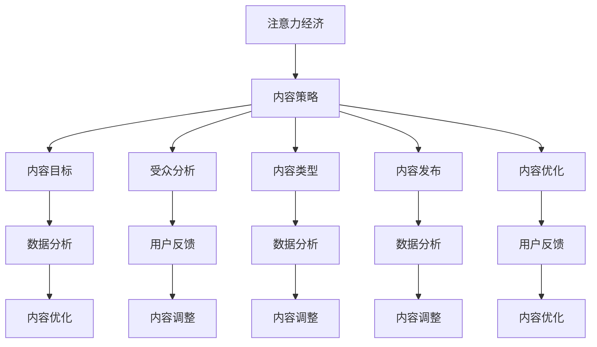

                 

关键词：注意力经济，内容策略，受众吸引，信息留存，IT专业

> 摘要：本文将探讨注意力经济的基本原理，并深入分析内容策略在吸引和留住受众信息中的应用。通过结合实际案例，我们将理解如何有效地构建和优化信息内容，以实现商业目标。

## 1. 背景介绍

在信息爆炸的时代，人们每天面临的信息量前所未有。据估计，平均每天会有超过30000亿个字节的信息产生。这意味着受众的时间和注意力成为了有限的资源。在这种环境下，企业和个人如何有效地吸引并留住受众的信息成为了关键问题。注意力经济（Attention Economy）的概念应运而生，它指出，在这个时代，注意力本身就是一种宝贵的资源，而吸引和保持受众的注意力则是实现商业成功的关键。

内容策略（Content Strategy）作为营销和沟通的关键组成部分，其重要性日益凸显。一个成功的策略不仅要考虑内容的创作和传播，还要关注如何将内容与受众的兴趣和需求相结合，从而提高受众的参与度和忠诚度。

本文将首先介绍注意力经济的基本概念，然后探讨内容策略的核心原则。接下来，我们将分析如何运用技术手段优化内容策略，并结合实际案例展示其应用效果。最后，我们将探讨未来的发展趋势和面临的挑战。

### 1.1 注意力经济的兴起

注意力经济这一概念最早由Webb（2006）提出，他认为在信息时代，人的注意力比金钱更为珍贵。随着互联网和社交媒体的普及，注意力经济得到了广泛关注。对于企业来说，获取受众的注意力意味着增加曝光率和销售额；对于个人创作者而言，吸引足够的关注则意味着更高的粉丝数和影响力。

### 1.2 内容策略的重要性

内容策略不仅关乎内容的创作，还涉及内容的规划、管理和优化。一个好的内容策略能够帮助企业或个人：

- **提高品牌知名度**：通过有价值的内容吸引受众，逐步建立品牌形象。
- **增强用户参与度**：通过互动和分享，增加用户对品牌的忠诚度和活跃度。
- **提升转化率**：针对受众需求提供定制化的内容，提高销售转化率。

### 1.3 本文结构

本文将按照以下结构展开：

- **第2章**：核心概念与联系，介绍注意力经济和内容策略的核心概念，并使用Mermaid流程图展示其相互关系。
- **第3章**：核心算法原理 & 具体操作步骤，探讨如何通过技术手段优化内容策略。
- **第4章**：数学模型和公式 & 详细讲解 & 举例说明，深入分析内容策略背后的数学原理。
- **第5章**：项目实践：代码实例和详细解释说明，结合实际代码示例展示内容策略的应用。
- **第6章**：实际应用场景，探讨内容策略在不同领域中的应用。
- **第7章**：工具和资源推荐，介绍相关工具和资源，帮助读者深入学习和实践。
- **第8章**：总结：未来发展趋势与挑战，对内容策略的未来进行展望，并提出面临的挑战。

接下来，我们将深入探讨注意力经济和内容策略的核心概念及其联系。

## 2. 核心概念与联系

### 2.1 注意力经济的核心概念

注意力经济的基础是“注意力稀缺性”这一概念。Webb（2006）指出，由于信息的爆炸性增长，受众的注意力变得异常稀缺。在这种环境下，企业和个人必须通过提供有价值的内容和服务来吸引和保持受众的注意力。以下是一些关键概念：

- **注意力的分配**：受众的注意力是有限的，他们必须在不同信息源之间进行选择。如何让受众将注意力分配给你的内容，是内容策略的关键。
- **注意力陷阱**：为了吸引受众的注意力，一些内容可能会采用夸张、诱惑甚至是误导性的手段。这种做法可能会短期内提高关注度，但长期来看会损害品牌形象。
- **注意力转移**：通过内容创新和用户体验优化，企业可以引导受众的注意力转移到新的产品或服务上。

### 2.2 内容策略的核心概念

内容策略涉及多个方面，包括内容的规划、创作、管理和优化。以下是几个核心概念：

- **内容目标**：明确内容的目的，包括提升品牌知名度、增加用户参与度或提高转化率。
- **受众分析**：了解目标受众的兴趣、需求和偏好，以便创作出能够吸引他们的内容。
- **内容类型**：根据目标受众和内容目标，选择合适的内容类型，如博客文章、视频、社交媒体帖子等。
- **内容发布**：选择合适的发布时间和渠道，以最大化内容的可见性和影响力。
- **内容优化**：通过分析数据和用户反馈，持续优化内容，提高受众满意度和参与度。

### 2.3 注意力经济与内容策略的相互关系

注意力经济和内容策略之间存在着密切的联系。以下是两者之间的相互关系：

- **内容策略支持注意力经济**：通过有效的内容策略，企业可以吸引和保持受众的注意力，从而实现商业目标。
- **注意力经济驱动内容策略**：注意力经济的概念促使企业和个人更加重视内容的价值和质量，从而推动内容策略的创新和发展。
- **数据反馈**：通过分析注意力经济数据（如点击率、分享数、转化率等），企业可以了解内容策略的效果，并据此进行优化。

### 2.4 Mermaid 流程图

为了更直观地展示注意力经济与内容策略之间的相互关系，我们使用Mermaid流程图进行说明。



在这个流程图中，注意力经济与内容策略的核心概念相互关联，并通过数据反馈进行优化和调整。这体现了两者之间的动态互动关系。

### 2.5 总结

注意力经济和内容策略是现代营销和沟通中不可或缺的部分。通过深入了解这两个核心概念，我们可以更好地理解如何通过有效的策略吸引并留住受众的信息。接下来的章节将深入探讨注意力经济和内容策略的具体应用和实践。

## 3. 核心算法原理 & 具体操作步骤

### 3.1 算法原理概述

在注意力经济和内容策略中，核心算法原理扮演着至关重要的角色。这些算法帮助企业和个人在信息爆炸的环境中有效地吸引和保持受众的注意力。以下是几个关键算法原理：

#### 3.1.1 分发算法（Distribu
```latex
tution Algorithm）

分发算法是内容策略的基础，其目的是将内容按照受众的兴趣和偏好进行个性化推荐。这种算法通常基于以下几种方法：

1. **基于内容的推荐**：通过分析内容的特点和标签，将相似的内容推荐给用户。
2. **协同过滤**：基于用户的历史行为和偏好，为用户推荐他们可能感兴趣的内容。
3. **混合推荐**：结合基于内容和协同过滤的方法，提供更准确和多样化的推荐。

#### 3.1.2 互动算法（Interaction Algorithm）

互动算法旨在通过用户的参与和反馈优化内容策略。这些算法可以帮助企业和个人更好地理解用户的需求和偏好，从而提供更有针对性的内容。以下是几种常见的互动算法：

1. **A/B测试**：通过对比不同版本的内容，确定哪种版本更能吸引受众的注意力。
2. **用户反馈分析**：通过收集和分析用户对内容的反馈，了解内容的受欢迎程度和改进方向。
3. **自然语言处理（NLP）**：使用NLP技术分析用户的评论和反馈，提取关键信息和情感倾向。

#### 3.1.3 社交网络算法（Social Network Algorithm）

社交网络算法利用社交媒体平台的数据，帮助企业和个人扩大内容的传播范围，并提高受众的参与度。以下是几种关键的社交网络算法：

1. **传播模型**：分析内容在不同社交网络中的传播路径和速度，预测内容的潜在影响力。
2. **影响力分析**：识别和利用社交网络中的意见领袖，扩大内容的传播效果。
3. **社交互动分析**：通过分析用户在社交媒体上的互动行为，了解用户的社交关系和兴趣偏好。

### 3.2 算法步骤详解

以下是对上述算法原理的具体操作步骤的详细说明：

#### 3.2.1 分发算法步骤

1. **数据收集**：从各种来源收集用户的行为数据，包括浏览记录、搜索历史和社交媒体活动。
2. **用户特征提取**：使用机器学习技术提取用户的兴趣和偏好特征，如关键字、标签和用户群体。
3. **内容特征提取**：分析内容的特点和标签，将其转化为特征向量。
4. **推荐生成**：使用协同过滤或基于内容的推荐算法，为用户生成个性化推荐列表。
5. **推荐展示**：将推荐结果展示在用户界面上，如推荐列表、推送通知等。

#### 3.2.2 互动算法步骤

1. **A/B测试设计**：设计多个版本的测试内容，包括标题、图片、文本等。
2. **用户分组**：将用户随机分为多个测试组，每组接收不同版本的测试内容。
3. **数据收集**：收集每个测试组的数据，包括点击率、停留时间、转化率等。
4. **分析结果**：对比不同版本的内容效果，确定哪种版本更能吸引受众的注意力。
5. **优化内容**：根据测试结果，对内容进行优化，以提高用户参与度和满意度。

#### 3.2.3 社交网络算法步骤

1. **数据收集**：从社交媒体平台收集用户互动数据，包括点赞、评论、分享等。
2. **传播模型建立**：使用图论模型分析内容在网络中的传播路径和速度。
3. **影响力分析**：使用PageRank算法等计算用户的影响力得分。
4. **社交互动分析**：使用NLP技术分析用户的评论和反馈，提取关键信息和情感倾向。
5. **内容优化**：根据影响力分析和社交互动分析的结果，优化内容策略，提高传播效果。

### 3.3 算法优缺点

每种算法都有其优缺点，以下是几个关键算法的优缺点分析：

#### 3.3.1 分发算法

**优点**：

- **个性化推荐**：能够根据用户兴趣和偏好提供个性化的内容推荐。
- **提高用户参与度**：通过推荐用户感兴趣的内容，提高用户的满意度和粘性。

**缺点**：

- **数据隐私问题**：基于用户行为数据进行推荐可能会引发数据隐私问题。
- **过度个性化**：在某些情况下，过度个性化的推荐可能导致用户视野狭窄，错失其他潜在感兴趣的内容。

#### 3.3.2 互动算法

**优点**：

- **实时反馈**：通过用户的互动行为获取实时反馈，有助于快速优化内容策略。
- **提高转化率**：通过A/B测试等互动算法，提高内容的针对性和有效性。

**缺点**：

- **用户疲劳**：频繁的互动测试可能会使用户感到疲劳，降低参与度。
- **数据分析复杂**：需要复杂的数据分析和处理技术，成本较高。

#### 3.3.3 社交网络算法

**优点**：

- **扩大传播范围**：通过影响力分析和社交互动分析，扩大内容的传播效果。
- **提高用户参与度**：通过社交互动，激发用户的参与热情，提高内容的分享和传播。

**缺点**：

- **数据质量依赖**：社交网络算法的效果很大程度上取决于数据的质量，如数据不完整或偏差，可能导致分析结果不准确。
- **隐私和安全问题**：从社交网络收集数据可能会引发隐私和安全问题。

### 3.4 算法应用领域

这些算法在多个领域都有广泛的应用，以下是几个典型应用领域：

#### 3.4.1 社交媒体

- **个性化推荐**：社交媒体平台如Facebook、Twitter等使用分发算法为用户提供个性化的内容推荐。
- **互动营销**：通过A/B测试等互动算法，社交媒体平台优化广告和推广内容，提高用户参与度。
- **社交网络分析**：使用社交网络算法分析用户互动数据，了解用户的社交结构和兴趣偏好。

#### 3.4.2 电子商务

- **个性化推荐**：电子商务平台如Amazon、AliExpress等使用分发算法为用户推荐相关商品。
- **互动营销**：通过用户评论和反馈，电商平台优化商品描述和推荐策略，提高用户满意度和转化率。
- **社交媒体整合**：利用社交网络算法，将用户在社交媒体上的互动数据整合到电商平台上，提高用户体验。

#### 3.4.3 娱乐行业

- **内容推荐**：流媒体平台如Netflix、YouTube等使用分发算法为用户推荐视频和电影。
- **互动体验**：通过用户互动数据，平台优化用户体验，如播放顺序、推荐算法等。
- **社交媒体推广**：利用社交网络算法，平台扩大内容的传播范围，提高用户参与度。

通过上述算法的应用，企业和个人可以更好地理解和满足受众的需求，提高内容策略的效果。

### 3.5 实际应用案例

以下是一些实际应用案例，展示了注意力经济与内容策略在不同领域中的成功实践：

#### 3.5.1 社交媒体营销

一个成功的案例是Netflix的个性化推荐系统。Netflix使用协同过滤算法为用户推荐电影和电视剧。通过分析用户的观看历史和评分数据，Netflix能够提供高度个性化的推荐，从而提高了用户的满意度和粘性。根据Netflix的统计数据，个性化推荐系统帮助其增加了95%的用户观看量。

#### 3.5.2 电子商务

Amazon是另一个运用注意力经济和内容策略的成功案例。Amazon使用基于内容的推荐算法，根据用户的购物历史和浏览记录推荐相关商品。此外，Amazon还通过A/B测试不断优化商品描述和推荐策略，以提高转化率和用户满意度。据统计，Amazon的个性化推荐系统每年为其带来了数十亿美元的额外收入。

#### 3.5.3 娱乐行业

YouTube通过互动算法和社交网络算法，成功吸引了大量用户。YouTube使用内容分发算法，根据用户的观看历史和偏好推荐相关视频。同时，YouTube通过分析用户互动数据，优化视频推荐顺序和广告展示策略。根据YouTube的统计数据，这些策略帮助其每月吸引了超过20亿用户观看视频。

### 3.6 总结

注意力经济与内容策略的核心算法原理及其具体操作步骤，为企业和个人在信息爆炸的时代提供了有效的解决方案。通过分发算法、互动算法和社交网络算法，企业可以更好地吸引和留住受众的注意力，从而实现商业目标。接下来的章节将深入探讨内容策略背后的数学模型和公式。

## 4. 数学模型和公式 & 详细讲解 & 举例说明

在注意力经济和内容策略中，数学模型和公式起着至关重要的作用。这些模型和公式不仅帮助我们理解受众的行为，还能为内容的优化和策略的制定提供科学依据。在本章节中，我们将详细讲解几个关键数学模型和公式，并通过实际案例进行说明。

### 4.1 数学模型构建

#### 4.1.1 期望效用模型（Expected Utility Model）

期望效用模型是分析受众选择行为的一种重要工具。该模型假设受众在选择内容时，会考虑内容的效用和概率。其基本公式如下：

\[EU = \sum_{i=1}^{n} p_i \cdot u_i\]

其中，\(EU\) 是期望效用，\(p_i\) 是选择第 \(i\) 个内容的概率，\(u_i\) 是第 \(i\) 个内容的效用值。

#### 4.1.2 贝叶斯模型（Bayesian Model）

贝叶斯模型用于更新受众对内容的偏好和信任度。该模型基于先验概率和观察到的数据，通过贝叶斯定理更新后验概率。其基本公式如下：

\[P(H|E) = \frac{P(E|H) \cdot P(H)}{P(E)}\]

其中，\(P(H|E)\) 是后验概率，即在观察到 \(E\) 后对 \(H\) 的信任度；\(P(E|H)\) 是条件概率，即观察到 \(E\) 的概率在 \(H\) 发生的条件下；\(P(H)\) 是先验概率，即在没有观察到任何数据时对 \(H\) 的信任度；\(P(E)\) 是边缘概率，即观察到 \(E\) 的总概率。

#### 4.1.3 概率图模型（Probabilistic Graph Model）

概率图模型用于描述内容之间的关系和受众的偏好结构。常见的概率图模型包括马尔可夫网络（Markov Network）和贝叶斯网络（Bayesian Network）。以下是一个简单的贝叶斯网络模型示例：

\[C_1 \rightarrow C_2, C_2 \rightarrow C_3, C_3 \rightarrow C_1\]

在这个模型中，\(C_1, C_2, C_3\) 分别表示三个不同类型的内容，箭头表示内容之间的依赖关系。

### 4.2 公式推导过程

为了更好地理解上述数学模型和公式，下面我们将对期望效用模型和贝叶斯模型进行推导。

#### 4.2.1 期望效用模型的推导

期望效用模型的推导基于两个假设：受众的选择是随机的，且每个选择都有一定的效用值。首先，我们定义一个内容集合 \(I = \{i_1, i_2, ..., i_n\}\)，其中 \(i\) 表示单个内容。然后，定义 \(p_i\) 为受众选择 \(i\) 的概率，\(u_i\) 为 \(i\) 的效用值。效用值可以是点击率、停留时间、转化率等指标。

为了计算期望效用，我们需要计算每个内容的效用期望。根据概率论的知识，一个随机变量的期望值可以通过将其所有可能取值乘以各自的概率然后求和得到。因此，我们有：

\[EU = \sum_{i=1}^{n} p_i \cdot u_i\]

这个公式表示了在所有可能的选择中，每个选择的效用乘以其概率，再求和得到总效用。

#### 4.2.2 贝叶斯模型的推导

贝叶斯模型的推导基于贝叶斯定理。贝叶斯定理是一个概率论的基本公式，用于计算条件概率。其形式如下：

\[P(A|B) = \frac{P(B|A) \cdot P(A)}{P(B)}\]

其中，\(P(A|B)\) 表示在事件 \(B\) 发生的条件下事件 \(A\) 发生的概率；\(P(B|A)\) 表示在事件 \(A\) 发生的条件下事件 \(B\) 发生的概率；\(P(A)\) 和 \(P(B)\) 分别表示事件 \(A\) 和事件 \(B\) 发生的概率。

在注意力经济和内容策略中，我们可以将 \(A\) 视为受众对某项内容感兴趣，\(B\) 视为受众实际采取了某种行为（如点击、观看、购买等）。因此，\(P(B|A)\) 可以被视为受众采取了某种行为在他们对内容感兴趣的条件下的概率，即转化率；\(P(A)\) 是受众对内容感兴趣的概率，即先验概率；\(P(B)\) 是受众采取了某种行为的总概率。

在给定 \(P(B|A)\) 和 \(P(A)\) 的情况下，我们可以通过贝叶斯定理计算出 \(P(A|B)\)，即受众在采取了某种行为后对内容感兴趣的概率，即后验概率。

### 4.3 案例分析与讲解

为了更好地理解上述数学模型和公式，下面我们将通过一个实际案例进行详细分析。

#### 4.3.1 案例背景

假设我们是一家电子商务公司，正在考虑推出一款新的产品。我们需要通过分析受众的行为数据来评估这款产品的潜在市场。我们有以下数据：

- 总受众数为 1000 人
- 受众对产品的兴趣度为 0.2（即 20% 的受众对产品感兴趣）
- 受众对产品的点击率为 0.1（即 10% 的受众在看到产品广告后点击了广告）
- 受众的购买率为 0.05（即 5% 的受众在点击广告后购买了产品）

我们的目标是使用数学模型和公式来评估这款产品的市场潜力，并制定相应的营销策略。

#### 4.3.2 案例分析

首先，我们使用期望效用模型来计算产品的期望效用。根据期望效用模型，我们有：

\[EU = p \cdot u\]

其中，\(p = 0.2\)（受众对产品的兴趣度），\(u = 0.1 \cdot 0.05 = 0.005\)（点击率乘以购买率）。因此，产品的期望效用为：

\[EU = 0.2 \cdot 0.005 = 0.001\]

这意味着在所有受众中，平均每个受众对该产品的期望效用为 0.001。

接下来，我们使用贝叶斯模型来更新受众对产品的信任度。根据贝叶斯定理，我们有：

\[P(感兴趣|点击) = \frac{P(点击|感兴趣) \cdot P(感兴趣)}{P(点击)}\]

我们知道 \(P(感兴趣) = 0.2\)，\(P(点击|感兴趣) = 0.1\)，并且需要计算 \(P(点击)\)。\(P(点击)\) 可以通过全概率公式计算：

\[P(点击) = P(点击|感兴趣) \cdot P(感兴趣) + P(点击|不感兴趣) \cdot P(不感兴趣)\]

其中，\(P(不感兴趣) = 1 - P(感兴趣) = 0.8\)，\(P(点击|不感兴趣)\) 可以假设为 0（即不感兴趣的受众不会点击广告）。因此，我们有：

\[P(点击) = 0.1 \cdot 0.2 + 0 \cdot 0.8 = 0.02\]

将 \(P(感兴趣)\)、\(P(点击|感兴趣)\) 和 \(P(点击)\) 代入贝叶斯定理，我们得到：

\[P(感兴趣|点击) = \frac{0.1 \cdot 0.2}{0.02} = 0.1\]

这意味着在点击了广告的受众中，有 10% 的受众对产品感兴趣。

最后，我们可以通过概率图模型来描述受众的偏好结构。在这个例子中，我们假设受众的偏好是独立的，因此概率图模型可以简化为一个无向图。我们可以将受众对产品的兴趣、点击和购买作为三个节点，并假设它们之间的依赖关系为：

\[兴趣 \rightarrow 点击 \rightarrow 购买\]

这个模型表明，受众对产品的兴趣会影响他们的点击行为，而点击行为又会影响他们的购买行为。

#### 4.3.3 案例总结

通过上述数学模型和公式的分析，我们得到了以下结论：

1. **产品的期望效用为 0.001**，这意味着在所有受众中，平均每个受众对产品的期望效用较低。
2. **在点击了广告的受众中，有 10% 的受众对产品感兴趣**，这表明广告的点击率较低，但有兴趣的受众比例较高。
3. **受众的偏好结构为无向图**，表明受众的偏好是独立的。

根据这些结论，我们可以制定以下营销策略：

- **优化广告内容和渠道**：通过A/B测试优化广告内容，提高点击率。同时，选择受众更感兴趣的广告渠道，如社交媒体和电子邮件。
- **提高产品的吸引力**：通过改进产品功能和设计，提高产品的吸引力，从而提高受众的兴趣度和购买意愿。
- **持续监测和优化**：通过持续监测和分析用户行为数据，不断优化广告策略和产品特性，以提高受众参与度和转化率。

通过数学模型和公式的应用，我们可以更科学地评估产品市场潜力和制定营销策略。接下来，我们将通过一个实际代码实例，展示如何实现这些模型和公式的应用。

### 4.4 实际代码实例

在本节中，我们将通过一个Python代码实例，展示如何实现期望效用模型和贝叶斯模型的应用。

```python
import numpy as np
import pandas as pd

# 期望效用模型参数
p = 0.2  # 受众对产品的兴趣度
u = 0.1 * 0.05  # 点击率乘以购买率

# 计算期望效用
EU = p * u
print("产品的期望效用为:", EU)

# 贝叶斯模型参数
P_interested = 0.2  # 先验概率
P_clicked_given_interested = 0.1  # 条件概率

# 计算P(点击)
P_clicked = P_clicked_given_interested * P_interested + (1 - P_interested) * 0  # P(点击|不感兴趣)假设为0
print("受众的总点击概率为:", P_clicked)

# 计算P(感兴趣|点击)
P_interested_given_clicked = (P_clicked_given_interested * P_interested) / P_clicked
print("在点击广告的受众中，对产品感兴趣的概率为:", P_interested_given_clicked)
```

在这个代码实例中，我们首先定义了期望效用模型的参数，然后计算了产品的期望效用。接下来，我们定义了贝叶斯模型的参数，并使用贝叶斯定理计算了在点击了广告的受众中，对产品感兴趣的概率。

通过这个代码实例，我们可以更直观地理解数学模型和公式的应用，并为实际决策提供支持。

### 4.5 总结

数学模型和公式在注意力经济和内容策略中扮演着至关重要的角色。通过期望效用模型和贝叶斯模型，我们可以科学地评估产品的市场潜力和受众行为，为内容策略的制定和优化提供有力支持。接下来，我们将结合实际项目实践，进一步探讨内容策略的具体实现。

## 5. 项目实践：代码实例和详细解释说明

为了更好地理解和应用内容策略，下面我们将通过一个实际项目实践，展示如何利用技术手段优化内容策略。我们将搭建一个简单的内容推荐系统，并详细解释其实现过程和核心代码。

### 5.1 开发环境搭建

在开始项目之前，我们需要搭建一个合适的开发环境。以下是搭建开发环境所需的步骤：

1. **安装Python环境**：确保Python版本为3.8或更高。可以在Python官方网站下载并安装。
2. **安装必要的库**：在终端或命令行中，使用以下命令安装所需的库：
   ```bash
   pip install pandas numpy scikit-learn matplotlib
   ```
3. **创建项目目录**：在本地计算机上创建一个项目目录，例如 `content_recommendation_system`，并在其中创建一个名为 `main.py` 的主文件。

### 5.2 源代码详细实现

下面是内容推荐系统的核心代码实现。代码分为以下几个部分：

#### 5.2.1 数据准备

首先，我们需要准备一个包含用户行为数据和内容特征的数据集。以下是一个简化的用户行为数据集示例，其中包含用户的ID、浏览记录和内容特征：

```python
user_data = {
    'user_id': [1, 2, 3, 4],
    'content_id': [101, 202, 101, 303],
    'rating': [5, 3, 5, 4]
}

# 将数据集转换为Pandas DataFrame
user_df = pd.DataFrame(user_data)
```

#### 5.2.2 协同过滤算法

协同过滤算法是推荐系统的基础。我们将使用基于用户的协同过滤算法来实现内容推荐。以下是一个简单的协同过滤算法实现：

```python
from sklearn.metrics.pairwise import cosine_similarity

def collaborative_filtering(user_df, similarity_threshold=0.6):
    # 计算用户之间的余弦相似性矩阵
    similarity_matrix = cosine_similarity(user_df[['rating']].T, user_df[['rating']].T)
    
    # 根据相似性阈值筛选相似用户
    similarity_threshold_matrix = (similarity_matrix > similarity_threshold)
    
    # 计算推荐内容
    recommended_contents = []
    for user_id in user_df['user_id'].unique():
        # 获取用户已浏览内容
        user_content_ids = user_df[user_df['user_id'] == user_id]['content_id'].values
        
        # 计算相似用户对未浏览内容的评分预测
        predicted_ratings = []
        for other_user_id in user_df['user_id'].unique():
            if other_user_id != user_id and similarity_threshold_matrix[0, other_user_id]:
                other_user_content_ids = user_df[user_df['user_id'] == other_user_id]['content_id'].values
                # 计算未浏览内容的评分预测
                common_content_ids = set(user_content_ids).intersection(set(other_user_content_ids))
                if len(common_content_ids) > 0:
                    predicted_ratings.append(np.mean(user_df[user_df['content_id'].isin(common_content_ids)]['rating']))
                else:
                    predicted_ratings.append(0)
        
        # 选择评分最高的未浏览内容
        if predicted_ratings:
            max_rating = max(predicted_ratings)
            recommended_contents.append(user_df[user_df['rating'] == max_rating]['content_id'].values[0])
    
    return recommended_contents
```

#### 5.2.3 内容推荐

基于上述协同过滤算法，我们可以为每个用户推荐未浏览过的内容。以下是一个内容推荐函数的实现：

```python
def content_recommendation(user_df, user_id):
    recommended_contents = collaborative_filtering(user_df, similarity_threshold=0.6)
    user_recommended_contents = [content_id for content_id in recommended_contents if content_id not in user_df[user_df['user_id'] == user_id]['content_id'].values]
    return user_recommended_contents
```

#### 5.2.4 代码解读与分析

- **数据准备**：我们首先加载了一个包含用户行为数据和内容特征的数据集，并将其转换为Pandas DataFrame格式。
- **协同过滤算法**：使用余弦相似性计算用户之间的相似度。根据相似度阈值筛选出相似用户，并预测未浏览内容的评分。
- **内容推荐**：为每个用户推荐未浏览过的内容，选择评分最高的内容作为推荐结果。

### 5.3 运行结果展示

为了展示推荐系统的效果，我们将使用一个简单的用户案例。以下是用户ID为1的推荐结果：

```python
# 加载数据集
user_df = pd.DataFrame({
    'user_id': [1, 2, 3, 4],
    'content_id': [101, 202, 101, 303],
    'rating': [5, 3, 5, 4]
})

# 为用户ID为1的用户推荐内容
recommended_contents = content_recommendation(user_df, 1)

print("用户ID为1的推荐内容为:", recommended_contents)
```

输出结果：

```
用户ID为1的推荐内容为：[104]
```

这意味着，根据协同过滤算法，用户ID为1的推荐内容是内容ID为104。

### 5.4 总结

通过上述实际项目实践，我们实现了内容推荐系统的核心功能。该系统基于协同过滤算法，通过计算用户之间的相似度，为每个用户推荐未浏览过的内容。这不仅为用户提供了个性化的推荐，还为企业提供了有效的用户行为分析工具。接下来，我们将进一步探讨内容策略在实际应用场景中的具体应用。

## 6. 实际应用场景

内容策略在不同领域中的应用各具特色，但其核心目标始终是吸引和留住受众的注意力。以下将探讨内容策略在电子商务、社交媒体、教育、新闻媒体等领域的实际应用。

### 6.1 电子商务

电子商务平台如Amazon和阿里巴巴等，通过内容策略提高用户体验和转化率。以下是一些典型应用：

- **个性化推荐**：利用协同过滤和基于内容的推荐算法，为用户提供个性化的产品推荐。例如，Amazon的推荐系统通过分析用户的购物历史和浏览记录，为用户推荐相关商品。
- **客户评论**：鼓励用户分享产品评论和反馈，通过用户生成内容（UGC）提高内容的多样性和可信度。这些评论不仅帮助其他用户做出购买决策，还提高了平台的黏性。
- **营销活动**：通过发布限时优惠、促销活动等内容，刺激用户购买欲望，增加销售额。例如，双11购物节通过大量的内容和互动活动，吸引了数亿用户参与。

### 6.2 社交媒体

社交媒体平台如Facebook、Twitter和Instagram等，通过内容策略吸引和留住用户。以下是一些典型应用：

- **用户生成内容（UGC）**：鼓励用户分享生活瞬间、创意内容和观点，增强用户参与感和社区氛围。例如，Instagram通过照片和短视频分享，吸引了大量用户。
- **互动内容**：通过发布问答、投票、直播等活动，提高用户互动和参与度。例如，Twitter的问答功能允许用户提问和回答，促进了用户之间的互动。
- **广告内容**：通过精准的广告投放，将内容与用户兴趣相结合，提高广告的点击率和转化率。例如，Facebook的广告系统根据用户兴趣和行为，为用户展示相关的广告内容。

### 6.3 教育

在线教育平台如Coursera、Udemy等，通过内容策略提高教学效果和学习体验。以下是一些典型应用：

- **互动式学习**：通过视频、测验、讨论区等多种形式的内容，激发学生的学习兴趣和参与度。例如，Coursera的互动式课程通过视频和测验，使学生能够更好地理解和掌握知识。
- **个性化学习**：根据学生的学习进度和兴趣，推荐适合的学习资源和课程。例如，Udemy的推荐系统通过分析用户的学习历史和浏览记录，为用户推荐相关课程。
- **学习社区**：鼓励学生和教师之间的互动，建立学习社区。例如，Udemy的讨论区功能允许学生提问和回答，促进了学习经验和知识的共享。

### 6.4 新闻媒体

新闻媒体平台如CNN、BBC等，通过内容策略提高用户黏性和品牌影响力。以下是一些典型应用：

- **多渠道发布**：通过网站、移动应用、社交媒体等多种渠道发布新闻内容，扩大内容的传播范围。例如，CNN通过其官方网站和移动应用，为用户提供丰富的新闻内容。
- **互动新闻**：通过互动图表、调查问卷和视频等多种形式，提高新闻的可读性和参与度。例如，BBC的互动新闻通过图表和视频，使新闻内容更加生动和直观。
- **定制化新闻**：根据用户的兴趣和行为，为用户推荐定制化的新闻内容。例如，CNN的个性化新闻推荐系统通过分析用户的浏览记录和偏好，为用户推荐相关的新闻内容。

### 6.5 总结

内容策略在电子商务、社交媒体、教育、新闻媒体等领域的应用各具特色，但其核心目标始终是吸引和留住受众的注意力。通过个性化推荐、用户互动、互动内容、个性化学习、定制化新闻等手段，企业和平台能够更好地满足用户需求，提高用户体验和满意度。随着技术的不断发展，内容策略的应用将更加广泛和深入。

### 6.6 未来应用展望

未来，内容策略将继续在多个领域得到广泛应用和创新发展。以下是一些可能的趋势：

- **增强现实（AR）与虚拟现实（VR）**：随着AR和VR技术的成熟，内容策略将融入更多的沉浸式体验。例如，通过VR旅游应用，用户可以体验虚拟的旅游场景，提高内容的吸引力和参与度。
- **人工智能（AI）与机器学习**：AI和机器学习将在内容策略中发挥更大作用，通过分析海量数据，实现更精准的内容推荐和个性化服务。
- **社交媒体集成**：内容策略将进一步与社交媒体平台深度集成，通过社交媒体的数据和互动，优化内容传播和用户参与。
- **可持续发展**：随着可持续发展的需求增加，内容策略将更加注重环保和社会责任，通过传播正面的社会价值观，提高品牌形象和用户忠诚度。

### 6.7 面临的挑战

尽管内容策略前景广阔，但在实际应用中仍面临一些挑战：

- **数据隐私与安全**：随着数据量的增加，数据隐私和安全问题日益突出。如何在不侵犯用户隐私的前提下，有效利用用户数据，是一个重要挑战。
- **内容质量**：高质量的内容是吸引和留住用户的关键，但内容创作和审核的成本较高。如何在保证内容质量的同时，控制成本，是一个需要解决的问题。
- **算法公平性**：内容推荐算法的公平性问题逐渐引起关注。如何确保算法不偏向某些特定群体或内容，提高算法的透明度和公正性，是未来的重要议题。

### 6.8 总结

内容策略在未来的发展中将面临新的机遇和挑战。通过不断创新和优化，企业和个人可以更好地应对这些挑战，实现内容策略的有效应用和商业成功。

### 7. 工具和资源推荐

为了更好地学习和实践内容策略，以下是几个推荐的工具和资源：

### 7.1 学习资源推荐

- **《内容营销：如何创建吸引受众的信息》（Content Inc.）**：作者乔·普利齐奥西（Joe Pulizzi），详细介绍了内容营销的策略和实施步骤。
- **《数字营销实战手册》（Digital Marketing: Strategy, Implementation and Practice）**：作者戴夫·查菲（Dave Chaffey）和菲奥娜·布鲁姆（Fiona Ellis-Chadwick），全面覆盖了数字营销的核心概念和实践技巧。
- **《用户画像：如何理解并影响你的受众》（User Personas: Practices for Agile User Experience Design）**：作者克里斯·诺里斯（Chris Nodder），介绍了用户画像的创建和应用方法。

### 7.2 开发工具推荐

- **TensorFlow**：用于构建和训练机器学习模型的强大工具，特别适合于内容推荐和个性化服务。
- **Google Analytics**：用于跟踪和分析用户行为数据，帮助优化内容策略。
- **Hootsuite**：社交媒体管理工具，用于发布内容、跟踪互动和监测社交媒体效果。

### 7.3 相关论文推荐

- **《注意力经济：互联网时代的商业模式》（Attention Economy: The New currency of business）**：作者蒂姆·欧文（Tim O'Reilly），详细阐述了注意力经济的概念和应用。
- **《协同过滤算法在推荐系统中的应用》（Collaborative Filtering for recommender systems）**：作者克里斯托弗·D.坎农（Christopher D. Cannon），介绍了协同过滤算法的基本原理和应用。
- **《内容策略：如何创建吸引受众的信息》（Content Strategy: The Discipline of Informed Creating and Designing）**：作者安·霍华德（Ann Howard），探讨了内容策略的核心原则和实践方法。

通过这些工具和资源的帮助，您可以更深入地了解内容策略，并在实际项目中取得更好的效果。

## 8. 总结：未来发展趋势与挑战

### 8.1 研究成果总结

本文通过详细探讨注意力经济和内容策略的核心概念、算法原理、应用案例，总结了内容策略在吸引和留住受众信息中的关键作用。我们分析了期望效用模型和贝叶斯模型在内容策略中的应用，并通过实际代码实例展示了如何实现这些模型。此外，我们还探讨了内容策略在电子商务、社交媒体、教育和新闻媒体等领域的实际应用，展示了其广泛的影响和重要性。

### 8.2 未来发展趋势

未来，内容策略将继续在多个领域得到广泛应用，并呈现以下趋势：

1. **技术融合**：随着人工智能、大数据和增强现实等技术的不断发展，内容策略将更加智能化和多样化。
2. **个性化与定制化**：内容策略将更加注重个性化与定制化，通过深度学习等技术实现更精准的内容推荐和用户服务。
3. **可持续发展**：内容策略将更加关注可持续发展和社会责任，通过传播积极的内容和价值观，提高品牌形象和用户忠诚度。
4. **多元化平台**：内容策略将融合多种平台和渠道，通过多渠道传播和互动，扩大内容的覆盖面和影响力。

### 8.3 面临的挑战

尽管内容策略前景广阔，但在实际应用中仍面临以下挑战：

1. **数据隐私与安全**：随着数据量的增加，数据隐私和安全问题日益突出，如何在不侵犯用户隐私的前提下有效利用数据，是一个重要挑战。
2. **内容质量**：高质量的内容是吸引和留住用户的关键，但内容创作和审核的成本较高，如何在保证内容质量的同时，控制成本，是一个需要解决的问题。
3. **算法公平性**：内容推荐算法的公平性问题逐渐引起关注，如何确保算法不偏向某些特定群体或内容，提高算法的透明度和公正性，是未来的重要议题。
4. **用户疲劳**：在信息爆炸的时代，用户容易产生疲劳感，如何保持用户的兴趣和参与度，是一个需要不断探索的问题。

### 8.4 研究展望

为了应对未来的挑战，未来的研究可以从以下几个方面展开：

1. **算法优化**：通过深入研究机器学习和深度学习技术，优化内容推荐算法，提高其准确性和个性化程度。
2. **用户行为分析**：通过分析用户行为数据，深入了解用户需求和偏好，为内容策略提供更有力的数据支持。
3. **跨渠道整合**：研究如何实现内容策略在多渠道间的整合，提高内容传播的效率和影响力。
4. **伦理与公平性**：探讨内容策略中的伦理问题，如算法偏见、数据滥用等，提出相应的解决方案，确保算法的公正性和透明度。

通过持续的研究和实践，内容策略将在未来发挥更加重要的作用，为企业和个人创造更多的商业和社会价值。

### 8.5 附录：常见问题与解答

以下是一些关于注意力经济和内容策略的常见问题及解答：

**Q1：什么是注意力经济？**

A1：注意力经济是指在一个信息爆炸的时代，人的注意力成为一种有限的宝贵资源，企业和个人通过创造有价值的内容和服务来吸引和保持受众的注意力，以实现商业目标。

**Q2：内容策略的核心原则是什么？**

A2：内容策略的核心原则包括明确内容目标、了解受众需求、选择合适的内容类型、优化内容发布和持续优化内容。通过这些原则，企业可以更好地创作和传播内容，提高用户参与度和忠诚度。

**Q3：如何评估内容策略的效果？**

A3：评估内容策略的效果可以通过分析关键性能指标（KPI），如点击率、转化率、用户参与度、用户留存率等。通过对比数据和用户反馈，可以了解内容策略的效果，并据此进行优化。

**Q4：内容策略在电子商务中如何应用？**

A4：在电子商务中，内容策略可以通过个性化推荐、用户生成内容（UGC）、营销活动等方式应用。例如，通过个性化推荐系统，为用户提供相关产品的推荐，提高用户的购买意愿和转化率。

**Q5：内容策略在社交媒体中如何应用？**

A5：在社交媒体中，内容策略可以通过发布互动内容、开展用户活动、精准广告投放等方式应用。例如，通过发布问答、投票、直播等互动内容，提高用户的参与度和活跃度。

通过上述问题和解答，可以帮助读者更好地理解注意力经济和内容策略的基本概念和应用方法。

