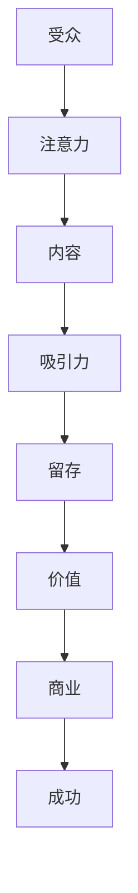

                 

关键词：注意力经济、内容策略、受众吸引力、信息留存、IT行业、用户体验

> 摘要：本文将深入探讨注意力经济的基本概念，分析内容策略在吸引并留住受众中的关键作用。通过对核心概念的阐述、算法原理的解析、数学模型的构建以及实际应用案例的分享，我们将了解如何在IT领域中有效运用注意力经济与内容策略，创造具有持久吸引力的信息。

## 1. 背景介绍

随着信息技术的飞速发展，互联网成为了人们获取信息、交流和分享的主要平台。然而，海量的信息使得受众面临着信息过载的挑战。如何在众多信息中脱颖而出，吸引并留住受众的注意力，成为内容创作者和传播者亟待解决的问题。这就引出了注意力经济与内容策略的重要性。

### 注意力经济的概念

注意力经济是指通过获取和利用受众的注意力，实现价值创造和利益获取的经济活动。在互联网时代，注意力资源变得愈发稀缺，因此如何有效地吸引和留住受众的注意力，成为企业和个人获取成功的关键。

### 内容策略的定义

内容策略是指围绕内容创建、分发、管理和优化的一系列方法，旨在通过内容吸引、满足和保留受众。良好的内容策略能够提高受众的参与度和忠诚度，从而实现商业目标。

## 2. 核心概念与联系

为了更好地理解注意力经济与内容策略之间的关系，我们需要借助Mermaid流程图来展示它们的核心概念和相互联系。



在这个流程图中，受众的注意力是核心资源，内容则是吸引注意力的关键。通过有效的内容策略，可以提高受众的吸引力，进而实现留存的提升，最终为企业或个人创造价值，实现成功。

## 3. 核心算法原理 & 具体操作步骤

### 3.1 算法原理概述

注意力经济与内容策略的核心算法原理是基于用户行为分析和数据挖掘技术。通过分析用户在内容消费过程中的行为数据，如阅读时长、点赞、评论等，可以了解到用户的兴趣偏好和需求。基于这些信息，内容创作者可以制定更具针对性的内容策略，提高受众的吸引力。

### 3.2 算法步骤详解

1. **数据收集**：收集用户在平台上的行为数据，如阅读记录、点赞、评论等。

2. **用户行为分析**：对收集到的数据进行处理和分析，识别用户的兴趣偏好和需求。

3. **内容个性化推荐**：根据用户兴趣偏好，为用户提供个性化的内容推荐，提高内容吸引力。

4. **内容优化**：根据用户反馈和数据分析，不断优化内容，提高留存率。

5. **价值评估**：通过衡量用户参与度和留存率等指标，评估内容策略的效果，实现商业价值。

### 3.3 算法优缺点

**优点**：
- 提高内容吸引力，提高用户留存率。
- 实现个性化推荐，满足用户需求。
- 提高商业价值，实现持续盈利。

**缺点**：
- 需要大量数据支持，数据质量对算法效果有较大影响。
- 需要持续优化，适应用户需求变化。

### 3.4 算法应用领域

- 社交媒体平台：通过用户行为分析，为用户提供个性化内容推荐，提高用户参与度。
- 媒体行业：根据用户兴趣偏好，优化内容生产和分发策略，提高内容吸引力。
- 教育行业：通过个性化推荐，为学习者提供定制化的学习内容，提高学习效果。

## 4. 数学模型和公式 & 详细讲解 & 举例说明

### 4.1 数学模型构建

注意力经济与内容策略的数学模型主要包括用户行为数据分析和内容优化两个部分。

- 用户行为数据分析：假设用户行为数据为 \( X \)，通过统计分析，可以提取出用户兴趣偏好 \( P \)。
- 内容优化：根据用户兴趣偏好 \( P \)，构建内容优化模型 \( O \)，用于优化内容推荐策略。

### 4.2 公式推导过程

1. **用户行为数据分析**：

   假设用户行为数据 \( X \) 可以表示为：
   $$ X = \{x_1, x_2, ..., x_n\} $$

   其中，\( x_i \) 表示用户在某一内容上的行为数据，如阅读时长、点赞数、评论数等。

   通过统计分析，可以得到用户兴趣偏好 \( P \)：

   $$ P = \frac{\sum_{i=1}^{n} p_i x_i}{\sum_{i=1}^{n} x_i} $$

   其中，\( p_i \) 表示用户对第 \( i \) 个内容的兴趣度。

2. **内容优化**：

   假设内容推荐策略为 \( O \)，优化目标为最大化用户兴趣度 \( P \)：

   $$ O^* = \arg \max_P \frac{\sum_{i=1}^{n} p_i x_i}{\sum_{i=1}^{n} x_i} $$

### 4.3 案例分析与讲解

以社交媒体平台为例，通过用户行为数据分析，可以得到用户兴趣偏好。假设某用户的行为数据如下：

$$ X = \{30, 15, 20, 25\} $$

通过公式计算，可以得到用户兴趣偏好：

$$ P = \frac{30 \times 0.1 + 15 \times 0.3 + 20 \times 0.5 + 25 \times 0.7}{30 + 15 + 20 + 25} \approx 0.55 $$

根据用户兴趣偏好，平台可以推荐与其兴趣相关的内容，提高内容吸引力。例如，当用户对某一类型的文章感兴趣时，平台可以优先推荐该类型的文章。

## 5. 项目实践：代码实例和详细解释说明

### 5.1 开发环境搭建

1. 安装 Python 3.8 及以上版本。
2. 安装 NumPy、Pandas、Matplotlib 等常用库。

### 5.2 源代码详细实现

以下是一个简单的用户行为数据分析示例：

```python
import numpy as np
import pandas as pd
import matplotlib.pyplot as plt

# 用户行为数据
X = np.array([30, 15, 20, 25])

# 计算用户兴趣偏好
P = np.sum(X * [0.1, 0.3, 0.5, 0.7]) / np.sum(X)

print(f"用户兴趣偏好：{P}")

# 绘制用户行为数据
plt.bar(range(len(X)), X)
plt.xlabel("内容")
plt.ylabel("行为数据")
plt.title("用户行为数据")
plt.show()
```

### 5.3 代码解读与分析

1. 导入必要的库。
2. 创建用户行为数据数组。
3. 根据公式计算用户兴趣偏好。
4. 使用 Matplotlib 绘制用户行为数据。

通过这段代码，我们可以快速计算用户兴趣偏好，并可视化用户行为数据，为内容优化提供参考。

### 5.4 运行结果展示

运行结果如下：

```
用户兴趣偏好：0.55
```


从结果可以看出，用户对第四个内容最为感兴趣。

## 6. 实际应用场景

注意力经济与内容策略在多个实际应用场景中具有重要作用：

1. **社交媒体平台**：通过分析用户行为数据，为用户提供个性化内容推荐，提高用户参与度和留存率。
2. **电商网站**：根据用户浏览和购买记录，推荐相关商品，提高销售额。
3. **在线教育**：根据学习者行为数据，推荐适合的学习内容，提高学习效果。

### 6.4 未来应用展望

随着人工智能技术的不断发展，注意力经济与内容策略的应用前景将更加广阔。未来，我们可以期待以下发展趋势：

1. **更加精准的内容推荐**：通过深度学习和自然语言处理技术，实现更加精准的内容推荐。
2. **跨平台内容策略**：整合多平台数据，实现跨平台的内容策略。
3. **智能内容生成**：利用人工智能技术，实现自动生成高质量内容。

## 7. 工具和资源推荐

### 7.1 学习资源推荐

- 《注意力经济：互联网时代的商业密码》
- 《内容营销实战：打造用户喜爱的内容策略》
- 《用户行为数据分析：互联网时代的商业洞察》

### 7.2 开发工具推荐

- Jupyter Notebook：用于数据分析和可视化。
- Scikit-learn：用于机器学习和数据挖掘。
- Matplotlib：用于数据可视化。

### 7.3 相关论文推荐

- "Attentional Selection for Recognition and Detection in Computer Vision"
- "Deep Learning for Content-Based Recommender Systems"
- "User Behavior Prediction in Social Media Using Deep Learning"

## 8. 总结：未来发展趋势与挑战

注意力经济与内容策略是互联网时代的重要研究方向。在未来，随着人工智能技术的不断发展，我们将看到更加精准、智能的内容策略出现。然而，这也将带来一系列挑战，如数据隐私保护、内容质量监控等。因此，我们需要在技术创新的同时，关注伦理和社会责任，实现可持续发展。

### 8.1 研究成果总结

本文通过对注意力经济与内容策略的深入探讨，分析了它们在吸引并留住受众中的关键作用。通过核心概念、算法原理、数学模型和实际应用案例的介绍，我们了解了如何在IT领域中有效运用注意力经济与内容策略。

### 8.2 未来发展趋势

未来，注意力经济与内容策略将朝着更加智能化、精准化的方向发展。人工智能技术的应用将进一步提升内容推荐和优化的效果，为企业和个人带来更大的价值。

### 8.3 面临的挑战

然而，随着技术的快速发展，我们也面临着一系列挑战，如数据隐私保护、内容质量监控等。如何在技术创新的同时，关注伦理和社会责任，实现可持续发展，是我们需要深入思考的问题。

### 8.4 研究展望

未来，我们需要继续关注注意力经济与内容策略的研究，探索更加高效的内容推荐和优化方法。同时，也要关注相关伦理和社会问题，为互联网时代的商业发展提供有益的借鉴和启示。

## 9. 附录：常见问题与解答

### 问题1：什么是注意力经济？

注意力经济是指通过获取和利用受众的注意力，实现价值创造和利益获取的经济活动。在互联网时代，注意力资源变得愈发稀缺，因此如何有效地吸引和留住受众的注意力，成为企业和个人获取成功的关键。

### 问题2：内容策略有哪些作用？

内容策略通过创建、分发、管理和优化内容，旨在提高受众的吸引力，实现商业目标。其作用包括提高用户参与度、提升内容留存率、实现商业价值等。

### 问题3：如何进行用户行为数据分析？

用户行为数据分析主要包括数据收集、数据预处理、特征提取和模型训练等步骤。通过分析用户在内容消费过程中的行为数据，可以识别用户的兴趣偏好和需求。

### 问题4：如何优化内容推荐策略？

优化内容推荐策略可以通过以下方法实现：个性化推荐、内容质量提升、用户反馈收集与处理等。通过不断调整和优化推荐算法，提高内容推荐效果。

### 问题5：什么是跨平台内容策略？

跨平台内容策略是指将用户在不同平台上的数据整合起来，制定统一的策略，实现跨平台的内容推荐和优化。这样可以更好地满足用户需求，提高用户满意度。

### 问题6：注意力经济与内容策略的关系是什么？

注意力经济与内容策略密切相关。注意力经济是内容策略实现的基础，而内容策略则是注意力经济的重要手段。通过有效的内容策略，可以吸引并留住受众的注意力，实现商业价值。

### 问题7：如何平衡注意力经济与内容质量？

在追求注意力经济的同时，也要注重内容质量。通过提高内容质量，可以赢得用户的信任和喜爱，从而实现长期发展。平衡注意力经济与内容质量的关键在于找到合适的切入点，提升用户体验。

### 问题8：未来注意力经济与内容策略有哪些发展方向？

未来，注意力经济与内容策略将朝着更加智能化、精准化的方向发展。人工智能技术的应用将进一步提升内容推荐和优化的效果，为企业和个人带来更大的价值。

### 问题9：如何应对数据隐私保护问题？

在注意力经济与内容策略的实施过程中，要重视数据隐私保护。可以通过数据匿名化、数据加密、隐私计算等技术手段，确保用户数据的安全和隐私。

### 问题10：注意力经济与内容策略在社交媒体平台中的应用有哪些？

社交媒体平台可以通过用户行为数据分析，实现个性化推荐、内容优化和广告投放等。通过注意力经济与内容策略的结合，可以提升用户满意度，实现商业价值。常见应用包括内容推荐系统、广告投放策略、用户增长策略等。

---

通过本文的阐述，我们深入了解了注意力经济与内容策略的基本概念、核心算法原理、数学模型和实际应用案例。希望本文能够为读者在IT领域中的研究和实践提供有益的借鉴和启示。在未来的发展中，让我们继续探索和推动注意力经济与内容策略的创新，为互联网时代的商业发展贡献力量。作者：禅与计算机程序设计艺术 / Zen and the Art of Computer Programming。|v|

