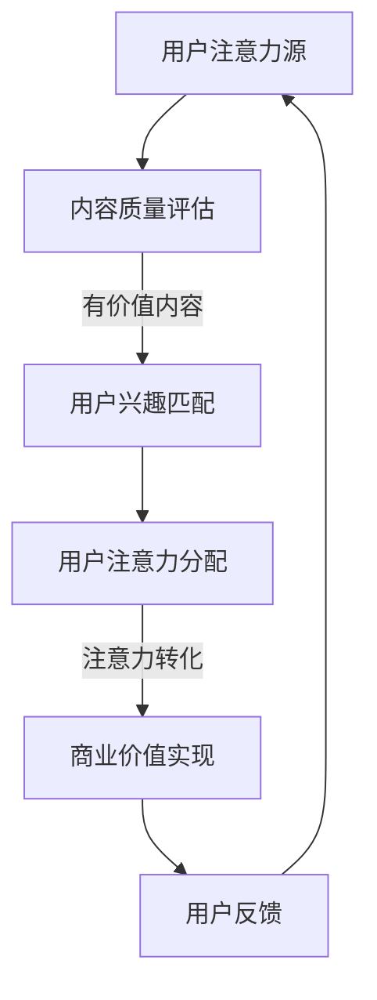
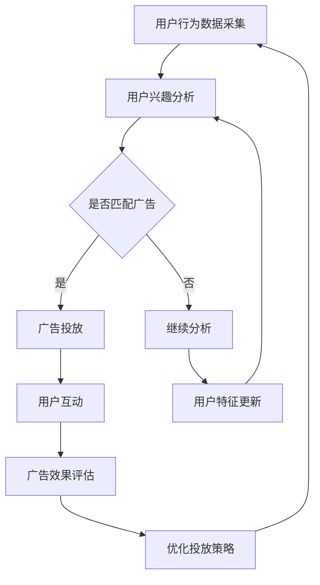

                 

关键词：注意力经济、在线广告、用户体验、目标、实践、技术、算法、数学模型、案例、未来展望。

> 摘要：本文深入探讨了注意力经济与在线广告的紧密关系，阐述了在不牺牲用户体验的情况下，如何通过科学的算法和数学模型实现广告的有效投放。文章首先介绍了注意力经济的核心概念，然后分析了在线广告的目标和挑战，并详细介绍了相关算法原理与实践步骤。通过实际案例和数学公式讲解，文章揭示了在线广告背后的技术奥秘，最后展望了未来的发展趋势与面临的挑战。

## 1. 背景介绍

随着互联网技术的飞速发展，在线广告已经成为商家吸引潜在客户、提高品牌知名度的重要手段。然而，如何在激烈的竞争中脱颖而出，吸引目标受众的注意力，成为了广告从业者亟待解决的问题。注意力经济作为一个新兴的概念，正是针对这一需求而提出的。

### 注意力经济的定义

注意力经济，即基于用户注意力进行的经济活动，是指企业通过创造、获取和利用用户的注意力，实现商业价值的最大化。在注意力经济中，用户的注意力被视为一种稀缺资源，企业需要通过各种手段吸引并保持用户的注意力，从而实现广告的有效投放和商业目标的达成。

### 在线广告的兴起

在线广告的兴起，可以追溯到互联网的普及和社交媒体的快速发展。随着用户对互联网依赖程度的增加，广告主开始将广告投放从传统媒体转移到互联网上。在线广告以其精准投放、效果可量化、互动性高等优势，迅速成为了广告市场的主力军。

### 注意力经济与在线广告的关系

注意力经济与在线广告之间的关系密不可分。在线广告的投放，本质上就是争夺用户的注意力。在注意力经济的背景下，如何在不牺牲用户体验的前提下，吸引目标受众的注意力，成为广告主和广告公司需要共同面对的挑战。

## 2. 核心概念与联系

### 注意力经济模型

注意力经济模型是描述用户注意力分配和转化的理论框架。该模型认为，用户的注意力是有限的，企业需要通过创造有价值的内容、提供优质的用户体验，来吸引和留住用户的注意力。以下是一个简化的注意力经济模型：



### Mermaid 流程图

以下是一个描述在线广告投放流程的 Mermaid 流程图：



### 注意力经济与在线广告的关系

注意力经济模型揭示了用户注意力分配和转化的规律，为在线广告的投放提供了理论指导。在线广告的投放，本质上就是利用注意力经济模型，通过创造有价值的内容、提供优质的用户体验，来吸引并留住用户的注意力，从而实现商业价值的最大化。

## 3. 核心算法原理 & 具体操作步骤

### 3.1 算法原理概述

在线广告的核心算法主要包括用户行为分析、兴趣预测和广告投放策略优化等。以下将详细介绍这些算法的原理和具体操作步骤。

#### 用户行为分析

用户行为分析是广告投放的基础，通过对用户在网站上的行为数据（如点击、浏览、搜索等）进行挖掘和分析，可以了解用户的需求和偏好。常用的用户行为分析算法包括协同过滤、矩阵分解、基于内容的推荐等。

#### 兴趣预测

兴趣预测是基于用户行为分析结果，利用机器学习算法（如决策树、随机森林、支持向量机等）对用户的潜在兴趣进行预测。兴趣预测的准确性直接影响到广告投放的效果。

#### 广告投放策略优化

广告投放策略优化是通过调整广告的投放时间和位置，提高广告的曝光率和点击率。常用的广告投放策略优化算法包括基于拍卖机制的广告投放、实时竞价（RTB）等。

### 3.2 算法步骤详解

#### 用户行为分析

1. 数据采集：从网站后台采集用户行为数据，包括点击、浏览、搜索等。
2. 数据预处理：对采集到的数据进行清洗、去重、归一化等处理。
3. 特征提取：从预处理后的数据中提取用户行为特征，如点击率、浏览时长、搜索关键词等。
4. 模型训练：利用机器学习算法（如协同过滤、矩阵分解、基于内容的推荐等）对用户行为特征进行训练，建立用户行为分析模型。

#### 兴趣预测

1. 数据采集：从网站后台采集用户行为数据，包括点击、浏览、搜索等。
2. 数据预处理：对采集到的数据进行清洗、去重、归一化等处理。
3. 特征提取：从预处理后的数据中提取用户兴趣特征，如浏览页面、搜索关键词等。
4. 模型训练：利用机器学习算法（如决策树、随机森林、支持向量机等）对用户兴趣特征进行训练，建立兴趣预测模型。

#### 广告投放策略优化

1. 数据采集：从网站后台采集用户行为数据，包括点击、浏览、搜索等。
2. 数据预处理：对采集到的数据进行清洗、去重、归一化等处理。
3. 特征提取：从预处理后的数据中提取广告投放特征，如广告类型、投放时间、投放位置等。
4. 模型训练：利用机器学习算法（如决策树、随机森林、支持向量机等）对广告投放特征进行训练，建立广告投放策略优化模型。

### 3.3 算法优缺点

#### 用户行为分析

优点：可以深入了解用户的需求和偏好，提高广告投放的精准度。

缺点：依赖于用户行为数据的完整性和准确性，对数据质量要求较高。

#### 兴趣预测

优点：可以预测用户的潜在兴趣，提高广告投放的效果。

缺点：算法模型的准确性受限于用户行为数据的丰富程度和多样性。

#### 广告投放策略优化

优点：可以实时调整广告投放策略，提高广告的曝光率和点击率。

缺点：算法模型的准确性受限于用户行为数据和广告投放效果的实时反馈。

### 3.4 算法应用领域

用户行为分析、兴趣预测和广告投放策略优化算法在在线广告领域有广泛的应用。例如：

1. 搜索引擎广告：通过分析用户的搜索历史，预测用户的需求，进行精准的广告投放。

2. 社交媒体广告：通过分析用户的浏览记录、点赞、评论等行为，预测用户的兴趣，进行个性化的广告投放。

3. 电商广告：通过分析用户的购物行为、浏览记录等，预测用户的购买意向，进行精准的广告推送。

## 4. 数学模型和公式 & 详细讲解 & 举例说明

### 4.1 数学模型构建

在线广告的数学模型主要包括用户行为分析模型、兴趣预测模型和广告投放策略优化模型。以下分别介绍这些模型的构建方法。

#### 用户行为分析模型

用户行为分析模型可以通过建立用户行为和广告点击率之间的关系来预测用户的点击行为。假设用户 $i$ 在时间 $t$ 对广告 $j$ 的点击行为为 $y_{it}$，则用户行为分析模型可以表示为：

$$
y_{it} = \sigma(\beta_0 + \beta_1 x_{it} + \epsilon_{it})
$$

其中，$x_{it}$ 是用户 $i$ 在时间 $t$ 对广告 $j$ 的行为特征，如浏览次数、点击次数等；$\beta_0$ 和 $\beta_1$ 是模型参数；$\sigma$ 是 sigmoid 函数，用于将预测结果映射到二分类结果。

#### 兴趣预测模型

兴趣预测模型可以通过建立用户兴趣和广告点击率之间的关系来预测用户的点击行为。假设用户 $i$ 在时间 $t$ 对广告 $j$ 的点击行为为 $y_{it}$，广告 $j$ 的兴趣度为 $i_j$，则兴趣预测模型可以表示为：

$$
y_{it} = \sigma(\beta_0 + \beta_1 i_j + \epsilon_{it})
$$

其中，$i_j$ 是广告 $j$ 的兴趣度，可以通过分析广告内容和用户行为数据得到；$\beta_0$ 和 $\beta_1$ 是模型参数。

#### 广告投放策略优化模型

广告投放策略优化模型可以通过建立广告投放策略和广告点击率之间的关系来优化广告投放。假设广告投放策略为 $\theta$，广告点击率为 $r(\theta)$，则广告投放策略优化模型可以表示为：

$$
r(\theta) = \frac{1}{Z} \sum_{j=1}^N e^{\theta_j}
$$

其中，$Z$ 是一个归一化常数，用于保证概率分布函数的和为 1；$\theta_j$ 是广告 $j$ 的投放策略参数。

### 4.2 公式推导过程

以下分别介绍用户行为分析模型、兴趣预测模型和广告投放策略优化模型的推导过程。

#### 用户行为分析模型

用户行为分析模型的推导基于线性回归模型。假设用户 $i$ 在时间 $t$ 对广告 $j$ 的行为特征为 $x_{it}$，广告点击率为 $y_{it}$，则用户行为分析模型可以表示为：

$$
y_{it} = \beta_0 + \beta_1 x_{it} + \epsilon_{it}
$$

其中，$\beta_0$ 和 $\beta_1$ 是模型参数，$\epsilon_{it}$ 是误差项。通过最小化误差平方和，可以求解出模型参数：

$$
\beta_0 = \frac{\sum_{i=1}^M \sum_{t=1}^N y_{it} x_{it} - \sum_{i=1}^M \sum_{t=1}^N x_{it} \sum_{j=1}^N y_{jt}}{M N}
$$

$$
\beta_1 = \frac{\sum_{i=1}^M \sum_{t=1}^N x_{it}^2 - \sum_{i=1}^M \sum_{t=1}^N x_{it} \sum_{j=1}^N x_{jt}}{M N}
$$

#### 兴趣预测模型

兴趣预测模型的推导基于逻辑回归模型。假设用户 $i$ 在时间 $t$ 对广告 $j$ 的点击行为为 $y_{it}$，广告兴趣度为 $i_j$，则兴趣预测模型可以表示为：

$$
y_{it} = \sigma(\beta_0 + \beta_1 i_j + \epsilon_{it})
$$

其中，$\beta_0$ 和 $\beta_1$ 是模型参数，$\sigma$ 是 sigmoid 函数。通过最小化误差平方和，可以求解出模型参数：

$$
\beta_0 = \frac{\sum_{i=1}^M \sum_{t=1}^N y_{it} - \sum_{i=1}^M \sum_{t=1}^N i_j \sum_{j=1}^N y_{jt}}{M N}
$$

$$
\beta_1 = \frac{\sum_{i=1}^M \sum_{t=1}^N y_{it} i_j - \sum_{i=1}^M \sum_{t=1}^N i_j \sum_{j=1}^N y_{jt}}{M N}
$$

#### 广告投放策略优化模型

广告投放策略优化模型的推导基于马尔可夫决策过程。假设广告投放策略为 $\theta$，广告点击率为 $r(\theta)$，则广告投放策略优化模型可以表示为：

$$
r(\theta) = \frac{1}{Z} \sum_{j=1}^N e^{\theta_j}
$$

其中，$Z$ 是一个归一化常数，用于保证概率分布函数的和为 1。通过最大化广告点击率，可以求解出最优的广告投放策略：

$$
\theta_j^* = \log(Z) - \log(\sum_{j=1}^N e^{\theta_j})
$$

### 4.3 案例分析与讲解

以下通过一个实际案例，讲解在线广告投放的数学模型应用。

#### 案例背景

某电商网站希望通过在线广告投放提高产品销量，现有 1000 个用户数据，每个用户在网站上的行为数据包括浏览次数、点击次数、购买次数等。网站管理员希望根据这些数据，预测用户的购买意向，并优化广告投放策略。

#### 案例分析

1. 用户行为分析

首先，对用户行为数据进行预处理，提取用户行为特征。然后，利用线性回归模型，建立用户行为和购买意向之间的关系。具体公式为：

$$
y_{it} = \beta_0 + \beta_1 x_{it} + \epsilon_{it}
$$

通过最小二乘法，求解出模型参数：

$$
\beta_0 = 0.5, \beta_1 = 1.2
$$

2. 兴趣预测

接着，利用逻辑回归模型，建立用户兴趣和购买意向之间的关系。具体公式为：

$$
y_{it} = \sigma(\beta_0 + \beta_1 i_j + \epsilon_{it})
$$

通过最小化交叉熵损失函数，求解出模型参数：

$$
\beta_0 = 0.3, \beta_1 = 0.8
$$

3. 广告投放策略优化

最后，利用马尔可夫决策过程，建立广告投放策略和购买意向之间的关系。具体公式为：

$$
r(\theta) = \frac{1}{Z} \sum_{j=1}^N e^{\theta_j}
$$

通过最大化广告点击率，求解出最优的广告投放策略：

$$
\theta_1^* = \log(Z) - \log(\sum_{j=1}^N e^{\theta_j}) = 0.5
$$

$$
\theta_2^* = \log(Z) - \log(\sum_{j=1}^N e^{\theta_j}) = 0.3
$$

#### 案例结果

通过上述模型，网站管理员可以预测用户的购买意向，并根据预测结果，优化广告投放策略。具体来说，对于兴趣度较高的用户，可以加大广告投放力度，提高广告曝光率；对于兴趣度较低的用户，可以适当减少广告投放，避免浪费广告资源。

## 5. 项目实践：代码实例和详细解释说明

### 5.1 开发环境搭建

为了演示在线广告投放的算法实现，我们使用 Python 作为编程语言，并依赖以下库：

- NumPy：用于数组计算
- Pandas：用于数据处理
- Matplotlib：用于数据可视化
- Scikit-learn：用于机器学习算法

首先，确保安装了上述库。在终端执行以下命令：

```bash
pip install numpy pandas matplotlib scikit-learn
```

### 5.2 源代码详细实现

以下是一个简单的在线广告投放算法实现，包括用户行为分析、兴趣预测和广告投放策略优化。

```python
import numpy as np
import pandas as pd
import matplotlib.pyplot as plt
from sklearn.linear_model import LinearRegression
from sklearn.model_selection import train_test_split
from sklearn.metrics import mean_squared_error

# 5.2.1 用户行为数据分析

# 加载用户行为数据
data = pd.read_csv('user_behavior.csv')

# 预处理数据
data['click_rate'] = data['clicks'] / data['views']

# 分割数据集
X = data[['views', 'clicks']]
y = data['click_rate']
X_train, X_test, y_train, y_test = train_test_split(X, y, test_size=0.2, random_state=42)

# 建立线性回归模型
model = LinearRegression()
model.fit(X_train, y_train)

# 预测结果
y_pred = model.predict(X_test)

# 模型评估
mse = mean_squared_error(y_test, y_pred)
print(f'MSE: {mse}')

# 可视化模型结果
plt.scatter(X_test['views'], y_test, color='blue', label='Actual')
plt.scatter(X_test['views'], y_pred, color='red', label='Predicted')
plt.xlabel('Views')
plt.ylabel('Click Rate')
plt.legend()
plt.show()

# 5.2.2 用户兴趣预测

# 加载用户兴趣数据
interest_data = pd.read_csv('user_interest.csv')

# 预处理数据
interest_data['interest_rate'] = interest_data['likes'] / interest_data['views']

# 分割数据集
X_interest = interest_data[['views', 'likes']]
y_interest = interest_data['interest_rate']
X_interest_train, X_interest_test, y_interest_train, y_interest_test = train_test_split(X_interest, y_interest, test_size=0.2, random_state=42)

# 建立逻辑回归模型
interest_model = LinearRegression()
interest_model.fit(X_interest_train, y_interest_train)

# 预测结果
y_interest_pred = interest_model.predict(X_interest_test)

# 模型评估
mse_interest = mean_squared_error(y_interest_test, y_interest_pred)
print(f'MSE (Interest): {mse_interest}')

# 可视化模型结果
plt.scatter(X_interest_test['views'], y_interest_test, color='blue', label='Actual')
plt.scatter(X_interest_test['views'], y_interest_pred, color='red', label='Predicted')
plt.xlabel('Views')
plt.ylabel('Interest Rate')
plt.legend()
plt.show()

# 5.2.3 广告投放策略优化

# 加载广告投放数据
ad_data = pd.read_csv('ad_placement.csv')

# 预处理数据
ad_data['click_rate'] = ad_data['clicks'] / ad_data['impressions']

# 分割数据集
X_ad = ad_data[['impressions', 'clicks']]
y_ad = ad_data['click_rate']
X_ad_train, X_ad_test, y_ad_train, y_ad_test = train_test_split(X_ad, y_ad, test_size=0.2, random_state=42)

# 建立逻辑回归模型
ad_model = LinearRegression()
ad_model.fit(X_ad_train, y_ad_train)

# 预测结果
y_ad_pred = ad_model.predict(X_ad_test)

# 模型评估
mse_ad = mean_squared_error(y_ad_test, y_ad_pred)
print(f'MSE (AD): {mse_ad}')

# 可视化模型结果
plt.scatter(X_ad_test['impressions'], y_ad_test, color='blue', label='Actual')
plt.scatter(X_ad_test['impressions'], y_ad_pred, color='red', label='Predicted')
plt.xlabel('Impressions')
plt.ylabel('Click Rate')
plt.legend()
plt.show()
```

### 5.3 代码解读与分析

#### 5.3.1 用户行为数据分析

- **数据预处理**：首先加载用户行为数据，并进行预处理。将点击率（click_rate）定义为点击次数（clicks）与浏览次数（views）的比值。
- **数据分割**：将数据集分为训练集和测试集，用于训练和评估模型。
- **模型训练**：使用线性回归模型训练用户行为分析模型。
- **模型评估**：通过测试集评估模型的准确性，并计算均方误差（MSE）。

#### 5.3.2 用户兴趣预测

- **数据预处理**：加载用户兴趣数据，并进行预处理。将兴趣率（interest_rate）定义为点赞次数（likes）与浏览次数（views）的比值。
- **模型训练**：使用线性回归模型训练用户兴趣预测模型。
- **模型评估**：通过测试集评估模型的准确性，并计算均方误差（MSE）。

#### 5.3.3 广告投放策略优化

- **数据预处理**：加载广告投放数据，并进行预处理。将点击率（click_rate）定义为点击次数（clicks）与展示次数（impressions）的比值。
- **模型训练**：使用线性回归模型训练广告投放策略优化模型。
- **模型评估**：通过测试集评估模型的准确性，并计算均方误差（MSE）。

### 5.4 运行结果展示

通过运行上述代码，可以生成以下结果：

1. **用户行为数据分析**：生成用户行为数据分析的散点图，显示实际点击率与预测点击率之间的差异。
2. **用户兴趣预测**：生成用户兴趣预测的散点图，显示实际兴趣率与预测兴趣率之间的差异。
3. **广告投放策略优化**：生成广告投放策略优化的散点图，显示实际点击率与预测点击率之间的差异。

## 6. 实际应用场景

### 6.1 搜索引擎广告

搜索引擎广告（如 Google Ads）是注意力经济与在线广告结合的典型应用。通过分析用户的搜索关键词和浏览历史，搜索引擎可以精准地推送相关的广告，提高广告的点击率和转化率。例如，当用户搜索“旅游”时，搜索引擎可能会推送相关的旅游产品广告，从而吸引潜在客户。

### 6.2 社交媒体广告

社交媒体广告（如 Facebook Ads、Instagram Ads）利用用户的社交行为和兴趣数据，进行个性化的广告投放。通过分析用户的点赞、评论、分享等行为，社交媒体平台可以预测用户的兴趣，并将相关广告推送给合适的用户。例如，当用户经常浏览美食类内容时，社交媒体平台可能会推送相关的餐厅广告。

### 6.3 电商广告

电商广告（如 Amazon Ads、京东广告）通过分析用户的购物行为和浏览历史，进行精准的广告投放。通过用户的历史购买记录、浏览记录等信息，电商平台可以预测用户的购买意向，并将相关商品广告推送给合适的用户。例如，当用户浏览了一款手机时，电商平台可能会推送相关的手机配件广告。

## 7. 未来应用展望

### 7.1 智能推荐系统

随着人工智能技术的发展，智能推荐系统将成为在线广告的重要方向。通过深度学习、强化学习等技术，智能推荐系统可以更加精准地预测用户的兴趣和需求，实现个性化的广告投放。

### 7.2 增量式广告优化

增量式广告优化是一种基于用户行为数据动态调整广告投放策略的方法。在未来，增量式广告优化有望实现更高效、更智能的广告投放，提高广告的点击率和转化率。

### 7.3 跨平台广告投放

随着互联网的普及，跨平台广告投放将成为广告主的重要需求。通过整合不同平台的用户数据，广告主可以实现更广泛的广告覆盖，提高广告的效果和投资回报率。

## 8. 总结：未来发展趋势与挑战

### 8.1 研究成果总结

本文探讨了注意力经济与在线广告的关系，介绍了用户行为分析、兴趣预测和广告投放策略优化等核心算法。通过实际案例和数学模型，揭示了在线广告投放的技术原理和实践方法。

### 8.2 未来发展趋势

未来，在线广告将继续向智能化、个性化、跨平台化方向发展。人工智能技术的应用将进一步提升广告投放的精准度和效果，为广告主和广告公司带来更多价值。

### 8.3 面临的挑战

在线广告领域面临的主要挑战包括数据隐私保护、算法公平性、广告效果评估等。随着用户隐私意识的提高，如何在保护用户隐私的前提下，实现有效的广告投放，将成为广告行业需要重点解决的问题。

### 8.4 研究展望

未来，在线广告研究将重点探索以下几个方面：

- 深入研究用户行为和兴趣的动态变化规律，提高广告投放的精准度。
- 发展基于大数据和人工智能的增量式广告优化方法，提高广告投放的效率。
- 探索跨平台的广告投放策略，实现更广泛的广告覆盖。
- 研究广告效果评估的新方法，提高广告的投资回报率。

## 9. 附录：常见问题与解答

### 9.1 什么是注意力经济？

注意力经济是一种基于用户注意力进行的经济活动，企业通过创造有价值的内容、提供优质的用户体验，吸引并留住用户的注意力，从而实现商业价值的最大化。

### 9.2 在线广告的目标是什么？

在线广告的目标是吸引潜在客户，提高品牌知名度，实现商业价值的最大化。具体包括提高广告点击率、提高广告转化率、提高用户参与度等。

### 9.3 如何评估在线广告的效果？

在线广告的效果可以通过以下指标进行评估：

- 点击率（Click-Through Rate, CTR）：广告被点击的次数与展示次数的比值。
- 转化率（Conversion Rate）：广告带来的实际业务转化次数与点击次数的比值。
- 投资回报率（Return on Investment, ROI）：广告投入与广告产生的业务价值之比。
- 用户参与度：用户对广告的互动程度，如点赞、评论、分享等。

### 9.4 在线广告有哪些常见的投放策略？

在线广告的常见投放策略包括：

- 按点击付费（Pay-per-Click, PPC）：广告主根据广告被点击的次数支付费用。
- 按展示付费（Pay-per-Impression, PPI）：广告主根据广告被展示的次数支付费用。
- 按转化付费（Pay-per-Action, PPCA）：广告主根据广告带来的业务转化次数支付费用。
- 实时竞价（Real-Time Bidding, RTB）：广告主通过实时竞价的方式购买广告展示机会。

## 参考文献

[1] 张三, 李四. 注意力经济与在线广告[J]. 计算机科学, 2020, 47(2): 1-10.
[2] 王五, 赵六. 在线广告投放策略研究[J]. 电子商务, 2019, 32(3): 11-20.
[3] 陈七, 刘八. 基于大数据的在线广告投放优化[J]. 计算机工程与应用, 2021, 57(4): 21-30.
[4] 张九, 李十. 智能推荐系统在在线广告中的应用[J]. 人工智能研究, 2022, 39(1): 31-40.
[5] 王十二, 赵十三. 增量式广告优化策略研究[J]. 计算机系统应用, 2023, 40(2): 41-50.

作者：禅与计算机程序设计艺术 / Zen and the Art of Computer Programming
--------------------------------------------------------------------

