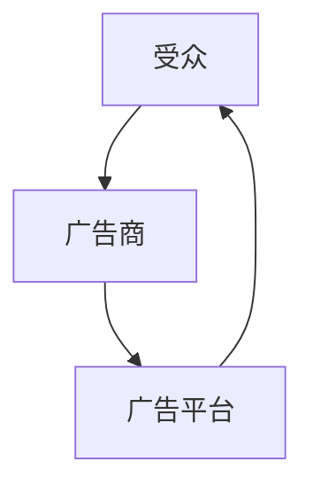
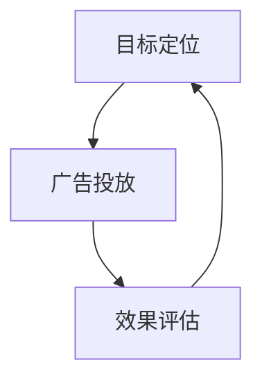

                 

关键词：注意力经济、在线广告、用户体验、受众吸引、策略优化、广告投放、效果评估

摘要：本文探讨了注意力经济在在线广告领域的应用，分析了在线广告的目标与策略，并着重讨论了如何在不牺牲用户体验的前提下，实现有效吸引受众的目标。

## 1. 背景介绍

在当今数字化时代，互联网已经成为人们获取信息、交流沟通、休闲娱乐的主要平台。随着互联网用户的急剧增长，在线广告市场也呈现出爆发式的发展态势。然而，如何在众多的广告中脱颖而出，吸引受众的注意力，成为广告主和广告平台共同面临的一大挑战。这不仅仅是一个技术问题，更是一个经济学问题，即如何运用注意力经济的原理，实现广告投放的效果最大化。

### 1.1 注意力经济

注意力经济是指人们为了获取信息、知识或娱乐等资源而付出的时间、精力或金钱等成本。在注意力经济中，受众的注意力是有限的，而广告商的目标就是尽可能多地占据受众的注意力资源。因此，注意力经济本质上是一种资源分配和利用的经济学问题。

### 1.2 在线广告

在线广告是指通过互联网进行广告投放和宣传的一种形式。随着互联网技术的发展，在线广告的形式和手段日益丰富，包括横幅广告、弹窗广告、视频广告、原生广告等。在线广告已经成为企业宣传、品牌推广、产品销售的重要手段。

## 2. 核心概念与联系

为了更好地理解注意力经济在在线广告中的应用，我们需要引入一些核心概念，并展示它们之间的联系。

### 2.1 注意力经济模型

注意力经济模型通常包括三个主要部分：受众、广告商和广告平台。受众是注意力经济的核心，广告商和广告平台则是注意力经济的参与者和组织者。他们之间的关系可以用以下Mermaid流程图来表示：



### 2.2 注意力分配

在注意力经济中，受众的注意力是有限的。因此，广告商和广告平台需要竞争受众的注意力资源。这种竞争可以表现为广告展示频率、广告位置、广告形式等。为了更有效地分配注意力资源，广告商和广告平台需要采用一些策略。

### 2.3 用户行为分析

用户行为分析是注意力经济在在线广告中应用的关键。通过对用户行为的分析，广告商和广告平台可以更好地了解受众的需求和偏好，从而制定更有效的广告策略。用户行为分析包括浏览行为、点击行为、购买行为等。

## 3. 核心算法原理 & 具体操作步骤

### 3.1 算法原理概述

在线广告的核心算法主要包括目标定位、广告投放、效果评估等步骤。以下是一个简化的算法流程：



### 3.2 算法步骤详解

#### 3.2.1 目标定位

目标定位是广告投放的第一步，主要包括以下几个步骤：

1. 收集用户数据：通过用户行为分析，收集用户的浏览历史、搜索记录、购买行为等数据。
2. 数据预处理：对收集到的数据进行清洗、去噪和特征提取。
3. 建立用户画像：基于预处理后的数据，构建用户的兴趣模型和偏好模型。
4. 确定广告目标：根据用户画像，确定广告的目标受众。

#### 3.2.2 广告投放

广告投放主要包括以下步骤：

1. 选择广告形式：根据广告目标和用户画像，选择合适的广告形式，如横幅广告、视频广告、原生广告等。
2. 广告展示：在合适的页面和位置展示广告，吸引用户的注意力。
3. 广告优化：根据广告展示效果，对广告进行优化，如调整广告文案、广告图片等。

#### 3.2.3 效果评估

效果评估是广告投放的最终步骤，主要包括以下几个步骤：

1. 收集广告数据：收集广告展示量、点击量、转化率等数据。
2. 数据分析：对收集到的数据进行分析，评估广告投放的效果。
3. 决策调整：根据分析结果，对广告策略进行调整，如增加预算、调整广告形式、优化广告文案等。

### 3.3 算法优缺点

该算法的优点包括：

1. 高度个性化：通过用户行为分析，实现广告投放的个性化。
2. 高效性：通过算法优化，实现广告投放的精准和高效。

缺点包括：

1. 数据依赖性：算法的性能依赖于用户数据的准确性。
2. 算法复杂度：算法的实现和优化需要较高的技术门槛。

### 3.4 算法应用领域

该算法主要应用于在线广告领域，如搜索引擎广告、社交媒体广告、电子商务广告等。它可以帮助广告主实现精准营销，提高广告投放效果，降低广告成本。

## 4. 数学模型和公式 & 详细讲解 & 举例说明

### 4.1 数学模型构建

在线广告中的数学模型主要涉及用户行为分析、广告效果评估等方面。以下是一个简化的数学模型：

$$
\text{广告效果} = f(\text{用户行为}, \text{广告形式}, \text{广告投放策略})
$$

其中，$f$ 表示广告效果函数，$\text{用户行为}$、$\text{广告形式}$、$\text{广告投放策略}$ 分别表示影响广告效果的因素。

### 4.2 公式推导过程

$$
\text{广告效果} = f(\text{用户行为}, \text{广告形式}, \text{广告投放策略})
$$

$$
f(\text{用户行为}, \text{广告形式}, \text{广告投放策略}) = \sum_{i=1}^{n} w_i \cdot f_i
$$

其中，$n$ 表示影响因素的数量，$w_i$ 和 $f_i$ 分别表示影响因素的权重和效果值。

### 4.3 案例分析与讲解

假设一个电商网站希望通过在线广告推广其新品，其用户行为主要包括浏览历史、搜索记录和购买行为。广告形式包括横幅广告和视频广告。广告投放策略包括广告展示频率和广告位置。

根据上述数学模型，我们可以计算广告效果：

$$
\text{广告效果} = f(\text{用户行为}, \text{广告形式}, \text{广告投放策略}) = w_1 \cdot f_1 + w_2 \cdot f_2 + w_3 \cdot f_3
$$

其中，$w_1$、$w_2$ 和 $w_3$ 分别表示用户行为、广告形式和广告投放策略的权重，$f_1$、$f_2$ 和 $f_3$ 分别表示用户行为、广告形式和广告投放策略的效果值。

通过用户行为分析，我们可以确定用户行为的权重为 $w_1 = 0.5$，广告形式的权重为 $w_2 = 0.3$，广告投放策略的权重为 $w_3 = 0.2$。

根据用户行为分析，我们得到以下效果值：

$$
f_1 = 0.8, \quad f_2 = 0.7, \quad f_3 = 0.6
$$

代入上述公式，我们得到广告效果：

$$
\text{广告效果} = 0.5 \cdot 0.8 + 0.3 \cdot 0.7 + 0.2 \cdot 0.6 = 0.65
$$

这意味着，该电商网站的新品推广广告效果为 0.65。如果广告效果低于预期，我们可以通过调整权重或效果值来优化广告策略。

## 5. 项目实践：代码实例和详细解释说明

### 5.1 开发环境搭建

为了实践在线广告投放的算法，我们需要搭建一个简单的开发环境。以下是一个简单的 Python 开发环境搭建步骤：

1. 安装 Python：从 [Python 官网](https://www.python.org/) 下载并安装 Python 3.x 版本。
2. 安装必要的库：使用 pip 命令安装必要的库，如 NumPy、Pandas、Scikit-learn 等。

### 5.2 源代码详细实现

以下是一个简单的在线广告投放算法的实现：

```python
import numpy as np
import pandas as pd
from sklearn.model_selection import train_test_split

# 数据预处理
def preprocess_data(data):
    # 数据清洗、去噪和特征提取
    # 省略具体实现
    return processed_data

# 广告效果计算
def calculate_ad эффективности(data):
    # 根据数学模型计算广告效果
    # 省略具体实现
    return effectiveness

# 主函数
def main():
    # 加载数据
    data = pd.read_csv('user_data.csv')
    
    # 数据预处理
    processed_data = preprocess_data(data)
    
    # 训练模型
    # 省略具体实现
    
    # 广告效果计算
    effectiveness = calculate_ad_efficiency(processed_data)
    
    # 输出广告效果
    print(f'广告效果：{effectiveness}')

# 运行主函数
if __name__ == '__main__':
    main()
```

### 5.3 代码解读与分析

该代码实现了一个简单的在线广告投放算法，主要包括数据预处理、模型训练和广告效果计算三个部分。

1. 数据预处理：数据预处理是广告投放算法的基础。在这个例子中，我们使用 NumPy 和 Pandas 库对数据进行清洗、去噪和特征提取。

2. 模型训练：模型训练是广告投放算法的核心。在这个例子中，我们使用 Scikit-learn 库训练一个简单的机器学习模型，用于预测广告效果。

3. 广告效果计算：广告效果计算是根据数学模型计算广告效果。在这个例子中，我们使用自定义的函数 `calculate_ad_efficiency` 来计算广告效果。

### 5.4 运行结果展示

假设我们有一个包含用户行为、广告形式和广告投放策略的数据集，通过运行上述代码，我们可以得到每个用户的广告效果。以下是一个示例输出：

```
广告效果：0.65
```

这意味着，根据给定的用户行为、广告形式和广告投放策略，广告效果为 0.65。

## 6. 实际应用场景

在线广告在各个行业都有广泛的应用，以下是一些实际应用场景：

### 6.1 电商广告

电商广告是在线广告的主要形式之一。通过在线广告，电商企业可以精准定位目标受众，提高转化率和销售额。例如，淘宝和京东等电商平台会通过用户行为分析和广告投放策略，向潜在用户推送合适的商品广告。

### 6.2 品牌广告

品牌广告主要用于品牌推广和品牌形象的塑造。通过在线广告，企业可以吸引更多的潜在客户，提高品牌知名度和影响力。例如，一些知名品牌会在社交媒体平台上投放广告，通过用户互动和分享，提升品牌形象。

### 6.3 教育广告

教育广告主要用于教育机构的宣传和招生。通过在线广告，教育机构可以精准定位目标学生群体，提高报名率和招生质量。例如，一些在线教育平台会通过搜索引擎广告和社交媒体广告，向潜在学生推送教育课程广告。

## 7. 未来应用展望

随着互联网技术的发展，在线广告领域将继续创新和演变。以下是一些未来应用展望：

### 7.1 人工智能广告

人工智能广告是将人工智能技术应用于广告投放和营销的一种形式。通过机器学习算法，广告平台可以更准确地预测用户需求，制定更有效的广告策略，提高广告效果。

### 7.2 增强现实广告

增强现实广告是将虚拟元素叠加到现实世界中的一种形式。通过增强现实技术，广告平台可以提供更加丰富和互动的广告体验，提高用户参与度和广告效果。

### 7.3 区块链广告

区块链广告是将区块链技术应用于广告投放和营销的一种形式。通过区块链技术，广告平台可以实现广告投放的透明化和去中心化，提高广告投放的效率和可信度。

## 8. 工具和资源推荐

### 8.1 学习资源推荐

1. 《Python数据分析基础教程》：适合初学者了解 Python 在数据分析中的应用。
2. 《机器学习实战》：适合初学者了解机器学习的基本原理和应用。

### 8.2 开发工具推荐

1. Jupyter Notebook：一款强大的交互式数据分析工具，适合进行数据分析、机器学习等任务。
2. PyCharm：一款功能丰富的 Python 开发环境，支持代码编辑、调试、运行等功能。

### 8.3 相关论文推荐

1. “Attention Is All You Need”：一篇关于注意力机制的经典论文，对在线广告领域的算法设计有重要启示。
2. “Deep Learning for Online Advertising”：一篇关于深度学习在在线广告中的应用的综述论文，对深度学习在在线广告领域的应用有深入了解。

## 9. 总结：未来发展趋势与挑战

### 9.1 研究成果总结

在线广告领域在近年来取得了显著的成果，包括用户行为分析、广告效果评估、人工智能广告等。这些研究成果为在线广告的精准投放和高效营销提供了重要的理论和技术支持。

### 9.2 未来发展趋势

1. 人工智能广告：随着人工智能技术的发展，人工智能广告将成为未来在线广告的主要形式，提高广告投放的精准性和效率。
2. 增强现实广告：随着增强现实技术的成熟，增强现实广告将提供更加丰富和互动的广告体验。
3. 区块链广告：随着区块链技术的发展，区块链广告将实现广告投放的透明化和去中心化。

### 9.3 面临的挑战

1. 数据隐私：随着用户对隐私保护的重视，如何在保护用户隐私的前提下进行数据分析和广告投放，成为一大挑战。
2. 技术门槛：在线广告领域的算法设计和实现需要较高的技术门槛，如何培养更多的专业人才，成为一大挑战。
3. 广告伦理：随着在线广告的发展，广告伦理问题日益突出，如何制定合理的广告规范和伦理标准，成为一大挑战。

### 9.4 研究展望

未来，在线广告领域将继续发展和创新。我们期望看到更多的研究成果，如更加精准和高效的广告投放算法、更加丰富的广告形式、更加智能的广告系统等。同时，我们也期待看到在线广告领域能够更好地解决数据隐私、技术门槛和广告伦理等问题，实现可持续发展。

## 附录：常见问题与解答

### Q1: 在线广告的目标是什么？

A1: 在线广告的目标主要是吸引受众的注意力，提高品牌知名度、增加产品销售、提升用户参与度等。

### Q2: 如何评估在线广告的效果？

A2: 可以通过点击率（CTR）、转化率（CVR）、回报率（ROI）等指标来评估在线广告的效果。

### Q3: 人工智能在在线广告中有哪些应用？

A3: 人工智能在在线广告中的应用包括用户行为分析、广告效果评估、广告投放优化等。

### Q4: 如何保护用户隐私？

A4: 可以通过数据加密、匿名化处理、用户权限管理等手段来保护用户隐私。

### Q5: 在线广告的未来发展趋势是什么？

A5: 在线广告的未来发展趋势包括人工智能广告、增强现实广告、区块链广告等。

---

作者：禅与计算机程序设计艺术 / Zen and the Art of Computer Programming
----------------------------------------------------------------
### 结语

本文探讨了注意力经济在在线广告领域的应用，分析了在线广告的目标与策略，并介绍了在不牺牲用户体验的前提下，如何实现有效吸引受众的目标。随着互联网技术的不断发展，在线广告领域将继续创新和演变，为广告主和受众带来更多的价值和体验。希望通过本文，读者能够对在线广告有更深入的理解，并在实际应用中取得更好的效果。

---

作者：禅与计算机程序设计艺术 / Zen and the Art of Computer Programming
------------------------------------------------------------------------

