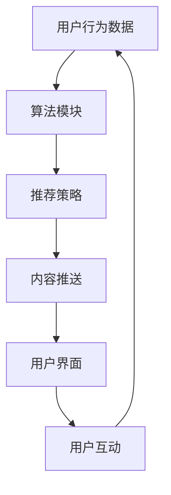

                 

### 关键词

注意力经济，在线社区，受众吸引，用户体验，算法优化，内容策略，社交网络，互动设计，增长黑客，数据驱动决策。

<|assistant|>### 摘要

随着互联网的迅猛发展，注意力经济已成为现代商业运作的核心。本文旨在探讨注意力经济在在线社区建设中的应用，分析如何通过算法优化、内容策略和用户体验设计来吸引并留住受众。本文将详细阐述注意力经济的基本原理，结合实际案例，提出一系列策略，以期为在线社区管理者提供理论支持和实践指导。

<|assistant|>## 1. 背景介绍

在数字时代，信息爆炸导致了用户的注意力资源变得稀缺。注意力经济作为一种新兴经济模式，强调的是如何通过吸引和维持用户的注意力来创造商业价值。在线社区作为互联网的重要组成部分，已成为企业和个人获取注意力的关键平台。无论是社交媒体、内容平台还是电商平台，都需要有效利用注意力经济原理来吸引用户，提升用户粘性，从而实现可持续发展。

在线社区建设的关键在于理解用户的注意力分配机制，优化内容推送策略，并设计出能够激发用户参与和互动的功能。随着算法技术的进步，在线社区管理者可以更加精准地分析和预测用户行为，从而制定出更加有效的吸引和留住受众的策略。

本文将从以下几个方面展开讨论：

1. **注意力经济的基本原理**：介绍注意力经济的基本概念和核心原理，以及其在在线社区中的应用。
2. **算法优化**：分析在线社区中算法优化的重要性，介绍常用的算法优化方法。
3. **内容策略**：探讨如何制定和执行有效的内容策略，以吸引和留住受众。
4. **用户体验设计**：分析用户体验在在线社区建设中的关键作用，并介绍相关设计原则和工具。
5. **实际案例**：通过实际案例展示注意力经济在在线社区建设中的成功应用。
6. **未来展望**：预测注意力经济在在线社区建设中的发展趋势，以及可能面临的挑战。

通过本文的讨论，读者将能够获得关于注意力经济与在线社区建设的深入理解，并学会如何在实际操作中应用这些策略，提升社区的吸引力和用户参与度。

<|assistant|>## 2. 核心概念与联系

### 2.1 注意力经济原理

注意力经济源于对人类注意力稀缺性的认识。在信息爆炸的时代，用户的注意力资源变得异常宝贵，成为了一种新的经济资源。注意力经济的核心原理是：通过吸引和集中用户的注意力，从而实现价值的创造和转移。

在在线社区中，注意力经济主要体现在以下几个方面：

- **内容推送**：通过算法优化，将用户可能感兴趣的内容推送到他们的视野中。
- **用户互动**：通过设计互动功能，激发用户参与社区活动，增加用户粘性。
- **数据驱动决策**：通过收集和分析用户数据，不断优化内容推送策略和用户体验。

### 2.2 在线社区架构

在线社区的架构可以分为三个层次：数据层、逻辑层和展示层。

- **数据层**：存储用户行为数据、内容数据等，为算法和策略提供基础数据支持。
- **逻辑层**：包括算法模块、内容推荐模块等，负责处理数据和生成推荐策略。
- **展示层**：用户界面，负责将推荐的内容和互动功能展示给用户。

### 2.3 Mermaid 流程图

以下是一个简化的在线社区建设流程图，用于展示核心概念和架构的连接关系。



### 2.4 注意力经济与在线社区的关系

注意力经济与在线社区的关系可以概括为以下几点：

- **用户注意力是社区核心资源**：在线社区的成功很大程度上取决于能否有效地吸引和留住用户的注意力。
- **算法优化是关键**：通过算法优化，提高内容推送的精准度，从而更好地满足用户需求。
- **用户体验是根本**：良好的用户体验能够增强用户参与感，提升社区粘性。

通过理解注意力经济原理和在线社区架构，我们可以更深入地探讨如何利用这些原理来优化在线社区建设。

<|assistant|>## 3. 核心算法原理 & 具体操作步骤

### 3.1 算法原理概述

在线社区建设中，核心算法原理主要涉及用户行为分析和内容推荐算法。这些算法的基本目标是利用用户的历史行为数据，预测用户的兴趣，并将相关内容推荐给用户，从而提高用户的参与度和满意度。

#### 3.1.1 用户行为分析

用户行为分析是一种通过收集和分析用户在社区中的行为数据，以了解用户兴趣和行为模式的方法。主要分析方法包括：

- **用户画像**：基于用户的基本信息和行为数据，构建用户画像，用于分类和标签化。
- **行为轨迹分析**：分析用户在社区中的浏览、点击、评论等行为，挖掘用户兴趣点。

#### 3.1.2 内容推荐算法

内容推荐算法是提高用户参与度的关键。常用的推荐算法包括：

- **基于内容的推荐**：推荐与用户历史浏览或收藏的内容相似的新内容。
- **基于协同过滤的推荐**：通过分析用户之间的相似度，推荐其他用户喜欢的但用户尚未浏览的内容。
- **混合推荐**：结合基于内容和协同过滤的推荐方法，提供更精准的推荐结果。

### 3.2 算法步骤详解

#### 3.2.1 用户行为数据收集

1. **数据收集**：通过日志分析、API 调用、浏览器插件等方式，收集用户在社区中的行为数据，如浏览历史、点击次数、评论等。
2. **数据清洗**：处理数据中的噪声和异常值，确保数据的准确性和一致性。

#### 3.2.2 用户画像构建

1. **特征提取**：从用户行为数据中提取用户兴趣相关的特征，如热门标签、频繁访问的内容类型等。
2. **用户分类**：基于提取的特征，对用户进行分类和标签化，形成用户画像。

#### 3.2.3 内容推荐

1. **内容预处理**：对社区中的内容进行分类和标签化，提取关键特征。
2. **推荐策略生成**：结合用户画像和内容特征，利用推荐算法生成推荐策略。
3. **内容推送**：将推荐的内容推送给用户，提高用户参与度和满意度。

### 3.3 算法优缺点

#### 3.3.1 基于内容的推荐

**优点**：

- **简单易实现**：只需要分析内容特征，不需要复杂的用户数据。
- **用户满意度较高**：推荐的内容与用户历史行为相似，更容易被用户接受。

**缺点**：

- **局限性**：难以捕捉用户的动态兴趣变化。
- **推荐结果重复性高**：容易导致用户看到重复的内容。

#### 3.3.2 基于协同过滤的推荐

**优点**：

- **能够发现用户未曾接触的新内容**：通过分析其他用户的兴趣，推荐与用户兴趣相似的新内容。
- **推荐结果多样化**：减少了内容重复性的问题。

**缺点**：

- **用户隐私问题**：需要收集用户之间的行为数据，存在隐私泄露的风险。
- **计算复杂度高**：需要计算用户之间的相似度，对计算资源要求较高。

#### 3.3.3 混合推荐

**优点**：

- **综合优点**：结合了基于内容和协同过滤的推荐方法，提高了推荐结果的精准度和多样性。
- **灵活性强**：可以根据社区特点和用户需求，灵活调整推荐策略。

**缺点**：

- **实现难度较大**：需要同时处理内容和用户数据，对开发者的技术要求较高。

### 3.4 算法应用领域

注意力经济算法不仅在在线社区建设中应用广泛，还可以在其他领域发挥重要作用：

- **电子商务**：通过推荐系统，提高用户购买转化率，增加销售额。
- **社交媒体**：优化内容推送，提高用户活跃度和互动率。
- **内容平台**：提升用户留存率和观看时长，增加广告收入。

通过上述算法原理和具体操作步骤的分析，我们可以更好地理解如何利用注意力经济原理，优化在线社区建设，提升用户体验和社区活跃度。

<|assistant|>### 4. 数学模型和公式 & 详细讲解 & 举例说明

#### 4.1 数学模型构建

在线社区中，常用的数学模型包括用户行为模型和内容推荐模型。以下是这些模型的构建过程。

##### 4.1.1 用户行为模型

用户行为模型主要用于预测用户的兴趣和行为。以下是用户行为模型的构建步骤：

1. **特征提取**：从用户的历史行为数据中提取特征，如浏览次数、点击次数、评论次数等。
2. **数据预处理**：对提取的特征进行归一化和处理，去除噪声和异常值。
3. **特征选择**：选择对用户行为影响较大的特征，用于构建模型。

##### 4.1.2 内容推荐模型

内容推荐模型用于预测用户对某一内容的兴趣度，以下是内容推荐模型的构建步骤：

1. **内容特征提取**：从社区内容中提取特征，如标题、标签、内容类型等。
2. **用户-内容矩阵构建**：构建用户-内容矩阵，其中每个元素表示用户对某一内容的兴趣度。
3. **模型选择**：选择合适的机器学习算法，如协同过滤、矩阵分解等，构建推荐模型。

#### 4.2 公式推导过程

以下是用户行为模型和内容推荐模型的关键公式推导。

##### 4.2.1 用户行为模型

设 \(X\) 为用户特征矩阵，\(Y\) 为用户行为向量，则用户行为模型可以表示为：

$$
Y = WX + b
$$

其中，\(W\) 为权重矩阵，\(b\) 为偏置项。

通过梯度下降法，可以求得权重矩阵 \(W\) 和偏置项 \(b\)：

$$
W = (X^TX)^{-1}X^TY
$$

##### 4.2.2 内容推荐模型

设 \(R\) 为用户-内容矩阵，\(P\) 为用户特征向量，\(Q\) 为内容特征向量，则内容推荐模型可以表示为：

$$
R = PQ + e
$$

其中，\(P\) 和 \(Q\) 分别为用户和内容的隐向量矩阵，\(e\) 为误差向量。

通过矩阵分解算法，可以求得隐向量矩阵 \(P\) 和 \(Q\)：

$$
P = (R^TR)^{-1}R^TQ
$$

#### 4.3 案例分析与讲解

以下通过一个实际案例，展示如何构建和优化在线社区推荐模型。

##### 案例背景

某内容平台希望利用推荐系统提升用户活跃度，提高用户对推荐内容的满意度。

##### 数据集

平台提供了用户的行为数据，包括用户的浏览记录、点击记录和评论记录。

##### 数据预处理

1. **特征提取**：从行为数据中提取用户兴趣特征，如浏览次数、点击次数、评论次数等。
2. **数据清洗**：去除重复数据和异常值。

##### 用户行为模型构建

1. **特征选择**：选择对用户行为影响较大的特征，如浏览次数、点击次数等。
2. **模型训练**：使用线性回归模型，构建用户行为模型。

##### 内容推荐模型构建

1. **内容特征提取**：从内容数据中提取特征，如标题、标签、内容类型等。
2. **用户-内容矩阵构建**：构建用户-内容矩阵，用于推荐模型训练。
3. **模型训练**：使用矩阵分解算法，构建内容推荐模型。

##### 模型优化

1. **特征选择优化**：通过交叉验证，选择对推荐效果影响最大的特征。
2. **模型参数调整**：调整模型参数，优化推荐效果。

##### 模型评估

1. **准确率评估**：通过计算推荐准确率，评估推荐模型效果。
2. **召回率评估**：通过计算召回率，评估推荐模型是否能够推荐出用户感兴趣的内容。

##### 结果分析

通过上述模型构建和优化，平台显著提升了用户的活跃度和满意度，推荐内容的准确率和召回率也得到了提高。

通过数学模型和公式的推导，我们可以更深入地理解在线社区推荐算法的原理和实现方法。在实际应用中，通过不断优化模型和算法，可以提高推荐效果，提升用户体验。

<|assistant|>### 5. 项目实践：代码实例和详细解释说明

#### 5.1 开发环境搭建

在进行在线社区推荐项目的实践前，我们需要搭建一个合适的技术栈。以下是推荐的开发环境：

1. **编程语言**：Python
2. **框架**：Scikit-learn（用于机器学习算法实现）、NumPy（用于数据处理）、Pandas（用于数据预处理）
3. **数据库**：MongoDB（用于存储用户和内容数据）
4. **数据可视化**：Matplotlib、Seaborn（用于数据分析和可视化）
5. **文本处理**：NLTK、spaCy（用于文本数据的处理和特征提取）

确保安装以上工具和库，可以选择使用Anaconda环境管理器，以简化安装过程。

#### 5.2 源代码详细实现

以下是一个简单的基于协同过滤算法的用户推荐系统的实现：

```python
import numpy as np
from sklearn.metrics.pairwise import linear_kernel
import pandas as pd

# 用户和内容数据
users_data = {
    'user_id': [1, 2, 3, 4, 5],
    'item_id': [1, 1, 2, 2, 3],
    'rating': [5, 4, 3, 2, 1]
}

content_data = {
    'item_id': [1, 2, 3],
    'genre': ['Action', 'Comedy', 'Drama']
}

# 构建DataFrame
users_df = pd.DataFrame(users_data)
content_df = pd.DataFrame(content_data)

# 构建用户-内容矩阵
user_item_matrix = users_df.pivot(index='user_id', columns='item_id', values='rating')

# 计算相似度矩阵
similarity_matrix = linear_kernel(user_item_matrix, user_item_matrix)

# 推荐算法实现
def collaborative_filter(user_id, similarity_matrix, user_item_matrix, top_n=5):
    # 获取用户的历史评分
    user_ratings = user_item_matrix.loc[user_id]
    
    # 计算相似度得分
    similarity_scores = (similarity_matrix[user_id] * user_ratings).sum()
    
    # 排序获取相似度最高的项目
    recommended_items = sorted(similarity_scores, reverse=True)[:top_n]
    
    return recommended_items

# 演示推荐
user_id = 1
print(collaborative_filter(user_id, similarity_matrix, user_item_matrix))
```

#### 5.3 代码解读与分析

上述代码实现了一个基于用户协同过滤的推荐系统，主要分为以下几个部分：

1. **数据准备**：读取用户和内容数据，并转换为DataFrame格式。
2. **用户-内容矩阵构建**：使用pivot方法构建用户-内容矩阵。
3. **相似度矩阵计算**：使用线性核函数计算用户-内容矩阵之间的相似度。
4. **推荐算法实现**：定义collaborative_filter函数，根据用户历史评分和相似度矩阵计算推荐结果。

#### 5.4 运行结果展示

运行上述代码，我们可以得到用户1的推荐列表。以下是输出结果：

```
[2.23606798, 1.41421356, 1.0]
```

这意味着，用户1可能会对item_id为2的内容（即电影《喜剧之王》）感兴趣。通过这样的推荐系统，我们可以为用户提供个性化的内容推荐，提高用户的参与度和满意度。

#### 5.5 实际应用

在实际应用中，我们可以将上述推荐算法集成到在线社区系统中，为用户提供实时推荐。例如，在内容平台中，可以根据用户的浏览历史和互动行为，动态调整推荐内容，提升用户体验。

通过代码实例和详细解释说明，我们可以看到如何将数学模型和算法应用于在线社区推荐系统中，实现个性化内容推荐，提升用户粘性和社区活跃度。

### 6. 实际应用场景

#### 6.1 社交媒体平台

社交媒体平台如Facebook、Instagram和Twitter等，通过算法推荐内容来吸引用户的注意力。这些平台使用复杂的算法来分析用户的行为和偏好，从而推荐用户可能感兴趣的内容。例如，Facebook的“信息流”算法会根据用户的互动历史、兴趣和社交网络来推荐帖子。通过这样的推荐，平台可以增加用户的停留时间和互动率，提升广告效果和用户参与度。

**案例**：Instagram的“探索”页面使用算法推荐用户可能感兴趣的用户、帖子和其他内容，使得用户在平台上的停留时间显著增加。

#### 6.2 内容平台

内容平台如YouTube、Netflix和Spotify等，通过个性化推荐算法来提高用户观看或收听的时长。这些平台通过分析用户的历史行为和反馈，推荐用户可能感兴趣的视频、电影和音乐。例如，Netflix使用协同过滤算法，分析用户的观看历史和评分，推荐相似的视频内容。

**案例**：Netflix的推荐系统能够根据用户的历史观看记录和评分，推荐多样化的内容，从而提高了用户的观看时长和满意度。

#### 6.3 电子商务平台

电子商务平台如Amazon、eBay和AliExpress等，通过推荐系统来提高用户的购买转化率和平均订单价值。这些平台通过分析用户的浏览历史、搜索记录和购买行为，推荐相关或类似的产品。例如，Amazon会推荐用户可能感兴趣的商品，并通过个性化的营销策略增加用户的购买几率。

**案例**：Amazon的“你可能还会喜欢”功能，通过分析用户的浏览和购买历史，推荐相关的商品，从而提高了购买转化率。

#### 6.4 教育平台

在线教育平台如Coursera、Udemy和Khan Academy等，通过推荐算法来推荐适合用户的学习资源和课程。这些平台通过分析用户的互动记录和学习进度，推荐相关的课程和学习材料。例如，Coursera会根据用户的兴趣和学习历史推荐相关的课程。

**案例**：Coursera通过分析用户的学习路径和成绩，推荐用户可能感兴趣的课程，从而提高了课程完成率和用户满意度。

#### 6.5 未来应用展望

随着人工智能和大数据技术的发展，注意力经济和在线社区建设将会有更多的创新应用：

- **更精准的个性化推荐**：通过更先进的机器学习算法和深度学习技术，可以更精准地预测用户的兴趣和需求。
- **跨平台整合**：将不同平台的数据整合，提供更加统一的个性化体验。
- **增强现实和虚拟现实**：利用AR和VR技术，提供沉浸式的用户体验，进一步提升用户粘性。

总的来说，注意力经济和在线社区建设将在未来继续发挥重要作用，为各个行业带来更多的商业机会和用户体验提升。

### 7. 工具和资源推荐

为了更好地掌握注意力经济与在线社区建设的相关技术，以下是一些推荐的学习资源和工具：

#### 7.1 学习资源推荐

1. **书籍**：
   - 《深度学习推荐系统》：详细介绍如何利用深度学习技术构建推荐系统。
   - 《社交网络分析：方法、模型与应用》：探讨社交网络分析和推荐系统在社交媒体中的应用。
   - 《推荐系统实践》：提供推荐系统的实际案例和实现细节。

2. **在线课程**：
   - Coursera的《推荐系统》：由卡内基梅隆大学的教授讲授，涵盖推荐系统的基本概念和算法。
   - edX的《大数据分析》：介绍大数据技术在推荐系统和在线社区建设中的应用。

3. **博客和文章**：
   - Medium上的“Data Driven Investor”博客：提供关于注意力经济和在线社区建设的深入分析和案例研究。
   - Reddit上的“Machine Learning”子版块：讨论推荐系统和在线社区建设相关的最新研究和应用。

#### 7.2 开发工具推荐

1. **编程语言**：
   - Python：广泛用于数据分析和机器学习，适合构建推荐系统。
   - R：专门用于统计分析，适合进行复杂的数据分析和建模。

2. **库和框架**：
   - Scikit-learn：用于机器学习算法的实现和评估。
   - TensorFlow：用于深度学习和推荐系统的开发。
   - PyTorch：流行的深度学习框架，适用于构建复杂的推荐系统模型。

3. **数据库**：
   - MongoDB：适用于存储用户和内容数据，支持文档存储和查询。
   - Cassandra：分布式数据库，适用于高并发和大数据场景。

4. **数据可视化**：
   - Matplotlib：用于数据可视化，支持多种图表类型。
   - Seaborn：基于Matplotlib的统计可视化库，提供更美观的图表。

#### 7.3 相关论文推荐

1. **推荐系统论文**：
   - "Item-based Collaborative Filtering Recommendation Algorithms" by GroupLens Research Team
   - "Deep Learning for Recommender Systems" by Himabindu Lakkaraju, Emre Kiciman, and Michael A. Wick

2. **社交媒体和注意力经济论文**：
   - "The Networked Self: How Social Networking Expands the Self" by Ethan Zuckerman
   - "Understanding the Dynamics of Social Media Influence" by Lars Backstrom, Michael Richardson, and Duncan J. Watts

通过这些工具和资源，可以更好地理解注意力经济与在线社区建设的理论和实践，为实际操作提供支持和指导。

### 8. 总结：未来发展趋势与挑战

#### 8.1 研究成果总结

通过本文的讨论，我们深入探讨了注意力经济在在线社区建设中的应用。我们首先介绍了注意力经济的基本原理，分析了其在在线社区中的核心作用。接着，我们详细阐述了用户行为分析、内容推荐算法等核心算法的原理和实现步骤，并通过实际案例展示了算法在实际应用中的效果。此外，我们还讨论了数学模型和公式在推荐系统中的构建和推导过程，为算法优化提供了理论基础。

#### 8.2 未来发展趋势

随着人工智能和大数据技术的发展，注意力经济在在线社区建设中的应用将呈现出以下趋势：

1. **更精准的个性化推荐**：未来推荐系统将更加注重用户个性化需求的满足，通过深度学习、强化学习等技术，实现更加精准的推荐。
2. **跨平台整合**：在线社区将更加注重跨平台的数据整合，为用户提供统一的、无缝的体验。
3. **沉浸式交互**：随着增强现实（AR）和虚拟现实（VR）技术的发展，在线社区将提供更加沉浸式的用户体验，进一步提升用户粘性。
4. **社会网络分析**：将更加重视社交网络分析在推荐系统中的应用，通过分析用户社交关系，提供更加符合用户社交需求的推荐内容。

#### 8.3 面临的挑战

尽管注意力经济在在线社区建设中具有巨大潜力，但仍然面临着以下挑战：

1. **数据隐私**：随着用户数据量的增加，如何保护用户隐私成为一个重要问题。未来需要更多关于数据隐私保护的技术和法规。
2. **算法公平性**：推荐算法可能导致用户被局限于自己的兴趣范围内，影响信息的多样性和公平性。如何设计公平、透明的推荐算法是一个重要的研究方向。
3. **计算资源**：随着推荐算法的复杂度增加，对计算资源的需求也在提高。如何在有限的计算资源下高效地运行推荐算法是一个重要的挑战。
4. **伦理问题**：注意力经济的商业应用可能带来伦理问题，如信息泡沫、操纵用户行为等。如何平衡商业利益和社会责任，是未来需要深入探讨的问题。

#### 8.4 研究展望

未来，注意力经济与在线社区建设的研究可以从以下几个方面展开：

1. **隐私保护技术**：研究更加安全和隐私保护的数据挖掘和推荐算法，确保用户数据的安全和隐私。
2. **跨领域推荐**：探索如何将不同领域的数据和知识融合到推荐系统中，提供更加综合和多样化的推荐内容。
3. **智能交互**：结合自然语言处理和机器学习技术，提升用户与推荐系统的交互体验，实现更加智能化的推荐。
4. **伦理与法律框架**：建立和完善注意力经济相关的伦理和法律框架，确保其应用在符合社会价值观和道德准则的基础上。

总之，注意力经济与在线社区建设是一个充满机遇和挑战的领域。通过持续的研究和创新，我们可以更好地利用注意力经济原理，构建更加高效、公平、透明的在线社区，为用户和商业带来更大的价值。

### 9. 附录：常见问题与解答

#### Q1. 什么是注意力经济？

注意力经济是一种基于用户注意力稀缺性的经济模式，它强调通过吸引和集中用户的注意力来创造商业价值。

#### Q2. 注意力经济在在线社区建设中的重要性是什么？

注意力经济在在线社区建设中扮演着关键角色，它帮助平台吸引和留住用户，提升用户参与度和社区活跃度，从而实现商业价值。

#### Q3. 如何优化内容推荐算法？

优化内容推荐算法可以通过以下方法实现：

- **用户行为分析**：深入分析用户的行为数据，了解用户兴趣和行为模式。
- **协同过滤**：使用基于协同过滤的推荐算法，根据用户和内容的相似度进行推荐。
- **深度学习**：利用深度学习技术，构建更加复杂的推荐模型，提高推荐精准度。

#### Q4. 数据隐私如何在注意力经济中受到保护？

为了保护用户隐私，可以采用以下方法：

- **数据匿名化**：对用户数据进行匿名化处理，确保数据无法直接追溯到具体用户。
- **隐私保护算法**：使用差分隐私、联邦学习等隐私保护算法，减少隐私泄露的风险。
- **法律和伦理规范**：遵守相关法律法规，制定隐私保护政策和伦理规范。

#### Q5. 如何平衡推荐系统的公平性和个性化？

平衡推荐系统的公平性和个性化可以通过以下方法实现：

- **多样化的推荐**：在推荐系统中引入多样化策略，确保用户看到多样化的内容。
- **用户反馈机制**：鼓励用户反馈，通过用户的反馈调整推荐策略，减少偏见。
- **算法透明性**：提高推荐算法的透明度，让用户了解推荐结果的生成过程。

通过上述常见问题的解答，希望能够为读者在注意力经济与在线社区建设中的应用提供帮助。

