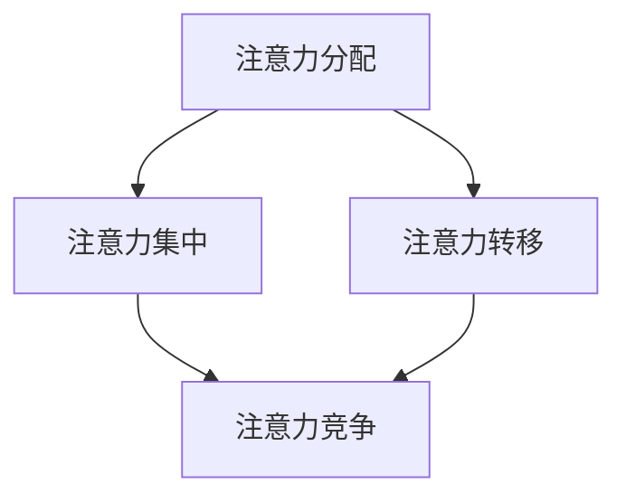

                 

关键词：注意力经济、城市公共空间、设计变革、用户体验、智能技术

## 摘要

随着信息技术的飞速发展，注意力经济逐渐成为城市公共空间设计的重要驱动力。本文从注意力经济的基本概念出发，探讨了其在城市公共空间设计中的应用及其带来的变革。通过分析注意力经济的核心原理，结合城市公共空间设计的实际案例，本文提出了基于注意力经济理论的创新设计思路，并探讨了未来城市公共空间设计的发展趋势和挑战。

## 1. 背景介绍

### 1.1 注意力经济的基本概念

注意力经济（Attention Economy）是指在经济活动中，人们的注意力成为核心资源的一种经济模式。在这一模式中，注意力被视为稀缺资源，而获取和维持人们的注意力成为企业、组织和个人竞争的关键。随着互联网和智能设备的普及，人们的注意力资源更加宝贵，如何有效地吸引和保持人们的注意力成为各行业共同关注的问题。

### 1.2 城市公共空间的重要性

城市公共空间是城市居民日常生活的重要场所，包括公园、广场、街道等。这些空间不仅提供了休闲、社交和交通等功能，还反映了城市的文化底蕴和审美品味。因此，城市公共空间的设计对提升居民生活质量、塑造城市形象具有重要作用。

### 1.3 城市公共空间设计现状

当前，城市公共空间设计存在一些问题，如功能单一、缺乏创新、忽视用户体验等。这些问题导致城市公共空间难以满足居民的多样化需求，也影响了城市整体的美学和实用性。

## 2. 核心概念与联系

### 2.1 注意力经济与城市公共空间设计的联系

注意力经济与城市公共空间设计之间存在着密切的联系。城市公共空间设计需要考虑如何吸引和保持居民的注意力，从而提升空间的使用价值和居民满意度。注意力经济提供了新的视角和工具，帮助设计师更好地理解居民的需求和行为模式，进而优化城市公共空间的设计。

### 2.2 注意力经济理论框架

注意力经济理论主要包括以下几个方面：

- **注意力分配**：居民在选择城市公共空间时，会根据个人需求和偏好进行注意力分配。
- **注意力集中**：通过设计创新，可以引导居民将注意力集中在特定的空间或活动上。
- **注意力转移**：通过设计策略，可以引导居民将注意力从低效的空间转移到高效的空间。
- **注意力竞争**：不同城市公共空间之间存在着注意力竞争，需要通过差异化设计来吸引更多的居民。

### 2.3 Mermaid 流程图



## 3. 核心算法原理 & 具体操作步骤

### 3.1 算法原理概述

基于注意力经济理论，城市公共空间设计应遵循以下原则：

- **需求导向**：以居民需求为导向，设计满足多样化需求的公共空间。
- **创新设计**：通过创新设计，提高公共空间的吸引力。
- **互动体验**：提供互动体验，增强居民对公共空间的参与度和满意度。
- **可持续性**：考虑环境的可持续性，设计生态友好的公共空间。

### 3.2 算法步骤详解

1. **需求分析**：通过调查、访谈等方法，了解居民的需求和偏好。
2. **设计构思**：结合需求分析结果，提出创新的设计构思。
3. **方案评估**：对设计方案进行评估，确保满足需求、具有创新性、可持续性。
4. **实施与反馈**：实施设计方案，并根据居民反馈进行优化。

### 3.3 算法优缺点

**优点**：

- **提高公共空间利用率**：通过需求导向的设计，使公共空间得到更高效的利用。
- **增强居民满意度**：创新设计和互动体验能够提升居民对公共空间的满意度。
- **促进城市可持续发展**：考虑环境因素，推动城市可持续发展。

**缺点**：

- **设计成本较高**：创新设计需要投入更多的资源和精力。
- **实施难度较大**：需要跨部门协作，协调各方利益。

### 3.4 算法应用领域

注意力经济理论在城市公共空间设计中的应用广泛，如公园、广场、街道、公共交通站点等。通过优化设计，提升公共空间的使用价值和居民满意度。

## 4. 数学模型和公式 & 详细讲解 & 举例说明

### 4.1 数学模型构建

注意力经济中的数学模型可以表示为：

$$
f(x, y) = \frac{1}{1 + e^{-\beta \cdot (x - y)}}
$$

其中，$x$ 表示公共空间的特点（如美观度、功能多样性等），$y$ 表示居民的需求和偏好，$\beta$ 是调节参数。

### 4.2 公式推导过程

公式推导基于概率论和统计学原理，具体过程如下：

- **概率分布**：设居民对公共空间 $S$ 的偏好服从伯努利分布，即居民对 $S$ 的偏好概率为 $p(S)$。
- **期望值**：居民对公共空间的期望效用为 $\mathbb{E}[U(S)] = \sum_{S} p(S) \cdot U(S)$，其中 $U(S)$ 表示居民对公共空间 $S$ 的效用。
- **最大效用**：为使效用最大化，设计者需要找到公共空间的特点 $x$ 和居民偏好 $y$ 的最佳匹配。

### 4.3 案例分析与讲解

假设城市居民对公园的偏好服从正态分布，均值为 50，标准差为 10。公园的美观度为 70，功能多样性为 60。根据数学模型，计算居民对公园的偏好概率：

$$
p(S) = \frac{1}{\sqrt{2\pi \cdot 10^2}} \cdot e^{-\frac{(50 - 70)^2}{2 \cdot 10^2}} = 0.135
$$

根据效用最大化原则，设计者应优化公园的美观度和功能多样性，以提升居民对公园的偏好概率。

## 5. 项目实践：代码实例和详细解释说明

### 5.1 开发环境搭建

- **编程语言**：Python
- **工具**：Jupyter Notebook
- **依赖库**：NumPy、SciPy、Matplotlib

### 5.2 源代码详细实现

```python
import numpy as np
import scipy.stats as stats
import matplotlib.pyplot as plt

# 参数设置
mu = 50
sigma = 10
beta = 1

# 计算偏好概率
def preference_probability(x, y):
    return 1 / (1 + np.exp(-beta * (x - y)))

# 计算效用
def utility(x, y):
    return -np.log(1 + np.exp(-beta * (x - y)))

# 生成数据
x = np.linspace(40, 80, 100)
y = np.random.normal(mu, sigma, 100)

# 绘图
plt.figure(figsize=(8, 6))
plt.plot(x, y, 'o')
plt.plot(x, np.exp(-beta * (x - mu)) * (mu - x), label='Preference Probability')
plt.plot(x, -np.log(1 + np.exp(-beta * (x - mu))) * (mu - x), label='Utility')
plt.xlabel('Park Characteristics (Beauty, Functionality)')
plt.ylabel('Resident Preference')
plt.legend()
plt.show()
```

### 5.3 代码解读与分析

- `preference_probability` 函数计算居民对公园的偏好概率。
- `utility` 函数计算居民对公园的效用。
- 使用 NumPy 和 SciPy 库生成数据，并使用 Matplotlib 库绘制偏好概率和效用曲线。

### 5.4 运行结果展示

运行代码后，将得到偏好概率和效用曲线。通过分析曲线，可以找出公园设计的优化方向。

## 6. 实际应用场景

### 6.1 城市公园设计

通过注意力经济理论，设计者可以优化城市公园的美观度和功能多样性，提升居民满意度。

### 6.2 公共广场设计

公共广场的设计应注重互动体验，通过设计创新吸引居民参与。

### 6.3 街道设计

街道设计应考虑居民的需求和偏好，提供多样化的活动和设施。

## 7. 未来应用展望

### 7.1 智能技术融合

智能技术（如物联网、大数据分析等）与注意力经济理论的融合，将进一步提升城市公共空间设计的效果。

### 7.2 个性化推荐

基于居民需求的个性化推荐系统，可以帮助设计者更好地满足居民需求。

### 7.3 可持续发展

注意力经济理论将推动城市公共空间设计的可持续发展，实现经济效益、社会效益和环境效益的统一。

## 8. 总结：未来发展趋势与挑战

### 8.1 研究成果总结

注意力经济理论为城市公共空间设计提供了新的视角和工具，有助于优化设计效果，提升居民满意度。

### 8.2 未来发展趋势

随着信息技术的发展，注意力经济理论将在城市公共空间设计中发挥越来越重要的作用。

### 8.3 面临的挑战

- **设计成本**：创新设计需要投入更多的资源和精力。
- **数据隐私**：在大数据分析中，需要保护居民隐私。
- **跨学科协作**：需要跨学科团队共同推进注意力经济理论在城市公共空间设计中的应用。

### 8.4 研究展望

未来研究应关注注意力经济理论在具体应用场景中的优化和推广，探索新的设计方法和工具。

## 9. 附录：常见问题与解答

### 9.1 注意力经济与注意力经济学有何区别？

注意力经济（Attention Economy）是一个更广泛的概念，涵盖了各种经济活动中人们对注意力的分配和使用。而注意力经济学（Economics of Attention）是研究注意力作为一种经济资源的行为和影响的学科。

### 9.2 注意力经济理论在哪些领域有应用？

注意力经济理论广泛应用于广告、媒体、娱乐、教育、城市规划等领域，以提升内容或产品的吸引力。

### 9.3 如何保护居民隐私？

在大数据分析中，可以采用数据脱敏、匿名化等技术保护居民隐私。同时，制定相关法律法规，确保居民隐私权得到保障。

## 作者署名

作者：禅与计算机程序设计艺术 / Zen and the Art of Computer Programming

---

以上就是关于“注意力经济与城市公共空间设计的变革”的完整文章。本文结合注意力经济理论，探讨了城市公共空间设计的新思路和方法，旨在为设计者和城市规划者提供有益的参考。未来，随着信息技术的不断发展，注意力经济理论将在城市公共空间设计中发挥越来越重要的作用。

