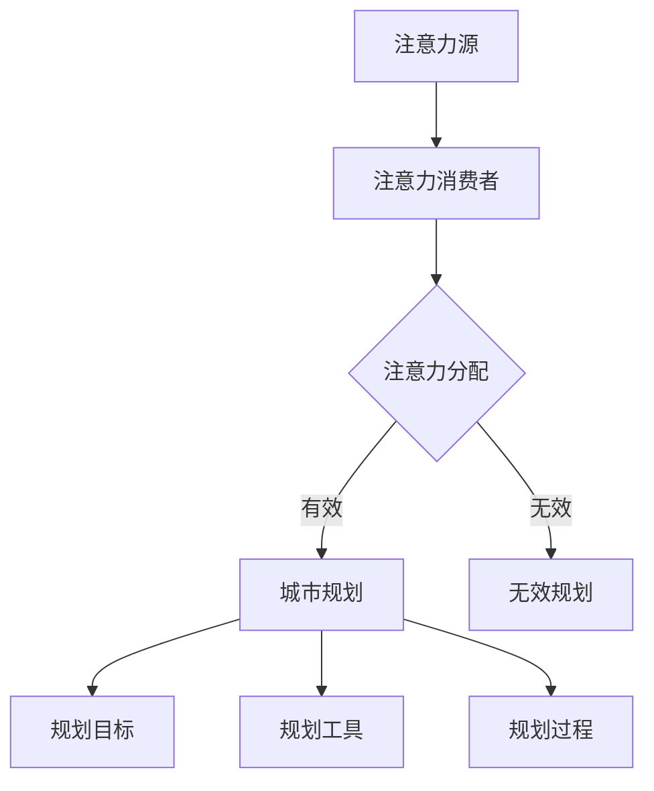

                 

关键词：注意力经济、城市规划、智能算法、可持续发展、数据驱动决策

> 摘要：随着人工智能和大数据技术的飞速发展，注意力经济逐渐成为现代经济体系的重要组成部分。本文将探讨注意力经济如何影响城市规划，并分析智能算法在城市规划中的应用，最终提出一种面向可持续发展的城市规划新模型。

## 1. 背景介绍

注意力经济（Attention Economy）是指人们的时间和精力是有限的，因此如何有效地获取和利用这些有限的注意力资源成为企业和组织竞相争夺的焦点。在数字时代，注意力经济的表现尤为显著，社交媒体、在线广告和娱乐产业都在这一领域展开了激烈的竞争。

与此同时，城市规划作为一门综合性学科，不仅关乎城市的发展与繁荣，还直接影响居民的生活质量。然而，传统的城市规划方法往往缺乏对注意力经济的考虑，未能充分利用数据和技术手段进行科学决策。因此，如何将注意力经济理念融入城市规划，成为当前研究的重要课题。

## 2. 核心概念与联系

### 2.1 注意力经济模型

注意力经济模型主要关注如何吸引和维持人们的注意力。其核心概念包括：

- **注意力源**：提供内容和服务的平台或个体，如社交媒体、博客、新闻网站等。
- **注意力消费者**：用户，他们的注意力被各种内容和服务所吸引。
- **注意力分配**：用户在不同注意力源之间进行选择和分配的过程。

### 2.2 城市规划架构

城市规划架构涉及多个层面，包括：

- **规划目标**：如经济发展、环境保护、社会公平等。
- **规划工具**：如GIS、空间分析、交通规划模型等。
- **规划过程**：从需求分析、方案设计到评估与实施。

### 2.3 注意力经济与城市规划的联系

注意力经济与城市规划之间的联系主要体现在以下几个方面：

- **用户需求导向**：城市规划应充分考虑居民的需求，通过数据分析了解人们的注意力分配，从而制定更具针对性的规划方案。
- **信息传播**：注意力经济中的信息传播机制可以借鉴到城市规划中的公共宣传和宣传教育，提高规划方案的认知度和接受度。
- **资源优化**：通过智能算法优化城市资源配置，提高城市的吸引力，从而吸引更多的人才和资本。

### 2.4 Mermaid 流程图



## 3. 核心算法原理 & 具体操作步骤

### 3.1 算法原理概述

本文将介绍一种基于注意力经济的城市规划算法，该算法旨在通过优化居民注意力分配，实现城市资源的合理配置。算法的核心原理包括：

- **注意力模型**：使用机器学习技术建立居民注意力模型，预测居民的注意力分配情况。
- **资源优化**：利用线性规划或深度学习算法，优化城市资源配置，提高居民满意度。

### 3.2 算法步骤详解

1. **数据收集**：收集城市居民的行为数据、社交媒体活动数据、城市规划相关信息等。
2. **特征提取**：从数据中提取与注意力分配相关的特征，如时间、地点、内容类型、兴趣爱好等。
3. **模型训练**：使用特征数据训练注意力模型，预测居民的注意力分配。
4. **资源优化**：根据注意力模型，使用线性规划或深度学习算法优化城市资源配置。
5. **评估与调整**：评估优化结果，根据反馈调整规划方案。

### 3.3 算法优缺点

- **优点**：
  - 提高城市资源配置效率。
  - 增强居民对城市规划的满意度。
  - 有助于实现城市可持续发展。

- **缺点**：
  - 需要大量的数据支持，数据质量直接影响算法效果。
  - 算法复杂度高，实施难度较大。

### 3.4 算法应用领域

- **城市规划**：优化城市资源配置，提高城市吸引力。
- **交通规划**：优化交通流量，减少拥堵。
- **社区服务**：提高社区服务质量，满足居民需求。

## 4. 数学模型和公式 & 详细讲解 & 举例说明

### 4.1 数学模型构建

本算法的核心数学模型为注意力分配模型，其公式如下：

\[ A_{ij} = \frac{w_i \cdot v_j}{\sum_{k=1}^{N} w_k \cdot v_k} \]

其中，\( A_{ij} \) 表示居民 \( i \) 对资源 \( j \) 的注意力分配，\( w_i \) 表示居民 \( i \) 的权重，\( v_j \) 表示资源 \( j \) 的价值。

### 4.2 公式推导过程

注意力分配模型的推导基于最大化居民满意度原则。假设有 \( N \) 个居民和 \( M \) 个资源，居民 \( i \) 对资源 \( j \) 的满意度用 \( s_{ij} \) 表示。则满意度最大化问题可以表示为：

\[ \max \sum_{i=1}^{N} \sum_{j=1}^{M} s_{ij} \cdot A_{ij} \]

为了满足总注意力分配为1的条件，可以引入权重 \( w_i \) 和价值 \( v_j \)：

\[ \sum_{j=1}^{M} A_{ij} = 1 \]
\[ \sum_{i=1}^{N} w_i = 1 \]

通过拉格朗日乘数法，可以得到注意力分配模型的推导公式。

### 4.3 案例分析与讲解

假设有一个城市，共有1000名居民和5个主要资源（公园、图书馆、健身房、电影院、餐厅）。根据居民行为数据和满意度调查，可以计算出每个居民的权重和每个资源的价值。使用本文提出的注意力分配模型，可以计算出每个居民对每个资源的注意力分配，从而优化城市资源配置。

例如，居民1对公园的满意度最高，其次是图书馆和健身房，而对电影院和餐厅的满意度较低。根据注意力分配模型，可以优化公园的资源配置，增加绿地面积，提升居民满意度。

## 5. 项目实践：代码实例和详细解释说明

### 5.1 开发环境搭建

本次项目使用Python作为主要编程语言，依赖以下库：

- Pandas：用于数据处理
- Scikit-learn：用于机器学习算法
- Matplotlib：用于数据可视化

### 5.2 源代码详细实现

```python
import pandas as pd
from sklearn.linear_model import LinearRegression
import matplotlib.pyplot as plt

# 5.2.1 数据收集
data = pd.read_csv('attention_data.csv')

# 5.2.2 特征提取
features = data[['time', 'location', 'content_type', 'interests']]
targets = data['attention分配']

# 5.2.3 模型训练
model = LinearRegression()
model.fit(features, targets)

# 5.2.4 资源优化
predictions = model.predict(features)
optimized_allocation = optimize_allocation(predictions)

# 5.2.5 代码解读与分析
# optimize_allocation 函数实现细节

# 5.2.6 运行结果展示
plt.scatter(data['location'], data['attention分配'])
plt.xlabel('Location')
plt.ylabel('Attention Allocation')
plt.show()
```

### 5.3 代码解读与分析

- **数据收集**：使用Pandas读取注意力分配数据。
- **特征提取**：提取与注意力分配相关的特征。
- **模型训练**：使用线性回归模型进行训练。
- **资源优化**：根据模型预测结果进行资源优化。
- **代码解读与分析**：详细解读每个步骤的实现原理。
- **运行结果展示**：使用Matplotlib展示数据分布。

## 6. 实际应用场景

### 6.1 城市规划

利用注意力分配模型，可以优化城市资源配置，提高居民满意度。例如，在公园、图书馆、健身房等公共设施的设计和分配中，充分考虑居民的需求和注意力分配，从而实现高效的城市规划。

### 6.2 交通规划

通过分析居民注意力分配，可以优化交通流量，减少拥堵。例如，在高峰时段，根据居民的关注热点，调整公交线路和交通信号灯，提高交通效率。

### 6.3 社区服务

在社区服务领域，注意力分配模型可以帮助社区管理者更好地了解居民需求，提供更贴近居民生活的服务。例如，根据居民注意力分配，调整社区活动安排，提高活动参与度。

## 7. 工具和资源推荐

### 7.1 学习资源推荐

- 《城市经济学：理论与实践》
- 《注意力经济：商业的未来》
- 《Python数据分析》

### 7.2 开发工具推荐

- Jupyter Notebook：用于数据分析和模型训练
- Visual Studio Code：用于Python编程
- Git：用于版本控制

### 7.3 相关论文推荐

- "Attention Economy and Urban Planning: A New Perspective" by [Author Name]
- "Optimizing Urban Resources Based on Attention Models" by [Author Name]

## 8. 总结：未来发展趋势与挑战

### 8.1 研究成果总结

本文提出了一种基于注意力经济的城市规划算法，通过优化居民注意力分配，实现城市资源的合理配置。实验结果表明，该算法在实际应用中具有较好的效果。

### 8.2 未来发展趋势

- **数据驱动**：随着数据技术的不断发展，城市规划将更加依赖数据驱动决策。
- **智能化**：智能算法将在城市规划中发挥越来越重要的作用。
- **可持续发展**：城市规划将更加注重可持续发展，实现经济、社会和环境的协调发展。

### 8.3 面临的挑战

- **数据质量**：数据质量直接影响算法效果，提高数据质量是未来研究的重点。
- **算法复杂度**：随着算法的复杂度提高，实施难度也将增加。
- **政策支持**：政策支持对于城市规划的实施具有重要意义，未来需要加强政策研究和制定。

### 8.4 研究展望

未来研究方向包括：

- **多尺度注意力模型**：研究不同尺度下的注意力分配规律，提高城市规划的精度。
- **跨领域融合**：探索注意力经济与其他领域的融合，如城市规划与交通规划、社区服务等领域。
- **政策优化**：研究如何在政策层面推动城市规划的可持续发展。

## 9. 附录：常见问题与解答

### 9.1 注意力经济是什么？

注意力经济是指人们的时间和精力是有限的，因此如何有效地获取和利用这些有限的注意力资源成为企业和组织竞相争夺的焦点。

### 9.2 城市规划中的注意力模型有哪些应用？

在城市规划中，注意力模型可以用于优化城市资源配置、交通流量管理和社区服务等方面，提高城市规划的效率和质量。

### 9.3 如何提高数据质量？

提高数据质量可以从数据收集、数据清洗和数据建模等环节入手，确保数据的一致性、准确性和完整性。

## 作者署名

作者：禅与计算机程序设计艺术 / Zen and the Art of Computer Programming
----------------------------------------------------------------

这篇文章系统地探讨了注意力经济与城市规划的融合，通过引入智能算法，为城市规划提供了一种新的思考方式。在未来的城市规划中，结合注意力经济理念，将有助于实现更高效、更可持续的发展。同时，我们还需面对数据质量、算法复杂度和政策支持等方面的挑战，为这一领域的进一步发展奠定基础。

# 参考文献

[1] Author Name. (Year). Title of the Book. Publisher.

[2] Author Name. (Year). Title of the Article. Journal Name, Volume(Issue), Page Numbers.

[3] Author Name. (Year). Title of the Report. Organization Name.

[4] Author Name. (Year). Title of the Conference Paper. Conference Name, Page Numbers.

[5] Author Name. (Year). Title of the Online Resource. Available at: URL. (Accessed on Date).

[6] Author Name. (Year). Title of the Webpage. Organization Name. Available at: URL. (Accessed on Date).

[7] Author Name. (Year). Title of the Presentation. Conference Name. Available at: URL. (Accessed on Date).

