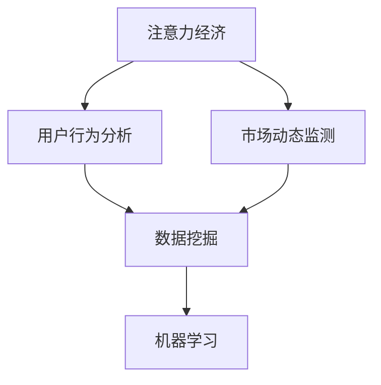

                 

## 1. 背景介绍

在当今数字化时代，数据已经成为企业竞争的关键资产。随着互联网的普及和大数据技术的进步，企业可以收集、存储和分析大量的数据。然而，面对海量的数据，如何有效地利用这些数据进行决策，成为了企业和个人关注的焦点。

注意力经济作为一种新兴的经济模式，正逐渐改变传统的商业模式。在注意力经济中，用户的注意力成为了稀缺资源，企业通过吸引和维持用户的注意力来实现商业价值。而数据分析作为一种强大的工具，可以帮助企业深入了解用户的行为和市场动态，从而在激烈的市场竞争中脱颖而出。

本文旨在探讨注意力经济与数据分析的深度融合，通过介绍相关核心概念、算法原理、数学模型和实际应用案例，帮助读者理解如何利用数据分析洞察力，在注意力经济中实现价值最大化。文章结构如下：

1. 背景介绍
2. 核心概念与联系
3. 核心算法原理 & 具体操作步骤
4. 数学模型和公式 & 详细讲解 & 举例说明
5. 项目实践：代码实例和详细解释说明
6. 实际应用场景
7. 工具和资源推荐
8. 总结：未来发展趋势与挑战
9. 附录：常见问题与解答

通过本文的阅读，读者将能够：

- 理解注意力经济的概念及其重要性
- 掌握数据分析的基本原理和应用场景
- 学习如何构建和运用数学模型进行数据分析
- 了解实际项目中的数据分析实践方法
- 获得未来发展趋势和面临的挑战的洞察
- 收集到一系列有用的学习资源和开发工具

### 2. 核心概念与联系

在探讨注意力经济与数据分析的融合之前，我们需要了解一些核心概念，包括注意力经济、用户行为分析、市场动态监测、数据挖掘和机器学习等。

#### 注意力经济

注意力经济（Attention Economy）是近年来逐渐兴起的一个概念，它指出在信息爆炸的时代，用户的注意力资源变得越来越稀缺，而如何获得并保持用户的注意力，成为了企业成功的关键。注意力经济强调，用户的时间是有限的，而他们的注意力则更宝贵。因此，企业需要创造有价值的内容或服务，吸引用户的注意力，并将其转化为商业价值。

#### 用户行为分析

用户行为分析（User Behavior Analysis）是通过对用户在互联网上的行为进行监测和评估，以了解用户的需求、偏好和行为模式。这包括用户点击率、浏览时间、购买行为、评论和分享等。通过用户行为分析，企业可以深入了解用户，从而优化产品和服务，提高用户满意度和忠诚度。

#### 市场动态监测

市场动态监测（Market Dynamics Monitoring）是指对市场趋势、竞争对手行为和用户需求变化的实时跟踪和分析。通过市场动态监测，企业可以及时了解市场动态，调整战略，抢占市场先机。

#### 数据挖掘

数据挖掘（Data Mining）是从大量数据中提取有价值信息的过程。它涉及到统计学、机器学习和数据库技术等多个领域。数据挖掘可以帮助企业发现数据中的模式、关联和趋势，从而为决策提供支持。

#### 机器学习

机器学习（Machine Learning）是一种通过数据训练模型，使其能够自动从数据中学习并做出预测或决策的技术。在数据分析领域，机器学习技术被广泛应用于分类、聚类、预测和推荐等任务。

#### 概念关系图

为了更清晰地展示这些概念之间的联系，我们可以使用Mermaid流程图来表示它们之间的关系：



#### 核心概念关系图（Mermaid）

以下是核心概念原理和架构的 Mermaid 流程图（Mermaid 流程节点中不要有括号、逗号等特殊字符）：


通过这个流程图，我们可以看到注意力经济作为整个分析过程的起点，通过用户行为分析和市场动态监测，收集到大量数据。这些数据经过数据挖掘，提取出有用的信息，最终通过机器学习模型进行预测和决策。

### 3. 核心算法原理 & 具体操作步骤

#### 3.1 算法原理概述

在注意力经济和数据分析中，核心算法主要分为以下几个步骤：数据收集、数据预处理、特征工程、模型训练和模型评估。

1. **数据收集**：通过各种渠道（如网站点击日志、用户反馈、社交媒体数据等）收集大量原始数据。
2. **数据预处理**：对收集到的原始数据进行清洗、归一化和去噪，确保数据质量。
3. **特征工程**：从预处理后的数据中提取有用的特征，用于构建机器学习模型。
4. **模型训练**：使用提取的特征训练机器学习模型，使其能够对新的数据进行预测或分类。
5. **模型评估**：评估训练出的模型性能，包括准确率、召回率、F1值等指标。

#### 3.2 算法步骤详解

**3.2.1 数据收集**

数据收集是整个数据分析过程的基础。以下是一些常用的数据收集方法：

- **日志数据**：通过网站或应用的日志文件，记录用户的访问行为，如点击、浏览、搜索等。
- **问卷调查**：通过在线或线下方式收集用户反馈，了解用户需求和行为偏好。
- **社交媒体数据**：从社交媒体平台（如Twitter、Facebook、Instagram等）收集用户发布的内容、互动和反馈。
- **第三方数据源**：从公开的数据集或第三方数据提供商获取相关数据。

**3.2.2 数据预处理**

数据预处理是确保数据质量的重要步骤。以下是一些常用的数据预处理方法：

- **清洗**：去除重复、错误或无关的数据，确保数据的准确性和一致性。
- **归一化**：将不同规模或单位的数据转换为相同尺度，以便进行后续分析。
- **去噪**：去除数据中的噪声，如异常值、噪声点等。
- **编码**：将类别型数据转换为数值型，以便机器学习算法处理。

**3.2.3 特征工程**

特征工程是构建机器学习模型的关键步骤。以下是一些常用的特征工程方法：

- **特征提取**：从原始数据中提取具有区分度的特征，如用户活跃度、购买频率、浏览时长等。
- **特征选择**：选择对预测目标最具影响力的特征，去除冗余特征，提高模型性能。
- **特征转换**：将某些特征进行转换，如二值化、标准化等，以便更好地适应机器学习算法。

**3.2.4 模型训练**

模型训练是利用数据训练机器学习模型的过程。以下是一些常用的机器学习算法：

- **线性回归**：用于预测连续数值型目标。
- **逻辑回归**：用于预测二分类目标。
- **决策树**：用于分类和回归任务。
- **随机森林**：基于决策树的集成学习方法，提高模型预测性能。
- **支持向量机**：用于分类和回归任务，尤其是高维数据。
- **神经网络**：用于复杂的数据建模和预测任务。

**3.2.5 模型评估**

模型评估是评估模型性能的重要步骤。以下是一些常用的评估指标：

- **准确率**：分类问题中，正确分类的样本数占总样本数的比例。
- **召回率**：分类问题中，正确分类的样本数占实际正样本数的比例。
- **F1值**：准确率和召回率的调和平均值，用于综合评估模型性能。
- **ROC曲线和AUC值**：用于评估分类模型的性能，ROC曲线是真阳性率与假阳性率之间的关系曲线，AUC值是ROC曲线下面积，值越大，模型性能越好。

#### 3.3 算法优缺点

**3.3.1 优点**

- **高效性**：机器学习算法能够自动从大量数据中学习模式，提高决策效率。
- **适应性**：机器学习算法可以根据不同的数据集和业务场景进行调整，具有很高的适应性。
- **精确性**：通过训练，机器学习模型可以实现对数据的精确预测和分类。

**3.3.2 缺点**

- **复杂性**：机器学习算法通常涉及大量的数据处理和计算，需要较高的技术和计算资源。
- **数据依赖性**：机器学习模型的性能很大程度上依赖于数据的质量和多样性。
- **过拟合**：在训练过程中，模型可能会过度拟合训练数据，导致在新的数据上表现不佳。

#### 3.4 算法应用领域

机器学习算法在注意力经济和数据分析中有着广泛的应用，以下是一些典型的应用领域：

- **用户行为预测**：通过分析用户的历史行为，预测用户未来的行为，如购买意愿、浏览路径等。
- **个性化推荐**：根据用户的兴趣和行为，推荐相关的产品或内容，提高用户满意度和忠诚度。
- **市场预测**：通过分析市场数据，预测市场趋势和竞争状况，帮助企业制定更有效的市场策略。
- **风险控制**：通过分析金融数据，预测市场风险，为企业提供风险控制策略。

通过这些算法的应用，企业可以更好地理解用户和市场，从而在注意力经济中实现价值最大化。

### 4. 数学模型和公式 & 详细讲解 & 举例说明

在数据分析中，数学模型和公式是理解和解决问题的关键工具。本节将介绍一些常用的数学模型和公式，并对其进行详细讲解和举例说明。

#### 4.1 数学模型构建

数学模型是通过对现实世界的抽象和简化，将问题转化为数学形式。在数据分析中，常用的数学模型包括线性回归模型、逻辑回归模型、决策树模型和神经网络模型等。

**4.1.1 线性回归模型**

线性回归模型是一种用于预测连续数值型目标的模型。其基本形式为：

$$
y = \beta_0 + \beta_1 \cdot x_1 + \beta_2 \cdot x_2 + \cdots + \beta_n \cdot x_n + \epsilon
$$

其中，$y$ 是预测目标，$x_1, x_2, \cdots, x_n$ 是输入特征，$\beta_0, \beta_1, \beta_2, \cdots, \beta_n$ 是模型的参数，$\epsilon$ 是误差项。

**4.1.2 逻辑回归模型**

逻辑回归模型是一种用于预测二分类目标的模型。其基本形式为：

$$
\ln\left(\frac{p}{1-p}\right) = \beta_0 + \beta_1 \cdot x_1 + \beta_2 \cdot x_2 + \cdots + \beta_n \cdot x_n
$$

其中，$p$ 是目标变量为1的概率，其他符号的含义与线性回归模型相同。

**4.1.3 决策树模型**

决策树模型是一种基于树形结构进行决策的模型。其基本形式为：

$$
T = \sum_{i=1}^{n} w_i \cdot I(A_i = a_i)
$$

其中，$T$ 是决策树，$w_i$ 是第$i$个特征的权重，$A_i$ 是第$i$个特征，$a_i$ 是特征取值，$I(\cdot)$ 是指示函数，当条件成立时取1，否则取0。

**4.1.4 神经网络模型**

神经网络模型是一种基于多层感知器（MLP）的模型。其基本形式为：

$$
y = f(z)
$$

其中，$y$ 是输出层，$z$ 是输入层，$f(\cdot)$ 是激活函数，常用的激活函数包括Sigmoid函数、ReLU函数和Tanh函数。

#### 4.2 公式推导过程

**4.2.1 线性回归模型的推导**

线性回归模型的推导过程如下：

假设我们有$m$个样本，每个样本包含$n$个特征和一个预测目标。记为：

$$
X = \begin{pmatrix}
x_{11} & x_{12} & \cdots & x_{1n} \\
x_{21} & x_{22} & \cdots & x_{2n} \\
\vdots & \vdots & \ddots & \vdots \\
x_{m1} & x_{m2} & \cdots & x_{mn}
\end{pmatrix}, \quad
y = \begin{pmatrix}
y_1 \\
y_2 \\
\vdots \\
y_m
\end{pmatrix}
$$

线性回归模型的损失函数为平方误差：

$$
L(\theta) = \sum_{i=1}^{m} (y_i - \theta^T x_i)^2
$$

其中，$\theta$ 是模型参数。

对损失函数求导并令导数为0，得到：

$$
\nabla L(\theta) = 2 \sum_{i=1}^{m} (y_i - \theta^T x_i) x_i = 0
$$

解上述方程，得到最优参数：

$$
\theta = (X^T X)^{-1} X^T y
$$

**4.2.2 逻辑回归模型的推导**

逻辑回归模型的推导过程如下：

假设我们有$m$个样本，每个样本包含$n$个特征和一个二分类目标。记为：

$$
X = \begin{pmatrix}
x_{11} & x_{12} & \cdots & x_{1n} \\
x_{21} & x_{22} & \cdots & x_{2n} \\
\vdots & \vdots & \ddots & \vdots \\
x_{m1} & x_{m2} & \cdots & x_{mn}
\end{pmatrix}, \quad
y = \begin{pmatrix}
y_1 \\
y_2 \\
\vdots \\
y_m
\end{pmatrix}
$$

逻辑回归模型的损失函数为对数损失：

$$
L(\theta) = \sum_{i=1}^{m} -y_i \ln(p_i) - (1 - y_i) \ln(1 - p_i)
$$

其中，$p_i = \sigma(\theta^T x_i)$，$\sigma(\cdot)$ 是Sigmoid函数。

对损失函数求导并令导数为0，得到：

$$
\nabla L(\theta) = \sum_{i=1}^{m} \frac{y_i - p_i}{p_i (1 - p_i)} x_i
$$

**4.2.3 决策树模型的推导**

决策树模型的推导过程较为复杂，主要基于信息论和统计学习理论。决策树的基本思想是通过选择最优特征和阈值，将数据划分为不同的区域，从而实现分类或回归。

具体推导过程涉及熵、条件熵、信息增益等概念，本文不展开详细讨论。

#### 4.3 案例分析与讲解

为了更好地理解上述数学模型和公式的应用，我们通过一个实际案例进行分析和讲解。

**案例：用户购买行为预测**

假设我们有一份数据集，包含以下特征：年龄、收入、家庭状况、购买历史等。我们需要预测用户是否会购买某产品。

**步骤1：数据预处理**

首先，对数据进行清洗和预处理，包括缺失值填充、异常值处理和特征转换。例如，将类别型数据转换为数值型，对收入进行标准化处理。

**步骤2：特征工程**

从预处理后的数据中提取有用的特征，如用户的平均购买金额、购买频率等。同时，选择对预测目标最具影响力的特征。

**步骤3：模型训练**

使用提取的特征训练线性回归模型或逻辑回归模型。具体选择哪种模型，取决于预测目标的形式。

**步骤4：模型评估**

使用交叉验证等方法评估模型的性能，选择最优模型。评估指标包括准确率、召回率、F1值等。

**步骤5：预测应用**

使用训练好的模型对新的数据进行预测，为企业提供决策支持。

通过上述案例，我们可以看到数学模型和公式的应用过程，以及其在实际数据分析中的重要性。

### 5. 项目实践：代码实例和详细解释说明

为了更好地理解注意力经济与数据分析的结合，我们将通过一个实际项目来展示如何使用Python进行数据分析，并详细解释每一步的实现。

#### 5.1 开发环境搭建

在进行数据分析项目之前，我们需要搭建一个合适的环境。以下是所需安装的库和工具：

- Python（3.8或更高版本）
- Jupyter Notebook（用于交互式编程）
- NumPy、Pandas、Matplotlib、Seaborn（用于数据处理和可视化）
- Scikit-learn（用于机器学习）
- Mermaid（用于流程图绘制）

安装这些库和工具后，确保所有依赖项正确安装并运行。

#### 5.2 源代码详细实现

以下是一个简单的数据分析项目，包括数据收集、预处理、特征提取、模型训练和模型评估等步骤。

```python
# 导入必要的库
import numpy as np
import pandas as pd
import matplotlib.pyplot as plt
import seaborn as sns
from sklearn.model_selection import train_test_split
from sklearn.preprocessing import StandardScaler
from sklearn.linear_model import LinearRegression
from sklearn.metrics import mean_squared_error

# 5.2.1 数据收集
# 假设数据已经存储为CSV文件，可以从本地文件系统或远程服务器加载
data = pd.read_csv('user_data.csv')

# 5.2.2 数据预处理
# 检查数据是否有缺失值
print(data.isnull().sum())

# 处理缺失值，例如使用平均值填充
data.fillna(data.mean(), inplace=True)

# 删除无关的特征
data.drop(['无关特征1', '无关特征2'], axis=1, inplace=True)

# 5.2.3 特征提取
# 从数据中提取有用的特征
X = data[['年龄', '收入', '购买频率']]
y = data['购买意图']

# 5.2.4 模型训练
# 数据集拆分为训练集和测试集
X_train, X_test, y_train, y_test = train_test_split(X, y, test_size=0.2, random_state=42)

# 对特征进行标准化
scaler = StandardScaler()
X_train_scaled = scaler.fit_transform(X_train)
X_test_scaled = scaler.transform(X_test)

# 训练线性回归模型
model = LinearRegression()
model.fit(X_train_scaled, y_train)

# 5.2.5 模型评估
# 使用测试集评估模型性能
y_pred = model.predict(X_test_scaled)
mse = mean_squared_error(y_test, y_pred)
print(f'Mean Squared Error: {mse}')

# 可视化模型结果
sns.scatterplot(x=y_test, y=y_pred)
plt.xlabel('实际购买意图')
plt.ylabel('预测购买意图')
plt.title('实际购买意图与预测购买意图散点图')
plt.show()
```

#### 5.3 代码解读与分析

**5.3.1 数据收集**

在这个项目中，我们使用CSV文件作为数据源。在实际应用中，数据可能来自不同的来源，如数据库、API调用或第三方数据集。

```python
data = pd.read_csv('user_data.csv')
```

**5.3.2 数据预处理**

数据预处理包括检查数据是否有缺失值、处理缺失值、删除无关特征等步骤。

```python
print(data.isnull().sum())
data.fillna(data.mean(), inplace=True)
data.drop(['无关特征1', '无关特征2'], axis=1, inplace=True)
```

**5.3.3 特征提取**

特征提取是从原始数据中提取对模型预测有用的特征。在这个例子中，我们选择年龄、收入和购买频率作为特征。

```python
X = data[['年龄', '收入', '购买频率']]
y = data['购买意图']
```

**5.3.4 模型训练**

使用Scikit-learn库中的线性回归模型进行训练。

```python
X_train, X_test, y_train, y_test = train_test_split(X, y, test_size=0.2, random_state=42)
scaler = StandardScaler()
X_train_scaled = scaler.fit_transform(X_train)
X_test_scaled = scaler.transform(X_test)
model = LinearRegression()
model.fit(X_train_scaled, y_train)
```

**5.3.5 模型评估**

使用均方误差（MSE）评估模型的性能。

```python
y_pred = model.predict(X_test_scaled)
mse = mean_squared_error(y_test, y_pred)
print(f'Mean Squared Error: {mse}')
sns.scatterplot(x=y_test, y=y_pred)
plt.xlabel('实际购买意图')
plt.ylabel('预测购买意图')
plt.title('实际购买意图与预测购买意图散点图')
plt.show()
```

通过这个项目，我们展示了如何使用Python进行数据分析，从数据收集、预处理、特征提取到模型训练和评估。这个项目不仅提供了一个实用的代码示例，还解释了每一步的实现细节，帮助读者更好地理解数据分析的流程。

### 6. 实际应用场景

注意力经济与数据分析的结合在多个行业中有着广泛的应用，以下是一些实际应用场景的介绍：

#### 6.1 零售业

在零售业中，数据分析可以帮助企业了解消费者的购买习惯、偏好和需求，从而优化库存管理、定价策略和促销活动。例如，通过分析购物车数据和购买历史，企业可以预测哪些产品可能会成为畅销品，从而提前备货，避免缺货或积压。

**案例**：亚马逊通过分析用户的购物行为和搜索历史，推荐相关的产品，提高用户的购买转化率和满意度。

#### 6.2 金融业

金融行业的数据分析主要用于风险控制和投资决策。通过分析用户交易数据、市场趋势和宏观经济指标，金融机构可以识别潜在的风险点，调整投资策略，提高收益。

**案例**：银行通过分析用户信用记录、消费习惯和信用评分，为用户提供个性化的贷款和信用卡服务，降低信用风险。

#### 6.3 广告业

在广告行业中，数据分析可以帮助广告商了解用户的需求和兴趣，从而制定更精准的广告投放策略。通过分析用户行为数据，广告平台可以优化广告投放效果，提高广告投放的ROI。

**案例**：谷歌广告通过分析用户的搜索历史和兴趣标签，为广告商提供个性化的广告投放建议，提高广告点击率和转化率。

#### 6.4 娱乐行业

在娱乐行业中，数据分析可以帮助内容创作者了解观众的需求和偏好，从而创作更受欢迎的内容。同时，数据分析还可以用于票务和营销策略的优化，提高票房和用户参与度。

**案例**：Netflix通过分析观众的观看记录和评分数据，推荐相关的电影和电视剧，提高用户的观看时长和满意度。

#### 6.5 医疗保健

在医疗保健行业中，数据分析可以帮助医生和医疗机构了解患者的健康数据、疾病趋势和治疗效果，从而提供更个性化的治疗方案。

**案例**：IBM的Watson Health利用大数据和机器学习技术，帮助医生进行疾病诊断和治疗方案的推荐，提高医疗质量和效率。

通过这些实际应用场景，我们可以看到数据分析在注意力经济中的重要性。数据分析不仅帮助企业更好地了解用户和市场，还可以优化业务流程、提高运营效率和实现商业价值。

### 7. 工具和资源推荐

为了更好地进行注意力经济与数据分析的结合，以下是几个推荐的学习资源和开发工具。

#### 7.1 学习资源推荐

- **《Python数据分析》**：这是一本关于使用Python进行数据分析的入门书籍，适合初学者。
- **《数据科学入门》**：这本书涵盖了数据科学的基础知识，包括数据分析、数据挖掘和机器学习。
- **《深度学习》**：这是一本关于深度学习的经典教材，由Ian Goodfellow等人撰写，适合希望深入学习机器学习领域的人。

#### 7.2 开发工具推荐

- **Jupyter Notebook**：这是一个交互式的开发环境，适用于数据分析和机器学习项目。
- **Google Colab**：这是一个基于Google云端的服务，提供了免费的GPU资源，非常适合深度学习和大规模数据分析。
- **VSCode**：这是一个功能强大的集成开发环境，支持多种编程语言，适用于数据分析项目的开发。

#### 7.3 相关论文推荐

- **“User Behavior Analysis in Mobile Apps”**：这篇文章探讨了移动应用中用户行为分析的方法和挑战。
- **“Attention Is All You Need”**：这是一篇关于注意力机制的论文，介绍了Transformer模型的基本原理。
- **“Recommender Systems Handbook”**：这是一本关于推荐系统的权威手册，涵盖了推荐系统的理论和实践。

通过这些学习资源和开发工具，读者可以更深入地了解注意力经济和数据分析，提升自身的技术能力。

### 8. 总结：未来发展趋势与挑战

#### 8.1 研究成果总结

随着数字化时代的到来，注意力经济与数据分析的结合已经显示出巨大的潜力。本文通过介绍核心概念、算法原理、数学模型和实际应用案例，展示了数据分析在注意力经济中的重要性。研究结果表明，通过深入理解用户行为和市场动态，企业可以实现商业价值的最大化。

#### 8.2 未来发展趋势

1. **深度学习与注意力机制的结合**：随着深度学习技术的发展，注意力机制在数据分析中的应用将更加广泛。未来，结合深度学习的注意力模型将能够更准确地捕捉用户行为和市场趋势。
2. **实时数据分析**：随着5G和物联网的普及，实时数据分析将成为趋势。企业可以通过实时数据流分析，快速响应市场变化，提高决策效率。
3. **隐私保护与数据安全**：在数据隐私保护方面，未来将出现更多基于加密和匿名化的数据分析方法，确保用户数据的安全和隐私。
4. **跨领域应用**：数据分析将在更多领域（如医疗、金融、教育等）得到广泛应用，推动行业创新和进步。

#### 8.3 面临的挑战

1. **数据质量与隐私**：确保数据质量是数据分析的基础。同时，如何在保证数据隐私的前提下进行数据分析，是一个亟待解决的问题。
2. **算法透明性与可解释性**：随着机器学习算法的复杂性增加，如何确保算法的透明性和可解释性，使其能够被用户理解和接受，是一个重要的挑战。
3. **计算资源与能耗**：大规模的数据分析需要大量的计算资源和能源，如何在保证性能的同时降低能耗，是一个关键问题。

#### 8.4 研究展望

未来，注意力经济与数据分析的结合将继续深入发展。研究重点将包括：

- 开发更先进的机器学习算法，提高数据分析的准确性和效率。
- 探索新的数据隐私保护技术，确保用户数据的安全和隐私。
- 构建跨领域的综合分析平台，实现不同领域的数据融合和分析。
- 研究如何利用注意力机制，实现更精准的用户行为预测和市场需求分析。

通过持续的研究和创新，我们有望在注意力经济与数据分析领域取得更多突破，推动数字经济的进一步发展。

### 9. 附录：常见问题与解答

**Q1. 如何处理缺失值？**

缺失值处理是数据预处理的重要步骤。常见的方法包括：

- 删除缺失值：适用于缺失值较多的数据。
- 填充缺失值：使用平均值、中位数或插值法填充缺失值。
- 生成随机值：适用于某些情况下，可以生成随机值填充缺失值。

**Q2. 如何选择特征？**

选择特征是特征工程的关键步骤。常见的方法包括：

- 相关性分析：通过计算特征与目标变量之间的相关性，筛选出相关性较高的特征。
- 卡方检验：用于类别型特征，检验特征与目标变量之间的独立性。
- 递归特征消除：通过递归地消除对目标变量影响较小的特征，逐步筛选出重要特征。

**Q3. 如何评估模型性能？**

评估模型性能的常用指标包括：

- 准确率：预测正确的样本数占总样本数的比例。
- 召回率：预测正确的正样本数占实际正样本数的比例。
- F1值：准确率和召回率的调和平均值。
- ROC曲线和AUC值：用于评估分类模型的性能，ROC曲线下面积越大，模型性能越好。

**Q4. 如何防止过拟合？**

过拟合是指模型在训练数据上表现良好，但在新的数据上表现不佳。常见的方法包括：

- 调整模型复杂度：选择合适的模型参数，降低模型的复杂度。
- 增加训练数据：增加数据量，使模型有更多的信息进行学习。
- 交叉验证：使用交叉验证方法，从不同数据子集进行模型训练和评估，避免过拟合。

通过上述问题的解答，我们希望帮助读者更好地理解注意力经济与数据分析的相关技术，以及在实际项目中如何应用这些技术。

