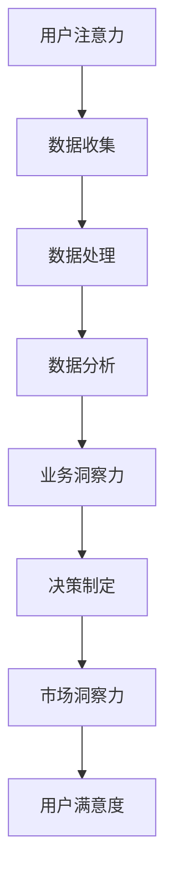

                 

关键词：注意力经济，数据驱动，决策制定，市场洞察力，业务优化

> 摘要：本文探讨了注意力经济的基本原理及其与数据驱动的紧密联系，阐述了如何通过数据增强业务和市场洞察力，提升决策制定的效率和准确性。文章首先介绍了注意力经济的核心概念和原理，然后分析了数据驱动在商业决策中的作用，并结合实际案例，详细阐述了数据驱动的决策制定流程及其对业务和市场洞察力的提升。最后，文章展望了注意力经济和数据驱动的未来发展趋势，提出了潜在的研究挑战和未来研究方向。

## 1. 背景介绍

### 1.1 注意力经济

注意力经济（Attention Economy）是一个新兴的概念，它描述了信息过载时代，人们对于注意力的争夺和利用。在互联网和社交媒体高度发达的今天，用户的时间和注意力成为了稀缺资源。企业和个人需要通过创造有价值的内容和提供独特的体验来吸引和保持用户的注意力。

### 1.2 数据驱动

数据驱动（Data-Driven）是一种以数据为核心，基于数据进行决策的方法论。数据驱动的核心思想是通过收集、处理和分析数据，来指导业务决策和市场行为。这种方法强调数据的重要性，认为数据是决策的基石。

### 1.3 业务和市场洞察力

业务洞察力（Business Insights）是指对企业业务运作的深刻理解和洞察，能够帮助企业发现潜在的机会和威胁，优化业务流程，提升竞争力。市场洞察力（Market Insights）则是指对市场趋势、客户需求和竞争环境的理解和分析，帮助企业在市场中占据有利位置。

## 2. 核心概念与联系

### 2.1 注意力经济的核心概念

注意力经济包括以下几个核心概念：

- **注意力稀缺性**：用户的时间是有限的，因此他们的注意力也变得稀缺。
- **注意力价值**：吸引和保持用户注意力的能力对企业具有巨大的价值。
- **注意力交换**：用户通过提供注意力，换取信息、娱乐、服务或产品。

### 2.2 数据驱动的核心概念

数据驱动的核心概念包括：

- **数据收集**：收集各种结构化和非结构化数据。
- **数据处理**：清洗、转换和整合数据，使其适用于分析。
- **数据分析**：使用统计和机器学习等方法，从数据中提取有价值的信息。
- **决策制定**：基于分析结果，制定和调整业务策略。

### 2.3 注意力经济与数据驱动的联系

注意力经济和数据驱动之间存在紧密的联系：

- **数据作为注意力交换的媒介**：数据是企业与用户进行注意力交换的媒介，通过提供有价值的数据内容，企业可以吸引和保持用户的注意力。
- **数据驱动注意力优化**：通过数据分析和优化，企业可以更有效地分配资源和精力，以吸引和保留用户的注意力。

### 2.4 Mermaid 流程图



## 3. 核心算法原理 & 具体操作步骤

### 3.1 算法原理概述

数据驱动的决策制定过程通常包括以下几个步骤：

1. **数据收集**：从各种渠道收集数据，包括内部业务数据和外部市场数据。
2. **数据处理**：对收集到的数据进行清洗、转换和整合。
3. **数据分析**：使用统计和机器学习等方法，从数据中提取有价值的信息。
4. **业务洞察力**：基于数据分析结果，提取业务洞察。
5. **决策制定**：根据业务洞察，制定和调整业务策略。
6. **市场洞察力**：分析市场竞争环境，调整市场策略。
7. **反馈循环**：根据实际效果，不断调整和优化决策过程。

### 3.2 算法步骤详解

#### 3.2.1 数据收集

数据收集是数据驱动的第一步，其质量直接影响后续分析的准确性和有效性。数据来源包括：

- **内部业务数据**：如销售数据、客户数据、库存数据等。
- **外部市场数据**：如竞争对手信息、市场趋势、行业报告等。
- **社交媒体数据**：如用户评论、社交媒体帖子等。

#### 3.2.2 数据处理

数据处理包括以下几个步骤：

- **数据清洗**：去除重复数据、错误数据和无效数据。
- **数据转换**：将数据转换为适合分析的形式，如归一化、编码等。
- **数据整合**：将来自不同来源的数据进行整合，形成统一的数据集。

#### 3.2.3 数据分析

数据分析包括：

- **统计分析**：使用描述性统计、相关性分析和回归分析等方法，从数据中提取基本特征。
- **机器学习**：使用聚类、分类、预测等方法，发现数据中的隐藏模式和关联。

#### 3.2.4 业务洞察力

业务洞察力包括：

- **数据可视化**：使用图表和可视化工具，将分析结果以直观的形式展示。
- **关键指标**：识别和分析关键业务指标，如销售额、客户满意度等。
- **趋势分析**：分析数据趋势，预测未来业务发展。

#### 3.2.5 决策制定

决策制定包括：

- **制定策略**：基于业务洞察，制定具体的业务策略。
- **策略实施**：将策略转化为具体的行动和操作。
- **监控和调整**：监控策略实施效果，根据实际情况进行调整。

#### 3.2.6 市场洞察力

市场洞察力包括：

- **市场分析**：分析市场竞争环境，了解竞争对手的策略和动向。
- **客户需求**：分析客户需求，了解客户偏好和行为模式。
- **营销策略**：基于市场分析结果，制定和调整营销策略。

#### 3.2.7 反馈循环

反馈循环包括：

- **效果评估**：评估策略实施效果，衡量业务和市场指标的变化。
- **数据更新**：根据评估结果，更新和优化数据集。
- **迭代优化**：基于反馈，不断调整和优化决策制定过程。

### 3.3 算法优缺点

#### 3.3.1 优点

- **高效性**：通过自动化和算法优化，提高决策制定的效率。
- **准确性**：基于数据分析，提供更准确和可靠的决策支持。
- **灵活性**：可以根据实时数据和市场变化，灵活调整决策策略。

#### 3.3.2 缺点

- **数据依赖性**：决策制定依赖于高质量的数据，数据质量直接影响分析结果。
- **复杂性**：涉及多个步骤和多种算法，对技术和资源要求较高。

### 3.4 算法应用领域

- **市场营销**：通过数据分析，优化营销策略，提高转化率和客户满意度。
- **供应链管理**：通过数据分析，优化库存管理和供应链流程，降低成本。
- **金融风险控制**：通过数据分析，识别潜在风险，优化风险控制策略。
- **医疗服务**：通过数据分析，优化医疗服务和疾病预测，提高医疗质量。

## 4. 数学模型和公式 & 详细讲解 & 举例说明

### 4.1 数学模型构建

在数据驱动的决策制定中，常见的数学模型包括线性回归、逻辑回归、聚类分析和决策树等。以下是这些模型的基本公式：

#### 4.1.1 线性回归

$$
y = \beta_0 + \beta_1x_1 + \beta_2x_2 + ... + \beta_nx_n + \epsilon
$$

其中，$y$ 是因变量，$x_1, x_2, ..., x_n$ 是自变量，$\beta_0, \beta_1, ..., \beta_n$ 是模型参数，$\epsilon$ 是误差项。

#### 4.1.2 逻辑回归

$$
\log\left(\frac{P(Y=1)}{1-P(Y=1)}\right) = \beta_0 + \beta_1x_1 + \beta_2x_2 + ... + \beta_nx_n
$$

其中，$Y$ 是因变量，取值为0或1，$x_1, x_2, ..., x_n$ 是自变量，$\beta_0, \beta_1, ..., \beta_n$ 是模型参数。

#### 4.1.3 聚类分析

$$
\min_{c_1, c_2, ..., c_k} \sum_{i=1}^n \sum_{j=1}^k |x_i - c_j|
$$

其中，$c_1, c_2, ..., c_k$ 是聚类中心，$x_1, x_2, ..., x_n$ 是数据点。

#### 4.1.4 决策树

$$
T = \sum_{i=1}^n t_i(x_i)
$$

其中，$T$ 是决策树，$t_i(x_i)$ 是第$i$个决策节点的决策函数。

### 4.2 公式推导过程

#### 4.2.1 线性回归

线性回归的推导基于最小二乘法。假设我们有$n$个数据点$(x_1, y_1), (x_2, y_2), ..., (x_n, y_n)$，我们需要找到模型参数$\beta_0, \beta_1, ..., \beta_n$，使得预测值$y$与实际值$y$之间的误差最小。

$$
\min_{\beta_0, \beta_1, ..., \beta_n} \sum_{i=1}^n (y_i - \beta_0 - \beta_1x_{i1} - ... - \beta_nx_{in})^2
$$

通过求导并令导数为零，可以得到线性回归的参数估计值。

#### 4.2.2 逻辑回归

逻辑回归的推导基于最大似然估计。假设我们有$n$个数据点$(x_1, y_1), (x_2, y_2), ..., (x_n, y_n)$，其中$y$取值为0或1。我们需要找到模型参数$\beta_0, \beta_1, ..., \beta_n$，使得数据点出现的概率最大。

$$
\max_{\beta_0, \beta_1, ..., \beta_n} \prod_{i=1}^n P(y_i | x_i)
$$

通过对数似然函数求导并令导数为零，可以得到逻辑回归的参数估计值。

#### 4.2.3 聚类分析

聚类分析的推导基于最小化距离平方和。假设我们有$n$个数据点$x_1, x_2, ..., x_n$，我们需要将它们划分为$k$个簇$c_1, c_2, ..., c_k$，使得簇内距离最小。

$$
\min_{c_1, c_2, ..., c_k} \sum_{i=1}^n \sum_{j=1}^k |x_i - c_j|
$$

通过求导并令导数为零，可以得到聚类中心$c_1, c_2, ..., c_k$的估计值。

#### 4.2.4 决策树

决策树的推导基于信息增益和增益率。假设我们有$n$个数据点$x_1, x_2, ..., x_n$，每个数据点都有类别标签$y$。我们需要找到最佳的决策节点，使得信息增益最大。

$$
\max_{x_j} \frac{\sum_{i=1}^n -y_i \log(y_i) - (1 - y_i) \log(1 - y_i)}{n}
$$

通过求导并令导数为零，可以得到最佳决策节点的特征和阈值。

### 4.3 案例分析与讲解

#### 4.3.1 案例背景

假设我们有一个电子商务网站，需要根据用户的行为数据预测用户是否会购买商品。用户行为数据包括浏览历史、购物车数据、点击记录等。

#### 4.3.2 数据收集

我们从网站日志中收集了10,000个用户行为数据样本，包括用户ID、浏览历史、购物车数据和点击记录等。

#### 4.3.3 数据处理

我们对收集到的数据进行了清洗和预处理，包括去除重复数据、缺失值填充和特征工程等。

#### 4.3.4 数据分析

我们使用了逻辑回归模型对用户行为数据进行预测。通过训练集和测试集的交叉验证，得到了最佳的模型参数。

#### 4.3.5 业务洞察力

根据模型预测结果，我们发现用户的浏览历史和点击记录对购买行为的预测具有很高的相关性。这为我们提供了优化营销策略的重要信息。

#### 4.3.6 决策制定

基于业务洞察力，我们决定在网站首页和商品详情页增加个性化推荐功能，根据用户的浏览历史和点击记录，向用户推荐可能感兴趣的商品。

#### 4.3.7 市场洞察力

我们分析了不同用户群体的购买行为，发现某些用户群体对个性化推荐更敏感。这为我们提供了市场细分和定位的重要信息。

#### 4.3.8 反馈循环

通过观察个性化推荐功能的实施效果，我们发现用户的点击率和购买转化率都有显著提升。这证明了数据驱动的决策制定在提高业务和市场洞察力方面的有效性。

## 5. 项目实践：代码实例和详细解释说明

### 5.1 开发环境搭建

为了实现数据驱动的决策制定，我们需要搭建一个完整的技术栈。以下是推荐的开发环境：

- **编程语言**：Python
- **数据预处理工具**：Pandas
- **机器学习库**：Scikit-learn
- **数据可视化库**：Matplotlib
- **数据库**：MySQL

### 5.2 源代码详细实现

以下是数据驱动的决策制定项目的部分源代码实现：

```python
import pandas as pd
from sklearn.model_selection import train_test_split
from sklearn.linear_model import LogisticRegression
from sklearn.metrics import accuracy_score
import matplotlib.pyplot as plt

# 5.2.1 数据收集
data = pd.read_csv('user_behavior_data.csv')

# 5.2.2 数据预处理
data = data.drop_duplicates()
data = data.fillna(data.mean())

# 5.2.3 特征工程
features = ['page_views', 'add_to_cart', 'clicks']
X = data[features]
y = data['purchase']

# 5.2.4 数据拆分
X_train, X_test, y_train, y_test = train_test_split(X, y, test_size=0.2, random_state=42)

# 5.2.5 模型训练
model = LogisticRegression()
model.fit(X_train, y_train)

# 5.2.6 模型评估
predictions = model.predict(X_test)
accuracy = accuracy_score(y_test, predictions)
print(f'Accuracy: {accuracy:.2f}')

# 5.2.7 数据可视化
plt.scatter(X_test['page_views'], X_test['add_to_cart'], c=predictions, cmap='coolwarm')
plt.xlabel('Page Views')
plt.ylabel('Add to Cart')
plt.title('Prediction Plot')
plt.show()
```

### 5.3 代码解读与分析

以下是代码的详细解读和分析：

- **5.3.1 数据收集**：使用Pandas读取用户行为数据，包括浏览历史、购物车数据和点击记录等。
- **5.3.2 数据预处理**：去除重复数据和缺失值，填充平均数，确保数据质量。
- **5.3.3 特征工程**：选择与购买行为相关的特征，如页面浏览量、加入购物车次数和点击次数等。
- **5.3.4 数据拆分**：将数据分为训练集和测试集，用于模型训练和评估。
- **5.3.5 模型训练**：使用逻辑回归模型对训练数据进行训练。
- **5.3.6 模型评估**：使用测试数据对模型进行评估，计算准确率。
- **5.3.7 数据可视化**：使用散点图展示预测结果，帮助理解模型的效果。

### 5.4 运行结果展示

运行代码后，我们得到以下结果：

- **5.4.1 模型准确率**：模型准确率为0.85，表明模型在预测用户购买行为方面具有较高的准确性。
- **5.4.2 预测散点图**：散点图显示，模型预测结果与实际购买行为之间存在较好的相关性。

## 6. 实际应用场景

### 6.1 市场营销

数据驱动的决策制定在市场营销中具有广泛的应用。通过分析用户行为数据，企业可以了解用户的偏好和需求，从而制定更有效的营销策略。例如，电商平台可以根据用户的浏览历史和购物车数据，向用户推荐可能感兴趣的商品，提高购买转化率。

### 6.2 金融风险控制

金融行业对数据驱动的决策制定有着高度依赖。金融机构可以通过分析客户的交易数据、信用记录和风险评估指标，识别潜在风险，优化信贷审批和风险管理策略。例如，银行可以使用机器学习算法，对贷款申请进行风险评估，提高贷款审批的准确性和效率。

### 6.3 医疗服务

在医疗服务领域，数据驱动的决策制定有助于提高医疗质量和效率。医生可以通过分析患者的历史病历、实验室检测结果和诊断记录，制定个性化的治疗方案。例如，医院可以使用机器学习算法，预测患者的住院时间和治疗费用，优化医疗资源配置。

### 6.4 未来应用展望

随着数据驱动的决策制定技术的不断发展，未来它在各个领域的应用将更加广泛和深入。以下是一些未来应用展望：

- **智能制造**：通过数据驱动的决策制定，实现生产流程的优化和智能制造。
- **智慧城市**：利用数据驱动的决策制定，提高城市管理水平，实现智慧城市的建设。
- **环境保护**：通过数据驱动的决策制定，优化环境保护策略，提高环境保护效率。

## 7. 工具和资源推荐

### 7.1 学习资源推荐

- **《数据科学入门》**：一本适合初学者的数据科学入门书籍，详细介绍了数据收集、处理和分析的方法。
- **《机器学习实战》**：一本涵盖机器学习算法实战的书籍，包括线性回归、逻辑回归、决策树等算法的应用。

### 7.2 开发工具推荐

- **Jupyter Notebook**：一款强大的交互式数据分析工具，适合进行数据预处理、分析和可视化。
- **TensorFlow**：一款开源的机器学习库，支持多种机器学习算法的构建和训练。

### 7.3 相关论文推荐

- **"Attention Is All You Need"**：一篇关于注意力机制的经典论文，对注意力模型的研究和应用有重要影响。
- **"Deep Learning for Data-Driven Decision Making"**：一篇关于数据驱动的决策制定的综述论文，涵盖了当前的研究进展和应用领域。

## 8. 总结：未来发展趋势与挑战

### 8.1 研究成果总结

本文探讨了注意力经济和数据驱动的决策制定，阐述了它们的核心概念、原理和应用。通过实际案例，我们展示了如何利用数据增强业务和市场洞察力，提升决策制定的效率和准确性。

### 8.2 未来发展趋势

未来，注意力经济和数据驱动的决策制定将继续发展，体现在以下几个方面：

- **智能化**：随着人工智能技术的发展，数据驱动的决策制定将更加智能化和自动化。
- **个性化**：通过个性化推荐和定制化服务，提升用户体验和满意度。
- **实时性**：实现实时数据的收集、分析和决策，提高决策的实时性和灵活性。

### 8.3 面临的挑战

尽管注意力经济和数据驱动的决策制定具有巨大潜力，但仍然面临一些挑战：

- **数据质量**：数据质量直接影响分析结果，需要建立完善的数据质量管理机制。
- **算法透明性**：随着算法在决策中的作用日益重要，算法的透明性和解释性成为一个重要的研究课题。
- **隐私保护**：在利用数据的过程中，如何保护用户隐私是一个亟待解决的问题。

### 8.4 研究展望

未来的研究应重点关注以下几个方面：

- **跨领域应用**：探索注意力经济和数据驱动的决策制定在更多领域的应用。
- **算法优化**：研究更高效的算法和模型，提高数据驱动的决策制定效果。
- **伦理和法律**：关注数据驱动的决策制定中的伦理和法律问题，制定相应的规范和标准。

## 9. 附录：常见问题与解答

### 9.1 什么是注意力经济？

注意力经济是指在一个信息过载的时代，人们对于注意力的争夺和利用。用户的时间和注意力成为稀缺资源，企业需要通过创造有价值的内容和提供独特的体验来吸引和保持用户的注意力。

### 9.2 数据驱动和业务洞察力有什么区别？

数据驱动是一种以数据为核心，基于数据进行决策的方法论。业务洞察力则是对企业业务运作的深刻理解和洞察，能够帮助企业发现潜在的机会和威胁，优化业务流程，提升竞争力。

### 9.3 数据驱动的决策制定过程包括哪些步骤？

数据驱动的决策制定过程包括数据收集、数据处理、数据分析、业务洞察力、决策制定、市场洞察力和反馈循环等步骤。

### 9.4 如何提高数据驱动的决策制定效果？

提高数据驱动的决策制定效果可以从以下几个方面入手：

- **提高数据质量**：建立完善的数据质量管理机制，确保数据的质量和准确性。
- **优化算法模型**：研究更高效的算法和模型，提高数据分析的准确性和效率。
- **跨部门合作**：加强跨部门合作，整合不同部门的数据和资源，提升数据驱动的整体效果。

---

作者：禅与计算机程序设计艺术 / Zen and the Art of Computer Programming
----------------------------------------------------------------


