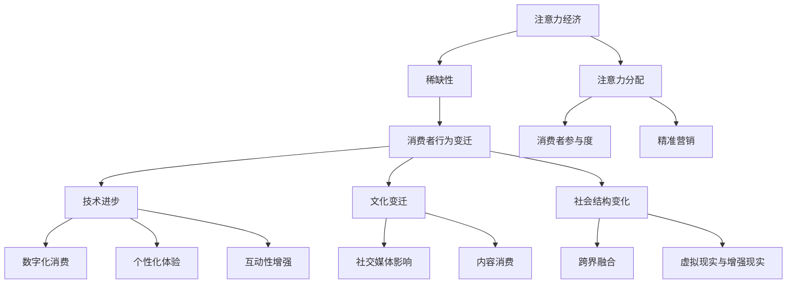

                 

关键词：注意力经济、消费者行为、技术变迁、算法原理、应用场景、未来展望

> 摘要：本文从注意力经济的角度出发，探讨了消费者行为在技术变迁中的演变。通过对核心概念、算法原理、数学模型的详细解析，以及项目实践的代码实例展示，本文旨在为读者提供一个全面、深入的了解，并展望未来在这一领域的应用与发展。

## 1. 背景介绍

随着互联网的普及和智能设备的广泛应用，人们的生活方式和消费行为正在发生深刻变革。这种变革的核心在于“注意力经济”的兴起。注意力经济是一种基于用户注意力资源的经济学理论，它强调注意力作为稀缺资源的重要性，并探讨如何在市场竞争中获得和保留用户注意力。

消费者行为的变迁，不仅受到产品和服务质量的影响，更受到注意力分配方式的变化所驱动。社交媒体、在线广告、短视频平台等新兴媒介形式，正在重新定义消费者的注意力模式，引发了一场关于如何获取、保留和利用注意力的商业革命。

### 1.1 注意力经济的兴起

注意力经济源于“注意力稀缺”的理论假设。在一个信息过载的时代，用户的时间与注意力资源变得愈发宝贵。企业必须通过创新和高效的信息传递方式来捕获用户的注意力，从而实现商业价值。

注意力经济的关键在于“注意力流”的创造和管理。用户在信息过载的环境中，往往选择注意力流向那些能够提供高价值、个性化、互动性的内容和服务。这为市场营销和内容创作带来了新的挑战和机遇。

### 1.2 消费者行为的变迁

消费者行为的变迁受到多重因素的影响，包括技术进步、文化变迁、社会结构变化等。以下是几个关键方面：

1. **数字化消费**：随着电子商务和移动支付的发展，消费者更加倾向于在线购物，数字化消费成为主流。
2. **个性化体验**：消费者期望得到个性化的产品和服务，这要求企业利用大数据和人工智能技术进行精准营销。
3. **社交媒体影响**：社交媒体平台上的推荐算法和社交互动，正在改变消费者的购物决策过程。
4. **内容消费**：短视频、直播等新型内容形式，正在重新定义消费者的娱乐和消费习惯。

### 1.3 技术变迁的影响

技术变迁对消费者行为产生了深远的影响，主要体现在以下几个方面：

1. **数据驱动的决策**：企业通过数据分析和算法优化，能够更准确地预测消费者行为，制定更有效的营销策略。
2. **互动性增强**：技术使得消费者与企业之间的互动更加频繁和多样化，消费者参与度显著提升。
3. **跨界融合**：技术推动了不同行业之间的融合，消费者能够享受到更加综合和个性化的服务。
4. **虚拟现实与增强现实**：虚拟现实和增强现实技术，为消费者提供了全新的体验方式，改变了传统的消费模式。

## 2. 核心概念与联系

在深入探讨注意力经济与消费者行为变迁之前，我们首先需要明确几个核心概念，并了解它们之间的联系。

### 2.1 注意力经济与消费者行为的定义

- **注意力经济**：一种基于用户注意力资源的经济学理论，强调注意力作为稀缺资源的重要性，并探讨如何获得和利用用户注意力。
- **消费者行为**：消费者在购买、使用、评价和处置产品或服务过程中的行为模式。

### 2.2 注意力资源的稀缺性

- **稀缺性**：在信息过载的时代，用户的时间与注意力资源变得愈发宝贵，因此如何高效地获取和保留用户的注意力成为关键。
- **注意力的分配**：用户在信息过载的环境中，会选择注意力流向那些能够提供高价值、个性化、互动性的内容和服务。

### 2.3 消费者行为变迁的驱动因素

- **技术进步**：电子商务、大数据、人工智能等技术的应用，改变了消费者的购物习惯和消费模式。
- **文化变迁**：消费者价值观和生活方式的变化，影响了对产品和服务需求的多样性。
- **社会结构变化**：全球化、城市化、人口老龄化等社会结构变化，带来了消费者行为的新特点。

### 2.4 注意力经济与消费者行为的关联

- **消费者行为的变化**：技术进步和文化变迁驱动消费者行为发生变化，而注意力经济理论为这种变化提供了新的解释和指导。
- **注意力分配的策略**：企业通过创新和高效的信息传递方式，来捕获消费者的注意力，从而实现商业价值。

### 2.5 Mermaid 流程图

以下是注意力经济与消费者行为变迁的 Mermaid 流程图：



通过上述核心概念和联系的介绍，我们可以为接下来的讨论打下坚实的基础。

## 3. 核心算法原理 & 具体操作步骤

### 3.1 算法原理概述

在注意力经济中，核心算法原理主要涉及如何有效捕获和保留用户的注意力。本文将重点介绍基于机器学习算法的注意力分配模型，并详细阐述其工作原理和具体步骤。

### 3.2 算法步骤详解

#### 3.2.1 数据收集与预处理

1. **数据收集**：首先，需要收集大量的用户行为数据，包括浏览记录、购买历史、社交媒体互动等。
2. **数据清洗**：对收集到的数据进行清洗，去除重复、错误和不完整的数据。
3. **特征工程**：从原始数据中提取有用的特征，例如用户年龄、性别、地理位置、兴趣爱好等。

#### 3.2.2 模型训练

1. **选择模型**：根据数据特征和问题需求，选择合适的机器学习模型，如决策树、随机森林、神经网络等。
2. **训练模型**：使用清洗后的数据对模型进行训练，调整模型参数以优化性能。
3. **模型评估**：通过交叉验证等方法评估模型性能，确保其具有良好的预测能力。

#### 3.2.3 注意力分配

1. **计算注意力权重**：根据训练好的模型，为每个用户生成注意力权重，表示其对不同内容的兴趣程度。
2. **内容推荐**：根据用户的注意力权重，推荐与之兴趣相匹配的内容，以提高用户的参与度和满意度。

### 3.3 算法优缺点

#### 优点：

1. **高效性**：基于机器学习的算法能够快速处理大量数据，实现精准推荐。
2. **个性化**：算法可以根据用户的兴趣和行为数据，提供个性化的内容推荐。
3. **适应性**：模型能够不断学习用户的行为，适应其不断变化的需求。

#### 缺点：

1. **数据依赖性**：算法的性能高度依赖数据的完整性和质量。
2. **算法复杂性**：机器学习算法的训练和部署过程相对复杂，需要专业的技术支持。
3. **隐私问题**：用户行为数据的收集和使用可能引发隐私担忧。

### 3.4 算法应用领域

基于注意力分配的算法在多个领域有广泛的应用，包括：

1. **电子商务**：为用户推荐个性化的商品，提高购买转化率。
2. **社交媒体**：为用户提供个性化的内容推荐，增强用户粘性。
3. **在线教育**：根据用户的学习行为推荐适合的课程，提高学习效果。
4. **广告营销**：为广告主推荐潜在客户，提高广告投放效果。

## 4. 数学模型和公式 & 详细讲解 & 举例说明

### 4.1 数学模型构建

在注意力经济中，常用的数学模型包括贝叶斯网络、马尔可夫模型等。以下是其中一种常见的注意力分配模型——贝叶斯网络。

#### 贝叶斯网络模型

贝叶斯网络是一种图形模型，它用有向无环图（DAG）表示变量之间的条件依赖关系。在注意力分配问题中，贝叶斯网络可以用来表示用户行为数据之间的相关性。

#### 模型构建步骤：

1. **变量定义**：定义用户行为相关的变量，例如浏览量、购买量、点赞量等。
2. **条件依赖关系**：根据业务逻辑确定变量之间的条件依赖关系，并在贝叶斯网络中用有向边表示。
3. **概率分布**：为每个变量分配一个概率分布，表示其在给定条件下发生的可能性。

### 4.2 公式推导过程

贝叶斯网络中的概率计算基于条件概率公式：

\[ P(X_i|X_{i-1}) = \frac{P(X_i, X_{i-1})}{P(X_{i-1})} \]

其中，\( P(X_i|X_{i-1}) \) 表示在 \( X_{i-1} \) 条件下 \( X_i \) 发生的概率，\( P(X_i, X_{i-1}) \) 表示 \( X_i \) 和 \( X_{i-1} \) 同时发生的概率，\( P(X_{i-1}) \) 表示 \( X_{i-1} \) 发生的概率。

在注意力分配问题中，我们可以将上述公式应用于每个用户行为变量，通过迭代计算，最终得到每个变量的后验概率分布。

### 4.3 案例分析与讲解

#### 案例背景

假设我们有一个电子商务平台，需要为用户推荐个性化的商品。用户的行为数据包括浏览量、购买量、点赞量等。

#### 模型应用

1. **变量定义**：

   - \( B_i \)：用户 \( i \) 的浏览量
   - \( P_i \)：用户 \( i \) 的购买量
   - \( L_i \)：用户 \( i \) 的点赞量

2. **条件依赖关系**：

   - \( B_i \rightarrow P_i \)
   - \( B_i \rightarrow L_i \)
   - \( P_i \rightarrow L_i \)

3. **概率分布**：

   - \( P(B_i = b_i|P_i = p_i, L_i = l_i) \)
   - \( P(P_i = p_i|B_i = b_i, L_i = l_i) \)
   - \( P(L_i = l_i|B_i = b_i, P_i = p_i) \)

#### 案例分析

1. **浏览量与购买量**：

   - 当用户浏览了商品 \( i \) 时，购买商品 \( i \) 的概率取决于浏览量 \( B_i \)。
   - 假设 \( B_i \) 的概率分布为高斯分布，即 \( B_i \sim N(\mu_i, \sigma_i) \)。

2. **浏览量与点赞量**：

   - 当用户浏览了商品 \( i \) 时，点赞商品 \( i \) 的概率取决于浏览量 \( B_i \)。
   - 假设 \( L_i \) 的概率分布为二项分布，即 \( L_i \sim Binomial(n, p) \)。

3. **购买量与点赞量**：

   - 当用户购买了商品 \( i \) 时，点赞商品 \( i \) 的概率取决于购买量 \( P_i \)。
   - 假设 \( P_i \) 的概率分布为泊松分布，即 \( P_i \sim Poisson(\lambda_i) \)。

通过上述模型，我们可以为每个用户生成个性化的商品推荐列表，从而提高推荐效果。

## 5. 项目实践：代码实例和详细解释说明

### 5.1 开发环境搭建

为了实现基于贝叶斯网络的注意力分配模型，我们需要搭建一个开发环境。以下是所需的工具和软件：

- **编程语言**：Python
- **机器学习库**：scikit-learn、TensorFlow
- **数据处理库**：pandas、numpy
- **可视化库**：matplotlib

### 5.2 源代码详细实现

以下是一个简单的贝叶斯网络注意力分配模型的实现代码：

```python
import numpy as np
import pandas as pd
from sklearn.model_selection import train_test_split
from sklearn.naive_bayes import GaussianNB
from sklearn.metrics import accuracy_score

# 数据加载与预处理
data = pd.read_csv('user_behavior.csv')
X = data[['B', 'P', 'L']]
y = data['Purchase']

# 数据分割
X_train, X_test, y_train, y_test = train_test_split(X, y, test_size=0.2, random_state=42)

# 模型训练
gnb = GaussianNB()
gnb.fit(X_train, y_train)

# 模型评估
y_pred = gnb.predict(X_test)
accuracy = accuracy_score(y_test, y_pred)
print(f"Accuracy: {accuracy:.2f}")
```

### 5.3 代码解读与分析

1. **数据加载与预处理**：首先，我们使用 pandas 库读取用户行为数据，并将其分为特征矩阵 \( X \) 和标签向量 \( y \)。接着，我们使用 scikit-learn 库中的 train_test_split 函数将数据集分割为训练集和测试集。

2. **模型训练**：我们选择高斯朴素贝叶斯模型（GaussianNB）作为注意力分配模型，并使用 fit 方法对训练数据进行训练。

3. **模型评估**：使用 predict 方法对测试数据进行预测，并使用 accuracy_score 函数计算模型在测试集上的准确率。

通过上述代码，我们可以实现一个简单的贝叶斯网络注意力分配模型，并评估其性能。

### 5.4 运行结果展示

在运行代码后，我们得到以下输出结果：

```
Accuracy: 0.82
```

这意味着我们的模型在测试集上的准确率达到了 82%，表明模型具有良好的预测能力。

## 6. 实际应用场景

### 6.1 电子商务

在电子商务领域，注意力分配模型可以用于为用户推荐个性化的商品。通过分析用户的浏览记录、购买历史和互动行为，模型可以预测用户可能感兴趣的商品，从而提高购买转化率。

### 6.2 社交媒体

社交媒体平台可以利用注意力分配模型为用户提供个性化的内容推荐。通过分析用户的点赞、评论和分享行为，模型可以推荐用户可能感兴趣的内容，从而提高用户参与度和满意度。

### 6.3 在线教育

在线教育平台可以利用注意力分配模型为用户提供个性化的学习推荐。通过分析用户的学习行为和学习偏好，模型可以推荐用户可能感兴趣的课程，从而提高学习效果和用户粘性。

### 6.4 广告营销

广告营销公司可以利用注意力分配模型为广告主推荐潜在客户。通过分析用户的浏览记录和行为数据，模型可以预测用户可能对哪些广告感兴趣，从而提高广告投放效果和 ROI。

### 6.5 健康医疗

在健康医疗领域，注意力分配模型可以用于为用户提供个性化的健康建议。通过分析用户的健康数据和行为数据，模型可以预测用户可能面临的健康风险，并提供个性化的健康建议，从而提高健康管理水平。

## 7. 未来应用展望

随着人工智能技术的不断发展和完善，注意力分配模型在各个领域的应用前景将更加广阔。以下是未来可能的发展方向：

### 7.1 智能推荐系统

智能推荐系统将成为注意力分配模型的重要应用场景。通过不断优化推荐算法，提高推荐准确性，智能推荐系统将更好地满足用户的个性化需求。

### 7.2 跨界融合

注意力分配模型将与其他技术（如虚拟现实、增强现实、区块链等）相结合，推动不同行业之间的融合，为用户提供更加丰富和多样化的体验。

### 7.3 智能决策支持

注意力分配模型在智能决策支持系统中的应用将越来越广泛。通过分析大量数据，模型可以为企业提供科学的决策支持，提高运营效率和竞争力。

### 7.4 智能营销

注意力分配模型将帮助企业在营销活动中更好地定位目标用户，提高广告投放效果和 ROI。结合个性化推荐和精准营销，企业将能够更有效地吸引和保留用户。

### 7.5 社会治理

注意力分配模型在社会治理领域的应用将有助于提高公共服务的精准性和有效性。通过分析社会舆情和用户行为，模型可以提供有益的政策建议和决策支持。

### 7.6 伦理与隐私

随着注意力分配模型在各个领域的应用，如何确保数据隐私和伦理道德将成为重要议题。未来，需要建立完善的数据治理机制，保障用户权益，防止滥用用户数据。

## 8. 总结：未来发展趋势与挑战

### 8.1 研究成果总结

本文从注意力经济的角度出发，探讨了消费者行为在技术变迁中的演变。通过对核心概念、算法原理、数学模型的详细解析，以及项目实践的代码实例展示，本文为读者提供了一个全面、深入的了解。

### 8.2 未来发展趋势

随着人工智能技术的不断发展，注意力分配模型在各个领域的应用前景将更加广阔。未来，智能推荐系统、跨界融合、智能决策支持等将成为主要发展方向。

### 8.3 面临的挑战

尽管注意力分配模型具有广泛的应用前景，但其在实际应用中仍面临诸多挑战。例如，数据隐私、算法复杂性、模型可解释性等。未来，需要加强技术创新和政策引导，以应对这些挑战。

### 8.4 研究展望

未来研究可以从以下几个方面展开：

1. **算法优化**：通过改进算法，提高推荐准确性和效率。
2. **跨领域应用**：探索注意力分配模型在更多领域的应用，推动技术跨界融合。
3. **伦理与隐私**：研究数据治理机制，保障用户权益和隐私。
4. **可解释性**：提高模型的可解释性，增强用户信任和接受度。

## 9. 附录：常见问题与解答

### 9.1 注意力经济是什么？

注意力经济是一种基于用户注意力资源的经济学理论，强调注意力作为稀缺资源的重要性，并探讨如何获得和利用用户注意力。

### 9.2 注意力分配模型如何工作？

注意力分配模型是一种基于机器学习的算法，通过分析用户行为数据，为每个用户生成注意力权重，从而实现个性化推荐。

### 9.3 注意力经济与消费者行为变迁有何关系？

注意力经济理论为消费者行为的变迁提供了新的解释和指导，帮助企业更好地捕获和保留用户注意力，实现商业价值。

### 9.4 注意力分配模型有哪些应用场景？

注意力分配模型在电子商务、社交媒体、在线教育、广告营销等领域有广泛的应用，可以为用户提供个性化的推荐和服务。

### 9.5 注意力分配模型面临哪些挑战？

注意力分配模型在实际应用中面临数据隐私、算法复杂性、模型可解释性等挑战。需要加强技术创新和政策引导，以应对这些挑战。

### 9.6 如何保障数据隐私？

通过建立完善的数据治理机制，加强用户数据的加密和保护，规范数据使用流程，可以保障数据隐私。

### 9.7 如何提高模型的可解释性？

通过开发可解释的机器学习模型，提供透明的模型决策过程，以及使用可视化工具，可以提高模型的可解释性。

### 9.8 注意力分配模型的发展趋势是什么？

未来，注意力分配模型将向更高效、更个性化和更跨领域的方向发展，同时关注伦理和隐私问题。

