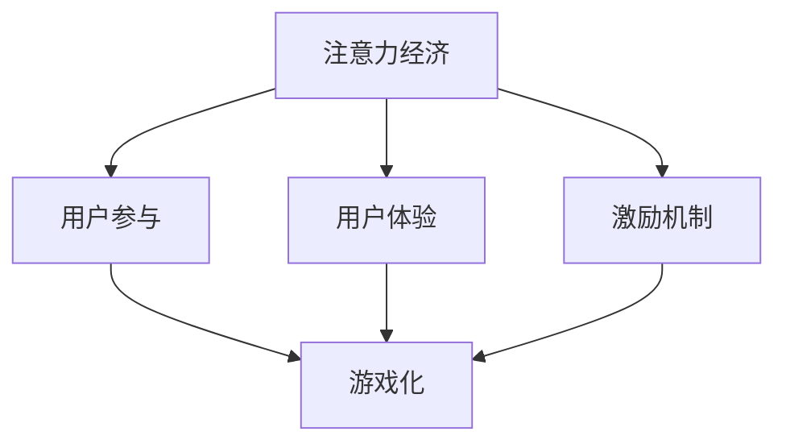

                 

关键词：注意力经济、游戏化、激励机制、用户参与、用户体验

> 摘要：在数字化的今天，用户注意力成为一种稀缺资源。本文将探讨如何通过游戏化的机制来吸引和维持用户的注意力，从而提高用户参与度和满意度。我们将从注意力经济的背景出发，深入分析游戏化技术及其在实际应用中的案例，最后讨论未来可能的发展趋势和挑战。

## 1. 背景介绍

随着互联网和移动设备的普及，用户注意力成为各大公司和平台争相争夺的宝贵资源。注意力经济（Attention Economy）这一概念由 skeptic.org 的创始人 Michiel de Klerk 在2006年提出，意指在数字时代，用户注意力成为一种可以量化并用于商业交易的商品。在这种经济模型下，企业的核心竞争力不再是产品的质量或价格，而是如何吸引并维持用户的注意力。

注意力经济的核心在于“吸引注意力”和“维持注意力”，而游戏化（Gamification）则为达成这一目标提供了一种有效途径。游戏化利用游戏中的激励机制，如积分、等级和奖励，将其应用于非游戏场景，以激发用户的参与兴趣和积极性。

### 1.1 注意力经济的起源与发展

注意力经济的概念起源于传统媒体时代，即广告商通过购买媒体时段来获取观众的注意力。随着互联网的发展，注意力经济逐渐演变，不再局限于媒体，而是涵盖了各种在线平台和应用。

### 1.2 游戏化的概念及其重要性

游戏化是一种设计方法，通过引入游戏元素和机制，使非游戏环境变得更加有趣、激励和参与。这种方法的成功在于其能够提高用户的参与度和满意度，从而在竞争激烈的市场中脱颖而出。

## 2. 核心概念与联系

为了更好地理解注意力经济和游戏化的联系，我们首先需要了解几个关键概念：用户参与、用户体验和激励机制。

### 2.1 用户参与

用户参与是指用户在使用产品或服务时，主动、积极、持续地参与其中的行为。游戏化通过设计引人入胜的游戏机制，如挑战、竞争和合作，来提高用户的参与度。

### 2.2 用户体验

用户体验（UX）是指用户在使用产品或服务过程中所感受到的整体体验。游戏化通过优化用户界面、简化操作流程和提供及时的反馈，来提升用户体验。

### 2.3 激励机制

激励机制是通过奖励和惩罚来影响用户行为的方法。游戏化利用积分、等级和徽章等游戏元素，来激励用户完成特定任务或达到特定目标。

### 2.4 Mermaid 流程图

下面是一个简单的 Mermaid 流程图，展示注意力经济与游戏化之间的联系：



## 3. 核心算法原理 & 具体操作步骤

### 3.1 算法原理概述

游戏化的核心算法主要基于以下几个原理：

1. **目标导向**：通过设定明确的、可达到的目标来引导用户参与。
2. **即时反馈**：通过即时反馈来增强用户的成就感，提高其积极性。
3. **竞争机制**：通过排名和竞争来激发用户的动力，提高参与度。
4. **社会认同**：通过社交分享和用户评价来增强用户的社会认同感。

### 3.2 算法步骤详解

1. **目标设定**：首先，需要明确用户参与的目标，可以是完成任务、达到某个等级或获得某种奖励。
2. **游戏化设计**：根据目标设计游戏化的机制，如积分系统、等级制度和奖励机制。
3. **用户参与**：通过用户界面和操作流程，引导用户参与游戏化活动。
4. **反馈与调整**：根据用户参与的数据和反馈，不断调整游戏化机制，以提高用户满意度。

### 3.3 算法优缺点

**优点**：

- **提高用户参与度**：通过游戏化的机制，可以显著提高用户的参与度和积极性。
- **增强用户忠诚度**：游戏化的机制有助于培养用户的忠诚度，增加用户粘性。
- **提升用户体验**：游戏化设计可以优化用户界面和操作流程，提高用户的整体体验。

**缺点**：

- **过度游戏化可能适得其反**：如果游戏化过度，可能会导致用户疲劳和反感。
- **可能忽视核心功能**：过分关注游戏化机制，可能会忽视产品或服务的核心功能。

### 3.4 算法应用领域

游戏化广泛应用于多个领域，包括：

- **在线教育**：通过游戏化的机制，提高学生的学习兴趣和参与度。
- **健康与健身**：通过游戏化的挑战和奖励，鼓励用户保持健康的生活方式。
- **企业管理**：通过游戏化的管理工具，提高员工的积极性和工作效率。

## 4. 数学模型和公式 & 详细讲解 & 举例说明

### 4.1 数学模型构建

游戏化的数学模型主要基于以下两个公式：

1. **用户参与度（Engagement）**：
   \[
   E = f(W, R, C, I)
   \]
   其中，\(W\) 是目标难度，\(R\) 是即时反馈，\(C\) 是竞争机制，\(I\) 是社会认同。

2. **用户体验（UX）**：
   \[
   UX = f(UI, PF, FB)
   \]
   其中，\(UI\) 是用户界面，\(PF\) 是操作流程，\(FB\) 是反馈机制。

### 4.2 公式推导过程

用户参与度的公式可以通过以下步骤推导：

- **目标难度（\(W\)）**：目标难度需要适中，既不过于简单也不过于复杂，以确保用户能够参与并感受到挑战。
- **即时反馈（\(R\)）**：即时反馈可以增强用户的成就感，提高其参与度。
- **竞争机制（\(C\)）**：竞争机制可以激发用户的竞争意识，提高其参与度。
- **社会认同（\(I\)）**：社会认同可以增强用户的社会归属感，提高其参与度。

用户体验的公式可以通过以下步骤推导：

- **用户界面（\(UI\)）**：用户界面需要简洁、直观，以提高用户的使用效率。
- **操作流程（\(PF\)）**：操作流程需要简单、流畅，以减少用户的操作成本。
- **反馈机制（\(FB\)）**：反馈机制需要及时、准确，以增强用户的满意度。

### 4.3 案例分析与讲解

以下是一个简单的案例，用于说明如何应用上述公式：

- **目标难度（\(W\)）**：设定一个每日步数目标，如8000步。
- **即时反馈（\(R\)）**：每完成一天的目标，用户可以获得一次小奖励，如虚拟货币。
- **竞争机制（\(C\)）**：用户可以与其他用户进行步数竞赛。
- **社会认同（\(I\)）**：用户可以在社交媒体上分享自己的步数和奖励。

通过上述设置，用户的参与度（\(E\)）和用户体验（\(UX\)）都可以得到显著提升。

## 5. 项目实践：代码实例和详细解释说明

### 5.1 开发环境搭建

为了演示游戏化的实现，我们将使用Python编程语言，并利用Flask框架构建一个简单的后端服务。

#### 步骤 1：安装Python和Flask

确保您的计算机上已安装Python 3.8及以上版本。然后，通过以下命令安装Flask：

```bash
pip install flask
```

### 5.2 源代码详细实现

以下是一个简单的Flask应用，用于实现一个积分系统。

```python
from flask import Flask, jsonify, request

app = Flask(__name__)

# 用户积分数据库
users = {
    "Alice": 0,
    "Bob": 0
}

# 任务列表
tasks = [
    {"id": 1, "description": "完成每日步数目标"},
    {"id": 2, "description": "阅读一篇文章"}
]

@app.route('/api/tasks', methods=['GET'])
def get_tasks():
    return jsonify(tasks)

@app.route('/api/users/<username>/score', methods=['GET'])
def get_user_score(username):
    return jsonify({"username": username, "score": users.get(username, 0)})

@app.route('/api/users/<username>/score', methods=['POST'])
def update_user_score(username):
    score = request.json.get('score', 0)
    users[username] = score
    return jsonify({"username": username, "score": score})

if __name__ == '__main__':
    app.run(debug=True)
```

### 5.3 代码解读与分析

- **任务列表**：我们定义了一个任务列表，其中包含两个简单的任务。
- **用户积分数据库**：我们使用一个简单的字典来存储用户的积分。
- **GET请求**：`get_tasks`函数用于获取任务列表。
- **POST请求**：`update_user_score`函数用于更新用户的积分。

### 5.4 运行结果展示

通过运行上述代码，我们可以使用curl或Postman等工具模拟用户行为：

```bash
# 获取任务列表
curl http://localhost:5000/api/tasks

# 获取Alice的积分
curl http://localhost:5000/api/users/Alice/score

# 更新Alice的积分
curl -X POST http://localhost:5000/api/users/Alice/score -H "Content-Type: application/json" -d '{"score": 100}'
```

## 6. 实际应用场景

### 6.1 在线教育

在线教育平台可以通过游戏化机制来提高学生的学习兴趣和参与度。例如，通过积分系统和等级制度，鼓励学生完成课程任务，并在社交平台上分享学习成果。

### 6.2 健康与健身

健康与健身应用可以通过游戏化机制来鼓励用户保持健康的生活方式。例如，通过步数挑战和奖励系统，激励用户每天走一定的步数，并通过社交分享功能增加用户的动力。

### 6.3 企业管理

企业管理工具可以通过游戏化机制来提高员工的工作积极性和工作效率。例如，通过团队积分系统和排行榜，鼓励员工完成特定的任务，并通过社交分享功能增加团队的凝聚力。

## 7. 工具和资源推荐

### 7.1 学习资源推荐

- 《游戏化设计实战》（Game-Based Marketing）
- 《游戏化：改变未来的设计思维》（The Gamification of Everything）

### 7.2 开发工具推荐

- **GameLift**：Amazon Web Services提供的一种游戏化服务，可用于构建和部署游戏化应用。
- **GameSparks**：提供游戏化框架和后端服务，方便开发者快速构建游戏化应用。

### 7.3 相关论文推荐

- Kapp, K. (2012). *The Gamification of Learning and Instruction: Game-Based Methods and Strategies for Training and Education*.
- Deterding, S., Khaled, R., & Nacke, L. (2011). *Gamification: Toward a New Research Field*. Springer.

## 8. 总结：未来发展趋势与挑战

### 8.1 研究成果总结

- 游戏化在提高用户参与度和满意度方面具有显著效果。
- 游戏化在不同领域的应用取得了不同程度的成功。
- 游戏化设计需要平衡游戏化程度与用户体验，以避免过度游戏化。

### 8.2 未来发展趋势

- 随着人工智能和大数据技术的发展，游戏化机制将更加智能化和个性化。
- 游戏化将与虚拟现实和增强现实技术相结合，提供更加沉浸式的用户体验。

### 8.3 面临的挑战

- 过度游戏化可能适得其反，降低用户满意度。
- 游戏化设计需要充分考虑用户的隐私和数据安全问题。

### 8.4 研究展望

- 未来研究应重点关注游戏化机制在不同场景下的适用性和效果。
- 需要开发更加智能化和个性化的游戏化工具，以提高用户体验和参与度。

## 9. 附录：常见问题与解答

### 9.1 什么是游戏化？

游戏化是一种设计方法，通过引入游戏元素和机制，使非游戏环境变得更加有趣、激励和参与。

### 9.2 游戏化为什么重要？

游戏化可以提高用户的参与度和满意度，从而在竞争激烈的市场中脱颖而出。

### 9.3 如何平衡游戏化与用户体验？

设计游戏化机制时，需要充分考虑用户体验，确保游戏化程度适中，避免过度游戏化。

作者：禅与计算机程序设计艺术 / Zen and the Art of Computer Programming
----------------------------------------------------------------

以上就是本文的完整内容。通过本文，我们深入探讨了注意力经济与游戏化之间的联系，分析了游戏化在提高用户参与度和满意度方面的作用，并探讨了其在不同领域的实际应用。未来，随着技术的发展，游戏化将变得更加智能化和个性化，为用户提供更加优质和有趣的使用体验。同时，我们也需要关注游戏化带来的挑战，如过度游戏化和用户隐私问题，以确保游戏化设计的可持续性和有效性。

