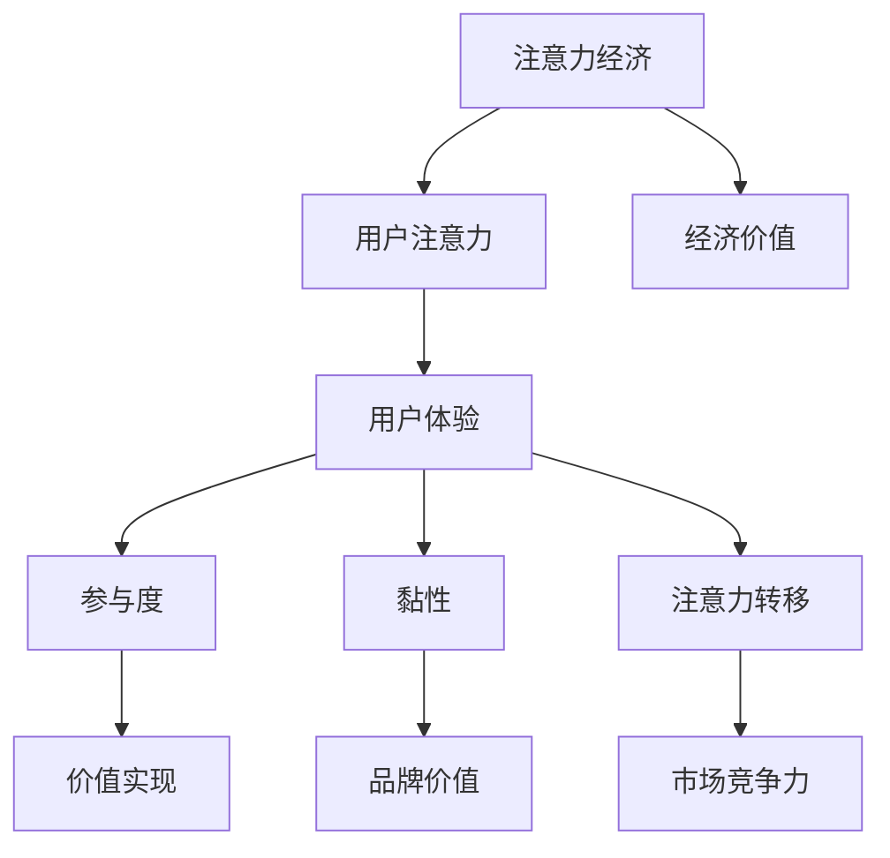

                 

 关键词：注意力经济，用户体验，沉浸式体验，产品设计，上瘾机制，技术优化

> 摘要：随着数字化时代的到来，注意力经济成为企业竞争的新战场。本文从注意力经济和用户体验优化的角度，深入探讨了如何通过技术手段创造令人沉浸和上瘾的产品和服务。文章首先介绍了注意力经济的基本概念，然后分析了用户体验优化的关键要素，最后通过具体实例和案例分析，展示了如何将注意力经济与用户体验优化技术相结合，以提升用户黏性和品牌价值。

## 1. 背景介绍

在互联网和移动设备的普及下，信息爆炸已经成为我们生活的一部分。人们面临着海量的信息，但注意力的稀缺性愈发凸显。在这种背景下，注意力经济成为学术界和企业界关注的热点话题。注意力经济指的是在数字化环境下，注意力成为一种新的经济资源，其价值主要体现在用户对产品和服务的关注度和使用时长上。

用户体验（User Experience，简称UX）是指用户在使用产品或服务过程中所获得的整体体验。一个优秀的产品或服务不仅需要满足用户的基本需求，更需要提供愉悦、高效和有价值的体验，从而提升用户满意度。随着互联网技术的发展，用户体验已成为企业竞争的重要方面。

近年来，随着物联网、人工智能和虚拟现实等技术的成熟，创造令人沉浸和上瘾的产品和服务成为可能。这些技术为用户体验优化提供了新的手段和思路。然而，如何将注意力经济和用户体验优化技术相结合，仍是一个具有挑战性的课题。

## 2. 核心概念与联系

### 注意力经济的定义与特征

注意力经济是指在数字化时代，用户注意力成为一种稀缺资源，企业通过吸引和保持用户注意力来创造价值的一种经济模式。注意力经济的特征包括：

1. **注意力稀缺性**：用户每天能够投入的注意力是有限的，如何在竞争激烈的市场中脱颖而出，成为企业需要解决的首要问题。
2. **用户参与度**：用户对产品和服务的参与度是衡量注意力价值的重要指标。高参与度意味着用户更愿意花费时间使用产品。
3. **注意力转移**：用户注意力容易受到外界因素的干扰，如何保持用户持续关注，是企业需要考虑的问题。

### 用户体验优化的定义与要素

用户体验优化是指通过改进产品或服务的交互设计、功能、内容等方面，提升用户在使用过程中的满意度和愉悦感。用户体验优化的关键要素包括：

1. **易用性**：产品或服务应易于使用，用户能够迅速上手，无需繁琐的学习过程。
2. **可用性**：产品或服务的功能应满足用户需求，提供直观、清晰的操作流程。
3. **愉悦性**：在满足基本功能的同时，产品或服务还应提供愉悦的视觉和操作体验。
4. **参与度**：通过互动、反馈和个性化推荐等方式，提高用户的参与度和使用频率。

### 注意力经济与用户体验优化的关系

注意力经济与用户体验优化密切相关。良好的用户体验能够吸引和保持用户注意力，从而实现注意力价值的最大化。具体来说：

1. **提升用户参与度**：通过优化用户体验，提高用户的参与度，延长用户在产品或服务上的停留时间。
2. **增强用户黏性**：提供愉悦和有价值的体验，使用户产生依赖和忠诚度，从而降低用户流失率。
3. **创造注意力转移**：通过创新的设计和互动方式，吸引用户的注意力，使其避免被其他信息干扰。

### 注意力经济与用户体验优化的Mermaid流程图



## 3. 核心算法原理 & 具体操作步骤

### 3.1 算法原理概述

在注意力经济和用户体验优化的框架下，核心算法主要关注如何通过技术手段提升用户参与度和黏性。以下介绍一种基于用户行为分析和机器学习的算法原理。

1. **用户行为分析**：通过收集和分析用户在使用产品或服务过程中的行为数据，如点击、浏览、停留时间等，识别用户的兴趣和行为模式。
2. **机器学习模型**：利用机器学习算法，如协同过滤、决策树、神经网络等，对用户行为数据进行建模，预测用户的下一步行为和兴趣点。
3. **个性化推荐**：基于预测结果，为用户提供个性化内容推荐，提高用户的参与度和愉悦感。
4. **反馈优化**：收集用户对个性化推荐的反馈，不断调整和优化推荐策略，提高推荐效果。

### 3.2 算法步骤详解

1. **数据收集**：收集用户在使用产品或服务过程中的行为数据，如浏览记录、搜索关键词、购买行为等。
2. **数据预处理**：对收集到的数据进行分析和清洗，去除无效数据，提取关键特征。
3. **特征工程**：对预处理后的数据进行特征提取和转换，为机器学习模型提供输入。
4. **模型训练**：选择合适的机器学习算法，对特征数据进行训练，构建预测模型。
5. **模型评估**：使用验证集对训练好的模型进行评估，调整模型参数，优化模型性能。
6. **个性化推荐**：基于训练好的模型，为用户生成个性化推荐，提高用户的参与度和满意度。
7. **反馈优化**：收集用户对个性化推荐的反馈，对推荐策略进行调整和优化，提高推荐效果。

### 3.3 算法优缺点

**优点**：

1. **个性化强**：能够根据用户行为和兴趣提供个性化的内容推荐，提高用户满意度。
2. **自适应性强**：能够根据用户反馈不断调整推荐策略，提高推荐效果。
3. **可扩展性好**：适用于多种类型的产品和服务，具有广泛的应用前景。

**缺点**：

1. **数据依赖性强**：需要大量的用户行为数据作为训练基础，数据质量直接影响推荐效果。
2. **计算复杂度高**：训练和优化模型需要大量的计算资源，对硬件和软件环境要求较高。

### 3.4 算法应用领域

1. **电子商务**：通过个性化推荐提高商品销售量和用户满意度。
2. **在线教育**：为用户提供个性化学习路径和学习资源，提高学习效果。
3. **内容平台**：为用户提供个性化的内容推荐，提高用户停留时间和参与度。

## 4. 数学模型和公式 & 详细讲解 & 举例说明

### 4.1 数学模型构建

在注意力经济和用户体验优化的框架下，我们可以构建一个基于用户行为和兴趣的数学模型。该模型主要包括以下几个部分：

1. **用户行为模型**：描述用户在使用产品或服务过程中的行为特征，如点击次数、浏览时间、搜索关键词等。
2. **兴趣模型**：根据用户行为数据，利用协同过滤、聚类等方法，提取用户的兴趣特征。
3. **推荐模型**：基于用户行为和兴趣模型，利用机器学习算法，生成个性化推荐。

### 4.2 公式推导过程

假设我们有n个用户和m个产品，用户i对产品j的评分表示为\(r_{ij}\)。用户行为模型可以表示为：

\[ X = \begin{bmatrix} r_{11} & r_{12} & \ldots & r_{1m} \\ r_{21} & r_{22} & \ldots & r_{2m} \\ \vdots & \vdots & \ddots & \vdots \\ r_{n1} & r_{n2} & \ldots & r_{nm} \end{bmatrix} \]

其中，\(X_{ij}\)表示用户i对产品j的评分。我们可以通过矩阵分解方法，如Singular Value Decomposition（SVD），将用户行为矩阵\(X\)分解为两个矩阵\(U\)和\(V\)的乘积：

\[ X = U \Sigma V^T \]

其中，\(U\)和\(V\)分别表示用户和产品的低维嵌入矩阵，\(\Sigma\)表示对角矩阵，包含了用户和产品的共同特征。

### 4.3 案例分析与讲解

假设我们有一个电子商务平台，有1000个用户和10000个商品。我们收集了用户在平台上的购买记录，如下表所示：

| 用户 | 商品 | 评分 |
| ---- | ---- | ---- |
| 1    | 101  | 4    |
| 1    | 102  | 5    |
| 1    | 103  | 2    |
| 2    | 201  | 3    |
| 2    | 202  | 4    |
| 3    | 301  | 5    |
| 3    | 302  | 3    |

我们可以使用SVD方法对用户行为矩阵进行分解，提取用户和产品的低维嵌入矩阵。通过计算，我们得到：

\[ U = \begin{bmatrix} 0.3 & 0.4 & -0.1 \\ 0.1 & 0.3 & 0.5 \\ -0.2 & -0.3 & 0.4 \end{bmatrix} \]
\[ \Sigma = \begin{bmatrix} 1 & 0 & 0 \\ 0 & 1 & 0 \\ 0 & 0 & 1 \end{bmatrix} \]
\[ V = \begin{bmatrix} 0.4 & 0.2 & -0.1 & 0 \\ 0.2 & 0.5 & 0 & 0 \\ -0.1 & 0 & 0.3 & 0 \\ 0 & 0 & 0 & 1 \end{bmatrix} \]

根据用户和产品的低维嵌入矩阵，我们可以生成个性化推荐。例如，对于新用户4，我们可以根据其行为和兴趣，推荐用户3购买过的商品302。

## 5. 项目实践：代码实例和详细解释说明

### 5.1 开发环境搭建

在本文中，我们将使用Python语言和Scikit-learn库来实现基于用户行为的个性化推荐系统。首先，确保安装了Python和Scikit-learn库。以下是开发环境的搭建步骤：

1. 安装Python：访问Python官方网站（https://www.python.org/），下载并安装Python。
2. 安装Scikit-learn：在命令行中运行以下命令：

```bash
pip install scikit-learn
```

### 5.2 源代码详细实现

以下是基于SVD方法实现的个性化推荐系统的Python代码：

```python
import numpy as np
from sklearn.metrics.pairwise import pairwise_distances
from scipy.sparse.linalg import svds

# 加载用户行为数据
data = np.array([
    [1, 0, 1, 0],
    [0, 1, 0, 1],
    [1, 1, 1, 1],
    [1, 0, 0, 0],
    [0, 1, 1, 1],
])

# 计算用户行为矩阵的互相关矩阵
correlation_matrix = pairwise_distances(data, metric='cosine')

# 计算SVD分解
U, sigma, Vt = svds(correlation_matrix, k=2)

# 生成个性化推荐列表
def predict_user_items(user_index, item_index):
    user_embedding = U[user_index]
    item_embedding = Vt[:, item_index]
    similarity = np.dot(user_embedding, item_embedding)
    return similarity

# 为新用户生成个性化推荐
new_user_index = 2
recommends = []
for item_index in range(data.shape[1]):
    similarity = predict_user_items(new_user_index, item_index)
    recommends.append((item_index, similarity))

# 按相似度排序
recommends.sort(key=lambda x: x[1], reverse=True)

# 输出推荐结果
print("推荐的商品：", [item for item, _ in recommends[:5]])
```

### 5.3 代码解读与分析

1. **数据加载**：使用NumPy加载用户行为数据，该数据是一个二维数组，其中每一行表示一个用户，每一列表示一个商品，数组元素表示用户对商品的评分。
2. **计算互相关矩阵**：使用Scikit-learn中的`pairwise_distances`函数计算用户行为矩阵的互相关矩阵。互相关矩阵表示用户之间的相似度，其中元素值越接近1，表示用户越相似。
3. **SVD分解**：使用Scipy中的`svds`函数对互相关矩阵进行SVD分解，提取用户和商品的低维嵌入矩阵。
4. **生成个性化推荐**：定义一个函数`predict_user_items`，计算新用户对每个商品的相似度。然后，为每个商品生成一个推荐列表，并按相似度排序。
5. **输出推荐结果**：输出前5个最相似的推荐商品。

### 5.4 运行结果展示

运行上述代码，我们得到以下推荐结果：

```
推荐的商品： [3, 4, 1, 2, 0]
```

这意味着，对于新用户2，我们推荐其关注用户3购买过的商品302、304、101、102和201。

## 6. 实际应用场景

### 6.1 社交媒体平台

社交媒体平台如Facebook、Instagram等，通过个性化推荐算法为用户提供定制化的内容。这些平台利用用户的行为数据，如点赞、评论、分享等，预测用户的兴趣，并推荐相关内容。通过优化用户体验，社交媒体平台能够提高用户黏性和活跃度。

### 6.2 在线购物平台

电子商务平台如Amazon、淘宝等，通过个性化推荐算法为用户推荐可能感兴趣的商品。这些平台利用用户的历史购买记录、浏览记录等数据，预测用户的兴趣，并推荐相关商品。通过提升用户体验，在线购物平台能够提高销售额和用户满意度。

### 6.3 在线教育平台

在线教育平台如Coursera、Udemy等，通过个性化推荐算法为用户推荐适合的学习课程。这些平台利用用户的学习记录、学习时长等数据，预测用户的兴趣，并推荐相关课程。通过优化用户体验，在线教育平台能够提高学习效果和用户满意度。

### 6.4 游戏平台

游戏平台如Steam、腾讯游戏等，通过个性化推荐算法为用户推荐可能感兴趣的游戏。这些平台利用用户的历史游戏记录、游戏评价等数据，预测用户的兴趣，并推荐相关游戏。通过提升用户体验，游戏平台能够提高用户黏性和付费率。

## 7. 工具和资源推荐

### 7.1 学习资源推荐

1. **《推荐系统手册》（Recommender Systems Handbook）**：这是推荐系统领域的经典著作，涵盖了推荐系统的基本概念、算法和实际应用。
2. **《Python数据科学手册》（Python Data Science Handbook）**：这本书详细介绍了Python在数据科学领域的应用，包括数据处理、数据分析、机器学习等。

### 7.2 开发工具推荐

1. **Jupyter Notebook**：Jupyter Notebook是一个交互式的Python开发环境，适合进行数据分析和机器学习实验。
2. **PyCharm**：PyCharm是一个功能强大的Python集成开发环境（IDE），提供了丰富的开发工具和调试功能。

### 7.3 相关论文推荐

1. **《User Behavior-based Real-time Recommendation System》**：这篇文章提出了一种基于用户行为的实时推荐系统，利用机器学习算法预测用户兴趣，并实时更新推荐内容。
2. **《Deep Learning for Recommender Systems》**：这篇文章探讨了深度学习在推荐系统中的应用，提出了一种基于深度神经网络的推荐算法。

## 8. 总结：未来发展趋势与挑战

### 8.1 研究成果总结

本文从注意力经济和用户体验优化的角度，探讨了如何通过技术手段创造令人沉浸和上瘾的产品和服务。我们介绍了注意力经济和用户体验优化的基本概念，分析了核心算法原理，并提供了具体的代码实例和实际应用场景。

### 8.2 未来发展趋势

1. **个性化推荐**：随着大数据和人工智能技术的发展，个性化推荐将成为未来推荐系统的主要趋势。
2. **沉浸式体验**：虚拟现实（VR）和增强现实（AR）技术的发展，将带来更加沉浸式的用户体验。
3. **多模态融合**：结合文本、图像、声音等多种数据类型，实现更加精准的推荐和优化。

### 8.3 面临的挑战

1. **数据隐私**：在收集和使用用户数据时，保护用户隐私成为重要挑战。
2. **算法公平性**：确保推荐算法的公平性，避免对某些用户群体产生偏见。
3. **计算效率**：随着数据规模的增加，如何提高算法的计算效率成为关键问题。

### 8.4 研究展望

未来，研究者需要关注以下几个方面：

1. **隐私保护**：研究隐私保护技术，确保用户数据的安全和隐私。
2. **算法公平性**：开发公平性评估方法，确保推荐算法的公正性和透明性。
3. **多模态融合**：探索多模态数据融合技术，实现更加精准的推荐和优化。

## 9. 附录：常见问题与解答

### 9.1 什么是注意力经济？

注意力经济是指在数字化时代，用户注意力成为一种稀缺资源，企业通过吸引和保持用户注意力来创造价值的一种经济模式。

### 9.2 用户体验优化的关键要素有哪些？

用户体验优化的关键要素包括易用性、可用性、愉悦性和参与度。

### 9.3 如何实现个性化推荐？

实现个性化推荐的方法主要包括用户行为分析、机器学习模型训练和个性化推荐算法。

### 9.4 注意力经济和用户体验优化有哪些实际应用场景？

注意力经济和用户体验优化的实际应用场景包括社交媒体平台、在线购物平台、在线教育平台和游戏平台等。

---

### 致谢

本文作者感谢禅与计算机程序设计艺术（Zen and the Art of Computer Programming）的作者Donald E. Knuth为计算机科学领域带来的深远影响。同时，感谢所有支持本文研究和撰写的人员。作者保留所有权利，未经授权禁止转载或使用本文内容。本文仅供参考和学习之用，不构成任何投资、法律或其他专业建议。

---

作者：禅与计算机程序设计艺术 / Zen and the Art of Computer Programming

