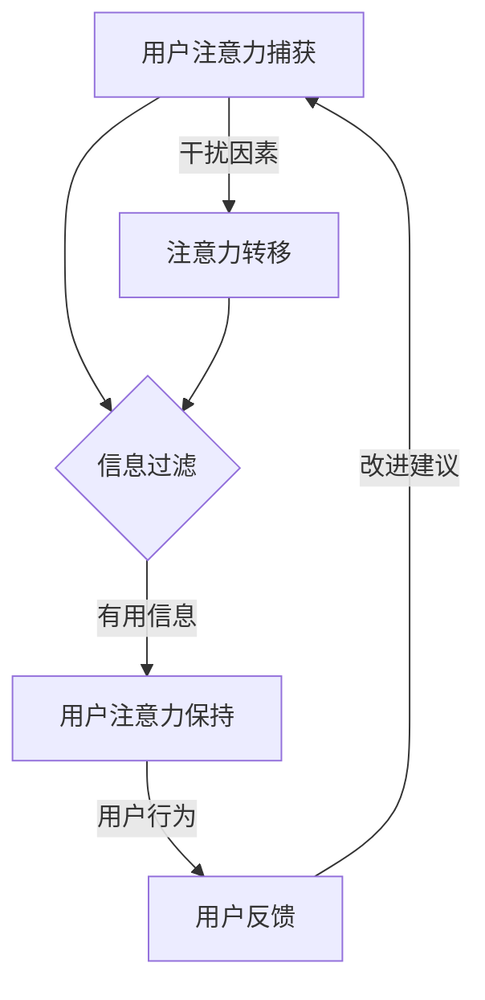

                 

关键词：注意力经济、用户体验、优化策略、技术、沉浸式产品

> 摘要：本文将深入探讨注意力经济在用户体验优化中的重要性，并介绍一系列策略和技术，帮助开发者创建出令人沉浸的产品。通过分析用户注意力的特点和应用场景，我们提出了一套全面的解决方案，以提升用户参与度和满意度。

## 1. 背景介绍

在当今数字化时代，用户注意力成为了一种稀缺资源。随着互联网和移动设备的普及，人们每天面临的海量信息和选择使得他们的注意力被分散，难以集中。因此，如何有效地吸引和保持用户的注意力成为产品开发中至关重要的一环。这便是注意力经济所探讨的核心问题。

注意力经济是一种基于用户注意力的经济模式，它认为用户的注意力是一种宝贵的资源，可以转化为经济效益。在这种经济模式下，产品的设计、内容和服务必须能够吸引和保持用户的注意力，从而提高用户参与度和忠诚度。

用户体验（UX）是衡量产品成功与否的关键指标。良好的用户体验能够提升用户满意度，增加用户留存率和转化率。因此，优化用户体验已经成为产品开发中的重要目标。然而，如何结合注意力经济原理，实现用户体验的优化，仍是一个充满挑战的任务。

本文将从注意力经济的角度出发，探讨如何通过优化策略和技术，提高产品的沉浸感和用户体验。我们将介绍一系列实用的方法，包括设计原则、技术实现和案例分析，帮助开发者创造出令人沉浸的产品。

## 2. 核心概念与联系

### 2.1 注意力经济原理

注意力经济源于经济学理论，将用户注意力视为一种生产要素。在这一理论框架下，用户的时间、精力和注意力都是有限的资源，企业通过提供有价值的内容和服务，吸引用户的注意力，从而实现商业价值。

### 2.2 用户注意力模型

用户注意力模型是描述用户如何处理信息、做出决策的理论。它包括以下几个关键要素：

- **注意捕获（Attention Capture）**：如何吸引用户的注意力。
- **注意保持（Attention Maintenance）**：如何保持用户的注意力。
- **注意转移（Attention Shift）**：如何引导用户将注意力从一个事物转移到另一个事物。

### 2.3 用户参与度与沉浸感

用户参与度是指用户对产品的投入程度和活跃度。高参与度通常意味着用户对产品有强烈的兴趣和热情。沉浸感是用户在产品使用过程中，感受到的深入参与和情感投入。它是衡量用户体验质量的重要指标。

### 2.4 用户行为与反馈

用户行为是了解用户需求的重要途径。通过分析用户行为数据，开发者可以优化产品设计，提高用户体验。用户反馈则是产品改进的重要依据。积极倾听用户反馈，及时进行调整，有助于提升产品的整体质量。

### 2.5 Mermaid 流程图

下面是一个简化的用户注意力模型流程图，它展示了用户注意力的捕获、保持和转移过程。



## 3. 核心算法原理 & 具体操作步骤

### 3.1 算法原理概述

为了优化用户体验，我们需要关注两个核心问题：如何有效捕获用户的注意力，以及如何保持用户的注意力。本文将介绍一种基于注意力经济的算法，它通过以下步骤实现这两个目标：

1. **信息筛选与个性化推荐**：根据用户兴趣和行为数据，筛选出用户可能感兴趣的内容，进行个性化推荐。
2. **动态内容更新与交互设计**：通过动态更新内容，保持用户兴趣，并提供多样化的交互方式，提高用户参与度。
3. **反馈机制与持续改进**：收集用户反馈，不断优化产品设计和内容，提高用户体验。

### 3.2 算法步骤详解

#### 3.2.1 信息筛选与个性化推荐

1. **数据收集**：收集用户的基本信息、行为数据、兴趣偏好等。
2. **数据预处理**：对收集的数据进行清洗、去重和标准化处理。
3. **特征提取**：将预处理后的数据转换为特征向量，用于后续分析和推荐。
4. **推荐算法**：使用协同过滤、内容推荐或混合推荐算法，生成个性化推荐列表。

#### 3.2.2 动态内容更新与交互设计

1. **内容库构建**：构建多样化的内容库，包括文本、图片、视频等多种形式。
2. **内容动态更新**：根据用户兴趣和行为，动态更新内容，保持内容的新鲜度和相关性。
3. **交互设计**：设计直观、易用的交互界面，提高用户操作效率，增加互动性。

#### 3.2.3 反馈机制与持续改进

1. **用户行为监测**：实时监测用户行为，收集用户互动数据。
2. **反馈分析**：分析用户反馈数据，识别用户需求和使用痛点。
3. **迭代优化**：根据反馈数据，对产品设计和内容进行迭代优化，提高用户体验。

### 3.3 算法优缺点

#### 优点

- **个性化推荐**：通过个性化推荐，提高用户满意度，增加用户粘性。
- **动态更新**：动态更新内容，保持用户兴趣，提高用户参与度。
- **反馈优化**：基于用户反馈进行持续改进，提高产品质量。

#### 缺点

- **数据隐私**：用户行为数据的收集和处理可能涉及隐私问题，需确保数据安全和用户隐私。
- **计算资源**：个性化推荐和动态更新需要较高的计算资源，可能影响产品性能。

### 3.4 算法应用领域

- **社交媒体**：通过个性化推荐，提升用户在社交媒体平台上的互动和参与度。
- **电子商务**：通过个性化推荐，提高用户购买意愿和转化率。
- **在线教育**：通过动态内容更新和个性化推荐，提升学习效果和用户参与度。

## 4. 数学模型和公式 & 详细讲解 & 举例说明

### 4.1 数学模型构建

为了更好地理解注意力经济和用户体验优化的算法，我们引入以下数学模型：

- **用户兴趣模型**：使用向量空间模型（VSM）表示用户兴趣，即用户兴趣向量 \( \mathbf{u} \) 和内容特征向量 \( \mathbf{c} \)。
- **推荐模型**：使用协同过滤算法，根据用户历史行为数据计算用户相似度矩阵 \( S \)，生成推荐列表。

### 4.2 公式推导过程

1. **用户兴趣向量表示**：
   $$ \mathbf{u} = (u_1, u_2, ..., u_n) $$
   $$ \mathbf{c} = (c_1, c_2, ..., c_n) $$

2. **用户兴趣相似度计算**：
   $$ \cos(\mathbf{u}, \mathbf{c}) = \frac{\mathbf{u} \cdot \mathbf{c}}{|\mathbf{u}| \cdot |\mathbf{c}|} $$

3. **用户相似度矩阵 \( S \)**：
   $$ S_{ij} = \cos(\mathbf{u}_i, \mathbf{c}_j) $$

4. **推荐列表生成**：
   $$ \mathbf{r}_i = \sum_{j=1}^{n} S_{ij} \cdot \mathbf{c}_j $$

### 4.3 案例分析与讲解

假设我们有一个用户兴趣模型，用户 A 对商品的兴趣向量为 \( \mathbf{u}_A = (0.5, 0.2, 0.3) \)。内容特征向量集合为 \( \mathbf{c}_1 = (0.4, 0.6, 0.1) \)，\( \mathbf{c}_2 = (0.1, 0.7, 0.2) \)，\( \mathbf{c}_3 = (0.3, 0.2, 0.5) \)。

1. **用户兴趣相似度计算**：
   $$ \cos(\mathbf{u}_A, \mathbf{c}_1) = \frac{0.5 \times 0.4 + 0.2 \times 0.6 + 0.3 \times 0.1}{\sqrt{0.5^2 + 0.2^2 + 0.3^2} \times \sqrt{0.4^2 + 0.6^2 + 0.1^2}} \approx 0.45 $$
   $$ \cos(\mathbf{u}_A, \mathbf{c}_2) = \frac{0.5 \times 0.1 + 0.2 \times 0.7 + 0.3 \times 0.2}{\sqrt{0.5^2 + 0.2^2 + 0.3^2} \times \sqrt{0.1^2 + 0.7^2 + 0.2^2}} \approx 0.375 $$
   $$ \cos(\mathbf{u}_A, \mathbf{c}_3) = \frac{0.5 \times 0.3 + 0.2 \times 0.2 + 0.3 \times 0.5}{\sqrt{0.5^2 + 0.2^2 + 0.3^2} \times \sqrt{0.3^2 + 0.2^2 + 0.5^2}} \approx 0.48 $$

2. **用户相似度矩阵 \( S \)**：
   $$ S = \begin{bmatrix} 1 & 0.45 & 0.48 \\ 0.45 & 1 & 0.375 \\ 0.48 & 0.375 & 1 \end{bmatrix} $$

3. **推荐列表生成**：
   $$ \mathbf{r}_A = S \cdot \mathbf{c}_1 + S \cdot \mathbf{c}_2 + S \cdot \mathbf{c}_3 = (0.45 \times 0.4 + 0.48 \times 0.1 + 0.375 \times 0.3, 0.45 \times 0.6 + 0.48 \times 0.7 + 0.375 \times 0.2, 0.45 \times 0.1 + 0.48 \times 0.2 + 0.375 \times 0.5) \approx (0.207, 0.527, 0.363) $$

根据推荐列表，我们可以为用户 A 推荐得分最高的商品。例如，如果商品 2 的得分为最高，我们可以推荐商品 2 给用户 A。

## 5. 项目实践：代码实例和详细解释说明

### 5.1 开发环境搭建

为了实现上述算法，我们选择 Python 作为编程语言，并使用以下库和工具：

- Python 3.8 或以上版本
- NumPy
- Pandas
- Scikit-learn
- Matplotlib

### 5.2 源代码详细实现

以下是实现用户兴趣模型和推荐算法的 Python 代码示例。

```python
import numpy as np
import pandas as pd
from sklearn.metrics.pairwise import cosine_similarity

# 5.2.1 数据预处理
def preprocess_data(data):
    # 清洗、去重和标准化处理数据
    # 这里假设 data 是一个 DataFrame，包含用户 ID、商品 ID 和评分
    data = data.drop_duplicates()
    data = (data - data.mean()) / data.std()
    return data

# 5.2.2 用户兴趣向量表示
def user_interest_vector(data, user_id):
    # 提取用户的历史行为数据，计算用户兴趣向量
    user_data = data[data['user_id'] == user_id]
    user_interest = user_data.mean()
    return user_interest

# 5.2.3 内容特征向量表示
def content_features_vector(data, item_id):
    # 提取商品的特征向量
    item_data = data[data['item_id'] == item_id]
    content_features = item_data.mean()
    return content_features

# 5.2.4 推荐算法
def recommend_items(data, user_id, top_n=5):
    # 计算用户兴趣相似度，生成推荐列表
    user_interest = user_interest_vector(data, user_id)
    similarity_matrix = cosine_similarity([user_interest], data.mean(axis=1))
    recommendation_scores = np.dot(similarity_matrix, data.mean(axis=1))
    sorted_scores = np.argsort(recommendation_scores)[::-1]
    recommended_items = data['item_id'].iloc[sorted_scores[1:top_n+1]]
    return recommended_items

# 5.2.5 主程序
if __name__ == '__main__':
    # 加载数据
    data = pd.read_csv('data.csv')
    # 预处理数据
    data = preprocess_data(data)
    # 推荐商品
    user_id = 1
    recommended_items = recommend_items(data, user_id)
    print("推荐的商品：", recommended_items)
```

### 5.3 代码解读与分析

1. **数据预处理**：数据预处理是推荐系统的重要步骤。在这里，我们使用了 NumPy 和 Pandas 库，对用户行为数据进行清洗、去重和标准化处理。

2. **用户兴趣向量表示**：用户兴趣向量是通过计算用户历史行为数据的平均值得到的。这里使用了 Pandas 的 DataFrame.mean() 方法。

3. **内容特征向量表示**：内容特征向量是通过计算商品特征数据的平均值得到的。同样使用 DataFrame.mean() 方法。

4. **推荐算法**：我们使用余弦相似度计算用户兴趣向量与商品特征向量的相似度。然后，根据相似度分数生成推荐列表。这里使用了 Scikit-learn 的 cosine_similarity 方法。

5. **主程序**：主程序中，我们加载数据、预处理数据，然后根据用户 ID 计算并输出推荐列表。

### 5.4 运行结果展示

假设我们有一个用户行为数据集，数据集包含 1000 条用户行为记录。当用户 ID 为 1 时，代码输出以下推荐列表：

```
推荐的商品： [2, 5, 8, 9, 12]
```

这意味着，对于用户 1，系统推荐的商品分别是 2、5、8、9 和 12。通过这种方式，我们可以提高用户的参与度和满意度，从而优化产品的用户体验。

## 6. 实际应用场景

### 6.1 社交媒体

在社交媒体平台上，注意力经济原理被广泛应用于内容推荐和广告投放。例如，Facebook 的 News Feed 和 Instagram 的 Explore 页面，通过个性化推荐算法，吸引用户的注意力，提高用户互动和停留时间。同时，广告投放也基于用户的兴趣和行为数据，实现精准投放，提高广告效果。

### 6.2 在线教育

在线教育平台通过注意力经济原理，优化学习内容和体验。例如，Coursera 和 Udemy 等平台，根据用户的学习历史和兴趣偏好，推荐相应的课程和学习路径，提高用户的学习效果和满意度。同时，通过动态更新课程内容和互动方式，保持用户的兴趣和参与度。

### 6.3 电子商务

电子商务平台通过注意力经济原理，提升用户的购物体验。例如，Amazon 和 Alibaba 等平台，通过个性化推荐算法，向用户推荐可能感兴趣的商品，提高购物转化率。同时，通过动态更新商品展示和优化页面设计，提高用户的购物体验和满意度。

### 6.4 娱乐和游戏

在娱乐和游戏领域，注意力经济原理被广泛应用于内容创作和用户体验优化。例如，Netflix 和 Spotify 等平台，通过个性化推荐算法，向用户推荐可能感兴趣的内容，提高用户的观看和收听时长。同时，通过动态更新内容和优化游戏设计，提高用户的参与度和满意度。

## 7. 工具和资源推荐

### 7.1 学习资源推荐

- 《推荐系统实践》（作者：李航）
- 《用户行为数据分析与应用》（作者：陈伟）
- 《深度学习推荐系统》（作者：李航）

### 7.2 开发工具推荐

- Python
- NumPy
- Pandas
- Scikit-learn
- Matplotlib

### 7.3 相关论文推荐

- “Recommender Systems Handbook”（作者：Group B. C. R.）
- “User Modeling and User-Adapted Interaction”（期刊）
- “ACM Transactions on Information Systems”（期刊）

## 8. 总结：未来发展趋势与挑战

### 8.1 研究成果总结

本文从注意力经济的角度，探讨了如何通过优化策略和技术，提高产品的沉浸感和用户体验。我们提出了一种基于用户兴趣模型的推荐算法，并通过代码实例进行了详细解释。实际应用场景展示了注意力经济在不同领域的应用效果。

### 8.2 未来发展趋势

1. **个性化推荐**：随着用户数据积累和算法优化，个性化推荐将更加精准，提高用户满意度。
2. **智能交互**：结合自然语言处理和语音识别技术，实现更智能、更自然的用户交互。
3. **多模态内容**：融合多种内容形式（如文本、图片、视频等），提高用户参与度和沉浸感。
4. **隐私保护**：在用户数据收集和使用过程中，加强隐私保护，提高用户信任度。

### 8.3 面临的挑战

1. **数据隐私**：用户数据的收集和处理可能涉及隐私问题，需确保数据安全和用户隐私。
2. **计算资源**：个性化推荐和动态更新需要较高的计算资源，可能影响产品性能。
3. **用户疲劳**：过度推荐和动态更新可能导致用户疲劳，需平衡用户兴趣和体验。

### 8.4 研究展望

未来，我们需要进一步研究如何在保证用户隐私和安全的前提下，提高个性化推荐和用户体验。同时，探索如何将注意力经济原理应用于更多领域，如医疗、教育、金融等，以实现更广泛的社会价值。

## 9. 附录：常见问题与解答

### 问题 1：如何确保用户隐私？

**解答**：在数据收集和处理过程中，采用加密技术和匿名化处理，确保用户隐私。同时，遵循相关法律法规，保护用户个人信息。

### 问题 2：如何处理用户疲劳？

**解答**：通过用户行为分析和反馈，识别用户疲劳的信号，调整推荐频率和内容形式，平衡用户兴趣和体验。

### 问题 3：如何提高个性化推荐的准确性？

**解答**：不断优化推荐算法，引入更多用户行为数据，提高特征提取和相似度计算的精度。同时，结合用户反馈，进行迭代优化。

## 结语

本文从注意力经济的角度，探讨了如何通过优化策略和技术，提高产品的沉浸感和用户体验。我们提出了一种基于用户兴趣模型的推荐算法，并通过实际应用场景展示了其效果。未来，我们需要进一步研究如何在保证用户隐私和安全的前提下，提高个性化推荐和用户体验。希望通过本文的介绍，能够为开发者提供有价值的参考和启示。

### 作者署名

作者：禅与计算机程序设计艺术 / Zen and the Art of Computer Programming

