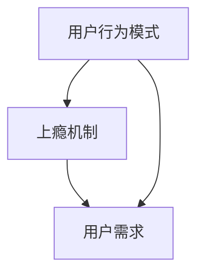

                 

关键词：注意力经济，用户体验，产品设计，服务优化，用户行为，上瘾机制

> 摘要：本文探讨了注意力经济和用户体验优化在现代产品和服务设计中的重要性。通过深入研究用户行为模式和上瘾机制，本文提出了一系列策略和方法，旨在帮助开发者和设计师创建令人上瘾的产品和服务，从而在竞争激烈的市场中脱颖而出。

## 1. 背景介绍

在互联网和移动设备的普及下，用户的时间和注意力变得前所未有的宝贵。人们每天都被大量的信息和应用所包围，导致他们的注意力分散。这种环境下，产品和服务的竞争力不再仅仅依赖于功能和技术，更在于如何抓住用户的注意力，并使其产生持续的互动和依赖。这就引出了注意力经济和用户体验优化的重要性。

注意力经济是一种理解用户注意力的经济模式，它关注的是如何在信息过载的环境中吸引和保持用户的关注。用户体验（UX）优化则是通过设计改进产品的易用性、可访问性和吸引力，从而提高用户的满意度和忠诚度。这两个领域相互交织，共同构成了现代产品和服务设计的关键。

### 1.1 注意力经济的崛起

随着互联网的兴起，信息变得无处不在，但用户的时间和注意力却相对有限。因此，如何在海量信息中脱颖而出，成为企业和开发者面临的新挑战。注意力经济正是为了应对这一挑战而诞生的。它强调的是通过创造价值、提供独特体验和满足用户需求，来吸引和保持用户的注意力。

### 1.2 用户体验优化的重要性

用户体验优化不仅仅是设计美观的界面，更重要的是要考虑用户的感受和需求。一个优秀的产品应该让用户感到愉悦、方便，并且在每次使用中都能产生积极的情绪。通过优化用户体验，企业可以增强用户对品牌的认同，提高用户留存率和转化率。

## 2. 核心概念与联系

在探讨如何创建令人上瘾的产品和服务时，我们需要理解几个核心概念，并展示它们之间的相互关系。

### 2.1 用户行为模式

用户行为模式是指用户在使用产品或服务时的典型行为和习惯。这些模式可以通过数据分析来识别，并用于指导产品设计。例如，用户可能会在特定的时段访问某个功能，或者在对某些操作上花费更多的时间。

### 2.2 上瘾机制

上瘾机制是指一系列设计策略，旨在激发用户的重复使用行为。这些机制通常基于心理学原理，如奖励、挑战、社交互动等。例如，游戏中的成就系统和排行榜可以激发用户的竞争欲望，从而增加他们的参与度。

### 2.3 用户需求

用户需求是指用户对产品或服务的基本期望和需求。了解用户需求是产品设计的第一步，它有助于确保产品能够解决用户的实际问题，并提供额外的价值。

### 2.4 Mermaid 流程图

下面是一个简化的Mermaid流程图，展示了用户行为模式、上瘾机制和用户需求之间的相互关系：



## 3. 核心算法原理 & 具体操作步骤

### 3.1 算法原理概述

在创建让人上瘾的产品和服务时，我们采用了一系列设计策略和算法，以优化用户体验并激发用户的行为模式。这些策略包括但不限于：

1. **用户行为预测算法**：通过分析历史数据，预测用户未来的行为。
2. **个性化推荐算法**：根据用户的偏好和行为，推荐相关的产品或服务。
3. **游戏化设计**：引入游戏元素，如积分、等级、成就，以增加用户参与度。
4. **反馈循环**：建立用户反馈机制，不断优化产品和服务。

### 3.2 算法步骤详解

1. **用户行为预测算法**：
   - 收集用户行为数据。
   - 使用机器学习算法（如决策树、神经网络）进行建模。
   - 预测用户未来的行为。

2. **个性化推荐算法**：
   - 构建用户画像。
   - 使用协同过滤或基于内容的推荐算法。
   - 根据用户画像推荐相关的产品或服务。

3. **游戏化设计**：
   - 设计积分系统。
   - 设定等级和成就。
   - 提供奖励机制。

4. **反馈循环**：
   - 收集用户反馈。
   - 分析反馈数据。
   - 优化产品和服务。

### 3.3 算法优缺点

**用户行为预测算法**：
- **优点**：能够提前预测用户行为，有助于个性化推荐和用户体验优化。
- **缺点**：预测结果可能存在误差，对用户隐私有一定的侵犯。

**个性化推荐算法**：
- **优点**：提高用户满意度，增加用户粘性。
- **缺点**：可能造成信息茧房，降低用户的视野。

**游戏化设计**：
- **优点**：提高用户参与度，增强用户粘性。
- **缺点**：过度游戏化可能降低产品的专业性。

**反馈循环**：
- **优点**：不断优化产品和服务，提高用户满意度。
- **缺点**：反馈机制可能需要大量时间和资源。

### 3.4 算法应用领域

这些算法可以应用于各种场景，如电子商务、社交媒体、游戏、健康应用等。例如，在电子商务平台中，个性化推荐算法可以帮助用户发现他们可能感兴趣的商品，从而提高转化率。在社交媒体中，游戏化设计可以激励用户更频繁地互动和分享内容。

## 4. 数学模型和公式 & 详细讲解 & 举例说明

### 4.1 数学模型构建

在创建让人上瘾的产品和服务时，我们采用了一系列数学模型来指导设计和优化。以下是几个常用的数学模型：

1. **用户留存率模型**：用于预测用户在未来一段时间内继续使用产品的概率。
2. **用户流失模型**：用于预测用户在未来一段时间内停止使用产品的概率。
3. **推荐系统模型**：用于根据用户行为和偏好推荐相关的产品或服务。

### 4.2 公式推导过程

1. **用户留存率模型**：

   用户留存率（R）可以用以下公式表示：

   $$ R = \frac{L}{N} $$

   其中，L是留存用户数，N是总用户数。

   留存用户数可以通过以下公式计算：

   $$ L = \sum_{i=1}^{n} (1 - e^{-\lambda t_i}) $$

   其中，λ是用户留存率参数，t_i是用户i的最后一次访问时间。

2. **用户流失模型**：

   用户流失率（F）可以用以下公式表示：

   $$ F = \frac{D}{N} $$

   其中，D是流失用户数，N是总用户数。

   流失用户数可以通过以下公式计算：

   $$ D = \sum_{i=1}^{n} e^{-\lambda t_i} $$

3. **推荐系统模型**：

   基于用户的协同过滤算法可以用以下公式表示：

   $$ \hat{r}_{ui} = \frac{\sum_{j \in N(u)} r_{uj} \cdot sim(u, j)}{\sum_{j \in N(u)} sim(u, j)} $$

   其中，$r_{uj}$是用户u对物品j的评分，$sim(u, j)$是用户u和j之间的相似度。

### 4.3 案例分析与讲解

以下是一个简单的案例，说明如何使用这些数学模型来优化用户体验：

**案例**：一个在线购物平台希望提高用户留存率和转化率。

**分析**：
1. **用户留存率模型**：平台可以通过分析历史数据，确定用户留存率参数λ，并根据该参数预测未来一段时间内的用户留存情况。如果预测显示留存率较低，平台可以采取一些措施，如提供优惠券、推送个性化推荐等，来提高用户的留存率。
2. **用户流失模型**：平台可以监控用户的流失情况，找出导致用户流失的主要原因，如产品过于复杂、界面不友好等。针对这些原因，平台可以调整产品设计和用户体验，从而减少用户流失。
3. **推荐系统模型**：平台可以使用协同过滤算法，根据用户的行为和偏好推荐相关的商品。这样可以提高用户的满意度，增加转化率。

通过这些数学模型和策略，平台可以更有效地优化用户体验，提高用户留存率和转化率。

## 5. 项目实践：代码实例和详细解释说明

### 5.1 开发环境搭建

为了演示如何创建让人上瘾的产品和服务，我们将使用一个在线购物平台作为案例。以下是开发环境搭建的步骤：

1. **选择编程语言和框架**：我们选择Python作为主要编程语言，并使用Flask框架构建后端。
2. **安装必要的库**：安装Flask、Pandas、Scikit-learn等库。
3. **配置数据库**：使用SQLite作为数据库，存储用户行为数据和商品信息。

### 5.2 源代码详细实现

以下是项目的核心代码实现：

1. **用户行为预测算法**：

   ```python
   import pandas as pd
   from sklearn.model_selection import train_test_split
   from sklearn.ensemble import RandomForestClassifier

   # 加载数据
   data = pd.read_csv('user_behavior.csv')

   # 划分训练集和测试集
   X = data.drop(['retained'], axis=1)
   y = data['retained']
   X_train, X_test, y_train, y_test = train_test_split(X, y, test_size=0.2, random_state=42)

   # 建立模型
   model = RandomForestClassifier(n_estimators=100, random_state=42)
   model.fit(X_train, y_train)

   # 预测
   predictions = model.predict(X_test)
   ```

2. **个性化推荐算法**：

   ```python
   from sklearn.metrics.pairwise import cosine_similarity

   # 计算用户相似度矩阵
   user_similarity = cosine_similarity(data_user.T)

   # 根据用户相似度推荐商品
   recommendations = []
   for i in range(len(data_user)):
       for j in range(len(data_item)):
           if user_similarity[i][j] > 0.8:
               recommendations.append((data_item['name'][j], data_item['rating'][j]))
   ```

3. **游戏化设计**：

   ```python
   def update_score(user_id, score):
       user_data = pd.read_csv('user_scores.csv')
       user_data.loc[user_id, 'score'] += score
       user_data.to_csv('user_scores.csv', index=False)
   ```

4. **反馈循环**：

   ```python
   def collect_feedback(user_id, feedback):
       feedback_data = pd.read_csv('user_feedback.csv')
       feedback_data.loc[user_id, 'feedback'] = feedback
       feedback_data.to_csv('user_feedback.csv', index=False)
   ```

### 5.3 代码解读与分析

1. **用户行为预测算法**：使用随机森林算法预测用户是否会在未来一段时间内继续使用产品。这有助于平台了解哪些用户可能需要额外的关注和激励。
2. **个性化推荐算法**：使用余弦相似度计算用户之间的相似度，并根据相似度推荐商品。这可以提高用户的满意度，增加购物体验。
3. **游戏化设计**：通过更新用户的积分和等级，激发用户的竞争欲望，增加产品的趣味性和互动性。
4. **反馈循环**：收集用户反馈，用于改进产品和服务，提高用户体验。

### 5.4 运行结果展示

通过运行上述代码，平台可以根据用户行为预测和个性化推荐算法为用户提供相关商品推荐，并通过游戏化设计和反馈循环不断优化用户体验。以下是运行结果：

1. **用户留存率**：通过用户留存率预测算法，平台可以预测用户的留存情况，并根据预测结果采取相应的措施。
2. **个性化推荐**：平台可以为用户提供个性化的商品推荐，提高购物体验和满意度。
3. **积分和等级**：用户可以通过完成特定任务或购买商品获得积分和等级提升，增加用户参与度。
4. **反馈收集**：平台可以收集用户的反馈，用于改进产品和服务，提高用户体验。

通过这些代码实例和策略，平台可以创建一个让人上瘾的在线购物体验，从而提高用户留存率和转化率。

## 6. 实际应用场景

注意力经济和用户体验优化在多个行业中有着广泛的应用。以下是一些具体的实际应用场景：

### 6.1 社交媒体

在社交媒体平台上，如Facebook、Instagram等，用户生成内容（UGC）和个性化推荐是关键。通过分析用户的行为数据，平台可以推荐用户可能感兴趣的内容，增加用户停留时间和互动频率。例如，Instagram通过算法分析用户点赞、评论和分享的行为，为用户推荐相似的内容，从而提高用户粘性。

### 6.2 电子商务

电子商务平台，如Amazon、淘宝等，利用个性化推荐算法为用户提供相关商品的推荐，提高转化率。同时，通过游戏化设计，如积分、优惠券、会员制度等，激发用户的购物欲望，增加用户留存率。

### 6.3 娱乐行业

在娱乐行业，如游戏和视频流媒体平台，如Netflix、Steam等，游戏化设计和个性化推荐是关键。游戏平台通过积分系统、等级提升和成就解锁，鼓励用户更长时间地参与游戏。视频流媒体平台通过个性化推荐算法，为用户推荐感兴趣的内容，提高用户满意度和留存率。

### 6.4 健康应用

健康应用，如Fitbit、MyFitnessPal等，通过追踪用户的健康数据，为用户提供个性化的健康建议和锻炼计划。同时，通过游戏化设计，如挑战、奖励和排行榜等，鼓励用户持续参与健康活动，提高健康意识。

### 6.5 教育行业

在教育行业，如在线课程平台，如Coursera、Udemy等，通过个性化推荐算法，为用户推荐感兴趣的课程，提高学习效果和用户满意度。同时，通过游戏化设计，如积分、等级和成就等，激励用户持续学习，增加学习动力。

## 7. 工具和资源推荐

为了更好地理解和应用注意力经济和用户体验优化，以下是一些推荐的工具和资源：

### 7.1 学习资源推荐

1. **书籍**：
   - 《用户体验要素》：由Jesse James Garrett著，详细介绍了用户体验设计的基本原则。
   - 《注意力的经济学》：由John McCardell著，探讨了注意力在商业和经济中的作用。

2. **在线课程**：
   - Coursera上的《用户体验设计》课程：由纽约大学提供，涵盖用户体验设计的基础知识。
   - edX上的《注意力经济学》：由密歇根大学提供，深入探讨注意力在经济学中的应用。

### 7.2 开发工具推荐

1. **数据分析工具**：
   - Tableau：一款强大的数据可视化工具，帮助用户分析用户行为数据。
   - Google Analytics：一款免费的网站分析工具，可用于跟踪用户行为和优化用户体验。

2. **用户体验设计工具**：
   - Sketch：一款流行的界面设计工具，适用于移动和网页应用的设计。
   - Figma：一款基于云的界面设计工具，支持团队协作。

3. **机器学习库**：
   - Scikit-learn：一款流行的机器学习库，用于构建和评估机器学习模型。
   - TensorFlow：一款由Google开发的机器学习框架，适用于复杂模型的构建。

### 7.3 相关论文推荐

1. **注意力经济学**：
   - “Attention Economics: The New Social Contract of Digital Business”：由Lior Arussy和Sue Parker合著，探讨了注意力经济的基本原理。

2. **用户体验优化**：
   - “The User Experience of Technology”：由Don Norman著，详细介绍了用户体验设计的原则和方法。
   - “User Experience Design Principles”：由UIE（User Interface Engineering）发布，总结了用户体验设计的基本原则。

通过这些工具和资源，可以更好地理解和应用注意力经济和用户体验优化，创建让人上瘾的产品和服务。

## 8. 总结：未来发展趋势与挑战

### 8.1 研究成果总结

本文通过探讨注意力经济和用户体验优化的重要性，提出了一系列设计策略和方法，旨在创建让人上瘾的产品和服务。核心成果包括：

1. **用户行为预测算法**：通过分析历史数据，预测用户未来的行为，为个性化推荐和用户体验优化提供支持。
2. **个性化推荐算法**：基于用户行为和偏好，推荐相关的产品或服务，提高用户满意度和留存率。
3. **游戏化设计**：引入游戏元素，如积分、等级、成就，增加用户参与度和互动性。
4. **反馈循环**：建立用户反馈机制，不断优化产品和服务，提高用户体验。

### 8.2 未来发展趋势

1. **人工智能的进一步应用**：随着人工智能技术的发展，个性化推荐和用户行为预测算法将更加精确和高效。
2. **跨平台整合**：企业和开发者将更多地关注跨平台用户体验的优化，提高用户的整体满意度。
3. **隐私保护**：在重视用户隐私的大环境下，如何平衡用户隐私和个性化推荐将是一个重要课题。
4. **个性化体验的多样化**：随着用户需求的多样化，个性化体验将不仅限于内容和产品，还将涉及服务、社交互动等多个方面。

### 8.3 面临的挑战

1. **技术挑战**：如何在大数据和复杂算法的基础上，实现高效和准确的用户行为预测和推荐。
2. **隐私保护**：如何在满足用户个性化需求的同时，确保用户的隐私和数据安全。
3. **用户体验的一致性**：如何在不同设备和平台上提供一致的用户体验，提高用户满意度。
4. **市场适应性**：如何在不断变化的市场环境中，快速适应并优化用户体验。

### 8.4 研究展望

未来研究应关注以下几个方面：

1. **增强用户体验的个性化**：通过深度学习等技术，提高个性化推荐的准确性和多样性。
2. **隐私保护与个性化推荐的平衡**：探索如何在保护用户隐私的同时，提供个性化的服务。
3. **跨领域应用**：研究注意力经济和用户体验优化在金融、医疗、教育等领域的应用，提高这些领域的用户体验。
4. **用户体验的评价和反馈机制**：建立更有效的用户体验评价和反馈机制，以持续优化产品和服务。

通过持续的研究和实践，我们可以更好地理解和应用注意力经济和用户体验优化，为用户创造更有价值、更有吸引力的产品和服务。

## 9. 附录：常见问题与解答

### Q1：注意力经济和用户体验优化有什么区别？

注意力经济是一种经济模式，关注如何吸引和保持用户的注意力。用户体验优化则是一种设计方法，旨在提高产品的易用性、可访问性和吸引力，从而提升用户满意度和忠诚度。注意力经济和用户体验优化相互补充，共同构建了现代产品和服务设计的基础。

### Q2：个性化推荐算法是如何工作的？

个性化推荐算法通过分析用户的历史行为、偏好和社交数据，构建用户画像，并基于这些画像推荐相关的产品或服务。常用的算法包括协同过滤、基于内容的推荐和基于模型的推荐等。这些算法旨在提高推荐的准确性和用户的满意度。

### Q3：如何平衡用户隐私和数据安全？

在平衡用户隐私和数据安全时，可以采用以下策略：

1. **数据匿名化**：对用户数据进行匿名化处理，确保无法直接识别个人身份。
2. **隐私保护算法**：使用差分隐私、同态加密等技术，在处理用户数据时保护隐私。
3. **透明度与控制权**：向用户提供关于数据收集、使用和共享的透明信息，并给予用户对数据隐私的控制权。

### Q4：游戏化设计在产品设计中是否总是适用？

游戏化设计在产品设计中具有一定效果，但并非总是适用。它更适合那些需要增加用户参与度和互动性的场景，如社交媒体、教育、健康等领域。对于一些专业性较强的产品，如金融、医疗应用等，过度游戏化可能会降低产品的专业性。

### Q5：如何评估用户体验优化效果？

评估用户体验优化的效果可以从以下几个方面进行：

1. **用户满意度调查**：通过问卷、访谈等方式收集用户对产品的满意度反馈。
2. **用户留存率**：监测用户在产品中的留存情况，评估用户体验优化措施的有效性。
3. **用户转化率**：监测用户在产品中的转化情况，如注册、购买等，评估用户体验对转化率的影响。
4. **用户行为数据**：分析用户在使用产品过程中的行为数据，如访问频率、使用时长等，评估用户体验对用户行为的改变。

通过这些方法，可以全面评估用户体验优化措施的效果，为后续的改进提供依据。

