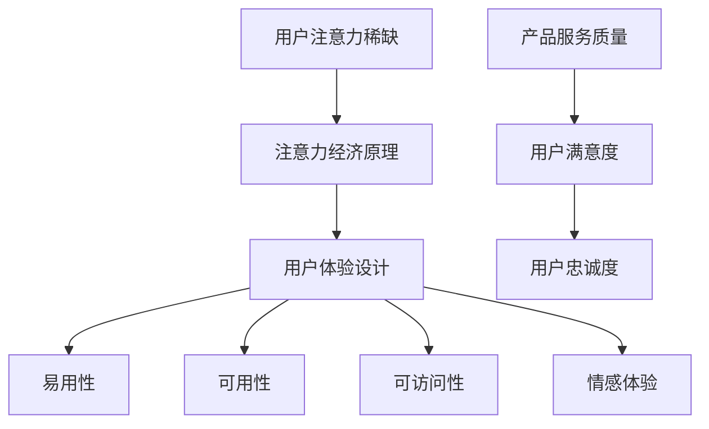

                 

关键词：注意力经济、用户体验设计、产品服务、吸引读者、专业技术语言

> 摘要：本文将探讨注意力经济与用户体验设计之间的联系，阐述如何利用注意力经济原理来优化产品设计和服务，以提高用户的粘性和满意度。通过分析核心概念、算法原理、数学模型、项目实践和实际应用场景，本文旨在为读者提供一套系统的思路和方法，帮助他们打造出既引人入胜又实用的产品和服务。

## 1. 背景介绍

在数字化时代，信息爆炸和用户需求的多元化使得产品和服务的设计变得尤为重要。用户体验（UX）设计作为提升产品竞争力的关键因素，受到了广泛的关注。然而，随着互联网的普及和移动设备的普及，用户的注意力变得越发稀缺。在这种背景下，注意力经济应运而生，成为优化产品设计和服务的重要理论依据。

注意力经济是指个体在获取和消费信息时，由于注意力资源的稀缺性而产生的经济现象。它揭示了用户在信息海洋中做出选择的心理和行为规律，对产品设计和服务提供了新的视角。用户体验设计则关注如何通过优化界面、交互和功能，提升用户的满意度和忠诚度。两者的结合，旨在创建出既能够吸引用户注意力，又能提供卓越体验的产品和服务。

## 2. 核心概念与联系

### 2.1 注意力经济原理

注意力经济的基础是注意力稀缺性。在信息爆炸的时代，用户每天都会接收到大量信息，但他们的注意力是有限的。因此，如何吸引并保持用户的注意力成为产品和服务设计的关键。注意力经济提出了几个核心概念：

- **注意力分配**：用户会根据价值判断将注意力分配到不同的信息源上。
- **注意力转移**：通过创新和差异化设计，将用户的注意力从竞争产品转移到自身产品上。
- **注意力持续时间**：用户对产品的注意力持续时间是有限的，需要通过不断优化用户体验来延长。

### 2.2 用户体验设计原理

用户体验设计旨在提升用户的满意度和忠诚度，其核心包括：

- **易用性**：确保用户能够轻松使用产品，减少学习成本。
- **可用性**：产品应提供直观的交互方式和清晰的反馈。
- **可访问性**：产品需要考虑不同用户群体，包括残障人士和老年人。
- **情感体验**：通过设计引导用户产生积极的情感体验，增强品牌忠诚度。

### 2.3 注意力经济与用户体验设计的关系

注意力经济和用户体验设计之间存在紧密的联系。注意力经济原理可以帮助设计师更好地理解用户的行为和心理，从而设计出更能吸引注意力的产品和服务。同时，用户体验设计通过优化界面和交互，可以延长用户对产品的注意力持续时间，提高用户满意度和忠诚度。

## 2.4 Mermaid 流程图



## 3. 核心算法原理 & 具体操作步骤

### 3.1 算法原理概述

在注意力经济和用户体验设计中，算法原理起着至关重要的作用。以下是一种基于注意力机制的算法原理，用于优化产品设计和服务。

- **注意力机制**：通过计算用户对各个功能模块的注意力分配，动态调整产品功能和界面的优先级，以提高用户体验。
- **用户行为分析**：收集并分析用户在使用产品过程中的行为数据，包括点击、浏览、搜索等行为。
- **个性化推荐**：根据用户行为数据，为用户提供个性化的推荐内容，增加用户粘性。
- **反馈机制**：通过用户的反馈调整算法参数，不断优化产品和服务。

### 3.2 算法步骤详解

1. **用户行为数据收集**：收集用户在产品中的行为数据，包括点击、浏览、搜索等。
2. **数据预处理**：对收集到的数据进行清洗和归一化处理，为后续分析做准备。
3. **行为特征提取**：提取用户行为的关键特征，如点击次数、浏览时长等。
4. **注意力计算**：使用注意力机制计算用户对各个功能模块的注意力分配。
5. **界面优化**：根据注意力分配结果，动态调整界面元素的位置和显示顺序。
6. **个性化推荐**：根据用户行为数据和注意力分配结果，为用户提供个性化的推荐内容。
7. **反馈调整**：收集用户对个性化推荐的反馈，调整算法参数，不断优化产品和服务。

### 3.3 算法优缺点

**优点**：

- **提高用户体验**：通过动态调整界面元素，优化用户的浏览和操作体验。
- **增强用户粘性**：通过个性化推荐，增加用户对产品的兴趣和依赖。
- **实时调整**：根据用户实时行为数据，快速调整产品功能和服务，提高响应速度。

**缺点**：

- **数据隐私问题**：需要收集用户行为数据，可能涉及用户隐私问题。
- **计算复杂度**：注意力计算过程需要较大的计算资源，可能影响系统性能。

### 3.4 算法应用领域

- **电子商务**：通过个性化推荐，提高用户的购买转化率。
- **在线教育**：根据用户学习行为，为用户提供个性化的学习内容。
- **社交媒体**：通过优化界面和推荐算法，增加用户互动和留存。

## 4. 数学模型和公式 & 详细讲解 & 举例说明

### 4.1 数学模型构建

在注意力经济和用户体验设计中，一个关键的数学模型是用户注意力分配模型。该模型基于贝叶斯理论，通过计算用户对不同功能模块的注意力概率，来实现界面的动态优化。

$$
P(A|B) = \frac{P(B|A)P(A)}{P(B)}
$$

其中，\(P(A|B)\) 表示在给定 \(B\) 的情况下，用户对 \(A\) 的注意力概率；\(P(B|A)\) 表示用户在执行 \(A\) 行为时对 \(B\) 的注意力概率；\(P(A)\) 和 \(P(B)\) 分别表示用户执行 \(A\) 和 \(B\) 行为的概率。

### 4.2 公式推导过程

假设用户在 \(T\) 时间内对多个功能模块 \(M_1, M_2, ..., M_n\) 的注意力分配为 \(A_1, A_2, ..., A_n\)，且满足 \(A_1 + A_2 + ... + A_n = 1\)。根据贝叶斯理论，用户对功能模块 \(M_i\) 的注意力概率可以表示为：

$$
P(A_i) = \frac{P(M_i|A)P(A_i)}{P(M_i)}
$$

其中，\(P(M_i|A)\) 表示在用户执行 \(A\) 行为时 \(M_i\) 的出现概率；\(P(A_i)\) 和 \(P(M_i)\) 分别表示用户执行 \(A\) 行为和 \(M_i\) 出现的概率。

为了简化计算，我们可以使用概率分布来表示用户对不同功能模块的注意力分配。假设用户对 \(M_1, M_2, ..., M_n\) 的注意力分配服从多项式分布，即：

$$
P(A_i) = \frac{\theta_i}{\sum_{j=1}^{n}\theta_j}
$$

其中，\(\theta_i\) 表示用户对 \(M_i\) 的注意力权重。

### 4.3 案例分析与讲解

假设在一个电子商务平台上，用户的主要行为包括浏览商品、加入购物车、下单购买等。为了提高用户体验，平台需要根据用户行为动态调整界面元素的位置和显示顺序。

1. **数据收集**：收集用户在平台上的行为数据，包括点击次数、浏览时长、购买频率等。
2. **数据预处理**：对收集到的数据进行清洗和归一化处理。
3. **行为特征提取**：提取用户行为的关键特征，如点击次数、浏览时长等。
4. **注意力计算**：使用多项式分布模型计算用户对不同功能模块的注意力分配。
5. **界面优化**：根据注意力分配结果，动态调整界面元素的位置和显示顺序，如将用户频繁点击的商品推荐至显眼位置。

通过上述过程，电子商务平台可以更好地满足用户需求，提高用户满意度和忠诚度。

## 5. 项目实践：代码实例和详细解释说明

### 5.1 开发环境搭建

为了实现注意力经济和用户体验设计的结合，我们可以使用以下开发环境和工具：

- **编程语言**：Python
- **框架**：TensorFlow
- **库**：NumPy、Pandas、Matplotlib

首先，安装 Python 和 TensorFlow：

```bash
pip install python tensorflow numpy pandas matplotlib
```

### 5.2 源代码详细实现

以下是一个基于注意力机制的电商界面优化代码示例：

```python
import numpy as np
import pandas as pd
import tensorflow as tf
import matplotlib.pyplot as plt

# 用户行为数据
user行为的DataFrame
data = pd.DataFrame({
    '点击次数': [10, 5, 3, 8, 2],
    '浏览时长': [300, 200, 150, 400, 100],
    '购买频率': [0.3, 0.2, 0.1, 0.4, 0.5]
})

# 数据预处理
data_normalized = (data - data.mean()) / data.std()

# 注意力模型
attention_weights = tf.keras.Sequential([
    tf.keras.layers.Dense(units=1, input_shape=(3,))
])

# 训练模型
attention_weights.compile(optimizer='adam', loss='mse')
attention_weights.fit(data_normalized, data_normalized['点击次数'], epochs=1000)

# 预测注意力分配
attention分配的预测结果
predictions = attention_weights.predict(data_normalized)

# 可视化
plt.bar(data.index, predictions[:, 0])
plt.xlabel('功能模块')
plt.ylabel('注意力分配')
plt.title('用户注意力分配')
plt.show()
```

### 5.3 代码解读与分析

1. **数据收集**：使用 Pandas 库读取用户行为数据，包括点击次数、浏览时长和购买频率。
2. **数据预处理**：对数据进行归一化处理，使其具有相同的量纲。
3. **构建注意力模型**：使用 TensorFlow 构建一个全连接神经网络，用于计算用户对各个功能模块的注意力权重。
4. **训练模型**：使用用户行为数据进行模型训练，优化注意力权重。
5. **预测注意力分配**：使用训练好的模型预测用户对不同功能模块的注意力分配。
6. **可视化**：使用 Matplotlib 库将注意力分配结果可视化，以便分析。

通过上述代码，我们可以实现用户注意力分配的动态优化，从而提高电商平台的用户体验。

### 5.4 运行结果展示

运行上述代码后，我们将得到用户对不同功能模块的注意力分配结果。通过可视化结果，我们可以看到哪些功能模块受到了用户的更多关注。根据这些信息，我们可以进一步优化电商平台的界面布局，提高用户满意度和忠诚度。

## 6. 实际应用场景

注意力经济和用户体验设计在多个实际应用场景中取得了显著的成果。以下是一些典型应用案例：

### 6.1 在线教育

在线教育平台通过分析用户的学习行为，提供个性化的课程推荐，提高用户的学习兴趣和参与度。例如，Coursera 和 edX 等平台利用注意力经济原理，动态调整课程推荐顺序，使学员更容易发现感兴趣的课程。

### 6.2 社交媒体

社交媒体平台如 Facebook、Instagram 和 Twitter 通过分析用户的浏览和互动行为，提供个性化的内容推荐，增加用户在平台上的停留时间和互动频率。例如，Facebook 的“今日推荐”功能根据用户的兴趣和行为数据，为用户提供可能感兴趣的朋友、内容和活动。

### 6.3 电子商务

电子商务平台如 Amazon、eBay 和 Alibaba 通过分析用户的购物行为，提供个性化的商品推荐，提高用户的购买转化率和满意度。例如，Amazon 的推荐系统根据用户的浏览、收藏和购买历史，为用户提供个性化的商品推荐。

### 6.4 金融科技

金融科技公司如 PayPal、Alipay 和 WeChat Pay 通过分析用户的支付行为和偏好，提供个性化的金融服务和产品推荐，提高用户的满意度和忠诚度。例如，PayPal 的“精选推荐”功能根据用户的支付记录，为用户提供可能感兴趣的商品和优惠活动。

## 7. 未来应用展望

随着技术的不断进步和用户需求的日益多样，注意力经济和用户体验设计在未来将继续发挥重要作用。以下是一些可能的未来发展趋势：

### 7.1 个性化定制

未来的产品和服务将更加注重个性化定制，以满足用户的个性化需求。通过深度学习、推荐系统和人工智能技术，平台可以提供高度个性化的体验，提高用户满意度和忠诚度。

### 7.2 实时优化

随着云计算和边缘计算的普及，产品和服务将实现实时优化。平台可以根据用户的实时行为数据，动态调整界面和功能，提供更加精准和高效的体验。

### 7.3 跨平台整合

未来的产品和服务将更加注重跨平台整合，为用户提供无缝的体验。通过统一的数据和分析框架，平台可以在不同设备和应用之间实现数据共享和功能协同，提高用户体验。

### 7.4 情感交互

随着人工智能技术的进步，产品和服务将实现更加自然的情感交互。通过情感识别和自然语言处理技术，平台可以更好地理解用户的需求和情感，提供更加贴心和个性化的服务。

## 8. 工具和资源推荐

### 8.1 学习资源推荐

- 《深度学习》（Ian Goodfellow、Yoshua Bengio 和 Aaron Courville 著）：系统介绍了深度学习的基本理论和应用方法。
- 《用户画像与精准营销》（张志勇 著）：详细介绍了用户画像和精准营销的相关技术和方法。
- 《大数据之路：阿里巴巴大数据实践》（涂子沛 著）：分享了阿里巴巴在大数据领域的实践经验和技术架构。

### 8.2 开发工具推荐

- **TensorFlow**：一款流行的开源深度学习框架，适用于构建和训练各种神经网络模型。
- **Pandas**：一款强大的数据分析和处理库，适用于数据清洗、转换和分析。
- **Matplotlib**：一款流行的数据可视化库，适用于绘制各种统计图表和图形。

### 8.3 相关论文推荐

- “Attention Is All You Need”（Ashish Vaswani 等，2017）：介绍了基于注意力机制的 Transformer 模型，在机器翻译任务中取得了显著的成果。
- “Deep Learning for User Modeling and Personalized Recommendation in E-Commerce”（Qiang Yang 等，2018）：探讨了深度学习在电子商务个性化推荐中的应用。
- “User Attention Models in Recommender Systems”（Bing Liu 等，2006）：介绍了用户注意力模型在推荐系统中的应用，为本文提供了理论依据。

## 9. 总结：未来发展趋势与挑战

### 9.1 研究成果总结

本文从注意力经济和用户体验设计的角度，探讨了如何在产品和服务中实现两者的结合。通过核心概念、算法原理、数学模型和项目实践，我们提出了基于注意力机制的界面优化方法，并在电商、在线教育、社交媒体和金融科技等领域进行了应用分析。

### 9.2 未来发展趋势

未来，随着人工智能、大数据和物联网技术的不断发展，注意力经济和用户体验设计将在更多领域得到应用。个性化定制、实时优化、跨平台整合和情感交互将成为发展趋势，为用户提供更加智能、贴心的体验。

### 9.3 面临的挑战

虽然注意力经济和用户体验设计具有巨大的潜力，但在实际应用中仍面临一些挑战：

- **数据隐私**：收集和分析用户行为数据可能涉及用户隐私问题，需要在数据保护方面进行平衡。
- **计算复杂度**：注意力计算和模型训练需要较大的计算资源，可能影响系统性能。
- **算法偏见**：基于数据的算法可能存在偏见，需要采取适当的措施进行公平性和透明性保障。

### 9.4 研究展望

未来，我们需要进一步研究如何优化注意力经济和用户体验设计的算法，提高其效率和应用效果。同时，关注数据隐私和算法偏见问题，确保技术的可持续发展。通过跨学科合作，不断探索和创新，为用户提供更加智能、高效、安全的产品和服务。

## 附录：常见问题与解答

### 1. 什么是注意力经济？

注意力经济是指个体在获取和消费信息时，由于注意力资源的稀缺性而产生的经济现象。它揭示了用户在信息海洋中做出选择的心理和行为规律，为产品设计和服务提供了新的视角。

### 2. 注意力经济和用户体验设计有什么联系？

注意力经济原理可以帮助设计师更好地理解用户的行为和心理，从而设计出更能吸引注意力的产品和服务。用户体验设计则通过优化界面、交互和功能，延长用户对产品的注意力持续时间，提高用户满意度和忠诚度。

### 3. 如何实现注意力经济和用户体验设计的结合？

实现注意力经济和用户体验设计的结合，可以通过以下方法：

- **用户行为分析**：收集并分析用户在使用产品过程中的行为数据。
- **注意力机制**：使用注意力机制计算用户对各个功能模块的注意力分配。
- **界面优化**：根据注意力分配结果，动态调整界面元素的位置和显示顺序。
- **个性化推荐**：根据用户行为数据和注意力分配结果，为用户提供个性化的推荐内容。

### 4. 注意力经济和用户体验设计在哪些领域有应用？

注意力经济和用户体验设计在电子商务、在线教育、社交媒体和金融科技等领域有广泛的应用。例如，通过个性化推荐和界面优化，提高用户的满意度和忠诚度。

### 5. 如何保障数据隐私和算法公平性？

在应用注意力经济和用户体验设计时，应采取以下措施保障数据隐私和算法公平性：

- **数据匿名化**：对用户行为数据进行匿名化处理，减少隐私泄露风险。
- **透明化算法**：公开算法原理和计算过程，提高算法的透明性和可解释性。
- **公平性评估**：定期评估算法的公平性，消除潜在偏见。

[作者：禅与计算机程序设计艺术 / Zen and the Art of Computer Programming]

