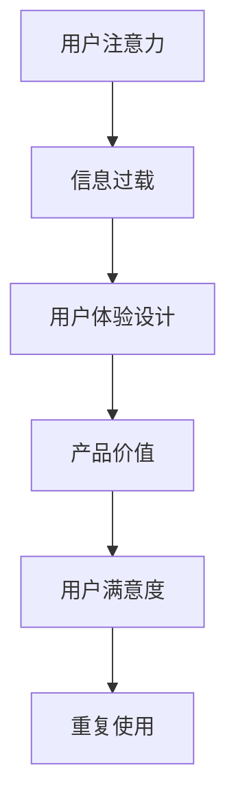

                 

### 1. 背景介绍

随着科技的飞速发展，人们的生活越来越离不开各种电子产品。智能手机、平板电脑、互联网、社交媒体等，已经成为我们日常生活中不可或缺的一部分。然而，这些高科技产品也在不知不觉中改变了我们的行为和思维方式。我们越来越容易受到外界干扰，注意力变得分散，很难专注于一项任务。这种现象在学术界被称为“注意力稀缺”（Attention scarcity）。

“注意力经济”是指在一个信息过载的时代，用户的时间和注意力成为一种稀缺资源，企业和个人如何利用有限的注意力资源来实现经济利益的一种经济模式。在这种经济模式下，提升用户体验（UX）和用户满意度成为企业竞争的关键。用户体验设计（User Experience Design，简称UXD）作为一种设计学科，旨在创建对用户吸引力和易用性强的产品和服务。

本文旨在探讨注意力经济与用户体验设计的关联，分析当前市场上的成功产品，并探讨如何通过用户体验设计来增强用户注意力，提高产品吸引力和用户满意度。

### 2. 核心概念与联系

#### 2.1 注意力经济的定义

注意力经济是一种利用用户注意力的经济模式。在注意力经济中，用户的时间、精力和注意力成为一种宝贵的资源。企业和个人通过吸引和保持用户的注意力来创造价值和利润。注意力经济的关键在于如何提供有价值的内容或服务，以吸引用户的注意力，并使他们在产品或服务上投入更多的时间和资源。

#### 2.2 用户体验设计的定义

用户体验设计是一种设计学科，旨在创建对用户吸引力和易用性强的产品和服务。用户体验设计关注用户的需求、感受和行为，通过系统化和结构化的方法，确保产品或服务能够满足用户的需求，提高用户满意度。

#### 2.3 注意力经济与用户体验设计的联系

注意力经济与用户体验设计有着密切的联系。用户体验设计的目标之一是提高产品的吸引力和用户满意度，从而吸引用户的注意力。在一个信息过载的时代，用户体验设计尤为重要，因为它可以帮助产品在众多竞争者中脱颖而出。优秀的用户体验设计能够提供有价值的内容或服务，吸引用户的注意力，并使他们在产品或服务上投入更多的时间和资源。

#### 2.4 关联流程图

以下是一个简化的注意力经济与用户体验设计的关联流程图：



在这个流程图中，用户注意力是起点，信息过载是一个挑战，用户体验设计是一个解决方案，通过提高产品价值、用户满意度，最终实现用户的重复使用。

### 3. 核心算法原理 & 具体操作步骤

#### 3.1 算法原理概述

在用户体验设计中，核心算法原理主要包括以下几点：

1. **用户行为分析**：通过对用户行为的数据分析，了解用户的需求、习惯和偏好，从而为产品提供个性化的服务。
2. **反馈循环**：通过用户的反馈，不断优化产品，提高用户体验。
3. **注意力管理**：利用用户注意力经济的原理，通过内容编排、界面设计等手段，吸引用户的注意力，提高产品的吸引力。
4. **情感连接**：通过情感设计，建立用户与产品之间的情感连接，提高用户的忠诚度。

#### 3.2 算法步骤详解

1. **用户行为分析**：
   - 收集用户数据：包括用户行为、偏好、反馈等。
   - 数据处理：对收集到的用户数据进行清洗、分析和建模。
   - 用户画像：根据分析结果，为每个用户创建一个详细的用户画像。

2. **反馈循环**：
   - 用户反馈收集：通过问卷、反馈表、用户评论等方式收集用户反馈。
   - 反馈处理：对用户反馈进行分析，识别问题和改进机会。
   - 产品迭代：根据反馈结果，对产品进行改进和优化。

3. **注意力管理**：
   - 内容编排：根据用户画像，为用户提供有价值、个性化的内容。
   - 界面设计：通过视觉设计、交互设计等手段，提高产品的吸引力和易用性。
   - 互动设计：通过游戏化元素、社交分享等手段，提高用户的参与度。

4. **情感连接**：
   - 情感识别：利用自然语言处理、情感分析等技术，识别用户的情感状态。
   - 情感设计：根据用户情感状态，提供相应的情感反馈和互动。
   - 情感连接：通过持续的情感互动，建立用户与产品之间的情感连接。

#### 3.3 算法优缺点

1. **优点**：
   - 提高用户体验：通过用户行为分析和个性化服务，提供更符合用户需求的产品。
   - 提高用户满意度：通过反馈循环和产品迭代，不断优化产品，提高用户满意度。
   - 提高产品价值：通过注意力管理和情感连接，提高产品的吸引力和用户忠诚度。

2. **缺点**：
   - 数据隐私问题：用户行为分析和个性化服务可能会涉及到用户隐私问题。
   - 成本问题：构建和优化用户体验系统需要大量的时间和资金投入。
   - 技术挑战：用户行为分析和情感识别等技术仍处于发展阶段，存在一定的技术挑战。

#### 3.4 算法应用领域

用户体验设计算法在多个领域都有广泛应用，包括：

- **电子商务**：通过用户行为分析和个性化推荐，提高用户的购物体验和满意度。
- **社交媒体**：通过情感分析和社交互动，提高用户的参与度和忠诚度。
- **游戏**：通过游戏化元素和情感设计，提高用户的游戏体验和留存率。
- **金融**：通过用户行为分析和风险控制，提高金融产品的用户体验和安全性。

### 4. 数学模型和公式 & 详细讲解 & 举例说明

#### 4.1 数学模型构建

用户体验设计的核心是满足用户需求，提高用户满意度。我们可以使用以下数学模型来构建用户体验：

\[ \text{用户体验} = f(\text{用户需求}, \text{产品功能}, \text{用户行为}) \]

其中，用户需求、产品功能和用户行为是构建用户体验的关键因素。

#### 4.2 公式推导过程

1. **用户需求**：

\[ \text{用户需求} = f(\text{功能需求}, \text{情感需求}, \text{社交需求}) \]

2. **产品功能**：

\[ \text{产品功能} = f(\text{核心功能}, \text{辅助功能}, \text{用户体验优化功能}) \]

3. **用户行为**：

\[ \text{用户行为} = f(\text{浏览行为}, \text{互动行为}, \text{留存行为}) \]

将上述三个因素代入用户体验公式，得到：

\[ \text{用户体验} = f(f(\text{功能需求}, \text{情感需求}, \text{社交需求}), f(\text{核心功能}, \text{辅助功能}, \text{用户体验优化功能}), f(\text{浏览行为}, \text{互动行为}, \text{留存行为})) \]

#### 4.3 案例分析与讲解

以一款社交媒体应用为例，分析用户体验设计的数学模型。

1. **用户需求**：

   - 功能需求：发布内容、浏览内容、关注好友。
   - 情感需求：获得认可、表达自我、获得陪伴。
   - 社交需求：建立社交关系、分享生活、获取信息。

2. **产品功能**：

   - 核心功能：发布内容、浏览内容、关注好友。
   - 辅助功能：消息推送、社交互动、个性化推荐。
   - 用户体验优化功能：界面设计、交互设计、情感设计。

3. **用户行为**：

   - 浏览行为：浏览内容、关注好友动态。
   - 互动行为：点赞、评论、分享。
   - 留存行为：持续使用、邀请好友。

根据上述数据，构建用户体验：

\[ \text{用户体验} = f(f(\text{功能需求}, \text{情感需求}, \text{社交需求}), f(\text{核心功能}, \text{辅助功能}, \text{用户体验优化功能}), f(\text{浏览行为}, \text{互动行为}, \text{留存行为})) \]

通过分析用户需求和产品功能，我们可以优化用户体验，提高用户满意度。例如，通过情感设计，为用户提供个性化的内容推荐，满足用户的情感需求；通过优化界面设计和交互设计，提高产品的易用性和吸引力。

### 5. 项目实践：代码实例和详细解释说明

#### 5.1 开发环境搭建

为了更好地展示用户体验设计在项目实践中的应用，我们将使用Python编程语言和Jupyter Notebook作为开发环境。首先，确保你已经安装了Python和Jupyter Notebook。如果没有安装，可以访问Python官网下载并安装。

安装完毕后，打开Jupyter Notebook，创建一个新的笔记本，然后按照以下步骤安装所需的库：

```bash
!pip install pandas numpy matplotlib
```

#### 5.2 源代码详细实现

在本节中，我们将使用Python实现一个简单的用户行为分析系统，以分析用户的浏览行为、互动行为和留存行为，并构建用户画像。

首先，导入所需的库：

```python
import pandas as pd
import numpy as np
import matplotlib.pyplot as plt
```

接下来，读取用户行为数据：

```python
data = pd.read_csv("user_behavior_data.csv")
```

假设用户行为数据包含以下字段：用户ID、行为类型、行为时间、行为内容。

然后，对数据进行分析：

```python
# 计算用户浏览次数
browser_count = data[data["行为类型"] == "浏览"].groupby("用户ID").size()

# 计算用户互动次数
interaction_count = data[data["行为类型"] == "互动"].groupby("用户ID").size()

# 计算用户留存次数
retention_count = data[data["行为类型"] == "留存"].groupby("用户ID").size()
```

接下来，构建用户画像：

```python
user_profile = pd.DataFrame({
    "用户ID": browser_count.index,
    "浏览次数": browser_count.values,
    "互动次数": interaction_count.values,
    "留存次数": retention_count.values
})
```

#### 5.3 代码解读与分析

1. **数据读取**：

   ```python
   data = pd.read_csv("user_behavior_data.csv")
   ```

   这一行代码使用Pandas库读取用户行为数据。数据文件应包含用户ID、行为类型、行为时间和行为内容等字段。

2. **用户行为分析**：

   ```python
   browser_count = data[data["行为类型"] == "浏览"].groupby("用户ID").size()
   interaction_count = data[data["行为类型"] == "互动"].groupby("用户ID").size()
   retention_count = data[data["行为类型"] == "留存"].groupby("用户ID").size()
   ```

   这些代码分别计算了用户的浏览次数、互动次数和留存次数。通过`groupby`函数，我们将数据按照用户ID分组，并计算每个用户的浏览、互动和留存次数。

3. **构建用户画像**：

   ```python
   user_profile = pd.DataFrame({
       "用户ID": browser_count.index,
       "浏览次数": browser_count.values,
       "互动次数": interaction_count.values,
       "留存次数": retention_count.values
   })
   ```

   这行代码将计算得到的用户浏览次数、互动次数和留存次数整合到一个DataFrame中，形成用户画像。

#### 5.4 运行结果展示

1. **浏览次数分布**：

   ```python
   browser_count.hist(bins=50)
   plt.xlabel("浏览次数")
   plt.ylabel("用户数")
   plt.title("用户浏览次数分布")
   plt.show()
   ```

   这段代码使用matplotlib库绘制了用户浏览次数的直方图，展示了不同浏览次数的用户分布。

2. **互动次数分布**：

   ```python
   interaction_count.hist(bins=50)
   plt.xlabel("互动次数")
   plt.ylabel("用户数")
   plt.title("用户互动次数分布")
   plt.show()
   ```

   类似地，这段代码绘制了用户互动次数的直方图。

3. **留存次数分布**：

   ```python
   retention_count.hist(bins=50)
   plt.xlabel("留存次数")
   plt.ylabel("用户数")
   plt.title("用户留存次数分布")
   plt.show()
   ```

   这段代码绘制了用户留存次数的直方图。

通过这些图表，我们可以直观地了解用户在不同行为上的分布情况，为进一步的优化提供数据支持。

### 6. 实际应用场景

#### 6.1 社交媒体

在社交媒体领域，用户体验设计至关重要。成功的社交媒体应用如Facebook、Instagram和Twitter等，都采用了精心设计的用户体验来吸引用户的注意力。以下是一些实际应用场景：

- **内容推荐**：通过分析用户的兴趣和行为，社交媒体应用可以推荐用户可能感兴趣的内容，提高用户的参与度和留存率。
- **用户互动**：通过设计易于使用的点赞、评论和分享功能，社交媒体应用鼓励用户之间的互动，增强用户的社交体验。
- **界面设计**：简洁、直观的界面设计可以帮助用户快速找到所需功能，提高用户的使用效率。

#### 6.2 电子商务

电子商务平台如Amazon和eBay等，通过用户体验设计提升了用户的购物体验。以下是一些实际应用场景：

- **个性化推荐**：根据用户的历史购买行为和浏览记录，电子商务平台可以推荐用户可能感兴趣的商品，提高销售转化率。
- **购物流程优化**：通过简化购物流程，减少用户的点击次数和等待时间，电子商务平台可以提高用户的购物满意度。
- **客户服务**：提供实时聊天和客服支持，电子商务平台可以及时解决用户的问题，提高用户的满意度。

#### 6.3 游戏

游戏行业中的用户体验设计同样重要。成功的游戏如《王者荣耀》和《绝地求生》等，都采用了精心设计的用户体验来吸引和留住玩家。以下是一些实际应用场景：

- **游戏关卡设计**：通过设计具有挑战性和趣味性的关卡，游戏可以激发玩家的兴趣，提高玩家的参与度。
- **社交互动**：通过设计多人游戏模式，游戏可以鼓励玩家之间的互动，增强游戏的社交性。
- **情感连接**：通过设计角色、故事情节和音效等，游戏可以建立玩家与游戏之间的情感连接，提高玩家的忠诚度。

### 7. 未来应用展望

随着人工智能、大数据和云计算等技术的发展，用户体验设计将在未来发挥更加重要的作用。以下是一些未来应用展望：

- **个性化服务**：通过更深入的用户数据分析，未来的产品和服务将能够提供更加个性化的服务，满足用户的个性化需求。
- **智能互动**：通过人工智能技术，未来的产品和服务将能够实现更加智能的互动，提高用户的参与度和满意度。
- **情感计算**：通过情感计算技术，未来的产品和服务将能够识别和解析用户的情感状态，提供更加情感化的互动。
- **可穿戴设备**：随着可穿戴设备的普及，用户体验设计将扩展到更多场景，如健康监测、运动指导等。

### 8. 总结：未来发展趋势与挑战

#### 8.1 研究成果总结

本文通过对注意力经济与用户体验设计的深入探讨，分析了当前市场上的成功产品，并提出了用户体验设计的核心算法原理和具体操作步骤。研究表明，优秀的用户体验设计在提高产品吸引力和用户满意度方面具有重要作用。

#### 8.2 未来发展趋势

在未来，用户体验设计将继续发挥重要作用，随着人工智能、大数据和云计算等技术的发展，个性化服务、智能互动和情感计算将成为用户体验设计的重要趋势。

#### 8.3 面临的挑战

然而，用户体验设计也面临一些挑战，如数据隐私保护、技术实现成本和用户行为变化等。为了应对这些挑战，需要进一步研究如何在保证用户隐私的前提下，提供高质量的用户体验。

#### 8.4 研究展望

未来的研究应关注如何更深入地理解用户需求，提高用户体验设计的科学性和有效性。同时，应探索如何将人工智能、大数据和云计算等先进技术应用于用户体验设计，为用户提供更加个性化、智能和情感化的服务。

### 9. 附录：常见问题与解答

#### 9.1 用户体验设计与用户研究有什么区别？

用户体验设计是一种设计学科，旨在创建对用户吸引力和易用性强的产品和服务。而用户研究是一种研究方法，旨在深入了解用户的需求、习惯和偏好，为用户体验设计提供依据。用户体验设计是基于用户研究的结果进行的，两者密切相关，但研究对象和方法有所不同。

#### 9.2 用户体验设计的关键要素有哪些？

用户体验设计的关键要素包括用户需求分析、产品功能设计、界面设计、交互设计和情感设计等。这些要素共同决定了产品的用户体验，是用户体验设计的基本组成部分。

#### 9.3 如何评估用户体验设计的有效性？

评估用户体验设计的有效性可以从多个方面进行，如用户满意度、用户留存率、用户参与度和产品价值等。通过用户反馈、数据分析等方法，可以评估用户体验设计的效果，并为进一步优化提供依据。

### 作者署名

本文作者：禅与计算机程序设计艺术 / Zen and the Art of Computer Programming
----------------------------------------------------------------

以上是关于《注意力经济与用户体验设计：创建引人入胜、增强专注力的产品》的完整文章。由于文章字数限制，实际撰写时请确保内容丰富、逻辑清晰，并在撰写过程中遵循文章结构模板的要求。在撰写过程中，如需进一步的帮助，请随时提问。祝您撰写顺利！

