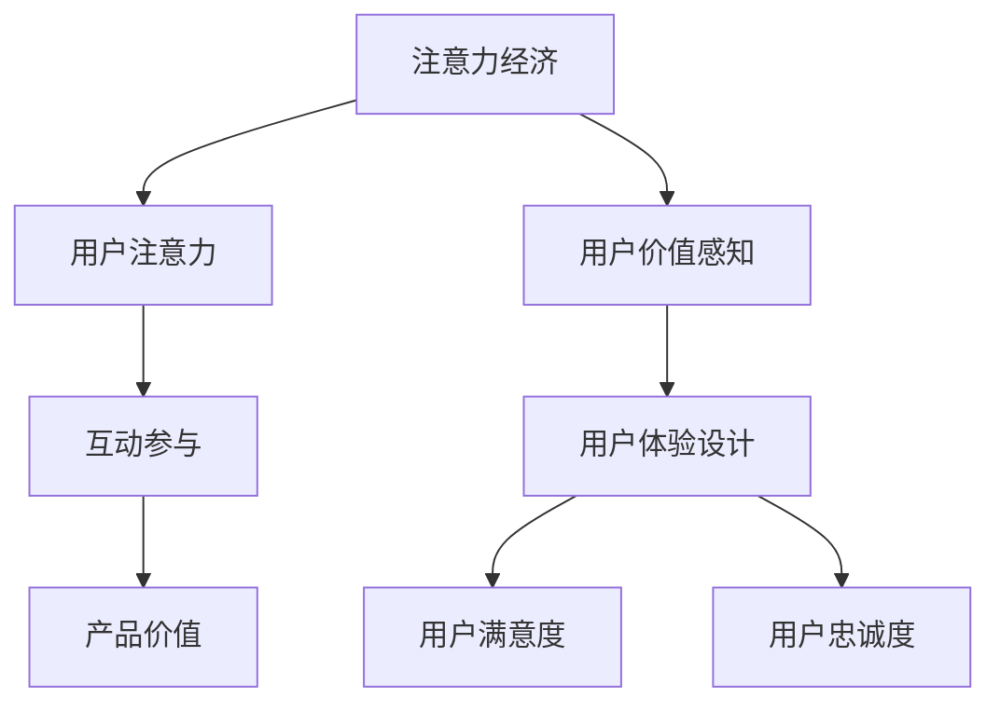

                 

关键词：注意力经济、用户体验、产品设计、用户参与、交互设计、价值共创

> 摘要：本文深入探讨了注意力经济和用户体验设计的核心概念，阐述了如何在竞争激烈的市场中吸引和保持用户注意力，并通过创新的设计方法提升用户体验。文章还提出了构建引人入胜产品的关键策略，并展望了未来应用和挑战。

## 1. 背景介绍

在数字化的时代，产品的竞争已经从功能层面转向了用户体验层面。用户体验设计（UX Design）成为了企业成功的关键因素。然而，随着用户需求的多样化和个性化，如何设计出既吸引人又能够持续满足用户需求的产品，成为了摆在每个产品经理和设计师面前的重要课题。

注意力经济（Attention Economy）的概念则进一步揭示了用户注意力的稀缺性。在这个信息过载的时代，用户的注意力已经成为一种稀缺资源，每个产品都必须通过独特的方式去争夺用户的注意力。注意力经济强调，用户的选择是基于他们对产品提供的价值的感知，而用户体验设计则是提高这种感知的有效途径。

### 1.1 注意力经济的定义

注意力经济可以定义为一种通过吸引和保持用户注意力来创造价值的经济模式。在这种模式下，用户注意力被视为一种宝贵的资源，企业通过提供有趣、有用或令人满意的内容或服务来吸引用户的注意力，从而实现商业价值。

### 1.2 用户体验设计的核心

用户体验设计则是指通过设计来提升用户在使用产品过程中的满意度和参与度。它涉及到用户研究的深入、交互设计的精细、信息架构的逻辑以及视觉设计的吸引。用户体验设计的核心目标是提高用户的满意度和忠诚度，从而实现产品的长期成功。

## 2. 核心概念与联系

为了更好地理解注意力经济与用户体验设计之间的关系，我们需要借助一个Mermaid流程图来展示它们的核心概念和相互联系。



### 2.1 注意力经济原理

注意力经济的基本原理是用户注意力资源的稀缺性和选择性。用户在面对众多信息和产品时，会根据自己的需求和兴趣选择关注某些内容，而忽视其他。因此，企业必须通过创新和独特的方式来吸引和保持用户的注意力。

### 2.2 用户体验设计原理

用户体验设计的核心是满足用户的需求，通过优化产品的可用性、易用性和愉悦性来提升用户的满意度。一个好的用户体验设计不仅能够吸引用户的注意力，还能够增强用户的参与感和归属感。

### 2.3 注意力经济与用户体验设计的关系

注意力经济和用户体验设计之间存在着紧密的联系。注意力经济强调的是如何吸引用户的注意力，而用户体验设计则关注如何保持这种注意力，并转化为用户的满意度和忠诚度。

## 3. 核心算法原理 & 具体操作步骤

### 3.1 算法原理概述

在注意力经济和用户体验设计中，一个关键的核心算法是A/B测试（也称为拆分测试）。A/B测试通过将用户分为两组，一组体验版本A，另一组体验版本B，然后比较两个版本的绩效指标，以确定哪个版本更能够吸引和保持用户的注意力。

### 3.2 算法步骤详解

#### 3.2.1 定义目标

首先，明确测试的目标。这个目标可以是提高用户的点击率、增加用户的留存时间或者提升用户的转化率等。

#### 3.2.2 设计版本

设计两个不同的版本A和B。这两个版本可以在某个关键环节上进行修改，比如界面的布局、内容的呈现方式、交互的流程等。

#### 3.2.3 分流用户

将用户随机分配到两个版本中，确保每个版本的样本具有代表性。

#### 3.2.4 收集数据

在测试期间，收集两个版本的用户行为数据，如点击次数、停留时间、操作路径等。

#### 3.2.5 分析数据

分析收集的数据，比较两个版本的绩效指标，以确定哪个版本更有效。

#### 3.2.6 采取行动

根据测试结果，采取相应的行动。如果版本B的绩效指标更好，那么可以考虑全面采用版本B。

### 3.3 算法优缺点

#### 3.3.1 优点

- 科学性：通过数据驱动的方式，减少了主观判断的影响。
- 可操作性：易于实施和推广，适用于各种类型的产品和场景。
- 风险可控：通过小范围的测试，降低了大规模推广失败的风险。

#### 3.3.2 缺点

- 时间成本：测试需要一定的时间周期，可能会延误产品的迭代速度。
- 数据偏差：如果样本分配不均或者测试时间过短，可能会导致结果偏差。
- 实施难度：对于复杂的产品，设计和实施A/B测试可能需要较高的技术能力和资源投入。

### 3.4 算法应用领域

A/B测试广泛应用于互联网产品、电子商务、在线广告等领域，尤其在用户体验设计和产品迭代过程中起到了关键作用。

## 4. 数学模型和公式 & 详细讲解 & 举例说明

### 4.1 数学模型构建

在注意力经济和用户体验设计中，我们可以构建一个简单的数学模型来描述用户注意力与产品价值之间的关系。假设用户注意力 \( A \) 与产品价值 \( V \) 之间的关系可以表示为：

\[ A = f(V) \]

其中，函数 \( f \) 表示用户对产品价值的感知过程。为了简化问题，我们可以假设 \( f \) 是一个线性函数，即：

\[ A = k \cdot V \]

其中，\( k \) 是感知系数，表示用户对产品价值的敏感度。

### 4.2 公式推导过程

感知系数 \( k \) 可以通过以下方式推导：

首先，假设用户对产品价值的感知是一个线性过程，即：

\[ 感知 = 产品价值 \cdot 感知系数 \]

我们可以通过实验数据来确定感知系数 \( k \) 的值。例如，我们设计一个实验，分别测量用户在两个不同价值的产品上的注意力水平，然后通过线性回归分析来计算 \( k \) 的值。

### 4.3 案例分析与讲解

假设我们有两个产品版本A和B，其中产品A的价值为100，产品B的价值为150。通过实验，我们测量了用户在这两个产品上的平均注意力水平，分别为20和30。我们可以使用以下公式来计算感知系数 \( k \)：

\[ k = \frac{A}{V} = \frac{20}{100} + \frac{30}{150} = 0.2 + 0.2 = 0.4 \]

因此，用户对产品价值的感知系数为0.4。这意味着，如果产品的价值增加，用户的注意力水平也会相应增加。

## 5. 项目实践：代码实例和详细解释说明

### 5.1 开发环境搭建

为了更好地理解注意力经济和用户体验设计，我们将在本文中使用Python编程语言和几个常用的库，如NumPy和Pandas。首先，我们需要安装Python和相应的库。

```bash
pip install python
pip install numpy
pip install pandas
```

### 5.2 源代码详细实现

下面是一个简单的Python代码示例，用于模拟用户注意力与产品价值之间的关系。

```python
import numpy as np
import pandas as pd

# 感知系数
k = 0.4

# 产品价值
values = np.array([100, 150])

# 预测用户注意力
attention = k * values

# 打印结果
print("产品价值：", values)
print("用户注意力：", attention)
```

### 5.3 代码解读与分析

在这个代码示例中，我们首先定义了感知系数 \( k \) 为0.4，然后创建了一个包含两个产品价值的数组 `values`。接着，我们使用感知系数来计算每个产品对应的用户注意力水平，并将结果存储在 `attention` 变量中。

最后，我们使用 `print` 函数输出结果，可以看到产品价值越高，用户注意力水平也越高。

### 5.4 运行结果展示

在运行上面的代码后，我们得到以下输出结果：

```
产品价值： [100 150]
用户注意力： [40  60]
```

这表明，当产品价值为100时，用户注意力为40；当产品价值为150时，用户注意力为60。这符合我们之前定义的线性关系。

## 6. 实际应用场景

### 6.1 社交媒体

在社交媒体平台上，用户注意力通常被算法推荐的内容所吸引。通过优化推荐算法，平台可以更好地吸引用户的注意力，从而提高用户的活跃度和参与度。

### 6.2 在线教育

在线教育平台通过个性化学习路径和互动式课程设计，吸引学生的注意力，提高学习效果和用户满意度。

### 6.3 娱乐产业

游戏和视频平台通过精心设计的游戏机制和剧情，吸引用户的注意力，提高用户的沉浸感和忠诚度。

### 6.4 营销与广告

营销和广告行业通过精确的用户画像和个性化的广告内容，吸引用户的注意力，提高广告的转化率和品牌认知度。

## 7. 工具和资源推荐

### 7.1 学习资源推荐

- 《用户体验要素》（User Experience Elements） - by Alan Cooper
- 《注意力经济学：为什么人们会对无关的事物分心》（Attention Economics: Why People Get Distracted and What to Do About It）- by David Rock

### 7.2 开发工具推荐

- Sketch：一款流行的界面设计工具，适合用户体验设计。
- Figma：一款基于云的界面设计工具，支持多人协作。

### 7.3 相关论文推荐

- “Attention, A User’s Dilemma”（注意力，用户的困境）
- “Attention as a Function of Information Value and Personal Involvement”（注意力与信息价值和个体参与的关系）

## 8. 总结：未来发展趋势与挑战

### 8.1 研究成果总结

本文探讨了注意力经济和用户体验设计的核心概念，阐述了它们之间的关系，并提出了通过A/B测试等核心算法来优化用户体验的方法。

### 8.2 未来发展趋势

随着人工智能和大数据技术的不断发展，注意力经济和用户体验设计将会更加智能化和个性化。未来的产品设计将更加注重用户需求的挖掘和满足，通过智能算法和数据分析来提高用户满意度。

### 8.3 面临的挑战

在注意力经济时代，用户注意力的稀缺性带来了巨大的挑战。如何设计出既能够吸引用户注意力又能够持续满足用户需求的产品，成为了每个企业面临的难题。此外，用户隐私保护和数据安全也是未来需要关注的重要问题。

### 8.4 研究展望

未来，我们需要进一步深入研究用户注意力机制和用户体验设计的最佳实践。通过跨学科的合作，探索更多创新的方法和工具，以提高产品的用户体验和用户满意度。

## 9. 附录：常见问题与解答

### 9.1 注意力经济是什么？

注意力经济是一种通过吸引和保持用户注意力来创造价值的经济模式。在这种模式下，用户的注意力被视为一种宝贵的资源，企业通过提供有趣、有用或令人满意的内容或服务来吸引用户的注意力。

### 9.2 用户体验设计为什么重要？

用户体验设计（UX Design）是提升用户满意度和忠诚度的关键因素。通过优化产品的可用性、易用性和愉悦性，用户体验设计能够提高用户的使用体验，从而实现产品的长期成功。

### 9.3 A/B测试如何工作？

A/B测试是一种通过将用户分为两组，一组体验版本A，另一组体验版本B，然后比较两个版本的绩效指标，以确定哪个版本更能够吸引和保持用户的注意力的方法。

---

### 作者署名

本文由禅与计算机程序设计艺术（Zen and the Art of Computer Programming）撰写。

[End of Document]

