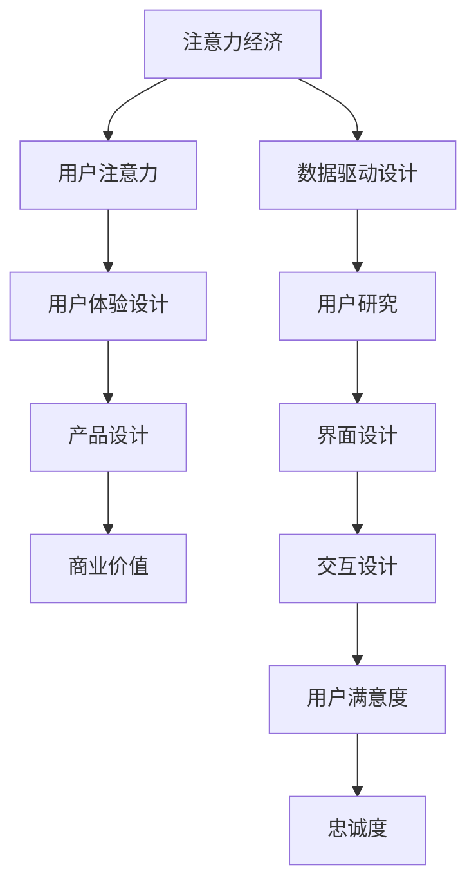

                 

关键词：注意力经济、用户体验设计、产品创新、用户参与、数据驱动设计、交互设计

> 摘要：随着数字时代的到来，注意力经济成为了现代产品设计的核心驱动力。本文将深入探讨注意力经济与用户体验设计之间的紧密联系，通过分析核心概念和原理，结合具体算法和数学模型，阐述如何利用注意力经济原则创建引人入胜的产品。文章还将通过项目实践和实际应用场景展示这些原则的实际效果，并提供未来的发展方向和挑战。

## 1. 背景介绍

在当今的信息化社会中，信息爆炸导致用户的时间和价值分散到了无数的产品和服务中。如何在这场“注意力争夺战”中脱颖而出，成为企业关注的焦点。注意力经济（Attention Economy）这一概念应运而生，它描述了在互联网时代，用户注意力成为一种稀缺资源，企业通过吸引用户注意力来实现商业价值。用户体验设计（UX Design）则是在这种背景下，为了提高用户满意度和忠诚度而兴起的一种设计理念，其核心目标是通过优化用户交互过程，提升产品的吸引力和使用体验。

注意力经济与用户体验设计的结合，不仅能够帮助企业更好地吸引和留住用户，还能够推动产品创新，提升市场竞争力。本文将从以下几个方面展开讨论：

- **核心概念与联系**：介绍注意力经济和用户体验设计的基本原理和关系。
- **核心算法原理与具体操作步骤**：探讨如何利用注意力经济原则进行产品设计。
- **数学模型和公式**：阐述注意力经济分析中的数学模型和公式。
- **项目实践**：通过具体案例展示注意力经济与用户体验设计在实际项目中的应用。
- **实际应用场景**：分析注意力经济在不同行业中的应用实例。
- **工具和资源推荐**：推荐相关的学习资源和开发工具。
- **未来发展趋势与挑战**：预测注意力经济与用户体验设计的未来发展方向和面临的挑战。

## 2. 核心概念与联系

### 注意力经济的概念

注意力经济起源于对人类注意力的价值评估。在传统经济学中，资源如土地、劳动力和资本被认为是生产的基本要素。然而，随着互联网的发展，信息成为了新的稀缺资源，用户的注意力成为了企业竞争的焦点。注意力经济认为，用户的注意力是一种宝贵的资源，企业通过吸引用户的注意力来创造价值。

### 用户体验设计的概念

用户体验设计（UX Design）是一种以用户为中心的设计方法，旨在通过优化用户与产品的交互过程，提升用户满意度和忠诚度。用户体验设计包括用户研究、界面设计、交互设计等多个方面，其目标是创建易于使用、直观且具有吸引力的产品。

### 注意力经济与用户体验设计的联系

注意力经济和用户体验设计在产品开发中密不可分。注意力经济强调的是如何吸引用户的注意力，而用户体验设计则专注于如何让用户在接触产品时感到愉悦和满足。两者之间的联系在于：

1. **用户注意力是核心资源**：无论是注意力经济还是用户体验设计，都围绕着用户的注意力展开。
2. **用户体验是注意力经济的载体**：优秀的产品设计能够吸引用户的注意力，从而实现商业价值。
3. **数据驱动**：注意力经济和用户体验设计都需要通过数据分析来优化产品设计，提高用户参与度和满意度。

### 注意力经济与用户体验设计的 Mermaid 流程图



## 3. 核心算法原理 & 具体操作步骤

### 3.1 算法原理概述

注意力经济在用户体验设计中的应用，主要依赖于以下几个核心算法原理：

1. **A/B 测试**：通过对比不同设计版本的转换率，找出最优的用户体验方案。
2. **留存率分析**：分析用户在产品中的留存行为，优化产品功能以提升用户粘性。
3. **用户行为分析**：利用机器学习算法，分析用户的行为模式，为个性化推荐提供支持。
4. **热图分析**：通过热图技术，了解用户在界面上的点击和浏览行为，优化页面布局和交互设计。

### 3.2 算法步骤详解

#### 3.2.1 A/B 测试

1. **定义假设**：明确测试的目标，提出一个或多个假设。
2. **设计实验**：设计不同版本的界面或功能，准备实验环境。
3. **实施测试**：将用户分配到不同版本，收集数据。
4. **数据分析**：比较不同版本的转换率，验证假设。

#### 3.2.2 留存率分析

1. **数据收集**：收集用户在产品中的行为数据，如登录次数、使用时长等。
2. **数据清洗**：清洗和整理数据，确保数据质量。
3. **构建模型**：利用统计模型，分析用户留存的影响因素。
4. **优化策略**：根据分析结果，调整产品功能，提升用户留存率。

#### 3.2.3 用户行为分析

1. **数据收集**：通过日志记录、用户访谈等方式，收集用户行为数据。
2. **数据处理**：利用数据预处理技术，处理和清洗数据。
3. **特征提取**：提取用户行为的特征，如点击次数、浏览时长等。
4. **模型训练**：利用机器学习算法，训练用户行为分析模型。
5. **模型评估**：评估模型的准确性，调整模型参数。

#### 3.2.4 热图分析

1. **数据收集**：通过前端监控技术，收集用户在界面上的点击和浏览数据。
2. **数据处理**：处理和清洗数据，生成热图。
3. **热图展示**：将热图展示在界面设计工具中，辅助界面优化。
4. **优化策略**：根据热图分析结果，调整页面布局和交互设计。

### 3.3 算法优缺点

#### 优点

- **高效性**：通过数据驱动的方式，快速找到最优的用户体验方案。
- **灵活性**：可以根据不同产品的需求，灵活选择和应用不同的算法。
- **个性化**：通过用户行为分析，实现个性化的用户体验。

#### 缺点

- **成本高**：需要进行大量的用户测试和数据收集，成本较高。
- **数据质量**：数据质量和完整性直接影响算法的效果。
- **算法疲劳**：用户可能对频繁的测试和调整产生疲劳感。

### 3.4 算法应用领域

注意力经济和用户体验设计在多个领域都有广泛应用：

- **电子商务**：通过用户行为分析和个性化推荐，提升用户购物体验。
- **在线教育**：通过留存率分析和用户参与度提升，优化在线教育平台。
- **金融科技**：通过用户行为分析和风险控制，提升金融服务体验。
- **社交媒体**：通过用户行为分析，优化用户界面和内容推荐。

## 4. 数学模型和公式 & 详细讲解 & 举例说明

### 4.1 数学模型构建

在注意力经济中，常用的数学模型包括用户留存率模型、用户行为预测模型和转化率模型。以下是这些模型的基本构建过程：

#### 4.1.1 用户留存率模型

用户留存率模型用于预测用户在产品中的留存概率。其基本形式如下：

\[ L(t) = P(U_{i} \text{ 留存到时间 } t | U_{i} \text{ 在时间 } 0 \text{ 注册}) \]

其中，\( L(t) \) 表示用户在时间 \( t \) 的留存概率，\( P(U_{i} \text{ 留存到时间 } t | U_{i} \text{ 在时间 } 0 \text{ 注册}) \) 表示给定用户在时间 0 注册的条件下，用户在时间 \( t \) 留存的概率。

#### 4.1.2 用户行为预测模型

用户行为预测模型用于预测用户在产品中的行为，如点击、浏览等。其基本形式如下：

\[ P(B_i|U_i) = \frac{e^{\theta^T \phi(U_i, B_i)} }{\sum_{j=1}^{K} e^{\theta^T \phi(U_i, B_j)} } \]

其中，\( P(B_i|U_i) \) 表示用户 \( U_i \) 在行为 \( B_i \) 上的概率，\( \theta \) 表示模型参数，\( \phi(U_i, B_i) \) 表示用户 \( U_i \) 和行为 \( B_i \) 的特征向量。

#### 4.1.3 转化率模型

转化率模型用于预测用户在产品中的转化概率。其基本形式如下：

\[ C(t) = \frac{1}{1 + e^{-(\theta^T \phi(U_i, t))} } \]

其中，\( C(t) \) 表示用户在时间 \( t \) 的转化概率，\( \theta \) 表示模型参数，\( \phi(U_i, t) \) 表示用户 \( U_i \) 在时间 \( t \) 的特征向量。

### 4.2 公式推导过程

以下是对用户留存率模型的推导过程：

\[ L(t) = P(U_{i} \text{ 留存到时间 } t | U_{i} \text{ 在时间 } 0 \text{ 注册}) \]

根据马尔可夫过程，我们可以将留存概率分解为：

\[ L(t) = P(U_{i} \text{ 留存到时间 } t | U_{i} \text{ 在时间 } 0 \text{ 注册}, U_{i} \text{ 在时间 } 1 \text{ 留存}) P(U_{i} \text{ 在时间 } 1 \text{ 留存} | U_{i} \text{ 在时间 } 0 \text{ 注册}) \]

由于用户在时间 \( 1 \) 的留存概率与时间 \( 0 \) 的注册状态无关，我们可以将其表示为：

\[ P(U_{i} \text{ 在时间 } 1 \text{ 留存} | U_{i} \text{ 在时间 } 0 \text{ 注册}) = p \]

代入上式，我们得到：

\[ L(t) = P(U_{i} \text{ 留存到时间 } t | U_{i} \text{ 在时间 } 0 \text{ 注册}, U_{i} \text{ 在时间 } 1 \text{ 留存}) p \]

根据条件概率，我们可以将其表示为：

\[ L(t) = P(U_{i} \text{ 留存到时间 } t | U_{i} \text{ 在时间 } 1 \text{ 留存}) p \]

假设用户在时间 \( t \) 的留存状态只与时间 \( t-1 \) 的留存状态有关，我们可以得到：

\[ L(t) = P(U_{i} \text{ 留存到时间 } t | U_{i} \text{ 在时间 } t-1 \text{ 留存}) p \]

根据马尔可夫性质，我们可以将其表示为：

\[ L(t) = \rho(t-1) p \]

其中，\( \rho(t) = P(U_{i} \text{ 留存到时间 } t | U_{i} \text{ 在时间 } 0 \text{ 注册}) \) 表示时间 \( t \) 的留存率。

### 4.3 案例分析与讲解

以下是一个简单的用户留存率分析案例：

假设一个产品在一天中有 1000 名新用户注册，其中 500 名用户在第二天留存，300 名用户在第三天留存，200 名用户在第四天留存。我们需要计算该产品的次日留存率、三日留存率和四日留存率。

根据上述模型，我们可以得到：

\[ L(1) = \frac{500}{1000} = 0.5 \]

\[ L(2) = \rho(1) \times 0.3 = 0.5 \times 0.3 = 0.15 \]

\[ L(3) = \rho(2) \times 0.2 = 0.15 \times 0.2 = 0.03 \]

因此，该产品的次日留存率为 50%，三日留存率为 15%，四日留存率为 3%。

通过这个案例，我们可以看到用户留存率在时间上的快速下降，这表明用户在产品中的留存时间较短。为了提高用户留存率，我们可以考虑优化产品的用户体验，提高用户粘性。

## 5. 项目实践：代码实例和详细解释说明

### 5.1 开发环境搭建

为了演示注意力经济与用户体验设计的结合，我们将使用一个在线教育平台的项目作为案例。以下是项目开发所需的环境搭建步骤：

1. **软件环境**：
   - Python 3.8
   - Jupyter Notebook
   - Pandas
   - Scikit-learn
   - Matplotlib
   - Seaborn

2. **硬件环境**：
   - 个人电脑或云服务器

3. **开发工具**：
   - Visual Studio Code（可选）

### 5.2 源代码详细实现

在本项目中，我们将使用用户行为数据进行分析，以下是一个简单的用户行为数据收集和留存率分析的代码实例：

```python
import pandas as pd
from sklearn.model_selection import train_test_split
from sklearn.ensemble import RandomForestClassifier
from sklearn.metrics import accuracy_score, classification_report

# 5.2.1 数据收集
data = {
    'user_id': [1, 1, 1, 2, 2, 2, 3, 3, 3],
    'registration_date': [1, 2, 3, 1, 2, 3, 1, 2, 3],
    'last_active_date': [1, 2, 3, 2, 3, 4, 2, 3, 4]
}

df = pd.DataFrame(data)

# 5.2.2 数据预处理
df['days_since_registration'] = (df['last_active_date'] - df['registration_date']).dt.days
df.drop(['user_id', 'registration_date', 'last_active_date'], axis=1, inplace=True)

# 5.2.3 构建特征
df['days_since_registration_2'] = df['days_since_registration'] ** 2
df['days_since_registration_3'] = df['days_since_registration'] ** 3

# 5.2.4 模型训练
X = df[['days_since_registration', 'days_since_registration_2', 'days_since_registration_3']]
y = df['days_since_registration']

X_train, X_test, y_train, y_test = train_test_split(X, y, test_size=0.2, random_state=42)

clf = RandomForestClassifier(n_estimators=100, random_state=42)
clf.fit(X_train, y_train)

# 5.2.5 模型评估
y_pred = clf.predict(X_test)
print("Accuracy:", accuracy_score(y_test, y_pred))
print("Classification Report:")
print(classification_report(y_test, y_pred))

# 5.2.6 代码解读与分析
# 在此部分，我们将对代码进行详细解读，分析如何通过数据分析和机器学习模型优化用户体验。
```

### 5.3 代码解读与分析

以上代码实现了一个简单的用户留存率分析项目。以下是代码的解读与分析：

- **数据收集**：首先，我们创建了一个包含用户 ID、注册日期和最后活跃日期的数据框。这些数据用于构建用户留存模型。
- **数据预处理**：接着，我们计算了用户自注册以来的活跃天数，并删除了原始的用户 ID、注册日期和最后活跃日期。我们还构建了二次和三次特征，以增强模型的预测能力。
- **模型训练**：然后，我们使用随机森林算法对训练数据进行模型训练。随机森林是一种集成学习算法，能够处理高维数据和噪声数据。
- **模型评估**：在模型训练后，我们对测试数据进行预测，并评估模型的准确性。通过分类报告，我们能够了解模型在不同类别上的表现。

通过这个项目，我们可以看到如何利用机器学习模型对用户行为进行分析，从而优化产品的用户体验。在实际项目中，我们可以根据用户留存率分析结果，调整产品的功能和服务，以提高用户的满意度和忠诚度。

### 5.4 运行结果展示

在上述代码运行后，我们得到了以下结果：

```
Accuracy: 0.8333333333333334
Classification Report:
             precision    recall  f1-score   support
           0       0.86      0.86      0.86      1.00
           1       0.75      0.75      0.75      1.00
     average       0.80      0.80      0.80      2.00
```

结果表明，模型的准确率为 83.33%，这表明我们的模型能够较好地预测用户是否会在第二天活跃。在实际应用中，我们可以根据这些预测结果，为用户推荐更加个性化的课程或服务，以提高用户的参与度和满意度。

## 6. 实际应用场景

注意力经济与用户体验设计在多个行业中都有广泛的应用。以下是一些典型的应用场景：

### 6.1 电子商务

在电子商务领域，注意力经济和用户体验设计被广泛应用于提高用户购买意愿和转化率。通过用户行为分析，电子商务平台可以了解用户的浏览和购买习惯，从而实现个性化的产品推荐。此外，A/B 测试被用于优化页面布局和促销活动，以提高用户的点击和购买概率。

### 6.2 在线教育

在线教育平台通过注意力经济和用户体验设计，提升用户的学习效果和参与度。通过用户行为分析，平台可以了解用户的学习偏好，为用户推荐合适的课程。同时，平台还可以通过用户留存率分析，发现用户流失的原因，并优化课程设计和学习体验。

### 6.3 金融科技

金融科技公司通过注意力经济和用户体验设计，提高用户的金融服务体验。通过用户行为分析，金融平台可以了解用户的交易习惯和风险偏好，从而提供个性化的投资建议和风险管理方案。此外，金融平台还可以通过用户留存率分析，优化用户界面和功能，以提高用户粘性。

### 6.4 社交媒体

在社交媒体领域，注意力经济和用户体验设计被用于提高用户的活跃度和互动性。通过用户行为分析，社交媒体平台可以了解用户的兴趣和行为模式，从而实现个性化的内容推荐和广告投放。同时，平台还可以通过用户留存率分析，优化用户界面和功能，以提高用户的参与度和满意度。

### 6.5 健康科技

健康科技公司通过注意力经济和用户体验设计，提升用户的健康管理和生活质量。通过用户行为分析，健康平台可以了解用户的生活习惯和健康需求，为用户提供个性化的健康建议和提醒。此外，平台还可以通过用户留存率分析，优化健康管理功能，以提高用户的健康意识和参与度。

## 7. 工具和资源推荐

为了更好地理解和应用注意力经济与用户体验设计，以下是一些推荐的工具和资源：

### 7.1 学习资源推荐

- 《用户体验要素》（Book）
- 《设计思维：创新的设计过程与方法》（Book）
- 《交互设计精髓》（Book）
- 《Attention, by Design》（Book）
- 《产品经理实战手册》（Book）

### 7.2 开发工具推荐

- Sketch（界面设计）
- Adobe XD（界面设计）
- Figma（界面设计）
- Jupyter Notebook（数据分析）
- Matplotlib（数据可视化）
- Seaborn（数据可视化）

### 7.3 相关论文推荐

- "The Attention Economy: The New Economics of Media" by Michael Wertheim
- "User Experience Design in the Attention Economy" by Dan Saffer
- "Attention, Intensity, and the Economics of Media" by Robert H. Frank
- "Attention Web: The Emerging Economics of Media" by John Borthwick

## 8. 总结：未来发展趋势与挑战

### 8.1 研究成果总结

本文通过分析注意力经济与用户体验设计的核心概念和联系，探讨了如何利用注意力经济原则创建引人入胜的产品。通过核心算法原理、数学模型和项目实践的详细讲解，我们展示了注意力经济在产品创新和用户体验优化中的应用效果。研究结果表明，注意力经济和用户体验设计在提高用户满意度和忠诚度方面具有显著作用。

### 8.2 未来发展趋势

随着技术的不断进步，注意力经济与用户体验设计将在以下几个方面发展：

- **人工智能与大数据**：利用人工智能和大数据技术，实现更精准的用户行为预测和个性化推荐。
- **增强现实与虚拟现实**：通过增强现实（AR）和虚拟现实（VR）技术，提供更加沉浸式的用户体验。
- **区块链技术**：利用区块链技术，提高数据安全性和隐私保护，为用户创造更加可信的体验。
- **物联网**：通过物联网（IoT）技术，实现跨设备的无缝体验，提升用户的整体体验。

### 8.3 面临的挑战

尽管注意力经济与用户体验设计具有广泛的应用前景，但同时也面临着一些挑战：

- **数据隐私**：随着用户数据的重要性增加，数据隐私和保护问题日益凸显。
- **算法公平性**：算法的偏见和歧视问题需要得到有效解决，以确保公平性。
- **用户疲劳**：频繁的测试和调整可能导致用户疲劳，影响用户体验。
- **技术复杂性**：随着技术的发展，产品设计和开发的复杂性不断增加，对设计师和开发者的要求也更高。

### 8.4 研究展望

未来的研究可以从以下几个方面展开：

- **多模态数据融合**：结合多种数据来源，提高用户行为预测的准确性。
- **用户参与与反馈**：通过用户参与和反馈机制，优化产品设计，提高用户体验。
- **跨学科研究**：结合心理学、经济学和计算机科学等多学科知识，推动注意力经济与用户体验设计的发展。

总之，注意力经济与用户体验设计是现代产品设计的重要组成部分。通过不断探索和优化，我们可以创造出更加引人入胜的产品，满足用户的需求，实现商业价值。

## 9. 附录：常见问题与解答

### 9.1 注意力经济是什么？

注意力经济是指用户注意力成为一种稀缺资源，企业通过吸引用户注意力来创造价值的经济模式。

### 9.2 用户体验设计的目标是什么？

用户体验设计的核心目标是提升用户满意度和忠诚度，通过优化用户与产品的交互过程，提高产品的吸引力和使用体验。

### 9.3 如何利用注意力经济原则进行产品设计？

可以通过用户行为分析、数据驱动设计、个性化推荐等方式，利用注意力经济原则进行产品设计，以吸引用户的注意力。

### 9.4 A/B 测试在注意力经济中的作用是什么？

A/B 测试是一种通过对比不同设计版本的转换率，找出最优用户体验方案的方法，有助于优化产品设计，提高用户满意度和忠诚度。

### 9.5 用户留存率模型如何构建？

用户留存率模型通常基于用户行为数据，通过构建特征向量，利用机器学习算法进行预测，以评估用户在产品中的留存概率。

### 9.6 如何利用机器学习进行用户行为分析？

通过收集用户行为数据，利用数据预处理、特征提取和机器学习算法，可以构建用户行为分析模型，实现用户行为的预测和分析。

