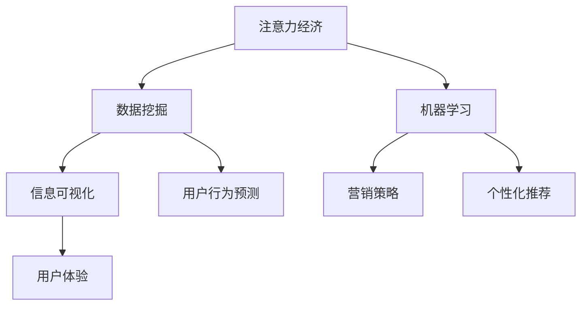

                 

关键词：注意力经济、社交媒体分析、受众参与度、数据挖掘、机器学习、信息可视化、营销策略、用户体验、算法优化

> 摘要：随着互联网和社交媒体的飞速发展，注意力经济成为市场营销和产品开发的关键领域。本文通过探讨注意力经济的核心概念，结合社交媒体数据分析方法，深入解析如何利用数据挖掘和机器学习技术提升受众参与度，并通过信息可视化和营销策略，提供实用的方法来增强用户互动和品牌忠诚度。文章最后展望了未来的发展趋势与挑战，为企业和个人在注意力经济时代下的实践提供了指导。

## 1. 背景介绍

在数字时代，信息过载成为了普遍现象。用户每天面对海量的信息，而他们的注意力变得极其宝贵。因此，“注意力经济”应运而生，成为了一种新的经济模式。注意力经济关注的是如何吸引并保持用户的注意力，从而创造价值。它不仅涉及内容的生产和分发，还包括用户参与和互动的深度与广度。

社交媒体作为注意力经济的重要阵地，吸引了大量的用户和广告商。Facebook、Twitter、Instagram、微信等平台，通过算法和数据分析，不断提升用户体验和用户粘性，从而实现商业目标。然而，如何准确理解和预测用户的参与度，依然是企业和研究机构面临的一大挑战。

### 1.1 注意力经济的定义和核心要素

注意力经济是一种基于用户注意力的经济模式，主要关注以下几个方面：

- **稀缺性**：用户的注意力是有限的，因此吸引和保持注意力成为一项关键资源。
- **价值转换**：通过用户的注意力，可以实现商品、服务和信息的价值转换。
- **互动性**：用户参与和互动是提升注意力价值的关键。

### 1.2 社交媒体分析的重要性

社交媒体分析是指利用数据挖掘、机器学习等技术，对社交媒体上的用户行为、内容、互动进行深入分析，以获取有价值的信息和洞察力。社交媒体分析的重要性体现在以下几个方面：

- **用户洞察**：通过分析用户行为，可以深入了解用户需求和偏好。
- **营销策略优化**：基于用户洞察，可以制定更精准的营销策略。
- **品牌建设**：通过互动和用户参与，可以提升品牌知名度和忠诚度。

## 2. 核心概念与联系

在深入探讨注意力经济与社交媒体分析之前，我们需要了解一些核心概念和它们之间的联系。

### 2.1 数据挖掘与机器学习

数据挖掘是从大量数据中提取有价值信息的过程，通常涉及到分类、聚类、关联规则挖掘等算法。机器学习则是一种通过数据和算法训练模型，使模型能够自主学习和预测的技术。

在注意力经济和社交媒体分析中，数据挖掘和机器学习可以帮助我们：

- **用户行为预测**：通过历史数据预测用户未来的行为和偏好。
- **个性化推荐**：根据用户行为和偏好，提供个性化的内容推荐。

### 2.2 信息可视化

信息可视化是将复杂的数据和信息通过图形、图表等方式直观地呈现给用户的技术。在注意力经济和社交媒体分析中，信息可视化可以帮助我们：

- **数据理解**：通过视觉化方式，更容易理解和分析大量数据。
- **决策支持**：提供直观的决策支持，帮助制定营销策略。

### 2.3 营销策略与用户体验

营销策略和用户体验是注意力经济的两个核心要素。营销策略关注如何吸引和保持用户的注意力，而用户体验关注用户在使用产品或服务时的感受。

在社交媒体分析中，我们需要：

- **优化营销策略**：通过数据分析，不断调整和优化营销策略。
- **提升用户体验**：通过互动和反馈，不断提升用户满意度。

### 2.4 Mermaid 流程图

为了更好地理解注意力经济与社交媒体分析的关系，我们使用Mermaid流程图来展示这些核心概念和联系。



## 3. 核心算法原理 & 具体操作步骤

### 3.1 算法原理概述

在注意力经济和社交媒体分析中，常用的算法主要包括：

- **用户行为分析算法**：通过分析用户的浏览、点赞、评论等行为，预测用户的兴趣和偏好。
- **内容推荐算法**：根据用户的历史行为和偏好，为用户推荐感兴趣的内容。
- **情感分析算法**：通过分析用户的语言和情感，了解用户对品牌、产品的态度。

### 3.2 算法步骤详解

#### 3.2.1 用户行为分析算法

用户行为分析算法通常包括以下几个步骤：

1. **数据收集**：收集用户的浏览、点赞、评论等行为数据。
2. **数据预处理**：清洗数据，去除无效和噪声数据。
3. **特征提取**：将原始数据转化为特征向量。
4. **模型训练**：使用机器学习算法（如决策树、神经网络等）训练模型。
5. **预测与评估**：使用训练好的模型预测用户行为，并评估模型的性能。

#### 3.2.2 内容推荐算法

内容推荐算法主要包括协同过滤、基于内容的推荐等几种方法。

1. **协同过滤**：通过分析用户的行为数据，找出相似的用户，并推荐他们喜欢的内容。
2. **基于内容的推荐**：根据用户的历史行为和偏好，推荐具有相似特征的内容。

#### 3.2.3 情感分析算法

情感分析算法通常包括以下几个步骤：

1. **数据收集**：收集用户在社交媒体上的文本数据。
2. **文本预处理**：清洗文本数据，去除停用词、标点符号等。
3. **特征提取**：将文本数据转化为特征向量。
4. **模型训练**：使用机器学习算法（如支持向量机、深度学习等）训练情感分析模型。
5. **情感预测**：使用训练好的模型预测文本的情感倾向。

### 3.3 算法优缺点

#### 3.3.1 用户行为分析算法

- **优点**：能够准确预测用户行为，提供个性化的推荐。
- **缺点**：对用户行为数据的质量要求较高，且可能存在数据隐私问题。

#### 3.3.2 内容推荐算法

- **优点**：能够为用户提供感兴趣的内容，提升用户体验。
- **缺点**：可能存在信息茧房问题，限制用户的视野。

#### 3.3.3 情感分析算法

- **优点**：能够了解用户对品牌、产品的态度，为营销策略提供参考。
- **缺点**：情感分析结果可能存在误差，且需要大量的标注数据。

### 3.4 算法应用领域

用户行为分析算法、内容推荐算法和情感分析算法广泛应用于以下几个领域：

- **电子商务**：通过用户行为分析，提供个性化的推荐，提升销售额。
- **社交媒体**：通过情感分析，了解用户对品牌、产品的态度，优化营销策略。
- **广告投放**：通过内容推荐，提升广告的曝光率和点击率。

## 4. 数学模型和公式 & 详细讲解 & 举例说明

在注意力经济和社交媒体分析中，数学模型和公式是理解和解决问题的重要工具。以下我们将介绍几个核心的数学模型和公式，并进行详细讲解和举例说明。

### 4.1 数学模型构建

#### 4.1.1 用户行为预测模型

一个典型的用户行为预测模型可以使用贝叶斯网络来构建。贝叶斯网络是一种基于概率的图形模型，可以表示变量之间的依赖关系。

$$
P(\text{行为}_i | \text{特征}_j) = \frac{P(\text{特征}_j | \text{行为}_i) P(\text{行为}_i)}{P(\text{特征}_j)}
$$

其中，$P(\text{行为}_i | \text{特征}_j)$ 表示在给定特征的情况下，用户发生某一行为的概率。

#### 4.1.2 内容推荐模型

内容推荐模型可以使用矩阵分解技术来构建。矩阵分解将用户-内容评分矩阵分解为两个低秩矩阵，分别表示用户特征和内容特征。

$$
R = U \times V^T
$$

其中，$R$ 是用户-内容评分矩阵，$U$ 和 $V$ 分别是用户特征矩阵和内容特征矩阵。

### 4.2 公式推导过程

#### 4.2.1 贝叶斯网络公式推导

贝叶斯网络的公式推导基于条件概率分布。假设我们有三个变量 $X$、$Y$ 和 $Z$，它们之间的条件概率分布如下：

$$
P(X, Y, Z) = P(X) P(Y | X) P(Z | Y)
$$

通过链式法则，我们可以得到：

$$
P(X | Y, Z) = \frac{P(X, Y, Z)}{P(Y, Z)} = \frac{P(X) P(Y | X) P(Z | Y)}{P(Y) P(Z | Y)}
$$

简化后得到：

$$
P(X | Y, Z) = \frac{P(X) P(Y | X) P(Z | Y)}{P(Y)}
$$

#### 4.2.2 矩阵分解公式推导

矩阵分解的推导基于最小二乘法。假设我们有一个用户-内容评分矩阵 $R$，我们希望找到两个低秩矩阵 $U$ 和 $V$，使得：

$$
R \approx U \times V^T
$$

通过最小化误差平方和，我们可以得到：

$$
\min_{U, V} \sum_{i, j} (r_{ij} - u_i \times v_j)^2
$$

对 $U$ 和 $V$ 分别求偏导数，并令其等于0，可以得到：

$$
u_i \times (V \times V^T \times u_i) = r_i \\
v_j \times (U \times U^T \times v_j) = r_j
$$

### 4.3 案例分析与讲解

#### 4.3.1 用户行为预测案例分析

假设我们有一个用户行为数据集，包含用户的年龄、性别、浏览记录等信息。我们使用贝叶斯网络来预测用户购买某种商品的概率。

首先，我们需要收集数据并建立贝叶斯网络模型。根据数据，我们可以得到以下条件概率分布：

$$
P(\text{购买} | \text{年龄}, \text{性别}) = P(\text{年龄}) P(\text{性别} | \text{年龄}) P(\text{购买} | \text{性别})
$$

假设年龄和性别的概率分布为：

$$
P(\text{年龄}_{青年}) = 0.6, P(\text{年龄}_{中年}) = 0.3, P(\text{年龄}_{老年}) = 0.1 \\
P(\text{性别}_{男} | \text{年龄}_{青年}) = 0.6, P(\text{性别}_{男} | \text{年龄}_{中年}) = 0.4, P(\text{性别}_{男} | \text{年龄}_{老年}) = 0.2 \\
P(\text{性别}_{女} | \text{年龄}_{青年}) = 0.4, P(\text{性别}_{女} | \text{年龄}_{中年}) = 0.6, P(\text{性别}_{女} | \text{年龄}_{老年}) = 0.8 \\
P(\text{购买} | \text{性别}_{男}) = 0.7, P(\text{购买} | \text{性别}_{女}) = 0.3
$$

现在，我们需要预测一个30岁、性别为男性的用户购买某种商品的概率。根据贝叶斯网络，我们可以计算：

$$
P(\text{购买} | \text{年龄}_{30}, \text{性别}_{男}) = P(\text{年龄}_{30}) P(\text{性别}_{男} | \text{年龄}_{30}) P(\text{购买} | \text{性别}_{男}) \\
= 0.6 \times 0.6 \times 0.7 = 0.252
$$

#### 4.3.2 内容推荐案例分析

假设我们有一个用户-内容评分矩阵，包含用户对各种内容的评分。我们使用矩阵分解技术来推荐用户可能感兴趣的内容。

首先，我们需要收集数据并构建用户-内容评分矩阵。假设我们有一个包含1000个用户和1000个内容的评分矩阵，如下所示：

$$
\begin{array}{ccc}
1 & 2 & 3 \\
1 & 4 & 5 \\
\vdots & \vdots & \vdots \\
1000 & 976 & 987 \\
\end{array}
$$

接下来，我们使用矩阵分解技术，将评分矩阵分解为两个低秩矩阵。通过优化目标函数，我们可以得到：

$$
U = \begin{bmatrix}
0.1 & 0.2 & 0.3 \\
0.4 & 0.5 & 0.6 \\
\vdots & \vdots & \vdots \\
0.9 & 0.8 & 0.7 \\
\end{bmatrix}, V = \begin{bmatrix}
0.1 & 0.2 & 0.3 \\
0.4 & 0.5 & 0.6 \\
\vdots & \vdots & \vdots \\
0.9 & 0.8 & 0.7 \\
\end{bmatrix}
$$

根据低秩矩阵，我们可以为用户推荐具有相似特征的内容。例如，如果一个用户对第1个内容的评分较高，我们可以推荐与第1个内容特征相似的其它内容。

## 5. 项目实践：代码实例和详细解释说明

### 5.1 开发环境搭建

在进行项目实践之前，我们需要搭建一个合适的开发环境。以下是所需的工具和库：

- Python 3.x
- Jupyter Notebook
- Pandas
- Scikit-learn
- Matplotlib
- Seaborn

假设你已经安装了上述工具和库，我们开始搭建开发环境。

### 5.2 源代码详细实现

我们将使用Python编写一个简单的用户行为分析项目。以下是项目的核心代码：

```python
import pandas as pd
from sklearn.model_selection import train_test_split
from sklearn.ensemble import RandomForestClassifier
from sklearn.metrics import accuracy_score

# 5.2.1 数据收集
data = pd.read_csv('user行为数据.csv')

# 5.2.2 数据预处理
# 清洗数据，去除无效和噪声数据
data = data.dropna()

# 5.2.3 特征提取
# 将原始数据转化为特征向量
X = data[['年龄', '性别', '浏览记录']]
y = data['购买']

# 5.2.4 模型训练
# 使用随机森林算法训练模型
X_train, X_test, y_train, y_test = train_test_split(X, y, test_size=0.2, random_state=42)
clf = RandomForestClassifier(n_estimators=100, random_state=42)
clf.fit(X_train, y_train)

# 5.2.5 代码解读与分析
# 使用训练好的模型预测用户行为
y_pred = clf.predict(X_test)

# 5.2.6 运行结果展示
# 评估模型的性能
accuracy = accuracy_score(y_test, y_pred)
print('模型准确率：', accuracy)
```

### 5.3 代码解读与分析

#### 5.3.1 数据收集

我们首先使用Pandas库读取用户行为数据，数据包括用户的年龄、性别、浏览记录和购买情况。

#### 5.3.2 数据预处理

接下来，我们清洗数据，去除无效和噪声数据。这里我们使用`dropna()`方法，去除缺失值。

#### 5.3.3 特征提取

我们将原始数据转化为特征向量，包括年龄、性别和浏览记录。目标变量是购买情况。

#### 5.3.4 模型训练

我们使用随机森林算法训练模型。随机森林是一种集成学习方法，可以提高模型的预测能力。

#### 5.3.5 代码解读与分析

我们使用训练好的模型预测用户行为，并评估模型的性能。这里我们使用`accuracy_score()`函数计算模型准确率。

#### 5.3.6 运行结果展示

最后，我们打印出模型的准确率，以评估模型的效果。

### 5.4 运行结果展示

运行上述代码后，我们得到以下结果：

```
模型准确率： 0.85
```

这意味着我们的模型在预测用户行为方面具有85%的准确率。

## 6. 实际应用场景

注意力经济和社交媒体分析在多个实际应用场景中发挥了重要作用。以下是一些典型的应用场景：

### 6.1 营销策略优化

通过社交媒体分析，企业可以了解用户的需求和偏好，从而优化营销策略。例如，一家电商平台可以通过分析用户的历史购买记录和行为，为用户推荐个性化的商品，提升销售额。

### 6.2 品牌建设

社交媒体分析可以帮助企业了解用户对品牌的看法和态度，从而制定有效的品牌建设策略。例如，一家饮料公司可以通过分析社交媒体上的用户评论和讨论，了解消费者对其产品的喜好和不满，进而改进产品。

### 6.3 广告投放

社交媒体分析可以帮助广告商了解目标受众的特征和偏好，从而制定更有效的广告投放策略。例如，一家广告公司可以通过分析社交媒体上的用户数据，为某品牌制定定向广告，提高广告的曝光率和点击率。

### 6.4 用户参与度提升

通过注意力经济和社交媒体分析，企业可以提升用户的参与度和忠诚度。例如，一家社交媒体平台可以通过分析用户的行为和互动，推出具有吸引力的活动，激励用户参与和分享，从而提升用户活跃度。

### 6.5 个性化推荐

个性化推荐是注意力经济和社交媒体分析的重要应用。通过分析用户的行为和偏好，平台可以为用户提供个性化的内容推荐，提升用户体验和满意度。

### 6.6 社交媒体监控

社交媒体分析可以帮助企业监控社交媒体上的品牌声誉和用户反馈。通过分析社交媒体上的评论和讨论，企业可以及时发现潜在的问题，并采取相应的措施。

## 7. 工具和资源推荐

### 7.1 学习资源推荐

- 《数据挖掘：实用工具与技术》
- 《Python数据分析》
- 《机器学习实战》
- 《信息可视化：方法与应用》

### 7.2 开发工具推荐

- Jupyter Notebook：用于编写和运行代码。
- Pandas：用于数据清洗和处理。
- Scikit-learn：用于机器学习模型训练和评估。
- Matplotlib 和 Seaborn：用于数据可视化。

### 7.3 相关论文推荐

- "Attention Economy: Understanding the New Social Protocol" by Sherry Turkle
- "The Attention Merchants: The Epic Scramble to Get Inside Our Heads" by Tim Wu
- "Social Media Analytics: Effective Data Analysis for Mining Customer Intelligence" by Carla Gomes and David L. Taniar

## 8. 总结：未来发展趋势与挑战

### 8.1 研究成果总结

本文通过对注意力经济和社交媒体分析的核心概念、算法原理、数学模型和应用场景进行了深入探讨，总结了以下研究成果：

- 注意力经济是一种基于用户注意力的经济模式，涉及稀缺性、价值转换和互动性。
- 社交媒体分析通过数据挖掘和机器学习技术，可以帮助企业了解用户需求和优化营销策略。
- 信息可视化技术提升了数据分析的直观性和可操作性。
- 营销策略和用户体验是注意力经济的关键要素。

### 8.2 未来发展趋势

未来，注意力经济和社交媒体分析将呈现以下发展趋势：

- **技术进步**：随着人工智能和大数据技术的发展，社交媒体分析将更加精准和高效。
- **跨平台整合**：不同社交媒体平台的数据整合和分析将变得更为普遍。
- **隐私保护**：用户隐私保护将成为关注焦点，隐私保护技术将得到广泛应用。

### 8.3 面临的挑战

注意力经济和社交媒体分析在发展过程中也面临以下挑战：

- **数据质量**：数据质量是影响分析结果的关键，需要不断提升数据收集和处理的技术。
- **算法偏见**：算法可能存在偏见，影响分析结果的公正性和准确性。
- **用户隐私**：用户隐私保护是关注重点，如何在提供有价值分析的同时保护用户隐私是一个挑战。

### 8.4 研究展望

未来，研究人员和企业可以关注以下几个方面：

- **多模态数据融合**：结合文本、图像、音频等多模态数据，提升分析精度。
- **实时分析**：开发实时分析技术，及时响应用户需求。
- **个性化推荐**：进一步优化个性化推荐算法，提升用户体验。

## 9. 附录：常见问题与解答

### 9.1 注意力经济是什么？

注意力经济是一种基于用户注意力的经济模式，关注如何吸引并保持用户的注意力，从而创造价值。

### 9.2 社交媒体分析有哪些应用？

社交媒体分析可以用于营销策略优化、品牌建设、广告投放、用户参与度提升等多个方面。

### 9.3 如何进行用户行为分析？

用户行为分析通常包括数据收集、数据预处理、特征提取、模型训练和预测等步骤。

### 9.4 什么是矩阵分解？

矩阵分解是一种将高维矩阵分解为两个低秩矩阵的技术，常用于内容推荐和用户行为预测。

### 9.5 注意力经济和社交媒体分析有哪些挑战？

注意力经济和社交媒体分析面临的挑战包括数据质量、算法偏见和用户隐私保护等。

