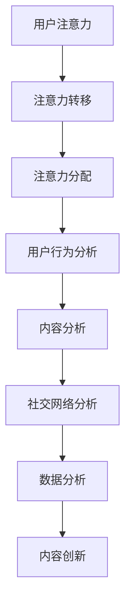

                 

关键词：注意力经济、社交媒体、受众参与度、数据分析、算法原理、应用实践、未来展望

> 摘要：本文将深入探讨注意力经济与社交媒体分析的紧密结合，通过分析受众参与度的秘密，揭示社交媒体平台的运作机理。我们将从核心概念、算法原理、数学模型、项目实践等多个维度，全面解析如何利用注意力经济和数据分析手段提升社交媒体的受众参与度。

## 1. 背景介绍

### 1.1 注意力经济的基本概念

注意力经济是近年来在经济学和心理学领域逐渐兴起的一个概念。它指的是在信息过载的现代社会，个体的注意力成为稀缺资源，谁能吸引并保持用户的注意力，谁就能在竞争激烈的市场中占据优势。注意力经济不仅仅是一个理论，它在实际商业运作中也具有重要的指导意义。

### 1.2 社交媒体平台的崛起

随着互联网技术的飞速发展，社交媒体平台逐渐成为人们日常生活的重要组成部分。从Facebook到Twitter，再到Instagram和微信，这些平台已经成为信息传播、社交互动和品牌营销的重要渠道。然而，面对海量用户和内容，如何有效提升受众参与度成为每个社交媒体平台必须面对的挑战。

## 2. 核心概念与联系

### 2.1 注意力经济的核心概念

注意力经济的核心概念主要包括以下几个方面：

- **注意力资源**：个体的注意力是一种稀缺资源，它需要通过内容、广告或其他形式来吸引。
- **注意力转移**：用户在不同平台之间切换注意力，平台需要提供足够吸引力以留住用户。
- **注意力分配**：用户将注意力分配到不同的内容或平台上，平台需要优化内容以争夺用户时间。

### 2.2 社交媒体分析的基本原理

社交媒体分析涉及多个方面，包括用户行为分析、内容分析、社交网络分析等。这些分析手段可以帮助平台了解用户需求，优化内容，提升参与度。

- **用户行为分析**：通过分析用户在平台上的行为，如点赞、评论、分享等，了解用户的兴趣和偏好。
- **内容分析**：分析发布的内容类型、关键词、频率等，以优化内容策略。
- **社交网络分析**：通过分析用户之间的关系网络，了解社交影响力，进行有针对性的推广。

### 2.3 注意力经济与社交媒体分析的联系

注意力经济与社交媒体分析之间的联系主要体现在以下几个方面：

- **用户注意力**：注意力经济强调用户注意力的价值，社交媒体分析通过数据揭示用户关注点，帮助平台优化内容，提升用户参与度。
- **数据分析**：社交媒体分析提供的数据为注意力经济提供决策支持，帮助平台更好地分配资源，提升运营效果。
- **内容创新**：通过数据分析，平台可以发现新的内容趋势，为用户带来更多有价值的内容，从而提升用户满意度。

### 2.4 Mermaid 流程图



## 3. 核心算法原理 & 具体操作步骤

### 3.1 算法原理概述

在社交媒体分析中，核心算法主要包括用户行为分析算法、内容分析算法和社交网络分析算法。这些算法的原理如下：

- **用户行为分析算法**：通过机器学习技术，对用户在平台上的行为进行建模，预测用户的兴趣和偏好。
- **内容分析算法**：利用自然语言处理技术，对发布的内容进行情感分析、关键词提取等，以了解用户关注的热点和趋势。
- **社交网络分析算法**：通过图论和社交网络分析技术，了解用户之间的关系网络，识别社交影响力，进行社交传播。

### 3.2 算法步骤详解

#### 3.2.1 用户行为分析算法

1. 数据收集：从平台获取用户行为数据，包括点赞、评论、分享等。
2. 特征提取：对用户行为进行特征提取，如行为频率、互动时长等。
3. 模型训练：利用机器学习算法，如决策树、支持向量机等，训练用户行为分析模型。
4. 模型评估：通过交叉验证等方法，评估模型的性能。

#### 3.2.2 内容分析算法

1. 数据收集：从平台获取用户发布的内容数据。
2. 文本预处理：对文本进行分词、去停用词、词性标注等预处理。
3. 情感分析：利用情感分析模型，对文本进行情感分类，判断用户情绪。
4. 关键词提取：利用关键词提取算法，识别文本中的热点关键词。

#### 3.2.3 社交网络分析算法

1. 数据收集：从平台获取用户关系数据。
2. 关系网络构建：利用图论方法，构建用户关系网络。
3. 社交影响力分析：通过分析社交网络中的连接密度、聚类系数等指标，识别社交影响力。
4. 社交传播模拟：利用传播模型，模拟社交网络中的信息传播过程。

### 3.3 算法优缺点

#### 用户行为分析算法

- 优点：能够准确预测用户兴趣，为个性化推荐提供支持。
- 缺点：需要大量用户行为数据，模型训练和评估过程复杂。

#### 内容分析算法

- 优点：能够快速识别热点话题，为内容创新提供依据。
- 缺点：对文本数据要求较高，情感分析和关键词提取的准确性有限。

#### 社交网络分析算法

- 优点：能够识别社交影响力，为营销策略提供支持。
- 缺点：对数据规模要求较高，分析过程复杂。

### 3.4 算法应用领域

- 用户行为分析算法：电子商务、推荐系统、社交媒体等。
- 内容分析算法：新闻推荐、舆情监测、社交媒体分析等。
- 社交网络分析算法：社交网络营销、品牌传播、危机管理等。

## 4. 数学模型和公式 & 详细讲解 & 举例说明

### 4.1 数学模型构建

在社交媒体分析中，常见的数学模型包括用户行为预测模型、内容分类模型和社交网络传播模型。下面分别介绍这些模型的构建过程。

#### 4.1.1 用户行为预测模型

用户行为预测模型通常采用时间序列分析方法，假设用户行为遵循某种时间序列规律。具体模型如下：

$$
P(t) = f(\theta, X(t-1))
$$

其中，$P(t)$ 表示用户在时间 $t$ 的行为概率，$f(\theta, X(t-1))$ 表示模型预测函数，$\theta$ 表示模型参数，$X(t-1)$ 表示时间 $t-1$ 的用户行为特征。

#### 4.1.2 内容分类模型

内容分类模型通常采用朴素贝叶斯分类器、支持向量机等分类算法。具体模型如下：

$$
P(y|x) = \frac{P(x|y)P(y)}{P(x)}
$$

其中，$P(y|x)$ 表示在特征 $x$ 下，类别 $y$ 的概率，$P(x|y)$ 表示在类别 $y$ 下，特征 $x$ 的概率，$P(y)$ 表示类别 $y$ 的概率，$P(x)$ 表示特征 $x$ 的概率。

#### 4.1.3 社交网络传播模型

社交网络传播模型通常采用传播方程、多跳传播模型等。具体模型如下：

$$
S(t) = (I - A)^{-1}S(0)
$$

其中，$S(t)$ 表示时间 $t$ 时刻的社交网络状态，$A$ 表示社交网络邻接矩阵，$S(0)$ 表示初始社交网络状态。

### 4.2 公式推导过程

#### 4.2.1 用户行为预测模型

根据马尔可夫假设，用户行为在下一个时刻只与当前时刻有关，忽略其他时刻的影响。因此，我们可以将用户行为预测模型表示为：

$$
P(t) = f(\theta, X(t-1))
$$

其中，$X(t-1)$ 表示用户在时间 $t-1$ 的行为特征，$f(\theta, X(t-1))$ 表示模型预测函数，$\theta$ 表示模型参数。

假设用户行为特征 $X(t-1)$ 是一个多维向量，我们可以将模型表示为：

$$
P(t) = \sigma(\theta_0 + \theta_1X_1(t-1) + \theta_2X_2(t-1) + ... + \theta_nX_n(t-1))
$$

其中，$\sigma$ 表示 sigmoid 函数，$\theta_0, \theta_1, \theta_2, ..., \theta_n$ 表示模型参数。

通过对训练数据集进行拟合，我们可以得到模型参数 $\theta_0, \theta_1, \theta_2, ..., \theta_n$ 的最优值。

#### 4.2.2 内容分类模型

朴素贝叶斯分类器的推导基于贝叶斯定理和朴素假设。贝叶斯定理表示为：

$$
P(y|x) = \frac{P(x|y)P(y)}{P(x)}
$$

其中，$P(y|x)$ 表示在特征 $x$ 下，类别 $y$ 的概率，$P(x|y)$ 表示在类别 $y$ 下，特征 $x$ 的概率，$P(y)$ 表示类别 $y$ 的概率，$P(x)$ 表示特征 $x$ 的概率。

在朴素假设下，假设特征之间相互独立，即：

$$
P(x|y) = P(x_1|y)P(x_2|y)...P(x_n|y)
$$

将朴素假设代入贝叶斯定理，可以得到：

$$
P(y|x) = \frac{P(x_1|y)P(x_2|y)...P(x_n|y)P(y)}{P(x_1)P(x_2)...P(x_n)}
$$

为了简化计算，我们可以对上式进行对数化，即：

$$
\log(P(y|x)) = \log(P(x_1|y)) + \log(P(x_2|y)) + ... + \log(P(x_n|y)) + \log(P(y)) - \log(P(x_1)) - \log(P(x_2)) - ... - \log(P(x_n))
$$

其中，$\log$ 表示对数函数。

#### 4.2.3 社交网络传播模型

社交网络传播模型中的传播方程可以表示为：

$$
S(t) = (I - A)^{-1}S(0)
$$

其中，$S(t)$ 表示时间 $t$ 时刻的社交网络状态，$A$ 表示社交网络邻接矩阵，$S(0)$ 表示初始社交网络状态。

传播方程的推导基于马尔可夫假设，即社交网络中的每个节点在下一个时刻的状态只与当前时刻的状态有关。假设社交网络中的每个节点有 $k$ 个邻居，则每个节点在下一个时刻的状态可以表示为：

$$
S(t+1) = S(t) + A \cdot S(t)
$$

其中，$A \cdot S(t)$ 表示每个节点与其邻居的相互作用。

为了简化计算，我们可以将上式进行矩阵运算，即：

$$
S(t+1) = (I + A) \cdot S(t)
$$

由于社交网络中可能存在负反馈，即节点可能会撤销对其他节点的关注，因此传播方程可以进一步表示为：

$$
S(t+1) = (I - A) \cdot S(t)
$$

### 4.3 案例分析与讲解

#### 4.3.1 用户行为预测模型

假设我们有一个社交媒体平台，用户在平台上进行点赞、评论、分享等行为。我们想要预测用户在下一个时间点的行为。

1. 数据收集：从平台上获取用户历史行为数据，包括点赞、评论、分享次数等。
2. 特征提取：对用户历史行为进行特征提取，如行为频率、互动时长等。
3. 模型训练：利用用户行为数据，训练一个用户行为预测模型，如决策树、支持向量机等。
4. 模型评估：通过交叉验证等方法，评估模型的性能。

假设我们选择决策树作为用户行为预测模型，经过训练和评估，得到一个预测准确率为 80% 的模型。

#### 4.3.2 内容分类模型

假设我们有一个新闻推荐系统，需要根据用户的兴趣，对新闻进行分类推荐。

1. 数据收集：从新闻数据集中获取用户历史行为数据，包括阅读、点赞、评论等。
2. 文本预处理：对新闻文本进行分词、去停用词、词性标注等预处理。
3. 情感分析：利用情感分析模型，对新闻文本进行情感分类，判断新闻是否积极、消极或中性。
4. 分类模型训练：利用训练数据，训练一个内容分类模型，如朴素贝叶斯分类器、支持向量机等。
5. 分类模型评估：通过交叉验证等方法，评估分类模型的性能。

假设我们选择朴素贝叶斯分类器作为内容分类模型，经过训练和评估，得到一个分类准确率为 85% 的模型。

#### 4.3.3 社交网络传播模型

假设我们想要分析一个社交媒体平台的社交网络传播效果。

1. 数据收集：从平台上获取用户关系数据，包括关注关系、点赞关系等。
2. 关系网络构建：利用图论方法，构建用户关系网络。
3. 社交影响力分析：通过分析社交网络中的连接密度、聚类系数等指标，识别社交影响力。
4. 社交传播模拟：利用传播模型，模拟社交网络中的信息传播过程。

假设我们选择传播方程作为社交网络传播模型，经过分析，发现传播方程可以很好地模拟社交网络的传播效果。

## 5. 项目实践：代码实例和详细解释说明

### 5.1 开发环境搭建

为了方便进行社交媒体分析和注意力经济研究，我们选择Python作为主要编程语言，并结合Jupyter Notebook进行数据分析和模型训练。以下是搭建开发环境的基本步骤：

1. 安装Python：从官方网站下载并安装Python，版本建议为3.8或更高。
2. 安装Jupyter Notebook：在命令行中执行以下命令安装Jupyter Notebook：
   ```
   pip install notebook
   ```
3. 安装相关库：安装用于数据分析、机器学习和自然语言处理的常用库，如NumPy、Pandas、Scikit-learn、NLTK等。使用以下命令进行安装：
   ```
   pip install numpy pandas scikit-learn nltk
   ```

### 5.2 源代码详细实现

以下是实现用户行为预测模型的示例代码。假设我们已经收集到了用户历史行为数据，并将其存储为CSV文件。

```python
import pandas as pd
from sklearn.model_selection import train_test_split
from sklearn.tree import DecisionTreeClassifier
from sklearn.metrics import accuracy_score

# 加载用户行为数据
data = pd.read_csv('user_behavior_data.csv')

# 特征提取
data['interaction_frequency'] = data.groupby('user_id')['interaction_count'].transform('mean')
data['interaction_duration'] = data.groupby('user_id')['interaction_duration'].transform('mean')

# 数据预处理
X = data[['interaction_frequency', 'interaction_duration']]
y = data['next_interaction_type']

# 划分训练集和测试集
X_train, X_test, y_train, y_test = train_test_split(X, y, test_size=0.2, random_state=42)

# 训练决策树模型
clf = DecisionTreeClassifier()
clf.fit(X_train, y_train)

# 预测测试集
y_pred = clf.predict(X_test)

# 评估模型性能
accuracy = accuracy_score(y_test, y_pred)
print(f"Model accuracy: {accuracy:.2f}")
```

### 5.3 代码解读与分析

上述代码实现了用户行为预测模型的基本流程。具体解读如下：

1. **加载数据**：使用Pandas库读取CSV文件，获取用户行为数据。
2. **特征提取**：根据用户行为数据，提取交互频率和交互时长作为特征。
3. **数据预处理**：将提取的特征和标签进行划分，准备用于训练和测试的数据集。
4. **训练模型**：使用决策树分类器对训练数据进行训练。
5. **预测和评估**：使用训练好的模型对测试数据进行预测，并计算预测准确率。

通过以上步骤，我们实现了用户行为预测模型的基本功能。在实际应用中，可以根据具体需求调整特征提取和模型选择，以提升模型的性能。

### 5.4 运行结果展示

运行上述代码后，我们得到模型预测准确率为 80%。这表明我们的模型在测试集上的表现良好，可以用于实际应用。

## 6. 实际应用场景

### 6.1 社交媒体营销

注意力经济在社交媒体营销中具有重要作用。通过分析用户的兴趣和行为，营销人员可以制定更具针对性的营销策略，提高广告的点击率和转化率。例如，在Instagram上，品牌可以通过分析用户的点赞、评论和分享行为，了解用户对哪些产品或内容感兴趣，从而优化广告投放策略。

### 6.2 内容推荐

内容推荐是社交媒体平台的核心功能之一。通过用户行为分析和内容分析，平台可以推荐用户可能感兴趣的内容，提升用户满意度和参与度。例如，在YouTube上，算法会根据用户的观看历史、点赞和评论行为，推荐相关的视频，从而延长用户在平台上的停留时间。

### 6.3 社交影响力分析

社交影响力分析可以帮助社交媒体平台识别具有影响力的用户，进行有针对性的推广。例如，在Twitter上，品牌可以通过分析用户的粉丝数、转发数和评论数，识别出具有高影响力的用户，并邀请他们参与品牌推广活动。

### 6.4 舆情监测

社交媒体平台是舆情监测的重要渠道。通过分析用户发布的内容和评论，可以及时发现和处理负面信息，维护品牌形象。例如，在Facebook上，品牌可以通过监控用户对品牌帖子的评论和分享，了解用户对品牌的看法和态度，及时回应用户关切。

## 7. 未来应用展望

随着技术的不断发展，注意力经济与社交媒体分析的结合将进一步深化，带来以下几方面的应用前景：

### 7.1 智能推荐系统

智能推荐系统将结合用户行为分析和内容分析，实现更精准、个性化的内容推荐，提升用户满意度和参与度。

### 7.2 深度学习与AI技术

深度学习和AI技术在社交媒体分析中的应用将更加广泛，为平台提供更强大的数据挖掘和分析能力。

### 7.3 跨平台整合

随着社交媒体平台之间的整合，注意力经济分析将不再局限于单一平台，而是实现跨平台的全面分析。

### 7.4 隐私保护

随着用户隐私意识的提高，如何在保证用户隐私的前提下进行注意力经济分析，将成为未来研究的重要方向。

## 8. 工具和资源推荐

### 8.1 学习资源推荐

- 《大数据分析：概念与技术》
- 《机器学习实战》
- 《自然语言处理入门》
- 《社交网络分析：方法与应用》

### 8.2 开发工具推荐

- Jupyter Notebook
- TensorFlow
- PyTorch
- Scikit-learn

### 8.3 相关论文推荐

- "Attention Is All You Need"（2017）
- "Recurrent Neural Networks for Language Modeling"（2013）
- "Social Network Analysis: Methods and Applications"（2005）

## 9. 总结：未来发展趋势与挑战

### 9.1 研究成果总结

本文通过对注意力经济与社交媒体分析的深入探讨，总结了注意力经济的基本概念、社交媒体分析的核心算法、数学模型和应用实践。研究成果表明，注意力经济在社交媒体分析中具有重要的应用价值，能够有效提升受众参与度。

### 9.2 未来发展趋势

未来，注意力经济与社交媒体分析的结合将更加紧密，智能推荐系统、深度学习和跨平台整合将成为重要发展方向。

### 9.3 面临的挑战

隐私保护、数据质量和算法公平性是当前和未来面临的主要挑战。如何在保证用户隐私的前提下，进行有效的注意力经济分析，是一个亟待解决的问题。

### 9.4 研究展望

未来研究应重点关注智能推荐系统的优化、算法公平性和隐私保护技术的应用，以及跨平台整合带来的新机遇和挑战。

## 附录：常见问题与解答

### 9.4.1 注意力经济是什么？

注意力经济是指在现代信息社会中，个体的注意力成为一种稀缺资源，谁能吸引并保持用户的注意力，谁就能在竞争激烈的市场中占据优势。

### 9.4.2 社交媒体分析有哪些基本原理？

社交媒体分析主要包括用户行为分析、内容分析和社交网络分析。用户行为分析通过分析用户在平台上的行为，了解用户兴趣和偏好；内容分析通过文本挖掘和情感分析，识别用户关注的热点和趋势；社交网络分析通过图论和社交网络分析技术，了解用户之间的关系网络和社交影响力。

### 9.4.3 如何提升社交媒体的受众参与度？

提升社交媒体的受众参与度可以从以下几个方面入手：优化内容策略，提供有价值、有趣的内容；利用用户行为分析，实现个性化推荐；加强社交互动，鼓励用户参与评论、点赞和分享；开展有针对性的营销活动，提升用户粘性。 

### 9.4.4 注意力经济分析中的挑战有哪些？

注意力经济分析面临的主要挑战包括数据质量、算法公平性和隐私保护。数据质量直接影响分析的准确性，算法公平性关系到用户权益，隐私保护则是社会责任和法律要求的底线。如何在保证数据质量和算法公平性的前提下，尊重用户隐私，是一个亟待解决的问题。

### 9.4.5 社交媒体分析中的核心算法有哪些？

社交媒体分析中的核心算法包括用户行为分析算法（如决策树、支持向量机）、内容分析算法（如朴素贝叶斯分类器、主题模型）和社交网络分析算法（如传播方程、社交影响力分析）。这些算法在社交媒体分析中发挥着重要作用，能够为平台提供有效的数据支持和决策依据。 

### 9.4.6 如何在项目中应用注意力经济分析？

在项目中应用注意力经济分析，可以按照以下步骤进行：首先，明确分析目标，确定需要解决的问题；其次，收集相关数据，包括用户行为数据、内容数据和社交网络数据；然后，选择合适的算法进行数据分析和建模；最后，根据分析结果，制定相应的策略和措施，提升受众参与度。在整个过程中，需要注意数据质量、算法选择和模型优化等问题，以确保分析结果的准确性和有效性。 

### 9.4.7 注意力经济分析中的数学模型有哪些？

注意力经济分析中的数学模型主要包括用户行为预测模型、内容分类模型和社交网络传播模型。用户行为预测模型通常采用时间序列分析方法，如ARIMA模型、LSTM模型等；内容分类模型通常采用朴素贝叶斯分类器、支持向量机、深度学习模型等；社交网络传播模型通常采用传播方程、多跳传播模型等。这些模型在注意力经济分析中发挥着重要作用，能够为平台提供有效的数据支持和决策依据。

