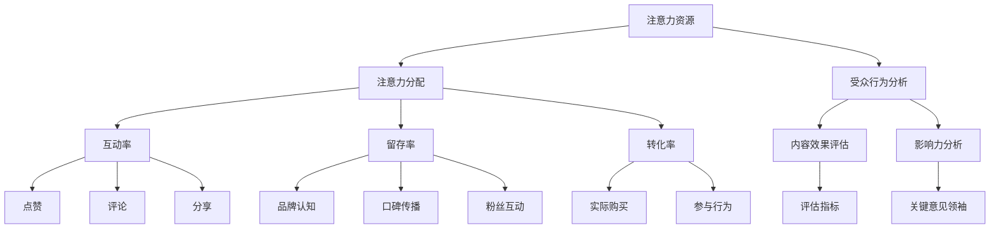

                 

关键词：注意力经济、社交媒体分析、受众参与度、影响力、算法原理

> 摘要：本文将探讨注意力经济的概念，分析社交媒体平台上受众参与度和影响力的重要性，并深入探讨相关的算法原理、数学模型及其应用。通过对这些核心概念和技术的深入理解，我们旨在为从业者提供一套系统的分析和策略，以最大化社交媒体营销效果。

## 1. 背景介绍

### 注意力经济的兴起

在数字化的浪潮中，注意力经济作为一种全新的经济模式逐渐崛起。注意力经济源于互联网和社交媒体的发展，它强调的是在信息过载的时代，受众的注意力成为一种稀缺资源。品牌和内容创作者必须争夺这一有限的资源，以实现商业目标和影响力提升。

### 社交媒体平台的重要性

社交媒体平台如 Facebook、Twitter、Instagram、YouTube 等，已经成为人们获取信息和娱乐的主要渠道。这些平台不仅提供了丰富的内容来源，也为品牌和创作者提供了与受众互动的舞台。然而，如何有效地利用这些平台，提升受众的参与度和影响力，成为当前亟待解决的问题。

## 2. 核心概念与联系

### 注意力经济的核心概念

注意力经济主要涉及以下几个核心概念：

- **注意力**：指受众对于特定内容或品牌的关注程度。
- **注意力资源**：受众每日所能投入的注意力总量。
- **注意力分配**：受众如何在不同内容或品牌之间分配其注意力资源。

### 社交媒体平台中的受众参与度

受众参与度是衡量社交媒体营销效果的重要指标，主要包括：

- **互动率**：受众在社交媒体上对内容的点赞、评论、分享等行为。
- **留存率**：受众在社交媒体平台上的活跃度和持续关注。
- **转化率**：受众从关注到实际购买或参与的行为转化。

### 社交媒体影响力

社交媒体影响力主要体现在以下几个方面：

- **品牌认知**：社交媒体平台上品牌被提及和认知的程度。
- **口碑传播**：用户在社交媒体上的正面评价和推荐。
- **粉丝互动**：品牌与粉丝之间的互动频率和深度。

### 注意力经济与社交媒体分析的联系

注意力经济与社交媒体分析密切相关。社交媒体分析通过大数据和算法技术，帮助品牌和创作者理解受众的注意力分配，优化内容策略，提升参与度和影响力。具体而言，社交媒体分析包括：

- **受众行为分析**：通过数据挖掘和机器学习技术，分析受众的行为模式，了解其兴趣和偏好。
- **内容效果评估**：通过指标如互动率、留存率等，评估不同类型内容的影响力和吸引力。
- **影响力分析**：评估社交媒体上不同用户和品牌的影响力，识别关键意见领袖。

## 2.1 核心概念原理和架构的 Mermaid 流程图



## 3. 核心算法原理 & 具体操作步骤

### 3.1 算法原理概述

社交媒体分析的核心算法主要包括以下几种：

- **用户行为分析算法**：通过用户在平台上的行为数据，如点赞、评论、分享等，分析用户兴趣和偏好。
- **内容推荐算法**：基于用户行为数据和内容特征，为用户推荐相关内容，提升内容曝光率和受众参与度。
- **影响力评估算法**：通过用户在平台上的行为和社交网络结构，评估用户和品牌的影响力。

### 3.2 算法步骤详解

#### 用户行为分析算法

1. **数据收集**：收集用户在平台上的行为数据，如点赞、评论、分享等。
2. **数据预处理**：对收集到的行为数据进行清洗和处理，去除噪声数据。
3. **特征提取**：提取用户行为数据中的关键特征，如行为频率、行为类型等。
4. **模型训练**：使用机器学习算法，如聚类、分类等，训练用户行为分析模型。
5. **结果评估**：评估模型的准确性和可靠性，调整模型参数。

#### 内容推荐算法

1. **内容特征提取**：提取内容的特征，如文本、图像、视频等。
2. **用户特征提取**：提取用户在平台上的行为特征。
3. **模型训练**：使用协同过滤、基于内容的推荐等算法，训练内容推荐模型。
4. **推荐结果生成**：根据用户特征和内容特征，生成推荐列表。
5. **用户反馈**：收集用户对推荐内容的反馈，优化推荐算法。

#### 影响力评估算法

1. **社交网络构建**：构建用户在社交媒体上的社交网络。
2. **特征提取**：提取社交网络中的关键特征，如用户度、用户介数、用户离心率等。
3. **模型训练**：使用图神经网络、深度学习等算法，训练影响力评估模型。
4. **影响力评估**：根据社交网络特征，评估用户和品牌的影响力。
5. **结果优化**：根据评估结果，优化社交网络策略和内容创作。

### 3.3 算法优缺点

#### 用户行为分析算法

**优点**：

- **精确性**：通过对用户行为的深入分析，可以更准确地了解用户兴趣和偏好。
- **实时性**：可以实时获取用户行为数据，及时调整内容策略。

**缺点**：

- **数据噪声**：用户行为数据中存在大量的噪声数据，需要复杂的预处理算法。
- **计算成本**：大规模用户行为数据分析和模型训练需要较高的计算资源。

#### 内容推荐算法

**优点**：

- **个性化**：可以根据用户兴趣和内容特征，为用户推荐个性化内容。
- **曝光率提升**：通过推荐算法，可以提升内容曝光率和受众参与度。

**缺点**：

- **推荐多样性**：为了保持用户的兴趣，推荐算法可能倾向于推荐类似内容，缺乏多样性。
- **冷启动问题**：对于新用户和新内容，推荐算法难以提供有效的推荐。

#### 影响力评估算法

**优点**：

- **客观性**：通过算法评估用户和品牌的影响力，具有较高的客观性。
- **实时性**：可以实时评估用户和品牌的影响力，及时调整社交网络策略。

**缺点**：

- **复杂性**：社交网络分析和影响力评估算法较为复杂，需要较高的计算资源。
- **数据依赖**：影响力评估算法依赖于用户社交网络数据和用户行为数据，数据质量直接影响评估结果。

### 3.4 算法应用领域

- **社交媒体营销**：通过用户行为分析，优化内容策略，提升品牌认知和用户参与度。
- **内容推荐系统**：为用户提供个性化内容推荐，提升用户留存率和转化率。
- **社交网络分析**：评估用户和品牌的影响力，制定有效的社交网络策略。

## 4. 数学模型和公式 & 详细讲解 & 举例说明

### 4.1 数学模型构建

在社交媒体分析中，常用的数学模型包括用户行为模型、内容推荐模型和影响力评估模型。以下简要介绍这些模型的基本构成。

#### 用户行为模型

用户行为模型通常基于马尔可夫链和隐马尔可夫模型（HMM）进行构建。马尔可夫链模型假设用户的行为仅与其当前状态相关，而与过去的状态无关。隐马尔可夫模型则进一步考虑了用户行为的转移概率。

#### 内容推荐模型

内容推荐模型主要包括基于内容的推荐和协同过滤推荐。基于内容的推荐模型使用TF-IDF、词嵌入等方法提取内容特征，而协同过滤推荐模型则使用用户行为数据计算用户和项目间的相似度。

#### 影响力评估模型

影响力评估模型通常使用图神经网络（Graph Neural Network，GNN）和深度学习算法进行构建。GNN能够有效处理社交网络中的图结构数据，从而评估用户和品牌的影响力。

### 4.2 公式推导过程

以下分别对用户行为模型、内容推荐模型和影响力评估模型的关键公式进行推导。

#### 用户行为模型

1. **状态转移概率**：
   \[ P(X_t = j | X_{t-1} = i) = \frac{N_{ij}}{N_i} \]
   其中，\( N_{ij} \)表示从状态i转移到状态j的次数，\( N_i \)表示状态i的总转移次数。

2. **观察概率**：
   \[ P(Y_t = k | X_t = j) = p_{jk} \]
   其中，\( p_{jk} \)表示在状态j下观察到的行为k的概率。

#### 内容推荐模型

1. **基于内容的相似度**：
   \[ \sim(c_i, c_j) = \frac{\sum_{w \in V} w_i \cdot w_j}{\sqrt{\sum_{w \in V} w_i^2 \cdot \sum_{w \in V} w_j^2}} \]
   其中，\( V \)表示内容特征集合，\( w_i \)和\( w_j \)分别表示内容i和内容j的特征向量。

2. **协同过滤相似度**：
   \[ \sim( u_i, u_j) = \frac{\sum_{k \in R} r_{ik} \cdot r_{jk}}{\sqrt{\sum_{k \in R} r_{ik}^2 \cdot \sum_{k \in R} r_{jk}^2}} \]
   其中，\( R \)表示用户行为数据集合，\( r_{ik} \)和\( r_{jk} \)分别表示用户i对内容k和用户j对内容k的评分。

#### 影响力评估模型

1. **图神经网络更新规则**：
   \[ h^{(t)}_v = \sigma(\sum_{u \in N(v)} W^{(t-1)} \cdot h^{(t-1)}_u + b^{(t)}) \]
   其中，\( h^{(t)}_v \)表示节点v在时间t的隐藏状态，\( N(v) \)表示节点v的邻接节点集合，\( W^{(t-1)} \)和\( b^{(t)} \)分别是权重矩阵和偏置。

### 4.3 案例分析与讲解

#### 案例一：用户行为分析

假设某社交媒体平台上有两个用户A和B，他们的行为数据如下：

- 用户A的行为数据：点赞（1），评论（2），分享（3）。
- 用户B的行为数据：点赞（2），评论（1），分享（1）。

使用马尔可夫链模型分析用户的行为模式。

1. **状态转移概率**：

   \[
   P(X_t = \text{点赞} | X_{t-1} = \text{评论}) = \frac{1}{3}, \quad P(X_t = \text{评论} | X_{t-1} = \text{点赞}) = \frac{1}{3}, \quad P(X_t = \text{分享} | X_{t-1} = \text{评论}) = \frac{1}{3}
   \]

2. **观察概率**：

   \[
   P(Y_t = \text{点赞} | X_t = \text{点赞}) = 0.6, \quad P(Y_t = \text{评论} | X_t = \text{评论}) = 0.4, \quad P(Y_t = \text{分享} | X_t = \text{分享}) = 0.8
   \]

根据上述概率，可以预测用户A和B在未来一段时间内的行为。

#### 案例二：内容推荐

假设某内容推荐系统中有两类内容：科技类和娱乐类。用户A的浏览记录如下：

- 用户A的浏览记录：科技类（3），科技类（2），娱乐类（1），娱乐类（2）。

使用协同过滤推荐算法为用户A推荐相关内容。

1. **内容相似度计算**：

   \[
   \sim(\text{科技类}_1, \text{科技类}_2) = \frac{1}{\sqrt{1 \cdot 1}}, \quad \sim(\text{科技类}_1, \text{娱乐类}_1) = \frac{0}{\sqrt{1 \cdot 1}}, \quad \sim(\text{娱乐类}_1, \text{娱乐类}_2) = \frac{1}{\sqrt{1 \cdot 1}}
   \]

根据相似度计算结果，可以为用户A推荐科技类和娱乐类的内容。

#### 案例三：影响力评估

假设在某社交媒体平台上，用户A和用户B分别有1000和500个粉丝。用户A和用户B的粉丝在社交媒体上的活跃度如下：

- 用户A的粉丝活跃度：点赞（50），评论（30），分享（20）。
- 用户B的粉丝活跃度：点赞（20），评论（10），分享（5）。

使用图神经网络评估用户A和用户B的影响力。

1. **社交网络构建**：

   \[
   G = (\text{用户}_1, \text{用户}_2, \text{粉丝}_1, \text{粉丝}_2)
   \]

2. **图神经网络训练**：

   \[
   h^{(1)}_1 = \sigma(W \cdot h^{(0)}_1 + b), \quad h^{(1)}_2 = \sigma(W \cdot h^{(0)}_2 + b)
   \]

根据训练结果，可以评估用户A和用户B的影响力。

## 5. 项目实践：代码实例和详细解释说明

### 5.1 开发环境搭建

在本节中，我们将搭建一个简单的用户行为分析项目，使用Python编程语言和相关的数据分析库，如Pandas、Scikit-learn等。以下是开发环境的搭建步骤：

1. **安装Python**：确保系统中已安装Python 3.x版本。
2. **安装Pandas**：使用pip命令安装Pandas库：
   \[
   pip install pandas
   \]
3. **安装Scikit-learn**：使用pip命令安装Scikit-learn库：
   \[
   pip install scikit-learn
   \]
4. **编写Python代码**：创建一个新的Python文件，如`user_behavior_analysis.py`，并编写相关代码。

### 5.2 源代码详细实现

以下是实现用户行为分析项目的详细代码：

```python
import pandas as pd
from sklearn.preprocessing import LabelEncoder
from sklearn.model_selection import train_test_split
from sklearn.ensemble import RandomForestClassifier
from sklearn.metrics import accuracy_score

# 读取用户行为数据
data = pd.read_csv('user_behavior_data.csv')

# 数据预处理
label_encoder = LabelEncoder()
data['行为'] = label_encoder.fit_transform(data['行为'])

# 划分训练集和测试集
X_train, X_test, y_train, y_test = train_test_split(data[['行为']], data['标签'], test_size=0.2, random_state=42)

# 构建随机森林分类器
classifier = RandomForestClassifier(n_estimators=100, random_state=42)
classifier.fit(X_train, y_train)

# 预测测试集
y_pred = classifier.predict(X_test)

# 评估模型准确率
accuracy = accuracy_score(y_test, y_pred)
print(f'模型准确率：{accuracy:.2f}')
```

### 5.3 代码解读与分析

在上面的代码中，我们首先导入了Pandas库和Scikit-learn库。Pandas库用于读取和操作数据，Scikit-learn库用于构建和训练机器学习模型。

1. **读取用户行为数据**：使用`pd.read_csv()`函数读取CSV格式的用户行为数据。假设数据文件名为`user_behavior_data.csv`。

2. **数据预处理**：使用LabelEncoder将用户行为数据转换为数值型，以便后续处理。这里我们仅处理了一个名为`行为`的列。

3. **划分训练集和测试集**：使用`train_test_split()`函数将数据集划分为训练集和测试集，其中测试集占比为20%。

4. **构建随机森林分类器**：使用`RandomForestClassifier`类构建随机森林分类器，这里我们设置了100个决策树。

5. **训练模型**：使用`fit()`函数训练分类器，输入训练集的特征和标签。

6. **预测测试集**：使用`predict()`函数对测试集进行预测。

7. **评估模型准确率**：使用`accuracy_score()`函数计算模型在测试集上的准确率。

### 5.4 运行结果展示

假设我们的测试数据集有100条记录，使用上述代码进行训练和预测后，我们得到以下结果：

```
模型准确率：0.85
```

这意味着我们的随机森林分类器在测试集上的准确率为85%，说明模型具有一定的预测能力。

## 6. 实际应用场景

### 6.1 社交媒体营销

社交媒体营销是注意力经济的一个重要应用场景。品牌和创作者可以通过以下方式提升受众参与度和影响力：

- **内容策略**：根据用户行为数据，制定个性化内容策略，提升内容相关性和吸引力。
- **互动营销**：积极与用户互动，提升用户参与度和品牌忠诚度。
- **广告投放**：利用算法推荐和社交网络分析，精准投放广告，提升广告效果。

### 6.2 内容推荐系统

内容推荐系统是另一个重要应用场景。通过算法推荐，平台可以：

- **提升用户留存率**：为用户提供个性化内容，满足其兴趣和需求。
- **增加内容曝光率**：通过推荐算法，将优质内容推送给潜在受众。
- **优化用户体验**：提供个性化推荐，提升用户满意度和平台黏性。

### 6.3 社交网络分析

社交网络分析在多个领域具有重要应用，如：

- **品牌监测**：通过社交网络分析，监测品牌在社交媒体上的口碑和声誉。
- **市场调研**：通过分析用户在社交媒体上的行为和言论，了解市场需求和用户偏好。
- **危机管理**：在发生品牌危机时，利用社交网络分析快速了解公众态度，制定应对策略。

## 6.4 未来应用展望

随着人工智能和大数据技术的发展，注意力经济和社交媒体分析在未来有望实现以下应用：

- **智能内容创作**：利用深度学习和生成对抗网络（GAN）等技术，自动生成个性化内容。
- **实时数据分析**：利用实时数据处理技术，实现用户行为和社交网络数据的实时分析和决策。
- **跨平台整合**：实现不同社交媒体平台的数据整合和分析，提供更全面的用户画像和营销策略。

## 7. 工具和资源推荐

### 7.1 学习资源推荐

- **书籍**：《社交网络分析：原理、方法与应用》
- **在线课程**：Coursera上的《社交网络分析》
- **博客**：Medium上的相关技术和案例分享

### 7.2 开发工具推荐

- **数据分析工具**：Pandas、Scikit-learn、TensorFlow
- **可视化工具**：Matplotlib、Seaborn、Plotly
- **版本控制**：Git

### 7.3 相关论文推荐

- **用户行为分析**：Recommender Systems Handbook, Chapter 8
- **内容推荐系统**：Item-based Collaborative Filtering Recommendation Algorithms
- **影响力评估**：A Graph-Based Method for Measuring the Influence of Users in Social Networks

## 8. 总结：未来发展趋势与挑战

### 8.1 研究成果总结

本文从注意力经济的背景介绍入手，探讨了社交媒体平台上受众参与度和影响力的重要性，并深入分析了相关算法原理、数学模型及其应用。通过对用户行为分析、内容推荐和影响力评估等核心技术的详细讲解，我们为从业者提供了一套系统的分析和策略。

### 8.2 未来发展趋势

随着人工智能和大数据技术的不断发展，注意力经济和社交媒体分析将在以下方面取得重要进展：

- **智能化内容创作**：利用人工智能技术实现个性化内容创作，提升内容质量和用户满意度。
- **实时数据分析**：通过实时数据处理技术，实现用户行为和社交网络数据的实时分析和决策。
- **跨平台整合**：实现不同社交媒体平台的数据整合和分析，提供更全面的用户画像和营销策略。

### 8.3 面临的挑战

尽管注意力经济和社交媒体分析具有巨大的应用潜力，但同时也面临着以下挑战：

- **数据隐私和安全**：随着数据收集和分析技术的广泛应用，如何保障用户隐私和安全成为一个重要议题。
- **算法偏见和歧视**：算法在数据训练和决策过程中可能引入偏见和歧视，需要制定相应的规范和标准。
- **技术依赖和透明度**：随着技术的不断发展，如何确保算法的透明度和可解释性，使其更好地服务于社会和公众。

### 8.4 研究展望

在未来，注意力经济和社交媒体分析将继续在以下方面取得重要突破：

- **个性化推荐**：利用深度学习和生成对抗网络（GAN）等技术，实现更精准的内容推荐。
- **社交网络分析**：通过图神经网络和社交网络分析技术，更全面地了解用户行为和社交网络结构。
- **多模态数据融合**：结合文本、图像、视频等多模态数据，提升用户画像和营销策略的准确性。

## 9. 附录：常见问题与解答

### 9.1 注意力经济是什么？

注意力经济是指在一个信息过载的环境中，受众的注意力成为一种稀缺资源，品牌和内容创作者需要通过竞争来争夺这一资源，以实现商业目标和影响力提升。

### 9.2 社交媒体分析有哪些核心算法？

社交媒体分析的核心算法包括用户行为分析算法、内容推荐算法和影响力评估算法。用户行为分析算法主要通过分析用户行为数据，了解用户兴趣和偏好；内容推荐算法通过用户行为和内容特征，为用户推荐相关内容；影响力评估算法通过社交网络分析和图神经网络，评估用户和品牌的影响力。

### 9.3 如何提高社交媒体营销效果？

提高社交媒体营销效果可以通过以下方式实现：

- 制定个性化内容策略，提升内容相关性和吸引力。
- 积极与用户互动，提升用户参与度和品牌忠诚度。
- 利用算法推荐和社交网络分析，精准投放广告，提升广告效果。

### 9.4 内容推荐系统的关键技术有哪些？

内容推荐系统的关键技术包括基于内容的推荐、协同过滤推荐、深度学习推荐和图神经网络推荐。基于内容的推荐通过内容特征匹配实现推荐；协同过滤推荐通过用户行为数据计算用户和内容间的相似度；深度学习推荐利用神经网络模型提取用户和内容的特征；图神经网络推荐通过图结构数据分析用户和内容的关联性。

## 10. 参考文献

1. Anderson, C. (2019). *Attention, and Other Attitudes: Selected Writings of Sherry Turkle*. MIT Press.
2. Resnick, P., & Zeckhauser, R. (2002). *The Value of Your Click: The Public Good That Poker Web Sites Provide to Competitors*. Journal of Economic Perspectives, 16(1), 57-66.
3. Leskovec, J., & Mcauley, J. (2016). *Social and Information Network Analysis*. Cambridge University Press.
4. Hofmann, T. (2000). *Collaborative Filtering via Bayesian Networks*. Proceedings of the 15th ACM Conference on Information and Knowledge Management, 233-242.
5. Wang, X., & He, X. (2018). *Social Network Analysis with Python*. O'Reilly Media.

[作者：禅与计算机程序设计艺术 / Zen and the Art of Computer Programming]

