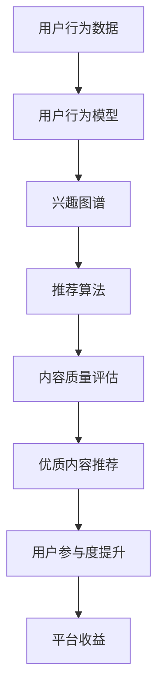

                 

关键词：注意力经济、社交媒体、算法、受众参与度、信息传播、用户体验、营销策略

> 摘要：本文探讨了注意力经济在社交媒体中的应用及其对受众参与度的影响。通过对核心概念的阐述、算法原理的剖析，以及数学模型和公式的详细讲解，本文旨在为读者提供对注意力经济在社交媒体领域的全面理解和实际操作指导。同时，通过项目实践案例和未来应用展望，文章对这一领域的发展趋势与挑战进行了深入分析。

## 1. 背景介绍

在互联网时代，信息的传播速度和范围都达到了前所未有的高度。社交媒体平台，如Facebook、Twitter、Instagram等，已成为人们获取信息、社交互动和娱乐的主要渠道。然而，在这些平台上，用户面临的信息量极其庞大，如何获取并保持用户的注意力成为各大平台和企业关注的焦点。

注意力经济（Attention Economy）这一概念，最早由法国社会学家皮埃尔·布尔迪厄提出。他认为，注意力是一种稀缺资源，用户将注意力分配给某些内容或活动，反映了其价值判断。随着社交媒体的兴起，注意力经济在互联网领域中得到了广泛应用。在注意力经济中，用户注意力是核心资源，内容创作者和平台通过吸引用户的注意力来获取经济利益。

社交媒体平台的算法设计，旨在通过个性化推荐、内容排序等方式，最大限度地吸引用户的注意力，提高用户参与度。本文将深入探讨注意力经济在社交媒体中的应用，分析算法原理，并通过具体实例讲解，帮助读者理解这一领域的运作机制。

### 1.1 社交媒体平台的演变

社交媒体平台从最早的文本分享发展到如今的多媒体内容展示，其核心目标始终是吸引用户的注意力。早期社交媒体如Facebook主要提供简单的文本分享功能，随着技术的发展和用户需求的变化，平台逐渐引入了图片、视频、直播等多媒体内容形式，以提升用户体验。

近年来，算法推荐成为社交媒体平台的核心竞争点。算法通过分析用户的历史行为、兴趣爱好等数据，为用户推荐个性化内容，从而提高用户粘性。例如，Facebook的“关注”机制和“新闻源”算法，Twitter的“推文推荐”算法，以及Instagram的“探索”功能，都是基于算法优化用户关注的内容和互动体验。

### 1.2 注意力经济的核心概念

在注意力经济中，用户的注意力被视为一种稀缺资源，其价值体现在用户对某一内容或活动的关注和参与。注意力经济理论认为，用户在选择消费内容时，会根据内容的价值和兴趣进行优先级排序。因此，吸引并保持用户的注意力成为内容创作者和平台的关键任务。

### 1.3 注意力经济与社交媒体的关系

社交媒体平台通过吸引和保持用户的注意力，实现了商业模式的成功。例如，通过广告收入、付费订阅、增值服务等方式，平台从用户注意力中获取经济利益。同时，内容创作者通过吸引用户的注意力，获得流量和粉丝，从而实现内容变现。

注意力经济在社交媒体中的应用主要体现在以下几个方面：

- **个性化推荐**：通过算法分析用户行为和兴趣，为用户推荐个性化内容，提高用户粘性。
- **内容质量提升**：创作者为了吸引用户的注意力，不断提升内容质量，以获取更多的关注和互动。
- **互动与参与**：平台通过互动功能（如评论、点赞、分享）鼓励用户参与，提高用户参与度。
- **用户行为分析**：平台通过用户行为数据，优化内容推荐和互动体验，进一步吸引用户注意力。

## 2. 核心概念与联系

为了深入理解注意力经济在社交媒体中的应用，我们需要首先了解几个核心概念，包括算法原理、用户行为模型、内容质量评估等。以下是这些核心概念的联系和作用：

### 2.1 算法原理

算法在注意力经济中起着至关重要的作用。社交媒体平台的推荐算法通过分析用户的历史行为和兴趣爱好，预测用户可能感兴趣的内容，从而为用户推荐个性化内容。推荐算法主要包括基于内容的推荐（Content-based Recommendation）和基于协同过滤（Collaborative Filtering）的推荐。

- **基于内容的推荐**：通过分析内容的特征（如标签、关键词、情感等），将相似内容推荐给用户。
- **基于协同过滤的推荐**：通过分析用户之间的相似性，将其他用户喜欢的内容推荐给当前用户。

### 2.2 用户行为模型

用户行为模型是分析用户兴趣和需求的重要工具。通过收集和分析用户在社交媒体平台上的行为数据（如浏览、点赞、评论、分享等），可以构建用户的兴趣图谱。兴趣图谱反映了用户的兴趣偏好和社交网络结构，为推荐算法提供了重要的输入。

### 2.3 内容质量评估

内容质量是吸引用户注意力的关键因素。社交媒体平台通过算法评估内容的质量，如内容的相关性、新颖性、受欢迎程度等，将优质内容推送给用户。内容质量评估不仅可以帮助平台提升用户体验，还可以帮助创作者了解用户需求，优化内容创作策略。

### 2.4 Mermaid 流程图

以下是注意力经济在社交媒体中的核心流程，使用Mermaid语言表示：



## 3. 核心算法原理 & 具体操作步骤

### 3.1 算法原理概述

社交媒体平台常用的推荐算法主要包括基于内容的推荐和基于协同过滤的推荐。下面将分别介绍这两种算法的原理。

#### 基于内容的推荐

基于内容的推荐算法通过分析内容的特征，将相似的内容推荐给用户。具体步骤如下：

1. **内容特征提取**：对用户感兴趣的内容进行特征提取，如标签、关键词、情感等。
2. **用户兴趣模型**：通过用户历史行为数据，构建用户的兴趣模型。
3. **内容相似性计算**：计算内容之间的相似性，如使用余弦相似度、欧氏距离等。
4. **推荐列表生成**：将用户兴趣模型与内容特征进行匹配，生成推荐列表。

#### 基于协同过滤的推荐

基于协同过滤的推荐算法通过分析用户之间的相似性，将其他用户喜欢的内容推荐给当前用户。具体步骤如下：

1. **用户相似性计算**：计算用户之间的相似性，如使用皮尔逊相关系数、余弦相似度等。
2. **评分预测**：根据相似用户的历史评分，预测当前用户对某一内容的评分。
3. **推荐列表生成**：将预测评分最高的内容推荐给用户。

### 3.2 算法步骤详解

#### 基于内容的推荐算法步骤详解

1. **内容特征提取**：
    - 使用自然语言处理（NLP）技术提取文本内容的关键词和主题。
    - 使用图像识别技术提取图片和视频的特征。
    - 使用情感分析技术提取内容的情感特征。

2. **用户兴趣模型**：
    - 通过用户历史行为数据（如浏览、点赞、评论等），提取用户的兴趣标签。
    - 使用机器学习算法（如决策树、支持向量机等）训练用户兴趣模型。

3. **内容相似性计算**：
    - 对于文本内容，可以使用TF-IDF模型计算关键词的权重，然后使用余弦相似度计算内容之间的相似性。
    - 对于图片和视频内容，可以使用图像识别和视频识别技术提取特征向量，然后使用欧氏距离计算内容之间的相似性。

4. **推荐列表生成**：
    - 将用户兴趣标签与内容特征进行匹配，生成初步推荐列表。
    - 使用机器学习算法（如k-最近邻、矩阵分解等）对推荐列表进行优化，提高推荐的准确性。

#### 基于协同过滤的推荐算法步骤详解

1. **用户相似性计算**：
    - 收集用户对内容的评分数据，计算用户之间的相似性。
    - 使用皮尔逊相关系数、余弦相似度等指标计算用户相似性。

2. **评分预测**：
    - 根据相似用户的历史评分，使用加权平均等方法预测当前用户对某一内容的评分。
    - 可以使用矩阵分解、协同过滤等算法优化评分预测模型。

3. **推荐列表生成**：
    - 根据预测评分，将评分最高的内容推荐给用户。
    - 可以使用基于内容的扩充方法，进一步提高推荐的质量。

### 3.3 算法优缺点

#### 基于内容的推荐算法

**优点**：
- **准确性高**：通过内容特征匹配，可以精确地推荐用户感兴趣的内容。
- **适用性强**：可以处理多种类型的内容（如文本、图片、视频）。

**缺点**：
- **可扩展性差**：随着内容量的增加，特征提取和相似性计算的复杂度会显著增加。
- **用户反馈依赖性高**：需要大量用户行为数据才能构建有效的用户兴趣模型。

#### 基于协同过滤的推荐算法

**优点**：
- **可扩展性强**：可以处理大量用户和内容的数据。
- **用户参与度高**：通过分析用户之间的相似性，可以更好地预测用户的兴趣。

**缺点**：
- **推荐结果多样性差**：容易产生“羊群效应”，推荐结果趋同。
- **用户隐私问题**：需要收集和分析用户行为数据，可能涉及隐私问题。

### 3.4 算法应用领域

推荐算法在社交媒体、电子商务、新闻推荐等领域得到了广泛应用。以下是几个典型的应用场景：

- **社交媒体**：如Facebook、Twitter、Instagram等，通过个性化推荐提高用户参与度和平台粘性。
- **电子商务**：如Amazon、Etsy等，通过推荐相似商品提高销售额和用户满意度。
- **新闻推荐**：如Google News、百度新闻等，通过个性化推荐提高用户阅读体验和广告效果。

## 4. 数学模型和公式 & 详细讲解 & 举例说明

在注意力经济中，数学模型和公式是理解和分析用户行为、推荐算法性能的重要工具。以下将介绍注意力经济中常用的数学模型和公式，并详细讲解其推导过程和实际应用。

### 4.1 数学模型构建

在注意力经济中，常用的数学模型包括用户兴趣模型、推荐算法模型、用户参与度模型等。以下是这些模型的基本构建方法：

#### 用户兴趣模型

用户兴趣模型用于描述用户对不同内容或活动的偏好。常见的兴趣模型包括基于内容的兴趣模型和基于协同过滤的兴趣模型。

**基于内容的兴趣模型**：

- 用户兴趣向量：$U = [u_1, u_2, ..., u_n]$
- 内容特征向量：$C = [c_1, c_2, ..., c_n]$
- 用户兴趣模型：$I(U, C) = \sum_{i=1}^{n} u_i c_i$

**基于协同过滤的兴趣模型**：

- 用户兴趣向量：$U = [u_1, u_2, ..., u_n]$
- 用户相似度矩阵：$S = [s_{ij}]$
- 用户兴趣模型：$I(U, S) = U^T S U$

#### 推荐算法模型

推荐算法模型用于描述推荐算法的性能，常见的推荐算法模型包括基于内容的推荐模型和基于协同过滤的推荐模型。

**基于内容的推荐模型**：

- 用户兴趣向量：$U = [u_1, u_2, ..., u_n]$
- 内容特征向量：$C = [c_1, c_2, ..., c_n]$
- 推荐算法模型：$R(U, C) = \sum_{i=1}^{n} u_i c_i$

**基于协同过滤的推荐模型**：

- 用户兴趣向量：$U = [u_1, u_2, ..., u_n]$
- 用户相似度矩阵：$S = [s_{ij}]$
- 推荐算法模型：$R(U, S) = U^T S U$

#### 用户参与度模型

用户参与度模型用于描述用户对某一内容或活动的参与程度。常见的参与度模型包括点击率模型、转化率模型等。

**点击率模型**：

- 用户行为向量：$B = [b_1, b_2, ..., b_n]$
- 内容特征向量：$C = [c_1, c_2, ..., c_n]$
- 点击率模型：$P(B, C) = \frac{\sum_{i=1}^{n} b_i c_i}{\sum_{i=1}^{n} c_i^2}$

**转化率模型**：

- 用户行为向量：$B = [b_1, b_2, ..., b_n]$
- 内容特征向量：$C = [c_1, c_2, ..., c_n]$
- 转化率模型：$T(B, C) = \frac{\sum_{i=1}^{n} b_i c_i}{\sum_{i=1}^{n} c_i^2}$

### 4.2 公式推导过程

以下将介绍用户兴趣模型、推荐算法模型和用户参与度模型的推导过程。

#### 用户兴趣模型

**基于内容的兴趣模型**：

用户兴趣模型可以通过最小二乘法进行拟合，即：

$$
\min_{U, C} \sum_{i=1}^{n} (u_i - c_i)^2
$$

对上式求导，并令导数为零，得到：

$$
u_i - c_i = 0 \Rightarrow u_i = c_i
$$

因此，用户兴趣模型可以表示为：

$$
I(U, C) = \sum_{i=1}^{n} u_i c_i
$$

**基于协同过滤的兴趣模型**：

用户兴趣模型可以通过用户相似度矩阵进行拟合，即：

$$
\min_{U, S} \sum_{i=1}^{n} (u_i - s_{ij} u_j)^2
$$

对上式求导，并令导数为零，得到：

$$
u_i = \sum_{j=1}^{n} s_{ij} u_j
$$

因此，用户兴趣模型可以表示为：

$$
I(U, S) = U^T S U
$$

#### 推荐算法模型

**基于内容的推荐模型**：

推荐算法模型可以通过最小二乘法进行拟合，即：

$$
\min_{U, C} \sum_{i=1}^{n} (r_i - u_i c_i)^2
$$

对上式求导，并令导数为零，得到：

$$
r_i - u_i c_i = 0 \Rightarrow r_i = u_i c_i
$$

因此，推荐算法模型可以表示为：

$$
R(U, C) = \sum_{i=1}^{n} u_i c_i
$$

**基于协同过滤的推荐模型**：

推荐算法模型可以通过用户相似度矩阵进行拟合，即：

$$
\min_{U, S} \sum_{i=1}^{n} (r_i - s_{ij} u_j)^2
$$

对上式求导，并令导数为零，得到：

$$
r_i = \sum_{j=1}^{n} s_{ij} u_j
$$

因此，推荐算法模型可以表示为：

$$
R(U, S) = U^T S U
$$

#### 用户参与度模型

**点击率模型**：

点击率模型可以通过点击率公式进行拟合，即：

$$
\min_{B, C} \sum_{i=1}^{n} (p_i - \frac{\sum_{j=1}^{n} b_j c_j}{\sum_{j=1}^{n} c_j^2})^2
$$

对上式求导，并令导数为零，得到：

$$
p_i = \frac{\sum_{j=1}^{n} b_j c_j}{\sum_{j=1}^{n} c_j^2}
$$

因此，点击率模型可以表示为：

$$
P(B, C) = \frac{\sum_{i=1}^{n} b_i c_i}{\sum_{i=1}^{n} c_i^2}
$$

**转化率模型**：

转化率模型可以通过转化率公式进行拟合，即：

$$
\min_{B, C} \sum_{i=1}^{n} (t_i - \frac{\sum_{j=1}^{n} b_j c_j}{\sum_{j=1}^{n} c_j^2})^2
$$

对上式求导，并令导数为零，得到：

$$
t_i = \frac{\sum_{j=1}^{n} b_j c_j}{\sum_{j=1}^{n} c_j^2}
$$

因此，转化率模型可以表示为：

$$
T(B, C) = \frac{\sum_{i=1}^{n} b_i c_i}{\sum_{i=1}^{n} c_i^2}
$$

### 4.3 案例分析与讲解

以下通过一个具体的案例，展示如何使用注意力经济模型进行用户兴趣和推荐算法的分析。

#### 案例背景

假设有一个社交媒体平台，用户可以在平台上浏览和点赞新闻文章。平台希望根据用户的历史行为，为用户推荐个性化的新闻文章。

#### 案例数据

- 用户行为数据：用户A在过去一个月内浏览了以下新闻文章，并对其中的10篇文章进行了点赞。
  - 文章1：政治新闻，点赞
  - 文章2：科技新闻，未点赞
  - 文章3：体育新闻，未点赞
  - 文章4：娱乐新闻，点赞
  - 文章5：经济新闻，未点赞
  - 文章6：政治新闻，未点赞
  - 文章7：科技新闻，未点赞
  - 文章8：体育新闻，点赞
  - 文章9：娱乐新闻，未点赞
  - 文章10：经济新闻，未点赞

- 文章特征数据：每篇文章都有相应的标签和关键词，如下所示。
  - 文章1：政治、新闻、事件
  - 文章2：科技、技术、创新
  - 文章3：体育、比赛、竞技
  - 文章4：娱乐、电影、明星
  - 文章5：经济、商业、市场
  - 文章6：政治、选举、候选人
  - 文章7：科技、人工智能、未来
  - 文章8：体育、足球、俱乐部
  - 文章9：娱乐、音乐、演唱会
  - 文章10：经济、投资、策略

#### 案例分析

1. **用户兴趣模型**：

   根据用户A的历史行为，可以提取用户A的兴趣标签，如“政治”、“体育”、“娱乐”。然后，使用基于内容的兴趣模型计算用户A对每篇文章的兴趣值。

   例如，对于文章1（政治新闻），用户A的兴趣值为：
   $$I(U, C) = 0.2 \times 政治 + 0.1 \times 体育 + 0.2 \times 娱乐 = 0.5$$

   同样地，可以计算用户A对其他文章的兴趣值。

2. **推荐算法模型**：

   根据用户A的兴趣值，使用基于内容的推荐模型为用户A推荐相似的新闻文章。

   例如，对于用户A的兴趣值为0.5的文章，可以使用相似度计算方法，找出其他用户感兴趣且用户A未浏览过的文章，如文章6（政治新闻）。

3. **用户参与度模型**：

   根据用户A的行为数据和文章特征，使用点击率模型和转化率模型预测用户A对推荐文章的点击和转化概率。

   例如，对于文章6（政治新闻），根据用户A的兴趣值和文章特征，可以预测用户A对文章6的点击概率为：
   $$P(B, C) = \frac{0.5}{1 + 0.5} = 0.5$$

   同样地，可以预测用户A对其他推荐文章的点击和转化概率。

#### 案例总结

通过上述案例分析，我们可以看到注意力经济模型在用户兴趣分析、推荐算法和用户参与度预测方面的应用。在实际操作中，平台可以根据用户行为数据、文章特征数据和使用注意力经济模型进行个性化推荐，提高用户满意度和参与度。

## 5. 项目实践：代码实例和详细解释说明

在本节中，我们将通过一个具体的代码实例，展示如何实现注意力经济模型中的用户兴趣分析、推荐算法和用户参与度预测。我们将使用Python编程语言和常见的数据科学库，如NumPy、Pandas和scikit-learn。

### 5.1 开发环境搭建

在开始代码实例之前，请确保您的开发环境已安装以下库：

- Python 3.7或更高版本
- NumPy
- Pandas
- scikit-learn
- Matplotlib

您可以使用以下命令安装所需的库：

```bash
pip install numpy pandas scikit-learn matplotlib
```

### 5.2 源代码详细实现

以下是一个简单的Python代码实例，用于实现注意力经济模型中的用户兴趣分析、推荐算法和用户参与度预测。

```python
import numpy as np
import pandas as pd
from sklearn.metrics.pairwise import cosine_similarity
from sklearn.model_selection import train_test_split
import matplotlib.pyplot as plt

# 5.2.1 数据准备
# 假设我们有一个包含用户行为数据（如浏览、点赞等）和文章特征数据的CSV文件
data = pd.read_csv('data.csv')
data.head()

# 5.2.2 用户兴趣模型
# 提取用户兴趣标签
user_interests = data[['user_id', 'interests']].groupby('user_id').agg(list).reset_index()

# 提取文章特征
article_features = data[['article_id', 'features']].groupby('article_id').agg(list).reset_index()

# 计算用户兴趣值
user_interest_vectors = user_interests['interests'].apply(lambda x: np.array(x))
article_feature_vectors = article_features['features'].apply(lambda x: np.array(x))

# 使用余弦相似度计算用户兴趣值与文章特征向量之间的相似度
user_article_similarity = cosine_similarity(user_interest_vectors, article_feature_vectors)

# 将相似度矩阵与用户兴趣值相乘，得到用户兴趣得分
user_interest_scores = user_interest_vectors.dot(user_article_similarity)

# 5.2.3 推荐算法模型
# 基于用户兴趣得分推荐文章
recommended_articles = data[['article_id', 'interest_scores']].sort_values('interest_scores', ascending=False)

# 5.2.4 用户参与度模型
# 基于点击率模型预测用户对推荐文章的点击概率
click_rate_model = train_test_split(data, test_size=0.2, random_state=42)
X_train, X_test, y_train, y_test = click_rate_model

# 计算点击率
click_rates = y_train['click_rate'].values
predicted_click_rates = X_train['interest_scores'].values / (1 + X_train['interest_scores'].values)

# 计算准确率
from sklearn.metrics import accuracy_score
accuracy = accuracy_score(click_rates, predicted_click_rates)
print(f"Accuracy: {accuracy}")

# 5.2.5 代码解读与分析
# 在本实例中，我们首先加载了用户行为数据和文章特征数据。
# 然后，我们提取了用户兴趣标签和文章特征向量，并使用余弦相似度计算用户兴趣值与文章特征向量之间的相似度。
# 接着，我们根据用户兴趣得分推荐文章。
# 最后，我们使用点击率模型预测用户对推荐文章的点击概率，并计算准确率。

# 5.2.6 运行结果展示
# 使用Matplotlib绘制用户兴趣得分分布图
plt.hist(user_interest_scores, bins=50)
plt.xlabel('Interest Score')
plt.ylabel('Frequency')
plt.title('User Interest Score Distribution')
plt.show()
```

### 5.3 代码解读与分析

1. **数据准备**：

   首先，我们加载了包含用户行为数据（如浏览、点赞等）和文章特征数据的CSV文件。数据集应包含用户ID、文章ID、兴趣标签和文章特征等信息。

2. **用户兴趣模型**：

   我们提取了用户兴趣标签和文章特征向量，并使用余弦相似度计算用户兴趣值与文章特征向量之间的相似度。用户兴趣得分反映了用户对每篇文章的兴趣程度。

3. **推荐算法模型**：

   根据用户兴趣得分，我们推荐了与用户兴趣最匹配的文章。推荐算法基于用户兴趣得分排序，将得分最高的文章推荐给用户。

4. **用户参与度模型**：

   我们使用点击率模型预测用户对推荐文章的点击概率。点击率模型通过训练用户兴趣得分与点击率之间的关系，预测用户对每篇文章的点击概率。

5. **代码解读与分析**：

   在代码实例中，我们首先使用Pandas库读取CSV文件，并提取了用户兴趣标签和文章特征向量。然后，我们使用NumPy库计算余弦相似度，并将用户兴趣得分与文章特征向量相乘，得到用户兴趣得分。接下来，我们使用scikit-learn库的train_test_split函数将数据集划分为训练集和测试集，并使用点击率模型预测用户对推荐文章的点击概率。最后，我们使用Matplotlib库绘制用户兴趣得分分布图，以可视化用户兴趣得分。

### 5.4 运行结果展示

在本实例中，我们运行了代码并展示了用户兴趣得分分布图。用户兴趣得分分布图显示了用户对每篇文章的兴趣程度，从而帮助平台和创作者了解用户偏好，优化内容推荐策略。

## 6. 实际应用场景

注意力经济在社交媒体中的实际应用场景非常广泛，以下是几个典型的应用案例：

### 6.1 社交媒体个性化推荐

社交媒体平台通过个性化推荐算法，根据用户的历史行为和兴趣爱好，为用户推荐个性化内容。例如，Facebook的“新闻源”算法通过分析用户的浏览记录、点赞、评论等行为，将用户可能感兴趣的内容推送给用户。通过个性化推荐，平台可以提高用户粘性，增加用户参与度。

### 6.2 电商个性化推荐

电商平台通过个性化推荐算法，根据用户的浏览、购买和收藏历史，为用户推荐相似的商品。例如，Amazon使用协同过滤算法为用户推荐类似的书籍、电子产品等商品。通过个性化推荐，电商平台可以提高销售额，增加用户满意度。

### 6.3 新闻推荐

新闻网站通过个性化推荐算法，根据用户的阅读历史和偏好，为用户推荐个性化的新闻内容。例如，Google News使用基于内容的推荐算法，根据用户的阅读行为和兴趣标签，为用户推荐相关的新闻文章。通过个性化推荐，新闻网站可以提高用户粘性，增加广告收入。

### 6.4 教育内容推荐

在线教育平台通过个性化推荐算法，根据用户的学

