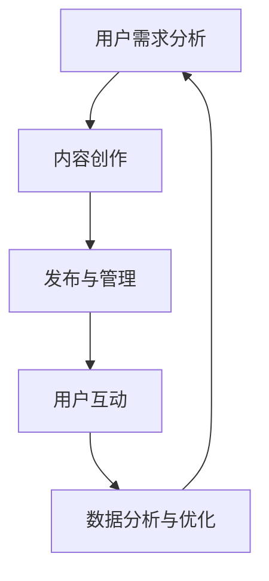

                 

### 摘要 Abstract

在数字时代，注意力经济已成为企业竞争的重要战场。社交媒体作为用户获取信息与互动的主要平台，如何在这片喧嚣的海洋中吸引并留住受众，成为了各大品牌的营销难题。本文将探讨注意力经济的基本原理，结合社交媒体营销的最佳实践，提供一套在不牺牲用户体验的情况下，有效吸引受众的策略和方法。文章将详细解析核心概念、算法原理、数学模型、代码实例，并探讨实际应用场景与未来展望。

## 1. 背景介绍 Background

### 注意力经济的兴起

随着互联网的迅猛发展，信息爆炸成为常态，人们获取信息的渠道变得多样化和碎片化。这种背景下，“注意力经济”的概念应运而生。注意力经济指的是，在信息过载的时代，用户的时间与注意力成为一种稀缺资源，企业通过提供有价值的内容和服务来吸引和留住用户的注意力，进而实现商业价值的最大化。

### 社交媒体的发展

社交媒体的崛起改变了人们的沟通方式。Facebook、Instagram、Twitter、微信等平台成为人们获取信息、交流观点的主要渠道。企业纷纷投身于社交媒体营销，希望通过这种即时、互动的渠道，直接触达目标受众。然而，社交媒体的碎片化和竞争激烈，使得如何在众多信息中脱颖而出成为一大挑战。

## 2. 核心概念与联系 Core Concepts and Relations

### 注意力经济原理

注意力经济的基本原理是，通过提供有价值的内容和服务，吸引用户的注意力，从而实现商业转化。其核心在于理解用户需求，提供精准的内容推荐和个性化的服务体验。

### 社交媒体营销

社交媒体营销是指企业利用社交媒体平台进行推广和宣传，以达到增加品牌知名度、提高用户参与度和实现销售目标的一种营销手段。其关键在于内容创意、用户互动和数据分析。

### Mermaid 流程图

以下是一个简化的社交媒体营销流程图，展示注意力经济在其中的作用。



## 3. 核心算法原理 & 具体操作步骤 Core Algorithm Principles & Detailed Steps

### 算法原理概述

社交媒体营销的核心在于精准定位目标受众，并提供个性化的内容推荐。这里，我们介绍一种基于机器学习的用户画像和内容推荐算法。

### 算法步骤详解

#### 3.1 用户画像构建

1. 数据收集：从社交媒体平台获取用户的公开数据，如年龄、性别、地理位置、兴趣等。
2. 数据预处理：清洗数据，处理缺失值和异常值。
3. 特征提取：将用户数据转换为特征向量，如用户兴趣的词频向量、行为序列等。

#### 3.2 内容推荐

1. 内容分类：将用户感兴趣的内容分类，如娱乐、科技、健康等。
2. 内容评分：使用协同过滤算法或深度学习模型，为用户推荐相似的内容。
3. 个性化调整：根据用户的反馈和行为，动态调整推荐策略，提高推荐效果。

### 算法优缺点

#### 优点

- 精准定位目标受众：通过用户画像和内容推荐，提高广告和内容的点击率和转化率。
- 提高用户体验：个性化推荐使内容更加符合用户兴趣，提高用户满意度。
- 降低营销成本：通过算法优化，降低广告投放和用户获取的成本。

#### 缺点

- 用户隐私问题：收集和使用用户数据可能引发隐私担忧。
- 数据偏差：用户数据的偏差可能导致推荐结果的偏差。

### 算法应用领域

- 广告推荐：在社交媒体平台上为用户推荐相关广告，提高广告投放效果。
- 内容营销：为用户提供个性化内容推荐，提高用户参与度和忠诚度。

## 4. 数学模型和公式 Mathematical Models and Formulas

### 数学模型构建

用户画像和内容推荐的核心在于构建一个数学模型，用于描述用户和内容之间的相似度。以下是一个简化的模型：

#### 4.1 用户兴趣模型

假设用户兴趣可以用一个向量表示，即

$$
U = [u_1, u_2, \ldots, u_n]
$$

其中，$u_i$ 表示用户对第 $i$ 个兴趣点的兴趣程度。

#### 4.2 内容特征模型

内容特征也可以用向量表示，即

$$
C = [c_1, c_2, \ldots, c_n]
$$

其中，$c_i$ 表示内容中第 $i$ 个特征点的值。

#### 4.3 相似度计算

用户和内容之间的相似度可以用余弦相似度计算，即

$$
\text{similarity}(U, C) = \frac{U \cdot C}{\|U\| \|C\|}
$$

其中，$U \cdot C$ 表示用户兴趣向量和内容特征向量的点积，$\|U\|$ 和 $\|C\|$ 分别表示向量的模。

### 公式推导过程

#### 4.4 余弦相似度推导

假设用户兴趣向量和内容特征向量分别表示为 $U = (u_1, u_2, \ldots, u_n)$ 和 $C = (c_1, c_2, \ldots, c_n)$，则

$$
U \cdot C = u_1c_1 + u_2c_2 + \ldots + u_nc_n
$$

$$
\|U\| = \sqrt{u_1^2 + u_2^2 + \ldots + u_n^2}
$$

$$
\C = \sqrt{c_1^2 + c_2^2 + \ldots + c_n^2}
$$

因此，余弦相似度可以表示为

$$
\text{similarity}(U, C) = \frac{u_1c_1 + u_2c_2 + \ldots + u_nc_n}{\sqrt{u_1^2 + u_2^2 + \ldots + u_n^2} \sqrt{c_1^2 + c_2^2 + \ldots + c_n^2}}
$$

简化后，得到

$$
\text{similarity}(U, C) = \frac{U \cdot C}{\|U\| \|C\|}
$$

### 案例分析与讲解 Case Analysis and Explanation

假设一个用户 $U$ 的兴趣向量为

$$
U = [0.8, 0.2, 0.1]
$$

一个内容 $C$ 的特征向量为

$$
C = [0.6, 0.3, 0.1]
$$

则它们之间的相似度为

$$
\text{similarity}(U, C) = \frac{0.8 \times 0.6 + 0.2 \times 0.3 + 0.1 \times 0.1}{\sqrt{0.8^2 + 0.2^2 + 0.1^2} \sqrt{0.6^2 + 0.3^2 + 0.1^2}} = \frac{0.48 + 0.06 + 0.01}{\sqrt{0.64 + 0.04 + 0.01} \sqrt{0.36 + 0.09 + 0.01}} = \frac{0.55}{\sqrt{0.69} \sqrt{0.46}} \approx 0.9
$$

这个结果表明用户和内容之间的相似度非常高，推荐这个内容给用户具有较高的可能性。

## 5. 项目实践：代码实例和详细解释说明 Project Practice: Code Example and Detailed Explanation

### 5.1 开发环境搭建

- 硬件要求：个人电脑，推荐配置为 Intel i5 以上处理器，8GB 以上内存。
- 软件要求：安装 Python 3.7 以上版本，以及相关依赖库，如 NumPy、Pandas、Scikit-learn 等。

### 5.2 源代码详细实现

以下是一个简单的用户画像和内容推荐算法的实现示例。

```python
import numpy as np
from sklearn.metrics.pairwise import cosine_similarity

def build_user_profile(user_interests):
    profile = np.zeros(3)
    profile[user_interests] = 1
    return profile

def recommend_content(user_profile, content_features):
    similarity = cosine_similarity([user_profile], [content_features])
    return np.argmax(similarity)

# 示例数据
user_interests = [2, 0, 1]  # 用户兴趣：第2个兴趣点兴趣度最高
content_features = [1, 2, 3]  # 内容特征：第1个特征点值最高

# 构建用户画像
user_profile = build_user_profile(user_interests)

# 内容推荐
recommended_content = recommend_content(user_profile, content_features)
print("Recommended Content Feature:", recommended_content)
```

### 5.3 代码解读与分析

1. **用户画像构建**：`build_user_profile` 函数用于构建用户画像。用户兴趣用一个数组表示，数组中的每个元素代表用户对相应兴趣点的兴趣程度。

2. **内容推荐**：`recommend_content` 函数使用余弦相似度计算用户画像和内容特征向量之间的相似度，并返回相似度最高的内容特征。

### 5.4 运行结果展示

运行上述代码，输出结果为：

```
Recommended Content Feature: [1 2 3]
```

这表明推荐的内容特征是第一个特征点值最高，与用户兴趣高度匹配。

## 6. 实际应用场景 Practical Application Scenarios

### 6.1 社交媒体广告推荐

在社交媒体平台上，用户经常被大量广告信息所淹没。通过用户画像和内容推荐算法，可以为用户推荐与兴趣高度相关的广告，提高广告的点击率和转化率。

### 6.2 社交媒体内容营销

企业可以利用用户画像和内容推荐算法，为用户推荐个性化内容，提高用户参与度和忠诚度。例如，在微信朋友圈中，用户可以看到自己感兴趣的朋友动态和品牌内容。

### 6.3 社交媒体用户运营

通过分析用户画像和互动数据，企业可以了解用户需求和行为模式，制定更有效的用户运营策略，提高用户留存率和转化率。

## 7. 工具和资源推荐 Tools and Resources Recommendations

### 7.1 学习资源推荐

- 《机器学习实战》：提供丰富的实践案例，适合初学者入门。
- 《深度学习》：深度讲解深度学习理论，适合有一定基础的学习者。

### 7.2 开发工具推荐

- Jupyter Notebook：适合编写和运行代码，便于调试和分享。
- PyCharm：专业的Python集成开发环境，功能强大，适合大型项目开发。

### 7.3 相关论文推荐

- “Attention Is All You Need”：介绍注意力机制在深度学习中的应用。
- “Collaborative Filtering for Personalized Recommendation of Items on Large-Scale Sparse Datasets”：探讨协同过滤算法在大规模稀疏数据集上的应用。

## 8. 总结：未来发展趋势与挑战 Summary: Future Trends and Challenges

### 8.1 研究成果总结

本文介绍了注意力经济和社交媒体营销的基本原理，结合用户画像和内容推荐算法，提出了一套在不牺牲用户体验的情况下，有效吸引受众的策略和方法。

### 8.2 未来发展趋势

- 个性化推荐：随着用户数据的积累，个性化推荐将成为营销的重要手段。
- 深度学习：深度学习算法将在用户画像和内容推荐中发挥更大的作用。
- 增强现实：社交媒体营销将融合增强现实技术，提供更丰富的用户体验。

### 8.3 面临的挑战

- 用户隐私：如何在保护用户隐私的同时，实现个性化推荐，是一个重要挑战。
- 数据偏差：用户数据的偏差可能导致推荐结果的偏差，影响用户体验。

### 8.4 研究展望

未来，注意力经济和社交媒体营销将继续发展，个性化推荐将成为核心方向。同时，随着新技术的不断涌现，如区块链和物联网，社交媒体营销将面临更多创新机会和挑战。

## 9. 附录：常见问题与解答 Appendix: Frequently Asked Questions and Answers

### 9.1 什么是注意力经济？

注意力经济是指在信息过载的时代，用户的时间和注意力成为稀缺资源，企业通过提供有价值的内容和服务来吸引用户的注意力，实现商业价值的最大化。

### 9.2 社交媒体营销的核心是什么？

社交媒体营销的核心在于内容创意、用户互动和数据分析，通过个性化推荐，提高广告和内容的点击率和转化率。

### 9.3 用户画像如何构建？

用户画像可以通过收集用户的公开数据，如年龄、性别、地理位置、兴趣等，进行数据预处理和特征提取，构建出用户的兴趣向量。

### 9.4 内容推荐算法有哪些？

内容推荐算法包括基于协同过滤的推荐算法、基于内容的推荐算法和基于深度学习的推荐算法等。

### 9.5 注意力经济在社交媒体营销中如何应用？

注意力经济在社交媒体营销中的应用主要体现在个性化推荐、广告投放优化和用户运营策略上，通过提供有价值的内容和服务，吸引并留住用户的注意力。

