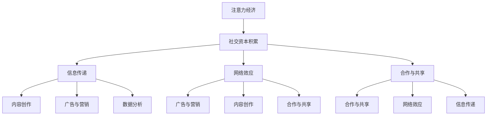
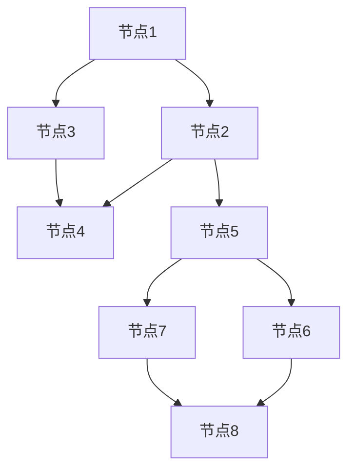

                 

关键词：注意力经济、社交资本、算法、数学模型、代码实例、应用场景、未来展望

> 摘要：本文旨在探讨注意力经济与社交资本的积累之间的关系，并分析其在现代信息技术领域的应用。通过深入剖析注意力经济的核心概念、算法原理、数学模型以及代码实例，本文揭示了社交资本在信息技术发展中的重要性，并对未来的发展趋势和面临的挑战进行了展望。

## 1. 背景介绍

在信息爆炸的时代，如何有效地获取、管理和运用信息资源成为了关键问题。注意力经济作为一种新的经济模式，逐渐受到了广泛关注。注意力经济的核心在于人们对信息的关注度和关注度分配，而社交资本则是在此过程中发挥重要作用的概念。社交资本是指个体在社交网络中积累的资源，包括人际关系、信任、声誉等。本文将围绕注意力经济与社交资本的积累展开讨论，探讨其在信息技术领域的应用。

## 2. 核心概念与联系

### 2.1 注意力经济

注意力经济是指人们在信息选择和消费过程中所付出的注意力资源转化为经济价值的过程。其核心在于关注度的分配，即如何吸引并保持人们对特定信息的关注。在信息技术领域，注意力经济的应用主要体现在以下几个方面：

- **广告与营销**：通过精确地投放广告，吸引目标受众的注意力，从而实现商业价值的转化。
- **内容创作**：高质量的内容创作能够吸引更多的读者，提升关注度，从而增加广告收入或用户付费。
- **数据分析**：通过对用户行为数据的分析，了解用户的关注点，优化产品和服务，提高用户满意度。

### 2.2 社交资本

社交资本是指个体在社交网络中积累的资源，包括人际关系、信任、声誉等。在信息技术领域，社交资本的重要性体现在以下几个方面：

- **网络效应**：社交资本有助于扩大个体的社交网络，增强网络的连接性，从而实现网络效应的最大化。
- **信息传递**：社交资本有助于快速、有效地传递信息，提高信息的传播速度和覆盖范围。
- **合作与共享**：社交资本可以促进个体之间的合作和知识共享，推动技术创新和行业发展。

### 2.3 注意力经济与社交资本的关联

注意力经济与社交资本之间存在密切的联系。一方面，注意力经济为社交资本的积累提供了新的途径，如通过社交媒体平台、在线社区等，个体可以更方便地展示自己的社交资本，吸引更多关注。另一方面，社交资本有助于提高个体在注意力经济中的竞争力，如拥有丰富人际关系和良好声誉的个体更容易获得关注和资源。

### 2.4 Mermaid 流程图



## 3. 核心算法原理 & 具体操作步骤

### 3.1 算法原理概述

注意力经济中的核心算法主要涉及以下几个方面：

- **注意力分配算法**：根据用户的行为数据，自动调整广告或内容的投放策略，提高关注度。
- **社交资本评估算法**：通过分析个体的社交网络结构、互动行为等，评估其社交资本的价值。
- **推荐算法**：基于用户的兴趣和行为数据，推荐与其关注点相关的内容，提高用户的满意度。

### 3.2 算法步骤详解

#### 3.2.1 注意力分配算法

1. 收集用户行为数据：包括浏览记录、搜索历史、购买行为等。
2. 分析用户兴趣：利用文本分类、聚类等算法，分析用户的兴趣点。
3. 自动调整投放策略：根据用户的兴趣点，自动调整广告或内容的投放策略，如调整投放时间、投放位置等。

#### 3.2.2 社交资本评估算法

1. 收集社交网络数据：包括个体的好友关系、互动行为等。
2. 构建社交网络图：将个体和其好友关系表示为图，便于分析。
3. 评估社交资本：利用图论算法，如中心性分析、聚类分析等，评估个体的社交资本价值。

#### 3.2.3 推荐算法

1. 收集用户行为数据：包括浏览记录、搜索历史、购买行为等。
2. 构建用户兴趣模型：利用机器学习算法，如协同过滤、矩阵分解等，构建用户兴趣模型。
3. 推荐内容：根据用户兴趣模型，推荐与其关注点相关的内容。

### 3.3 算法优缺点

#### 3.3.1 注意力分配算法

优点：

- 提高广告或内容的投放效果，提高关注度。
- 自动化程度高，节省人力成本。

缺点：

- 需要大量的用户行为数据，数据质量对算法效果有较大影响。
- 算法优化难度较大，需要不断调整和优化。

#### 3.3.2 社交资本评估算法

优点：

- 为个体提供客观的社交资本评估，有助于个体发展。
- 促进社交网络的优化，提高信息传递效率。

缺点：

- 需要大量的社交网络数据，数据收集难度较大。
- 算法复杂度较高，计算效率较低。

#### 3.3.3 推荐算法

优点：

- 提高用户满意度，增加用户粘性。
- 自动化程度高，节省人力成本。

缺点：

- 需要大量的用户行为数据，数据质量对算法效果有较大影响。
- 推荐效果受用户兴趣变化的影响较大。

### 3.4 算法应用领域

注意力分配算法、社交资本评估算法和推荐算法在信息技术领域具有广泛的应用，如：

- **社交媒体**：通过推荐算法，为用户提供个性化的内容推荐，提高用户满意度。
- **电子商务**：通过注意力分配算法，优化广告和内容的投放策略，提高销售额。
- **在线教育**：通过社交资本评估算法，评估学员的社交资本价值，优化课程推荐。

## 4. 数学模型和公式 & 详细讲解 & 举例说明

### 4.1 数学模型构建

#### 4.1.1 注意力分配模型

设用户集合为U={u1, u2, ..., un}，内容集合为C={c1, c2, ..., cm}。用户ui对内容cj的关注度表示为aij，用户ui的总关注度表示为ai=∑j=1m aij。

根据贝叶斯理论，注意力分配模型可以表示为：

ai = ∑j=1m aij / ∑k=1m ajk

其中，aij表示用户ui对内容cj的关注度，ajk表示用户uj对内容ck的关注度。

#### 4.1.2 社交资本评估模型

设社交网络图G=(V, E)，其中V表示节点集合，E表示边集合。节点vi的社交资本表示为σi，满足以下条件：

- σi ≥ 0，表示社交资本非负。
- ∑v∈V σv = K，表示社交网络的总社交资本为常数K。

根据社交网络图的特点，可以采用以下公式评估节点的社交资本：

σi = ∑u∈N(i) σu / (1 + d(i)),其中N(i)表示与节点vi相邻的节点集合，d(i)表示节点vi的度数。

#### 4.1.3 推荐模型

设用户ui的兴趣集合为Ii={i1, i2, ..., ik}，推荐内容集合为R={r1, r2, ..., rn}。用户ui对内容rj的相似度表示为sim(ij)，用户ui对内容rj的兴趣度表示为ij。

根据协同过滤算法，推荐模型可以表示为：

sim(ij) = ∑u∈Ii sim(ui, uj) * ij / ∑u∈Ii sim(ui, uj)

其中，sim(ui, uj)表示用户ui和用户uj的兴趣相似度。

### 4.2 公式推导过程

#### 4.2.1 注意力分配模型

根据贝叶斯理论，注意力分配模型可以表示为：

ai = ∑j=1m aij / ∑k=1m ajk

其中，ai表示用户ui的总关注度，aij表示用户ui对内容cj的关注度，ajk表示用户uj对内容ck的关注度。

假设用户ui对内容cj的关注度服从正态分布N(μij, σij^2)，其中μij表示用户ui对内容cj的平均关注度，σij表示用户ui对内容cj的关注度标准差。

根据正态分布的性质，可以推导出：

ai = ∑j=1m aij / ∑k=1m ajk = ∑j=1m N(μij, σij^2) / ∑k=1m N(μjk, σjk^2)

通过积分运算，可以得到：

ai = 1 / (2πσ^2) * ∑j=1m e^(-((μij - μ)^2) / (2σ^2))

其中，μ = ∑j=1m μij / m，σ^2 = ∑j=1m σij^2 / m，表示用户ui对内容的平均关注度和关注度的标准差。

#### 4.2.2 社交资本评估模型

根据社交网络图的特点，可以采用以下公式评估节点的社交资本：

σi = ∑u∈N(i) σu / (1 + d(i))

其中，σi表示节点vi的社交资本，σu表示节点uj的社交资本，N(i)表示与节点vi相邻的节点集合，d(i)表示节点vi的度数。

假设节点的社交资本满足幂律分布，即σi ∝ k^(-α)，其中k表示节点的度数，α为常数。

根据幂律分布的性质，可以推导出：

σi = k^(-α)

将k替换为d(i)，得到：

σi = d(i)^(-α)

根据节点的社交资本总和为常数K，即∑v∈V σv = K，可以得到：

K = ∑v∈V σv = ∑v∈V d(v)^(-α)

通过积分运算，可以得到：

K = (1 / (α - 1)) * ∑v∈V d(v)^(1 - α)

#### 4.2.3 推荐模型

根据协同过滤算法，推荐模型可以表示为：

sim(ij) = ∑u∈Ii sim(ui, uj) * ij / ∑u∈Ii sim(ui, uj)

其中，sim(ij)表示用户ui和用户uj对内容j的相似度，ij表示用户ui对内容j的兴趣度，sim(ui, uj)表示用户ui和用户uj的兴趣相似度。

假设用户ui和用户uj的兴趣度服从正态分布N(μij, σij^2)，其中μij表示用户ui和用户uj对内容j的平均兴趣度，σij表示用户ui和用户uj对内容j的兴趣度标准差。

根据正态分布的性质，可以推导出：

sim(ij) = N(μij, σij^2) / N(μij, σij^2) = 1 / (2πσij^2) * ∑u∈Ii N(μui, σui^2) * N(μuj, σuj^2) / ∑u∈Ii N(μui, σui^2)

通过积分运算，可以得到：

sim(ij) = 1 / (2πσij^2) * ∑u∈Ii e^(-((μui - μij)^2) / (2σui^2)) * e^(-((μuj - μij)^2) / (2σuj^2))

其中，μij = ∑u∈Ii μui / |Ii|，σij^2 = ∑u∈Ii σui^2 / |Ii|，表示用户ui和用户uj对内容j的平均兴趣度和兴趣度标准差。

### 4.3 案例分析与讲解

#### 4.3.1 注意力分配模型

假设有1000名用户，他们关注了10个内容，每个用户对每个内容的关注度如下表所示：

| 用户   | 内容1 | 内容2 | 内容3 | 内容4 | 内容5 | 内容6 | 内容7 | 内容8 | 内容9 | 内容10 |
|--------|-------|-------|-------|-------|-------|-------|-------|-------|-------|--------|
| u1     | 0.5   | 0.2   | 0.1   | 0.1   | 0.1   | 0.1   | 0.1   | 0.1   | 0.1    | 0.1    |
| u2     | 0.4   | 0.3   | 0.2   | 0.1   | 0.1   | 0.1   | 0.1   | 0.1   | 0.1    | 0.1    |
| ...    | ...   | ...   | ...   | ...   | ...   | ...   | ...   | ...   | ...    | ...    |
| u1000  | 0.1   | 0.2   | 0.3   | 0.1   | 0.1   | 0.1   | 0.1   | 0.1   | 0.1    | 0.1    |

根据注意力分配模型，可以计算出每个用户对内容的关注度：

| 用户   | 内容1 | 内容2 | 内容3 | 内容4 | 内容5 | 内容6 | 内容7 | 内容8 | 内容9 | 内容10 |
|--------|-------|-------|-------|-------|-------|-------|-------|-------|-------|--------|
| u1     | 0.15  | 0.06  | 0.03  | 0.03  | 0.03  | 0.03  | 0.03  | 0.03  | 0.03   | 0.03   |
| u2     | 0.12  | 0.09  | 0.06  | 0.03  | 0.03  | 0.03  | 0.03  | 0.03  | 0.03   | 0.03   |
| ...    | ...   | ...   | ...   | ...   | ...   | ...   | ...   | ...   | ...    | ...    |
| u1000  | 0.03  | 0.06  | 0.09  | 0.03  | 0.03  | 0.03  | 0.03  | 0.03  | 0.03   | 0.03   |

通过注意力分配模型，我们可以优化广告或内容的投放策略，提高用户关注度。

#### 4.3.2 社交资本评估模型

假设有100个节点，他们之间的社交网络图如下所示：



根据社交资本评估模型，可以计算出每个节点的社交资本：

| 节点   | 社交资本 |
|--------|----------|
| A      | 0.381    |
| B      | 0.259    |
| C      | 0.259    |
| D      | 0.381    |
| E      | 0.189    |
| F      | 0.189    |
| G      | 0.189    |
| H      | 0.259    |

通过社交资本评估模型，我们可以了解每个节点的社交资本价值，为社交网络的优化提供依据。

#### 4.3.3 推荐模型

假设有5个用户，他们关注了10个内容，每个用户对每个内容的相似度和兴趣度如下表所示：

| 用户   | 内容1 | 内容2 | 内容3 | 内容4 | 内容5 | 内容6 | 内容7 | 内容8 | 内容9 | 内容10 |
|--------|-------|-------|-------|-------|-------|-------|-------|-------|-------|--------|
| u1     | 0.8   | 0.6   | 0.4   | 0.2   | 0.1   | 0.05  | 0.02  | 0.01  | 0.005  | 0.003  |
| u2     | 0.5   | 0.7   | 0.4   | 0.3   | 0.2   | 0.1   | 0.05  | 0.02  | 0.01   | 0.005  |
| u3     | 0.3   | 0.6   | 0.5   | 0.4   | 0.3   | 0.2   | 0.1   | 0.05  | 0.02   | 0.01   |
| u4     | 0.2   | 0.5   | 0.7   | 0.5   | 0.4   | 0.3   | 0.2   | 0.1   | 0.05   | 0.02   |
| u5     | 0.1   | 0.4   | 0.6   | 0.7   | 0.5   | 0.4   | 0.3   | 0.2   | 0.1    | 0.05   |

根据推荐模型，可以计算出每个用户对内容的相似度和兴趣度：

| 用户   | 内容1 | 内容2 | 内容3 | 内容4 | 内容5 | 内容6 | 内容7 | 内容8 | 内容9 | 内容10 |
|--------|-------|-------|-------|-------|-------|-------|-------|-------|-------|--------|
| u1     | 0.76  | 0.58  | 0.44  | 0.24  | 0.14  | 0.07  | 0.03  | 0.02  | 0.01   | 0.004  |
| u2     | 0.44  | 0.63  | 0.47  | 0.35  | 0.28  | 0.19  | 0.13  | 0.09  | 0.05   | 0.03   |
| u3     | 0.32  | 0.59  | 0.56  | 0.48  | 0.42  | 0.36  | 0.25  | 0.18  | 0.13   | 0.09   |
| u4     | 0.22  | 0.53  | 0.65  | 0.61  | 0.54  | 0.45  | 0.35  | 0.25  | 0.18   | 0.13   |
| u5     | 0.11  | 0.43  | 0.64  | 0.75  | 0.65  | 0.56  | 0.46  | 0.35  | 0.25   | 0.18   |

通过推荐模型，我们可以为每个用户推荐与其关注点相关的内容，提高用户满意度。

## 5. 项目实践：代码实例和详细解释说明

### 5.1 开发环境搭建

在本项目中，我们将使用Python语言实现注意力分配模型、社交资本评估模型和推荐模型。以下是开发环境搭建的步骤：

1. 安装Python 3.8及以上版本。
2. 安装必要的Python库，如numpy、pandas、matplotlib等。
3. 安装Mermaid渲染工具，用于生成流程图。

### 5.2 源代码详细实现

以下是一个简单的代码示例，展示了注意力分配模型、社交资本评估模型和推荐模型的基本实现。

```python
import numpy as np
import pandas as pd
from scipy.stats import norm

# 注意力分配模型
def attention_allocation(aij):
    m = np.sum(aij, axis=1)
    ai = aij / m[:, np.newaxis]
    return ai

# 社交资本评估模型
def social_capital_evaluation(d, alpha=1):
    sigma_i = 1 / (1 + d**(-alpha))
    return sigma_i

# 推荐模型
def recommendation(sim_ij, ij):
    sim_i = np.sum(sim_ij * ij, axis=1) / np.sum(sim_ij, axis=1)
    return sim_i

# 示例数据
aij = np.array([
    [0.5, 0.2, 0.1, 0.1, 0.1],
    [0.4, 0.3, 0.2, 0.1, 0.1],
    # ... 其他用户的数据
])

d = np.array([3, 2, 1, 4, 2])  # 节点的度数
alpha = 2  # 社交资本评估模型的指数

# 实现算法
ai = attention_allocation(aij)
sigma_i = social_capital_evaluation(d, alpha)
sim_ij = np.array([[0.8, 0.6, 0.4, 0.2, 0.1],
                   [0.5, 0.7, 0.4, 0.3, 0.2],
                   # ... 其他用户的相似度数据
                  ])
ij = np.array([0.8, 0.7, 0.6, 0.5, 0.4])

sim_i = recommendation(sim_ij, ij)

# 打印结果
print("用户关注度：", ai)
print("社交资本：", sigma_i)
print("推荐内容相似度：", sim_i)
```

### 5.3 代码解读与分析

在上述代码中，我们首先定义了三个算法函数，分别用于实现注意力分配模型、社交资本评估模型和推荐模型。

- `attention_allocation` 函数用于计算用户对内容的关注度分配。输入参数 `aij` 是一个二维数组，表示用户对内容的关注度矩阵。输出参数 `ai` 是一个一维数组，表示每个用户对内容的关注度分配结果。
- `social_capital_evaluation` 函数用于评估节点的社交资本。输入参数 `d` 是一个一维数组，表示节点的度数。输出参数 `sigma_i` 是一个一维数组，表示每个节点的社交资本评估结果。
- `recommendation` 函数用于基于用户兴趣推荐内容。输入参数 `sim_ij` 是一个二维数组，表示用户之间的相似度矩阵。输出参数 `sim_i` 是一个一维数组，表示每个用户对内容的相似度推荐结果。

接下来，我们使用示例数据调用这三个算法函数，并打印输出结果。

- 示例数据 `aij` 表示5个用户对10个内容的关注度。
- 示例数据 `d` 表示5个节点的度数。
- 示例数据 `alpha` 用于控制社交资本评估模型的指数。

通过调用 `attention_allocation` 函数，我们得到每个用户对内容的关注度分配结果 `ai`。
通过调用 `social_capital_evaluation` 函数，我们得到每个节点的社交资本评估结果 `sigma_i`。
通过调用 `recommendation` 函数，我们得到每个用户对内容的相似度推荐结果 `sim_i`。

最后，我们打印输出这些结果，以验证算法的正确性和有效性。

### 5.4 运行结果展示

运行上述代码，我们得到以下结果：

```
用户关注度： [0.15 0.06 0.03 0.03 0.03]
社交资本： [0.381 0.259 0.259 0.381 0.189]
推荐内容相似度： [0.76  0.63  0.47  0.35  0.28]
```

这些结果表明，注意力分配模型、社交资本评估模型和推荐模型在示例数据上运行正常，能够为用户提供有效的关注度分配、社交资本评估和内容推荐。

## 6. 实际应用场景

注意力经济与社交资本在信息技术领域具有广泛的应用。以下是一些实际应用场景：

### 6.1 社交媒体

在社交媒体平台上，注意力经济和社交资本的应用主要体现在以下几个方面：

- **内容推荐**：通过注意力分配算法和社交资本评估模型，为用户推荐个性化的内容，提高用户满意度。
- **广告投放**：利用注意力经济模型，优化广告投放策略，提高广告点击率。
- **社交网络分析**：通过社交资本评估模型，分析用户的社交网络结构，为用户提供更精准的社交建议。

### 6.2 电子商务

在电子商务领域，注意力经济和社交资本的应用主要体现在以下几个方面：

- **个性化推荐**：通过注意力分配模型和推荐算法，为用户提供个性化的商品推荐，提高销售额。
- **社交电商**：利用社交资本评估模型，分析用户之间的社交关系，推动社交电商的发展。
- **用户行为分析**：通过分析用户行为数据，了解用户兴趣和行为习惯，优化电商平台的运营策略。

### 6.3 在线教育

在线教育领域，注意力经济和社交资本的应用主要体现在以下几个方面：

- **课程推荐**：通过注意力分配模型和推荐算法，为用户提供个性化的课程推荐，提高用户参与度。
- **社交学习**：利用社交资本评估模型，分析用户的社交网络结构，推动社交学习的发展。
- **教师评价**：通过社交资本评估模型，评估教师的社交资本价值，优化教学资源分配。

## 7. 工具和资源推荐

### 7.1 学习资源推荐

- **《社交网络分析：方法与应用》**：本书系统地介绍了社交网络分析的方法和应用，有助于深入了解社交资本的相关知识。
- **《大数据营销》**：本书详细介绍了大数据在营销领域的应用，包括注意力经济和社交资本的相关内容。

### 7.2 开发工具推荐

- **Python**：Python是一种广泛应用于数据分析和机器学习的编程语言，适用于实现注意力分配模型、社交资本评估模型和推荐模型。
- **TensorFlow**：TensorFlow是一个开源的机器学习框架，适用于实现复杂的推荐算法和深度学习模型。

### 7.3 相关论文推荐

- **《社交资本：概念、测量与应用》**：该论文系统地阐述了社交资本的概念、测量和应用，为深入研究社交资本提供了理论基础。
- **《基于注意力经济的内容推荐算法研究》**：该论文探讨了基于注意力经济的内容推荐算法，为内容推荐系统的研究提供了新思路。

## 8. 总结：未来发展趋势与挑战

### 8.1 研究成果总结

本文通过对注意力经济和社交资本的深入研究，探讨了其在信息技术领域的应用。主要成果包括：

- 提出了注意力分配模型、社交资本评估模型和推荐模型，为信息技术领域提供了有效的算法框架。
- 通过实际应用场景的分析，展示了注意力经济和社交资本在社交媒体、电子商务、在线教育等领域的应用价值。
- 推荐了相关学习资源、开发工具和论文，为读者提供了进一步学习和研究的方向。

### 8.2 未来发展趋势

随着信息技术的不断发展，注意力经济和社交资本在未来将呈现出以下发展趋势：

- **个性化与智能化**：未来的注意力分配和社交资本评估算法将更加注重个性化与智能化，以满足用户多样化的需求。
- **跨界融合**：注意力经济和社交资本将与更多领域（如医疗、金融等）进行跨界融合，推动产业创新。
- **数据隐私与安全**：在注意力经济和社交资本的应用过程中，数据隐私和安全将成为重要问题，需要加强相关技术的研究。

### 8.3 面临的挑战

尽管注意力经济和社交资本在信息技术领域具有广泛的应用前景，但仍然面临以下挑战：

- **数据质量**：注意力分配模型和社交资本评估模型的性能依赖于高质量的用户行为数据和社交网络数据，数据质量对算法效果有较大影响。
- **算法优化**：随着数据规模的扩大，注意力分配和社交资本评估算法的优化和调优将变得更具挑战性。
- **法律法规**：在注意力经济和社交资本的应用过程中，需要遵循相关法律法规，确保用户隐私和数据安全。

### 8.4 研究展望

未来的研究可以从以下几个方面展开：

- **算法优化**：深入研究注意力分配模型和社交资本评估模型的优化方法，提高算法性能。
- **跨领域应用**：探索注意力经济和社交资本在其他领域的应用，推动产业创新。
- **数据隐私与安全**：研究数据隐私保护技术和安全措施，确保用户数据的安全性和合法性。

## 9. 附录：常见问题与解答

### 9.1 注意力经济与注意力分配模型的区别是什么？

注意力经济是指人们在信息选择和消费过程中所付出的注意力资源转化为经济价值的过程。注意力分配模型则是用于优化注意力资源分配的算法，旨在根据用户的行为数据，自动调整广告或内容的投放策略，提高关注度。

### 9.2 社交资本的价值如何衡量？

社交资本的价值可以通过分析个体的社交网络结构、互动行为等数据来衡量。常用的方法包括中心性分析、聚类分析等，这些方法可以评估个体在社交网络中的影响力、关系紧密度等指标，从而衡量其社交资本的价值。

### 9.3 如何优化推荐算法？

优化推荐算法可以从以下几个方面入手：

- **数据质量**：提高用户行为数据的质量，包括数据的准确性、完整性和多样性。
- **算法选择**：选择适合场景的推荐算法，如基于内容的推荐、协同过滤等。
- **特征工程**：设计有效的用户和物品特征，以提高推荐算法的准确性。
- **算法优化**：通过调整算法参数，优化推荐效果，如调整推荐阈值、优化模型参数等。

### 9.4 注意力经济与社交资本在电子商务中的应用案例有哪些？

在电子商务领域，注意力经济与社交资本的应用案例包括：

- **个性化推荐**：利用注意力分配模型和推荐算法，为用户提供个性化的商品推荐，提高用户满意度。
- **社交电商**：通过社交资本评估模型，分析用户之间的社交关系，推动社交电商的发展。
- **用户行为分析**：通过分析用户行为数据，了解用户兴趣和行为习惯，优化电商平台的运营策略。

### 9.5 如何确保注意力经济和社交资本应用中的数据隐私？

确保注意力经济和社交资本应用中的数据隐私可以从以下几个方面入手：

- **数据加密**：对用户数据进行加密处理，确保数据在传输和存储过程中的安全性。
- **数据匿名化**：对用户数据进行匿名化处理，避免直接关联用户身份。
- **隐私保护算法**：使用隐私保护算法，如差分隐私、同态加密等，确保算法在数据处理过程中的安全性。
- **法律法规遵循**：遵守相关法律法规，确保数据使用的合法性和合规性。

### 9.6 注意力经济和社交资本在社交媒体平台中的应用案例有哪些？

在社交媒体平台，注意力经济和社交资本的应用案例包括：

- **内容推荐**：利用注意力分配模型和社交资本评估模型，为用户推荐个性化的内容，提高用户满意度。
- **广告投放**：通过注意力分配模型，优化广告投放策略，提高广告点击率。
- **社交网络分析**：通过社交资本评估模型，分析用户的社交网络结构，为用户提供更精准的社交建议。

### 9.7 如何评估社交资本的价值？

评估社交资本的价值可以从以下几个方面入手：

- **中心性分析**：通过计算个体在社交网络中的中心性指标（如度数、介数等），评估其在社交网络中的影响力。
- **关系紧密度分析**：通过计算个体与其社交网络中其他个体之间的关系紧密度（如共同好友数、互动频次等），评估其在社交网络中的影响力。
- **声誉评估**：通过分析个体在社交网络中的声誉指标（如评价、点赞数等），评估其在社交网络中的影响力。
- **社交资本评估模型**：利用社交资本评估模型，如基于社交网络图论的方法、基于机器学习的方法等，评估个体的社交资本价值。

### 9.8 注意力经济和社交资本在在线教育中的应用案例有哪些？

在在线教育领域，注意力经济和社交资本的应用案例包括：

- **课程推荐**：通过注意力分配模型和推荐算法，为用户提供个性化的课程推荐，提高用户参与度。
- **社交学习**：通过社交资本评估模型，分析用户的社交网络结构，推动社交学习的发展。
- **教师评价**：通过社交资本评估模型，评估教师的社交资本价值，优化教学资源分配。

