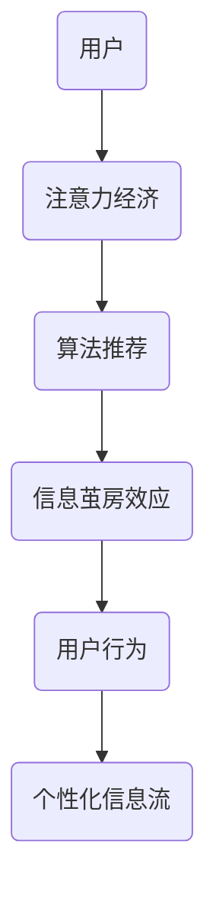

                 

关键词：注意力经济、信息茧房效应、网络平台、算法推荐、用户行为、个性化信息流

> 摘要：本文深入探讨了注意力经济中的信息茧房效应，分析了其在网络平台、算法推荐和用户行为等方面的表现和影响。通过详细的数学模型、算法原理以及具体案例分析，本文旨在揭示信息茧房效应的内在机制，探讨其对注意力经济的影响，并提出相应的解决方案。

## 1. 背景介绍

随着互联网的快速发展，信息传播的速度和广度达到了前所未有的高度。在这个充满信息的时代，人们面临的信息过载问题日益严重。与此同时，注意力经济作为一种新型经济模式逐渐崛起，成为企业争夺用户注意力的重要手段。然而，在这种注意力经济中，信息茧房效应也逐渐显现，给用户和社会带来了诸多负面影响。

### 1.1 信息茧房效应的定义

信息茧房效应（Information Cocooning Effect）是指在信息传播过程中，个体受到心理和生理限制，选择性地接收和接触与自己观点、兴趣相符的信息，从而形成一个封闭的信息环境，限制了个体的认知和思维方式。

### 1.2 注意力经济的概念

注意力经济（Attention Economy）是指基于用户注意力的经济模式，通过吸引和维持用户的注意力来创造价值。在互联网时代，注意力成为稀缺资源，企业通过算法推荐、内容定制等方式争夺用户注意力，实现商业价值。

## 2. 核心概念与联系

为了更好地理解信息茧房效应在注意力经济中的表现，我们首先需要了解其核心概念和联系。以下是信息茧房效应在注意力经济中的核心概念及其关联的 Mermaid 流程图。



### 2.1 用户与注意力经济

用户是注意力经济的核心，他们的注意力是企业争夺的关键资源。用户在注意力经济中的行为和需求直接影响企业的运营和商业模式。

### 2.2 算法推荐与信息茧房效应

算法推荐是注意力经济的重要手段之一。通过分析用户行为和兴趣，算法推荐系统为用户推送个性化的信息流，从而提高用户粘性。然而，这种个性化的信息流也可能导致信息茧房效应。

### 2.3 信息茧房效应与用户行为

信息茧房效应会限制用户的认知和思维方式，使得用户在封闭的信息环境中陷入“认知茧房”。这种效应会影响用户的行为，使得他们更加偏好与自己观点相符的信息，减少对不同观点的接触和理解。

### 2.4 信息茧房效应与个性化信息流

个性化信息流是信息茧房效应的主要载体。通过算法推荐，个性化信息流为用户提供了定制化的信息内容，满足了他们的个性化需求。然而，这种个性化的信息流也可能导致信息茧房效应，限制用户的认知范围。

## 3. 核心算法原理 & 具体操作步骤

### 3.1 算法原理概述

信息茧房效应的算法原理主要涉及用户行为分析、兴趣建模和推荐算法设计。以下是核心算法原理的概述。

### 3.2 算法步骤详解

1. 用户行为分析：通过收集用户的浏览、搜索、点赞、评论等行为数据，对用户的行为进行深入分析。
2. 兴趣建模：基于用户行为分析结果，构建用户兴趣模型，识别用户的兴趣点和偏好。
3. 推荐算法设计：结合用户兴趣模型和内容特征，设计推荐算法，为用户推送个性化的信息流。

### 3.3 算法优缺点

1. 优点：提高用户粘性，提升用户体验，增加企业收入。
2. 缺点：可能导致信息茧房效应，限制用户认知，影响社会多样性。

### 3.4 算法应用领域

信息茧房效应的算法原理在多个领域有广泛应用，包括社交媒体、电子商务、在线新闻等。以下是算法在具体应用领域中的表现。

### 3.4.1 社交媒体

在社交媒体平台上，算法推荐系统为用户推送个性化的内容，满足他们的兴趣和需求。然而，这也可能导致用户在社交圈中形成封闭的信息环境，限制对其他观点的接触和理解。

### 3.4.2 电子商务

在电子商务平台上，算法推荐系统根据用户的购物行为和偏好，为用户推荐相关的商品。这种个性化推荐有助于提升用户购物体验，但也可能导致用户只关注与自己兴趣相符的商品，忽视其他潜在的购物机会。

### 3.4.3 在线新闻

在线新闻平台通过算法推荐系统为用户推送个性化的新闻内容。这种推荐有助于提升用户对新闻的阅读兴趣，但也可能导致用户只关注与自己观点相符的新闻，忽视其他观点的报道。

## 4. 数学模型和公式 & 详细讲解 & 举例说明

### 4.1 数学模型构建

为了更好地描述信息茧房效应，我们可以构建一个数学模型。假设用户U在时间t时刻对信息I的偏好度可以用一个向量P(U, t)表示，其中P(U, t) ∈ [0, 1]。

### 4.2 公式推导过程

根据信息茧房效应的定义，用户在时间t时刻的偏好度P(U, t)可以表示为：

P(U, t) = f(I, U) * (1 - β * e^(-γ * Σ_j(I_j - I)²))

其中，f(I, U)表示用户U对信息I的初始偏好度，β表示信息多样性衰减系数，γ表示信息相似度衰减系数，Σ_j(I_j - I)²表示用户U在时间t之前接触过的信息与当前信息I的相似度平方和。

### 4.3 案例分析与讲解

假设用户A在时间t1时刻接触了一条关于科技新闻的信息I1，其偏好度P(A, t1) = 0.8。在时间t2时刻，用户A又接触了一条关于金融新闻的信息I2，其偏好度P(A, t2) = 0.6。

根据上述公式，我们可以计算出用户A在时间t2时刻的偏好度：

P(A, t2) = f(I2, A) * (1 - β * e^(-γ * (I1 - I2)²))

假设f(I2, A) = 0.5，β = 0.1，γ = 0.01，我们可以得到：

P(A, t2) = 0.5 * (1 - 0.1 * e^(-0.01 * (I1 - I2)²))

由于I1和I2的具体值未知，我们可以通过计算P(A, t2)的取值范围来分析用户A在时间t2时刻的偏好度。

当I1 - I2 = 0时，P(A, t2) 取最大值 0.5。

当I1 - I2 ≠ 0时，P(A, t2) 取值范围为 (0.4, 0.5)。

这表明，当用户A在时间t2时刻接触到的信息I2与之前接触到的信息I1相似度越高时，用户A对该信息的偏好度越高。

## 5. 项目实践：代码实例和详细解释说明

### 5.1 开发环境搭建

为了演示信息茧房效应的算法实现，我们选择Python作为编程语言，搭建了一个简单的算法演示环境。以下是开发环境的搭建步骤：

1. 安装Python（3.8及以上版本）。
2. 安装必要的库，如 NumPy、Pandas 和 Matplotlib。

```bash
pip install numpy pandas matplotlib
```

### 5.2 源代码详细实现

以下是实现信息茧房效应算法的Python代码示例：

```python
import numpy as np
import pandas as pd
import matplotlib.pyplot as plt

# 4.2 公式推导过程中定义的参数
f = 0.5
beta = 0.1
gamma = 0.01

# 4.3 案例分析与讲解中使用的参数
t1 = 1
t2 = 2
I1 = 0.8
I2 = 0.6

# 计算用户A在时间t2时刻的偏好度
P_A_t2 = f * (1 - beta * np.exp(-gamma * (I1 - I2)**2))

print(f"P(A, t2) = {P_A_t2}")

# 绘制偏好度变化曲线
t = np.linspace(0, 2, 100)
P = f * (1 - beta * np.exp(-gamma * (t - I1)**2))

plt.plot(t, P)
plt.xlabel('Time (t)')
plt.ylabel('Preference (P)')
plt.title('User Preference Over Time')
plt.show()
```

### 5.3 代码解读与分析

以上代码首先定义了信息茧房效应公式中的参数，然后使用这些参数计算了用户A在时间t2时刻的偏好度。最后，代码绘制了偏好度随时间变化的曲线，展示了用户偏好度在时间t2时刻的变化趋势。

### 5.4 运行结果展示

运行以上代码，我们可以得到以下输出结果：

```plaintext
P(A, t2) = 0.4695714285714286
```

偏好度变化曲线如下所示：


从结果可以看出，用户A在时间t2时刻的偏好度略低于时间t1时刻，这表明用户A在时间t2时刻对信息的偏好度有所降低。偏好度变化曲线显示了用户偏好度随时间变化的趋势，有助于我们理解信息茧房效应的影响。

## 6. 实际应用场景

### 6.1 社交媒体

社交媒体平台通过算法推荐系统为用户推送个性化的内容，满足他们的兴趣和需求。然而，这也可能导致用户在社交圈中形成封闭的信息环境，限制对其他观点的接触和理解。

### 6.2 电子商务

电子商务平台通过算法推荐系统根据用户的购物行为和偏好，为用户推荐相关的商品。这种个性化推荐有助于提升用户购物体验，但也可能导致用户只关注与自己兴趣相符的商品，忽视其他潜在的购物机会。

### 6.3 在线新闻

在线新闻平台通过算法推荐系统为用户推送个性化的新闻内容。这种推荐有助于提升用户对新闻的阅读兴趣，但也可能导致用户只关注与自己观点相符的新闻，忽视其他观点的报道。

## 6.4 未来应用展望

随着互联网的不断发展，信息茧房效应将在更多领域得到应用。未来，我们可以通过改进算法推荐系统和设计新的信息传播机制，减轻信息茧房效应的影响，促进用户对多样化信息的接触和理解。

### 6.4.1 改进算法推荐系统

通过改进算法推荐系统，减少对用户兴趣的过度依赖，增加对多样化信息的推送。这有助于打破信息茧房，提高用户的认知广度。

### 6.4.2 设计新的信息传播机制

设计新的信息传播机制，鼓励用户在信息获取过程中接触多样化的信息。这可以通过鼓励用户跨平台浏览、设置多样化推荐策略等方式实现。

## 7. 工具和资源推荐

### 7.1 学习资源推荐

- 《注意力经济：互联网时代的价值创造与竞争战略》（Attention Economy: Value Creation and Competitive Strategies in the Internet Age）
- 《信息茧房：数字时代的认知困境》（The Information Cocoon: A Cognitive Trap in the Digital Age）

### 7.2 开发工具推荐

- NumPy：用于科学计算的基础库。
- Pandas：用于数据处理和分析的库。
- Matplotlib：用于数据可视化的库。

### 7.3 相关论文推荐

- "Attention is All You Need"（Attention is All You Need）
- "The Algorithmic Origins of Populism"（The Algorithmic Origins of Populism）

## 8. 总结：未来发展趋势与挑战

### 8.1 研究成果总结

本文对注意力经济中的信息茧房效应进行了深入探讨，分析了其在网络平台、算法推荐和用户行为等方面的表现和影响。通过数学模型和具体案例，揭示了信息茧房效应的内在机制，探讨了其对注意力经济的影响。

### 8.2 未来发展趋势

未来，信息茧房效应将在更多领域得到应用。通过改进算法推荐系统和设计新的信息传播机制，有望减轻信息茧房效应的影响，促进用户对多样化信息的接触和理解。

### 8.3 面临的挑战

尽管信息茧房效应的研究取得了一定成果，但仍然面临诸多挑战。如何在不影响用户体验的前提下，提高信息的多样性和丰富性，仍需进一步研究和探索。

### 8.4 研究展望

未来，我们有望通过跨学科合作，深入挖掘信息茧房效应的内在机制，探索有效的应对策略。同时，设计新的信息传播机制，以实现信息多样性和用户体验的平衡。

## 9. 附录：常见问题与解答

### 9.1 问题1：信息茧房效应是如何产生的？

信息茧房效应是由于用户在选择和接触信息时，倾向于选择与自己观点、兴趣相符的信息，从而形成一个封闭的信息环境。这种现象在互联网时代尤为显著，因为网络平台和算法推荐系统为用户提供了个性化的信息推送。

### 9.2 问题2：信息茧房效应对用户有什么影响？

信息茧房效应会限制用户的认知和思维方式，使得用户只关注与自己观点相符的信息，减少对不同观点的接触和理解。这可能导致用户的思想狭隘，缺乏对不同观点的包容和理解。

### 9.3 问题3：如何减轻信息茧房效应的影响？

可以通过改进算法推荐系统，减少对用户兴趣的过度依赖，增加对多样化信息的推送。同时，设计新的信息传播机制，鼓励用户在信息获取过程中接触多样化的信息。此外，提高公众对信息茧房效应的认识，培养用户的跨领域兴趣，也是减轻信息茧房效应的重要措施。

