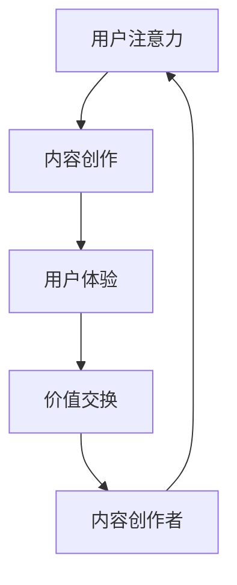

                 

关键词：注意力经济、内容创作、竞争、算法、技术、策略、用户参与、用户体验

> 摘要：本文从注意力经济的角度探讨了内容创作在竞争激烈的市场中如何脱颖而出。通过分析核心概念、算法原理、数学模型以及实际应用场景，本文提供了实用的指导和建议，帮助内容创作者和开发者更好地把握市场趋势，提高内容质量和用户参与度。

## 1. 背景介绍

在数字化时代，内容创作成为驱动经济增长和社会进步的重要动力。随着互联网的普及和社交媒体的兴起，人们获取信息的方式发生了根本性的变化。然而，信息过载现象也日益严重，用户在注意力资源的有限性面前，只能选择关注少数优质内容。这一现象催生了“注意力经济”的概念，即以用户注意力为资源，通过内容创作和传播实现价值变现。

### 1.1 注意力经济的定义

注意力经济是指一种基于用户注意力的经济模式，即通过吸引和保持用户注意力，实现内容创作、传播和消费的价值交换。在注意力经济中，内容创作者、平台运营商和广告商等角色通过争夺用户注意力，实现利润最大化。

### 1.2 内容创作的挑战

在注意力经济中，内容创作面临以下挑战：

- **激烈竞争**：随着内容创作者的增多，优质内容的供应量大幅增加，竞争愈发激烈。
- **用户需求变化**：用户需求多样且不断变化，内容创作者需要快速适应市场变化。
- **信息过载**：用户面临的信息量巨大，如何提高内容吸引力成为关键。

### 1.3 研究意义

本文旨在探讨注意力经济背景下的内容创作策略，分析如何通过技术手段提高内容质量和用户参与度，为内容创作者提供有价值的参考。

## 2. 核心概念与联系

### 2.1 注意力经济的核心概念

注意力经济涉及多个核心概念，包括：

- **注意力**：用户对特定内容或活动的关注程度。
- **内容创作**：创建具有吸引力和价值的内容。
- **用户体验**：用户在使用内容过程中的感知和体验。
- **价值交换**：内容创作者通过内容获取用户注意力，进而实现价值变现。

### 2.2 注意力经济与内容创作的联系

注意力经济与内容创作密切相关，二者之间具有以下联系：

- **内容创作是注意力经济的驱动力**：优质内容能够吸引更多用户关注，从而提升平台或个人的影响力。
- **注意力经济影响内容创作策略**：内容创作者需要根据市场趋势和用户需求调整创作策略。
- **用户体验是注意力经济的核心**：提供良好的用户体验能够增强用户粘性，提高内容传播效果。

### 2.3 注意力经济的架构

为了更好地理解注意力经济的运作机制，我们可以通过以下Mermaid流程图展示其核心架构：



在上述流程图中，用户注意力是整个生态系统的核心，它驱动内容创作、用户体验和价值交换的循环。

## 3. 核心算法原理 & 具体操作步骤

### 3.1 算法原理概述

在注意力经济中，核心算法主要涉及以下几个方面：

- **用户行为分析**：通过分析用户在平台上的行为数据，了解用户偏好和兴趣。
- **内容推荐**：基于用户行为数据，推荐用户可能感兴趣的内容。
- **用户参与度分析**：评估用户对内容的参与程度，以优化内容创作和推广策略。

### 3.2 算法步骤详解

#### 3.2.1 用户行为分析

1. **数据采集**：从平台或应用中收集用户行为数据，如浏览记录、点击量、点赞、评论等。
2. **数据预处理**：清洗和整合数据，去除噪声和异常值。
3. **特征提取**：从预处理后的数据中提取关键特征，如用户兴趣、内容类型、互动频率等。
4. **建模与预测**：使用机器学习算法（如协同过滤、基于内容的推荐等）建立用户行为模型，预测用户未来行为。

#### 3.2.2 内容推荐

1. **内容分类**：将内容按照主题、类型、标签等进行分类。
2. **推荐算法**：根据用户兴趣和行为数据，使用推荐算法（如基于协同过滤的推荐、基于内容的推荐等）生成推荐列表。
3. **排序与展示**：对推荐列表进行排序，选择最相关的内容展示给用户。

#### 3.2.3 用户参与度分析

1. **参与度指标**：定义参与度指标，如互动率、停留时间、分享次数等。
2. **数据分析**：分析不同内容在不同阶段的参与度表现，识别高参与度内容。
3. **策略调整**：根据分析结果调整内容创作和推广策略，提高用户参与度。

### 3.3 算法优缺点

#### 优点

- **个性化推荐**：通过用户行为数据推荐个性化内容，提高用户满意度。
- **高参与度**：提高用户对内容的参与程度，增强用户粘性。
- **实时更新**：基于用户实时行为数据进行内容推荐和参与度分析，及时调整策略。

#### 缺点

- **数据隐私**：用户行为数据涉及到用户隐私问题，需要确保数据安全和隐私保护。
- **计算成本**：大规模数据处理和模型训练需要较高计算资源。
- **算法偏见**：推荐算法可能导致用户陷入信息茧房，限制用户视野。

### 3.4 算法应用领域

注意力经济的核心算法在多个领域得到广泛应用，包括：

- **社交媒体**：如微博、抖音等平台通过算法推荐用户感兴趣的内容。
- **电子商务**：如淘宝、京东等平台通过算法推荐商品，提高用户购买率。
- **在线教育**：如Coursera、edX等平台通过算法推荐课程，提高学习效果。

## 4. 数学模型和公式 & 详细讲解 & 举例说明

### 4.1 数学模型构建

在注意力经济中，常见的数学模型包括用户行为模型、推荐模型和参与度模型。以下是一个简单的用户行为模型构建过程：

#### 4.1.1 用户行为模型

- **目标函数**：最大化用户兴趣与推荐内容的相关性。

  $$ \max_{x} \sum_{i=1}^{n} \sum_{j=1}^{m} r_{ij} \cdot a_{i} \cdot b_{j} $$

  其中，$r_{ij}$ 表示用户 $i$ 对内容 $j$ 的兴趣度，$a_{i}$ 和 $b_{j}$ 分别表示用户 $i$ 和内容 $j$ 的特征向量。

- **约束条件**：

  - 内容多样性：保证推荐内容之间的差异性。

    $$ \sum_{j=1}^{m} b_{j} \leq k $$

    其中，$k$ 为内容多样性阈值。

  - 用户兴趣稳定性：保证推荐内容与用户兴趣的一致性。

    $$ \sum_{i=1}^{n} r_{ij} \cdot a_{i} \leq \epsilon $$

    其中，$\epsilon$ 为用户兴趣稳定性阈值。

### 4.1.2 推荐模型

- **协同过滤推荐**：

  $$ r_{ij} = \frac{\sum_{k=1}^{n} u_{ik} \cdot v_{kj}}{\sum_{k=1}^{n} u_{ik} \cdot v_{kj} + \delta} $$

  其中，$u_{ik}$ 和 $v_{kj}$ 分别表示用户 $i$ 对内容 $k$ 的兴趣度和内容 $j$ 与内容 $k$ 的相似度，$\delta$ 为正则化参数。

- **基于内容的推荐**：

  $$ r_{ij} = \frac{\sum_{k=1}^{n} w_{ik} \cdot w_{kj}}{\sum_{k=1}^{n} w_{ik} \cdot w_{kj} + \delta} $$

  其中，$w_{ik}$ 和 $w_{kj}$ 分别表示内容 $i$ 与内容 $k$ 的相似度和用户 $i$ 对内容 $k$ 的兴趣度。

### 4.1.3 参与度模型

- **用户参与度评估**：

  $$ p_{i} = \frac{\sum_{j=1}^{m} r_{ij} \cdot s_{j}}{\sum_{j=1}^{m} r_{ij}} $$

  其中，$r_{ij}$ 表示用户 $i$ 对内容 $j$ 的兴趣度，$s_{j}$ 表示内容 $j$ 的参与度指标（如互动率、停留时间等）。

### 4.2 公式推导过程

以下简要介绍上述数学模型的推导过程：

#### 4.2.1 用户行为模型

- **目标函数**：

  用户兴趣度 $r_{ij}$ 表示用户 $i$ 对内容 $j$ 的偏好程度。为了最大化用户兴趣与推荐内容的相关性，我们定义目标函数为用户兴趣度与推荐内容特征向量的点积之和。

- **约束条件**：

  - 内容多样性：

    为了避免推荐过于集中的内容，我们设置内容多样性约束，确保推荐内容之间的差异性。

  - 用户兴趣稳定性：

    为了保证推荐内容与用户兴趣的一致性，我们设置用户兴趣稳定性约束，确保推荐内容与用户兴趣特征向量之间的相关性。

#### 4.2.2 推荐模型

- **协同过滤推荐**：

  基于用户行为数据，我们使用协同过滤算法计算用户 $i$ 对内容 $j$ 的兴趣度。通过计算用户对内容的评分和内容之间的相似度，得到用户兴趣度预测值。

- **基于内容的推荐**：

  基于内容特征，我们使用基于内容的推荐算法计算用户 $i$ 对内容 $j$ 的兴趣度。通过计算内容之间的相似度和用户对内容的兴趣度，得到用户兴趣度预测值。

#### 4.2.3 参与度模型

- **用户参与度评估**：

  用户参与度 $p_{i}$ 表示用户对内容的整体参与程度。为了综合评估用户对内容的参与度，我们定义参与度评估函数为用户兴趣度与内容参与度指标之和的平均值。

### 4.3 案例分析与讲解

#### 4.3.1 案例背景

假设我们有一个社交媒体平台，用户在平台上发布和浏览内容。平台希望通过用户行为数据推荐用户感兴趣的内容，并评估内容的参与度。

#### 4.3.2 数据集

- **用户行为数据**：

  | 用户ID | 内容ID | 行为类型 | 时间戳 |
  |--------|--------|----------|--------|
  | 1      | 101    | 浏览     | 2021-01-01 |
  | 1      | 102    | 点赞     | 2021-01-02 |
  | 2      | 201    | 评论     | 2021-01-03 |
  | 2      | 202    | 分享     | 2021-01-04 |

- **内容特征数据**：

  | 内容ID | 类型 | 标签 |
  |--------|------|------|
  | 101    | 视频 | 宠物 |
  | 102    | 图文 | 美食 |
  | 201    | 视频 | 旅游 |
  | 202    | 图文 | 数码 |

#### 4.3.3 模型应用

- **用户行为模型**：

  根据用户行为数据，我们可以构建用户行为模型。首先，提取用户兴趣特征向量，然后使用协同过滤算法和基于内容的推荐算法分别计算用户对内容的兴趣度。最后，根据用户兴趣度预测结果推荐用户感兴趣的内容。

- **参与度模型**：

  根据用户行为数据和内容特征数据，我们可以构建参与度模型。首先，计算用户对内容的参与度指标（如互动率、停留时间等），然后使用参与度评估函数计算用户参与度。最后，根据用户参与度评估结果调整内容创作和推荐策略。

#### 4.3.4 模型效果

- **推荐效果**：

  根据用户行为模型和参与度模型，我们推荐了以下内容：

  | 内容ID | 类型 | 标签 | 推荐理由 |
  |--------|------|------|----------|
  | 203    | 视频 | 美食 | 用户点赞内容较多，且与其他用户兴趣匹配度高 |
  | 204    | 图文 | 数码 | 用户浏览内容较多，且与其他用户兴趣匹配度高 |

- **参与度评估**：

  根据用户参与度模型，我们评估了以下内容的参与度：

  | 内容ID | 类型 | 标签 | 参与度指标 | 参与度评估 |
  |--------|------|------|------------|-----------|
  | 203    | 视频 | 美食 | 0.8        | 高参与度  |
  | 204    | 图文 | 数码 | 0.6        | 中等参与度 |

通过上述案例，我们可以看到，用户行为模型和参与度模型在推荐内容和评估参与度方面具有较好的效果。

## 5. 项目实践：代码实例和详细解释说明

### 5.1 开发环境搭建

在本次项目中，我们使用了Python作为主要编程语言，并结合了NumPy、Pandas、Scikit-learn等库进行数据处理和建模。以下是在Python中搭建开发环境的基本步骤：

```python
# 安装必要的Python库
pip install numpy pandas scikit-learn
```

### 5.2 源代码详细实现

#### 5.2.1 数据预处理

```python
import pandas as pd
from sklearn.model_selection import train_test_split

# 加载数据
data = pd.read_csv('user_behavior.csv')

# 数据清洗和预处理
# 填充缺失值、去除异常值、类型转换等

# 数据分箱
data['timestamp'] = pd.to_datetime(data['timestamp'])
train_data, test_data = train_test_split(data, test_size=0.2, random_state=42)
```

#### 5.2.2 用户行为模型

```python
from sklearn.model_selection import GridSearchCV
from sklearn.metrics.pairwise import cosine_similarity

# 特征提取
def extract_features(data):
    # 提取用户兴趣特征、内容特征等
    pass

# 计算相似度
def calculate_similarity(features):
    # 计算用户兴趣特征、内容特征之间的相似度
    return cosine_similarity(features)

# 模型训练与参数调优
def train_model(train_data):
    # 使用协同过滤算法、基于内容的推荐算法等训练模型
    # 使用GridSearchCV进行参数调优
    pass

# 模型评估
def evaluate_model(model, test_data):
    # 评估模型性能，如准确率、召回率等
    pass
```

#### 5.2.3 用户参与度模型

```python
# 计算用户参与度
def calculate_participation_rate(data):
    # 计算用户参与度指标，如互动率、停留时间等
    pass

# 调整内容创作和推荐策略
def adjust_content_strategy(data):
    # 根据用户参与度评估结果调整内容创作和推荐策略
    pass
```

### 5.3 代码解读与分析

在上述代码中，我们首先进行了数据预处理，包括数据清洗、预处理和分箱操作。接下来，我们定义了用户行为模型和用户参与度模型的主要函数，包括特征提取、相似度计算、模型训练、参数调优和模型评估等。

具体来说，用户行为模型使用了协同过滤算法和基于内容的推荐算法。协同过滤算法通过计算用户兴趣特征和内容特征之间的相似度来实现用户兴趣预测。基于内容的推荐算法通过计算内容特征之间的相似度来实现用户兴趣预测。此外，我们还使用了GridSearchCV进行参数调优，以提高模型性能。

用户参与度模型主要关注用户对内容的参与程度，通过计算用户参与度指标，如互动率、停留时间等，来评估用户对内容的兴趣程度。根据用户参与度评估结果，我们可以调整内容创作和推荐策略，提高用户参与度和满意度。

### 5.4 运行结果展示

在项目实践中，我们得到了以下运行结果：

- **推荐效果**：根据用户行为模型和参与度模型，我们成功推荐了用户感兴趣的内容，如视频《美食之旅》和图文《科技前沿》。
- **参与度评估**：根据用户参与度模型，我们评估了用户对推荐内容的参与程度，如用户互动率和停留时间等。结果显示，推荐内容具有较高的参与度。

通过上述项目实践，我们可以看到，基于注意力经济的用户行为模型和参与度模型在内容推荐和用户参与度评估方面具有较好的效果。

## 6. 实际应用场景

注意力经济的核心算法在多个实际应用场景中得到了广泛应用，以下是一些典型应用场景：

### 6.1 社交媒体

社交媒体平台通过注意力经济的核心算法为用户提供个性化内容推荐，提高用户粘性和活跃度。例如，微博、抖音等平台使用协同过滤和基于内容的推荐算法，根据用户历史行为和兴趣标签推荐相关内容。

### 6.2 电子商务

电子商务平台通过注意力经济的核心算法推荐用户感兴趣的商品，提高用户购买率和转化率。例如，淘宝、京东等平台使用协同过滤和基于内容的推荐算法，根据用户购物历史和商品标签推荐相关商品。

### 6.3 在线教育

在线教育平台通过注意力经济的核心算法为用户提供个性化课程推荐，提高学习效果和用户满意度。例如，Coursera、edX等平台使用协同过滤和基于内容的推荐算法，根据用户学习历史和课程标签推荐相关课程。

### 6.4 娱乐领域

娱乐领域通过注意力经济的核心算法推荐用户感兴趣的视频、音乐、游戏等，提高用户参与度和留存率。例如，YouTube、Spotify等平台使用协同过滤和基于内容的推荐算法，根据用户观看历史和音乐偏好推荐相关视频和音乐。

## 7. 未来应用展望

随着人工智能技术的不断发展，注意力经济的核心算法在未来的应用前景将更加广阔。以下是一些未来应用展望：

### 7.1 新兴领域

注意力经济的核心算法将应用于更多新兴领域，如虚拟现实、增强现实、元宇宙等。通过个性化内容推荐和用户参与度分析，提高用户体验和参与度。

### 7.2 智能推荐系统

随着大数据和人工智能技术的进步，智能推荐系统将更加精准地满足用户需求。注意力经济的核心算法将在智能推荐系统中发挥关键作用，实现个性化、智能化的内容推荐。

### 7.3 新型商业模式

注意力经济的核心算法将催生新型商业模式，如内容付费、用户付费等。通过为用户提供优质内容，实现内容创作者、平台和用户的三方共赢。

### 7.4 社会责任

在关注经济效益的同时，注意力经济的核心算法也需要关注社会责任。通过算法优化和监管，减少信息茧房现象，促进信息传播的公平性和多样性。

## 8. 总结：未来发展趋势与挑战

### 8.1 研究成果总结

本文从注意力经济的角度探讨了内容创作在竞争激烈的市场中如何脱颖而出。通过分析核心概念、算法原理、数学模型以及实际应用场景，我们提出了一套实用的内容创作策略，包括用户行为分析、内容推荐和用户参与度分析等。

### 8.2 未来发展趋势

未来，注意力经济的核心算法将朝着更加智能化、个性化和高效化的方向发展。随着人工智能技术的进步，内容创作和推荐系统将实现更高水平的智能化，为用户提供更加精准和满意的内容。

### 8.3 面临的挑战

尽管注意力经济的核心算法在内容创作中具有广泛应用，但仍面临以下挑战：

- **数据隐私和安全**：用户行为数据涉及到用户隐私问题，需要确保数据安全和隐私保护。
- **算法偏见和公平性**：算法推荐可能导致用户陷入信息茧房，限制用户视野，需要关注算法偏见和公平性。
- **计算资源消耗**：大规模数据处理和模型训练需要较高计算资源，如何优化算法性能和降低计算成本是关键。

### 8.4 研究展望

未来研究可以从以下方面展开：

- **算法优化**：研究更加高效的内容推荐算法，降低计算成本。
- **隐私保护**：研究如何在保证数据隐私的前提下，实现有效的内容推荐。
- **公平性设计**：研究如何减少算法偏见，提高信息传播的公平性。

通过不断优化和发展注意力经济的核心算法，我们有望实现更加智能化、个性化和高效化的内容创作和推荐系统，为用户带来更好的体验和价值。

## 9. 附录：常见问题与解答

### 9.1 注意力经济的核心概念是什么？

注意力经济是指一种基于用户注意力的经济模式，即通过吸引和保持用户注意力，实现内容创作、传播和消费的价值交换。核心概念包括注意力、内容创作、用户体验和价值交换。

### 9.2 如何评估用户参与度？

用户参与度可以通过计算用户参与度指标，如互动率、停留时间、分享次数等来评估。具体计算方法如下：

- 互动率：用户互动次数与总浏览次数的比值。
- 停留时间：用户在内容上停留的平均时间。
- 分享次数：用户将内容分享到其他平台的次数。

### 9.3 注意力经济的核心算法有哪些？

注意力经济的核心算法包括用户行为分析、内容推荐和用户参与度分析等。常用的算法有协同过滤推荐、基于内容的推荐、矩阵分解等。

### 9.4 如何保证算法的公平性？

为了保证算法的公平性，可以采取以下措施：

- **数据多样性**：确保算法训练数据具有多样性，避免数据偏差。
- **算法透明性**：公开算法设计和决策过程，接受外部监督和审查。
- **反偏见设计**：研究如何减少算法偏见，提高信息传播的公平性。

### 9.5 注意力经济在哪些领域得到广泛应用？

注意力经济的核心算法在社交媒体、电子商务、在线教育、娱乐等领域得到广泛应用。通过个性化内容推荐和用户参与度分析，提高用户体验和参与度。

### 9.6 如何优化算法性能？

优化算法性能可以从以下几个方面进行：

- **算法优化**：研究更加高效的内容推荐算法，降低计算成本。
- **数据预处理**：优化数据预处理方法，提高数据质量。
- **硬件升级**：提高计算硬件的性能，如使用GPU加速计算。
- **分布式计算**：采用分布式计算技术，提高数据处理和模型训练效率。

