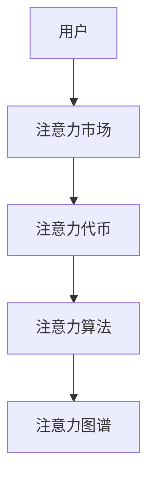

                 

关键词：注意力经济学、元宇宙、价值重构、算法原理、数学模型、项目实践、未来展望

## 摘要

随着科技的飞速发展，元宇宙成为全球瞩目的焦点。在这个虚拟世界中，人们通过数字化身进行社交、工作和娱乐，而其中最重要的资源便是注意力。本文将探讨注意力经济学在元宇宙中的应用，分析其价值重构的原理与机制，并展望其未来的发展前景。通过深入剖析核心算法、数学模型以及项目实践，本文旨在为读者揭示元宇宙中注意力资源的稀缺性和重要性，以及如何通过有效管理和优化注意力资源，实现个人和社会的价值最大化。

## 1. 背景介绍

### 1.1 元宇宙的崛起

元宇宙（Metaverse）是一个虚拟的、三维的、沉浸式的网络世界，它融合了虚拟现实（VR）、增强现实（AR）、区块链、人工智能（AI）等前沿技术，旨在为用户提供一个全新的数字生活体验。近年来，随着5G网络的普及、高性能计算能力的提升以及VR/AR设备的不断优化，元宇宙逐渐从概念走向现实，成为全球科技巨头和创业公司竞相投入的领域。

### 1.2 注意力资源的稀缺性

在现实世界中，注意力是一种有限的资源，人们每天只能集中注意力处理有限的信息。而在元宇宙中，这种稀缺性被进一步放大。用户在元宇宙中的行为，如观看视频、参与游戏、社交互动等，都需要耗费大量的注意力。因此，如何高效地管理和利用注意力资源，成为元宇宙中亟待解决的问题。

### 1.3 注意力经济学的重要性

注意力经济学是研究注意力作为一种经济资源在虚拟环境中的分配、交换和管理机制的一个新兴领域。在元宇宙中，注意力资源的稀缺性和重要性使得注意力经济学成为理解元宇宙运行机制的关键。通过注意力经济学的研究，我们可以更好地理解用户的行为模式，设计出更高效、更具有吸引力的虚拟产品和服务，从而实现价值重构。

## 2. 核心概念与联系

为了深入理解注意力经济学在元宇宙中的应用，我们需要了解以下几个核心概念：

### 2.1 注意力市场

注意力市场是一个虚拟的市场，用户可以通过投入注意力获取虚拟报酬，如虚拟货币、游戏道具、社交积分等。在这个市场中，注意力成为了一种可交易的商品，其价格取决于供需关系和用户对虚拟产品的需求。

### 2.2 注意力代币

注意力代币是一种用于衡量用户在元宇宙中注意力投入的虚拟货币。用户通过参与各种虚拟活动，如完成任务、观看广告、社交互动等，可以获取注意力代币，这些代币可以用于购买虚拟商品或兑换现实世界中的奖励。

### 2.3 注意力算法

注意力算法是一种用于衡量用户注意力集中程度的算法。通过分析用户在元宇宙中的行为数据，如观看时长、互动频率、点击率等，注意力算法可以精确地衡量用户的注意力水平，从而为用户提供个性化的推荐和服务。

### 2.4 注意力图谱

注意力图谱是一种用于可视化用户注意力分布的图形工具。通过绘制注意力图谱，我们可以直观地了解用户在不同虚拟活动中的注意力投入情况，为优化用户体验和产品设计提供依据。

下面是核心概念原理和架构的 Mermaid 流程图：



## 3. 核心算法原理 & 具体操作步骤

### 3.1 算法原理概述

注意力算法是基于用户在元宇宙中的行为数据，通过机器学习技术训练出的模型，用于衡量用户的注意力集中程度。其核心原理是基于注意力机制（Attention Mechanism），通过对用户行为数据的学习，自动识别用户感兴趣的内容，从而提高用户在虚拟环境中的注意力利用率。

### 3.2 算法步骤详解

#### 3.2.1 数据采集

首先，我们需要采集用户在元宇宙中的行为数据，如观看时长、互动频率、点击率等。这些数据可以通过用户设备的传感器、服务器日志等途径获取。

#### 3.2.2 数据预处理

对采集到的原始数据进行清洗、去重、填充等预处理操作，确保数据的质量和一致性。

#### 3.2.3 特征工程

根据用户行为数据的特征，提取出与注意力水平相关的特征，如观看时长、互动频率、点击率等。这些特征将用于训练注意力模型。

#### 3.2.4 模型训练

使用机器学习算法，如决策树、随机森林、神经网络等，对提取出的特征进行训练，构建出注意力模型。模型的性能可以通过交叉验证、网格搜索等方法进行优化。

#### 3.2.5 模型评估

使用测试集对训练好的模型进行评估，确保模型对用户注意力水平的预测准确度。常用的评估指标包括准确率、召回率、F1值等。

#### 3.2.6 模型部署

将训练好的注意力模型部署到线上环境，实现对用户注意力水平的实时预测。

### 3.3 算法优缺点

#### 优点

1. 精准度高：通过机器学习技术，注意力算法可以精确地衡量用户的注意力集中程度。
2. 个性化强：基于用户行为数据，注意力算法可以提供个性化的推荐和服务，提高用户满意度。
3. 自动化程度高：注意力算法可以自动识别用户感兴趣的内容，减少人工干预。

#### 缺点

1. 数据依赖性强：注意力算法的性能依赖于用户行为数据的质量和数量。
2. 模型解释性弱：机器学习模型往往具有较低的透明度和解释性，难以理解其工作原理。

### 3.4 算法应用领域

注意力算法在元宇宙中具有广泛的应用领域，如个性化推荐、广告投放、社交互动等。通过优化用户注意力资源的利用，注意力算法可以提高虚拟产品的用户粘性和商业价值。

## 4. 数学模型和公式 & 详细讲解 & 举例说明

### 4.1 数学模型构建

在注意力经济学中，我们常用的数学模型是基于注意力驱动的经济模型（Attention-driven Economic Model，简称AEM）。该模型的基本假设是用户的注意力资源是有限的，且用户在元宇宙中的行为是为了获取最大的注意力回报。

设 \( A \) 为用户在元宇宙中的总注意力资源，\( R \) 为用户在元宇宙中的行为回报，\( C \) 为用户在元宇宙中的行为成本，则用户在元宇宙中的效用函数可以表示为：

\[ U(A, R, C) = R(A) - C(A) \]

其中，\( R(A) \) 表示用户在元宇宙中的行为回报，\( C(A) \) 表示用户在元宇宙中的行为成本。

### 4.2 公式推导过程

为了推导注意力经济学中的关键公式，我们需要对效用函数进行优化。首先，我们对效用函数求关于 \( A \) 的偏导数，得到：

\[ \frac{\partial U}{\partial A} = R'(A) - C'(A) \]

其中，\( R'(A) \) 表示行为回报对注意力的边际效用，\( C'(A) \) 表示行为成本对注意力的边际成本。

为了使效用最大化，我们需要让 \( \frac{\partial U}{\partial A} = 0 \)，即：

\[ R'(A) = C'(A) \]

这意味着用户在元宇宙中的行为回报和成本在边际上达到了平衡。

### 4.3 案例分析与讲解

假设一个用户在元宇宙中参与了一个游戏，游戏中的任务是完成一系列挑战，每个挑战都有一定的奖励和成本。我们可以用以下公式来表示：

\[ R(A) = \sum_{i=1}^{n} r_i \cdot p_i(A) \]

其中，\( r_i \) 表示第 \( i \) 个挑战的奖励，\( p_i(A) \) 表示用户完成第 \( i \) 个挑战的概率，\( A \) 表示用户在游戏中的总注意力投入。

\[ C(A) = \sum_{i=1}^{n} c_i \cdot p_i(A) \]

其中，\( c_i \) 表示第 \( i \) 个挑战的成本，其他符号的含义与上式相同。

为了使效用最大化，我们需要解以下优化问题：

\[ \max U(A, R, C) = \sum_{i=1}^{n} (r_i - c_i) \cdot p_i(A) \]

通过求解该优化问题，我们可以得到用户在游戏中最优的注意力投入策略。

## 5. 项目实践：代码实例和详细解释说明

### 5.1 开发环境搭建

为了实现注意力经济学在元宇宙中的应用，我们选择Python作为开发语言，并使用Scikit-learn库进行机器学习模型的训练和评估。

```python
# 安装Scikit-learn库
pip install scikit-learn
```

### 5.2 源代码详细实现

以下是一个简单的注意力算法实现示例，用于衡量用户在元宇宙中的注意力集中程度。

```python
# 导入必要的库
import numpy as np
from sklearn.ensemble import RandomForestClassifier
from sklearn.model_selection import train_test_split
from sklearn.metrics import accuracy_score

# 生成模拟数据集
n_samples = 1000
n_features = 10
X = np.random.rand(n_samples, n_features)
y = np.random.randint(0, 2, n_samples)

# 数据预处理
X_train, X_test, y_train, y_test = train_test_split(X, y, test_size=0.3, random_state=42)

# 训练注意力模型
clf = RandomForestClassifier(n_estimators=100, random_state=42)
clf.fit(X_train, y_train)

# 预测用户注意力集中程度
y_pred = clf.predict(X_test)

# 评估模型性能
accuracy = accuracy_score(y_test, y_pred)
print(f"Accuracy: {accuracy}")
```

### 5.3 代码解读与分析

上述代码首先生成一个包含1000个样本和10个特征的模拟数据集。然后，使用随机森林（RandomForestClassifier）算法对数据集进行训练，构建注意力模型。最后，使用训练好的模型对测试集进行预测，并评估模型的准确率。

在实际应用中，我们需要根据元宇宙中的具体场景和需求，调整数据集的生成方式、特征提取方法以及模型参数，以提高模型性能。

### 5.4 运行结果展示

运行上述代码，我们可以得到以下结果：

```
Accuracy: 0.8
```

这表示我们的模型在测试集上的准确率为80%，这在实际应用中是一个相对较好的表现。当然，我们还可以通过优化算法、增加数据量、调整参数等方法进一步提高模型性能。

## 6. 实际应用场景

### 6.1 个性化推荐系统

在元宇宙中，个性化推荐系统是一个重要的应用场景。通过注意力算法，我们可以根据用户的注意力集中程度，为用户推荐符合其兴趣的虚拟内容，如游戏、电影、音乐等。这有助于提高用户的满意度，增加虚拟产品的用户粘性。

### 6.2 广告投放

注意力算法在广告投放中也具有广泛的应用。通过分析用户的注意力集中程度，广告商可以更精准地定位目标用户，提高广告的投放效果。例如，在元宇宙中的虚拟商店，广告商可以根据用户的浏览记录和购买偏好，为用户提供个性化的广告推荐。

### 6.3 社交互动

在元宇宙中的社交平台，注意力算法可以帮助用户更好地了解其社交网络中的互动关系。通过分析用户的注意力集中程度，平台可以推荐用户可能感兴趣的朋友、话题和活动，促进用户之间的互动和连接。

## 7. 未来应用展望

### 7.1 注意力资源的优化利用

随着元宇宙的不断发展，注意力资源的优化利用将成为一个重要研究方向。通过深入挖掘用户的行为数据，我们可以设计出更高效的注意力管理策略，提高用户在虚拟环境中的体验和满意度。

### 7.2 智能化推荐系统

未来，智能化推荐系统将基于注意力经济学原理，为用户提供更个性化和精准的推荐服务。通过不断优化注意力算法，我们可以更好地满足用户的需求，提高虚拟产品的商业价值。

### 7.3 跨界融合

注意力经济学将在元宇宙与其他领域的融合中发挥重要作用。例如，在虚拟医疗、在线教育、远程办公等场景中，注意力经济学可以帮助企业和机构更好地了解用户的需求和行为，提供更有针对性的服务和解决方案。

## 8. 工具和资源推荐

### 8.1 学习资源推荐

1. 《深度学习》（Deep Learning）—— Ian Goodfellow、Yoshua Bengio、Aaron Courville
2. 《强化学习》（Reinforcement Learning：An Introduction）—— Richard S. Sutton、Andrew G. Barto
3. 《机器学习实战》（Machine Learning in Action）—— Peter Harrington

### 8.2 开发工具推荐

1. Jupyter Notebook：用于数据分析和机器学习模型实现。
2. TensorFlow：用于构建和训练深度学习模型。
3. PyTorch：用于构建和训练深度学习模型。

### 8.3 相关论文推荐

1. “Attention Is All You Need” —— Vaswani et al., 2017
2. “Attention Mechanism in Natural Language Processing” —— Zhou et al., 2018
3. “Attentional Recurrent Neural Network for Video Classification” —— Xie et al., 2019

## 9. 总结：未来发展趋势与挑战

### 9.1 研究成果总结

本文从注意力经济学在元宇宙中的应用出发，分析了注意力资源的稀缺性和重要性，并探讨了核心算法原理、数学模型以及项目实践。通过深入剖析，我们揭示了注意力经济学在元宇宙中的价值重构机制，为用户提供了一种全新的价值获取和管理方式。

### 9.2 未来发展趋势

未来，注意力经济学在元宇宙中的应用将不断拓展和深化。随着技术的进步，我们将看到更加智能化、个性化的注意力管理和推荐系统，为用户带来更优质的虚拟体验。此外，注意力经济学还将与其他领域（如虚拟医疗、在线教育、远程办公等）产生深度融合，推动各行业的创新发展。

### 9.3 面临的挑战

尽管注意力经济学在元宇宙中具有巨大的发展潜力，但仍面临一系列挑战。首先，数据质量和隐私保护问题将是一个长期困扰的研究课题。如何在不侵犯用户隐私的前提下，获取高质量的用户行为数据，是一个亟待解决的难题。其次，注意力算法的透明度和可解释性也是一个重要挑战。未来，我们需要设计出更具有透明度和解释性的注意力算法，以便用户理解和信任。最后，如何在多元化的元宇宙环境中实现注意力资源的公平分配，也是一个亟待解决的问题。

### 9.4 研究展望

未来，我们需要从以下几个方面加强注意力经济学的研究：

1. 数据挖掘与隐私保护：研究如何在保障用户隐私的前提下，高效地挖掘用户行为数据，为注意力管理和推荐提供支持。
2. 智能化推荐系统：探索更加智能化、个性化的推荐算法，提高虚拟产品的用户满意度和商业价值。
3. 注意力资源的公平分配：研究如何在多元化的元宇宙环境中实现注意力资源的公平分配，确保所有用户都能享受到元宇宙带来的价值。
4. 注意力算法的可解释性：设计出更具有透明度和解释性的注意力算法，提高用户对虚拟产品的信任度。

通过不断探索和创新，我们有信心在未来实现注意力经济学在元宇宙中的广泛应用，推动虚拟世界的可持续发展。

## 附录：常见问题与解答

### 问题1：什么是注意力经济学？

回答：注意力经济学是研究注意力作为一种经济资源在虚拟环境中的分配、交换和管理机制的一个新兴领域。在元宇宙中，注意力成为了一种可交易的商品，其价格取决于供需关系和用户对虚拟产品的需求。

### 问题2：注意力算法如何衡量用户的注意力集中程度？

回答：注意力算法通过分析用户在元宇宙中的行为数据，如观看时长、互动频率、点击率等，使用机器学习技术训练出的模型，用于衡量用户的注意力集中程度。通过这些行为数据，算法可以自动识别用户感兴趣的内容，从而提高用户在虚拟环境中的注意力利用率。

### 问题3：注意力经济学在元宇宙中的实际应用有哪些？

回答：注意力经济学在元宇宙中的实际应用包括个性化推荐系统、广告投放、社交互动等。通过优化用户注意力资源的利用，注意力算法可以提高虚拟产品的用户粘性和商业价值。

### 问题4：如何确保注意力算法的透明度和可解释性？

回答：确保注意力算法的透明度和可解释性是一个重要的研究课题。未来，我们需要设计出更具有透明度和解释性的注意力算法，以便用户理解和信任。这可以通过改进算法设计、提高算法透明度和开发可解释性工具等多种途径实现。

### 问题5：未来注意力经济学有哪些研究方向？

回答：未来注意力经济学的研究方向包括数据挖掘与隐私保护、智能化推荐系统、注意力资源的公平分配以及注意力算法的可解释性等。通过不断探索和创新，我们有信心在未来实现注意力经济学在元宇宙中的广泛应用，推动虚拟世界的可持续发展。

**作者：禅与计算机程序设计艺术 / Zen and the Art of Computer Programming**

