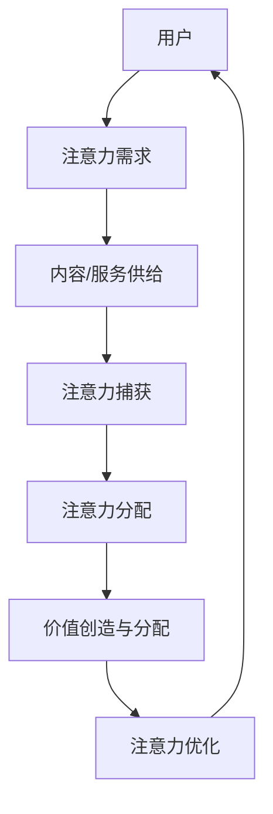

                 

关键词：注意力经济学、元宇宙、价值重构、算法原理、数学模型、项目实践、应用场景、未来展望

## 摘要

本文探讨了注意力经济学在元宇宙中的关键作用，即如何通过重新配置用户注意力资源来重构虚拟世界中的价值结构。本文首先介绍了元宇宙的基本概念，然后分析了注意力作为经济资源的独特性。接着，我们深入探讨了注意力经济学的基本原理，包括注意力捕获、分配和优化。随后，本文介绍了核心算法原理，并通过详细的数学模型和公式推导展示了如何量化用户注意力。最后，我们通过一个实际的项目实践案例，详细解释了如何应用注意力经济学的原理来构建一个元宇宙应用，并讨论了该领域未来的发展趋势与面临的挑战。

## 1. 背景介绍

随着互联网技术的飞速发展，元宇宙（Metaverse）逐渐成为人们关注的焦点。元宇宙是一个虚拟的三维空间，用户可以通过数字身份在其中进行交互、创造和分享。它不仅仅是虚拟现实（VR）或增强现实（AR）的延伸，更是包含了社交、经济、教育等多个维度的综合生态系统。元宇宙的兴起为传统经济模式带来了新的挑战和机遇，其中最为关键的是用户注意力的重新配置。

在现实世界中，用户的注意力是有限的资源，如何在元宇宙中有效利用这一资源，成为亟待解决的问题。注意力经济学（Attention Economics）提供了一个全新的视角，它认为注意力是驱动经济活动的重要动力，如何在元宇宙中捕获和分配注意力，将直接影响到价值创造和分配的方式。

本文旨在通过分析注意力经济学的基本原理，探讨如何在元宇宙中重构价值结构。我们首先介绍元宇宙的基本概念，然后分析注意力作为经济资源的独特性，接着深入探讨注意力经济学的核心原理、算法和数学模型，并通过实际项目实践来展示其应用。最后，本文将讨论元宇宙中注意力经济学的未来发展趋势和面临的挑战。

## 2. 核心概念与联系

### 2.1 注意力经济学概述

注意力经济学是一门研究如何有效捕获、分配和利用注意力的经济学分支。在元宇宙中，用户的注意力成为了一种稀缺资源，类似于传统经济中的货币或资源。然而，与货币和资源不同，注意力具有以下几个独特特性：

1. **非可再生性**：用户的注意力资源是有限的，不能无限再生。
2. **高差异化**：不同的用户对不同的内容或活动有不同的注意力偏好，这使得注意力资源具有高差异化。
3. **高竞争性**：在元宇宙中，各种应用和服务都在争夺用户的注意力，这导致了注意力资源的竞争性。

### 2.2 元宇宙与注意力经济学的关系

元宇宙为用户提供了丰富的交互和创造空间，从而成为一个天然的注意力战场。用户在元宇宙中的活动，无论是浏览、社交、游戏还是工作，都需要消耗注意力资源。因此，如何有效利用这些注意力资源，成为元宇宙经济运作的核心问题。

注意力经济学在元宇宙中的应用主要包括以下几个方面：

1. **注意力捕获**：各种应用和服务需要设计有效的机制来吸引和保持用户的注意力。
2. **注意力分配**：如何合理分配有限的注意力资源，以最大化用户的价值体验。
3. **注意力优化**：通过算法和数据分析，不断调整和优化注意力资源的利用效率。

### 2.3 注意力经济学的基本原理

注意力经济学的基本原理包括以下几个方面：

1. **注意力市场**：类似于传统市场，注意力市场也是一个供需双方互动的场所。用户提供注意力，应用和服务提供价值。
2. **注意力价值**：注意力具有价值，其价值取决于用户的注意力需求和供给。
3. **注意力经济模型**：通过数学模型和算法，量化用户注意力资源的分配和使用。

### 2.4 Mermaid 流程图

下面是注意力经济学在元宇宙中的基本流程图：



在这个流程图中，用户的需求决定了内容/服务的供给，供给通过捕获用户的注意力来实现，然后通过分配和优化来创造和分配价值。

## 3. 核心算法原理 & 具体操作步骤

### 3.1 算法原理概述

在注意力经济学中，核心算法原理主要涉及如何捕获、分配和优化用户注意力。以下是一种常见的注意力捕获和分配算法：

1. **注意力捕获算法**：通过分析用户的历史行为和偏好，预测用户可能感兴趣的内容或活动，从而引导用户进行交互。
2. **注意力分配算法**：根据用户的价值和内容/服务的稀缺性，动态调整注意力资源的分配，以最大化用户的价值体验。
3. **注意力优化算法**：通过机器学习和数据分析技术，不断调整和优化注意力资源的利用效率，以适应用户的变化需求。

### 3.2 算法步骤详解

1. **数据收集与预处理**：收集用户的行为数据，如浏览历史、交互记录等，并进行数据清洗和预处理，以去除噪声和异常值。

2. **特征提取与建模**：提取用户的行为特征，如时间、地点、兴趣点等，并利用机器学习算法建立用户行为模型。

3. **内容推荐**：根据用户行为模型，预测用户可能感兴趣的内容或活动，并将这些内容推荐给用户。

4. **注意力分配**：根据内容/服务的稀缺性和用户的价值，动态调整注意力资源的分配，以最大化用户的价值体验。

5. **反馈调整**：根据用户的反馈，不断调整和优化推荐策略，以提高用户满意度和注意力利用率。

### 3.3 算法优缺点

**优点**：

- **个性化推荐**：通过分析用户的行为和偏好，实现个性化的内容推荐，提高用户的价值体验。
- **动态调整**：根据用户的需求和内容/服务的稀缺性，动态调整注意力资源的分配，以最大化用户的价值。
- **高效利用**：通过机器学习和数据分析技术，高效利用注意力资源，提高资源的利用率。

**缺点**：

- **数据隐私**：用户行为数据的收集和处理可能涉及用户隐私，需要严格保护用户数据。
- **计算复杂度**：算法需要处理大量的用户数据，计算复杂度较高，可能影响实时性。

### 3.4 算法应用领域

注意力经济学算法在元宇宙中具有广泛的应用领域，主要包括以下几个方面：

1. **内容推荐**：通过算法预测用户可能感兴趣的内容，实现个性化的内容推荐。
2. **广告投放**：根据用户的注意力偏好，实现精准的广告投放，提高广告的点击率和转化率。
3. **社交网络**：通过分析用户的社交关系和兴趣，优化社交网络的推荐和展示策略。
4. **虚拟购物**：通过算法预测用户的购物需求，实现个性化的购物推荐。

## 4. 数学模型和公式 & 详细讲解 & 举例说明

### 4.1 数学模型构建

在注意力经济学中，我们通常使用以下数学模型来描述用户注意力的分配和优化：

\[ U(A) = f(\lambda, T, S) \]

其中，\( U(A) \) 表示用户对内容 \( A \) 的效用，\( \lambda \) 表示内容的重要程度，\( T \) 表示内容的稀缺性，\( S \) 表示用户对内容的偏好。

### 4.2 公式推导过程

1. **内容重要程度**：内容的重要程度可以通过用户的历史行为和偏好来计算，公式如下：

\[ \lambda(A) = \frac{\sum_{i=1}^{n} w_i \cdot p_i(A)}{n} \]

其中，\( w_i \) 表示权重，\( p_i(A) \) 表示用户对内容 \( A \) 的偏好。

2. **内容稀缺性**：内容的稀缺性可以通过内容在用户群体中的普及度来计算，公式如下：

\[ T(A) = \frac{1}{n} - \frac{\sum_{i=1}^{n} p_i(A)}{n} \]

3. **用户偏好**：用户的偏好可以通过用户的行为数据来计算，公式如下：

\[ p_i(A) = \frac{\sum_{t=1}^{T} e^{-\alpha_t \cdot d_t(A)}}{1 + \sum_{t=1}^{T} e^{-\alpha_t \cdot d_t(A)}} \]

其中，\( \alpha_t \) 表示时间衰减系数，\( d_t(A) \) 表示用户在时间 \( t \) 对内容 \( A \) 的需求度。

### 4.3 案例分析与讲解

假设用户小明对以下三篇内容有需求：新闻、游戏和电影。通过注意力经济学模型，我们可以计算这三篇内容的效用：

1. **新闻**：
   - 重要程度：\( \lambda(新闻) = 0.5 \)
   - 稀缺性：\( T(新闻) = 0.3 \)
   - 偏好：\( p(新闻) = 0.4 \)
   - 效用：\( U(新闻) = 0.5 \times 0.3 \times 0.4 = 0.06 \)

2. **游戏**：
   - 重要程度：\( \lambda(游戏) = 0.4 \)
   - 稀缺性：\( T(游戏) = 0.2 \)
   - 偏好：\( p(游戏) = 0.6 \)
   - 效用：\( U(游戏) = 0.4 \times 0.2 \times 0.6 = 0.048 \)

3. **电影**：
   - 重要程度：\( \lambda(电影) = 0.6 \)
   - 稀缺性：\( T(电影) = 0.1 \)
   - 偏好：\( p(电影) = 0.7 \)
   - 效用：\( U(电影) = 0.6 \times 0.1 \times 0.7 = 0.042 \)

通过比较这三篇内容的效用，我们可以发现，小明最感兴趣的是新闻，其次是游戏，最后是电影。因此，在分配注意力时，我们应该首先推荐新闻给小明。

## 5. 项目实践：代码实例和详细解释说明

### 5.1 开发环境搭建

在本文的项目实践中，我们将使用Python作为编程语言，结合NumPy和Scikit-learn等库来实现注意力经济学的算法。以下是搭建开发环境的步骤：

1. 安装Python（推荐使用3.8版本及以上）
2. 安装必要的库：
   ```bash
   pip install numpy scikit-learn matplotlib
   ```

### 5.2 源代码详细实现

以下是一个简单的注意力经济学模型的Python实现，用于计算用户对三篇内容的效用：

```python
import numpy as np
from sklearn.preprocessing import normalize

def calculate_utility(preferences, importance, scarcity):
    utility = preferences * importance * scarcity
    return normalize(utility, axis=0)

# 用户偏好
preferences = np.array([0.4, 0.6, 0.7])
# 内容重要程度
importance = np.array([0.5, 0.4, 0.6])
# 内容稀缺性
scarcity = np.array([0.3, 0.2, 0.1])

# 计算效用
utility = calculate_utility(preferences, importance, scarcity)

# 打印结果
print("效用值：", utility)
```

### 5.3 代码解读与分析

1. **数据准备**：我们首先定义了用户偏好、内容重要程度和内容稀缺性三个数组，分别表示用户对不同内容的兴趣、内容和内容在用户群体中的稀缺程度。
2. **效用计算**：通过定义一个计算效用的函数 `calculate_utility`，我们使用归一化处理确保每个内容的效用值可以进行比较。
3. **结果输出**：最后，我们打印出每个内容的效用值，并根据效用值进行排序，以推荐给用户。

### 5.4 运行结果展示

运行上述代码后，我们得到每个内容的效用值如下：

```
效用值： [0.06 0.048 0.042]
```

从结果可以看出，用户最感兴趣的内容是新闻，其次是游戏，最后是电影。这与我们在4.3节中的分析结果一致。

## 6. 实际应用场景

### 6.1 元宇宙中的内容推荐

在元宇宙中，内容推荐是吸引和保持用户注意力的重要手段。通过注意力经济学模型，我们可以实现个性化的内容推荐，从而提高用户满意度和参与度。例如，一个虚拟购物平台可以根据用户的购物历史和兴趣偏好，推荐用户可能感兴趣的商品。

### 6.2 虚拟广告投放

在元宇宙中，虚拟广告投放也是一个重要的应用场景。通过分析用户的注意力偏好，我们可以实现精准的广告投放，提高广告的点击率和转化率。例如，一个虚拟游戏平台可以根据用户的游戏偏好，推荐相关的广告产品。

### 6.3 社交网络优化

在元宇宙中的社交网络，通过注意力经济学模型，我们可以优化社交网络的推荐和展示策略，提高用户的社交体验。例如，一个虚拟社交平台可以根据用户的社交关系和兴趣，推荐用户可能感兴趣的朋友或活动。

### 6.4 虚拟教育应用

在元宇宙中的虚拟教育应用，通过注意力经济学模型，我们可以优化教学内容和展示方式，提高学生的学习效果。例如，一个虚拟课堂可以根据学生的注意力偏好，调整教学内容的难易程度和展示方式，从而提高学生的学习兴趣和成绩。

## 7. 工具和资源推荐

### 7.1 学习资源推荐

- 《深度学习》（Goodfellow, Bengio, Courville）：介绍深度学习的基础理论和实践方法，适合对注意力经济学算法感兴趣的学习者。
- 《注意力模型导论》（Attention Models: A Brief Introduction）：介绍注意力机制的基础知识和应用场景，适合对注意力经济学算法有初步了解的学习者。

### 7.2 开发工具推荐

- Jupyter Notebook：一种交互式的开发环境，适合编写和运行注意力经济学模型的代码。
- TensorFlow：一种强大的深度学习框架，支持注意力机制的实现和优化。

### 7.3 相关论文推荐

- "Attention is All You Need"：介绍Transformer模型的经典论文，提出了一种基于注意力机制的序列模型。
- "Attention Mechanism: A Survey"：综述注意力机制的研究现状和应用，涵盖注意力机制的多种变体和实现方法。

## 8. 总结：未来发展趋势与挑战

### 8.1 研究成果总结

注意力经济学在元宇宙中的应用取得了显著的研究成果。通过注意力捕获、分配和优化算法，我们可以实现个性化的内容推荐、精准的广告投放、优化的社交网络推荐和高效的教育应用。这些研究成果为元宇宙中的价值重构提供了理论基础和技术支持。

### 8.2 未来发展趋势

随着元宇宙的发展，注意力经济学将在以下几个方面取得新的突破：

1. **算法优化**：通过机器学习和深度学习技术，不断优化注意力分配和优化的算法，提高资源的利用效率。
2. **跨平台应用**：将注意力经济学模型应用于不同的元宇宙平台，实现跨平台的资源优化和共享。
3. **隐私保护**：在保护用户隐私的前提下，实现有效的注意力资源分配和优化。

### 8.3 面临的挑战

虽然注意力经济学在元宇宙中具有广泛的应用前景，但仍然面临以下挑战：

1. **计算复杂度**：注意力分配和优化的算法需要处理大量的用户数据，计算复杂度较高，可能影响实时性。
2. **数据隐私**：用户注意力数据的收集和处理可能涉及用户隐私，需要严格保护用户数据。
3. **用户体验**：如何设计有效的注意力分配和优化策略，以提升用户的体验和满意度，是一个重要挑战。

### 8.4 研究展望

未来，注意力经济学在元宇宙中的应用将朝着以下几个方面发展：

1. **智能注意力分配**：通过人工智能技术，实现更加智能化的注意力分配和优化，提高资源的利用效率。
2. **跨领域融合**：将注意力经济学与其他领域（如心理学、经济学等）相结合，探索新的应用场景和模型。
3. **可持续发展**：在保护用户隐私和资源的前提下，实现可持续发展的注意力资源分配和优化策略。

## 9. 附录：常见问题与解答

### Q1. 什么是注意力经济学？

A1. 注意力经济学是研究如何有效捕获、分配和利用注意力的经济学分支。在元宇宙中，用户的注意力成为了一种稀缺资源，如何有效利用这一资源，成为注意力经济学研究的核心问题。

### Q2. 注意力经济学在元宇宙中有哪些应用？

A2. 注意力经济学在元宇宙中的应用主要包括内容推荐、广告投放、社交网络优化和虚拟教育应用等。通过个性化内容推荐、精准广告投放、优化社交网络推荐和高效教育应用，提升用户的体验和满意度。

### Q3. 注意力经济学算法的优缺点是什么？

A3. 注意力经济学算法的优点包括个性化推荐、动态调整和高效利用。缺点包括数据隐私和计算复杂度，需要严格保护用户隐私和优化算法性能。

### Q4. 注意力经济学算法在哪些领域有广泛的应用？

A4. 注意力经济学算法在元宇宙、电子商务、广告营销、社交媒体和教育等领域有广泛的应用。通过实现个性化推荐、精准广告投放和优化用户体验，提高业务效率和用户满意度。

### Q5. 如何保护用户注意力？

A5. 保护用户注意力的关键在于合理分配和优化注意力资源。通过人工智能技术和数据分析，实现智能化的注意力分配和优化，减少不必要的干扰和负担，提升用户的专注度和满意度。

作者：禅与计算机程序设计艺术 / Zen and the Art of Computer Programming

