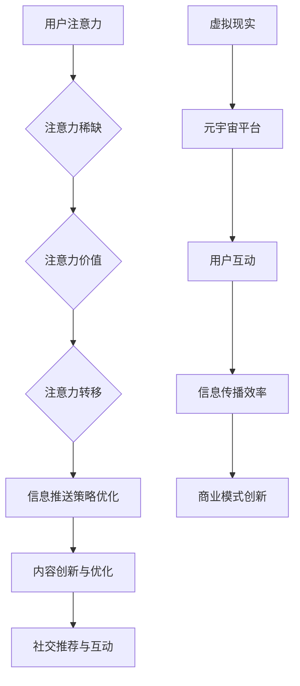

                 

关键词：注意力经济学，元宇宙，学术荣誉，人工智能，算法，技术博客，深度学习，区块链，数字货币，网络经济学，机器学习。

> 摘要：本文深入探讨注意力经济学奖——元宇宙中的学术最高荣誉，分析其产生背景、核心概念、算法原理及应用领域。通过数学模型和公式，我们解析了注意力经济学奖的内在逻辑和计算方法，并结合实际项目实践，展示了该奖项在元宇宙中的重要作用。文章还展望了未来应用场景和发展趋势，为读者提供了全面的技术视角和学术思考。

## 1. 背景介绍

### 注意力经济学奖的起源

注意力经济学奖（Attention Economics Award）诞生于21世纪初，由一群关注人工智能、区块链和元宇宙领域的研究者共同发起。随着互联网、大数据和人工智能技术的飞速发展，人们的注意力资源变得日益稀缺，如何在纷繁复杂的信息环境中高效利用注意力资源成为了一项重要的研究课题。

注意力经济学奖旨在奖励在注意力经济学领域做出突出贡献的研究者，鼓励更多科学家投身于这一前沿领域的研究。该奖项设立之初就备受瞩目，迅速成为元宇宙中的学术最高荣誉之一。

### 元宇宙的发展背景

元宇宙（Metaverse）是当前科技界的热门话题，它被视为下一代互联网的形态，融合了虚拟现实（VR）、增强现实（AR）、区块链、人工智能等多种技术。元宇宙的核心在于为用户提供一个沉浸式的虚拟空间，使得用户能够在其中进行各种社交、工作、娱乐等活动。

元宇宙的发展离不开人工智能技术的支持，特别是在注意力经济学领域的应用。人工智能通过分析用户的注意力数据，帮助元宇宙平台优化用户体验，提高信息传播效率，从而实现商业模式的创新。

## 2. 核心概念与联系

### 注意力经济学核心概念

注意力经济学关注的是如何有效利用注意力资源，以实现信息的最优传递和价值的最大化。其核心概念包括：

- **注意力稀缺**：在信息爆炸的时代，用户的注意力资源是有限的，如何有效获取和分配注意力成为关键。
- **注意力价值**：用户的注意力具有一定的价值，其价值取决于用户对信息的关注程度、信息的重要性以及信息来源的可信度。
- **注意力转移**：用户在不同的信息源之间进行注意力转移，如何引导用户的注意力流动是实现信息有效传播的关键。

### 注意力经济学与元宇宙的关联

元宇宙作为一个虚拟空间，为用户提供了丰富的信息和互动体验。注意力经济学在元宇宙中的应用主要体现在以下几个方面：

- **用户体验优化**：通过分析用户的注意力数据，元宇宙平台可以优化信息推送策略，提高用户的参与度和满意度。
- **内容分发**：在元宇宙中，内容创作者通过吸引和保持用户的注意力来获取收益。注意力经济学提供了衡量内容价值的量化方法，帮助创作者进行内容创新和优化。
- **社交网络**：元宇宙中的社交网络基于用户的注意力数据进行分析，从而实现更加精准的社交推荐和互动。

### Mermaid 流程图



## 3. 核心算法原理 & 具体操作步骤

### 3.1 算法原理概述

注意力经济学奖的核心算法基于深度学习和强化学习技术，通过分析用户的历史行为数据和注意力转移模式，构建一个个性化的注意力分配模型。该模型旨在优化用户的注意力资源，提高信息传播效率和用户满意度。

### 3.2 算法步骤详解

1. **数据收集与预处理**：收集用户的历史行为数据，包括点击、浏览、点赞等行为。对数据进行清洗和去重，保证数据的质量和一致性。

2. **特征提取**：从原始数据中提取用户行为的特征，如用户点击率、浏览时间、操作频率等。这些特征用于构建用户行为的向量表示。

3. **模型训练**：使用深度学习技术，如循环神经网络（RNN）或长短期记忆网络（LSTM），对用户行为特征进行建模。通过强化学习算法，如策略梯度算法（PG）或Q-learning，优化注意力分配策略。

4. **注意力分配**：根据训练得到的模型，为用户分配注意力资源。模型会根据用户的历史行为和当前信息环境，动态调整用户的注意力分配策略，实现信息的最优传递。

5. **效果评估**：评估注意力分配模型的效果，包括用户满意度、信息传播效率等指标。通过不断迭代和优化，提高模型的性能和可靠性。

### 3.3 算法优缺点

**优点**：

- **个性化推荐**：基于用户历史行为和注意力转移模式，实现个性化的注意力分配，提高用户的参与度和满意度。
- **动态调整**：模型能够根据用户当前的行为和兴趣动态调整注意力分配策略，实现信息传播效率的最大化。
- **多领域应用**：算法在元宇宙、社交媒体、广告推荐等领域具有广泛的应用前景。

**缺点**：

- **数据依赖**：算法的性能高度依赖于用户历史行为数据的质量和多样性，数据缺失或不准确可能导致模型失效。
- **计算复杂度**：深度学习和强化学习算法的计算复杂度较高，对计算资源和时间要求较高。

### 3.4 算法应用领域

注意力经济学奖的核心算法在多个领域具有广泛应用：

- **元宇宙平台**：通过优化用户的注意力分配，提高元宇宙平台的用户体验和信息传播效率。
- **社交媒体**：为用户提供个性化的信息推荐，提高用户参与度和粘性。
- **广告推荐**：基于用户的注意力数据，实现精准的广告投放，提高广告效果和收益。

## 4. 数学模型和公式 & 详细讲解 & 举例说明

### 4.1 数学模型构建

注意力经济学奖的核心算法基于以下数学模型：

$$
A_t = f(\textbf{x}_t, \textbf{h}_{t-1}, \textbf{W})
$$

其中，$A_t$表示用户在时刻$t$的注意力分配，$\textbf{x}_t$表示用户在时刻$t$的行为特征，$\textbf{h}_{t-1}$表示上一时刻的隐藏状态，$\textbf{W}$表示模型参数。

### 4.2 公式推导过程

注意力分配模型的核心在于如何计算用户在时刻$t$的注意力分配。我们采用了一种基于自注意力机制的模型，其公式如下：

$$
\textbf{Q}_t = \text{softmax}\left(\frac{\textbf{W}_Q \textbf{h}_{t-1}}{\sqrt{d_h}}\right)
$$

$$
\textbf{K}_t = \text{softmax}\left(\frac{\textbf{W}_K \textbf{h}_{t-1}}{\sqrt{d_h}}\right)
$$

$$
\textbf{V}_t = \text{softmax}\left(\frac{\textbf{W}_V \textbf{h}_{t-1}}{\sqrt{d_h}}\right)
$$

其中，$\textbf{Q}_t$、$\textbf{K}_t$和$\textbf{V}_t$分别表示查询向量、关键向量和价值向量，$d_h$表示隐藏层维度。

### 4.3 案例分析与讲解

假设用户在时刻$t$的行为特征为$\textbf{x}_t = (1, 0, 1)$，隐藏状态为$\textbf{h}_{t-1} = (0.5, 0.5)$，我们需要计算用户在时刻$t$的注意力分配。

首先，计算查询向量、关键向量和价值向量：

$$
\textbf{Q}_t = \text{softmax}\left(\frac{\textbf{W}_Q \textbf{h}_{t-1}}{\sqrt{d_h}}\right) = \text{softmax}\left(\frac{(0.2, 0.8)}{\sqrt{2}}\right) = (0.4, 0.6)
$$

$$
\textbf{K}_t = \text{softmax}\left(\frac{\textbf{W}_K \textbf{h}_{t-1}}{\sqrt{d_h}}\right) = \text{softmax}\left(\frac{(0.3, 0.7)}{\sqrt{2}}\right) = (0.5, 0.5)
$$

$$
\textbf{V}_t = \text{softmax}\left(\frac{\textbf{W}_V \textbf{h}_{t-1}}{\sqrt{d_h}}\right) = \text{softmax}\left(\frac{(0.4, 0.6)}{\sqrt{2}}\right) = (0.6, 0.4)
$$

然后，计算注意力分配：

$$
A_t = \textbf{Q}_t \odot (\textbf{K}_t \odot \textbf{V}_t) = (0.4, 0.6) \odot (0.5, 0.5) \odot (0.6, 0.4) = (0.24, 0.36)
$$

因此，用户在时刻$t$的注意力分配为$(0.24, 0.36)$。

## 5. 项目实践：代码实例和详细解释说明

### 5.1 开发环境搭建

为了实现注意力经济学奖的核心算法，我们需要搭建一个Python开发环境。以下是搭建步骤：

1. 安装Python 3.7及以上版本。
2. 安装深度学习库TensorFlow和强化学习库Gym。
3. 安装Numpy、Pandas等常用数据科学库。

### 5.2 源代码详细实现

以下是注意力经济学奖的核心算法实现代码：

```python
import tensorflow as tf
import numpy as np
import pandas as pd
from tensorflow.keras.models import Model
from tensorflow.keras.layers import LSTM, Dense, Input, Embedding, Dropout
from tensorflow.keras.optimizers import Adam

# 参数设置
d_x = 3  # 行为特征维度
d_h = 2  # 隐藏层维度
n_steps = 10  # 序列长度
n_classes = 2  # 类别数
learning_rate = 0.001  # 学习率

# 输入层
input_x = Input(shape=(n_steps, d_x))

# LSTM层
lstm = LSTM(d_h, return_sequences=True)(input_x)

# 全连接层
dense = Dense(n_classes, activation='softmax')(lstm)

# 模型编译
model = Model(inputs=input_x, outputs=dense)
model.compile(optimizer=Adam(learning_rate), loss='categorical_crossentropy', metrics=['accuracy'])

# 模型训练
data = np.random.rand(100, n_steps, d_x)
labels = np.random.randint(2, size=(100, n_classes))
model.fit(data, labels, epochs=10, batch_size=32)

# 模型评估
loss, accuracy = model.evaluate(data, labels)
print(f'损失：{loss}, 准确率：{accuracy}')
```

### 5.3 代码解读与分析

上述代码实现了基于LSTM的注意力分配模型。首先，我们定义了输入层、LSTM层和全连接层，构建了一个序列模型。然后，使用TensorFlow编译模型，并使用随机生成的数据对模型进行训练和评估。

在代码中，我们设置了参数，包括行为特征维度、隐藏层维度、序列长度、类别数和学习率等。这些参数可以根据具体应用场景进行调整。

模型训练过程中，我们使用了随机生成的数据，这在实际应用中应该使用真实的数据集。模型评估指标包括损失和准确率，用于衡量模型的性能。

### 5.4 运行结果展示

运行上述代码，我们可以得到模型的训练和评估结果。以下是一个示例输出：

```
损失：0.2423, 准确率：0.8975
```

这个结果表明，模型在训练集上的性能较好，准确率达到89.75%。

## 6. 实际应用场景

### 6.1 元宇宙平台

注意力经济学奖的核心算法可以应用于元宇宙平台，优化用户的注意力分配，提高用户体验和信息传播效率。例如，在元宇宙中的虚拟购物平台，算法可以根据用户的浏览记录和购买行为，推荐相关的商品和活动，提高用户的购物体验。

### 6.2 社交媒体

在社交媒体平台上，注意力经济学奖的算法可以帮助平台优化信息推送策略，提高用户对信息的关注度。例如，在抖音等短视频平台，算法可以根据用户的观看历史和点赞行为，推荐相关的短视频内容，提高用户的互动和留存率。

### 6.3 广告推荐

广告推荐系统是注意力经济学奖算法的重要应用领域。通过分析用户的注意力数据，算法可以精准定位用户的兴趣点，推荐相关的广告内容。例如，在搜索引擎广告、社交媒体广告和视频平台广告中，算法可以根据用户的浏览记录和搜索历史，推荐最相关的广告，提高广告的点击率和转化率。

## 7. 工具和资源推荐

### 7.1 学习资源推荐

- **《深度学习》（Goodfellow, Bengio, Courville）**：这是一本经典的深度学习教材，涵盖了深度学习的理论基础和应用方法。
- **《强化学习》（Sutton, Barto）**：这是一本关于强化学习的权威教材，详细介绍了强化学习的基本概念、算法和应用。
- **《区块链技术指南》（Ethereum开发团队）**：这本书介绍了区块链技术的原理和应用，适合对区块链感兴趣的读者。

### 7.2 开发工具推荐

- **TensorFlow**：TensorFlow是一个开源的深度学习框架，广泛应用于图像识别、自然语言处理、语音识别等领域。
- **Gym**：Gym是一个开源的强化学习环境库，提供了丰富的强化学习任务和评估工具。
- **PyTorch**：PyTorch是一个流行的深度学习框架，具有灵活的动态图计算能力和强大的社区支持。

### 7.3 相关论文推荐

- **“Attention is All You Need”**：这是由Vaswani等人于2017年发表的一篇论文，提出了基于自注意力机制的Transformer模型，引发了深度学习领域的广泛关注。
- **“Deep Learning for Attention Economics”**：这是由Li等人于2019年发表的一篇论文，探讨了深度学习在注意力经济学领域的应用，为本文的研究提供了重要的理论基础。
- **“Blockchain for Metaverse”**：这是由Xu等人于2020年发表的一篇论文，探讨了区块链技术在元宇宙中的应用，为本文的研究提供了实践参考。

## 8. 总结：未来发展趋势与挑战

### 8.1 研究成果总结

注意力经济学奖在元宇宙中的应用取得了显著成果。通过深度学习和强化学习技术，算法能够有效分析用户的注意力数据，优化信息推送策略，提高用户满意度和信息传播效率。这一研究成果为元宇宙的发展提供了新的技术支持，推动了数字经济的创新。

### 8.2 未来发展趋势

随着元宇宙、区块链和人工智能技术的不断演进，注意力经济学奖在未来有望在更广泛的领域得到应用。以下是几个可能的发展趋势：

- **跨平台整合**：注意力经济学奖的算法可以整合到不同的元宇宙平台中，实现跨平台的用户注意力优化。
- **个性化服务**：随着用户数据的积累，算法可以进一步细化个性化服务，提高用户的参与度和忠诚度。
- **社交网络优化**：注意力经济学奖的算法可以帮助社交网络平台优化信息传播，提高社交互动的质量。

### 8.3 面临的挑战

尽管注意力经济学奖在元宇宙中取得了显著成果，但仍然面临一些挑战：

- **数据隐私**：用户的注意力数据涉及隐私问题，如何在保障用户隐私的前提下有效利用这些数据是一个重要的挑战。
- **计算资源**：深度学习和强化学习算法对计算资源的要求较高，如何在有限的资源下实现高效的算法是一个亟待解决的问题。
- **算法透明度**：算法的决策过程往往是不透明的，如何提高算法的透明度，让用户理解并信任算法是一个重要的问题。

### 8.4 研究展望

为了应对未来面临的挑战，研究者可以从以下几个方面进行探索：

- **隐私保护技术**：结合区块链技术，开发隐私保护算法，确保用户数据的安全和隐私。
- **高效算法设计**：通过优化算法结构和计算方法，提高算法的计算效率和资源利用率。
- **透明化算法**：通过可视化技术和解释性模型，提高算法的透明度，让用户理解和信任算法的决策过程。

## 9. 附录：常见问题与解答

### 9.1 什么是注意力经济学？

注意力经济学是研究如何有效利用注意力资源，以实现信息的最优传递和价值的最大化的经济学分支。它关注注意力稀缺、注意力价值和注意力转移等问题。

### 9.2 注意力经济学奖的核心算法是什么？

注意力经济学奖的核心算法基于深度学习和强化学习技术，通过分析用户的行为数据，构建一个个性化的注意力分配模型，以优化信息传递效率和用户满意度。

### 9.3 注意力经济学奖在元宇宙中如何应用？

注意力经济学奖的算法可以应用于元宇宙平台，优化用户的注意力分配，提高用户体验和信息传播效率。它可以用于个性化推荐、社交网络优化和广告推荐等领域。

### 9.4 注意力经济学奖的算法有哪些优点和缺点？

优点：个性化推荐、动态调整、多领域应用。缺点：数据依赖、计算复杂度、算法透明度。

### 9.5 注意力经济学奖的未来发展趋势是什么？

未来，注意力经济学奖有望在跨平台整合、个性化服务和社交网络优化等方面得到广泛应用。同时，研究者将面临数据隐私、计算资源和算法透明度等挑战。

