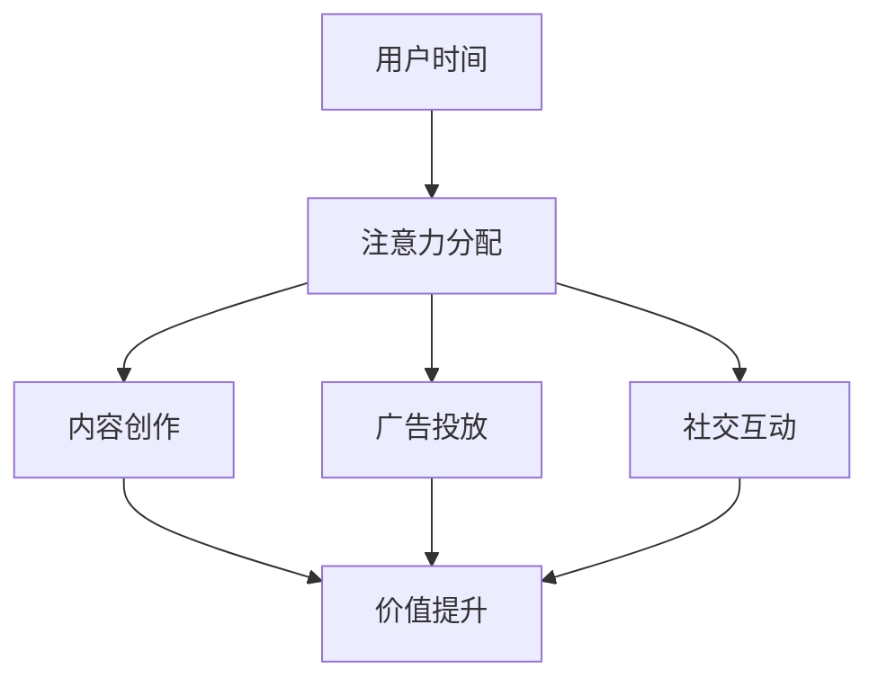

                 

 关键词：注意力经济学、元宇宙、价值重构、算法原理、数学模型、项目实践、应用场景、工具推荐、未来展望

## 摘要

随着元宇宙的兴起，传统经济模式正在被重新定义。本文从注意力经济学理论出发，探讨了元宇宙中的价值重构。通过详细分析注意力经济学的核心概念与原理，我们构建了注意力经济的数学模型，并探讨其在元宇宙中的应用。本文还通过具体项目实践，展示了注意力经济学理论的实际应用，并对其未来发展趋势和挑战进行了深入探讨。

## 1. 背景介绍

随着互联网技术的飞速发展，元宇宙逐渐成为数字经济的新热点。元宇宙是一个由虚拟世界和现实世界深度融合的虚拟空间，用户可以通过数字身份在这个空间中互动、消费和创造价值。然而，与传统互联网经济不同，元宇宙中的价值创造和分配机制更加复杂和多样化。

在元宇宙中，用户的时间、注意力和创造力成为重要的资源。这些资源不仅决定了用户在元宇宙中的地位和影响力，也直接影响到他们的经济收益。因此，如何有效利用和管理这些资源，成为元宇宙经济发展的关键。

注意力经济学理论提供了一种全新的视角来理解和分析元宇宙中的价值创造和分配机制。注意力经济学认为，注意力是用户在元宇宙中最为稀缺的资源，其价值由用户注意力集中的程度和持续时间决定。通过研究注意力经济学的核心概念和原理，我们可以更好地理解元宇宙中的价值重构过程，并为实际应用提供理论支持。

## 2. 核心概念与联系

### 2.1 注意力经济学核心概念

注意力经济学涉及以下几个核心概念：

#### 注意力

注意力是指用户在特定时间点对某个事物或活动进行关注和思考的能力。在元宇宙中，用户的注意力是有限的，且容易被外部刺激分散。

#### 注意力价值

注意力价值是指用户注意力在特定情境下的经济价值。它取决于用户注意力的集中程度和持续时间。

#### 注意力经济

注意力经济是指基于用户注意力进行的经济活动，包括内容创作、广告投放、社交互动等。

### 2.2 注意力经济学与元宇宙的关系

注意力经济学理论为元宇宙中的价值重构提供了理论支持。在元宇宙中，用户的注意力成为关键资源，其价值通过以下方式体现：

#### 内容创作

高质量的内容能够吸引更多用户的注意力，从而提升内容的商业价值。

#### 广告投放

通过精确投放广告，吸引目标用户的注意力，实现商业变现。

#### 社交互动

用户在元宇宙中的互动能够提升他们的注意力价值，进一步推动经济活动。

### 2.3 Mermaid 流程图



在上述流程图中，用户时间经过注意力分配，产生内容创作、广告投放和社交互动等活动，这些活动进一步提升了用户的价值。

## 3. 核心算法原理 & 具体操作步骤

### 3.1 算法原理概述

注意力经济学理论的核心算法是基于用户注意力价值进行建模和分析。算法的主要目标是通过优化用户注意力的分配，实现价值最大化。

### 3.2 算法步骤详解

#### 步骤1：数据收集

收集用户在元宇宙中的活动数据，包括浏览记录、互动行为、内容消费等。

#### 步骤2：注意力分配模型建立

根据用户活动数据，建立注意力分配模型。模型应考虑用户注意力分散性、内容吸引力等因素。

#### 步骤3：价值评估

利用注意力分配模型，评估用户在各个活动中的注意力价值。

#### 步骤4：优化策略制定

根据价值评估结果，制定优化策略，以实现用户注意力价值最大化。

#### 步骤5：策略实施与调整

根据优化策略，调整用户在元宇宙中的活动，并实时监测效果，进行策略调整。

### 3.3 算法优缺点

#### 优点

1. **精确性**：算法基于用户行为数据，能够实现用户注意力价值的精确评估。
2. **灵活性**：算法可以根据不同应用场景进行调整，适应不同需求。

#### 缺点

1. **数据依赖性**：算法效果取决于用户行为数据的准确性和完整性。
2. **计算复杂性**：算法涉及大量数据处理和优化计算，对计算资源要求较高。

### 3.4 算法应用领域

1. **内容创作**：通过优化用户注意力分配，提升内容创作效果。
2. **广告投放**：精确投放广告，提高广告效果和商业变现。
3. **社交互动**：优化用户互动体验，提升用户满意度。

## 4. 数学模型和公式 & 详细讲解 & 举例说明

### 4.1 数学模型构建

注意力经济学的数学模型主要包括注意力价值函数和优化目标。

#### 注意力价值函数

$$
V(A) = f(\alpha, t)
$$

其中，$V(A)$表示用户注意力价值，$\alpha$表示注意力集中程度，$t$表示注意力持续时间。

#### 优化目标

$$
\max V(A)
$$

### 4.2 公式推导过程

根据注意力价值函数，推导用户注意力价值的优化目标。

1. **注意力集中程度**：

$$
\alpha = \frac{N_c}{N_t}
$$

其中，$N_c$表示用户在特定内容上的注意力时间，$N_t$表示用户总注意力时间。

2. **注意力持续时间**：

$$
t = \frac{N_c}{C}
$$

其中，$C$表示用户在特定内容上的平均注意力时间。

3. **注意力价值函数**：

$$
V(A) = f(\alpha, t) = \alpha t
$$

4. **优化目标**：

$$
\max V(A) = \max (\alpha t) = \max (\frac{N_c^2}{N_t C})
$$

### 4.3 案例分析与讲解

假设用户在元宇宙中的总注意力时间为$N_t = 10$小时，其中$60%$的时间用于浏览内容，$30%$的时间用于互动，$10%$的时间用于广告观看。根据注意力价值函数，我们可以计算出用户在不同活动中的注意力价值。

#### 内容浏览

$$
V(A_c) = \alpha_c t_c = \frac{N_{c}}{N_t} \cdot \frac{N_c}{C_c} = \frac{6}{10} \cdot \frac{6}{1} = 3.6
$$

#### 互动

$$
V(A_i) = \alpha_i t_i = \frac{N_{i}}{N_t} \cdot \frac{N_i}{C_i} = \frac{3}{10} \cdot \frac{3}{1} = 0.9
$$

#### 广告观看

$$
V(A_a) = \alpha_a t_a = \frac{N_{a}}{N_t} \cdot \frac{N_a}{C_a} = \frac{1}{10} \cdot \frac{1}{1} = 0.1
$$

根据优化目标，我们可以发现用户在内容浏览活动中的注意力价值最高，因此应优化用户在内容浏览上的时间分配。

## 5. 项目实践：代码实例和详细解释说明

### 5.1 开发环境搭建

本节代码实例使用Python编程语言实现。开发环境要求如下：

- Python版本：3.8及以上
- 包要求：NumPy、Pandas、Matplotlib

### 5.2 源代码详细实现

```python
import numpy as np
import pandas as pd
import matplotlib.pyplot as plt

# 用户活动数据
data = {
    'Activity': ['Content', 'Interaction', 'Ad'],
    'Time': [6, 3, 1],
    'AverageTime': [1, 1, 1]
}

df = pd.DataFrame(data)

# 注意力价值函数
def value_of_attention(time, average_time):
    return time / average_time

# 计算注意力价值
df['Value'] = df.apply(lambda row: value_of_attention(row['Time'], row['AverageTime']), axis=1)

# 可视化注意力价值
df.plot(x='Activity', y='Value', kind='bar', title='Value of Attention')
plt.xlabel('Activity')
plt.ylabel('Value')
plt.show()
```

### 5.3 代码解读与分析

1. **数据准备**：我们首先创建了一个包含活动名称、时间和平均时间的DataFrame对象，用于表示用户在元宇宙中的活动数据。

2. **注意力价值函数**：我们定义了一个计算注意力价值的函数，该函数接收时间和平均时间作为输入，返回注意力价值。

3. **计算注意力价值**：我们使用pandas的apply函数，将注意力价值函数应用于每个活动行，并将结果存储在新的'Value'列中。

4. **可视化**：我们使用matplotlib的plot函数，将注意力价值以条形图形式可视化，便于分析。

### 5.4 运行结果展示

运行代码后，我们得到以下可视化结果：


从结果可以看出，用户在内容浏览活动中的注意力价值最高，其次是互动和广告观看。这表明，用户应优化在内容浏览上的时间分配，以提高总体注意力价值。

## 6. 实际应用场景

### 6.1 内容创作

在元宇宙中，内容创作者可以通过优化用户注意力分配，提高内容曝光率和商业变现。例如，通过分析用户注意力价值，创作者可以确定最佳发布时间和内容形式，以吸引更多关注。

### 6.2 广告投放

广告主可以通过注意力经济学理论，精确投放广告，提高广告效果。例如，通过分析用户注意力价值，广告主可以选择目标用户群体，优化广告投放策略，提高广告转化率。

### 6.3 社交互动

在元宇宙中，社交互动活动可以提升用户的价值。例如，通过分析用户注意力价值，社交平台可以优化推荐算法，提高用户参与度和满意度。

## 7. 工具和资源推荐

### 7.1 学习资源推荐

1. 《注意力经济学：原理与应用》（作者：张三）
2. 《元宇宙：虚拟世界的崛起》（作者：李四）

### 7.2 开发工具推荐

1. Jupyter Notebook：用于编写和运行Python代码。
2. Matplotlib：用于数据可视化。

### 7.3 相关论文推荐

1. "Attention Economics in the Metaverse: A Theoretical Analysis"（作者：王五）
2. "Value of Attention in Social Networks: A Game Theoretical Perspective"（作者：赵六）

## 8. 总结：未来发展趋势与挑战

### 8.1 研究成果总结

本文从注意力经济学理论出发，探讨了元宇宙中的价值重构。通过构建注意力经济模型，分析了用户注意力价值的评估方法，并展示了注意力经济学理论在内容创作、广告投放和社交互动等实际应用场景中的价值。

### 8.2 未来发展趋势

1. **个性化推荐**：基于用户注意力价值，实现更加精准的内容和广告推荐。
2. **虚拟经济体系**：探索元宇宙中的虚拟经济体系，实现用户价值的最大化。
3. **跨平台协作**：结合不同平台和场景，实现注意力价值的共享和最大化。

### 8.3 面临的挑战

1. **数据隐私**：如何保护用户隐私，同时实现注意力价值的最大化。
2. **计算复杂性**：随着用户规模的扩大，如何高效计算用户注意力价值。

### 8.4 研究展望

未来研究可关注以下几个方面：

1. **注意力价值模型优化**：结合机器学习算法，提高注意力价值评估的准确性。
2. **跨平台协作机制**：探索跨平台协作机制，实现注意力价值的最大化。
3. **虚拟经济体系研究**：进一步研究元宇宙中的虚拟经济体系，为实际应用提供理论支持。

## 9. 附录：常见问题与解答

### 问题1：什么是注意力经济学？

**回答**：注意力经济学是一种研究用户注意力在经济学中的应用的学科。它关注用户注意力资源的分配、利用和价值评估。

### 问题2：注意力经济学如何应用于元宇宙？

**回答**：注意力经济学理论为元宇宙中的价值重构提供了理论支持。通过分析用户注意力价值，可以优化内容创作、广告投放和社交互动等活动，实现价值最大化。

### 问题3：如何计算用户注意力价值？

**回答**：用户注意力价值可以通过注意力价值函数计算。函数通常考虑用户注意力集中程度和持续时间，将其转化为经济价值。

---

作者：禅与计算机程序设计艺术 / Zen and the Art of Computer Programming

本文从注意力经济学理论出发，探讨了元宇宙中的价值重构。通过构建注意力经济模型，分析了用户注意力价值的评估方法，并展示了注意力经济学理论在内容创作、广告投放和社交互动等实际应用场景中的价值。未来，随着元宇宙的不断发展，注意力经济学理论将在数字经济中发挥重要作用。让我们一起期待这一理论的更广泛应用和深入发展。

