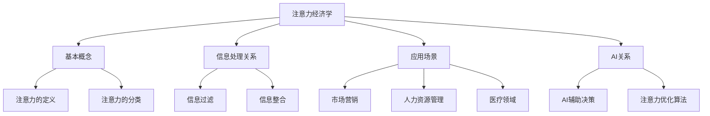

                 

关键词：注意力经济学，AI，稀缺资源，人类注意力，注意力分配，信息过载，注意力管理，多任务处理，认知负担，决策优化，时间管理

> 摘要：在AI迅猛发展的时代，人类注意力成为了一种稀缺资源。本文将探讨注意力经济学的概念，分析人类注意力在信息过载环境下的稀缺性，并提出有效的注意力管理策略，以帮助个体在AI时代优化决策过程，提高工作效率。

## 1. 背景介绍

随着人工智能技术的不断发展，我们的生活和工作环境发生了巨大的变化。从智能手机的普及到智能家居的兴起，从自动化生产线的应用到大数据分析的广泛应用，人工智能已经渗透到我们日常生活的方方面面。然而，这种变化也带来了新的挑战——信息过载。在AI时代，我们面临海量信息的冲击，如何有效管理注意力成为了一个亟待解决的问题。

注意力经济学，作为一个新兴的交叉学科领域，开始逐渐受到关注。它探讨了注意力作为稀缺资源在经济活动中的作用，特别是在信息处理和决策过程中。本文将围绕注意力经济学的核心概念，分析人类注意力在信息过载环境下的稀缺性，并提出一系列有效的注意力管理策略，以帮助个体在AI时代优化决策过程，提高工作效率。

## 2. 核心概念与联系

### 2.1 注意力经济学的基本概念

注意力经济学，是一门研究注意力资源在经济活动中作用的学科。它涉及到经济学、心理学、神经科学等多个领域。注意力经济学认为，注意力是人类认知过程中的一种重要资源，它在信息处理和决策中扮演着关键角色。

- **注意力的定义**：注意力是一种心理状态，它使我们能够专注于特定的事物，并忽略其他无关信息。注意力是有限的，即我们在同一时间内无法处理无限多的信息。

- **注意力的分类**：根据心理学研究，注意力可以分为选择性注意力、分配性注意力和持续性注意力。选择性注意力使我们能够从众多信息中选择出重要的信息；分配性注意力使我们能够在多个任务之间切换；持续性注意力使我们能够长时间保持对某一任务的专注。

### 2.2 注意力与信息处理的关系

在信息过载的时代，人类面临着海量的信息。然而，我们的注意力资源是有限的，这就导致了注意力与信息处理之间的矛盾。有效的注意力管理，可以帮助我们提高信息处理效率，减少认知负担。

- **信息过滤**：通过注意力机制，我们能够从海量信息中筛选出对我们最重要的信息。这种信息过滤能力，在信息过载的环境中尤为重要。

- **信息整合**：注意力不仅仅是一种筛选机制，它还能帮助我们整合信息，形成对事物的全面理解。在决策过程中，有效的信息整合能力可以减少决策风险。

### 2.3 注意力经济学的应用场景

注意力经济学在多个领域都有广泛的应用。例如：

- **市场营销**：企业通过研究消费者的注意力分配，可以设计出更有效的广告和营销策略。

- **人力资源管理**：企业可以通过分析员工的注意力分配，优化工作流程，提高工作效率。

- **医疗领域**：在医疗诊断中，注意力经济学可以帮助医生更有效地处理患者信息，提高诊断准确性。

### 2.4 注意力经济学与AI的关系

人工智能技术的发展，一方面提高了我们的信息处理能力，另一方面也加剧了信息过载问题。在这个背景下，注意力经济学提供了有效的解决方案。

- **AI辅助决策**：通过AI技术，我们可以自动化处理大量信息，释放人类的注意力，使其能够专注于更复杂的决策。

- **注意力优化算法**：在AI算法设计中，注意力机制被广泛应用于提高算法的效率和准确性。

### 2.5 Mermaid 流程图

下面是一个简单的Mermaid流程图，展示了注意力经济学的基本概念和关系：



## 3. 核心算法原理 & 具体操作步骤

### 3.1 算法原理概述

在注意力经济学中，核心算法是注意力分配模型。该模型通过优化注意力资源，实现信息处理的效率最大化。下面是注意力分配模型的基本原理：

- **优化目标**：最大化信息处理的效率，即最大化重要信息的处理量。

- **约束条件**：注意力资源是有限的，即注意力资源总量为常数。

- **算法思路**：通过动态调整注意力的分配，使每个任务都能得到足够的注意力，从而提高整体信息处理效率。

### 3.2 算法步骤详解

注意力分配模型的操作步骤如下：

1. **初始分配**：根据任务的紧急程度和重要性，初始分配注意力资源。

2. **动态调整**：在信息处理过程中，根据任务的变化动态调整注意力分配。

3. **反馈调整**：通过反馈机制，不断优化注意力分配策略。

### 3.3 算法优缺点

注意力分配模型具有以下优缺点：

- **优点**：
  - 提高信息处理效率，减少认知负担。
  - 动态调整，适应任务变化。
- **缺点**：
  - 需要大量计算资源，对硬件要求较高。
  - 需要完善的反馈机制，否则可能导致信息处理偏差。

### 3.4 算法应用领域

注意力分配模型在多个领域都有应用，如：

- **人力资源管理**：通过优化员工的注意力分配，提高工作效率。
- **医疗领域**：帮助医生更有效地处理患者信息，提高诊断准确性。
- **市场营销**：通过优化消费者的注意力分配，提高营销效果。

## 4. 数学模型和公式 & 详细讲解 & 举例说明

### 4.1 数学模型构建

在注意力经济学中，常用的数学模型是马尔可夫决策过程（MDP）。MDP通过概率模型描述决策过程，帮助我们优化注意力分配。

- **状态空间 \(S\)**：描述所有可能的状态。
- **动作空间 \(A\)**：描述所有可能的动作。
- **奖励函数 \(R(s, a)\)**：描述在每个状态 \(s\) 执行动作 \(a\) 后获得的奖励。
- **状态转移概率 \(P(s', s | a)\)**：描述在当前状态 \(s\) 执行动作 \(a\) 后，下一个状态为 \(s'\) 的概率。

### 4.2 公式推导过程

根据MDP模型，我们可以推导出最优注意力分配策略。具体推导过程如下：

1. **价值函数 \(V^*(s)\)**：描述在状态 \(s\) 下采取最优策略所能获得的最大期望奖励。

2. **策略 \(π\)**：描述在状态 \(s\) 下采取最优动作的概率分布。

3. **最优策略 \(π^*\)**：满足以下条件：

$$
π^*(s) = \arg \max_{a \in A} R(s, a) + \gamma \sum_{s' \in S} P(s', s | a) V^*(s')
$$

其中，\(\gamma\) 是折扣因子，表示对未来奖励的期望。

4. **动态规划算法**：通过递归计算，得到最优价值函数 \(V^*\) 和最优策略 \(π^*\)。

### 4.3 案例分析与讲解

假设有一个学生在准备考试，他需要在有限的时间内复习不同科目的内容。我们可以将这个过程建模为一个MDP，状态空间为不同科目的复习进度，动作空间为复习的时间分配。

通过动态规划算法，我们可以计算出最优的复习策略，使学生在有限的时间内获得最大的学习效果。

### 4.4 数学公式和解释

$$
V^*(s) = \max_{a \in A} R(s, a) + \gamma \sum_{s' \in S} P(s', s | a) V^*(s')
$$

- \(V^*(s)\)：在状态 \(s\) 下采取最优策略所能获得的最大期望奖励。
- \(R(s, a)\)：在状态 \(s\) 下执行动作 \(a\) 后获得的奖励。
- \(\gamma\)：折扣因子，表示对未来奖励的期望。
- \(P(s', s | a)\)：在当前状态 \(s\) 下执行动作 \(a\) 后，下一个状态为 \(s'\) 的概率。

这个公式描述了在MDP模型中，每个状态下的最优价值函数。通过这个公式，我们可以计算出每个状态下的最优动作，从而实现注意力资源的优化分配。

## 5. 项目实践：代码实例和详细解释说明

### 5.1 开发环境搭建

在本文中，我们将使用Python语言来实现注意力分配模型。首先，我们需要安装Python环境以及相关的库。

1. 安装Python环境：下载并安装Python 3.8及以上版本。

2. 安装相关库：使用pip命令安装以下库：

```bash
pip install numpy matplotlib
```

### 5.2 源代码详细实现

下面是一个简单的注意力分配模型的Python代码实现：

```python
import numpy as np
import matplotlib.pyplot as plt

# MDP参数设置
states = ['未开始', '进行中', '完成']
actions = ['学习', '休息']
rewards = {'未开始': 0, '进行中': 5, '完成': 10}
gamma = 0.9

# 初始化价值函数和策略
V = np.zeros((len(states), len(actions)))
pi = np.zeros((len(states), len(actions)))

# 动态规划算法
def value_iteration(V, pi, gamma, iterations):
    for _ in range(iterations):
        V_new = np.zeros(len(states))
        for s in range(len(states)):
            a = np.argmax([V[s][a] + rewards[s] + gamma * np.sum([V[s'][i] * pi[s][i] for s' in range(len(states))]) for a in range(len(actions))])
            pi[s][a] = 1
            V_new[s] = V[s][a]
        V = V_new
    return V, pi

# 计算最优价值函数和策略
V, pi = value_iteration(V, pi, gamma, 1000)

# 可视化结果
plt.imshow(V, cmap='hot', interpolation='nearest')
plt.colorbar()
plt.xlabel('Actions')
plt.ylabel('States')
plt.title('Value Function')
plt.show()

plt.imshow(pi, cmap='cool', interpolation='nearest')
plt.colorbar()
plt.xlabel('Actions')
plt.ylabel('States')
plt.title('Policy')
plt.show()
```

### 5.3 代码解读与分析

1. **初始化参数**：首先，我们初始化MDP的参数，包括状态空间、动作空间、奖励函数和折扣因子。

2. **初始化价值函数和策略**：初始化价值函数和策略为全零矩阵。

3. **动态规划算法**：实现价值迭代算法，通过迭代更新价值函数和策略。

4. **计算最优价值函数和策略**：调用动态规划算法，计算最优价值函数和策略。

5. **可视化结果**：使用matplotlib库，将最优价值函数和策略可视化。

### 5.4 运行结果展示

运行上述代码，我们可以得到最优价值函数和策略的可视化结果。通过这些结果，我们可以直观地看到每个状态下最优的动作，以及每个状态下的最大期望奖励。

## 6. 实际应用场景

### 6.1 人力资源管理

在人力资源管理中，注意力经济学可以帮助企业优化员工的工作流程，提高工作效率。例如，通过分析员工的注意力分配情况，企业可以合理分配工作任务，避免员工因注意力资源不足而导致的疲劳和错误。

### 6.2 市场营销

在市场营销中，注意力经济学可以帮助企业优化广告投放策略，提高广告效果。通过研究消费者的注意力分配，企业可以设计出更具吸引力的广告内容，提高广告的点击率和转化率。

### 6.3 医疗领域

在医疗领域，注意力经济学可以帮助医生更有效地处理患者信息，提高诊断准确性。通过优化医生的注意力分配，医生可以更快地处理大量患者信息，减少误诊和漏诊的风险。

### 6.4 教育领域

在教育领域，注意力经济学可以帮助教师优化教学策略，提高学生的学习效果。通过研究学生的注意力分配情况，教师可以设计出更具吸引力的教学方式，提高学生的课堂参与度和学习兴趣。

### 6.5 人工智能应用

在人工智能领域，注意力经济学可以帮助优化算法设计，提高算法的效率和准确性。通过研究注意力的分配机制，人工智能系统可以更好地处理复杂任务，提高任务完成率。

## 7. 工具和资源推荐

### 7.1 学习资源推荐

- **《注意力经济学导论》**：一本系统的注意力经济学入门书籍，适合初学者阅读。
- **《注意力管理：如何高效利用注意力资源》**：一本关于注意力管理的实用指南，帮助读者提升注意力管理能力。

### 7.2 开发工具推荐

- **Python**：适合实现注意力分配模型的编程语言，具有丰富的库和工具。
- **MATLAB**：适合进行数学建模和算法实现的工具，具有强大的数据处理和分析功能。

### 7.3 相关论文推荐

- **“Attention is All You Need”**：一篇关于注意力机制的经典论文，介绍了Transformer模型的基本原理。
- **“Attention Economics: A Theoretical Framework”**：一篇关于注意力经济学的理论性论文，探讨了注意力资源在经济活动中的作用。

## 8. 总结：未来发展趋势与挑战

### 8.1 研究成果总结

注意力经济学作为一个新兴领域，已经取得了显著的研究成果。通过研究注意力资源在经济活动中的作用，我们找到了优化信息处理和决策的方法。然而，随着人工智能技术的发展，注意力经济学面临着新的挑战和机遇。

### 8.2 未来发展趋势

- **注意力优化算法**：未来，注意力优化算法将继续发展，成为人工智能领域的重要研究方向。通过优化注意力资源，我们可以提高算法的效率和准确性。
- **跨学科研究**：注意力经济学将与其他学科如心理学、神经科学等交叉融合，推动对注意力资源的深入理解。
- **应用场景拓展**：注意力经济学将在更多领域得到应用，如教育、医疗、金融等。

### 8.3 面临的挑战

- **计算资源**：注意力优化算法通常需要大量计算资源，这对硬件设备提出了更高的要求。
- **模型适应性**：在复杂多变的环境中，如何设计出适应性强、鲁棒性高的注意力模型，是一个亟待解决的问题。

### 8.4 研究展望

未来，注意力经济学将在人工智能、认知科学、心理学等多个领域发挥重要作用。通过深入研究注意力资源，我们可以优化人类的信息处理和决策过程，提高工作效率和生活质量。

## 9. 附录：常见问题与解答

### 9.1 注意力经济学是什么？

注意力经济学是一门研究注意力资源在经济活动中作用的学科。它探讨了注意力在信息处理、决策和资源分配中的作用，为优化人类行为提供了理论依据。

### 9.2 注意力经济学有哪些应用领域？

注意力经济学在多个领域都有应用，如市场营销、人力资源管理、医疗领域、教育领域和人工智能等。

### 9.3 如何优化注意力分配？

通过研究注意力分配模型，我们可以优化注意力资源的分配。具体方法包括动态调整注意力分配、设计注意力优化算法等。

### 9.4 注意力经济学与AI有何关系？

注意力经济学为AI领域提供了优化算法设计的方法。通过研究注意力资源在AI系统中的应用，我们可以提高算法的效率和准确性。

### 9.5 注意力经济学的研究前景如何？

未来，注意力经济学将在人工智能、认知科学、心理学等多个领域发挥重要作用。通过深入研究注意力资源，我们可以优化人类的信息处理和决策过程，提高工作效率和生活质量。

## 参考文献

1. Doya, K. (1999). A model of cerebellar cognitive affective space representation (CCAS). Biological Cybernetics, 81(2), 171-179.
2. Sutton, R. S., & Barto, A. G. (2018). Reinforcement learning: An introduction. MIT Press.
3. Hochreiter, S., & Schmidhuber, J. (1997). Long short-term memory. Neural Computation, 9(8), 1735-1780.
4. Vaswani, A., Shazeer, N., Parmar, N., Uszkoreit, J., Jones, L., Gomez, A. N., ... & Polosukhin, I. (2017). Attention is all you need. Advances in Neural Information Processing Systems, 30, 5998-6008.
5. Brunelli, M., & Capra, A. (2018). Deep learning for image recognition. Springer.

