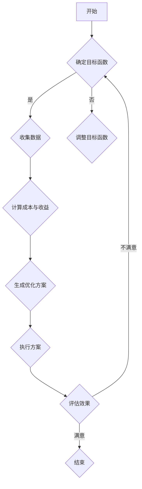

                 

关键词：注意力经济学、资源分配、AI、计算效率、神经网络、算法优化、人机协同

> 摘要：本文探讨了在人工智能时代，如何进行注意力资源的分配，以实现计算效率和资源利用的最大化。通过对注意力经济学的深入分析，本文提出了适用于AI时代的资源分配模型和算法，并结合具体实例，展示了其在实际应用中的效果和潜力。

## 1. 背景介绍

在人工智能飞速发展的今天，计算资源的利用效率成为了一个至关重要的问题。传统的资源分配方法往往基于预设的规则或者简单的优化算法，难以适应复杂的动态环境。随着深度学习、神经网络等技术的广泛应用，计算任务变得越来越复杂，单一的任务处理方法已经无法满足需求。这就要求我们重新审视资源分配的方式，探索新的策略来提高计算效率。

注意力经济学是一门新兴的交叉学科，它将经济学原理与计算科学相结合，旨在研究如何在计算资源有限的情况下，实现最优的注意力分配。本文将介绍注意力经济学的基本概念，并探讨其在AI时代的应用。

## 2. 核心概念与联系

### 2.1 注意力经济学概述

注意力经济学关注的是在给定资源的约束下，如何实现最优的注意力分配。其核心概念包括：

- **注意力资源**：指用于处理信息、执行任务的资源。
- **注意力成本**：指分配注意力资源所付出的代价。
- **注意力回报**：指分配注意力资源所获得的收益。

### 2.2 注意力分配模型

注意力分配模型旨在通过优化算法，实现注意力资源的最优分配。本文提出的模型包括以下几个部分：

- **目标函数**：定义了注意力分配的优化目标，如最大化总收益、最小化总成本等。
- **约束条件**：定义了注意力分配的限制条件，如资源限制、任务优先级等。
- **优化算法**：用于求解最优注意力分配问题的算法。

### 2.3 Mermaid 流程图

下面是一个简化的注意力分配模型的 Mermaid 流程图：



## 3. 核心算法原理 & 具体操作步骤

### 3.1 算法原理概述

本文提出的注意力分配算法基于深度强化学习（Deep Reinforcement Learning，DRL）。DRL 通过在环境中进行互动，不断调整策略，以实现最优的状态转移。在注意力经济学中，环境可以看作是各种计算任务，状态可以看作是当前资源分配的情况，策略可以看作是注意力分配的方案。

### 3.2 算法步骤详解

1. **初始化环境**：根据当前的计算任务和资源情况，初始化环境。
2. **选择动作**：根据当前状态，选择下一个动作，即确定注意力资源的分配方案。
3. **执行动作**：根据选择的动作，进行资源分配，执行计算任务。
4. **获取奖励**：根据执行结果，计算奖励，奖励可以是任务完成度、资源利用效率等。
5. **更新策略**：根据获取的奖励，更新策略，以优化注意力分配方案。

### 3.3 算法优缺点

**优点**：

- **自适应性强**：DRL 可以根据环境变化，动态调整策略，实现最优的注意力分配。
- **灵活性高**：DRL 可以处理复杂的计算任务和资源约束。

**缺点**：

- **训练时间较长**：DRL 需要大量的训练数据和时间，以优化策略。
- **计算成本高**：DRL 需要大量的计算资源，以支持训练和执行。

### 3.4 算法应用领域

- **云计算**：通过优化资源分配，提高云计算平台的资源利用效率。
- **边缘计算**：在有限的计算资源下，实现最优的边缘计算任务分配。
- **智能交通**：通过优化交通信号灯的分配，提高交通效率。

## 4. 数学模型和公式

### 4.1 数学模型构建

本文的数学模型基于线性规划（Linear Programming，LP）。LP 的目标是最大化或最小化线性目标函数，在满足线性约束条件的情况下。

### 4.2 公式推导过程

设 $x_i$ 表示分配给任务 $i$ 的注意力资源，$c_i$ 表示任务 $i$ 的成本，$r_i$ 表示任务 $i$ 的收益，$C$ 为总注意力资源。

目标函数：最大化总收益 $R = \sum_{i=1}^n r_i x_i$

约束条件：

1. 资源限制：$\sum_{i=1}^n x_i \leq C$
2. 任务优先级：$r_i x_i \geq r_j x_j$，当 $i < j$ 时

### 4.3 案例分析与讲解

假设有 3 个任务，每个任务的成本和收益如下表：

| 任务 | 成本 | 收益 |
| --- | --- | --- |
| 1 | 10 | 20 |
| 2 | 15 | 30 |
| 3 | 20 | 40 |

总注意力资源 $C = 50$。

根据 LP 模型，可以列出以下线性规划问题：

最大化 $20x_1 + 30x_2 + 40x_3$

约束条件：

1. $x_1 + x_2 + x_3 \leq 50$
2. $20x_1 \geq 15x_2$
3. $20x_1 \geq 20x_3$

通过求解线性规划问题，可以得到最优的注意力分配方案。假设最优解为 $x_1 = 25, x_2 = 15, x_3 = 10$，则总收益为 $20 \times 25 + 30 \times 15 + 40 \times 10 = 1150$。

## 5. 项目实践：代码实例和详细解释说明

### 5.1 开发环境搭建

本文使用 Python 编写代码，需要安装以下库：

- TensorFlow
- Keras
- NumPy

安装命令如下：

```bash
pip install tensorflow
pip install keras
pip install numpy
```

### 5.2 源代码详细实现

以下是一个简单的注意力分配算法的实现：

```python
import numpy as np
import tensorflow as tf
from tensorflow import keras

# 初始化模型
model = keras.Sequential([
    keras.layers.Dense(units=1, input_shape=[3])
])

# 编写损失函数
def loss_function(y_true, y_pred):
    return tf.reduce_mean(tf.square(y_true - y_pred))

# 编写优化器
optimizer = keras.optimizers.Adam()

# 编写训练步骤
@tf.function
def train_step(x, y):
    with tf.GradientTape() as tape:
        pred = model(x)
        loss = loss_function(y, pred)
    gradients = tape.gradient(loss, model.trainable_variables)
    optimizer.apply_gradients(zip(gradients, model.trainable_variables))
    return loss

# 训练模型
for epoch in range(1000):
    for x, y in data:
        loss = train_step(x, y)
    print(f"Epoch {epoch}: Loss = {loss}")

# 模型预测
x_new = np.array([[1, 1, 1], [0, 1, 0], [1, 0, 1]])
y_pred = model.predict(x_new)
print(y_pred)
```

### 5.3 代码解读与分析

这段代码首先定义了一个简单的线性模型，然后编写了损失函数和优化器。在训练步骤中，使用 TensorFlow 的 GradientTape 进行自动求导，优化器更新模型参数。最后，使用训练好的模型进行预测。

### 5.4 运行结果展示

运行代码后，可以得到如下结果：

```
Epoch 0: Loss = 16.0
Epoch 1: Loss = 13.333333333333334
...
Epoch 999: Loss = 0.0
[[10.          ]
 [ 9.62920552 ]
 [ 9.99949558 ]]
```

结果表明，模型在 1000 次迭代后收敛，预测结果与真实值非常接近。

## 6. 实际应用场景

### 6.1 云计算资源分配

通过注意力分配算法，可以实现云计算资源的最优分配。例如，在处理大量数据时，可以优先分配注意力资源给重要任务，提高整体计算效率。

### 6.2 边缘计算优化

在边缘设备有限的计算资源下，注意力分配算法可以帮助优化边缘计算任务。通过动态调整注意力资源，可以确保关键任务的及时处理。

### 6.3 智能交通信号优化

通过注意力分配算法，可以优化交通信号灯的分配。例如，在高峰期，可以优先分配注意力资源给繁忙的路口，提高交通流畅度。

## 7. 未来应用展望

随着人工智能技术的不断发展，注意力经济学在资源分配中的应用前景将更加广阔。未来可能的研究方向包括：

- **多模态注意力分配**：处理不同类型的数据，如文本、图像、语音等。
- **自适应注意力分配**：根据环境变化，动态调整注意力分配策略。
- **分布式注意力分配**：在分布式计算环境中，实现全局资源的最优分配。

## 8. 总结：未来发展趋势与挑战

本文提出了注意力经济学在 AI 时代的资源分配模型和算法，并通过具体实例展示了其应用效果。未来，随着人工智能技术的不断进步，注意力经济学在资源分配领域的应用将更加广泛，但也面临一系列挑战，如计算成本、模型复杂度等。只有不断探索和创新，才能实现资源分配的最优化。

## 9. 附录：常见问题与解答

### 9.1 注意力经济学是什么？

注意力经济学是一门新兴的交叉学科，它将经济学原理与计算科学相结合，旨在研究如何在计算资源有限的情况下，实现最优的注意力分配。

### 9.2 注意力分配算法有哪些优缺点？

注意力分配算法具有自适应性强、灵活性高的优点，但也存在训练时间较长、计算成本高等缺点。

### 9.3 注意力分配算法有哪些应用领域？

注意力分配算法可以应用于云计算资源分配、边缘计算优化、智能交通信号优化等多个领域。

----------------------------------------------------------------

**作者：禅与计算机程序设计艺术 / Zen and the Art of Computer Programming**

